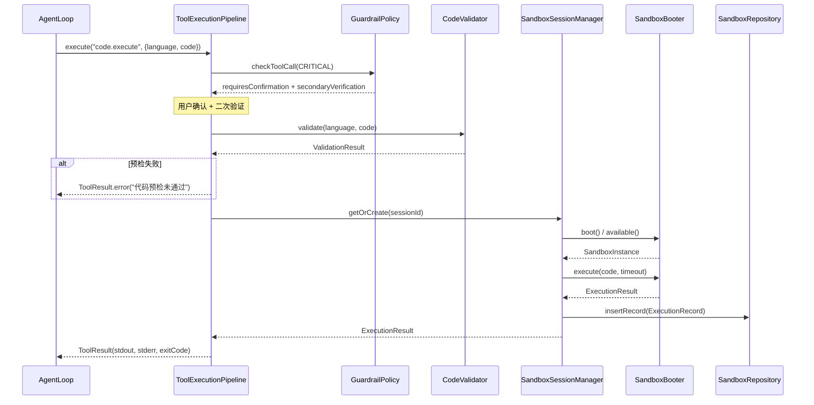

# 代码执行沙箱架构设计

> **文档性质**：深度架构设计文档（Developer-Facing）
> **目标读者**：核心开发者、架构评审者
> **模块归属**：`com.lifepilot.sandbox`
> **最后更新**：2026-02
> **从属关系**：本文档从 [ARCHITECTURE.md](../ARCHITECTURE.md) 拆分而来，聚焦代码执行沙箱的完整设计。

---

## 目录

- [1. 设计哲学与原则](#1-设计哲学与原则)
- [2. 前沿研究与竞品分析](#2-前沿研究与竞品分析)
- [3. 整体架构](#3-整体架构)
- [4. SandboxBooter — 沙箱启动器抽象](#4-sandboxbooter--沙箱启动器抽象)
- [5. CodeValidator — 代码预检](#5-codevalidator--代码预检)
- [6. SandboxSession — 会话级实例管理](#6-sandboxsession--会话级实例管理)
- [7. 护栏集成与安全模型](#7-护栏集成与安全模型)
- [8. 持久化与审计](#8-持久化与审计)
- [9. 配置参考](#9-配置参考)

---

## 1. 设计哲学与原则

### 1.1 核心命题：安全优先的本地代码执行

AI Agent 执行用户提供的代码是高价值能力（数据处理、计算、脚本自动化），但也是最高风险操作。
LifePilot 的核心命题是：**在保证安全隔离的前提下，提供尽可能低门槛的代码执行体验**。

```
传统方案（无隔离）：
  Agent 直接调用 Runtime.exec() → 代码在宿主进程中执行
  问题：任意文件读写、网络访问、系统命令，安全风险极高

LifePilot 方案（纵深防御）：
  CodeValidator 预检 → GuardrailPolicy CRITICAL 审批 → SandboxBooter 隔离执行
  优势：多层安全屏障，用户可选隔离强度
```

### 1.2 五条核心设计原则

#### 原则 1：纵深防御，多层安全屏障

代码执行经过三道安全关卡：CodeValidator 静态预检（拦截已知危险模式）→ GuardrailPolicy CRITICAL 级审批（用户确认 + 二次验证）→ SandboxBooter 运行时隔离（进程/容器级别）。任何一层拦截即终止执行。

#### 原则 2：SandboxBooter 抽象，可插拔隔离策略

借鉴 AstrBot Shipyard 的 Booter 抽象模式，定义统一的 `SandboxBooter` sealed interface。默认提供 ProcessBooter（基于 ProcessBuilder，零外部依赖）和 DockerBooter（基于 Docker，强隔离）。用户根据安全需求和部署环境选择。

#### 原则 3：会话级实例复用，避免冷启动开销

借鉴 AstrBot 的会话级沙箱管理，同一会话内的多次代码执行复用同一个沙箱实例。沙箱实例有 TTL（默认 10 分钟），每次操作自动续期。空闲超时后自动销毁，释放资源。

#### 原则 4：与工具系统深度集成

代码执行作为 `BuiltinTool` 注册到 `DynamicToolRegistry`，通过 `ToolExecutionPipeline` 执行。Agent 无需感知沙箱细节，只需调用 `code.execute` 工具。风险等级标记为 CRITICAL，自动触发护栏审批流程。

#### 原则 5：全链路审计，执行可追溯

每次代码执行的完整信息（代码内容、预检结果、执行输出、资源消耗、退出码）写入 SQLite 审计日志。结合 TraceRecorder 实现端到端可追溯。

---

## 2. 前沿研究与竞品分析

### 2.1 调研的开源项目与前沿技术

| 项目/技术 | 核心理念 | 与 LifePilot 的关系 |
|-----------|---------|-------------------|
| [E2B](https://e2b.dev) | Firecracker microVM 沙箱，~150ms 启动，200M+ 沙箱实例，Fortune 100 采用 | 云端托管方案，LifePilot 本地优先不适用，但借鉴其 SDK 设计和超时控制 |
| [Daytona](https://daytona.io) | Docker 容器沙箱，90ms 冷启动，支持 Computer Use | 借鉴其极速启动优化和 File/Execute API 设计 |
| [Modal](https://modal.com) | gVisor 用户态内核隔离，Python 优先，GPU 弹性伸缩 | gVisor 隔离思路可参考，但 LifePilot 不需要 GPU 场景 |
| [Sprites (Fly.io)](https://sprites.dev) | 持久化 VM + 即时 Checkpoint/Restore，Firecracker 隔离 | 借鉴 Checkpoint 思路用于长时间沙箱会话保存 |
| [Northflank](https://northflank.com) | BYOC 部署 + Kata/gVisor microVM，企业级 VPC 隔离 | 借鉴分层隔离策略（容器 → gVisor → microVM） |
| [AstrBot Shipyard](https://github.com/AstrBotDevs/AstrBot) | Booter 抽象 + 会话级实例管理 + 技能脚本同步 | 直接借鉴 Booter 抽象模式和会话复用机制 |
| [Google nsjail](https://github.com/google/nsjail) | Linux namespace + cgroup + seccomp-bpf 轻量进程隔离 | ProcessBooter 的进阶隔离方案（Linux 环境） |
| [Bubblewrap](https://github.com/containers/bubblewrap) | 非特权用户态沙箱，Flatpak 底层隔离 | 类似 nsjail 的轻量替代方案 |
| [Docker Sandboxes](https://www.docker.com/blog/docker-sandboxes-a-new-approach-for-coding-agent-safety/) | Docker Desktop 内置 Agent 沙箱，容器级隔离 + 文件系统作用域 | 验证了 Docker 容器作为 Agent 沙箱的可行性 |
| [GraalVM Polyglot](https://www.graalvm.org/) | JVM 内多语言沙箱，Truffle 框架限制 Guest 语言访问 | 未来可选的 JVM 内轻量隔离方案（JavaScript/Python） |

Content was rephrased for compliance with licensing restrictions.

### 2.2 隔离技术对比

| 隔离技术 | 安全强度 | 启动速度 | 资源开销 | 外部依赖 | 适用场景 |
|---------|---------|---------|---------|---------|---------|
| ProcessBuilder（无额外隔离） | ★★☆☆☆ | <10ms | 极低 | 无 | 可信代码、开发调试 |
| ProcessBuilder + 临时目录 + 超时 | ★★★☆☆ | <10ms | 低 | 无 | 默认方案，一般场景 |
| nsjail / Bubblewrap | ★★★★☆ | <50ms | 低 | Linux 原生工具 | Linux 生产环境 |
| Docker 容器 | ★★★★☆ | 500ms~2s | 中 | Docker Engine | 强隔离需求 |
| Firecracker microVM | ★★★★★ | ~150ms | 中高 | KVM + Firecracker | 最高安全需求 |
| GraalVM Polyglot | ★★★☆☆ | <5ms | 低 | GraalVM 运行时 | JVM 内 JS/Python 执行 |

### 2.3 关键设计决策及理由

| 决策 | 选择 | 替代方案 | 理由 |
|------|------|---------|------|
| 默认隔离方案 | ProcessBooter（ProcessBuilder + 临时目录 + 超时） | Docker 容器 | 零外部依赖，LifePilot 单 JAR 部署理念；Docker 作为可选增强 |
| 沙箱抽象 | sealed interface SandboxBooter | 策略模式 / 工厂模式 | sealed 编译期穷举，新增 Booter 类型时编译器强制处理所有分支 |
| 会话管理 | 会话级实例复用 + TTL 自动销毁 | 每次执行创建新实例 | 减少冷启动开销，同一会话内保持执行上下文（如已安装的依赖） |
| 代码预检 | 正则模式匹配 + 可配置规则 | AST 解析 / 字节码分析 | 多语言支持（Python/JS/Shell），正则足够覆盖常见危险模式 |
| 安全审批 | CRITICAL 风险等级 + 用户确认 + 二次验证 | 自动执行 / 仅日志 | 代码执行是最高风险操作，必须用户明确授权 |
| 审计存储 | SQLite 表 + Flyway 迁移 | 文件日志 / 内存 | 结构化查询、与现有持久化方案一致 |

### 2.4 Post-JSM 时代的 Java 沙箱策略

Java Security Manager（JSM）已在 Java 17 标记为 deprecated，Java 24 正式移除。当前 Java 生态的共识是：**不再依赖 JVM 内沙箱机制，转向 OS 级外部隔离**。

LifePilot 的策略完全符合这一趋势：
- **外部隔离（强沙箱）**：ProcessBuilder 进程隔离 / Docker 容器隔离 / nsjail namespace 隔离
- **JVM 内技术（浅层防护）**：CodeValidator 静态预检作为第一道防线，不依赖 JSM
- **未来可选**：GraalVM Polyglot 为 JavaScript/Python 提供 JVM 内沙箱（Truffle 框架），安全性优于 JSM

### 2.5 LifePilot 差异化定位

相比调研的云端沙箱平台（E2B / Daytona / Modal），LifePilot 沙箱的独特定位：

1. **本地优先** — 不依赖云端 API，代码在用户本机执行，隐私数据不出本地
2. **零外部依赖默认方案** — ProcessBooter 不需要 Docker / nsjail / 任何额外安装
3. **工具系统原生集成** — 作为 BuiltinTool 注册，通过 ToolExecutionPipeline 执行，护栏自动生效
4. **渐进式安全** — 从 ProcessBooter（开发）→ DockerBooter（生产）→ 未来 nsjail/microVM，按需升级

---

## 3. 整体架构

### 3.1 分层架构图

```
┌─────────────────────────────────────────────────────────────────┐
│                    代码执行沙箱架构                                │
│                                                                 │
│  ┌───────────────────────────────────────────────────────────┐  │
│  │           SandboxAutoConfiguration                        │  │
│  │     （Spring Bean 注册 + 依赖注入 + 生命周期管理）           │  │
│  ├───────────────────────────────────────────────────────────┤  │
│  │                                                           │  │
│  │  ┌─────────────────┐  ┌─────────────────────────────┐    │  │
│  │  │ CodeExecuteTool │  │ SandboxSessionManager       │    │  │
│  │  │ BuiltinTool     │  │ 会话级实例管理 + TTL 续期    │    │  │
│  │  │ CRITICAL 风险   │  │ ConcurrentHashMap 缓存      │    │  │
│  │  └────────┬────────┘  └──────────┬──────────────────┘    │  │
│  │           │                      │                        │  │
│  │  ┌────────┴────────┐  ┌─────────┴──────────────────┐    │  │
│  │  │ CodeValidator   │  │ SandboxBooter              │    │  │
│  │  │ 静态预检         │  │ sealed interface           │    │  │
│  │  │ 危险模式匹配     │  │ Process / Docker           │    │  │
│  │  └─────────────────┘  └────────────────────────────┘    │  │
│  │                                                           │  │
│  │  ┌─────────────────────────────────────────────────┐     │  │
│  │  │ SandboxRepository          ExecutionRecord       │     │  │
│  │  │ SQLite 审计日志             执行结果 record        │     │  │
│  │  │ Flyway V16 迁移                                  │     │  │
│  │  └─────────────────────────────────────────────────┘     │  │
│  │                                                           │  │
│  ├───────────────────────────────────────────────────────────┤  │
│  │              外部依赖（已完成模块）                          │  │
│  │  DynamicToolRegistry / ToolExecutionPipeline              │  │
│  │  GuardrailPolicy / RiskLevel.CRITICAL                     │  │
│  │  TraceRecorder / JdbcTemplate                             │  │
│  └───────────────────────────────────────────────────────────┘  │
└─────────────────────────────────────────────────────────────────┘
```

### 3.2 包结构

```
com.lifepilot.sandbox
├── config/
│   ├── SandboxConfigProperties.java     // @ConfigurationProperties("lifepilot.sandbox")
│   └── SandboxAutoConfiguration.java    // Spring AutoConfiguration
├── model/
│   ├── SandboxBooter.java               // sealed interface（Process / Docker）
│   ├── ExecutionRequest.java            // 执行请求 record
│   ├── ExecutionResult.java             // 执行结果 record
│   ├── ExecutionRecord.java             // 审计记录 record
│   ├── SandboxState.java               // 沙箱实例状态枚举
│   └── Language.java                    // 支持的语言枚举
├── validator/
│   └── CodeValidator.java               // 代码预检器
├── session/
│   └── SandboxSessionManager.java       // 会话级实例管理
├── booter/
│   ├── ProcessBooter.java               // ProcessBuilder 轻量沙箱
│   └── DockerBooter.java                // Docker 容器强隔离沙箱
├── tool/
│   └── CodeExecuteTool.java             // BuiltinTool 注册
└── repository/
    └── SandboxRepository.java           // SQLite 审计持久化
```

### 3.3 执行流程



---

## 4. SandboxBooter — 沙箱启动器抽象

### 4.1 sealed interface 设计

```java
public sealed interface SandboxBooter permits ProcessBooter, DockerBooter {
    /** 启动沙箱实例。 */
    CompletableFuture<Void> boot(SandboxConfig config);

    /** 检查沙箱实例是否可用。 */
    boolean available();

    /** 在沙箱中执行代码。 */
    ExecutionResult execute(ExecutionRequest request);

    /** 关闭沙箱实例，释放资源。 */
    void shutdown();

    /** 获取沙箱类型标识。 */
    String type();
}
```

### 4.2 ProcessBooter — 轻量级进程沙箱（默认方案）

基于 Java `ProcessBuilder`，零外部依赖，适用于大多数场景。

**隔离措施**：
- **文件系统隔离**：每次执行在独立临时目录中运行，执行完毕后清理
- **超时控制**：`Process.waitFor(timeout, TimeUnit.SECONDS)`，超时强制 `destroyForcibly()`
- **环境变量清洗**：只传递必要的 PATH 和语言运行时变量，清除 HOME / USER / API_KEY 等敏感变量
- **工作目录限制**：`ProcessBuilder.directory()` 设置为临时目录，代码无法访问宿主文件系统
- **输出截断**：stdout / stderr 限制最大字节数（默认 64KB），防止内存溢出

**执行流程**：
```
1. 创建临时目录 /tmp/lifepilot-sandbox-{uuid}/
2. 将代码写入临时文件（如 script.py / script.js / script.sh）
3. 构建 ProcessBuilder：
   - command: [python3, script.py] / [node, script.js] / [bash, script.sh]
   - directory: 临时目录
   - environment: 清洗后的环境变量
   - redirectErrorStream: false（分别捕获 stdout 和 stderr）
4. 启动进程，Virtual Thread 异步读取 stdout / stderr
5. waitFor(timeout) → 正常退出 / 超时 destroyForcibly()
6. 构建 ExecutionResult(stdout, stderr, exitCode, durationMs)
7. 清理临时目录
```

**局限性**：
- 无法限制 CPU / 内存使用（需要 cgroup 或 Docker）
- 无法限制网络访问（需要 namespace 或 Docker）
- 代码可以通过相对路径尝试访问临时目录外的文件（依赖 OS 权限控制）

### 4.3 DockerBooter — 容器级强隔离沙箱（可选方案）

基于 Docker Engine API（通过 docker-java 客户端库），提供完整的资源隔离。

**隔离措施**：
- **文件系统隔离**：容器内独立文件系统，仅挂载临时工作目录（只读宿主 + 读写工作区）
- **资源限制**：CPU（`--cpus`）、内存（`--memory`）、磁盘（`--storage-opt`）
- **网络隔离**：默认 `--network none`，完全断网；可配置允许特定网络访问
- **用户隔离**：容器内以非 root 用户运行（`--user`）
- **只读根文件系统**：`--read-only`，仅工作目录可写
- **超时控制**：容器级 `--stop-timeout`，超时强制 `docker kill`
- **自动清理**：`--rm` 标志，容器退出后自动删除

**预构建镜像**：
```
lifepilot/sandbox-python:3.12    — Python 3.12 + pip + 常用数据处理库
lifepilot/sandbox-node:22        — Node.js 22 + npm
lifepilot/sandbox-shell:latest   — Alpine Linux + 常用 Shell 工具
```

**执行流程**：
```
1. 检查 Docker Engine 可用性（docker info）
2. 拉取/检查预构建镜像
3. 创建容器：
   - image: lifepilot/sandbox-{language}
   - cmd: [python3, /workspace/script.py]
   - binds: [临时目录:/workspace:rw]
   - networkMode: none
   - memory: 256MB（可配置）
   - cpuQuota: 100000（1 核，可配置）
   - readonlyRootfs: true
   - user: "1000:1000"
4. 启动容器，流式读取日志（stdout / stderr）
5. 等待容器退出 / 超时 kill
6. 获取退出码，构建 ExecutionResult
7. 删除容器 + 清理临时目录
```

**Docker 不可用时的降级**：
- 启动时检测 Docker Engine 是否可用（`docker info`）
- 不可用时自动降级到 ProcessBooter，WARN 日志提示用户
- 配置 `lifepilot.sandbox.booter=docker` 但 Docker 不可用时，拒绝执行并报错

---

## 5. CodeValidator — 代码预检

### 5.1 职责

在代码进入沙箱执行前，通过静态模式匹配检测已知危险操作。CodeValidator 是**浅层防护**（不替代沙箱隔离），目的是快速拦截明显的恶意代码，减少不必要的沙箱资源消耗。

### 5.2 检测规则

| 语言 | 危险模式 | 示例 | 严重程度 |
|------|---------|------|---------|
| Python | 文件系统操作 | `os.remove`, `shutil.rmtree`, `open('/etc/passwd')` | HIGH |
| Python | 网络请求 | `urllib.request`, `requests.get`, `socket.connect` | MEDIUM |
| Python | 系统命令 | `os.system`, `subprocess.call`, `os.exec` | CRITICAL |
| Python | 代码注入 | `eval()`, `exec()`, `compile()`, `__import__` | CRITICAL |
| JavaScript | 文件系统 | `fs.unlinkSync`, `fs.rmdirSync`, `fs.writeFileSync('/')` | HIGH |
| JavaScript | 子进程 | `child_process.exec`, `child_process.spawn` | CRITICAL |
| JavaScript | 网络请求 | `http.request`, `fetch()`, `net.connect` | MEDIUM |
| Shell | 危险命令 | `rm -rf /`, `dd if=`, `mkfs`, `:(){ :|:& };:` | CRITICAL |
| Shell | 权限提升 | `sudo`, `su`, `chmod 777`, `chown root` | CRITICAL |
| Shell | 网络工具 | `curl`, `wget`, `nc`, `ssh` | MEDIUM |

### 5.3 检测结果

```java
public record ValidationResult(
    boolean passed,
    List<Violation> violations
) {
    public record Violation(
        String pattern,
        String description,
        String severity,    // CRITICAL / HIGH / MEDIUM
        int lineNumber
    ) {}
}
```

- CRITICAL 违规：直接拒绝执行
- HIGH 违规：警告用户，仍需用户确认后执行
- MEDIUM 违规：记录日志，不阻止执行

### 5.4 可配置规则

检测规则通过 `SandboxConfigProperties` 外部化，用户可自定义：
- 添加自定义危险模式
- 调整严重程度
- 禁用特定规则（如允许网络请求）

---

## 6. SandboxSession — 会话级实例管理

### 6.1 设计理念

借鉴 AstrBot 的会话级沙箱管理，同一 Agent 会话内的多次代码执行复用同一个沙箱实例。这样做的好处：
- 避免每次执行的冷启动开销（尤其是 DockerBooter）
- 保持执行上下文（如 Python 已安装的 pip 包、Node 已安装的 npm 包）
- 支持多步骤代码执行（前一步的输出文件可被后一步读取）

### 6.2 核心 API

```java
public class SandboxSessionManager {
    /** 获取或创建会话沙箱实例。 */
    SandboxBooter getOrCreate(String sessionId);

    /** 销毁指定会话的沙箱实例。 */
    void destroy(String sessionId);

    /** 清理所有过期会话。 */
    void cleanupExpired();

    /** 获取活跃会话数。 */
    int activeCount();
}
```

### 6.3 TTL 与续期机制

```
会话沙箱生命周期：
  创建 → [TTL 倒计时开始，默认 10 分钟]
       → 执行代码 → [TTL 重置为 10 分钟]
       → 执行代码 → [TTL 重置为 10 分钟]
       → ...
       → 10 分钟无操作 → 自动销毁
```

- TTL 通过 `ScheduledExecutorService` 定时检查（每 60 秒扫描一次）
- 最大同时活跃会话数通过配置限制（默认 5），超出时拒绝创建新会话
- 会话销毁时：停止进程/容器 → 清理临时目录 → 从缓存移除

### 6.4 存储结构

```java
// 会话 → 沙箱实例映射
ConcurrentHashMap<String, SandboxEntry> sessions;

record SandboxEntry(
    SandboxBooter booter,
    Instant lastAccessTime,
    Path workingDirectory
) {}
```

---

## 7. 护栏集成与安全模型

### 7.1 风险等级

代码执行工具（`code.execute`）在 `DynamicToolRegistry` 中注册时，风险等级固定为 `RiskLevel.CRITICAL`。

根据现有 `GuardrailPolicy` 的 CRITICAL 级别处理流程：
1. 用户确认（`requiresConfirmation() == true`）
2. 二次验证（`requiresSecondaryVerification() == true`）

### 7.2 安全模型：三层防御

```
第一层：CodeValidator 静态预检
  ├── 拦截已知危险模式（正则匹配）
  ├── CRITICAL 违规直接拒绝
  └── 快速、零开销、语言感知

第二层：GuardrailPolicy CRITICAL 审批
  ├── 用户确认执行意图
  ├── 二次验证（防止误操作）
  └── 审计日志记录

第三层：SandboxBooter 运行时隔离
  ├── ProcessBooter：进程级隔离（临时目录 + 超时 + 环境清洗）
  ├── DockerBooter：容器级隔离（资源限制 + 网络隔离 + 只读根文件系统）
  └── 未来：nsjail namespace 隔离 / Firecracker microVM
```

### 7.3 资源限制矩阵

| 资源 | ProcessBooter | DockerBooter |
|------|--------------|-------------|
| 执行超时 | ✅ 可配置（默认 30s） | ✅ 可配置（默认 30s） |
| 内存限制 | ❌ 不支持 | ✅ 可配置（默认 256MB） |
| CPU 限制 | ❌ 不支持 | ✅ 可配置（默认 1 核） |
| 磁盘限制 | ⚠️ 临时目录大小（OS 级） | ✅ 可配置（默认 512MB） |
| 网络隔离 | ❌ 不支持 | ✅ 默认断网 |
| 文件系统隔离 | ⚠️ 临时目录（非强制） | ✅ 容器文件系统 |
| 输出截断 | ✅ 64KB | ✅ 64KB |

---

## 8. 持久化与审计

### 8.1 数据库 Schema（Flyway V16）

```sql
CREATE TABLE sandbox_executions (
    id              TEXT PRIMARY KEY,
    session_id      TEXT NOT NULL,
    language        TEXT NOT NULL,
    code_hash       TEXT NOT NULL,        -- SHA-256，不存储原始代码（安全考虑）
    code_length     INTEGER NOT NULL,
    booter_type     TEXT NOT NULL,         -- 'process' / 'docker'
    validation_passed INTEGER NOT NULL,    -- 0/1
    violation_count INTEGER NOT NULL DEFAULT 0,
    exit_code       INTEGER,
    stdout_length   INTEGER,
    stderr_length   INTEGER,
    duration_ms     INTEGER,
    state           TEXT NOT NULL,         -- 'COMPLETED' / 'TIMEOUT' / 'FAILED' / 'REJECTED'
    error_message   TEXT,
    created_at      TEXT NOT NULL,
    updated_at      TEXT NOT NULL
);

CREATE INDEX idx_sandbox_executions_session ON sandbox_executions(session_id);
CREATE INDEX idx_sandbox_executions_state ON sandbox_executions(state);
CREATE INDEX idx_sandbox_executions_created ON sandbox_executions(created_at);
```

### 8.2 设计决策

- **不存储原始代码**：仅存储 SHA-256 哈希和长度，避免审计日志成为代码泄露风险点
- **不存储 stdout/stderr 内容**：仅存储长度，完整输出通过 TraceRecorder 关联查询
- **索引策略**：session_id 用于会话级查询，state 用于统计分析，created_at 用于时间范围查询

---

## 9. 配置参考

```yaml
lifepilot:
  sandbox:
    # 是否启用代码执行沙箱
    enabled: true
    # 沙箱类型：process（默认）/ docker
    booter: process
    # 支持的语言列表
    supported-languages:
      - python
      - javascript
      - shell
    # 执行超时（秒）
    execution-timeout-seconds: 30
    # 输出最大字节数
    max-output-bytes: 65536
    # 会话配置
    session:
      # 会话 TTL（秒）
      ttl-seconds: 600
      # 最大同时活跃会话数
      max-active-sessions: 5
      # 清理扫描间隔（秒）
      cleanup-interval-seconds: 60
    # 代码预检配置
    validator:
      # 是否启用预检
      enabled: true
      # CRITICAL 违规是否直接拒绝
      reject-critical: true
    # Docker 沙箱配置（仅 booter=docker 时生效）
    docker:
      # 内存限制
      memory-limit-mb: 256
      # CPU 限制（核数）
      cpu-limit: 1.0
      # 磁盘限制
      disk-limit-mb: 512
      # 是否允许网络访问
      network-enabled: false
      # 镜像前缀
      image-prefix: "lifepilot/sandbox-"
    # 语言运行时路径（ProcessBooter 使用）
    runtime-paths:
      python: "python3"
      javascript: "node"
      shell: "bash"
```
