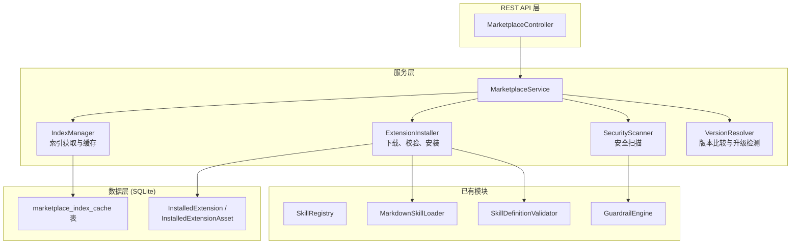

# 扩展市场（Extension Marketplace）架构设计

> **文档性质**：架构设计文档
> **模块归属**：`com.lifepilot.marketplace`
> **最后更新**：2026-03

## 1. 模块定位与职责边界

扩展市场（Extension Marketplace，模块 25）为 ZhiWei 提供扩展的发布、发现、安装和版本管理能力。它是 Skill 系统（模块 10）和 MCP 协议支持（模块 4）的上层扩展，不改变已有运行时行为，仅增加分发渠道。

### 核心职责

- **索引管理**：维护远程扩展索引（GitHub 仓库托管的 JSON 索引文件）
- **发现与搜索**：从索引中检索扩展，支持关键词搜索和分类筛选
- **安装与卸载**：从远程仓库下载扩展到本地目录，注册到对应注册中心
- **版本管理**：基于 SemVer 的版本比较，支持升级检测和版本锁定
- **安全审核**：安装前对扩展进行安全扫描（危险工具检测、Prompt 注入检测）

### 扩展类型

`ExtensionType` 定义了 4 种扩展类型：

| 类型 | 说明 |
|------|------|
| `SKILL` | Skill 定义（SKILL.md 格式） |
| `AGENT` | Agent 配置包 |
| `WORKFLOW` | 工作流定义 |
| `CHANNEL` | 渠道适配器插件 |

### 不在范围内

- 不实现自建索引服务器（使用 GitHub 仓库作为索引源）
- 不实现 Skill 发布流程（通过 GitHub PR 提交到索引仓库）
- 不实现付费机制
- 不实现 Skill 运行时沙箱（已有 GuardrailEngine 和 CodeSandbox）

## 2. 核心概念与术语

| 术语 | 定义 |
|------|------|
| ExtensionPackage | 远程扩展包的元数据描述（id、name、version、author、repoUrl、tags、extensionType 等） |
| ExtensionIndex | 远程索引文件，JSON 格式，包含所有可用 ExtensionPackage 的列表 |
| IndexSource | 索引源配置，指向一个 GitHub 仓库的 index.json URL |
| InstalledExtension / InstalledExtensionAsset | 本地已安装扩展的记录（packageId、version、installedAt、indexSource）及关联资产 |
| SecurityReport | 安装前安全扫描的结果报告 |

## 3. 架构设计

### 3.1 分层架构



### 3.2 索引机制

采用 **GitHub 仓库索引** 模式（参考 LobeChat Plugin Index、Copilot Plugins Registry）：

- 索引仓库托管一个 `index.json` 文件，包含所有可用扩展的元数据
- 每个扩展条目指向其 GitHub 仓库和文件路径
- ZhiWei 定期或手动刷新索引缓存
- 支持配置多个索引源（官方 + 社区 + 私有）

索引文件格式：

```json
{
  "version": "1.0.0",
  "updatedAt": "2026-03-05T00:00:00Z",
  "extensions": [
    {
      "id": "weekly-planner",
      "name": "周计划助手",
      "description": "自动生成和管理每周计划",
      "version": "1.2.0",
      "extensionType": "SKILL",
      "author": "community",
      "repoUrl": "https://github.com/lifepilot-skills/weekly-planner",
      "filePath": "SKILL.md",
      "tags": ["productivity", "planning"],
      "minLifepilotVersion": "1.0.0",
      "createdAt": "2026-01-15T00:00:00Z",
      "updatedAt": "2026-02-20T00:00:00Z",
      "downloads": 156,
      "verified": true
    }
  ]
}
```

### 3.3 安装流程

```
用户点击安装
    │
    ▼
IndexManager.getPackage(id)  ← 从缓存索引获取元数据
    │
    ▼
VersionResolver.checkCompatibility()  ← 检查 minLifepilotVersion
    │
    ▼
ExtensionInstaller.download()  ← HTTP GET 从 GitHub raw URL 下载 SKILL.md
    │
    ▼
MarkdownSkillParser.parse()  ← 复用已有 Markdown 解析校验
    │
    ▼
SecurityScanner.scan()  ← 安全扫描
    │  ├─ 危险工具检测（shell_execute、http_request 等）
    │  ├─ Prompt 注入模式检测
    │  └─ 生成 SecurityReport
    │
    ▼
写入本地 skills 目录  ← ~/.zhiwei/skills/{id}/SKILL.md
    │
    ▼
MarkdownSkillLoader.loadFolder()  ← 复用已有加载逻辑
    │
    ▼
SkillRegistry.register()  ← 注册到运行时
    │
    ▼
记录 InstalledExtension 表  ← 持久化安装记录
```

### 3.4 安全扫描策略

参考 OpenClaw Skills 安全审计报告（41.7% 存在漏洞），ZhiWei 在安装前执行本地安全扫描：

| 检查项 | 风险级别 | 处理方式 |
|--------|---------|---------|
| 使用 shell_execute 工具 | HIGH | 警告用户，需确认 |
| 使用 http_request 工具 | MEDIUM | 警告用户 |
| System Prompt 包含 "ignore previous" 等注入模式 | HIGH | 阻止安装 |
| 工具白名单包含未知工具 ID | MEDIUM | 警告用户 |
| 版本号格式不合法 | LOW | 阻止安装 |

扫描结果通过 SecurityReport 返回，包含风险级别和详细说明，由前端展示给用户决策。

## 4. 关键设计决策

### 4.1 为什么选择 GitHub 仓库索引而非自建服务器

- ZhiWei 是本地优先的个人助手，不应依赖自建云服务
- GitHub 仓库天然提供版本控制、PR 审核流程、CDN 加速
- LobeChat、Copilot Plugins、IDA Plugin Repository 均采用此模式，已验证可行
- 社区贡献通过 PR 提交，维护成本低

### 4.2 为什么不实现依赖解析

- ZhiWei Skill 是独立的 Markdown 声明（SKILL.md 文件夹），不存在 Skill 间依赖关系
- Skill 的工具依赖由 DynamicToolRegistry 在运行时解析
- 避免引入 npm/Maven 式的依赖地狱复杂度

### 4.3 为什么本地安全扫描而非服务端扫描

- 本地优先原则，不依赖外部服务
- 用户可自定义扫描规则
- 参考 Dify 插件系统的本地校验 + 远程审核双层模式，ZhiWei 先实现本地层

## 5. 与已有模块的集成点

| 已有模块 | 集成方式 |
|---------|---------|
| SkillRegistry | 安装后调用 register()，卸载时调用 unregister() |
| MarkdownSkillLoader | 复用 loadFolder() 解析下载的 SKILL.md |
| SkillDefinitionValidator | 复用校验逻辑 |
| MarkdownSkillParser | 复用 Markdown 解析校验 |
| GuardrailEngine | 安装的扩展运行时仍受护栏约束 |
| SkillConfigProperties | 复用 skills.directory 配置 |
| WebAutoConfiguration | 新增 MarketplaceController REST 端点 |

## 6. 调研参考

- [LobeChat Plugin Index](https://github.com/lobehub/lobe-chat-plugins)：GitHub 仓库索引模式，JSON 索引文件 + PR 提交流程
- [Dify Plugin System](https://dify.ai/blog/dify-plugin-system-design-and-implementation)：模块解耦、插件市场、安全审核机制
- [Copilot Plugins Registry](https://deepwiki.com/github/copilot-plugins/2.1-marketplace-system)：集中式 JSON 索引，GitHub Actions 自动更新
- [IDA Plugin Repository](https://docs.hex-rays.com/ida-9.2/developer-guide/plugin-publishing/plugin-repository-architecture)：JSON 索引 + GitHub Actions 发现机制
- [OpenClaw Skills 安全审计](https://www.thenextgentechinsider.com/pulse/openclaw-skills-audit-reveals-417-vulnerable-to-security-risks)：41.7% 存在漏洞，强调安装前安全扫描的必要性
