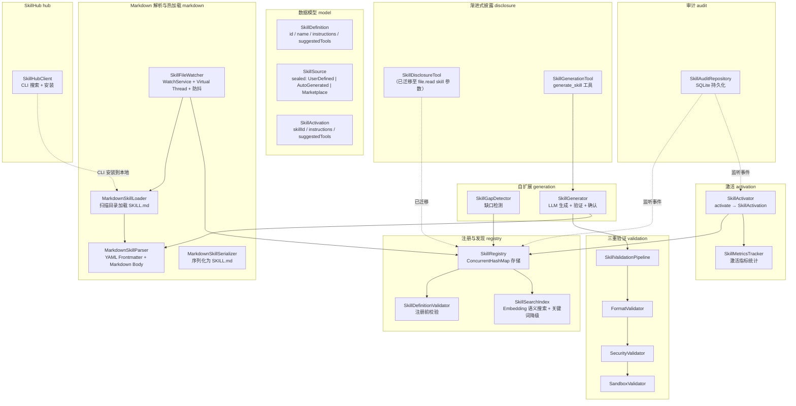
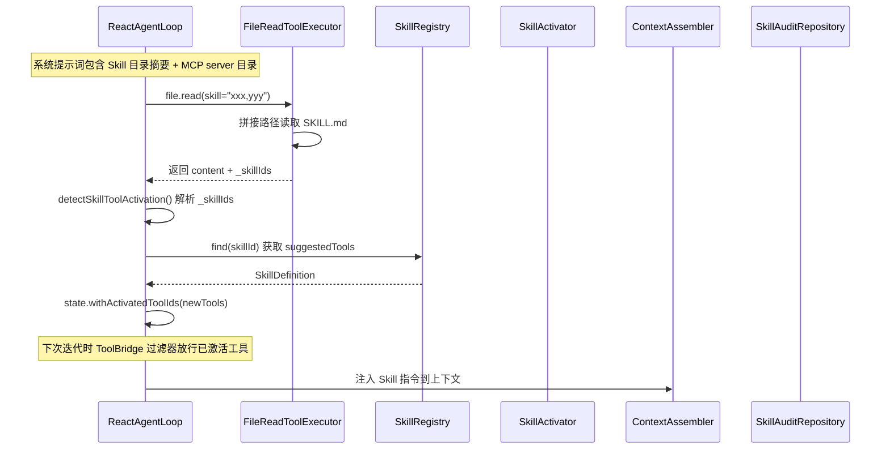
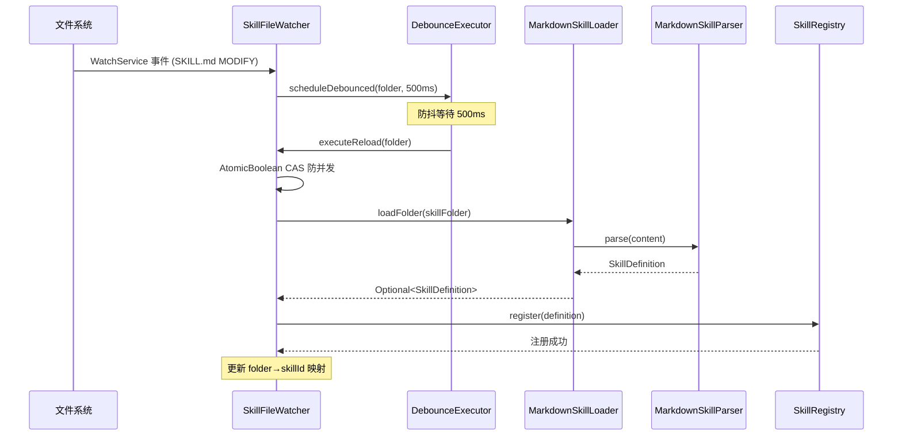
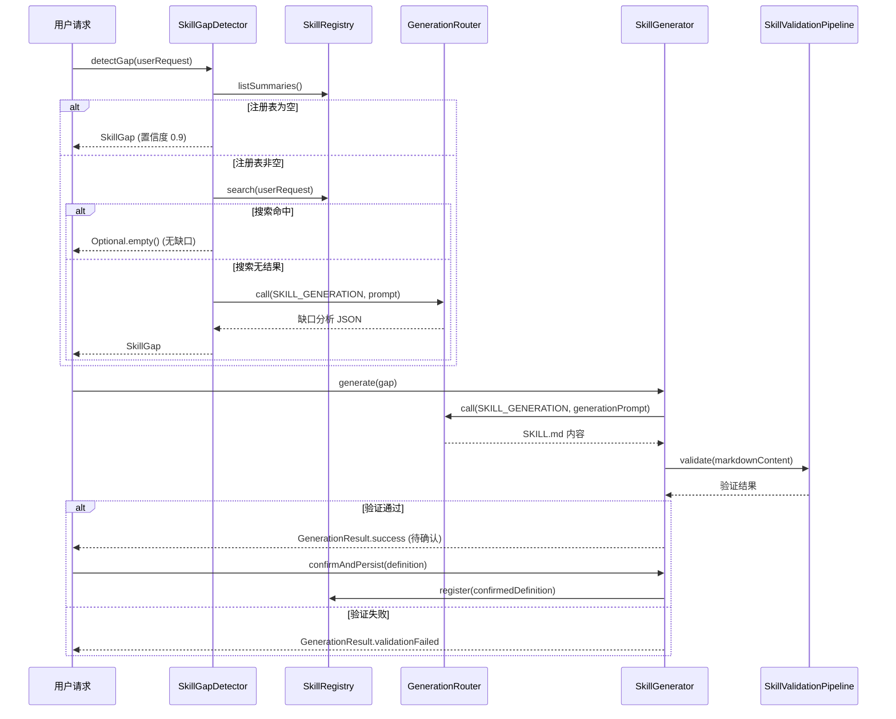

# Skill 系统 — 架构设计

> **文档性质**：架构设计文档
> **模块归属**：`com.lifepilot.skill`
> **最后更新**：2026-04

## 1. 模块概述

Skill 系统是知微的程序性知识管理框架，负责 Skill 的定义、注册、发现、激活和自扩展。每个 Skill 是一个包含指令（instructions）和建议工具列表的知识包，激活后注入 Agent 上下文以增强 Agent 的专业能力。系统支持三种来源：用户定义（Markdown 声明式）、自动生成（LLM 驱动）和市场安装（Marketplace），通过 `SkillSource` sealed interface 穷举。

模块包含 12 个子包：model（数据模型）、registry（注册与搜索）、activation（激活）、markdown（Markdown 解析与热加载）、validation（三重验证管线）、generation（自扩展）、disclosure（渐进式披露工具）、config（自动配置）、event（事件）、audit（审计）、memory（记忆访问控制）、hub（SkillHub 远程市场 CLI 客户端）。

## 2. 架构图

## 3. 核心组件

### 3.1 SkillDefinition（数据模型）

Skill 定义的不可变 record，包含 `id`、`name`、`description`、`version`、`source`（SkillSource）、`instructions`（注入 Agent 上下文的指令）、`suggestedTools`（建议工具列表）、`metadata`。紧凑构造器执行非空校验和防御性拷贝（`List.copyOf` / `Map.copyOf`）。提供 `toDiscoverySummary()` 返回 XML 格式的摘要（用于系统提示词中的 Skill 目录）。

### 3.2 SkillSource（来源类型）

sealed interface，穷举三种来源，每种来源携带不同元数据：

| 来源 | 优先级 | 说明 |
|------|--------|------|
| `UserDefined` | 2 | Markdown 声明式，携带 `folderPath` 和 `lastModified` |
| `Marketplace` | 2 | 市场安装，携带 `packageId`、`indexSourceUrl`、`installedAt` |
| `AutoGenerated` | 1 | LLM 自生成，携带 `generatorTraceId`、`userConfirmed` 标志 |

### 3.3 SkillRegistry（注册中心）

基于 `ConcurrentHashMap` 的线程安全注册中心。注册前通过 `SkillDefinitionValidator` 校验。注册/注销/更新时通过 Spring `ApplicationEventPublisher` 发布 `SkillRegistryEvent`。语义搜索委托给 `SkillSearchIndex`。支持按来源类型批量注销（`unregisterBySource`）。

### 3.4 SkillSearchIndex（语义搜索索引）

双模式搜索引擎：EmbeddingRouter 可用时使用 Embedding 向量余弦相似度搜索（阈值 > 0.5），EmbeddingRouter 不可用时降级为关键词匹配模式（按查询词在 Skill 名称+描述中的命中率计算相关度）。使用 `ConcurrentHashMap` 缓存 Embedding 向量和文本。

### 3.5 SkillActivator（激活器）

激活流程：从 SkillRegistry 查找 → 检查激活条件（AutoGenerated 未确认则拒绝）→ 记录激活指标 → 发布 `SkillLifecycleEvent.Activated` → 返回 `SkillActivation`（包含 instructions 和 suggestedTools）供 ContextAssembler 注入 Agent 上下文。

### 3.6 MarkdownSkillLoader + SkillFileWatcher（Markdown 加载与热加载）

`MarkdownSkillLoader` 扫描 Skill 根目录下所有包含 `SKILL.md` 的子文件夹，通过 `MarkdownSkillParser` 解析后注册到 SkillRegistry。支持 `references/` 子目录加载参考文件。

`SkillFileWatcher` 基于 Java `WatchService` 监听文件变更，运行在 Virtual Thread 上。同时监听根目录（子目录 CREATE/DELETE）和每个 Skill 子目录（SKILL.md CREATE/MODIFY）。使用 `ScheduledExecutorService` 实现防抖（默认 500ms），`AtomicBoolean` 防止并发重载，解析失败时保留上一个有效版本。

### 3.7 SkillValidationPipeline（三重验证管线）

按顺序执行三阶段验证，任一阶段失败即终止：

1. **FormatValidator** — 校验 SKILL.md 格式（YAML Frontmatter + Markdown Body）
2. **SecurityValidator** — 校验工具白名单、风险等级、预算上限和 Prompt 注入
3. **SandboxValidator** — 在隔离环境中验证内部一致性

### 3.8 SkillGapDetector + SkillGenerator（自扩展管线）

`SkillGapDetector` 检测用户请求是否超出现有 Skill 能力范围：注册表为空直接判定缺口（置信度 0.9），语义搜索无结果时使用 LLM 分析缺口内容，LLM 不可用时降级返回空结果。

`SkillGenerator` 根据缺口描述生成 SKILL.md：构建 Prompt（注入安全约束 + 已有 Skill 示例）→ LLM 生成 → 三重验证 → 解析为待确认的 SkillDefinition。用户确认后持久化到 `~/.zhiwei/skills/auto/{skill-id}/SKILL.md` 并注册。

### 3.9 SkillDisclosureTool + SkillGenerationTool（渐进式披露）

原 `SkillToToolBridge` 已重构为渐进式 Skill 发现机制：

- `SkillDisclosureTool`：`load_skill` 独立工具已删除，Skill 加载迁移至 `file.read` 的 `skill` 参数。Agent 调用 `file.read(skill="skill-id")` 时，`FileReadToolExecutor` 读取 SKILL.md 内容并在返回数据中附带 `_skillIds` 字段，`ReactAgentLoop` 检测到该字段后自动通过 `SkillActivator` 激活对应 Skill 的 suggestedTools。支持逗号分隔多个 Skill ID（最多 3 个），支持 `mcp:server-name` 前缀加载 MCP server 的所有工具。类保留空实现以兼容配置调用点。
- `SkillGenerationTool`：注册 `generate_skill` 工具（风险等级 HIGH，需用户确认）。Agent 调用时传入需求描述，通过 SkillGenerator 生成新 Skill。所有自扩展统一走此入口，确保 Guardrail 拦截。

系统提示词中包含 Skill 目录摘要（skill-catalog.st，XML 格式）和 MCP server 目录（`<available_mcp_servers>`，由 ContextAssembler 生成），Agent 根据摘要决定调用 `file.read(skill="skill-id")` 加载已有 Skill、`file.read(skill="mcp:server-name")` 加载 MCP 工具或 `generate_skill` 创建新 Skill。

### 3.10 SkillHubClient（SkillHub 远程市场）

`SkillHubClient` 通过腾讯 SkillHub CLI 工具搜索和安装远程 Skill，作为 OpenClaw ClawHub 的中文替代方案。通过 `lifepilot.skills.skill-hub.enabled` 配置开关控制。

核心接口：
- `search(query)` — 调用 `skillhub search <关键词>` 搜索远程 Skill
- `install(skillName)` — 调用 `skillhub install <名称>` 安装到用户 Skill 目录
- `isAvailable()` — 检查 CLI 是否已安装

安装后文件落入 `~/.zhiwei/skills/` 目录，由 `SkillFileWatcher` 检测到新目录后自动加载注册。

### 3.11 SkillAuditRepository（审计追溯）

通过 Spring Event 监听 `SkillRegistryEvent` 和 `SkillLifecycleEvent`，将审计事件持久化到 SQLite `skill_audit_logs` 表。支持按 Skill ID 和时间范围查询。写入失败不影响主流程。

## 4. 核心流程

### 4.1 Skill 注册与激活流程

### 4.2 Markdown Skill 热加载流程

### 4.3 Skill 自扩展流程

## 5. 设计决策

| 决策 | 选择 | 理由 |
|------|------|------|
| Skill 定义格式 | Markdown (SKILL.md) | 人类可读可编辑，YAML Frontmatter 存元数据，Markdown Body 存指令，比纯 YAML 更灵活 |
| 来源类型建模 | sealed interface SkillSource | 穷举三种来源，switch 表达式编译期保证完整性，每种来源携带不同元数据 |
| 注册中心存储 | ConcurrentHashMap | 支持运行时并发注册/注销，无需外部存储，重启后从文件系统重新加载 |
| 搜索策略 | Embedding 向量 + 关键词降级 | LLM 可用时语义搜索精度高，不可用时降级为关键词匹配保证可用性 |
| 热加载机制 | WatchService + Virtual Thread + 防抖 | 文件变更实时感知，Virtual Thread 轻量无阻塞，防抖避免频繁重载 |
| 自生成安全 | 三重验证 + 用户确认 | 格式→安全→沙箱三阶段验证，AutoGenerated 必须 userConfirmed=true 才能激活 |
| 工具桥接 | file.read(skill=...) + generate_skill | 渐进式披露：load_skill 独立工具已删除，Skill 加载融入 file.read 的 skill 参数，ReactAgentLoop 自动检测 _skillIds 并激活工具。系统提示词包含 Skill 目录和 MCP server 目录，Agent 按需调用 file.read(skill="id1,id2") 批量加载（最多 3 个）或 generate_skill 创建 |
| SkillHub 集成 | CLI 客户端 | 通过 SkillHub CLI 搜索安装，文件落入本地目录后由 SkillFileWatcher 自动加载，避免实现复杂的 REST API 对接 |

## 6. 集成点

| 集成模块 | 方向 | 说明 |
|---------|------|------|
| LLM Router (`com.lifepilot.llm`) | Skill → LLM | SkillSearchIndex 调用 `EmbeddingRouter.embed()` 生成 Embedding；SkillGapDetector/SkillGenerator 调用 `GenerationRouter.call()` |
| 工具系统 (`com.lifepilot.tool`) | Skill → Tool | SkillGenerationTool 注册 `generate_skill` 到 DynamicToolRegistry；`load_skill` 已删除，Skill 加载由 `file.read(skill=...)` 承载 |
| Agent 引擎 (`com.lifepilot.agent`) | Agent → Skill | Agent 调用 `file.read(skill="id")` 加载 Skill 指南，ReactAgentLoop 检测 `_skillIds` 后激活 suggestedTools；ContextAssembler 组装 Skill 目录和 MCP server 目录到系统提示词 |
| 记忆系统 (`com.lifepilot.memory`) | Meta → Memory | 记忆工具由 `MemoryToolProvider`（元能力模块）直接注册，不通过 Skill 系统 |
| Prompt 管理 (`com.lifepilot.prompt`) | Skill → Prompt | SkillGenerator 通过 PromptRegistry 渲染生成 Prompt |
| 可观测性 (`com.lifepilot.observability`) | Skill → Observability | SkillGenerationTool 引用 RiskLevel 枚举设置工具风险等级 |
| SkillHub (`com.lifepilot.skill.hub`) | Skill → External | SkillHubClient 通过 CLI 从腾讯 SkillHub 搜索和安装 Skill，安装到本地后由 SkillFileWatcher 自动加载 |

## 7. 配置参考

| 配置键 | 默认值 | 说明 |
|--------|--------|------|
| `lifepilot.skills.enabled` | `true` | Skill 系统总开关 |
| `lifepilot.skills.max-concurrent-activations` | `5` | 最大并发激活数 |
| `lifepilot.skills.directory` | `~/.zhiwei/skills` | Skill 文件目录 |
| `lifepilot.skills.hot-reload-debounce-ms` | `500` | 热加载防抖间隔（毫秒） |
| `lifepilot.skills.skill-filename` | `SKILL.md` | Skill 定义文件名 |
| `lifepilot.skills.validation.max-name-length` | `128` | 名称最大长度 |
| `lifepilot.skills.validation.max-instructions-length` | `10000` | 指令最大长度 |
| `lifepilot.skills.validation.auto-generated-max-steps` | `15` | 自生成 Skill 最大步数 |
| `lifepilot.skills.validation.auto-generated-max-timeout` | `180` | 自生成 Skill 最大超时（秒） |
| `lifepilot.skills.validation.auto-generated-max-tokens` | `10000` | 自生成 Skill 最大 Token 数 |
| `lifepilot.skills.search.default-top-k` | `10` | 语义搜索默认返回数量 |
| `lifepilot.skills.auto-generation.enabled` | `true` | 自扩展功能开关 |
| `lifepilot.skills.auto-generation.gap-threshold` | `0.6` | 缺口检测语义匹配阈值 |
| `lifepilot.skills.auto-generation.max-cost-cents` | `100` | 自生成最大成本（美分） |
| `lifepilot.skills.shell-action.max-timeout-seconds` | `30` | Shell 动作最大超时（秒） |
| `lifepilot.skills.chain-action.max-steps` | `5` | 串联动作最大步数 |
| `lifepilot.skills.http-action.ssrf-protection-enabled` | `true` | SSRF 防护开关 |
| `lifepilot.skills.http-action.timeout-seconds` | `30` | HTTP 动作超时（秒） |
| `lifepilot.skills.auto-generation.max-validation-iterations` | `2` | 验证失败后最大迭代修正次数 |
| `lifepilot.skills.skill-hub.enabled` | `true` | SkillHub 远程市场开关 |
| `lifepilot.skills.skill-hub.base-url` | `https://skillhub.cloud.tencent.com` | SkillHub API 基础 URL |
| `lifepilot.skills.skill-hub.max-search-results` | `10` | SkillHub 搜索最大返回数量 |
| `lifepilot.skills.skill-hub.auto-install` | `false` | 搜索到匹配 Skill 后是否自动安装 |
