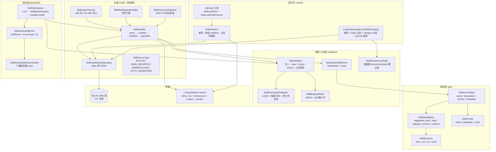
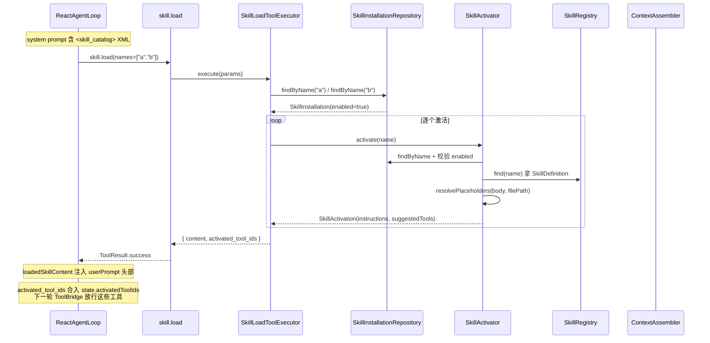
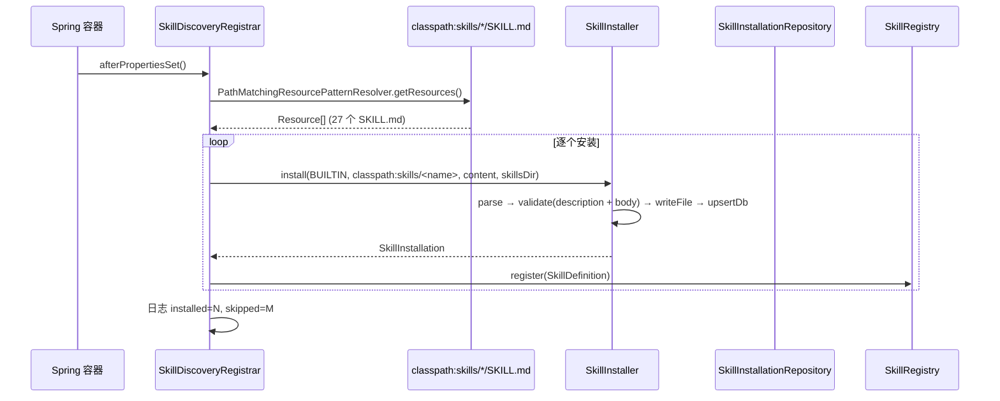
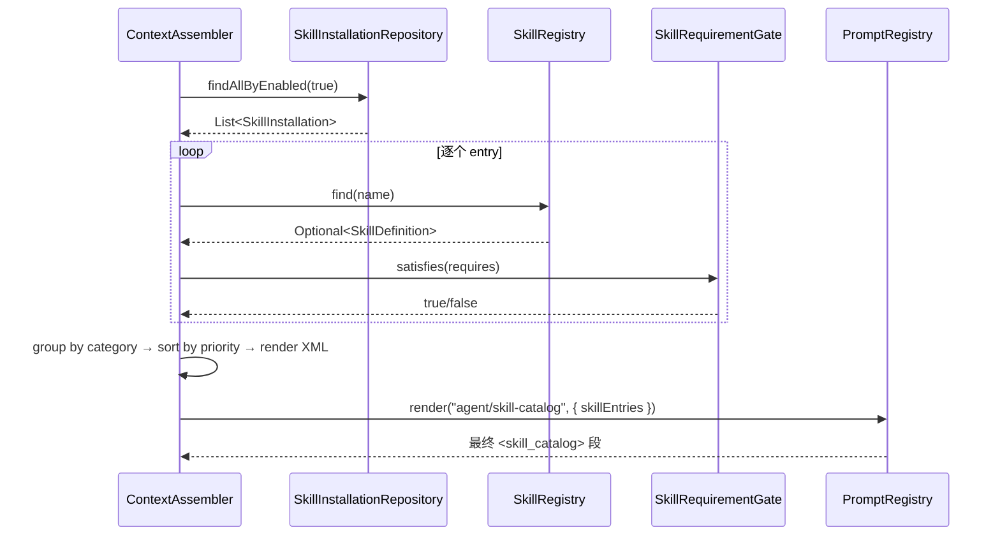
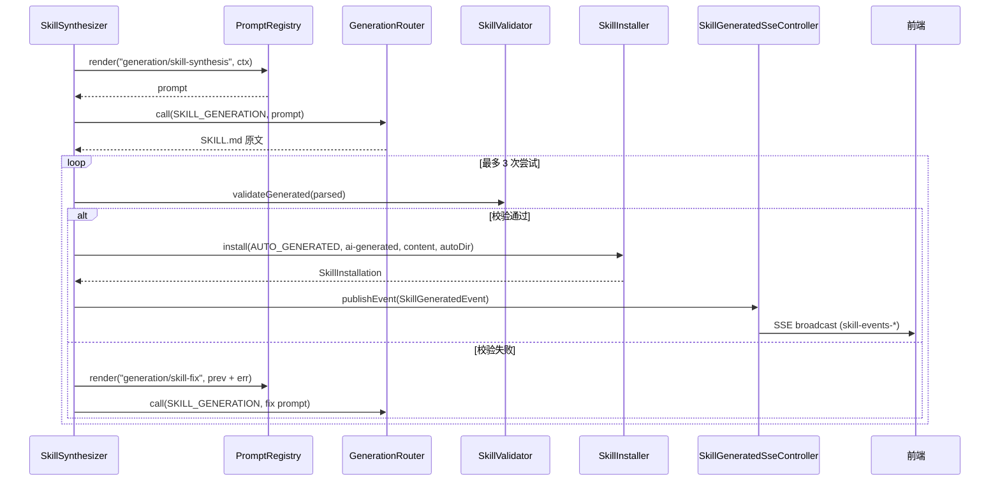

# Skill 系统 — 架构设计

> **文档性质**：架构设计文档
> **模块归属**：`com.lifepilot.skill`
> **最后更新**：2026-04-24

## 1. 模块概述

Skill 系统是知微的程序性知识管理框架，负责 Skill 的定义、安装、发现、激活与自动扩展。每个 Skill 是一个包含描述（description）、骨架正文（body）与可选资产（references/scripts/assets）的目录，激活后其 body 作为上下文指令注入 Agent，并把声明的 `suggested_tools` 合并进下一轮可见工具集。

v2 相对 v1 的核心变化：

- **三级物理分层**：SKILL.md（L1 frontmatter + L2 骨架 body）与 `references/`（L3 按需加载参考）分离，超长内容拆 references，不塞正文。
- **激活路径归一**：全局唯一激活入口 `skill.load(names=[...])`。已删除 `SkillDisclosureTool` 空壳、`ReactAgentLoop.detectSkillToolActivation()` 黑魔法与 `file.read(skill=)` 捷径。
- **skills 表是安装元数据事实源**：V17 迁移重建 `skills` 表，存 BUILTIN / USER_IMPORTED / MARKETPLACE / AUTO_GENERATED 四种来源的安装状态。Skill 正文实时从 SKILL.md 读，不落库。
- **校验链合一**：`SkillDescriptionValidator` + `SkillBodyValidator` + `SkillValidator`（合一 format + secret + tool 风险）+ `SkillRequirementGate`（加载期 bins/env/os/tools 硬过滤）。
- **自生成链路重写**：`SkillSynthesizer` 替代旧 `SkillGenerator`，发布 `SkillGeneratedEvent`，经 SSE 广播到前端 toast。

模块包含 11 个子包：model（数据模型）、spec（frontmatter 结构）、registry（内存注册与搜索）、activation（激活）、markdown（Markdown 加载与热加载）、validation（校验链）、generation（自生成）、install（四来源安装）、tool（`skill.load` 工具）、event（事件）、audit（审计）、config（自动配置）、hub（SkillHub 可选 CLI 客户端）、memory（记忆访问控制）。

## 2. 架构图



## 3. 核心组件

### 3.1 规范层 — SkillFrontmatter / SkillZhiweiMeta / SkillRequires / SkillPriority

- `SkillFrontmatter`（`src/main/java/com/lifepilot/skill/spec/SkillFrontmatter.java`）：record，存 `name / description / version / zhiweiMeta`。构造器强制三个必需字段非空。
- `SkillZhiweiMeta`（`src/main/java/com/lifepilot/skill/spec/SkillZhiweiMeta.java`）：`metadata.zhiwei` 嵌套块结构化视图——`suggestedTools / tags / category / priority / requires`，缺省时返回 `empty()`。
- `SkillRequires`（`src/main/java/com/lifepilot/skill/spec/SkillRequires.java`）：`bins / env / os / tools` 四维依赖声明。
- `SkillPriority`（`src/main/java/com/lifepilot/skill/spec/SkillPriority.java`）：`HIGH / NORMAL / LOW`，影响 catalog 排序。

### 3.2 解析层 — MarkdownSkillParser

文件：`src/main/java/com/lifepilot/skill/MarkdownSkillParser.java`

- `parse(content)` → `ParsedSkill(SkillFrontmatter, body)`。
- frontmatter 正则分割：`^---\s*\n(.+?)\n---\s*\n(.*)$`。
- **硬拒绝**老字段 `id`（v1 已废弃）：`throw IllegalArgumentException("字段 'id' 已废弃，请用 'name'")`。
- `name` 正则：`^[a-z0-9][a-z0-9-]{0,62}$`。
- `metadata.zhiwei.priority` 字符串用 `valueOf(toUpperCase())` 解析为 `SkillPriority` 枚举。

### 3.3 校验链

**`SkillDescriptionValidator`**（`src/main/java/com/lifepilot/skill/validation/SkillDescriptionValidator.java`）

- ≤1024 字符
- 必须以 "当…" / "用于…" / "Use when…" / "Use this when…" 开头（`CASE_INSENSITIVE`）
- 不得含工作流词：`步骤 N` / `首先` / `然后` / `接下来` / `Step N` / `First` / `Then`

**`SkillBodyValidator`**（`src/main/java/com/lifepilot/skill/validation/SkillBodyValidator.java`）

- ≤5000 字符（超长强制拆 references）
- 必需 3 小节：`## 适用场景` / `## 不适用场景` / `## 工作流`（子串完全匹配）

**`SkillValidator`**（`src/main/java/com/lifepilot/skill/validation/SkillValidator.java`）

两条路径：

- `validate(ParsedSkill)`：BUILTIN / USER_IMPORTED / MARKETPLACE 路径。description + body 硬约束 + secret 模式扫描（`BEGIN .+ PRIVATE KEY` / API key / password / `sk-` token），未知 `suggested_tools` 工具只 WARN。
- `validateGenerated(ParsedSkill)`：AUTO_GENERATED 路径，额外硬拒未知工具与 HIGH/CRITICAL 风险工具，防止自生成绕过用户确认执行高危操作。

**`SkillRequirementGate`**（`src/main/java/com/lifepilot/skill/validation/SkillRequirementGate.java`）

加载期硬过滤：`satisfies(SkillRequires)` 检查 `bins`（执行 `bin --version`，2 秒内成功视为存在）、`env`（`System.getenv` 非空）、`os`（匹配 `windows / darwin / linux`）、`tools`（`DynamicToolRegistry.resolve` 可解析）。任一维度不满足即返回 `false`，被 `ContextAssembler.buildSkillCatalog` 从输出中剔除。

### 3.4 安装层 — SkillInstaller 与四来源

**`SkillInstaller`**（`src/main/java/com/lifepilot/skill/install/SkillInstaller.java`）

四来源统一四步流水线：

1. `parse` — `MarkdownSkillParser.parse`
2. `validate` — `SkillDescriptionValidator` → `SkillBodyValidator`
3. `writeFile` — 写到 `targetDir/<name>/SKILL.md`
4. `upsertDb` — `SkillInstallationRepository.upsert`

约束（见 Javadoc）：任一步失败短路（不残留半个文件或半条表记录）；`AUTO_GENERATED` 不做人工确认，默认 `enabled=true`；`checksum` 取 SKILL.md UTF-8 字节的 SHA-256 小写十六进制；不负责 references/scripts/assets 复制（由 ImportService / MarketplaceInstaller 承担）；不负责注册到 `SkillRegistry`（由 `SkillDiscoveryRegistrar` / `SkillFileWatcher` 承担）。

**`SkillInstallationRepository`**（`src/main/java/com/lifepilot/skill/install/SkillInstallationRepository.java`）

JdbcTemplate 参数化查询，针对 V17 `skills` 表：`upsert`（`ON CONFLICT(name) DO UPDATE`）、`findByName`、`findAllByEnabled`、`findAllBySourceType`、`setEnabled`、`updateLastActivatedAt`、`delete`。时间戳以 ISO-8601 字符串存 TEXT 列。

**`SkillSourceType`**（`src/main/java/com/lifepilot/skill/install/SkillSourceType.java`）

`BUILTIN / USER_IMPORTED / MARKETPLACE / AUTO_GENERATED`——V17 `CHECK` 约束同步限制。

**四个来源对应的安装入口**：

| 来源 | 入口类 | 触发时机 |
|---|---|---|
| BUILTIN | `SkillDiscoveryRegistrar`（`src/main/java/com/lifepilot/meta/convenience/SkillDiscoveryRegistrar.java`）| Spring `InitializingBean.afterPropertiesSet()`，扫描 `classpath:skills/*/SKILL.md` 逐个安装 |
| USER_IMPORTED | `SkillImportService`（`src/main/java/com/lifepilot/skill/install/SkillImportService.java`）| 前端 `SkillInstallDialog` 上传 `.skill` 包到 `POST /api/skills/import`；Git URL 当前为 stub |
| MARKETPLACE | `SkillMarketplaceInstaller`（`src/main/java/com/lifepilot/skill/install/SkillMarketplaceInstaller.java`）| 前端 `POST /api/skills/install-from-marketplace` 按 `marketplaceId` 下载；ClawHub 走 zip 下载，自有索引走 HTTP GET 单文件 |
| AUTO_GENERATED | `SkillSynthesizer.synthesize(...)`（见 §3.6）| Agent 判定能力缺口后 LLM 自动产出 |

### 3.5 运行时层 — skill.load 工具 + SkillActivator + ContextAssembler

**`SkillLoadTool` / `SkillLoadToolExecutor`**（`src/main/java/com/lifepilot/skill/tool/SkillLoadTool.java` / `SkillLoadToolExecutor.java`）

注册的 BuiltinTool 元数据：

- id：`skill.load`
- category：`EXTENSION`
- riskLevel：`LOW`
- idempotent：`true`
- scheduling：`PARALLEL_SAFE`
- tags：`["skill", "activate", "load", "guide", "extension", "capability"]`
- inputSchema：`{ names: string[] }`（1-3 个，由 `SkillLoadToolExecutor.MAX_SKILLS = 3` 硬限）

执行逻辑：

1. 解析 `names`，拒绝空列表和超过 3 个
2. 预校验全部 skill 必须在 `skills` 表存在且 `enabled=true`（避免"激活一半失败"的半残留）
3. 逐个 `activator.activate(name)`，结果拼为 `<skill name="X">body</skill>`，空行拼接
4. 所有 activation 的 `suggestedTools` 按 `LinkedHashSet` 首次出现顺序去重合并

返回 `Map.of("content", String, "activated_tool_ids", List<String>)`。

**`SkillActivator`**（`src/main/java/com/lifepilot/skill/activation/SkillActivator.java`）

流程：

1. `installationRepository.findByName(name)` 查事实源
2. 校验 `enabled == true`，否则 `IllegalStateException`
3. `skillRegistry.find(name)` 拿已解析的 `SkillDefinition`（含 body 与 `suggestedTools`）
4. 占位符替换：`{skill_dir}` → `filePath`，`{skill_references_dir}` → `filePath + "/references"`，`{skill_scripts_dir}` → `filePath + "/scripts"`（先替换两个子目录再替换根目录，避免前缀歧义）
5. 异步 `updateLastActivatedAt`（`CompletableFuture.runAsync`，失败只 WARN，不阻塞激活）
6. `metricsTracker.recordActivation` + `publishEvent(SkillLifecycleEvent.Activated)`
7. 返回 `SkillActivation(name, resolvedInstructions, suggestedTools)`

v2 相对 v1 的两点关键变化：去掉了 `AutoGenerated.userConfirmed` 检查（启用状态由 `skills.enabled` 一人做主）；路径来源从 `SkillSource` switch 改为 `SkillInstallation.filePath()`。

**`ContextAssembler.buildSkillCatalog()`**（`src/main/java/com/lifepilot/agent/context/ContextAssembler.java:1151`）

查表驱动 catalog 构建：

1. `installationRepository.findAllByEnabled(true)` 取所有启用的 skill
2. 按 name 查 `SkillRegistry` 拿内存中已解析的 `SkillDefinition`（未加载的跳过）
3. `SkillRequirementGate.satisfies(requires)` 硬过滤不满足 bins/env/os/tools 的
4. 按 `category` 分组 → 组内按 `priority` 排序（HIGH=0, NORMAL=1, LOW=2）→ 同 priority 按 name 排
5. 拼成 `<category name="X"><skill name="Y"><description>...</description></skill></category>` XML
6. 渲染 `agent/skill-catalog.st` 模板，注入到 system prompt

category 为 null 时渲染为 `other`。

### 3.6 自生成链路 — SkillSynthesizer + SkillGeneratedEvent + SSE 广播

**`SkillSynthesizer`**（`src/main/java/com/lifepilot/skill/generation/SkillSynthesizer.java`）

四步闭环（替代旧 `SkillGapDetector` + `SkillGenerator`）：

1. **首次生成**：渲染 `generation/skill-synthesis` prompt → 调 `GenerationRouter.call(LlmScene.SKILL_GENERATION, ...)`
2. **校验**：`parser.parse(content)` → `validator.validateGenerated(parsed)`（严格模式：未知工具与 HIGH/CRITICAL 风险工具都拒）
3. **迭代修正**：失败时渲染 `generation/skill-fix` prompt（带上次产物 + 错误信息）→ 重新生成；最多 `MAX_FIX_ATTEMPTS = 2` 次（总尝试次数 1 + 2 = 3）
4. **落库**：通过 `SkillInstaller.install` 写到 `{skills.directory}/auto/<name>/SKILL.md`，`source_type = AUTO_GENERATED`；发布 `SkillGeneratedEvent(skillName, sourceType, at)`

**`SkillGeneratedEvent`**（`src/main/java/com/lifepilot/skill/event/SkillGeneratedEvent.java`）

Spring `ApplicationEvent`，payload 三字段最小化：`skillName` / `sourceType` / `at`。

**`SkillGeneratedSseController`**（`src/main/java/com/lifepilot/interaction/web/controller/SkillGeneratedSseController.java`）

- `GET /api/skills/events` — SSE 订阅端点，复用 `SseSessionManager.createNotificationEmitter`，streamId 前缀 `skill-events-`
- `@EventListener onSkillGenerated` — 监听 `SkillGeneratedEvent`，广播扁平 Map payload `{type, skillName, sourceType, at}` 到所有 `skill-events-` 前缀订阅者
- 超时复用 `lifepilot.web.sse.mcp-status-timeout`（默认 30 分钟）

### 3.7 Markdown 热加载 — MarkdownSkillLoader + SkillFileWatcher

`SkillFileWatcher`（`src/main/java/com/lifepilot/skill/markdown/SkillFileWatcher.java`）基于 `WatchService` 在 Virtual Thread 上监听 Skill 根目录及一级子目录的 CREATE/DELETE/MODIFY 事件，`ScheduledExecutorService` 防抖（`lifepilot.skills.hot-reload-debounce-ms`，默认 500ms），`AtomicBoolean` 防并发重载。加载失败保留上一个有效版本。

### 3.8 skills 表（V28 迁移）

迁移：`src/main/resources/db/migration/V28__skill_system_refactor.sql`

```sql
CREATE TABLE skills (
    name                TEXT PRIMARY KEY,
    source_type         TEXT NOT NULL,
    source_uri          TEXT,
    file_path           TEXT NOT NULL,
    version             TEXT NOT NULL,
    enabled             INTEGER NOT NULL DEFAULT 1,
    marketplace_id      TEXT,
    checksum            TEXT,
    installed_at        TEXT NOT NULL,
    updated_at          TEXT NOT NULL,
    last_activated_at   TEXT,
    CHECK (source_type IN ('BUILTIN', 'USER_IMPORTED', 'MARKETPLACE', 'AUTO_GENERATED')),
    CHECK (enabled IN (0, 1))
);
CREATE INDEX idx_skills_source_enabled ON skills(source_type, enabled);
```

老 `skills` 表数据被直接抛弃（无代码依赖老数据），新表只存安装元数据，内容实时从 SKILL.md 读。

## 4. 核心流程

### 4.1 Skill 激活流程（skill.load）



### 4.2 BUILTIN Skill 启动安装流程



任一 skill 解析或校验失败只记 WARN 跳过，不阻断其他 BUILTIN 安装，也不阻塞应用启动。

### 4.3 Catalog 构建流程



### 4.4 Skill 自生成流程



## 5. 设计决策

| 决策 | 选择 | 理由 |
|---|---|---|
| Skill 定义格式 | Markdown（SKILL.md YAML frontmatter + body）| 人类可读可写，frontmatter 存结构化元数据，body 存程序性指令 |
| 物理分层 | SKILL.md（L1 + L2）+ references/scripts/assets（L3）| body 硬限 5000 字符强制拆分；LLM 按需 `file.read` 参考，节约 token |
| 激活路径 | 全局唯一 `skill.load` BuiltinTool | 废除 `file.read(skill=)` 捷径与 `detectSkillToolActivation` 黑魔法，契约清晰 |
| 一次激活数量 | 1-3 个 skill（`MAX_SKILLS = 3`）| 限制一次上下文注入量，避免稀释 |
| skills 表职责 | 仅存安装元数据，不存 Skill 正文 | SKILL.md 文件是正文事实源，可重放；表便于启用状态、来源、checksum 管理 |
| 四来源枚举 | BUILTIN / USER_IMPORTED / MARKETPLACE / AUTO_GENERATED | 同一张表穷举所有安装渠道，前端按徽章区分 |
| 校验双模式 | `validate` 宽松 / `validateGenerated` 严格 | 预置和用户导入容忍 Skill 引用未知工具；自生成严禁未知和高危工具 |
| requires 门控 | 加载期 `SkillRequirementGate` 从 catalog 输出剔除 | 避免向 LLM 暴露运行时不满足的 skill，引导"无脑加载却用不起来"的失败 |
| 自生成安全 | AUTO_GENERATED 默认 enabled=true，但 `validateGenerated` 拒未知 + HIGH/CRITICAL 工具 | 简化确认流程，改用代码层硬约束防自生成绕过风险 |
| 占位符替换 | `{skill_dir}` / `{skill_references_dir}` / `{skill_scripts_dir}` | 激活时按真实安装路径替换，避免 body 中写绝对路径污染源 |

## 6. 集成点

| 集成模块 | 方向 | 说明 |
|---|---|---|
| LLM Router（`com.lifepilot.generation`）| Skill → LLM | `SkillSynthesizer` 调 `GenerationRouter.call(LlmScene.SKILL_GENERATION, ...)` |
| 工具系统（`com.lifepilot.tool`）| Skill → Tool | `skill.load` 注册为 BuiltinTool；`SkillValidator` 调 `DynamicToolRegistry.resolve` 校验 `suggested_tools`；激活返回的 `activated_tool_ids` 由 `ToolExecutionCoordinator` 合入 `state.activatedToolIds` |
| Agent 引擎（`com.lifepilot.agent`）| Agent → Skill | `ContextAssembler.buildSkillCatalog` 生成 system prompt 中 `<skill_catalog>` 段；`ToolExecutionCoordinator` 从 `skill.load` 输出提取 `content` 注入 userPrompt 头部 |
| Prompt 管理（`com.lifepilot.prompt`）| Skill → Prompt | `SkillSynthesizer` 通过 `PromptRegistry.render("generation/skill-synthesis")` 和 `("generation/skill-fix")` |
| Web SSE（`com.lifepilot.interaction.web`）| Skill → UI | `SkillGeneratedSseController` 广播 `SkillGeneratedEvent`；前端订阅 `/api/skills/events` |
| Marketplace（`com.lifepilot.marketplace`）| Skill → Extension | `SkillMarketplaceInstaller` 复用 `IndexManager` + `ClawHubClient`，下载后走统一 `SkillInstaller.install` 写到 `skills` 表 |
| 可观测性（`com.lifepilot.observability`）| Tool → Risk | `SkillValidator.validateGenerated` 读 `BuiltinTool.riskLevel()` 拒 HIGH/CRITICAL |

## 7. 配置参考

| 配置键 | 默认值 | 说明 |
|---|---|---|
| `lifepilot.skills.enabled` | `true` | Skill 系统总开关 |
| `lifepilot.skills.directory` | `${zhiwei.data-dir}/skills` | Skill 文件目录 |
| `lifepilot.skills.hot-reload-debounce-ms` | `500` | `SkillFileWatcher` 防抖间隔（毫秒）|
| `lifepilot.skills.skill-filename` | `SKILL.md` | Skill 定义文件名 |
| `lifepilot.skills.max-concurrent-activations` | `5` | 最大并发激活数 |
| `lifepilot.skills.auto-generation.enabled` | `true` | 自生成总开关 |
| `lifepilot.skills.auto-generation.gap-threshold` | `0.6` | 缺口判定阈值（遗留配置；当前 `SkillSynthesizer` 由外部触发，不用此阈值）|
| `lifepilot.skills.auto-generation.max-cost-cents` | `100` | 单次自生成成本上限（美分）|
| `lifepilot.skills.auto-generation.max-validation-iterations` | `2` | `SkillSynthesizer` 迭代修正次数上限（总尝试 1 + 2）|
| `lifepilot.skills.validation.max-name-length` | `128` | name 最大长度（额外软限；硬限由 parser 正则 63 字符）|
| `lifepilot.skills.validation.max-instructions-length` | `10000` | 指令最大长度（legacy；body 硬限由 `SkillBodyValidator` 固定 5000）|
| `lifepilot.skills.validation.auto-generated-max-steps` | `15` | 自生成 Skill workflow 最大步数 |
| `lifepilot.skills.validation.auto-generated-max-timeout` | `180` | 自生成 Skill 最大超时（秒）|
| `lifepilot.skills.validation.auto-generated-max-tokens` | `10000` | 自生成 Skill 最大 Token 数 |
| `lifepilot.skills.search.default-top-k` | `10` | `SkillSearchIndex` 语义搜索默认返回数量 |
| `lifepilot.skills.shell-action.max-timeout-seconds` | `30` | Shell 动作最大超时（秒）|
| `lifepilot.skills.chain-action.max-steps` | `5` | 串联动作最大步数 |
| `lifepilot.skills.http-action.ssrf-protection-enabled` | `true` | SSRF 防护开关 |
| `lifepilot.skills.http-action.timeout-seconds` | `30` | HTTP 动作超时（秒）|

## 8. 与规范文档的关系

- `docs/skill-spec.md` 是 SKILL.md 元规范（frontmatter 字段表 + body 小节结构 + 校验规则）；本文件聚焦架构。
- `src/main/resources/skills/skill-creator/SKILL.md` 是 v2 规范的自举样本，也是开发者学习的入口（见 `docs/features/skill-development.md`）。
