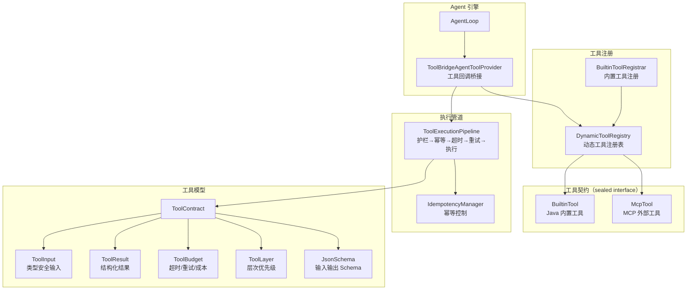
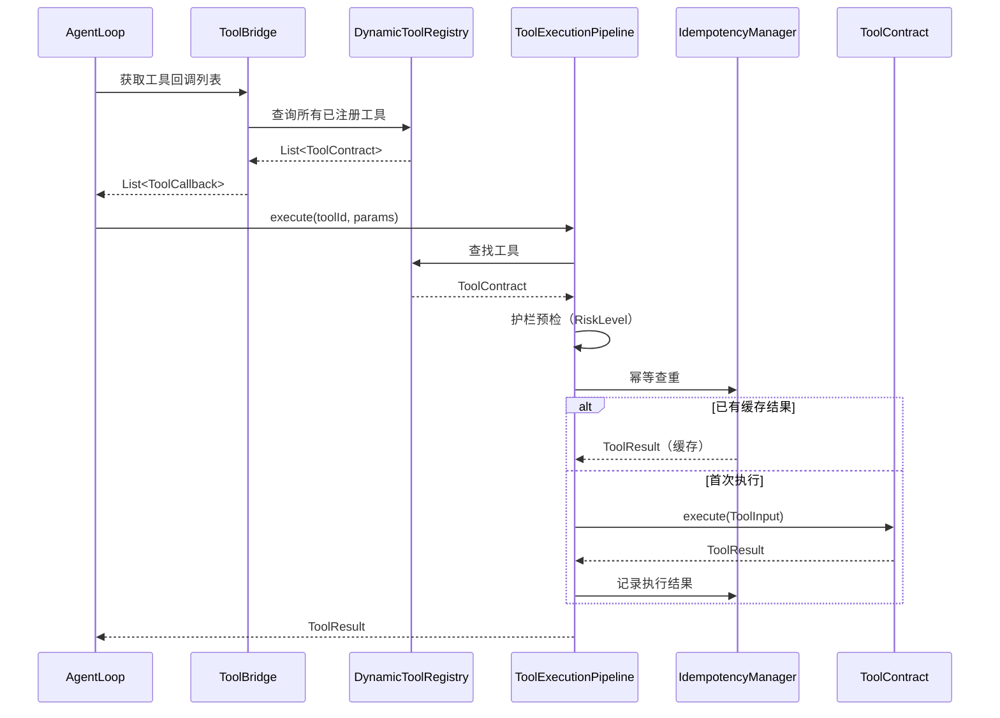

# 工具系统 — 架构设计

> **文档性质**：架构设计文档
> **模块归属**：`com.lifepilot.tool`
> **最后更新**：2026-03

## 1. 模块概述

工具系统是知微 Agent 与外部世界交互的桥梁，定义了统一的工具契约（ToolContract），支持两种工具来源（Java 原生内置工具、MCP 外部工具），并通过执行管道提供护栏检查、幂等控制、超时重试等保障。

> **重要变更**：原三层架构中的 `SkillTool`（SKILL_DECLARATIVE 层）已在渐进式披露重构中移除。
> Skill 不再注册为独立工具，而是通过 `load_skill` / `generate_skill` 两个 BuiltinTool 按需加载。

## 2. 架构图

## 3. 核心组件

### 3.1 ToolContract（sealed interface）

- 职责：工具生态的核心抽象，所有工具必须实现此接口
- 两个 permits：`BuiltinTool`（Java 内置）、`McpTool`（MCP 外部）
- 关键属性：`id()`、`name()`、`description()`、`riskLevel()`、`idempotent()`、`budget()`、`layer()`、`inputSchema()`、`outputSchema()`、`executionSemantics()`、`schedulingMode()`、`tags()`、`category()`、`exportable()`、`composable()`
- 关键方法：`execute(ToolInput)` → `ToolResult`

### 3.2 DynamicToolRegistry

- 职责：运行时工具注册表，支持两种来源的工具动态注册和查询
- 关键接口：`registerBuiltinTool()`、`registerMcpTools()`
- 工具层次优先级：BuiltinTool > McpTool，同 ID 高优先级覆盖低优先级

### 3.3 ToolExecutionPipeline

- 职责：工具执行管道，串联护栏检查、幂等控制、超时控制、重试逻辑
- 执行流程：护栏预检 → 幂等查重 → 超时包装 → 重试（指数退避） → 实际执行
- 关键接口：`execute(toolId, parameters, context)` → `ToolResult`

### 3.4 ToolBridgeAgentToolProvider

- 职责：将 ToolContract 转换为 Spring AI 的 ToolCallback，桥接 Agent 引擎和工具系统

## 4. 核心流程

## 5. 设计决策

| 决策 | 选择 | 理由 |
|------|------|------|
| 工具抽象 | sealed interface ToolContract | 编译期穷举两种工具类型，新增类型时编译器强制处理 |
| 层次优先级 | BuiltinTool > McpTool | 内置工具最可靠，MCP 外部工具优先级较低 |
| 执行管道 | Pipeline 模式 | 护栏、幂等、超时、重试等横切关注点解耦，可独立配置 |
| 输入验证 | JsonSchema + ToolInput.validate() | 工具执行前自动校验参数，防止无效调用 |

## 6. 集成点

- **Agent 引擎**（`agent`）：通过 ToolBridgeAgentToolProvider 提供工具回调
- **MCP 协议**（`mcp`）：McpTool 桥接 MCP 服务器提供的外部工具
- **Skill 系统**（`skill`）：通过 `load_skill` / `generate_skill` BuiltinTool 实现渐进式 Skill 发现与激活
- **护栏系统**（`guardrail` / `observability`）：执行管道中集成风险等级检查
- **可观测性**（`observability`）：工具执行轨迹记录

## 7. 配置参考

| 配置键 | 默认值 | 说明 |
|--------|--------|------|
| `lifepilot.tool.enabled` | `true` | 是否启用工具系统 |
| `lifepilot.tool.pipeline.*` | — | 执行管道配置（超时、重试等） |
