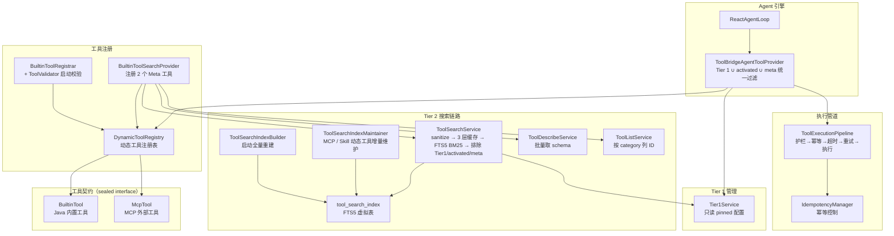
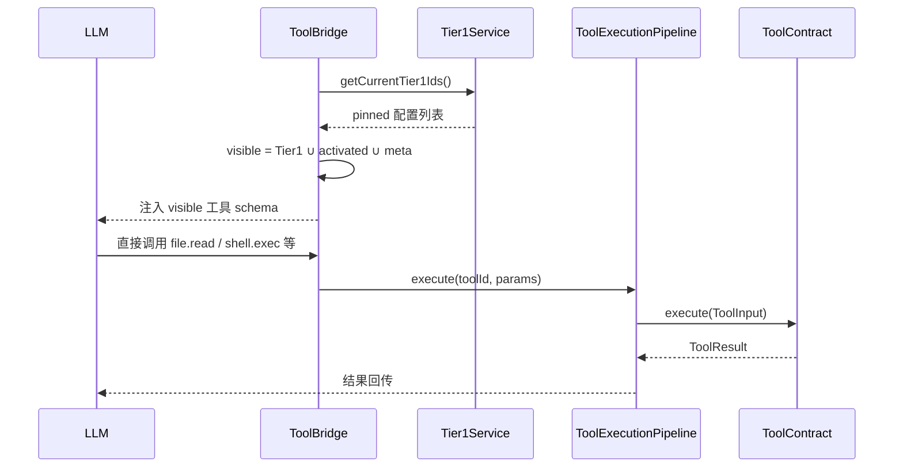
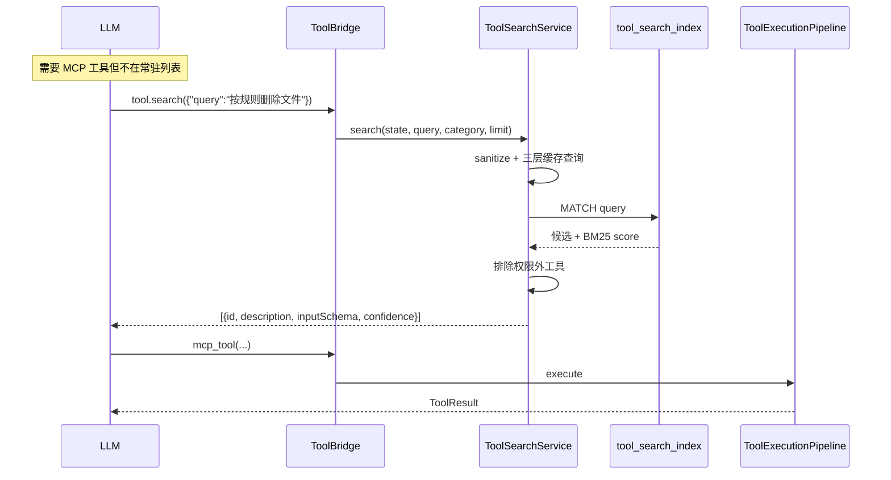

# 工具系统 — 架构设计

> **文档性质**：架构设计文档
> **模块归属**：`com.lifepilot.tool`
> **最后更新**：2026-05-03

## 1. 模块概述

工具系统是知微 Agent 与外部世界交互的桥梁，定义了统一的工具契约（ToolContract），支持两种工具来源（Java 原生内置工具、MCP 外部工具），并通过执行管道提供护栏检查、幂等控制、超时重试等保障。

工具对 LLM 的暴露采用**全量常驻模式**（2026-05 精简后）：

- **Tier 1（全量常驻）**：全部 15 个内置工具（含 `tool.search` 内省工具）始终随 system prompt 注入，无需延迟发现
- **MCP 工具**：通过 `tool.search` 发现，由 `ToolSearchIndexMaintainer` 维护到 FTS5 索引

此外 Skill 激活会把场景化工具集合注入到 `ReactAgentState.activatedToolIds`，临时加入可见集。

> **历史说明**：
> - 原三层架构中的 `SkillTool`（SKILL_DECLARATIVE 层）已在渐进式披露重构中移除。Skill 系统 v2（2026-04-24）把激活入口归一到 `skill.load(names=[...])` BuiltinTool；`file.read(skill=...)` 捷径、`SkillDisclosureTool` 空壳和 `generate_skill` 独立工具全部删除，自生成由 `SkillSynthesizer` 后台服务承担。
> - 旧的 `lifepilot.agent.core-tool-ids` 白名单字段已删除，由 `lifepilot.tool.tier1.pinned` 静态配置替代。
> - **2026-04-25 后**：原 `Tier1AdvisoryJob` / `ToolUsageStatsRecorder` 自动晋升 / 降级机制已下架（V29 删表）。单机本地部署没有"管理员审批"角色，PENDING advisory 永远不会被 APPROVE，整套机制是死代码。Tier 1 现在完全由 `application.yml` 的 `pinned` 列表手工维护。
> - **2026-04-25 后**：FTS5 索引 tokenizer 从 `unicode61` 切到 `trigram`（V30 迁移），并放开了 `ToolValidator` 对 description / tags 的英文限制。原方案依赖 metadata 英文化让 unicode61 word-level 分词，实际不利于中文 query；trigram 用 3-gram 滑窗双向 substring 匹配，对中文短语命中更友好，因此 description / tags 现在允许中英混排，并主动写入高频用户短语（如"删除文件""复制目录"）让 trigram 直接命中。

## 2. 架构图



## 3. 核心组件

### 3.1 ToolContract（sealed interface）

- 职责：工具生态的核心抽象，所有工具必须实现此接口
- 两个 permits：`BuiltinTool`（Java 内置）、`McpTool`（MCP 外部）
- 关键属性：`id()`、`name()`、`description()`、`riskLevel()`、`idempotent()`、`budget()`、`layer()`、`inputSchema()`、`outputSchema()`、`executionSemantics()`、`schedulingMode()`、`tags()`、`category()`、`exportable()`、`composable()`
- 关键方法：`execute(ToolInput)` → `ToolResult`

### 3.2 DynamicToolRegistry

- 职责：运行时工具注册表，支持两种来源的工具动态注册和查询
- 关键接口：`registerBuiltinTool()`、`registerMcpTools()`、`getToolSnapshot()`
- 工具层次优先级：BuiltinTool > McpTool，同 ID 高优先级覆盖低优先级

### 3.3 ToolBridgeAgentToolProvider（Tier 1 ∪ activated ∪ meta 统一过滤）

- 职责：实现 `AgentToolProvider`，把 `ToolContract` 转成 Spring AI `ToolCallback` 注入到 LLM 调用链
- 可见集合计算（`getToolCallbacks`）：
  - 多 Agent / 受限代理：按 `state.allowedToolIds()` 白名单过滤
  - 常规：`tier1Service.getCurrentTier1Ids()` ∪ `state.activatedToolIds()` ∪ `tool.search` 内省工具
- 每次调用把 `ReactAgentState` 放进 context（`ToolContextKeys.CALLER_STATE`），供 meta 工具的 executor 读取

### 3.4 Tier1Service（Tier 1 只读 pinned 配置）

- `Tier1Service.getCurrentTier1Ids()` 直接返回 `lifepilot.tool.tier1.pinned` 配置列表的副本
- `isPinned(toolId)` 用于降级保护判断
- 历史方案（2026-04-23）曾设计 `Tier1AdvisoryJob` + `ToolUsageStatsRecorder` 自动晋升链路（基于近 30 天会话覆盖率写 advisory，由管理员审批），**已于 2026-04-25 下架**：知微是单机本地部署，没有"管理员审批"角色，PENDING advisory 永远没有人 APPROVE，整套机制是死代码（V29 迁移删除 `tier1_advisory` / `tool_usage_stats` / `daily_active_sessions` 表与对应 7 个 Java 类）。Tier 1 名单调整改为直接编辑 `application.yml` 中的 `pinned` 列表。

### 3.5 ToolSearchService + 索引维护

- **FTS5 表 `tool_search_index`**（V19 创建，V30 切 tokenizer）：字段 `tool_id (UNINDEXED) / description / tags / actions / category`，`tokenize = 'trigram'`，3 字符滑窗双向 substring 匹配（中文 / 英文短语都能命中）
- `ToolSearchIndexBuilder` 在启动时全量重建索引；`ToolSearchIndexMaintainer` 在 MCP 工具注册 / Skill 生成新工具时增量维护
- 查询流程：`ToolSearchQuerySanitizer` 规范化输入 → 三层缓存（`SchemaCache` schema 常驻 / `SearchResultCache` layer A LRU / layer B TTL / `SessionSearchMemo` session 内问答） → 未命中走 FTS5 `MATCH` + BM25 排序 → 排除 Tier 1 / `activatedToolIds` / Meta 工具 / 权限外工具 → top-k 返回
- `ToolSearchQuerySanitizer` 适配 trigram：每个 token 切成 3-gram phrase 用 `OR` 连接（短 query 也能命中）；2 字符 token 用空格前缀凑 3 字符；保留字符 `"()*` 替换为空格；`AND/OR/NOT/NEAR` 关键字转小写避免被识别为操作符
- `bm25-confidence-threshold` 决定返回结果附带的 `confidence` 标签；低于阈值时 hint 提示 LLM 重写查询

### 3.6 Meta 工具 — `tool.search`

一个常驻 BuiltinTool，风险 `LOW`，`PARALLEL_SAFE`，`category=INTROSPECTION`：

| 工具 ID | 作用 | 关键参数 |
|---------|------|----------|
| `tool.search` | FTS5 BM25 + 语义 RRF 融合搜索工具注册表，返回工具 ID、描述和 inputSchema（2026-05 后集成语义向量召回） | `query`（必填），`category`（可选过滤），`limit`（默认 5，上限 20） |

`tools.describe` 已于 2026-05 删除——`tool.search` 直接返回 inputSchema，LLM 无需二次 describe。
Category 维度为 `PERCEPTION / ACTION / COGNITION / STORAGE / INTERACTION / INTROSPECTION / EXTENSION`（`ToolCategory` 枚举）。

### 3.7 ToolValidator（启动期命名强校验）

启动时由 `BuiltinToolRegistrar` 调用，硬规则违反抛 `IllegalStateException` 阻塞启动：

- `id`：`^[a-z][a-z0-9_]*(\.[a-z][a-z0-9_]*)*$`；namespace 必须在自描述白名单（`memory/knowledge/notify/shell/web/file/document/datastore/cron/channel/process/tools/ui/system/git/code/workflow`）或包含动词词根（`read/write/list/...`）
- `name`：必须含中文字符
- `description`：长度 ≥ 20 字符；允许中英混排（trigram 索引召回，无需强制英文）；未检测到中文且未含英文动词词根时 warn（软规则）
- `tags`：数量 ≥ 3 + 非空白 + 不重复；允许中英混排
- 豁免：`tool.search` meta 工具；以 `a2a_remote_` 开头的外部生态工具（A2A 远端 agent 等）

### 3.8 ToolExecutionPipeline

- 职责：工具执行管道，串联护栏检查、幂等控制、超时控制、重试逻辑
- 执行流程：护栏预检 → 幂等查重 → 超时包装 → 重试（指数退避） → 实际执行
- 关键接口：`execute(toolId, parameters, context)` → `ToolResult`

## 4. 核心流程

### 4.1 LLM 调用 Tier 1 工具（2 轮响应，常驻直出）



### 4.2 LLM 发现 MCP 工具（search + call）



## 5. 设计决策

| 决策 | 选择 | 理由 |
|------|------|------|
| 工具抽象 | sealed interface ToolContract | 编译期穷举两种工具类型，新增类型时编译器强制处理 |
| 层次优先级 | BuiltinTool > McpTool | 内置工具最可靠，MCP 外部工具优先级较低 |
| 分层暴露 | 全量常驻（Tier 1 注入全部 15 个工具） | 2026-05 精简后工具仅 15 个，全量注入上下文无压力，无需延迟加载分层 |
| 搜索算法 | FTS5 BM25 裸跑，向量 fallback 默认关闭 | BM25 对工具元数据这种短文本召回足够，观察数据后再决定是否启 `lifepilot.tool.search.fallback.vector-enabled` |
| Tier 1 维护 | 静态 `pinned` 配置 | 单机本地无审批角色，自动晋升机制成死代码（已下架），改为直接编辑 `application.yml` 维护名单 |
| 命名规范 | 启动期强校验 + 豁免 meta 工具 | 硬规则违反直接阻塞启动，防止运行时才暴露格式错误；`tool.search` meta 工具因 name 等风格差异豁免 |
| 语言策略 | description / tags 中英混排 + name 中文 | trigram tokenizer 双向 substring 匹配中文短语；description 主动写入"删除文件""复制目录"等高频用户短语让召回直接命中 |
| FTS5 tokenizer | trigram | 原 unicode61 把连续 CJK 视作单 token，必须整体匹配；trigram 3 字符滑窗 substring 命中，对中文 query 友好 |
| 执行管道 | Pipeline 模式 | 护栏、幂等、超时、重试等横切关注点解耦，可独立配置 |
| 输入验证 | JsonSchema + ToolInput.validate() | 工具执行前自动校验参数，防止无效调用 |

## 6. 集成点

- **Agent 引擎**（`agent`）：通过 `ToolBridgeAgentToolProvider` 提供工具回调，`ReactAgentLoop` 在 state 中累积 `activatedToolIds`（Skill 激活）
- **MCP 协议**（`mcp`）：`McpTool` 注册到 `DynamicToolRegistry`，由 `ToolSearchIndexMaintainer` 维护到 FTS5 索引；MCP 工具通过 `tool.search` 被发现
- **Skill 系统**（`skill`）：通过 `skill.load(names=[...])` BuiltinTool 实现按需激活（1-3 个/次），返回的 `activated_tool_ids` 合入 `ReactAgentState.activatedToolIds`；`suggested_tools` 引用的工具可由 `ToolSearchIndexMaintainer` 补入索引
- **护栏系统**（`guardrail` / `observability`）：执行管道中集成风险等级检查
- **可观测性**（`observability`）：工具执行轨迹记录；`ToolSearchService` 执行接入 Micrometer 指标（命中率、查询耗时、cache hit/miss）

## 7. 配置参考

### 7.1 基础配置

| 配置键 | 默认值 | 说明 |
|--------|--------|------|
| `lifepilot.tool.enabled` | `true` | 是否启用工具系统 |
| `lifepilot.tool.pipeline.default-timeout-seconds` | `30` | 默认执行超时 |
| `lifepilot.tool.pipeline.default-max-retries` | `2` | 默认最大重试次数 |
| `lifepilot.tool.pipeline.retry-initial-delay-ms` | `500` | 重试初始延迟 |
| `lifepilot.tool.pipeline.retry-multiplier` | `2.0` | 重试延迟倍数 |
| `lifepilot.tool.pipeline.retry-max-delay-ms` | `5000` | 重试最大延迟 |
| `lifepilot.tool.trusted-workspace.paths` | `[]` | 信任目录列表（降级 shell/code 风险等级） |
| `lifepilot.tool.trusted-workspace.downgrade-level` | `MEDIUM` | 信任目录内工具的降级目标风险等级 |

### 7.2 Tier 1 分层注入

| 配置键 | 默认值 | 说明 |
|--------|--------|------|
| `lifepilot.tool.tier1.pinned` | 见 application.yml | 人工固定的 Tier 1 工具 ID 列表（当前 15 个内置工具全量常驻：`memory/browser/code/shell.exec/shell.process/file.read/file.write/file.manage/web.search/web.fetch/cron/notify/status/ui.render/skill.load` + `tool.search` 内省工具） |

> 历史 `tier1.promotion.*` / `tier1.demotion.*` 子键已于 2026-04-25 删除（自动晋升 / 降级机制下架）。如需扩缩 Tier 1 名单，直接编辑 `pinned` 列表后重启即可生效。

### 7.3 搜索服务

| 配置键 | 默认值 | 说明 |
|--------|--------|------|
| `lifepilot.tool.search.default-limit` | `5` | `tool.search` 未传 limit 时的默认值 |
| `lifepilot.tool.search.max-limit` | `20` | `tool.search` 单次 limit 上限 |
| `lifepilot.tool.search.bm25-confidence-threshold` | `1.0` | BM25 分数高于此值标为 HIGH 置信度 |
| `lifepilot.tool.search.cache.layer-a-max-size` | `500` | 查询结果 LRU 缓存条目数 |
| `lifepilot.tool.search.cache.layer-b-max-size` | `1000` | 查询结果 TTL 缓存条目数 |
| `lifepilot.tool.search.cache.layer-b-ttl-minutes` | `5` | 查询结果 TTL 缓存时长 |
| `lifepilot.tool.search.fallback.vector-enabled` | `false` | 向量 fallback 总开关（BM25 低置信度时补救），观察 BM25 召回率后再决定是否开启 |

### 7.4 describe 服务（已于 2026-05 删除）

`tools.describe` 已随工具精简删除——`tool.search` 直接返回 inputSchema。相关配置 `lifepilot.tool.describe.max-batch-size` 已移除。

### 7.5 可观测性

`tool.search` 的查询耗时、缓存命中率通过 Micrometer 暴露到 `/actuator/metrics`（`management.endpoints.web.exposure.include` 已含 `metrics`）。

## 8. 数据库表（V19 创建 / V29 删表 / V30 切 tokenizer）

```sql
-- FTS5 搜索索引（虚拟表，不参与 Flyway checksum 校验）
-- V30 切到 trigram tokenizer：3 字符滑窗双向 substring 匹配，对中文短语友好
CREATE VIRTUAL TABLE tool_search_index USING fts5(
    tool_id UNINDEXED,
    description, tags, actions, category,
    tokenize = 'trigram'
);
```

> V19 原本还包含 `tool_usage_stats` / `tier1_advisory` 两张表用于 Tier 1 自动晋升链路。
> V29（2026-04-25）已 `DROP TABLE` 全部清理，原因见 §3.4 历史说明。
