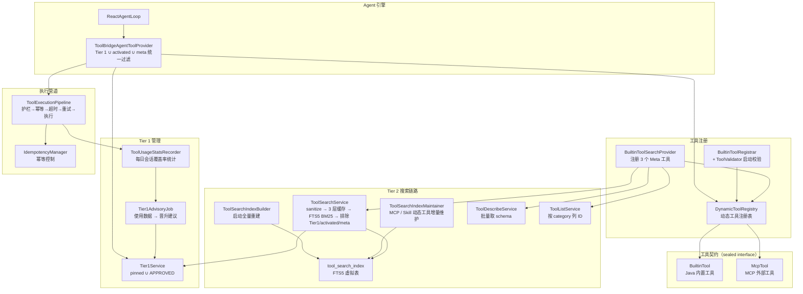
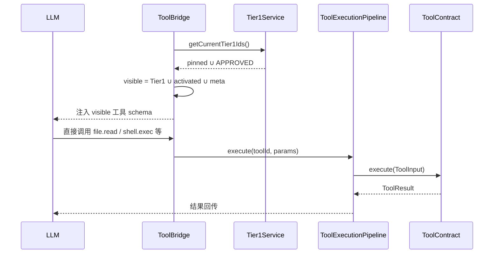
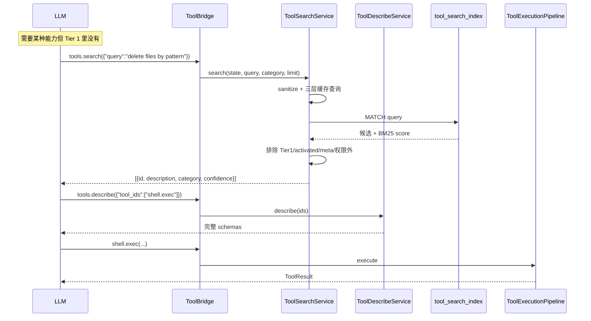
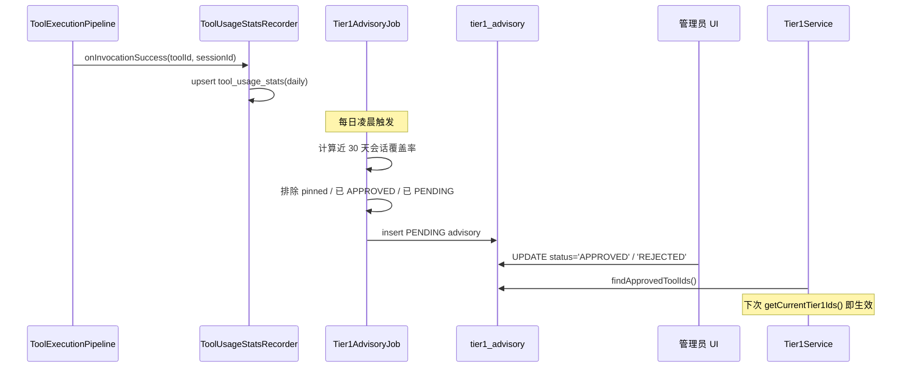

# 工具系统 — 架构设计

> **文档性质**：架构设计文档
> **模块归属**：`com.lifepilot.tool`
> **最后更新**：2026-04-23

## 1. 模块概述

工具系统是知微 Agent 与外部世界交互的桥梁，定义了统一的工具契约（ToolContract），支持两种工具来源（Java 原生内置工具、MCP 外部工具），并通过执行管道提供护栏检查、幂等控制、超时重试等保障。

工具对 LLM 的暴露采用**三层架构**（2026-04 重构后）：

- **Tier 1（常驻）**：`lifepilot.tool.tier1.pinned` + Tier1 Advisory 审批通过的工具，完整 schema 始终随系统 prompt 注入
- **Meta 层**：`tools.search` / `tools.describe` / `tools.list` 三个内省工具始终常驻，LLM 用它们发现 Tier 2 工具
- **Tier 2（延迟加载）**：其余所有 BuiltinTool + MCP 工具，进 FTS5 BM25 搜索索引；LLM 通过 `tools.search` 找到后用 `tools.describe` 取完整 schema，再直接调用

此外 Skill 激活会把场景化工具集合注入到 `ReactAgentState.activatedToolIds`，临时加入可见集。

> **历史说明**：
> - 原三层架构中的 `SkillTool`（SKILL_DECLARATIVE 层）已在渐进式披露重构中移除。Skill 系统 v2（2026-04-24）把激活入口归一到 `skill.load(names=[...])` BuiltinTool；`file.read(skill=...)` 捷径、`SkillDisclosureTool` 空壳和 `generate_skill` 独立工具全部删除，自生成由 `SkillSynthesizer` 后台服务承担。
> - 旧的 `lifepilot.agent.core-tool-ids` 白名单字段已删除，由 `lifepilot.tool.tier1.pinned` + `Tier1AdvisoryJob` 晋升机制替代。

## 2. 架构图



## 3. 核心组件

### 3.1 ToolContract（sealed interface）

- 职责：工具生态的核心抽象，所有工具必须实现此接口
- 两个 permits：`BuiltinTool`（Java 内置）、`McpTool`（MCP 外部）
- 关键属性：`id()`、`name()`、`description()`、`riskLevel()`、`idempotent()`、`budget()`、`layer()`、`inputSchema()`、`outputSchema()`、`executionSemantics()`、`schedulingMode()`、`tags()`、`category()`、`exportable()`、`composable()`
- 关键方法：`execute(ToolInput)` → `ToolResult`

### 3.2 DynamicToolRegistry

- 职责：运行时工具注册表，支持两种来源的工具动态注册和查询
- 关键接口：`registerBuiltinTool()`、`registerMcpTools()`、`getToolSnapshot()`
- 工具层次优先级：BuiltinTool > McpTool，同 ID 高优先级覆盖低优先级

### 3.3 ToolBridgeAgentToolProvider（Tier 1 ∪ activated ∪ meta 统一过滤）

- 职责：实现 `AgentToolProvider`，把 `ToolContract` 转成 Spring AI `ToolCallback` 注入到 LLM 调用链
- 可见集合计算（`getToolCallbacks`）：
  - 多 Agent / 受限代理：按 `state.allowedToolIds()` 白名单过滤，基础设施工具（`tags` 含 `infrastructure`）自动透传
  - 常规：`tier1Service.getCurrentTier1Ids()` ∪ `state.activatedToolIds()` ∪ Meta 工具集合（`tools.search/describe/list`）
- 每次调用把 `ReactAgentState` 放进 context（`ToolContextKeys.CALLER_STATE`），供 meta 工具的 executor 读取

### 3.4 Tier1Service / Tier1AdvisoryJob（Tier 1 动态晋升）

- `Tier1Service.getCurrentTier1Ids()` = `lifepilot.tool.tier1.pinned` ∪ `tier1_advisory.status='APPROVED'` 的 toolId
- `Tier1AdvisoryJob`（`@Scheduled` 每日）分析近 30 天 `tool_usage_stats` 的会话覆盖率，对超过 `session-threshold` 的候选写入 `tier1_advisory`（`PENDING` 状态），由管理员 UI 审批后才生效，**不自动改配置**
- `ToolUsageStatsRecorder` 实现 `ToolInvocationListener`，工具执行成功后日粒度写入 `tool_usage_stats`；日切时对超出保留窗口的历史数据做清理

### 3.5 ToolSearchService + 索引维护

- **FTS5 表 `tool_search_index`**（V15 迁移）：字段 `tool_id (UNINDEXED) / description / tags / actions / category`，`tokenize = 'unicode61 remove_diacritics 2'`，英文 word-level 分词
- `ToolSearchIndexBuilder` 在启动时全量重建索引；`ToolSearchIndexMaintainer` 在 MCP 工具注册 / Skill 生成新工具时增量维护
- 查询流程：`ToolSearchQuerySanitizer` 规范化输入 → 三层缓存（`SchemaCache` schema 常驻 / `SearchResultCache` layer A LRU / layer B TTL / `SessionSearchMemo` session 内问答） → 未命中走 FTS5 `MATCH` + BM25 排序 → 排除 Tier 1 / `activatedToolIds` / Meta 工具 / 权限外工具 → top-k 返回
- `bm25-confidence-threshold` 决定返回结果附带的 `confidence` 标签；低于阈值时 hint 提示 LLM 重写查询

### 3.6 Meta 工具（`BuiltinToolSearchProvider`）

三个常驻 BuiltinTool，风险 `LOW`，`PARALLEL_SAFE`，`category=INTROSPECTION`：

| 工具 ID | 作用 | 关键参数 |
|---------|------|----------|
| `tools.search` | 按英文关键字 BM25 搜工具 | `query`（必填），`category`（可选过滤），`limit`（默认 5，上限 20） |
| `tools.describe` | 批量取 schema | `tool_ids`（必填数组，批量上限 10） |
| `tools.list` | 按 category 列 ID | `category`（可选；省略列全部） |

Category 维度为 `PERCEPTION / ACTION / COGNITION / STORAGE / INTERACTION / INTROSPECTION / EXTENSION`（`ToolCategory` 枚举）。

### 3.7 ToolValidator（启动期命名强校验）

启动时由 `BuiltinToolRegistrar` 调用，硬规则违反抛 `IllegalStateException` 阻塞启动：

- `id`：`^[a-z][a-z0-9_]*(\.[a-z][a-z0-9_]*)*$`；namespace 必须在自描述白名单（`memory/knowledge/notify/shell/web/file/document/datastore/cron/channel/process/tools/ui/system/git/code/workflow`）或包含动词词根（`read/write/list/...`）
- `name`：必须含中文字符
- `description`：必须英文 + 长度 ≥ 40 字符；未含明确动词词根时 warn（软规则）
- `tags`：必须英文 + 数量 ≥ 3 + 不重复
- 豁免：`tools.search / tools.describe / tools.list` 三个 meta 工具

### 3.8 ToolExecutionPipeline

- 职责：工具执行管道，串联护栏检查、幂等控制、超时控制、重试逻辑
- 执行流程：护栏预检 → 幂等查重 → 超时包装 → 重试（指数退避） → 实际执行
- 关键接口：`execute(toolId, parameters, context)` → `ToolResult`

## 4. 核心流程

### 4.1 LLM 调用 Tier 1 工具（2 轮响应，常驻直出）



### 4.2 LLM 发现 Tier 2 工具（search → describe → call）



### 4.3 使用统计 → 晋升建议（后台异步）



## 5. 设计决策

| 决策 | 选择 | 理由 |
|------|------|------|
| 工具抽象 | sealed interface ToolContract | 编译期穷举两种工具类型，新增类型时编译器强制处理 |
| 层次优先级 | BuiltinTool > McpTool | 内置工具最可靠，MCP 外部工具优先级较低 |
| 分层暴露 | Tier 1 常驻 + Tier 2 BM25 延迟加载 | 对齐 Claude Code v2.1.69+ defer_loading 模式；Tier 1 任务保持 2 轮响应低延迟，Tier 2 覆盖无限扩展 |
| 搜索算法 | FTS5 BM25 裸跑，向量 fallback 默认关闭 | BM25 对工具元数据这种短文本召回足够，观察数据后再决定是否启 `lifepilot.tool.search.fallback.vector-enabled` |
| Tier 1 晋升 | Advisory 表 + 人工审批 | 不自动改配置，避免使用数据抖动导致 Tier 1 波动 |
| 命名规范 | 启动期强校验 + 豁免 meta 工具 | 硬规则违反直接阻塞启动，防止运行时才暴露格式错误；`tools.*` meta 工具因 name 等风格差异豁免 |
| 语言策略 | description 英文 + tags 英文 + name 中文 | description 和 tags 进 FTS5 索引需统一语言；name 仅 UI 展示用 |
| 执行管道 | Pipeline 模式 | 护栏、幂等、超时、重试等横切关注点解耦，可独立配置 |
| 输入验证 | JsonSchema + ToolInput.validate() | 工具执行前自动校验参数，防止无效调用 |

## 6. 集成点

- **Agent 引擎**（`agent`）：通过 `ToolBridgeAgentToolProvider` 提供工具回调，`ReactAgentLoop` 在 state 中累积 `activatedToolIds`（Skill 激活）
- **MCP 协议**（`mcp`）：`McpTool` 注册到 `DynamicToolRegistry`，由 `ToolSearchIndexMaintainer` 维护到 FTS5 索引；MCP 工具默认不进 Tier 1，通过 `tools.search` 被发现
- **Skill 系统**（`skill`）：通过 `skill.load(names=[...])` BuiltinTool 实现按需激活（1-3 个/次），返回的 `activated_tool_ids` 合入 `ReactAgentState.activatedToolIds`；`suggested_tools` 引用的工具可由 `ToolSearchIndexMaintainer` 补入索引
- **护栏系统**（`guardrail` / `observability`）：执行管道中集成风险等级检查
- **可观测性**（`observability`）：工具执行轨迹记录；`ToolSearchService` / `ToolDescribeService` 执行接入 Micrometer 指标（命中率、查询耗时、cache hit/miss）

## 7. 配置参考

### 7.1 基础配置

| 配置键 | 默认值 | 说明 |
|--------|--------|------|
| `lifepilot.tool.enabled` | `true` | 是否启用工具系统 |
| `lifepilot.tool.pipeline.default-timeout-seconds` | `30` | 默认执行超时 |
| `lifepilot.tool.pipeline.default-max-retries` | `2` | 默认最大重试次数 |
| `lifepilot.tool.pipeline.retry-initial-delay-ms` | `500` | 重试初始延迟 |
| `lifepilot.tool.pipeline.retry-multiplier` | `2.0` | 重试延迟倍数 |
| `lifepilot.tool.pipeline.retry-max-delay-ms` | `5000` | 重试最大延迟 |
| `lifepilot.tool.trusted-workspace.paths` | `[]` | 信任目录列表（降级 shell/code 风险等级） |
| `lifepilot.tool.trusted-workspace.downgrade-level` | `MEDIUM` | 信任目录内工具的降级目标风险等级 |

### 7.2 Tier 1 分层注入

| 配置键 | 默认值 | 说明 |
|--------|--------|------|
| `lifepilot.tool.tier1.pinned` | 见 application.yml | 人工固定的 Tier 1 工具 ID 列表，永不自动降级（当前含 `tools.search/describe/list` + `file.read/write/list` + `web.search/fetch` + `shell.exec` + `memory` + `knowledge.search`） |
| `lifepilot.tool.tier1.promotion.enabled` | `true` | 是否生成 Tier 1 晋升建议 |
| `lifepilot.tool.tier1.promotion.window-days` | `30` | 会话覆盖率统计窗口 |
| `lifepilot.tool.tier1.promotion.session-threshold` | `0.3` | 晋升候选的最小会话覆盖率 |
| `lifepilot.tool.tier1.promotion.max-promoted` | `3` | 单次 Job 最多生成的建议数 |
| `lifepilot.tool.tier1.demotion.enabled` | `true` | 是否对长期不用的 Tier 1 生成降级建议 |
| `lifepilot.tool.tier1.demotion.idle-days` | `60` | 视为"长期未使用"的天数 |
| `lifepilot.tool.tier1.demotion.respect-pinned` | `true` | 降级是否绕过 pinned 列表中的工具 |

### 7.3 搜索服务

| 配置键 | 默认值 | 说明 |
|--------|--------|------|
| `lifepilot.tool.search.default-limit` | `5` | `tools.search` 未传 limit 时的默认值 |
| `lifepilot.tool.search.max-limit` | `20` | `tools.search` 单次 limit 上限 |
| `lifepilot.tool.search.bm25-confidence-threshold` | `1.0` | BM25 分数高于此值标为 HIGH 置信度 |
| `lifepilot.tool.search.cache.layer-a-max-size` | `500` | 查询结果 LRU 缓存条目数 |
| `lifepilot.tool.search.cache.layer-b-max-size` | `1000` | 查询结果 TTL 缓存条目数 |
| `lifepilot.tool.search.cache.layer-b-ttl-minutes` | `5` | 查询结果 TTL 缓存时长 |
| `lifepilot.tool.search.fallback.vector-enabled` | `false` | 向量 fallback 总开关（BM25 低置信度时补救），观察 BM25 召回率后再决定是否开启 |

### 7.4 describe 服务

| 配置键 | 默认值 | 说明 |
|--------|--------|------|
| `lifepilot.tool.describe.max-batch-size` | `10` | `tools.describe` 单次最大批量 |

### 7.5 可观测性

`tools.search` / `tools.describe` 的查询耗时、缓存命中率通过 Micrometer 暴露到 `/actuator/metrics`（`management.endpoints.web.exposure.include` 已含 `metrics`）。

## 8. 数据库表（V15 迁移）

```sql
-- FTS5 搜索索引（虚拟表，不参与 Flyway checksum 校验）
CREATE VIRTUAL TABLE tool_search_index USING fts5(
    tool_id UNINDEXED,
    description, tags, actions, category,
    tokenize = 'unicode61 remove_diacritics 2'
);

-- 工具使用统计（per tool + per day）
CREATE TABLE tool_usage_stats (
    tool_id          TEXT    NOT NULL,
    stat_date        TEXT    NOT NULL,
    session_count    INTEGER NOT NULL DEFAULT 0,
    invocation_count INTEGER NOT NULL DEFAULT 0,
    PRIMARY KEY (tool_id, stat_date)
);
CREATE INDEX idx_tool_usage_stats_date ON tool_usage_stats(stat_date);

-- Tier 1 晋升建议（Job 生成 PENDING，管理员审批写 APPROVED/REJECTED）
CREATE TABLE tier1_advisory (
    id             INTEGER PRIMARY KEY AUTOINCREMENT,
    tool_id        TEXT    NOT NULL,
    advised_at     TEXT    NOT NULL,
    window_days    INTEGER NOT NULL,
    coverage_ratio REAL    NOT NULL,
    status         TEXT    NOT NULL DEFAULT 'PENDING',
    reviewed_by    TEXT,
    reviewed_at    TEXT,
    CONSTRAINT chk_advisory_status CHECK (status IN ('PENDING', 'APPROVED', 'REJECTED'))
);
CREATE INDEX idx_tier1_advisory_status ON tier1_advisory(status);
CREATE INDEX idx_tier1_advisory_tool ON tier1_advisory(tool_id);
```
