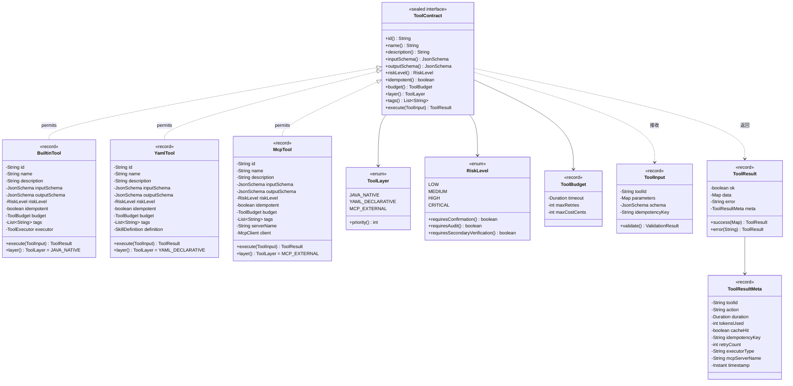
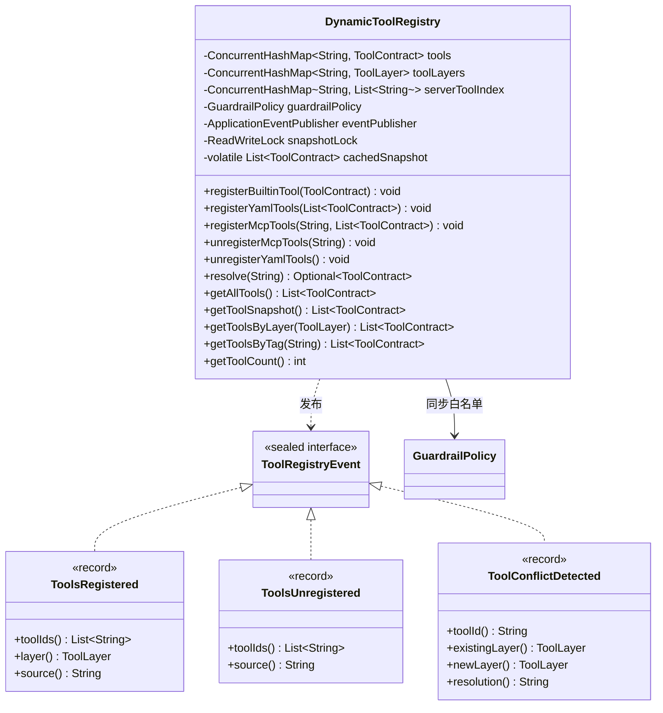
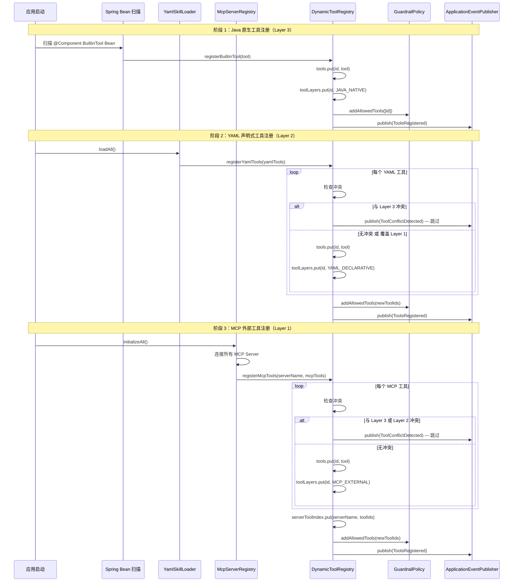
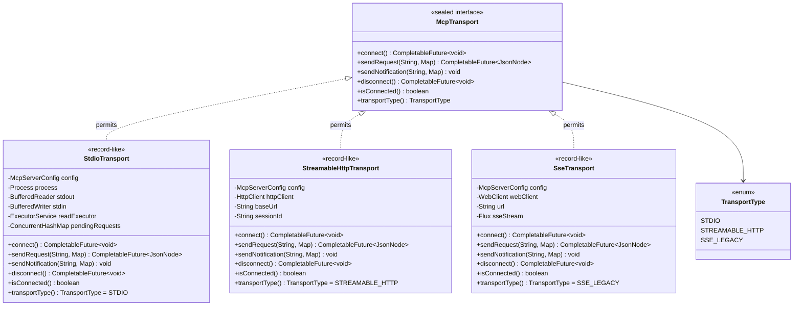
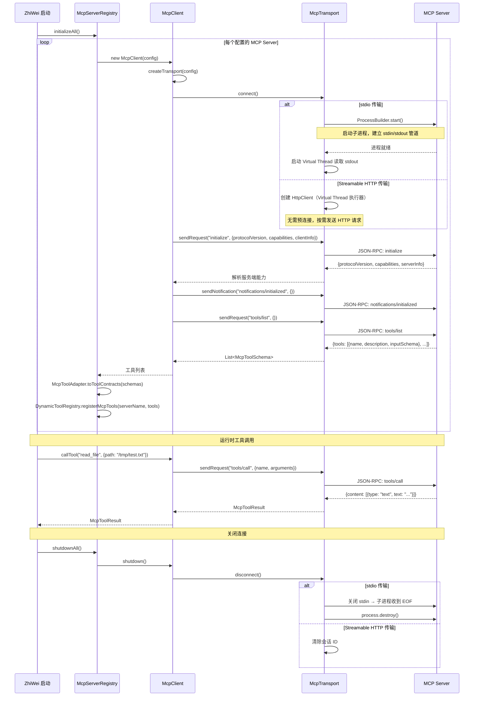
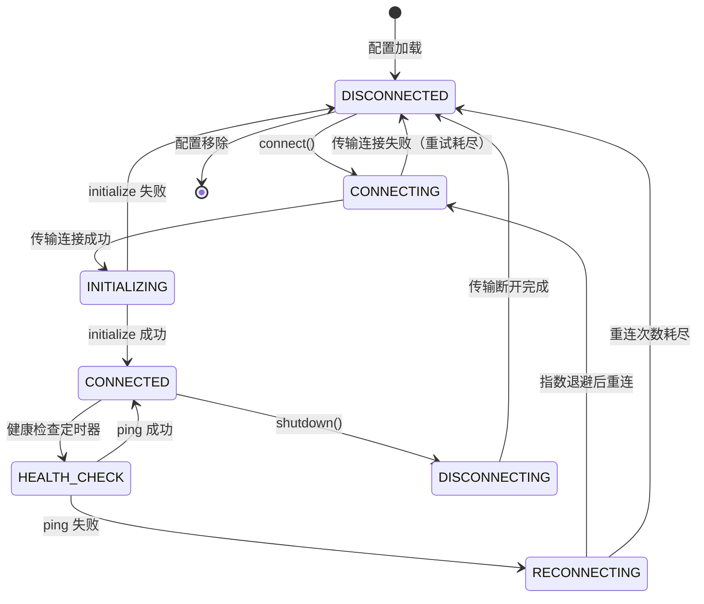
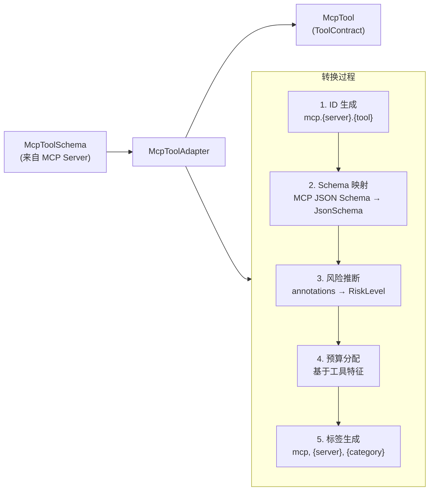
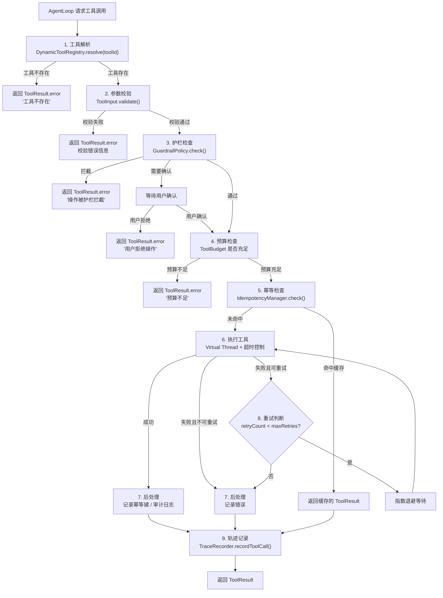
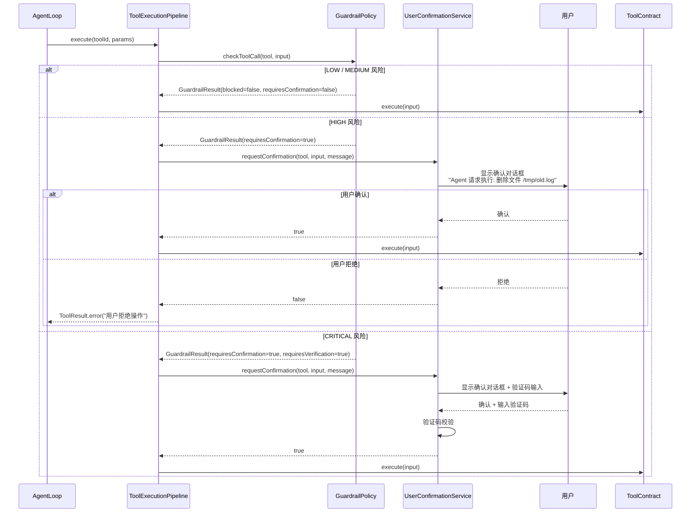
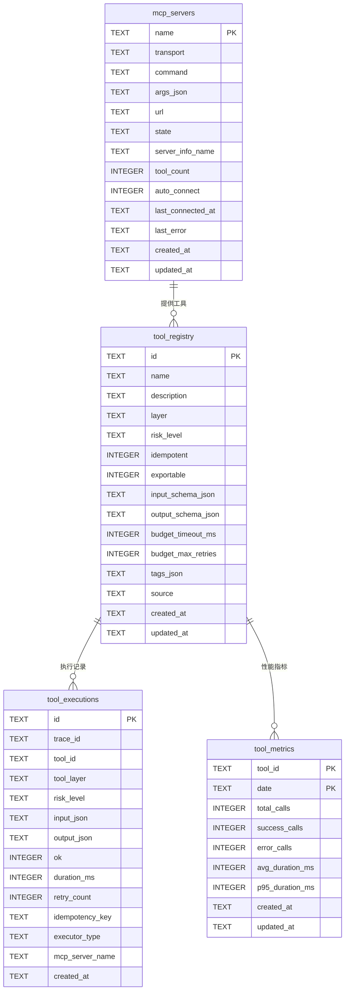

# 混合工具生态架构设计

> **文档性质**：深度架构设计文档（Developer-Facing）
> **目标读者**：核心开发者、架构评审者、技术面试官
> **模块归属**：`com.lifepilot.tool` / `com.lifepilot.mcp`
> **最后更新**：2026-03
> **从属关系**：本文档从 [ARCHITECTURE.md](../ARCHITECTURE.md) §6 拆分而来，聚焦混合工具生态的完整设计。

---

## 目录

- [1. 设计哲学与原则](#1-设计哲学与原则)
- [2. ToolContract — 工具契约体系](#2-toolcontract--工具契约体系)
- [3. DynamicToolRegistry — 动态工具注册中心](#3-dynamictoolregistry--动态工具注册中心)
- [4. MCP 协议深度集成](#4-mcp-协议深度集成)
- [5. McpServerRegistry — MCP 服务器注册中心](#5-mcpserverregistry--mcp-服务器注册中心)
- [6. McpToolAdapter — MCP 工具适配器](#6-mcptooladapter--mcp-工具适配器)
- [7. SkillToMcpBridge — 反向桥接](#7-skilltomcpbridge--反向桥接)
- [8. YAML 声明式工具加载](#8-yaml-声明式工具加载)
- [9. 工具执行管线](#9-工具执行管线)
- [10. 安全与沙箱](#10-安全与沙箱)
- [11. SQLite Schema 与 Flyway 迁移](#11-sqlite-schema-与-flyway-迁移)
- [12. 配置参考](#12-配置参考)
- [13. jqwik 属性测试](#13-jqwik-属性测试)
- [14. 性能基准与优化](#14-性能基准与优化)

---

## 1. 设计哲学与原则

### 1.1 核心命题：工具是 API 契约，不是建议

2025-2026 年的 AI Agent 工具生态经历了一次根本性的认知转变。早期的工具集成——无论是 LangChain 的 `@tool` 装饰器还是 AutoGen 的函数注册——本质上都是**围绕函数签名的松散绑定**。它们的核心假设是：只要给 LLM 一个函数名和描述，LLM 就能正确调用它。

这个假设在生产环境中被反复证伪：

```
传统工具集成的失败模式：

1. 参数幻觉（Parameter Hallucination）
   LLM 编造不存在的参数名 → 工具调用失败 → Agent 陷入重试循环
   一个简单的日历查询因为参数格式错误重试 5 次，消耗 10K Token

2. 类型不安全（Type Unsafety）
   工具期望 ISO 8601 日期字符串 → LLM 传入 "明天下午三点"
   → 运行时 ParseException → 错误信息对 LLM 无意义 → 再次幻觉

3. 副作用不可控（Uncontrolled Side Effects）
   LLM 决定 "帮用户清理过期日程" → 调用 delete_events 工具
   → 删除了用户的重要日程 → 不可逆 → 用户信任崩塌

4. 成本黑洞（Cost Black Hole）
   工具调用无超时限制 → 外部 API 响应慢 → Agent 等待 30 秒
   → 用户以为卡死 → 重新发送请求 → 两个 Agent 并发操作同一资源

5. 集成爆炸（Integration Explosion）
   N 个 Agent 框架 × M 个工具 = N×M 个适配器
   每个框架有自己的工具定义格式 → 工具无法跨框架复用
```

ZhiWei 的核心设计命题是：**工具是严格的 API 契约（Contract），不是给 LLM 的"建议"**。每个工具都有类型化的输入/输出 Schema、明确的幂等性保证、风险等级声明和执行预算。LLM 必须遵守契约，而非"尽力而为"。

### 1.2 N×M 问题与 MCP 的诞生

在 MCP（Model Context Protocol）出现之前，AI 工具生态面临经典的 **N×M 集成问题**：

```
┌─────────────────────────────────────────────────────────────────────────┐
│                    N×M 集成问题（MCP 之前）                              │
│                                                                         │
│  Agent 框架 (N)              工具/服务 (M)                               │
│  ┌──────────────┐            ┌──────────────┐                           │
│  │ LangChain    │────────────│ Google Calendar│                          │
│  │              │──────┐     │              │                           │
│  ├──────────────┤      │     ├──────────────┤                           │
│  │ AutoGen      │──────┼─────│ Slack API    │                           │
│  │              │──┐   │     │              │                           │
│  ├──────────────┤  │   │     ├──────────────┤                           │
│  │ CrewAI       │──┼───┼─────│ GitHub       │                           │
│  │              │  │   │     │              │                           │
│  ├──────────────┤  │   │     ├──────────────┤                           │
│  │ ZhiWei    │──┼───┼─────│ 本地文件系统  │                           │
│  └──────────────┘  │   │     └──────────────┘                           │
│                    │   │                                                │
│  每个框架都要为每个工具写适配器 → N×M 个适配器                            │
│  LangChain 的 Google Calendar 适配器 ≠ AutoGen 的 Google Calendar 适配器 │
└─────────────────────────────────────────────────────────────────────────┘
```

[MCP（Model Context Protocol）](https://modelcontextprotocol.io/specification/2025-06-18/basic)由 Anthropic 于 2024 年底创建，旨在解决这个 N×M 问题。其核心思想是定义一个**通用的工具交互协议**，使得任何 Agent 框架都可以通过同一协议与任何工具服务通信。2025 年 12 月，MCP 被捐赠给 Linux Foundation 的 [Agentic AI Foundation](https://www.linuxfoundation.org/)，成为行业标准。

```
┌─────────────────────────────────────────────────────────────────────────┐
│                    MCP 解决 N×M → N+M                                   │
│                                                                         │
│  Agent 框架 (N)         MCP 协议层          工具/服务 (M)                │
│  ┌──────────────┐    ┌──────────────┐    ┌──────────────┐              │
│  │ LangChain    │────│              │────│ Google Calendar│             │
│  ├──────────────┤    │              │    ├──────────────┤              │
│  │ AutoGen      │────│  MCP Client  │────│ Slack API    │              │
│  ├──────────────┤    │      ↕       │    ├──────────────┤              │
│  │ CrewAI       │────│  MCP Server  │────│ GitHub       │              │
│  ├──────────────┤    │              │    ├──────────────┤              │
│  │ ZhiWei    │────│              │────│ 本地文件系统  │              │
│  └──────────────┘    └──────────────┘    └──────────────┘              │
│                                                                         │
│  每个框架只需实现 MCP Client → N 个适配器                                │
│  每个工具只需实现 MCP Server → M 个适配器                                │
│  总计：N + M（而非 N × M）                                              │
└─────────────────────────────────────────────────────────────────────────┘
```

### 1.3 三层工具架构哲学

ZhiWei 并不完全依赖 MCP。我们设计了一个**三层工具架构**，在 MCP 的基础上增加了 Java 原生工具和 YAML 声明式工具两个层次。三层之间有明确的优先级关系：

```
┌─────────────────────────────────────────────────────────────────────────┐
│                    ZhiWei 三层工具架构                                 │
│                                                                         │
│  ┌─────────────────────────────────────────────────────────────────┐    │
│  │                DynamicToolRegistry（统一工具注册中心）             │    │
│  │                对 AgentLoop 完全透明 — 不关心工具来源              │    │
│  ├───────────────────┬───────────────────┬─────────────────────────┤    │
│  │  Layer 3（最高）   │  Layer 2（中）     │  Layer 1（基础）         │    │
│  │  Java 原生插件     │  YAML 声明式 Skill │  MCP 外部工具           │    │
│  ├───────────────────┼───────────────────┼─────────────────────────┤    │
│  │ Spring Bean 扫描   │ 配置文件解析       │ JSON-RPC 2.0 远程调用   │    │
│  │ 编译时类型安全     │ 模板引擎渲染       │ stdio / Streamable HTTP │    │
│  │ 完整 Spring 生态   │ 零代码开发         │ 动态发现               │    │
│  │ 性能最优          │ 运行时热加载       │ 跨语言支持              │    │
│  ├───────────────────┼───────────────────┼─────────────────────────┤    │
│  │ 优先级：最高       │ 优先级：中         │ 优先级：基础            │    │
│  │ 冲突时覆盖 L2/L1  │ 冲突时覆盖 L1     │ 被 L3/L2 覆盖          │    │
│  ├───────────────────┼───────────────────┼─────────────────────────┤    │
│  │ 适用场景：         │ 适用场景：         │ 适用场景：              │    │
│  │ 核心内置功能       │ 用户自定义扩展     │ 第三方服务集成          │    │
│  │ 性能敏感操作       │ 快速原型开发       │ 跨语言工具复用          │    │
│  │ 需要 Spring 注入   │ 非开发者配置       │ 社区生态工具            │    │
│  └───────────────────┴───────────────────┴─────────────────────────┘    │
│                                                                         │
│  优先级解析规则：                                                        │
│  1. 同名工具冲突时，高层覆盖低层（Layer 3 > Layer 2 > Layer 1）          │
│  2. 同层冲突时，先注册者优先，后注册者记录警告并跳过                      │
│  3. 覆盖关系在 DynamicToolRegistry 中透明处理，AgentLoop 无感知          │
└─────────────────────────────────────────────────────────────────────────┘
```

这个三层设计的核心理念是**渐进式能力扩展**：

| 层次 | 开发成本 | 类型安全 | 性能 | 灵活性 | 典型用户 |
|------|---------|---------|------|--------|---------|
| Layer 3: Java 原生 | 高（需要编写 Java 代码） | 编译时检查 | 最优（进程内调用） | 低（需要重新编译） | 核心开发者 |
| Layer 2: YAML 声明式 | 低（只需编写 YAML） | 运行时校验 | 中（模板渲染开销） | 高（热加载） | 高级用户 / 运维 |
| Layer 1: MCP 外部 | 中（需要 MCP Server） | 协议级校验 | 低（网络/进程开销） | 最高（跨语言） | 社区 / 第三方 |

### 1.4 五条核心设计原则

ZhiWei 工具生态遵循五条核心设计原则。这些原则不是抽象的口号，而是直接映射到具体的代码实现：

#### 原则 1：类型安全 — 输入输出必须有 Schema

每个工具的输入和输出都有明确的 JSON Schema 定义。LLM 不能"随意"传参——参数在执行前必须通过 Schema 校验。这消除了参数幻觉问题。

```java
/**
 * 类型安全的工具输入。
 *
 * <p>所有工具输入在执行前必须通过 JSON Schema 校验。
 * 校验失败时返回结构化错误信息，而非抛出异常，
 * 使 LLM 能够理解错误并修正参数。</p>
 *
 * @param toolId 目标工具 ID
 * @param parameters 参数 Map（已通过 Schema 校验）
 * @param schema 输入参数的 JSON Schema（用于校验）
 * @param idempotencyKey 幂等键（可选，用于副作用操作的去重）
 */
public record ToolInput(
    String toolId,
    Map<String, Object> parameters,
    JsonSchema schema,
    @Nullable String idempotencyKey
) {
    /** 校验参数是否符合 Schema。 */
    public ValidationResult validate() {
        var errors = schema.validate(parameters);
        if (errors.isEmpty()) {
            return ValidationResult.ok();
        }
        return ValidationResult.failed(errors);
    }

    /** 获取参数值（类型安全）。 */
    @SuppressWarnings("unchecked")
    public <T> T getParam(String name, Class<T> type) {
        Object value = parameters.get(name);
        if (value == null) {
            throw new ToolInputException("缺少必需参数: " + name);
        }
        if (!type.isInstance(value)) {
            throw new ToolInputException(
                "参数类型不匹配: %s 期望 %s，实际 %s"
                    .formatted(name, type.getSimpleName(),
                               value.getClass().getSimpleName()));
        }
        return (T) value;
    }

    /** 获取可选参数值。 */
    @SuppressWarnings("unchecked")
    public <T> Optional<T> getOptionalParam(String name, Class<T> type) {
        Object value = parameters.get(name);
        if (value == null) return Optional.empty();
        if (!type.isInstance(value)) return Optional.empty();
        return Optional.of((T) value);
    }
}
```

#### 原则 2：幂等性 — 副作用操作必须可安全重试

网络抖动、超时、进程崩溃——这些在分布式系统中是常态。如果一个工具调用因为超时被重试，但实际上第一次调用已经成功执行了副作用（比如发送了邮件），重试就会导致重复操作。幂等性保证解决了这个问题。

```java
/**
 * 幂等键管理器。
 *
 * <p>对于声明为幂等的工具，使用 idempotencyKey 确保相同的调用
 * 只执行一次副作用。已执行的调用直接返回缓存的结果。</p>
 *
 * <p>存储策略：
 * <ul>
 *   <li>短期缓存：ConcurrentHashMap（进程内，重启后失效）</li>
 *   <li>持久化：SQLite tool_executions 表（跨重启保留）</li>
 * </ul></p>
 */
@Service
public class IdempotencyManager {

    private static final Logger log = LoggerFactory.getLogger(IdempotencyManager.class);

    /** 进程内缓存：idempotencyKey → ToolResult。 */
    private final ConcurrentHashMap<String, ToolResult> cache = new ConcurrentHashMap<>();

    private final ToolExecutionRepository repository;

    public IdempotencyManager(ToolExecutionRepository repository) {
        this.repository = repository;
    }

    /**
     * 检查是否已执行过相同的幂等调用。
     *
     * @param key 幂等键
     * @return 如果已执行，返回缓存的结果；否则返回 empty
     */
    public Optional<ToolResult> checkDuplicate(String key) {
        // 先查进程内缓存
        ToolResult cached = cache.get(key);
        if (cached != null) {
            log.debug("幂等命中（内存缓存）: key={}", key);
            return Optional.of(cached);
        }
        // 再查持久化存储
        return repository.findByIdempotencyKey(key)
            .map(record -> {
                log.debug("幂等命中（持久化存储）: key={}", key);
                ToolResult result = record.toToolResult();
                cache.put(key, result); // 回填内存缓存
                return result;
            });
    }

    /**
     * 记录已执行的幂等调用。
     *
     * @param key 幂等键
     * @param result 执行结果
     */
    public void recordExecution(String key, ToolResult result) {
        cache.put(key, result);
        repository.saveExecution(key, result);
        log.debug("幂等记录保存: key={}", key);
    }
}
```

#### 原则 3：预算控制 — 每次调用有明确的资源边界

每个工具调用都有三维预算：超时时间、最大重试次数、最大成本（以分为单位）。预算在工具契约中声明，在执行管线中强制执行。

```java
/**
 * 工具执行预算。
 *
 * <p>三维预算模型：
 * <ul>
 *   <li>timeout — 单次调用的最大等待时间</li>
 *   <li>maxRetries — 失败后的最大重试次数（指数退避）</li>
 *   <li>maxCostCents — 单次调用的最大成本（分），用于付费 API</li>
 * </ul></p>
 *
 * <p>预算在工具注册时声明，在 ToolExecutionPipeline 中强制执行。
 * 超出预算的调用会被立即终止并返回结构化错误。</p>
 */
public record ToolBudget(
    Duration timeout,
    int maxRetries,
    int maxCostCents
) {
    /** 默认预算：30 秒超时，2 次重试，无成本限制。 */
    public static final ToolBudget DEFAULT = new ToolBudget(
        Duration.ofSeconds(30), 2, Integer.MAX_VALUE
    );

    /** 严格预算：5 秒超时，0 次重试，无成本限制。 */
    public static final ToolBudget STRICT = new ToolBudget(
        Duration.ofSeconds(5), 0, Integer.MAX_VALUE
    );

    /** MCP 工具默认预算：60 秒超时（网络开销），2 次重试。 */
    public static final ToolBudget MCP_DEFAULT = new ToolBudget(
        Duration.ofSeconds(60), 2, Integer.MAX_VALUE
    );

    /** 校验预算参数合法性。 */
    public ToolBudget {
        if (timeout.isNegative() || timeout.isZero()) {
            throw new IllegalArgumentException("超时时间必须为正数");
        }
        if (maxRetries < 0) {
            throw new IllegalArgumentException("最大重试次数不能为负数");
        }
        if (maxCostCents < 0) {
            throw new IllegalArgumentException("最大成本不能为负数");
        }
    }

    /** 创建自定义预算。 */
    public static ToolBudget of(Duration timeout, int maxRetries, int maxCostCents) {
        return new ToolBudget(timeout, maxRetries, maxCostCents);
    }
}
```

#### 原则 4：风险分级 — 不同风险等级有不同的审批流程

工具的风险等级决定了执行前的审批流程。这是"护栏优先于智能"原则在工具层的具体体现。即使 LLM 被越狱或产生幻觉，风险分级机制仍然能阻止危险操作。

```java
/**
 * 工具风险等级。
 *
 * <p>风险等级在工具注册时声明，在 ToolExecutionPipeline 中强制执行。
 * 参考 [AI Agent 安全最佳实践](https://skywork.ai/blog/ai-agent-safety-faq/)
 * 中的最小权限原则和人机协作（HITL）模式。</p>
 */
public enum RiskLevel {

    /**
     * 低风险：只读操作，无副作用。
     * 执行策略：自动执行，无需审批。
     * 示例：查询天气、读取日程、搜索知识库。
     */
    LOW,

    /**
     * 中风险：有副作用但可撤销。
     * 执行策略：自动执行 + 审计日志记录。
     * 示例：创建日程、添加备忘录、修改设置。
     */
    MEDIUM,

    /**
     * 高风险：不可逆操作。
     * 执行策略：需要用户确认后执行。
     * 示例：删除文件、发送邮件、执行 Shell 命令。
     */
    HIGH,

    /**
     * 关键风险：高风险 + 涉及敏感数据或资金。
     * 执行策略：用户确认 + 二次验证（如输入确认码）。
     * 示例：转账、删除账户、修改安全设置。
     */
    CRITICAL;

    /**
     * 判断是否需要用户确认。
     *
     * @return HIGH 和 CRITICAL 需要用户确认
     */
    public boolean requiresConfirmation() {
        return this == HIGH || this == CRITICAL;
    }

    /**
     * 判断是否需要审计日志。
     *
     * @return MEDIUM 及以上需要审计日志
     */
    public boolean requiresAudit() {
        return this.ordinal() >= MEDIUM.ordinal();
    }

    /**
     * 判断是否需要二次验证。
     *
     * @return 仅 CRITICAL 需要二次验证
     */
    public boolean requiresSecondaryVerification() {
        return this == CRITICAL;
    }
}
```

#### 原则 5：可观测性 — 每次工具调用都有完整的轨迹

工具调用不是"黑盒"。每次调用都会记录完整的轨迹信息，包括输入参数、输出结果、耗时、重试次数、是否命中缓存等。这些信息用于调试、审计和性能优化。

```java
/**
 * 工具执行轨迹元信息。
 *
 * <p>每次工具调用都会生成一个 ToolResultMeta，
 * 与 Agent 引擎的 TraceStep 关联，形成完整的决策轨迹。</p>
 */
@Builder(toBuilder = true)
public record ToolResultMeta(
    String toolId,                // 工具 ID
    String action,                // 执行的操作
    Duration duration,            // 执行耗时
    int tokensUsed,               // 消耗的 Token 数（如果涉及 LLM）
    boolean cacheHit,             // 是否命中幂等缓存
    @Nullable String idempotencyKey, // 幂等键
    int retryCount,               // 实际重试次数
    String executorType,          // 执行器类型：BUILTIN / YAML / MCP
    @Nullable String mcpServerName,  // MCP 服务器名称（如果是 MCP 工具）
    Instant timestamp             // 执行时间戳
) {}
```

### 1.5 与主流工具框架的对比分析

ZhiWei 的混合工具生态并非唯一的设计选择。以下是与主流框架的深度对比：

| 维度 | ZhiWei | LangChain4j | Spring AI (原生) | OpenClaw |
|------|-----------|-------------|-----------------|----------|
| **工具定义** | `sealed interface ToolContract` | `@Tool` 注解 + 反射 | `@Tool` 注解 + `FunctionCallback` | JSON Schema 配置 |
| **类型安全** | ✅ 编译时（sealed + record） | ⚠️ 运行时（反射） | ⚠️ 运行时（反射） | ❌ 纯 JSON |
| **MCP 支持** | ✅ 原生集成（Client + Server） | ⚠️ 社区插件 | ✅ `SyncMcpToolCallback` | ❌ 无 |
| **YAML 声明式** | ✅ 热加载 + 模板引擎 | ❌ 无 | ❌ 无 | ✅ JSON 配置 |
| **三层优先级** | ✅ Java > YAML > MCP | ❌ 扁平注册 | ❌ 扁平注册 | ❌ 扁平注册 |
| **风险分级** | ✅ 四级（LOW→CRITICAL） | ❌ 无 | ❌ 无 | ⚠️ 二级 |
| **幂等性** | ✅ idempotencyKey + 缓存 | ❌ 无 | ❌ 无 | ❌ 无 |
| **预算控制** | ✅ 三维（超时/重试/成本） | ⚠️ 仅超时 | ⚠️ 仅超时 | ❌ 无 |
| **反向桥接** | ✅ ZhiWei 可作 MCP Server | ❌ 无 | ❌ 无 | ❌ 无 |
| **沙箱执行** | ✅ Shell 白名单 + 进程隔离 | ❌ 无 | ❌ 无 | ⚠️ 基础 |
| **属性测试** | ✅ jqwik 验证不变量 | ❌ 无 | ❌ 无 | ❌ 无 |
| **实现语言** | Java 22 | Java 17+ | Java 17+ | Python |
| **Spring 生态** | ✅ 原生集成 | ⚠️ 部分 | ✅ 原生 | ❌ 无 |

### 1.6 前沿研究基础

ZhiWei 工具生态的设计建立在以下前沿研究和工程实践之上：

#### 1.6.1 MCP 规范 — 工具交互的行业标准

[MCP 规范（2025-06-18 版本）](https://modelcontextprotocol.io/specification/2025-06-18/basic)定义了 AI Agent 与外部工具交互的标准协议。其核心设计包括：

- **JSON-RPC 2.0** 作为消息格式，支持请求/响应和通知两种模式
- **能力协商（Capability Negotiation）**：客户端和服务器在连接建立时交换各自支持的能力
- **三种传输方式**：stdio（本地进程）、~~SSE~~（已在 2025-03-26 版本中弃用）、Streamable HTTP（推荐的远程传输方式）
- **工具发现**：`tools/list` 方法返回服务器提供的所有工具及其 JSON Schema

ZhiWei 的映射：`McpClient` 实现了完整的 MCP 客户端协议，`SkillToMcpBridge` 实现了 MCP 服务器协议，使 ZhiWei 既是 MCP 客户端也是 MCP 服务器。

#### 1.6.2 Spring AI MCP 集成 — 框架级支持

[Spring AI 的 MCP 集成](https://docs.spring.io/spring-ai/reference/api/mcp/mcp-client-boot-starter-docs.html)提供了 `SyncMcpToolCallback` 和 `SyncMcpToolCallbackProvider`，将 MCP 工具无缝集成到 Spring AI 的 `ChatClient` 工具调用链中。ZhiWei 在此基础上增加了：

- 三层优先级解析（Spring AI 原生只有扁平注册）
- 风险分级和审批流程
- 幂等性保证和预算控制
- 工具执行轨迹与 Agent Trace 的关联

#### 1.6.3 AI Agent 安全最佳实践

[AI Agent 安全最佳实践](https://skywork.ai/blog/ai-agent-safety-faq/)强调了工具调用场景下的关键安全原则：

- **最小权限（Least Privilege）**：工具只暴露必要的能力，不暴露底层系统的全部功能
- **沙箱执行（Sandboxed Execution）**：Shell 命令在受限环境中执行，禁止危险操作
- **审计日志（Audit Logging）**：所有工具调用都有完整的审计记录
- **人机协作（HITL）**：高风险操作需要人类确认

ZhiWei 的映射：`RiskLevel` 四级分级 + `GuardrailPolicy` 护栏策略 + `ToolExecutionPipeline` 审计记录。

#### 1.6.4 MCP Java SDK — 协议实现基础

[MCP Java SDK](https://modelcontextprotocol.io/sdk/java/mcp-overview)（版本 0.12.1，groupId: `io.modelcontextprotocol.sdk`，artifactId: `mcp`）提供了 MCP 协议的 Java 实现，包括：

- `McpSyncClient` / `McpAsyncClient`：同步和异步客户端
- `McpServer`：服务器端实现
- 三种传输支持：STDIO、SSE（兼容旧服务器）、Streamable HTTP
- Spring 特定传输作为可选依赖

ZhiWei 使用 BOM 管理 MCP Java SDK 的版本，确保所有 MCP 相关依赖版本一致。

---

## 2. ToolContract — 工具契约体系

### 2.1 核心设计：sealed interface 穷举工具类型

ZhiWei 使用 Java 22 的 `sealed interface` 定义工具契约体系。`sealed` 关键字确保所有工具类型在编译时已知，`switch` 表达式可以穷举匹配，不会遗漏任何类型。



### 2.2 ToolContract sealed interface 完整实现

```java
package com.lifepilot.tool;

import com.lifepilot.tool.budget.ToolBudget;
import com.lifepilot.tool.model.*;
import com.lifepilot.tool.schema.JsonSchema;
import jakarta.annotation.Nullable;

import java.util.List;

/**
 * 工具契约 — ZhiWei 工具生态的核心抽象。
 *
 * <p>所有工具（无论来源）都必须实现此接口。sealed 修饰符确保
 * 工具类型在编译时完全已知，switch 表达式可以穷举匹配。</p>
 *
 * <p>设计原则：
 * <ol>
 *   <li>输入必须类型化和校验（JSON Schema）</li>
 *   <li>输出必须结构化（不是"漂亮的文本"）</li>
 *   <li>副作用操作必须幂等（通过 idempotencyKey）</li>
 *   <li>每次调用有预算（超时 + 重试次数 + 成本上限）</li>
 *   <li>每个工具声明自己的风险等级</li>
 * </ol></p>
 *
 * <p>兼容性：ToolContract 的 JSON Schema 格式与
 * <a href="https://modelcontextprotocol.io/specification/2025-06-18/basic">MCP 规范</a>
 * 的 Tool Schema 完全兼容，可以双向转换。</p>
 *
 * @see BuiltinTool Java 原生工具（Layer 3）
 * @see YamlTool YAML 声明式工具（Layer 2）
 * @see McpTool MCP 外部工具（Layer 1）
 */
public sealed interface ToolContract permits BuiltinTool, YamlTool, McpTool {

    /** 工具唯一标识（全局唯一，格式：{namespace}.{name}）。 */
    String id();

    /** 工具显示名称（供 UI 展示）。 */
    String name();

    /** 工具描述（供 LLM 理解工具用途，应简洁准确）。 */
    String description();

    /** 输入参数的 JSON Schema。 */
    JsonSchema inputSchema();

    /** 输出类型的 JSON Schema。 */
    JsonSchema outputSchema();

    /** 风险等级：LOW / MEDIUM / HIGH / CRITICAL。 */
    RiskLevel riskLevel();

    /** 是否幂等（相同输入多次调用结果一致）。 */
    boolean idempotent();

    /** 执行预算（超时、重试、成本上限）。 */
    ToolBudget budget();

    /** 工具所属层次（JAVA_NATIVE / YAML_DECLARATIVE / MCP_EXTERNAL）。 */
    ToolLayer layer();

    /** 工具标签（用于分类和过滤）。 */
    List<String> tags();

    /** 是否可导出为 MCP 工具（供外部 Agent 调用）。 */
    default boolean exportable() {
        return false;
    }

    /**
     * 执行工具。
     *
     * <p>注意：此方法不应直接调用。应通过 ToolExecutionPipeline 执行，
     * 以确保参数校验、护栏检查、预算控制和轨迹记录。</p>
     *
     * @param input 类型安全的工具输入（已通过 Schema 校验）
     * @return 结构化的执行结果
     */
    ToolResult execute(ToolInput input);
}
```

### 2.3 ToolLayer 枚举

```java
package com.lifepilot.tool.model;

/**
 * 工具层次枚举。
 *
 * <p>定义三层工具架构的优先级。同名工具冲突时，
 * 高优先级层覆盖低优先级层。</p>
 */
public enum ToolLayer {

    /** MCP 外部工具 — 优先级最低（1）。 */
    MCP_EXTERNAL(1),

    /** YAML 声明式工具 — 优先级中等（2）。 */
    YAML_DECLARATIVE(2),

    /** Java 原生工具 — 优先级最高（3）。 */
    JAVA_NATIVE(3);

    private final int priority;

    ToolLayer(int priority) {
        this.priority = priority;
    }

    /**
     * 获取优先级数值。数值越大优先级越高。
     *
     * @return 优先级数值
     */
    public int priority() {
        return priority;
    }

    /**
     * 判断当前层是否优先于另一层。
     *
     * @param other 另一层
     * @return 如果当前层优先级更高，返回 true
     */
    public boolean overrides(ToolLayer other) {
        return this.priority > other.priority;
    }
}
```

### 2.4 BuiltinTool — Java 原生工具实现

```java
package com.lifepilot.tool;

import com.lifepilot.tool.budget.ToolBudget;
import com.lifepilot.tool.model.*;
import com.lifepilot.tool.schema.JsonSchema;

import java.util.List;

/**
 * Java 原生工具（Layer 3）。
 *
 * <p>通过 Spring Bean 扫描自动注册。编译时类型安全，
 * 性能最优（进程内调用，无序列化开销）。</p>
 *
 * <p>典型用途：
 * <ul>
 *   <li>核心内置功能（日程管理、记忆检索、知识库查询）</li>
 *   <li>性能敏感操作（本地文件操作、数据库查询）</li>
 *   <li>需要 Spring 依赖注入的操作</li>
 * </ul></p>
 *
 * @param id 工具唯一标识
 * @param name 工具显示名称
 * @param description 工具描述（供 LLM 理解）
 * @param inputSchema 输入参数 JSON Schema
 * @param outputSchema 输出类型 JSON Schema
 * @param riskLevel 风险等级
 * @param idempotent 是否幂等
 * @param budget 执行预算
 * @param tags 工具标签
 * @param exportable 是否可导出为 MCP 工具
 * @param executor 实际执行逻辑
 */
public record BuiltinTool(
    String id,
    String name,
    String description,
    JsonSchema inputSchema,
    JsonSchema outputSchema,
    RiskLevel riskLevel,
    boolean idempotent,
    ToolBudget budget,
    List<String> tags,
    boolean exportable,
    ToolExecutor executor
) implements ToolContract {

    /** Layer 3 — Java 原生。 */
    @Override
    public ToolLayer layer() {
        return ToolLayer.JAVA_NATIVE;
    }

    /**
     * 执行工具 — 委托给 ToolExecutor。
     *
     * @param input 已校验的工具输入
     * @return 结构化执行结果
     */
    @Override
    public ToolResult execute(ToolInput input) {
        return executor.execute(input);
    }

    /** Builder 模式构建 BuiltinTool。 */
    public static Builder builder() {
        return new Builder();
    }

    public static class Builder {
        private String id;
        private String name;
        private String description;
        private JsonSchema inputSchema;
        private JsonSchema outputSchema;
        private RiskLevel riskLevel = RiskLevel.LOW;
        private boolean idempotent = true;
        private ToolBudget budget = ToolBudget.DEFAULT;
        private List<String> tags = List.of();
        private boolean exportable = false;
        private ToolExecutor executor;

        public Builder id(String id) { this.id = id; return this; }
        public Builder name(String name) { this.name = name; return this; }
        public Builder description(String description) { this.description = description; return this; }
        public Builder inputSchema(JsonSchema inputSchema) { this.inputSchema = inputSchema; return this; }
        public Builder outputSchema(JsonSchema outputSchema) { this.outputSchema = outputSchema; return this; }
        public Builder riskLevel(RiskLevel riskLevel) { this.riskLevel = riskLevel; return this; }
        public Builder idempotent(boolean idempotent) { this.idempotent = idempotent; return this; }
        public Builder budget(ToolBudget budget) { this.budget = budget; return this; }
        public Builder tags(List<String> tags) { this.tags = List.copyOf(tags); return this; }
        public Builder exportable(boolean exportable) { this.exportable = exportable; return this; }
        public Builder executor(ToolExecutor executor) { this.executor = executor; return this; }

        public BuiltinTool build() {
            return new BuiltinTool(id, name, description, inputSchema, outputSchema,
                riskLevel, idempotent, budget, List.copyOf(tags), exportable, executor);
        }
    }
}
```

### 2.5 YamlTool — YAML 声明式工具实现

```java
package com.lifepilot.tool;

import com.lifepilot.tool.budget.ToolBudget;
import com.lifepilot.tool.model.*;
import com.lifepilot.tool.schema.JsonSchema;
import com.lifepilot.tool.yaml.SkillDefinition;
import com.lifepilot.tool.yaml.YamlToolExecutor;

import java.util.List;

/**
 * YAML 声明式工具（Layer 2）。
 *
 * <p>从 YAML 配置文件加载，支持运行时热加载。
 * 零代码开发，适合非开发者用户自定义扩展。</p>
 *
 * <p>支持的 action 类型：
 * <ul>
 *   <li>http — HTTP API 调用（GET/POST/PUT/DELETE）</li>
 *   <li>shell — 本地命令执行（需要安全校验）</li>
 *   <li>chain — 多步骤链式调用</li>
 *   <li>template — 模板渲染输出</li>
 * </ul></p>
 *
 * @param id 工具唯一标识（从 YAML 的 id 字段读取）
 * @param name 工具显示名称
 * @param description 工具描述
 * @param inputSchema 输入参数 JSON Schema（从 YAML 的 parameters 字段生成）
 * @param outputSchema 输出类型 JSON Schema
 * @param riskLevel 风险等级（从 YAML 的 risk 字段读取，默认 MEDIUM）
 * @param idempotent 是否幂等
 * @param budget 执行预算
 * @param tags 工具标签
 * @param definition YAML Skill 定义（包含完整的 action 配置）
 */
public record YamlTool(
    String id,
    String name,
    String description,
    JsonSchema inputSchema,
    JsonSchema outputSchema,
    RiskLevel riskLevel,
    boolean idempotent,
    ToolBudget budget,
    List<String> tags,
    SkillDefinition definition
) implements ToolContract {

    /** Layer 2 — YAML 声明式。 */
    @Override
    public ToolLayer layer() {
        return ToolLayer.YAML_DECLARATIVE;
    }

    /** YAML 工具默认不可导出。 */
    @Override
    public boolean exportable() {
        return false;
    }

    /**
     * 执行工具 — 委托给 YamlToolExecutor。
     *
     * <p>根据 SkillDefinition 中的 action 类型，
     * 分发到对应的执行器（HttpExecutor / ShellExecutor / ChainExecutor / TemplateExecutor）。</p>
     *
     * @param input 已校验的工具输入
     * @return 结构化执行结果
     */
    @Override
    public ToolResult execute(ToolInput input) {
        return YamlToolExecutor.execute(definition, input);
    }
}
```

### 2.6 McpTool — MCP 外部工具实现

```java
package com.lifepilot.tool;

import com.lifepilot.mcp.McpClient;
import com.lifepilot.tool.budget.ToolBudget;
import com.lifepilot.tool.model.*;
import com.lifepilot.tool.schema.JsonSchema;
import org.slf4j.Logger;
import org.slf4j.LoggerFactory;

import java.time.Duration;
import java.time.Instant;
import java.util.List;
import java.util.Map;

/**
 * MCP 外部工具（Layer 1）。
 *
 * <p>通过 MCP 协议与外部 MCP Server 通信。
 * 支持跨语言工具复用，动态发现。</p>
 *
 * <p>执行流程：
 * <ol>
 *   <li>将 ToolInput 序列化为 JSON-RPC 参数</li>
 *   <li>通过 McpClient 发送 tools/call 请求</li>
 *   <li>等待响应（受 ToolBudget.timeout 限制）</li>
 *   <li>将 JSON-RPC 响应反序列化为 ToolResult</li>
 * </ol></p>
 *
 * @param id 工具唯一标识（格式：mcp.{serverName}.{toolName}）
 * @param name 工具显示名称
 * @param description 工具描述（来自 MCP Server 的 tool schema）
 * @param inputSchema 输入参数 JSON Schema（来自 MCP Server）
 * @param outputSchema 输出类型 JSON Schema
 * @param riskLevel 风险等级（从 MCP 工具注解推断，默认 MEDIUM）
 * @param idempotent 是否幂等（从 MCP 工具注解推断，默认 false）
 * @param budget 执行预算（MCP 工具默认 60 秒超时）
 * @param tags 工具标签
 * @param serverName MCP 服务器名称
 * @param mcpToolName MCP 工具原始名称（可能与 id 不同）
 * @param client MCP 客户端实例
 */
public record McpTool(
    String id,
    String name,
    String description,
    JsonSchema inputSchema,
    JsonSchema outputSchema,
    RiskLevel riskLevel,
    boolean idempotent,
    ToolBudget budget,
    List<String> tags,
    String serverName,
    String mcpToolName,
    McpClient client
) implements ToolContract {

    private static final Logger log = LoggerFactory.getLogger(McpTool.class);

    /** Layer 1 — MCP 外部。 */
    @Override
    public ToolLayer layer() {
        return ToolLayer.MCP_EXTERNAL;
    }

    /**
     * 执行 MCP 工具调用。
     *
     * <p>通过 McpClient 发送 JSON-RPC tools/call 请求。
     * 超时由 ToolBudget 控制，在 ToolExecutionPipeline 中强制执行。</p>
     *
     * @param input 已校验的工具输入
     * @return 结构化执行结果
     */
    @Override
    public ToolResult execute(ToolInput input) {
        Instant start = Instant.now();
        try {
            log.debug("MCP 工具调用开始: server={}, tool={}", serverName, mcpToolName);

            var mcpResult = client.callTool(mcpToolName, input.parameters())
                .join(); // CompletableFuture → 同步等待

            Duration duration = Duration.between(start, Instant.now());
            log.debug("MCP 工具调用完成: server={}, tool={}, duration={}ms",
                serverName, mcpToolName, duration.toMillis());

            return ToolResult.success(
                Map.of("content", mcpResult.content()),
                ToolResultMeta.builder()
                    .toolId(id)
                    .action("tools/call")
                    .duration(duration)
                    .tokensUsed(0)
                    .cacheHit(false)
                    .retryCount(0)
                    .executorType("MCP")
                    .mcpServerName(serverName)
                    .timestamp(Instant.now())
                    .build()
            );
        } catch (Exception e) {
            Duration duration = Duration.between(start, Instant.now());
            log.warn("MCP 工具调用失败: server={}, tool={}, error={}",
                serverName, mcpToolName, e.getMessage());

            return ToolResult.error(
                "MCP 工具调用失败: " + e.getMessage(),
                ToolResultMeta.builder()
                    .toolId(id)
                    .action("tools/call")
                    .duration(duration)
                    .tokensUsed(0)
                    .cacheHit(false)
                    .retryCount(0)
                    .executorType("MCP")
                    .mcpServerName(serverName)
                    .timestamp(Instant.now())
                    .build()
            );
        }
    }
}
```

### 2.7 ToolExecutor — 工具执行函数式接口

```java
package com.lifepilot.tool;

import com.lifepilot.tool.model.ToolInput;
import com.lifepilot.tool.model.ToolResult;

/**
 * 工具执行器函数式接口。
 *
 * <p>BuiltinTool 的实际执行逻辑通过此接口注入。
 * 使用函数式接口使得工具执行逻辑可以用 Lambda 表达式定义，
 * 也可以用 Spring Bean 方法引用注入。</p>
 *
 * <p>实现约束：
 * <ul>
 *   <li>不应抛出受检异常 — 所有错误通过 ToolResult.error() 返回</li>
 *   <li>不应自行处理超时 — 超时由 ToolExecutionPipeline 统一管理</li>
 *   <li>不应自行重试 — 重试由 ToolExecutionPipeline 统一管理</li>
 *   <li>应保证线程安全 — 可能被多个 Virtual Thread 并发调用</li>
 * </ul></p>
 */
@FunctionalInterface
public interface ToolExecutor {

    /**
     * 执行工具逻辑。
     *
     * @param input 已通过 Schema 校验的工具输入
     * @return 结构化执行结果（成功或失败）
     */
    ToolResult execute(ToolInput input);
}
```

### 2.8 ToolResult — 结构化执行结果

```java
package com.lifepilot.tool.model;

import jakarta.annotation.Nullable;
import lombok.Builder;

import java.time.Duration;
import java.time.Instant;
import java.util.Map;

/**
 * 工具执行结果 — 结构化信封。
 *
 * <p>所有工具调用（无论成功或失败）都返回 ToolResult。
 * 这确保了 Agent 引擎可以统一处理工具输出，
 * 而不需要区分异常和正常返回。</p>
 *
 * <p>设计决策：使用 record 而非异常来表示失败。
 * 原因：工具调用失败是正常的业务场景（如 API 不可用），
 * 不应该用异常控制流。LLM 需要理解失败原因并决定下一步。</p>
 *
 * @param ok 是否成功
 * @param data 结构化数据（成功时非空）
 * @param error 错误信息（失败时非空）
 * @param meta 执行元信息（用于 Trace 和审计）
 */
@Builder(toBuilder = true)
public record ToolResult(
    boolean ok,
    Map<String, Object> data,
    @Nullable String error,
    ToolResultMeta meta
) {
    /**
     * 创建成功结果。
     *
     * @param data 结构化数据
     * @param meta 执行元信息
     * @return 成功的 ToolResult
     */
    public static ToolResult success(Map<String, Object> data, ToolResultMeta meta) {
        return new ToolResult(true, Map.copyOf(data), null, meta);
    }

    /**
     * 创建失败结果。
     *
     * @param message 错误信息（供 LLM 理解失败原因）
     * @param meta 执行元信息
     * @return 失败的 ToolResult
     */
    public static ToolResult error(String message, ToolResultMeta meta) {
        return new ToolResult(false, Map.of(), message, meta);
    }

    /**
     * 创建简单成功结果（无元信息，用于测试）。
     *
     * @param data 结构化数据
     * @return 成功的 ToolResult
     */
    public static ToolResult success(Map<String, Object> data) {
        return new ToolResult(true, Map.copyOf(data), null, ToolResultMeta.empty());
    }

    /**
     * 创建简单失败结果（无元信息，用于测试）。
     *
     * @param message 错误信息
     * @return 失败的 ToolResult
     */
    public static ToolResult error(String message) {
        return new ToolResult(false, Map.of(), message, ToolResultMeta.empty());
    }

    /**
     * 获取数据中的指定字段。
     *
     * @param key 字段名
     * @return 字段值（可能为 null）
     */
    @SuppressWarnings("unchecked")
    public <T> T getData(String key) {
        return (T) data.get(key);
    }
}

/**
 * 工具执行轨迹元信息。
 *
 * <p>每次工具调用都会生成一个 ToolResultMeta，
 * 与 Agent 引擎的 TraceStep 关联，形成完整的决策轨迹。</p>
 *
 * @param toolId 工具 ID
 * @param action 执行的操作
 * @param duration 执行耗时
 * @param tokensUsed 消耗的 Token 数（如果涉及 LLM）
 * @param cacheHit 是否命中幂等缓存
 * @param idempotencyKey 幂等键
 * @param retryCount 实际重试次数
 * @param executorType 执行器类型：BUILTIN / YAML / MCP
 * @param mcpServerName MCP 服务器名称（如果是 MCP 工具）
 * @param timestamp 执行时间戳
 */
@Builder(toBuilder = true)
public record ToolResultMeta(
    String toolId,
    String action,
    Duration duration,
    int tokensUsed,
    boolean cacheHit,
    @Nullable String idempotencyKey,
    int retryCount,
    String executorType,
    @Nullable String mcpServerName,
    Instant timestamp
) {
    /** 空元信息（用于测试和简单场景）。 */
    public static ToolResultMeta empty() {
        return new ToolResultMeta(
            "", "", Duration.ZERO, 0, false, null, 0, "UNKNOWN", null, Instant.now()
        );
    }
}
```

### 2.9 ValidationResult — 参数校验结果

```java
package com.lifepilot.tool.model;

import java.util.List;

/**
 * 参数校验结果。
 *
 * <p>使用 sealed interface + record 实现，
 * 确保调用方必须处理成功和失败两种情况。</p>
 */
public sealed interface ValidationResult {

    /** 校验通过。 */
    record Ok() implements ValidationResult {}

    /**
     * 校验失败。
     *
     * @param errors 错误列表（每个错误包含字段路径和错误描述）
     */
    record Failed(List<ValidationError> errors) implements ValidationResult {
        public Failed {
            errors = List.copyOf(errors);
        }

        /** 格式化错误信息（供 LLM 理解）。 */
        public String formatForLlm() {
            var sb = new StringBuilder("参数校验失败:\n");
            for (var error : errors) {
                sb.append("  - ").append(error.path())
                  .append(": ").append(error.message()).append("\n");
            }
            return sb.toString();
        }
    }

    /** 创建成功结果。 */
    static ValidationResult ok() {
        return new Ok();
    }

    /** 创建失败结果。 */
    static ValidationResult failed(List<ValidationError> errors) {
        return new Failed(errors);
    }

    /** 判断是否校验通过。 */
    default boolean isValid() {
        return this instanceof Ok;
    }
}

/**
 * 单个校验错误。
 *
 * @param path 字段路径（如 "parameters.date"）
 * @param message 错误描述
 * @param expectedType 期望的类型（可选）
 * @param actualValue 实际值（可选，脱敏后）
 */
public record ValidationError(
    String path,
    String message,
    @Nullable String expectedType,
    @Nullable String actualValue
) {
    /** 创建简单校验错误。 */
    public static ValidationError of(String path, String message) {
        return new ValidationError(path, message, null, null);
    }

    /** 创建类型不匹配错误。 */
    public static ValidationError typeMismatch(String path, String expected, String actual) {
        return new ValidationError(path,
            "类型不匹配: 期望 %s，实际 %s".formatted(expected, actual),
            expected, actual);
    }
}
```

### 2.10 工具契约的 Pattern Matching 使用示例

Java 22 的 `sealed interface` + `switch` 表达式使得工具类型的穷举匹配在编译时得到保证。以下是在 `ToolExecutionPipeline` 中根据工具类型分发执行的示例：

```java
/**
 * 根据工具类型分发执行逻辑。
 *
 * <p>sealed interface 保证 switch 表达式穷举所有工具类型。
 * 如果未来新增工具类型（如 WasmTool），编译器会强制要求
 * 在所有 switch 表达式中添加对应的 case。</p>
 *
 * @param tool 工具契约
 * @param input 工具输入
 * @return 执行结果
 */
private ToolResult dispatch(ToolContract tool, ToolInput input) {
    return switch (tool) {
        case BuiltinTool builtin -> {
            log.debug("分发到 Java 原生执行器: toolId={}", builtin.id());
            yield builtin.execute(input);
        }
        case YamlTool yaml -> {
            log.debug("分发到 YAML 执行器: toolId={}, actionType={}",
                yaml.id(), yaml.definition().actionType());
            yield yaml.execute(input);
        }
        case McpTool mcp -> {
            log.debug("分发到 MCP 执行器: toolId={}, server={}",
                mcp.id(), mcp.serverName());
            yield mcp.execute(input);
        }
    };
    // 编译器保证：如果新增 ToolContract 的 permits 类型，
    // 这里会产生编译错误，强制开发者处理新类型。
}
```

---

## 3. DynamicToolRegistry — 动态工具注册中心

### 3.1 核心设计：统一注册、透明分发

`DynamicToolRegistry` 是 ZhiWei 工具生态的中枢。它统一管理来自三个层次的工具，对 `AgentLoop` 完全透明——`AgentLoop` 不关心工具来自 Java Bean、YAML 文件还是 MCP Server，只通过 `DynamicToolRegistry` 获取可用工具列表。



### 3.2 注册与冲突解析序列图



### 3.3 完整实现

```java
package com.lifepilot.tool.registry;

import com.lifepilot.tool.ToolContract;
import com.lifepilot.tool.model.ToolLayer;
import com.lifepilot.tool.event.*;
import com.lifepilot.guardrail.GuardrailPolicy;
import jakarta.annotation.Nullable;
import org.slf4j.Logger;
import org.slf4j.LoggerFactory;
import org.springframework.context.ApplicationEventPublisher;
import org.springframework.stereotype.Service;

import java.util.*;
import java.util.concurrent.ConcurrentHashMap;
import java.util.concurrent.locks.ReadWriteLock;
import java.util.concurrent.locks.ReentrantReadWriteLock;

/**
 * 动态工具注册中心。
 *
 * <p>统一管理来自三个层次的工具：
 * <ul>
 *   <li>Layer 3: Java 原生工具（BuiltinTool）— 应用启动时注册，不可注销</li>
 *   <li>Layer 2: YAML 声明式工具（YamlTool）— 启动时加载，支持热加载</li>
 *   <li>Layer 1: MCP 外部工具（McpTool）— 运行时动态注册/注销</li>
 * </ul></p>
 *
 * <p>线程安全策略：
 * <ul>
 *   <li>工具存储使用 ConcurrentHashMap，支持并发读写</li>
 *   <li>快照缓存使用 volatile + ReadWriteLock，保证可见性</li>
 *   <li>注册/注销操作发布 Spring ApplicationEvent，异步通知监听者</li>
 * </ul></p>
 *
 * <p>优先级解析规则：
 * <ol>
 *   <li>同名工具冲突时，高层覆盖低层（Layer 3 > Layer 2 > Layer 1）</li>
 *   <li>同层冲突时，先注册者优先，后注册者记录警告并跳过</li>
 *   <li>覆盖发生时发布 ToolConflictDetected 事件</li>
 * </ol></p>
 *
 * @see ToolContract 工具契约接口
 * @see ToolLayer 工具层次枚举
 */
@Service
public class DynamicToolRegistry {

    private static final Logger log = LoggerFactory.getLogger(DynamicToolRegistry.class);

    /** 工具存储：toolId → ToolContract。 */
    private final ConcurrentHashMap<String, ToolContract> tools = new ConcurrentHashMap<>();

    /** 工具层次索引：toolId → ToolLayer（用于冲突解析）。 */
    private final ConcurrentHashMap<String, ToolLayer> toolLayers = new ConcurrentHashMap<>();

    /** MCP Server 工具索引：serverName → 该 Server 的工具 ID 列表（用于批量注销）。 */
    private final ConcurrentHashMap<String, List<String>> serverToolIndex = new ConcurrentHashMap<>();

    /** YAML 工具 ID 列表（用于热加载时批量替换）。 */
    private final ConcurrentHashMap<String, Boolean> yamlToolIds = new ConcurrentHashMap<>();

    /** 护栏策略，用于同步更新工具白名单。 */
    private final GuardrailPolicy guardrailPolicy;

    /** Spring 事件发布器。 */
    private final ApplicationEventPublisher eventPublisher;

    /** 快照缓存锁。 */
    private final ReadWriteLock snapshotLock = new ReentrantReadWriteLock();

    /** 缓存的工具快照（不可变列表，供 AgentLoop 使用）。 */
    private volatile List<ToolContract> cachedSnapshot = List.of();

    public DynamicToolRegistry(
            GuardrailPolicy guardrailPolicy,
            ApplicationEventPublisher eventPublisher) {
        this.guardrailPolicy = guardrailPolicy;
        this.eventPublisher = eventPublisher;
    }

    // ─────────────────────────────────────────────
    //  注册方法
    // ─────────────────────────────────────────────

    /**
     * 注册 Java 原生工具（Layer 3，最高优先级）。
     *
     * <p>在应用启动时由 Spring Bean 扫描触发。
     * Layer 3 工具可以覆盖同名的 Layer 2 和 Layer 1 工具。</p>
     *
     * @param tool Java 原生工具
     */
    public void registerBuiltinTool(ToolContract tool) {
        registerWithPriority(tool, ToolLayer.JAVA_NATIVE, "builtin");
    }

    /**
     * 批量注册 YAML 声明式工具（Layer 2）。
     *
     * <p>在应用启动时和 YAML 文件热加载时调用。
     * Layer 2 工具可以覆盖同名的 Layer 1 工具，
     * 但不能覆盖 Layer 3 工具。</p>
     *
     * @param yamlTools YAML 工具列表
     */
    public void registerYamlTools(List<ToolContract> yamlTools) {
        List<String> registeredIds = new ArrayList<>();
        for (ToolContract tool : yamlTools) {
            if (registerWithPriority(tool, ToolLayer.YAML_DECLARATIVE, "yaml")) {
                yamlToolIds.put(tool.id(), Boolean.TRUE);
                registeredIds.add(tool.id());
            }
        }
        if (!registeredIds.isEmpty()) {
            guardrailPolicy.addAllowedTools(registeredIds);
            invalidateSnapshot();
            eventPublisher.publishEvent(new ToolsRegistered(
                List.copyOf(registeredIds), ToolLayer.YAML_DECLARATIVE, "yaml"));
            log.info("YAML 工具注册完成: count={}, ids={}", registeredIds.size(), registeredIds);
        }
    }

    /**
     * 批量注册 MCP 外部工具（Layer 1，最低优先级）。
     *
     * <p>在 MCP Server 连接成功后调用。
     * Layer 1 工具不能覆盖 Layer 2 和 Layer 3 工具。</p>
     *
     * @param serverName MCP 服务器名称
     * @param mcpTools MCP 工具列表
     */
    public void registerMcpTools(String serverName, List<ToolContract> mcpTools) {
        List<String> registeredIds = new ArrayList<>();
        for (ToolContract tool : mcpTools) {
            if (registerWithPriority(tool, ToolLayer.MCP_EXTERNAL, serverName)) {
                registeredIds.add(tool.id());
            }
        }
        serverToolIndex.put(serverName, List.copyOf(registeredIds));
        if (!registeredIds.isEmpty()) {
            guardrailPolicy.addAllowedTools(registeredIds);
            invalidateSnapshot();
            eventPublisher.publishEvent(new ToolsRegistered(
                List.copyOf(registeredIds), ToolLayer.MCP_EXTERNAL, serverName));
            log.info("MCP 工具注册完成: server={}, count={}", serverName, registeredIds.size());
        }
    }

    /**
     * 带优先级的工具注册（内部方法）。
     *
     * <p>冲突解析逻辑：
     * <ol>
     *   <li>如果工具 ID 不存在 → 直接注册</li>
     *   <li>如果已存在且新工具层次更高 → 覆盖注册</li>
     *   <li>如果已存在且新工具层次相同或更低 → 跳过并记录警告</li>
     * </ol></p>
     *
     * @param tool 待注册的工具
     * @param layer 工具层次
     * @param source 来源标识（用于日志和事件）
     * @return 是否注册成功
     */
    private boolean registerWithPriority(ToolContract tool, ToolLayer layer, String source) {
        String id = tool.id();
        ToolLayer existingLayer = toolLayers.get(id);

        if (existingLayer == null) {
            // 无冲突，直接注册
            tools.put(id, tool);
            toolLayers.put(id, layer);
            log.debug("工具注册成功: id={}, layer={}, source={}", id, layer, source);
            return true;
        }

        if (layer.overrides(existingLayer)) {
            // 高层覆盖低层
            tools.put(id, tool);
            toolLayers.put(id, layer);
            eventPublisher.publishEvent(new ToolConflictDetected(
                id, existingLayer, layer, "高层覆盖低层"));
            log.info("工具覆盖注册: id={}, {} → {}, source={}",
                id, existingLayer, layer, source);
            return true;
        }

        // 同层或低层冲突，跳过
        eventPublisher.publishEvent(new ToolConflictDetected(
            id, existingLayer, layer, "同层或低层冲突，跳过"));
        log.warn("工具 ID 冲突，跳过注册: id={}, existing={}, new={}, source={}",
            id, existingLayer, layer, source);
        return false;
    }

    // ─────────────────────────────────────────────
    //  注销方法
    // ─────────────────────────────────────────────

    /**
     * 注销指定 MCP Server 的所有工具。
     *
     * <p>在 MCP Server 断开连接或被移除时调用。
     * 注销后发布 ToolsUnregistered 事件。</p>
     *
     * @param serverName MCP 服务器名称
     */
    public void unregisterMcpTools(String serverName) {
        List<String> toolIds = serverToolIndex.remove(serverName);
        if (toolIds != null && !toolIds.isEmpty()) {
            toolIds.forEach(id -> {
                tools.remove(id);
                toolLayers.remove(id);
            });
            guardrailPolicy.removeAllowedTools(toolIds);
            invalidateSnapshot();
            eventPublisher.publishEvent(new ToolsUnregistered(
                List.copyOf(toolIds), serverName));
            log.info("MCP 工具注销完成: server={}, count={}", serverName, toolIds.size());
        }
    }

    /**
     * 注销所有 YAML 工具（热加载前调用）。
     *
     * <p>在 YAML 文件变更触发热加载时，先注销所有旧的 YAML 工具，
     * 再重新注册新的 YAML 工具。</p>
     */
    public void unregisterYamlTools() {
        List<String> toolIds = new ArrayList<>(yamlToolIds.keySet());
        if (!toolIds.isEmpty()) {
            toolIds.forEach(id -> {
                tools.remove(id);
                toolLayers.remove(id);
            });
            yamlToolIds.clear();
            guardrailPolicy.removeAllowedTools(toolIds);
            invalidateSnapshot();
            eventPublisher.publishEvent(new ToolsUnregistered(
                List.copyOf(toolIds), "yaml-reload"));
            log.info("YAML 工具注销完成（热加载）: count={}", toolIds.size());
        }
    }

    // ─────────────────────────────────────────────
    //  查询方法
    // ─────────────────────────────────────────────

    /**
     * 按 ID 解析工具。
     *
     * @param toolId 工具 ID
     * @return 工具契约（如果存在）
     */
    public Optional<ToolContract> resolve(String toolId) {
        return Optional.ofNullable(tools.get(toolId));
    }

    /**
     * 获取所有可用工具（不可变列表）。
     *
     * <p>返回当前所有已注册工具的不可变副本。
     * 每次调用都会创建新的列表，适合低频调用场景。</p>
     *
     * @return 所有工具的不可变列表
     */
    public List<ToolContract> getAllTools() {
        return List.copyOf(tools.values());
    }

    /**
     * 获取工具快照（缓存版本，高频调用优化）。
     *
     * <p>AgentLoop 每轮循环都需要获取工具列表。
     * 使用缓存快照避免每次都创建新列表。
     * 快照在工具注册/注销时失效并重建。</p>
     *
     * @return 工具快照（不可变列表）
     */
    public List<ToolContract> getToolSnapshot() {
        List<ToolContract> snapshot = cachedSnapshot;
        if (snapshot.isEmpty() && !tools.isEmpty()) {
            snapshotLock.writeLock().lock();
            try {
                snapshot = cachedSnapshot;
                if (snapshot.isEmpty() && !tools.isEmpty()) {
                    snapshot = List.copyOf(tools.values());
                    cachedSnapshot = snapshot;
                }
            } finally {
                snapshotLock.writeLock().unlock();
            }
        }
        return snapshot;
    }

    /**
     * 按层次过滤工具。
     *
     * @param layer 工具层次
     * @return 指定层次的工具列表
     */
    public List<ToolContract> getToolsByLayer(ToolLayer layer) {
        return tools.values().stream()
            .filter(t -> t.layer() == layer)
            .toList();
    }

    /**
     * 按标签过滤工具。
     *
     * @param tag 标签
     * @return 包含指定标签的工具列表
     */
    public List<ToolContract> getToolsByTag(String tag) {
        return tools.values().stream()
            .filter(t -> t.tags().contains(tag))
            .toList();
    }

    /**
     * 获取已注册工具总数。
     *
     * @return 工具总数
     */
    public int getToolCount() {
        return tools.size();
    }

    /**
     * 获取各层次工具数量统计。
     *
     * @return 层次 → 数量 的不可变 Map
     */
    public Map<ToolLayer, Integer> getToolCountByLayer() {
        var counts = new EnumMap<ToolLayer, Integer>(ToolLayer.class);
        for (ToolLayer layer : ToolLayer.values()) {
            counts.put(layer, 0);
        }
        toolLayers.values().forEach(layer ->
            counts.merge(layer, 1, Integer::sum));
        return Map.copyOf(counts);
    }

    /** 使快照缓存失效。 */
    private void invalidateSnapshot() {
        cachedSnapshot = List.of();
    }
}
```

### 3.4 工具注册事件体系

```java
package com.lifepilot.tool.event;

import com.lifepilot.tool.model.ToolLayer;

import java.util.List;

/**
 * 工具注册中心事件 — sealed interface 穷举所有事件类型。
 *
 * <p>DynamicToolRegistry 在工具注册/注销/冲突时发布事件，
 * 其他组件（如 AgentToolProvider、监控面板）通过 Spring
 * ApplicationEvent 机制监听这些事件。</p>
 */
public sealed interface ToolRegistryEvent {

    /**
     * 工具注册事件。
     *
     * @param toolIds 注册的工具 ID 列表
     * @param layer 工具层次
     * @param source 来源标识
     */
    record ToolsRegistered(
        List<String> toolIds,
        ToolLayer layer,
        String source
    ) implements ToolRegistryEvent {
        public ToolsRegistered {
            toolIds = List.copyOf(toolIds);
        }
    }

    /**
     * 工具注销事件。
     *
     * @param toolIds 注销的工具 ID 列表
     * @param source 来源标识
     */
    record ToolsUnregistered(
        List<String> toolIds,
        String source
    ) implements ToolRegistryEvent {
        public ToolsUnregistered {
            toolIds = List.copyOf(toolIds);
        }
    }

    /**
     * 工具冲突检测事件。
     *
     * @param toolId 冲突的工具 ID
     * @param existingLayer 已存在工具的层次
     * @param newLayer 新工具的层次
     * @param resolution 冲突解析结果
     */
    record ToolConflictDetected(
        String toolId,
        ToolLayer existingLayer,
        ToolLayer newLayer,
        String resolution
    ) implements ToolRegistryEvent {}
}
```

### 3.5 BuiltinToolRegistrar — 自动扫描注册器

```java
package com.lifepilot.tool.registry;

import com.lifepilot.tool.BuiltinTool;
import com.lifepilot.tool.ToolContract;
import org.slf4j.Logger;
import org.slf4j.LoggerFactory;
import org.springframework.boot.context.event.ApplicationReadyEvent;
import org.springframework.context.event.EventListener;
import org.springframework.stereotype.Component;

import java.util.List;

/**
 * 内置工具自动注册器。
 *
 * <p>在 Spring 应用启动完成后，自动扫描所有 BuiltinTool Bean
 * 并注册到 DynamicToolRegistry。</p>
 *
 * <p>注册顺序：
 * <ol>
 *   <li>Layer 3: BuiltinTool（本类负责）</li>
 *   <li>Layer 2: YamlTool（由 YamlSkillLoader 负责）</li>
 *   <li>Layer 1: McpTool（由 McpServerRegistry 负责）</li>
 * </ol></p>
 */
@Component
public class BuiltinToolRegistrar {

    private static final Logger log = LoggerFactory.getLogger(BuiltinToolRegistrar.class);

    private final List<BuiltinTool> builtinTools;
    private final DynamicToolRegistry registry;

    public BuiltinToolRegistrar(
            List<BuiltinTool> builtinTools,
            DynamicToolRegistry registry) {
        this.builtinTools = builtinTools;
        this.registry = registry;
    }

    /**
     * 应用启动完成后自动注册所有内置工具。
     *
     * <p>使用 @EventListener(ApplicationReadyEvent) 确保
     * 在所有 Bean 初始化完成后执行。</p>
     */
    @EventListener(ApplicationReadyEvent.class)
    public void registerAll() {
        log.info("开始注册内置工具: count={}", builtinTools.size());
        for (BuiltinTool tool : builtinTools) {
            registry.registerBuiltinTool(tool);
        }
        log.info("内置工具注册完成: count={}", builtinTools.size());

        // 输出注册统计
        var counts = registry.getToolCountByLayer();
        log.info("工具注册统计: {}", counts);
    }
}
```

---

## 4. MCP 协议深度集成

### 4.1 MCP 协议概述

[MCP（Model Context Protocol）](https://modelcontextprotocol.io/specification/2025-06-18/basic)是 AI Agent 与外部工具交互的行业标准协议。它基于 JSON-RPC 2.0，定义了一套完整的工具发现、调用和生命周期管理机制。

MCP 的核心概念：

| 概念 | 说明 | ZhiWei 映射 |
|------|------|---------------|
| **Server** | 提供工具、资源和 Prompt 的服务端 | 外部 MCP Server 进程 / ZhiWei 自身（反向桥接） |
| **Client** | 连接 Server 并调用工具的客户端 | `McpClient` |
| **Transport** | 客户端与服务端之间的通信层 | `McpTransport` sealed interface |
| **Tool** | Server 暴露的可调用函数 | 转换为 `McpTool` (ToolContract) |
| **Resource** | Server 暴露的数据源 | 未来版本支持 |
| **Prompt** | Server 提供的 Prompt 模板 | 未来版本支持 |
| **Capability** | 客户端/服务端声明的能力集 | 连接时协商 |

### 4.2 传输层架构

[MCP 规范](https://modelcontextprotocol.io/docs/concepts/transports)定义了两种标准传输方式：

1. **stdio**：通过标准输入/输出与本地子进程通信，适合本地工具
2. **Streamable HTTP**：通过 HTTP 与远程服务通信，自 2025-03-26 版本起替代 SSE 成为推荐的远程传输方式

> **注意**：SSE（Server-Sent Events）传输已在 MCP 规范 2025-03-26 版本中被弃用，
> 由 Streamable HTTP 替代。ZhiWei 仍保留 SSE 支持以兼容旧版 MCP Server，
> 但新部署应使用 Streamable HTTP。



### 4.3 McpTransport sealed interface

```java
package com.lifepilot.mcp.transport;

import com.fasterxml.jackson.databind.JsonNode;

import java.util.Map;
import java.util.concurrent.CompletableFuture;

/**
 * MCP 传输层抽象 — sealed interface 穷举所有传输类型。
 *
 * <p>MCP 协议的传输层负责客户端与服务端之间的消息传递。
 * 所有传输类型都基于 JSON-RPC 2.0 消息格式，
 * 区别在于底层的通信机制。</p>
 *
 * <p>支持的传输类型：
 * <ul>
 *   <li>{@link StdioTransport} — 标准输入/输出（本地子进程）</li>
 *   <li>{@link StreamableHttpTransport} — Streamable HTTP（推荐的远程传输）</li>
 *   <li>{@link SseTransport} — SSE（已弃用，仅兼容旧服务器）</li>
 * </ul></p>
 *
 * @see <a href="https://modelcontextprotocol.io/docs/concepts/transports">MCP Transports</a>
 */
public sealed interface McpTransport
    permits StdioTransport, StreamableHttpTransport, SseTransport {

    /**
     * 建立连接。
     *
     * <p>对于 stdio：启动子进程并建立管道。
     * 对于 Streamable HTTP：发送初始化请求。
     * 对于 SSE：建立 SSE 连接。</p>
     *
     * @return 连接完成的 Future
     */
    CompletableFuture<Void> connect();

    /**
     * 发送 JSON-RPC 请求并等待响应。
     *
     * @param method JSON-RPC 方法名（如 "tools/list", "tools/call"）
     * @param params 请求参数
     * @return 响应结果的 Future
     */
    CompletableFuture<JsonNode> sendRequest(String method, Map<String, Object> params);

    /**
     * 发送 JSON-RPC 通知（无需响应）。
     *
     * @param method JSON-RPC 方法名（如 "notifications/initialized"）
     * @param params 通知参数
     */
    void sendNotification(String method, Map<String, Object> params);

    /**
     * 断开连接并释放资源。
     *
     * @return 断开完成的 Future
     */
    CompletableFuture<Void> disconnect();

    /** 检查连接是否活跃。 */
    boolean isConnected();

    /** 获取传输类型。 */
    TransportType transportType();
}

/**
 * 传输类型枚举。
 */
public enum TransportType {
    /** 标准输入/输出 — 本地子进程通信。 */
    STDIO,
    /** Streamable HTTP — 推荐的远程传输（MCP 规范 2025-03-26+）。 */
    STREAMABLE_HTTP,
    /** SSE — 已弃用的远程传输（仅兼容旧服务器）。 */
    SSE_LEGACY
}
```

### 4.4 StdioTransport — 标准输入/输出传输

```java
package com.lifepilot.mcp.transport;

import com.fasterxml.jackson.databind.JsonNode;
import com.fasterxml.jackson.databind.ObjectMapper;
import com.lifepilot.mcp.config.McpServerConfig;
import com.lifepilot.mcp.protocol.JsonRpcMessage;
import org.slf4j.Logger;
import org.slf4j.LoggerFactory;

import java.io.*;
import java.util.Map;
import java.util.concurrent.*;
import java.util.concurrent.atomic.AtomicBoolean;
import java.util.concurrent.atomic.AtomicLong;

/**
 * stdio 传输实现。
 *
 * <p>通过 ProcessBuilder 启动 MCP Server 子进程，
 * 使用标准输入（stdin）发送请求，标准输出（stdout）接收响应。
 * 每行一个 JSON-RPC 消息（换行符分隔）。</p>
 *
 * <p>线程模型：
 * <ul>
 *   <li>写线程：调用方线程（通过 synchronized 保证写入顺序）</li>
 *   <li>读线程：Virtual Thread（持续读取 stdout 并分发响应）</li>
 * </ul></p>
 *
 * <p>生命周期：
 * <ol>
 *   <li>connect() — 启动子进程，开始读取线程</li>
 *   <li>sendRequest() / sendNotification() — 发送消息</li>
 *   <li>disconnect() — 关闭管道，销毁子进程</li>
 * </ol></p>
 */
public final class StdioTransport implements McpTransport {

    private static final Logger log = LoggerFactory.getLogger(StdioTransport.class);
    private static final ObjectMapper MAPPER = new ObjectMapper();

    private final McpServerConfig config;
    private final AtomicBoolean connected = new AtomicBoolean(false);
    private final AtomicLong requestIdCounter = new AtomicLong(0);
    private final ConcurrentHashMap<Long, CompletableFuture<JsonNode>> pendingRequests
        = new ConcurrentHashMap<>();

    private Process process;
    private BufferedWriter stdin;
    private BufferedReader stdout;
    private Thread readerThread;

    public StdioTransport(McpServerConfig config) {
        this.config = config;
    }

    /**
     * 启动 MCP Server 子进程并建立管道。
     *
     * <p>使用 ProcessBuilder 启动子进程，配置环境变量，
     * 然后启动 Virtual Thread 持续读取 stdout。</p>
     */
    @Override
    public CompletableFuture<Void> connect() {
        return CompletableFuture.runAsync(() -> {
            try {
                log.info("启动 MCP Server 子进程: command={}, args={}",
                    config.command(), config.args());

                var pb = new ProcessBuilder();
                var command = new java.util.ArrayList<String>();
                command.add(config.command());
                command.addAll(config.args());
                pb.command(command);

                // 注入环境变量（如 API 密钥）
                if (config.env() != null) {
                    pb.environment().putAll(config.env());
                }

                pb.redirectErrorStream(false); // stderr 单独处理
                process = pb.start();

                stdin = new BufferedWriter(
                    new OutputStreamWriter(process.getOutputStream()));
                stdout = new BufferedReader(
                    new InputStreamReader(process.getInputStream()));

                // 启动 Virtual Thread 读取 stdout
                readerThread = Thread.ofVirtual()
                    .name("mcp-stdio-reader-" + config.name())
                    .start(this::readLoop);

                // 启动 Virtual Thread 读取 stderr（仅日志）
                Thread.ofVirtual()
                    .name("mcp-stdio-stderr-" + config.name())
                    .start(this::stderrLoop);

                connected.set(true);
                log.info("MCP Server 子进程启动成功: name={}, pid={}",
                    config.name(), process.pid());

            } catch (IOException e) {
                throw new McpTransportException(
                    "MCP Server 子进程启动失败: " + config.name(), e);
            }
        }, Executors.newVirtualThreadPerTaskExecutor());
    }

    /**
     * 发送 JSON-RPC 请求并等待响应。
     *
     * <p>生成唯一的请求 ID，将 CompletableFuture 放入 pendingRequests，
     * 然后通过 stdin 发送请求。读取线程收到响应后会完成对应的 Future。</p>
     */
    @Override
    public CompletableFuture<JsonNode> sendRequest(String method, Map<String, Object> params) {
        if (!connected.get()) {
            return CompletableFuture.failedFuture(
                new McpTransportException("传输未连接: " + config.name()));
        }

        long id = requestIdCounter.incrementAndGet();
        var future = new CompletableFuture<JsonNode>();
        pendingRequests.put(id, future);

        try {
            var message = JsonRpcMessage.request(id, method, params);
            String json = MAPPER.writeValueAsString(message);

            synchronized (stdin) {
                stdin.write(json);
                stdin.newLine();
                stdin.flush();
            }

            log.debug("JSON-RPC 请求已发送: id={}, method={}, server={}",
                id, method, config.name());

        } catch (IOException e) {
            pendingRequests.remove(id);
            future.completeExceptionally(
                new McpTransportException("请求发送失败: " + method, e));
        }

        return future;
    }

    /**
     * 发送 JSON-RPC 通知（无需响应）。
     */
    @Override
    public void sendNotification(String method, Map<String, Object> params) {
        if (!connected.get()) {
            log.warn("传输未连接，通知丢弃: method={}, server={}", method, config.name());
            return;
        }

        try {
            var message = JsonRpcMessage.notification(method, params);
            String json = MAPPER.writeValueAsString(message);

            synchronized (stdin) {
                stdin.write(json);
                stdin.newLine();
                stdin.flush();
            }

            log.debug("JSON-RPC 通知已发送: method={}, server={}", method, config.name());

        } catch (IOException e) {
            log.warn("通知发送失败: method={}, server={}, error={}",
                method, config.name(), e.getMessage());
        }
    }

    /**
     * 断开连接并释放资源。
     */
    @Override
    public CompletableFuture<Void> disconnect() {
        return CompletableFuture.runAsync(() -> {
            connected.set(false);

            // 完成所有待处理的请求
            pendingRequests.forEach((id, future) ->
                future.completeExceptionally(
                    new McpTransportException("传输已断开")));
            pendingRequests.clear();

            // 关闭管道
            try {
                if (stdin != null) stdin.close();
                if (stdout != null) stdout.close();
            } catch (IOException e) {
                log.warn("管道关闭异常: server={}, error={}", config.name(), e.getMessage());
            }

            // 销毁子进程
            if (process != null && process.isAlive()) {
                process.destroy();
                try {
                    boolean exited = process.waitFor(5, TimeUnit.SECONDS);
                    if (!exited) {
                        log.warn("MCP Server 子进程未在 5 秒内退出，强制终止: name={}",
                            config.name());
                        process.destroyForcibly();
                    }
                } catch (InterruptedException e) {
                    Thread.currentThread().interrupt();
                    process.destroyForcibly();
                }
            }

            log.info("MCP Server 连接已断开: name={}", config.name());
        }, Executors.newVirtualThreadPerTaskExecutor());
    }

    @Override
    public boolean isConnected() {
        return connected.get() && process != null && process.isAlive();
    }

    @Override
    public TransportType transportType() {
        return TransportType.STDIO;
    }

    /**
     * stdout 读取循环（在 Virtual Thread 中运行）。
     *
     * <p>持续读取 stdout 的每一行，解析为 JSON-RPC 消息，
     * 然后根据消息类型分发：
     * <ul>
     *   <li>响应消息 → 完成对应的 pendingRequest Future</li>
     *   <li>通知消息 → 触发事件处理</li>
     * </ul></p>
     */
    private void readLoop() {
        try {
            String line;
            while (connected.get() && (line = stdout.readLine()) != null) {
                try {
                    JsonNode node = MAPPER.readTree(line);

                    if (node.has("id") && node.has("result")) {
                        // JSON-RPC 响应
                        long id = node.get("id").asLong();
                        var future = pendingRequests.remove(id);
                        if (future != null) {
                            future.complete(node.get("result"));
                        } else {
                            log.warn("收到未知请求 ID 的响应: id={}, server={}",
                                id, config.name());
                        }
                    } else if (node.has("id") && node.has("error")) {
                        // JSON-RPC 错误响应
                        long id = node.get("id").asLong();
                        var future = pendingRequests.remove(id);
                        if (future != null) {
                            String errorMsg = node.get("error").get("message").asText();
                            future.completeExceptionally(
                                new McpToolCallException(errorMsg));
                        }
                    } else if (node.has("method") && !node.has("id")) {
                        // JSON-RPC 通知（来自 Server）
                        String method = node.get("method").asText();
                        log.debug("收到 Server 通知: method={}, server={}",
                            method, config.name());
                        // 通知处理（如 tools/list_changed）
                        handleServerNotification(method, node.get("params"));
                    }
                } catch (Exception e) {
                    log.warn("JSON-RPC 消息解析失败: server={}, line={}, error={}",
                        config.name(), line, e.getMessage());
                }
            }
        } catch (IOException e) {
            if (connected.get()) {
                log.error("stdout 读取异常: server={}, error={}",
                    config.name(), e.getMessage());
            }
        }
        log.debug("stdout 读取循环结束: server={}", config.name());
    }

    /** stderr 读取循环（仅记录日志）。 */
    private void stderrLoop() {
        try (var stderr = new BufferedReader(
                new InputStreamReader(process.getErrorStream()))) {
            String line;
            while ((line = stderr.readLine()) != null) {
                log.debug("[MCP Server stderr] {}: {}", config.name(), line);
            }
        } catch (IOException e) {
            if (connected.get()) {
                log.warn("stderr 读取异常: server={}", config.name());
            }
        }
    }

    /** 处理来自 Server 的通知。 */
    private void handleServerNotification(String method, JsonNode params) {
        switch (method) {
            case "notifications/tools/list_changed" ->
                log.info("MCP Server 工具列表变更: server={}", config.name());
            case "notifications/resources/list_changed" ->
                log.info("MCP Server 资源列表变更: server={}", config.name());
            default ->
                log.debug("未处理的 Server 通知: method={}, server={}", method, config.name());
        }
    }
}
```

### 4.5 StreamableHttpTransport — Streamable HTTP 传输

```java
package com.lifepilot.mcp.transport;

import com.fasterxml.jackson.databind.JsonNode;
import com.fasterxml.jackson.databind.ObjectMapper;
import com.lifepilot.mcp.config.McpServerConfig;
import com.lifepilot.mcp.protocol.JsonRpcMessage;
import org.slf4j.Logger;
import org.slf4j.LoggerFactory;

import java.net.URI;
import java.net.http.HttpClient;
import java.net.http.HttpRequest;
import java.net.http.HttpResponse;
import java.time.Duration;
import java.util.Map;
import java.util.concurrent.*;
import java.util.concurrent.atomic.AtomicBoolean;
import java.util.concurrent.atomic.AtomicLong;

/**
 * Streamable HTTP 传输实现。
 *
 * <p>自 MCP 规范 2025-03-26 起，Streamable HTTP 替代 SSE
 * 成为推荐的远程传输方式。其核心特点：
 * <ul>
 *   <li>使用标准 HTTP POST 发送 JSON-RPC 请求</li>
 *   <li>响应可以是普通 JSON 或 SSE 流（服务端决定）</li>
 *   <li>支持会话管理（通过 Mcp-Session-Id 头）</li>
 *   <li>无需长连接，适合无状态部署</li>
 * </ul></p>
 *
 * <p>与 SSE 传输的区别：
 * <ul>
 *   <li>SSE：客户端先建立 SSE 连接，再通过单独的 HTTP POST 发送请求</li>
 *   <li>Streamable HTTP：每个请求都是独立的 HTTP POST，响应可选择性地使用 SSE</li>
 * </ul></p>
 *
 * @see <a href="https://modelcontextprotocol.io/docs/concepts/transports">MCP Transports</a>
 */
public final class StreamableHttpTransport implements McpTransport {

    private static final Logger log = LoggerFactory.getLogger(StreamableHttpTransport.class);
    private static final ObjectMapper MAPPER = new ObjectMapper();

    private final McpServerConfig config;
    private final AtomicBoolean connected = new AtomicBoolean(false);
    private final AtomicLong requestIdCounter = new AtomicLong(0);

    private HttpClient httpClient;
    private String baseUrl;
    private String sessionId;

    public StreamableHttpTransport(McpServerConfig config) {
        this.config = config;
    }

    /**
     * 建立 HTTP 连接。
     *
     * <p>创建 HttpClient 实例（使用 Virtual Thread 执行器），
     * 发送初始化请求获取会话 ID。</p>
     */
    @Override
    public CompletableFuture<Void> connect() {
        return CompletableFuture.runAsync(() -> {
            this.baseUrl = config.url();
            this.httpClient = HttpClient.newBuilder()
                .connectTimeout(Duration.ofSeconds(10))
                .executor(Executors.newVirtualThreadPerTaskExecutor())
                .build();

            connected.set(true);
            log.info("Streamable HTTP 传输就绪: server={}, url={}",
                config.name(), baseUrl);
        }, Executors.newVirtualThreadPerTaskExecutor());
    }

    /**
     * 发送 JSON-RPC 请求。
     *
     * <p>通过 HTTP POST 发送 JSON-RPC 消息到 MCP Server 的端点。
     * 如果有会话 ID，在请求头中携带 Mcp-Session-Id。</p>
     */
    @Override
    public CompletableFuture<JsonNode> sendRequest(String method, Map<String, Object> params) {
        if (!connected.get()) {
            return CompletableFuture.failedFuture(
                new McpTransportException("传输未连接: " + config.name()));
        }

        long id = requestIdCounter.incrementAndGet();
        var message = JsonRpcMessage.request(id, method, params);

        return CompletableFuture.supplyAsync(() -> {
            try {
                String json = MAPPER.writeValueAsString(message);

                var requestBuilder = HttpRequest.newBuilder()
                    .uri(URI.create(baseUrl + "/mcp"))
                    .header("Content-Type", "application/json")
                    .header("Accept", "application/json, text/event-stream")
                    .POST(HttpRequest.BodyPublishers.ofString(json))
                    .timeout(config.timeout() != null
                        ? config.timeout()
                        : Duration.ofSeconds(60));

                // 携带会话 ID
                if (sessionId != null) {
                    requestBuilder.header("Mcp-Session-Id", sessionId);
                }

                var response = httpClient.send(
                    requestBuilder.build(),
                    HttpResponse.BodyHandlers.ofString());

                // 提取会话 ID
                response.headers().firstValue("Mcp-Session-Id")
                    .ifPresent(sid -> this.sessionId = sid);

                if (response.statusCode() != 200) {
                    throw new McpTransportException(
                        "HTTP 请求失败: status=%d, server=%s"
                            .formatted(response.statusCode(), config.name()));
                }

                JsonNode responseNode = MAPPER.readTree(response.body());

                if (responseNode.has("error")) {
                    String errorMsg = responseNode.get("error").get("message").asText();
                    throw new McpToolCallException(errorMsg);
                }

                log.debug("Streamable HTTP 请求完成: id={}, method={}, server={}",
                    id, method, config.name());

                return responseNode.get("result");

            } catch (McpTransportException | McpToolCallException e) {
                throw new CompletionException(e);
            } catch (Exception e) {
                throw new CompletionException(
                    new McpTransportException("HTTP 请求异常: " + method, e));
            }
        }, Executors.newVirtualThreadPerTaskExecutor());
    }

    /**
     * 发送 JSON-RPC 通知。
     */
    @Override
    public void sendNotification(String method, Map<String, Object> params) {
        if (!connected.get()) return;

        CompletableFuture.runAsync(() -> {
            try {
                var message = JsonRpcMessage.notification(method, params);
                String json = MAPPER.writeValueAsString(message);

                var request = HttpRequest.newBuilder()
                    .uri(URI.create(baseUrl + "/mcp"))
                    .header("Content-Type", "application/json")
                    .POST(HttpRequest.BodyPublishers.ofString(json))
                    .build();

                httpClient.send(request, HttpResponse.BodyHandlers.discarding());

            } catch (Exception e) {
                log.warn("通知发送失败: method={}, server={}, error={}",
                    method, config.name(), e.getMessage());
            }
        }, Executors.newVirtualThreadPerTaskExecutor());
    }

    @Override
    public CompletableFuture<Void> disconnect() {
        connected.set(false);
        sessionId = null;
        log.info("Streamable HTTP 传输已断开: server={}", config.name());
        return CompletableFuture.completedFuture(null);
    }

    @Override
    public boolean isConnected() {
        return connected.get();
    }

    @Override
    public TransportType transportType() {
        return TransportType.STREAMABLE_HTTP;
    }
}
```

### 4.6 SseTransport — SSE 传输（兼容旧服务器）

```java
package com.lifepilot.mcp.transport;

import com.fasterxml.jackson.databind.JsonNode;
import com.lifepilot.mcp.config.McpServerConfig;
import org.slf4j.Logger;
import org.slf4j.LoggerFactory;

import java.util.Map;
import java.util.concurrent.CompletableFuture;

/**
 * SSE 传输实现（已弃用，仅兼容旧版 MCP Server）。
 *
 * <p>SSE（Server-Sent Events）传输在 MCP 规范 2025-03-26 版本中
 * 被 Streamable HTTP 替代。ZhiWei 保留此实现以兼容
 * 尚未升级到新规范的旧版 MCP Server。</p>
 *
 * <p>新部署应使用 {@link StreamableHttpTransport}。</p>
 *
 * @deprecated 自 MCP 规范 2025-03-26 起弃用，使用 StreamableHttpTransport 替代
 */
@Deprecated(since = "2025-03-26", forRemoval = false)
public final class SseTransport implements McpTransport {

    private static final Logger log = LoggerFactory.getLogger(SseTransport.class);

    private final McpServerConfig config;
    private volatile boolean connected = false;

    public SseTransport(McpServerConfig config) {
        this.config = config;
        log.warn("SSE 传输已弃用，建议迁移到 Streamable HTTP: server={}", config.name());
    }

    @Override
    public CompletableFuture<Void> connect() {
        // SSE 连接实现（省略详细实现，与 StreamableHttpTransport 类似）
        connected = true;
        log.info("SSE 传输连接建立（已弃用）: server={}, url={}",
            config.name(), config.url());
        return CompletableFuture.completedFuture(null);
    }

    @Override
    public CompletableFuture<JsonNode> sendRequest(String method, Map<String, Object> params) {
        // SSE 模式下通过单独的 HTTP POST 发送请求
        // 响应通过 SSE 流接收
        return CompletableFuture.failedFuture(
            new UnsupportedOperationException("SSE 传输已弃用，请使用 Streamable HTTP"));
    }

    @Override
    public void sendNotification(String method, Map<String, Object> params) {
        log.debug("SSE 通知发送: method={}, server={}", method, config.name());
    }

    @Override
    public CompletableFuture<Void> disconnect() {
        connected = false;
        return CompletableFuture.completedFuture(null);
    }

    @Override
    public boolean isConnected() { return connected; }

    @Override
    public TransportType transportType() { return TransportType.SSE_LEGACY; }
}
```

### 4.7 McpServerConfig — MCP 服务器配置

```java
package com.lifepilot.mcp.config;

import com.lifepilot.mcp.transport.TransportType;
import jakarta.annotation.Nullable;
import lombok.Builder;

import java.time.Duration;
import java.util.List;
import java.util.Map;

/**
 * MCP 服务器配置。
 *
 * <p>从 application.yml 的 lifepilot.mcp.servers 配置项加载。
 * 每个配置项对应一个 MCP Server 连接。</p>
 *
 * @param name 服务器名称（唯一标识）
 * @param transport 传输类型（stdio / streamable-http / sse）
 * @param command stdio 传输的启动命令（如 "npx"）
 * @param args stdio 传输的命令参数（如 ["-y", "@modelcontextprotocol/server-filesystem"]）
 * @param url 远程传输的 URL（Streamable HTTP 或 SSE）
 * @param env 环境变量（如 API 密钥）
 * @param timeout 请求超时时间
 * @param autoConnect 是否在应用启动时自动连接
 * @param reconnect 断开后是否自动重连
 * @param reconnectDelay 重连初始延迟
 * @param maxReconnectAttempts 最大重连次数
 * @param healthCheckInterval 健康检查间隔
 */
@Builder(toBuilder = true)
public record McpServerConfig(
    String name,
    TransportType transport,
    @Nullable String command,
    @Nullable List<String> args,
    @Nullable String url,
    @Nullable Map<String, String> env,
    @Nullable Duration timeout,
    boolean autoConnect,
    boolean reconnect,
    @Nullable Duration reconnectDelay,
    int maxReconnectAttempts,
    @Nullable Duration healthCheckInterval
) {
    /** 默认超时：60 秒。 */
    public static final Duration DEFAULT_TIMEOUT = Duration.ofSeconds(60);

    /** 默认重连延迟：500 毫秒。 */
    public static final Duration DEFAULT_RECONNECT_DELAY = Duration.ofMillis(500);

    /** 默认最大重连次数：5 次。 */
    public static final int DEFAULT_MAX_RECONNECT_ATTEMPTS = 5;

    /** 默认健康检查间隔：30 秒。 */
    public static final Duration DEFAULT_HEALTH_CHECK_INTERVAL = Duration.ofSeconds(30);

    /** 校验配置合法性。 */
    public McpServerConfig {
        if (name == null || name.isBlank()) {
            throw new IllegalArgumentException("MCP Server 名称不能为空");
        }
        if (transport == TransportType.STDIO && (command == null || command.isBlank())) {
            throw new IllegalArgumentException("stdio 传输必须指定 command: " + name);
        }
        if ((transport == TransportType.STREAMABLE_HTTP || transport == TransportType.SSE_LEGACY)
                && (url == null || url.isBlank())) {
            throw new IllegalArgumentException("远程传输必须指定 url: " + name);
        }
        if (timeout == null) timeout = DEFAULT_TIMEOUT;
        if (reconnectDelay == null) reconnectDelay = DEFAULT_RECONNECT_DELAY;
        if (maxReconnectAttempts <= 0) maxReconnectAttempts = DEFAULT_MAX_RECONNECT_ATTEMPTS;
        if (healthCheckInterval == null) healthCheckInterval = DEFAULT_HEALTH_CHECK_INTERVAL;
        if (args == null) args = List.of();
        if (env == null) env = Map.of();
    }
}
```

### 4.8 McpClient — MCP 客户端完整实现

```java
package com.lifepilot.mcp;

import com.fasterxml.jackson.databind.JsonNode;
import com.fasterxml.jackson.databind.ObjectMapper;
import com.lifepilot.mcp.config.McpServerConfig;
import com.lifepilot.mcp.model.*;
import com.lifepilot.mcp.transport.*;
import org.slf4j.Logger;
import org.slf4j.LoggerFactory;

import java.util.List;
import java.util.Map;
import java.util.concurrent.CompletableFuture;

/**
 * MCP 客户端 — 管理与单个 MCP Server 的完整生命周期。
 *
 * <p>生命周期：
 * <ol>
 *   <li>创建：根据 McpServerConfig 创建对应的 McpTransport</li>
 *   <li>连接：transport.connect()</li>
 *   <li>初始化：发送 initialize 请求，交换能力</li>
 *   <li>工具发现：发送 tools/list 请求，获取工具列表</li>
 *   <li>工具调用：发送 tools/call 请求</li>
 *   <li>关闭：transport.disconnect()</li>
 * </ol></p>
 *
 * <p>基于 <a href="https://modelcontextprotocol.io/sdk/java/mcp-client">MCP Java SDK</a>
 * （版本 0.12.1）的设计理念，但使用自定义实现以支持三层工具架构集成。</p>
 *
 * @see McpTransport 传输层抽象
 * @see McpServerConfig 服务器配置
 */
public class McpClient {

    private static final Logger log = LoggerFactory.getLogger(McpClient.class);
    private static final ObjectMapper MAPPER = new ObjectMapper();

    /** MCP 协议版本。 */
    private static final String PROTOCOL_VERSION = "2025-06-18";

    private final McpServerConfig config;
    private final McpTransport transport;

    /** 服务端能力（初始化后填充）。 */
    private McpServerCapabilities serverCapabilities;

    /** 服务端信息（初始化后填充）。 */
    private McpServerInfo serverInfo;

    public McpClient(McpServerConfig config) {
        this.config = config;
        this.transport = createTransport(config);
    }

    /**
     * 根据配置创建对应的传输实例。
     */
    private static McpTransport createTransport(McpServerConfig config) {
        return switch (config.transport()) {
            case STDIO -> new StdioTransport(config);
            case STREAMABLE_HTTP -> new StreamableHttpTransport(config);
            case SSE_LEGACY -> new SseTransport(config);
        };
    }

    /**
     * 初始化 MCP 连接。
     *
     * <p>完整流程：
     * <ol>
     *   <li>建立传输连接</li>
     *   <li>发送 initialize 请求（交换能力和协议版本）</li>
     *   <li>发送 notifications/initialized 通知</li>
     * </ol></p>
     *
     * @return 初始化完成的 Future
     */
    public CompletableFuture<Void> initialize() {
        log.info("MCP 客户端初始化开始: server={}, transport={}",
            config.name(), config.transport());

        return transport.connect()
            .thenCompose(v -> {
                // 发送 initialize 请求
                var initParams = Map.<String, Object>of(
                    "protocolVersion", PROTOCOL_VERSION,
                    "capabilities", Map.of(
                        "tools", Map.of("listChanged", true)
                    ),
                    "clientInfo", Map.of(
                        "name", "ZhiWei",
                        "version", "1.0.0"
                    )
                );
                return transport.sendRequest("initialize", initParams);
            })
            .thenAccept(result -> {
                // 解析服务端能力
                this.serverCapabilities = parseCapabilities(result);
                this.serverInfo = parseServerInfo(result);

                // 发送 initialized 通知
                transport.sendNotification("notifications/initialized", Map.of());

                log.info("MCP 客户端初始化完成: server={}, capabilities={}",
                    config.name(), serverCapabilities);
            });
    }

    /**
     * 获取 MCP Server 提供的工具列表。
     *
     * @return 工具 Schema 列表
     */
    public CompletableFuture<List<McpToolSchema>> listTools() {
        log.debug("请求工具列表: server={}", config.name());

        return transport.sendRequest("tools/list", Map.of())
            .thenApply(result -> {
                var tools = parseToolSchemas(result);
                log.info("工具列表获取成功: server={}, count={}", config.name(), tools.size());
                return tools;
            });
    }

    /**
     * 调用 MCP 工具。
     *
     * @param toolName 工具名称
     * @param arguments 工具参数
     * @return 工具调用结果
     */
    public CompletableFuture<McpToolResult> callTool(
            String toolName, Map<String, Object> arguments) {
        log.debug("MCP 工具调用: server={}, tool={}", config.name(), toolName);

        var params = Map.<String, Object>of(
            "name", toolName,
            "arguments", arguments
        );

        return transport.sendRequest("tools/call", params)
            .thenApply(result -> {
                var toolResult = parseToolResult(result);
                log.debug("MCP 工具调用完成: server={}, tool={}, isError={}",
                    config.name(), toolName, toolResult.isError());
                return toolResult;
            });
    }

    /**
     * 关闭 MCP 连接。
     */
    public CompletableFuture<Void> shutdown() {
        log.info("MCP 客户端关闭: server={}", config.name());
        return transport.disconnect();
    }

    /** 获取服务器名称。 */
    public String getServerName() {
        return config.name();
    }

    /** 获取服务器配置。 */
    public McpServerConfig getConfig() {
        return config;
    }

    /** 检查连接是否活跃。 */
    public boolean isConnected() {
        return transport.isConnected();
    }

    /** 获取传输类型。 */
    public TransportType getTransportType() {
        return transport.transportType();
    }

    // ─────────────────────────────────────────────
    //  解析方法
    // ─────────────────────────────────────────────

    private McpServerCapabilities parseCapabilities(JsonNode result) {
        try {
            JsonNode caps = result.get("capabilities");
            boolean supportsTools = caps != null && caps.has("tools");
            boolean supportsResources = caps != null && caps.has("resources");
            boolean supportsPrompts = caps != null && caps.has("prompts");
            return new McpServerCapabilities(supportsTools, supportsResources, supportsPrompts);
        } catch (Exception e) {
            log.warn("服务端能力解析失败: server={}", config.name());
            return new McpServerCapabilities(true, false, false);
        }
    }

    private McpServerInfo parseServerInfo(JsonNode result) {
        try {
            JsonNode info = result.get("serverInfo");
            String name = info != null ? info.get("name").asText("unknown") : "unknown";
            String version = info != null ? info.get("version").asText("unknown") : "unknown";
            return new McpServerInfo(name, version);
        } catch (Exception e) {
            return new McpServerInfo("unknown", "unknown");
        }
    }

    private List<McpToolSchema> parseToolSchemas(JsonNode result) {
        try {
            JsonNode toolsNode = result.get("tools");
            if (toolsNode == null || !toolsNode.isArray()) {
                return List.of();
            }
            return MAPPER.readerForListOf(McpToolSchema.class).readValue(toolsNode);
        } catch (Exception e) {
            log.warn("工具 Schema 解析失败: server={}, error={}", config.name(), e.getMessage());
            return List.of();
        }
    }

    private McpToolResult parseToolResult(JsonNode result) {
        try {
            return MAPPER.treeToValue(result, McpToolResult.class);
        } catch (Exception e) {
            return new McpToolResult(List.of(), true);
        }
    }
}
```

### 4.9 MCP 连接生命周期序列图



### 4.10 MCP 数据模型

```java
package com.lifepilot.mcp.model;

import jakarta.annotation.Nullable;
import java.util.List;
import java.util.Map;

/**
 * MCP 服务端能力。
 *
 * @param supportsTools 是否支持工具
 * @param supportsResources 是否支持资源
 * @param supportsPrompts 是否支持 Prompt 模板
 */
public record McpServerCapabilities(
    boolean supportsTools,
    boolean supportsResources,
    boolean supportsPrompts
) {}

/**
 * MCP 服务端信息。
 *
 * @param name 服务端名称
 * @param version 服务端版本
 */
public record McpServerInfo(
    String name,
    String version
) {}

/**
 * MCP 工具 Schema（来自 tools/list 响应）。
 *
 * @param name 工具名称
 * @param description 工具描述
 * @param inputSchema 输入参数 JSON Schema
 * @param annotations 工具注解（可选，包含风险等级等元信息）
 */
public record McpToolSchema(
    String name,
    @Nullable String description,
    @Nullable Map<String, Object> inputSchema,
    @Nullable McpToolAnnotations annotations
) {}

/**
 * MCP 工具注解（MCP 规范扩展字段）。
 *
 * <p>用于传递工具的元信息，如风险等级、幂等性等。
 * 这些信息不是 MCP 规范的必需字段，但 ZhiWei
 * 会利用它们来推断工具的安全属性。</p>
 *
 * @param title 工具标题（可选）
 * @param readOnlyHint 是否只读（可选）
 * @param destructiveHint 是否有破坏性（可选）
 * @param idempotentHint 是否幂等（可选）
 * @param openWorldHint 是否访问外部世界（可选）
 */
public record McpToolAnnotations(
    @Nullable String title,
    @Nullable Boolean readOnlyHint,
    @Nullable Boolean destructiveHint,
    @Nullable Boolean idempotentHint,
    @Nullable Boolean openWorldHint
) {}

/**
 * MCP 工具调用结果。
 *
 * @param content 结果内容列表
 * @param isError 是否为错误结果
 */
public record McpToolResult(
    List<McpContent> content,
    boolean isError
) {}

/**
 * MCP 内容项。
 *
 * @param type 内容类型（text / image / resource）
 * @param text 文本内容（type=text 时）
 * @param data Base64 编码数据（type=image 时）
 * @param mimeType MIME 类型
 */
public record McpContent(
    String type,
    @Nullable String text,
    @Nullable String data,
    @Nullable String mimeType
) {}

/**
 * JSON-RPC 消息构建器。
 */
public record JsonRpcMessage(
    String jsonrpc,
    @Nullable Long id,
    @Nullable String method,
    @Nullable Object params,
    @Nullable Object result,
    @Nullable Object error
) {
    /** 创建 JSON-RPC 请求。 */
    public static JsonRpcMessage request(long id, String method, Object params) {
        return new JsonRpcMessage("2.0", id, method, params, null, null);
    }

    /** 创建 JSON-RPC 通知（无 id）。 */
    public static JsonRpcMessage notification(String method, Object params) {
        return new JsonRpcMessage("2.0", null, method, params, null, null);
    }

    /** 创建 JSON-RPC 响应。 */
    public static JsonRpcMessage response(long id, Object result) {
        return new JsonRpcMessage("2.0", id, null, null, result, null);
    }
}
```

### 4.11 Spring AI MCP 集成

ZhiWei 利用 [Spring AI 的 MCP 集成](https://docs.spring.io/spring-ai/reference/api/mcp/mcp-client-boot-starter-docs.html)将 MCP 工具无缝接入 `ChatClient` 的工具调用链。Spring AI 提供了 `SyncMcpToolCallback` 和 `SyncMcpToolCallbackProvider`，ZhiWei 在此基础上增加了三层优先级解析和安全控制。

```java
package com.lifepilot.tool.bridge;

import com.lifepilot.tool.ToolContract;
import com.lifepilot.tool.registry.DynamicToolRegistry;
import org.springframework.ai.tool.ToolCallback;
import org.springframework.ai.tool.ToolCallbackProvider;
import org.springframework.stereotype.Component;

import java.util.List;

/**
 * Agent 工具回调提供器。
 *
 * <p>将 DynamicToolRegistry 中的所有工具转换为 Spring AI 的
 * ToolCallback，供 ChatClient 在 LLM 工具调用时使用。</p>
 *
 * <p>这是 ZhiWei 工具生态与 Spring AI 框架的桥接层。
 * AgentLoop 通过此组件获取工具回调列表，传递给 ChatClient。</p>
 */
@Component
public class AgentToolCallbackProvider implements ToolCallbackProvider {

    private final DynamicToolRegistry registry;

    public AgentToolCallbackProvider(DynamicToolRegistry registry) {
        this.registry = registry;
    }

    /**
     * 获取所有可用工具的回调列表。
     *
     * <p>将每个 ToolContract 包装为 ToolContractCallback，
     * 适配 Spring AI 的 ToolCallback 接口。</p>
     *
     * @return 工具回调数组
     */
    @Override
    public ToolCallback[] getToolCallbacks() {
        List<ToolContract> tools = registry.getToolSnapshot();
        return tools.stream()
            .map(ToolContractCallback::new)
            .toArray(ToolCallback[]::new);
    }
}
```

### 4.12 MCP 异常体系

```java
package com.lifepilot.mcp.exception;

/**
 * MCP 传输层异常。
 *
 * <p>在传输连接、消息发送/接收过程中发生的异常。</p>
 */
public class McpTransportException extends RuntimeException {
    public McpTransportException(String message) {
        super(message);
    }
    public McpTransportException(String message, Throwable cause) {
        super(message, cause);
    }
}

/**
 * MCP 工具调用异常。
 *
 * <p>MCP Server 返回的工具调用错误。</p>
 */
public class McpToolCallException extends RuntimeException {
    public McpToolCallException(String message) {
        super(message);
    }
    public McpToolCallException(String message, Throwable cause) {
        super(message, cause);
    }
}

/**
 * MCP 连接超时异常。
 */
public class McpConnectionTimeoutException extends McpTransportException {
    public McpConnectionTimeoutException(String serverName) {
        super("MCP Server 连接超时: " + serverName);
    }
}

/**
 * MCP 服务器不可用异常。
 */
public class McpServerUnavailableException extends McpTransportException {
    private final String serverName;

    public McpServerUnavailableException(String serverName) {
        super("MCP Server 不可用: " + serverName);
        this.serverName = serverName;
    }

    public String getServerName() { return serverName; }
}
```

---

## 5. McpServerRegistry — MCP 服务器注册中心

### 5.1 核心职责

`McpServerRegistry` 管理所有 MCP Server 连接的完整生命周期：创建、初始化、健康监控、自动重连和关闭。它是 MCP 基础设施层的核心组件，与 `DynamicToolRegistry`（工具层）和 `McpToolAdapter`（适配层）协作。



### 5.2 McpServerState — 服务器连接状态

```java
package com.lifepilot.mcp.registry;

/**
 * MCP 服务器连接状态。
 */
public enum McpServerState {
    /** 未连接（初始状态或断开后）。 */
    DISCONNECTED,
    /** 正在建立传输连接。 */
    CONNECTING,
    /** 传输已连接，正在执行 MCP 初始化握手。 */
    INITIALIZING,
    /** 已连接且初始化完成，可以正常使用。 */
    CONNECTED,
    /** 正在执行健康检查。 */
    HEALTH_CHECK,
    /** 连接断开，正在尝试重连。 */
    RECONNECTING,
    /** 正在关闭连接。 */
    DISCONNECTING;

    /** 判断是否处于可用状态。 */
    public boolean isAvailable() {
        return this == CONNECTED || this == HEALTH_CHECK;
    }
}
```

### 5.3 McpServerEntry — 服务器连接条目

```java
package com.lifepilot.mcp.registry;

import com.lifepilot.mcp.McpClient;
import com.lifepilot.mcp.config.McpServerConfig;
import com.lifepilot.mcp.model.McpServerInfo;
import jakarta.annotation.Nullable;
import lombok.Builder;

import java.time.Instant;

/**
 * MCP 服务器连接条目 — 封装单个 MCP Server 的运行时状态。
 *
 * @param config 服务器配置
 * @param client MCP 客户端实例
 * @param state 当前连接状态
 * @param serverInfo 服务端信息（初始化后填充）
 * @param lastHealthCheck 上次健康检查时间
 * @param reconnectAttempts 当前重连尝试次数
 * @param connectedSince 连接建立时间
 * @param lastError 最近一次错误信息
 */
@Builder(toBuilder = true)
public record McpServerEntry(
    McpServerConfig config,
    McpClient client,
    McpServerState state,
    @Nullable McpServerInfo serverInfo,
    @Nullable Instant lastHealthCheck,
    int reconnectAttempts,
    @Nullable Instant connectedSince,
    @Nullable String lastError
) {
    /** 判断是否可用。 */
    public boolean isAvailable() {
        return state.isAvailable() && client.isConnected();
    }

    /** 获取服务器名称。 */
    public String name() {
        return config.name();
    }
}
```

### 5.4 McpServerRegistry 完整实现

```java
package com.lifepilot.mcp.registry;

import com.lifepilot.mcp.McpClient;
import com.lifepilot.mcp.config.McpServerConfig;
import com.lifepilot.mcp.model.McpToolSchema;
import com.lifepilot.mcp.adapter.McpToolAdapter;
import com.lifepilot.tool.ToolContract;
import com.lifepilot.tool.registry.DynamicToolRegistry;
import org.slf4j.Logger;
import org.slf4j.LoggerFactory;
import org.springframework.scheduling.annotation.Scheduled;
import org.springframework.stereotype.Service;

import java.time.Duration;
import java.time.Instant;
import java.util.*;
import java.util.concurrent.*;

/**
 * MCP 服务器注册中心。
 *
 * <p>管理所有 MCP Server 连接的完整生命周期：
 * <ul>
 *   <li>配置驱动的服务器发现和连接</li>
 *   <li>连接初始化和工具注册</li>
 *   <li>定期健康检查（ping/pong）</li>
 *   <li>断开后自动重连（指数退避）</li>
 *   <li>优雅关闭</li>
 * </ul></p>
 *
 * <p>线程安全：使用 ConcurrentHashMap 存储服务器条目，
 * 所有 I/O 操作在 Virtual Thread 中执行。</p>
 */
@Service
public class McpServerRegistry {

    private static final Logger log = LoggerFactory.getLogger(McpServerRegistry.class);

    /** 服务器条目：serverName → McpServerEntry。 */
    private final ConcurrentHashMap<String, McpServerEntry> servers = new ConcurrentHashMap<>();

    private final McpToolAdapter toolAdapter;
    private final DynamicToolRegistry toolRegistry;
    private final ScheduledExecutorService scheduler;

    public McpServerRegistry(
            McpToolAdapter toolAdapter,
            DynamicToolRegistry toolRegistry) {
        this.toolAdapter = toolAdapter;
        this.toolRegistry = toolRegistry;
        this.scheduler = Executors.newScheduledThreadPool(1, Thread.ofVirtual().factory());
    }

    /**
     * 初始化所有配置的 MCP Server。
     *
     * <p>在应用启动时调用。遍历所有配置了 autoConnect=true 的服务器，
     * 依次建立连接并注册工具。连接失败不影响其他服务器。</p>
     *
     * @param configs MCP 服务器配置列表
     */
    public void initializeAll(List<McpServerConfig> configs) {
        log.info("开始初始化 MCP 服务器: count={}", configs.size());

        for (McpServerConfig config : configs) {
            if (!config.autoConnect()) {
                log.info("MCP 服务器跳过自动连接: name={}", config.name());
                continue;
            }
            connectServer(config);
        }

        log.info("MCP 服务器初始化完成: connected={}, total={}",
            servers.values().stream().filter(McpServerEntry::isAvailable).count(),
            servers.size());
    }

    /**
     * 连接单个 MCP Server。
     *
     * <p>完整流程：
     * <ol>
     *   <li>创建 McpClient</li>
     *   <li>建立传输连接</li>
     *   <li>执行 MCP 初始化握手</li>
     *   <li>获取工具列表</li>
     *   <li>转换并注册工具到 DynamicToolRegistry</li>
     *   <li>启动健康检查定时器</li>
     * </ol></p>
     *
     * @param config 服务器配置
     */
    public void connectServer(McpServerConfig config) {
        String name = config.name();
        log.info("连接 MCP 服务器: name={}, transport={}", name, config.transport());

        // 更新状态为 CONNECTING
        var entry = McpServerEntry.builder()
            .config(config)
            .client(new McpClient(config))
            .state(McpServerState.CONNECTING)
            .reconnectAttempts(0)
            .build();
        servers.put(name, entry);

        // 在 Virtual Thread 中执行连接
        CompletableFuture.runAsync(() -> {
            try {
                McpClient client = entry.client();

                // 初始化连接
                updateState(name, McpServerState.INITIALIZING);
                client.initialize().join();

                // 获取工具列表
                List<McpToolSchema> schemas = client.listTools().join();
                log.info("MCP 工具发现: server={}, toolCount={}", name, schemas.size());

                // 转换为 ToolContract 并注册
                List<ToolContract> tools = toolAdapter.toToolContracts(name, schemas, client);
                toolRegistry.registerMcpTools(name, tools);

                // 更新状态为 CONNECTED
                servers.put(name, entry.toBuilder()
                    .state(McpServerState.CONNECTED)
                    .connectedSince(Instant.now())
                    .lastError(null)
                    .build());

                // 启动健康检查
                if (config.healthCheckInterval() != null) {
                    scheduleHealthCheck(name, config.healthCheckInterval());
                }

                log.info("MCP 服务器连接成功: name={}, tools={}", name, schemas.size());

            } catch (Exception e) {
                log.error("MCP 服务器连接失败: name={}, error={}", name, e.getMessage());
                servers.put(name, entry.toBuilder()
                    .state(McpServerState.DISCONNECTED)
                    .lastError(e.getMessage())
                    .build());

                // 如果配置了自动重连，启动重连
                if (config.reconnect()) {
                    scheduleReconnect(name);
                }
            }
        }, Executors.newVirtualThreadPerTaskExecutor());
    }

    /**
     * 断开指定 MCP Server。
     *
     * @param serverName 服务器名称
     */
    public void disconnectServer(String serverName) {
        McpServerEntry entry = servers.get(serverName);
        if (entry == null) {
            log.warn("MCP 服务器不存在: name={}", serverName);
            return;
        }

        updateState(serverName, McpServerState.DISCONNECTING);

        try {
            // 注销工具
            toolRegistry.unregisterMcpTools(serverName);
            // 关闭客户端
            entry.client().shutdown().join();
        } catch (Exception e) {
            log.warn("MCP 服务器关闭异常: name={}, error={}", serverName, e.getMessage());
        }

        updateState(serverName, McpServerState.DISCONNECTED);
        log.info("MCP 服务器已断开: name={}", serverName);
    }

    /**
     * 关闭所有 MCP Server 连接。
     */
    public void shutdownAll() {
        log.info("关闭所有 MCP 服务器连接: count={}", servers.size());
        scheduler.shutdown();
        servers.keySet().forEach(this::disconnectServer);
        servers.clear();
    }

    /**
     * 获取指定服务器的客户端。
     *
     * @param serverName 服务器名称
     * @return MCP 客户端（如果存在且可用）
     */
    public Optional<McpClient> getClient(String serverName) {
        return Optional.ofNullable(servers.get(serverName))
            .filter(McpServerEntry::isAvailable)
            .map(McpServerEntry::client);
    }

    /**
     * 列出所有服务器信息。
     *
     * @return 服务器条目列表（不可变）
     */
    public List<McpServerEntry> listServers() {
        return List.copyOf(servers.values());
    }

    // ─────────────────────────────────────────────
    //  健康检查与重连
    // ─────────────────────────────────────────────

    /**
     * 调度健康检查。
     */
    private void scheduleHealthCheck(String serverName, Duration interval) {
        scheduler.scheduleAtFixedRate(() -> {
            McpServerEntry entry = servers.get(serverName);
            if (entry == null || !entry.state().isAvailable()) return;

            try {
                updateState(serverName, McpServerState.HEALTH_CHECK);

                // 发送 ping 请求（使用 tools/list 作为健康检查）
                entry.client().listTools().orTimeout(10, TimeUnit.SECONDS).join();

                servers.put(serverName, entry.toBuilder()
                    .state(McpServerState.CONNECTED)
                    .lastHealthCheck(Instant.now())
                    .build());

            } catch (Exception e) {
                log.warn("MCP 服务器健康检查失败: name={}, error={}", serverName, e.getMessage());
                servers.put(serverName, entry.toBuilder()
                    .state(McpServerState.RECONNECTING)
                    .lastError("健康检查失败: " + e.getMessage())
                    .build());

                // 注销工具并启动重连
                toolRegistry.unregisterMcpTools(serverName);
                scheduleReconnect(serverName);
            }
        }, interval.toMillis(), interval.toMillis(), TimeUnit.MILLISECONDS);
    }

    /**
     * 调度重连（指数退避）。
     *
     * <p>重试策略：初始延迟 500ms，倍数 2.0，上限 5s，最多重试配置的次数。</p>
     */
    private void scheduleReconnect(String serverName) {
        McpServerEntry entry = servers.get(serverName);
        if (entry == null) return;

        int attempt = entry.reconnectAttempts() + 1;
        int maxAttempts = entry.config().maxReconnectAttempts();

        if (attempt > maxAttempts) {
            log.error("MCP 服务器重连次数耗尽: name={}, attempts={}", serverName, attempt - 1);
            updateState(serverName, McpServerState.DISCONNECTED);
            return;
        }

        // 指数退避：500ms * 2^(attempt-1)，上限 5s
        long delayMs = Math.min(500L * (1L << (attempt - 1)), 5000L);

        log.info("MCP 服务器重连调度: name={}, attempt={}/{}, delay={}ms",
            serverName, attempt, maxAttempts, delayMs);

        servers.put(serverName, entry.toBuilder()
            .reconnectAttempts(attempt)
            .state(McpServerState.RECONNECTING)
            .build());

        scheduler.schedule(() -> {
            connectServer(entry.config());
        }, delayMs, TimeUnit.MILLISECONDS);
    }

    /** 更新服务器状态。 */
    private void updateState(String serverName, McpServerState newState) {
        servers.computeIfPresent(serverName, (k, entry) ->
            entry.toBuilder().state(newState).build());
    }
}
```

---

## 6. McpToolAdapter — MCP 工具适配器

### 6.1 核心职责

`McpToolAdapter` 负责将 MCP Server 返回的工具 Schema（`McpToolSchema`）转换为 ZhiWei 的 `ToolContract`（具体为 `McpTool`）。转换过程包括：Schema 映射、风险等级推断、预算分配和 ID 生成。



### 6.2 完整实现

```java
package com.lifepilot.mcp.adapter;

import com.lifepilot.mcp.McpClient;
import com.lifepilot.mcp.model.McpToolAnnotations;
import com.lifepilot.mcp.model.McpToolSchema;
import com.lifepilot.tool.McpTool;
import com.lifepilot.tool.ToolContract;
import com.lifepilot.tool.budget.ToolBudget;
import com.lifepilot.tool.model.RiskLevel;
import com.lifepilot.tool.schema.JsonSchema;
import org.slf4j.Logger;
import org.slf4j.LoggerFactory;
import org.springframework.stereotype.Component;

import java.util.ArrayList;
import java.util.List;
import java.util.Map;

/**
 * MCP 工具适配器 — 将 MCP 工具 Schema 转换为 ToolContract。
 *
 * <p>转换规则：
 * <ul>
 *   <li>工具 ID：mcp.{serverName}.{toolName}</li>
 *   <li>输入 Schema：直接映射 MCP 的 inputSchema</li>
 *   <li>输出 Schema：MCP 不定义输出 Schema，使用通用 Schema</li>
 *   <li>风险等级：从 MCP annotations 推断，默认 MEDIUM</li>
 *   <li>幂等性：从 annotations.idempotentHint 推断，默认 false</li>
 *   <li>预算：MCP 工具默认 60 秒超时，2 次重试</li>
 * </ul></p>
 */
@Component
public class McpToolAdapter {

    private static final Logger log = LoggerFactory.getLogger(McpToolAdapter.class);

    /** MCP 工具通用输出 Schema（content 数组）。 */
    private static final JsonSchema MCP_OUTPUT_SCHEMA = JsonSchema.object(Map.of(
        "content", JsonSchema.array(JsonSchema.object(Map.of(
            "type", JsonSchema.string(),
            "text", JsonSchema.string()
        )))
    ));

    /**
     * 批量转换 MCP 工具 Schema 为 ToolContract。
     *
     * @param serverName MCP 服务器名称
     * @param schemas MCP 工具 Schema 列表
     * @param client MCP 客户端实例（用于工具调用）
     * @return ToolContract 列表
     */
    public List<ToolContract> toToolContracts(
            String serverName,
            List<McpToolSchema> schemas,
            McpClient client) {
        List<ToolContract> tools = new ArrayList<>();

        for (McpToolSchema schema : schemas) {
            try {
                ToolContract tool = toToolContract(serverName, schema, client);
                tools.add(tool);
                log.debug("MCP 工具转换成功: server={}, tool={}, risk={}",
                    serverName, schema.name(), tool.riskLevel());
            } catch (Exception e) {
                log.warn("MCP 工具转换失败: server={}, tool={}, error={}",
                    serverName, schema.name(), e.getMessage());
            }
        }

        return List.copyOf(tools);
    }

    /**
     * 转换单个 MCP 工具 Schema 为 ToolContract。
     *
     * @param serverName MCP 服务器名称
     * @param schema MCP 工具 Schema
     * @param client MCP 客户端实例
     * @return McpTool 实例
     */
    public ToolContract toToolContract(
            String serverName,
            McpToolSchema schema,
            McpClient client) {

        String toolId = generateToolId(serverName, schema.name());
        RiskLevel riskLevel = inferRiskLevel(schema);
        boolean idempotent = inferIdempotency(schema);
        ToolBudget budget = assignBudget(schema, riskLevel);
        List<String> tags = generateTags(serverName, schema);

        JsonSchema inputSchema = schema.inputSchema() != null
            ? JsonSchema.fromMap(schema.inputSchema())
            : JsonSchema.empty();

        return new McpTool(
            toolId,
            schema.name(),
            schema.description() != null ? schema.description() : "MCP 工具: " + schema.name(),
            inputSchema,
            MCP_OUTPUT_SCHEMA,
            riskLevel,
            idempotent,
            budget,
            tags,
            serverName,
            schema.name(),
            client
        );
    }

    /**
     * 生成工具 ID。
     *
     * <p>格式：mcp.{serverName}.{toolName}
     * 确保全局唯一性。</p>
     */
    private String generateToolId(String serverName, String toolName) {
        return "mcp.%s.%s".formatted(serverName, toolName);
    }

    /**
     * 从 MCP annotations 推断风险等级。
     *
     * <p>推断规则：
     * <ol>
     *   <li>readOnlyHint=true → LOW（只读操作）</li>
     *   <li>destructiveHint=true → HIGH（破坏性操作）</li>
     *   <li>openWorldHint=true 且 destructiveHint=true → CRITICAL</li>
     *   <li>其他情况 → MEDIUM（默认）</li>
     * </ol></p>
     */
    private RiskLevel inferRiskLevel(McpToolSchema schema) {
        McpToolAnnotations annotations = schema.annotations();
        if (annotations == null) {
            return RiskLevel.MEDIUM; // 无注解时默认 MEDIUM
        }

        boolean readOnly = Boolean.TRUE.equals(annotations.readOnlyHint());
        boolean destructive = Boolean.TRUE.equals(annotations.destructiveHint());
        boolean openWorld = Boolean.TRUE.equals(annotations.openWorldHint());

        if (readOnly) {
            return RiskLevel.LOW;
        }
        if (destructive && openWorld) {
            return RiskLevel.CRITICAL;
        }
        if (destructive) {
            return RiskLevel.HIGH;
        }
        return RiskLevel.MEDIUM;
    }

    /**
     * 从 MCP annotations 推断幂等性。
     */
    private boolean inferIdempotency(McpToolSchema schema) {
        if (schema.annotations() == null) return false;
        return Boolean.TRUE.equals(schema.annotations().idempotentHint());
    }

    /**
     * 根据工具特征分配预算。
     *
     * <p>高风险工具使用更严格的预算（更短的超时），
     * 因为高风险操作不应该长时间挂起。</p>
     */
    private ToolBudget assignBudget(McpToolSchema schema, RiskLevel riskLevel) {
        return switch (riskLevel) {
            case LOW -> ToolBudget.MCP_DEFAULT;
            case MEDIUM -> ToolBudget.MCP_DEFAULT;
            case HIGH -> ToolBudget.of(
                java.time.Duration.ofSeconds(30), 1, Integer.MAX_VALUE);
            case CRITICAL -> ToolBudget.of(
                java.time.Duration.ofSeconds(15), 0, Integer.MAX_VALUE);
        };
    }

    /**
     * 生成工具标签。
     */
    private List<String> generateTags(String serverName, McpToolSchema schema) {
        var tags = new ArrayList<String>();
        tags.add("mcp");
        tags.add("mcp:" + serverName);

        if (schema.annotations() != null) {
            if (Boolean.TRUE.equals(schema.annotations().readOnlyHint())) {
                tags.add("read-only");
            }
            if (Boolean.TRUE.equals(schema.annotations().destructiveHint())) {
                tags.add("destructive");
            }
        }

        return List.copyOf(tags);
    }
}
```

---

## 7. SkillToMcpBridge — 反向桥接

### 7.1 设计理念：ZhiWei 既是 MCP Client 也是 MCP Server

ZhiWei 不仅可以作为 MCP Client 调用外部 MCP Server 的工具，还可以作为 MCP Server 将自身的内置工具暴露给外部 AI 助手。这种双向桥接使得 ZhiWei 可以融入更大的 AI Agent 生态系统。

```
┌─────────────────────────────────────────────────────────────────────────┐
│                    ZhiWei 双向 MCP 桥接                               │
│                                                                         │
│  外部 MCP Server                ZhiWei                外部 AI 助手    │
│  ┌──────────────┐    MCP     ┌──────────────┐    MCP    ┌────────────┐ │
│  │ Filesystem   │◄──Client──►│              │◄──Server──►│ Claude     │ │
│  │ Server       │            │  ZhiWei   │            │ Desktop    │ │
│  ├──────────────┤            │              │            ├────────────┤ │
│  │ GitHub       │◄──Client──►│  内置工具     │◄──Server──►│ Cursor     │ │
│  │ Server       │            │  日程管理     │            │            │ │
│  ├──────────────┤            │  记忆检索     │            ├────────────┤ │
│  │ Slack        │◄──Client──►│  知识库查询   │◄──Server──►│ 其他 Agent │ │
│  │ Server       │            │              │            │            │ │
│  └──────────────┘            └──────────────┘            └────────────┘ │
│                                                                         │
│  左侧：ZhiWei 作为 MCP Client 调用外部工具                            │
│  右侧：ZhiWei 作为 MCP Server 暴露内置工具                            │
└─────────────────────────────────────────────────────────────────────────┘
```

### 7.2 安全约束：仅导出标记为 exportable 的工具

不是所有内置工具都应该暴露给外部。只有在 `ToolContract` 中标记为 `exportable=true` 的工具才会通过 MCP Server 暴露。这遵循最小权限原则。

### 7.3 完整实现

```java
package com.lifepilot.mcp.bridge;

import com.lifepilot.mcp.model.*;
import com.lifepilot.mcp.protocol.JsonRpcMessage;
import com.lifepilot.tool.ToolContract;
import com.lifepilot.tool.model.ToolInput;
import com.lifepilot.tool.model.ToolResult;
import com.lifepilot.tool.registry.DynamicToolRegistry;
import com.lifepilot.tool.schema.JsonSchema;
import org.slf4j.Logger;
import org.slf4j.LoggerFactory;
import org.springframework.stereotype.Service;

import java.util.List;
import java.util.Map;

/**
 * ZhiWei → MCP Server 反向桥接。
 *
 * <p>将 ZhiWei 的内置工具暴露为 MCP 工具，
 * 使外部 AI 助手（如 Claude Desktop、Cursor）可以通过
 * MCP 协议调用 ZhiWei 的能力。</p>
 *
 * <p>安全约束：
 * <ul>
 *   <li>仅导出 exportable=true 的工具</li>
 *   <li>外部调用受 GuardrailPolicy 约束</li>
 *   <li>所有调用记录审计日志</li>
 *   <li>敏感数据通过 DataRedactor 脱敏</li>
 * </ul></p>
 *
 * <p>基于 <a href="https://modelcontextprotocol.io/sdk/java/mcp-overview">MCP Java SDK</a>
 * 的 Server 端实现。</p>
 */
@Service
public class SkillToMcpBridge {

    private static final Logger log = LoggerFactory.getLogger(SkillToMcpBridge.class);

    private final DynamicToolRegistry toolRegistry;

    public SkillToMcpBridge(DynamicToolRegistry toolRegistry) {
        this.toolRegistry = toolRegistry;
    }

    /**
     * 获取可导出的工具列表（响应 tools/list 请求）。
     *
     * <p>遍历 DynamicToolRegistry 中所有工具，
     * 筛选 exportable=true 的工具并转换为 MCP Tool Schema。</p>
     *
     * @return MCP 工具 Schema 列表
     */
    public List<McpToolSchema> listExportableTools() {
        List<ToolContract> exportable = toolRegistry.getAllTools().stream()
            .filter(ToolContract::exportable)
            .toList();

        log.info("可导出工具列表: count={}", exportable.size());

        return exportable.stream()
            .map(this::toMcpToolSchema)
            .toList();
    }

    /**
     * 处理外部 MCP 工具调用（响应 tools/call 请求）。
     *
     * @param toolName 工具名称
     * @param arguments 工具参数
     * @return MCP 工具调用结果
     */
    public McpToolResult handleToolCall(String toolName, Map<String, Object> arguments) {
        log.info("外部 MCP 工具调用: tool={}", toolName);

        // 查找工具
        var toolOpt = toolRegistry.getAllTools().stream()
            .filter(t -> t.exportable())
            .filter(t -> t.name().equals(toolName) || t.id().equals(toolName))
            .findFirst();

        if (toolOpt.isEmpty()) {
            log.warn("外部 MCP 调用的工具不存在或不可导出: tool={}", toolName);
            return new McpToolResult(
                List.of(new McpContent("text", "工具不存在或不可导出: " + toolName, null, null)),
                true
            );
        }

        ToolContract tool = toolOpt.get();

        try {
            // 构建 ToolInput
            ToolInput input = new ToolInput(
                tool.id(), arguments, tool.inputSchema(), null);

            // 参数校验
            var validation = input.validate();
            if (!validation.isValid()) {
                String errorMsg = ((com.lifepilot.tool.model.ValidationResult.Failed) validation)
                    .formatForLlm();
                return new McpToolResult(
                    List.of(new McpContent("text", errorMsg, null, null)),
                    true
                );
            }

            // 执行工具
            ToolResult result = tool.execute(input);

            // 转换为 MCP 结果
            if (result.ok()) {
                String content = serializeData(result.data());
                return new McpToolResult(
                    List.of(new McpContent("text", content, null, null)),
                    false
                );
            } else {
                return new McpToolResult(
                    List.of(new McpContent("text", result.error(), null, null)),
                    true
                );
            }

        } catch (Exception e) {
            log.error("外部 MCP 工具调用异常: tool={}, error={}", toolName, e.getMessage());
            return new McpToolResult(
                List.of(new McpContent("text", "工具执行异常: " + e.getMessage(), null, null)),
                true
            );
        }
    }

    /**
     * 将 ToolContract 转换为 MCP Tool Schema。
     */
    private McpToolSchema toMcpToolSchema(ToolContract tool) {
        return new McpToolSchema(
            tool.name(),
            tool.description(),
            tool.inputSchema().toMap(),
            new McpToolAnnotations(
                tool.name(),
                tool.riskLevel() == com.lifepilot.tool.model.RiskLevel.LOW,
                tool.riskLevel().ordinal() >= com.lifepilot.tool.model.RiskLevel.HIGH.ordinal(),
                tool.idempotent(),
                false // ZhiWei 内置工具不访问外部世界
            )
        );
    }

    /**
     * 处理 MCP 初始化请求。
     *
     * @return 服务端能力和信息
     */
    public Map<String, Object> handleInitialize() {
        return Map.of(
            "protocolVersion", "2025-06-18",
            "capabilities", Map.of(
                "tools", Map.of("listChanged", true)
            ),
            "serverInfo", Map.of(
                "name", "ZhiWei",
                "version", "1.0.0"
            )
        );
    }

    /** 序列化数据为字符串。 */
    private String serializeData(Map<String, Object> data) {
        try {
            return new com.fasterxml.jackson.databind.ObjectMapper()
                .writerWithDefaultPrettyPrinter()
                .writeValueAsString(data);
        } catch (Exception e) {
            return data.toString();
        }
    }
}
```

### 7.4 MCP Server 端点配置

```java
package com.lifepilot.mcp.bridge;

import com.lifepilot.mcp.model.McpToolResult;
import com.lifepilot.mcp.protocol.JsonRpcMessage;
import com.fasterxml.jackson.databind.JsonNode;
import com.fasterxml.jackson.databind.ObjectMapper;
import org.slf4j.Logger;
import org.slf4j.LoggerFactory;
import org.springframework.boot.autoconfigure.condition.ConditionalOnProperty;
import org.springframework.http.MediaType;
import org.springframework.web.bind.annotation.*;

import java.util.Map;

/**
 * MCP Server HTTP 端点。
 *
 * <p>当 lifepilot.mcp.server.enabled=true 时启用。
 * 提供 Streamable HTTP 传输端点，供外部 MCP Client 连接。</p>
 */
@RestController
@RequestMapping("/mcp")
@ConditionalOnProperty(name = "lifepilot.mcp.server.enabled", havingValue = "true")
public class McpServerEndpoint {

    private static final Logger log = LoggerFactory.getLogger(McpServerEndpoint.class);
    private static final ObjectMapper MAPPER = new ObjectMapper();

    private final SkillToMcpBridge bridge;

    public McpServerEndpoint(SkillToMcpBridge bridge) {
        this.bridge = bridge;
    }

    /**
     * 处理 MCP JSON-RPC 请求。
     *
     * <p>支持的方法：
     * <ul>
     *   <li>initialize — 初始化握手</li>
     *   <li>tools/list — 获取工具列表</li>
     *   <li>tools/call — 调用工具</li>
     * </ul></p>
     */
    @PostMapping(
        consumes = MediaType.APPLICATION_JSON_VALUE,
        produces = MediaType.APPLICATION_JSON_VALUE)
    public JsonRpcMessage handleRequest(@RequestBody JsonNode request) {
        String method = request.get("method").asText();
        long id = request.has("id") ? request.get("id").asLong() : 0;

        log.debug("MCP Server 收到请求: method={}, id={}", method, id);

        return switch (method) {
            case "initialize" -> {
                var result = bridge.handleInitialize();
                yield JsonRpcMessage.response(id, result);
            }
            case "tools/list" -> {
                var tools = bridge.listExportableTools();
                yield JsonRpcMessage.response(id, Map.of("tools", tools));
            }
            case "tools/call" -> {
                JsonNode params = request.get("params");
                String toolName = params.get("name").asText();
                @SuppressWarnings("unchecked")
                Map<String, Object> arguments = MAPPER.convertValue(
                    params.get("arguments"), Map.class);
                McpToolResult result = bridge.handleToolCall(toolName, arguments);
                yield JsonRpcMessage.response(id, result);
            }
            default -> {
                log.warn("MCP Server 不支持的方法: method={}", method);
                yield new JsonRpcMessage("2.0", id, null, null, null,
                    Map.of("code", -32601, "message", "方法不支持: " + method));
            }
        };
    }
}
```

---

## 8. YAML 声明式工具加载

### 8.1 设计理念：零代码工具扩展

YAML 声明式工具是 ZhiWei 三层工具架构的中间层（Layer 2）。它允许用户通过编写 YAML 配置文件来定义新工具，无需编写 Java 代码。这降低了工具扩展的门槛，使非开发者用户也能自定义 ZhiWei 的能力。

### 8.2 YAML Skill 定义格式

```yaml
# ~/.zhiwei/skills/weather-query.yml
# YAML Skill 示例：天气查询

id: weather-query
name: 天气查询
description: 查询指定城市的当前天气信息
version: "1.0"
risk: LOW
idempotent: true

parameters:
  - name: city
    type: string
    required: true
    description: 城市名称（如 "北京"、"上海"）
  - name: unit
    type: string
    required: false
    default: "celsius"
    description: 温度单位（celsius / fahrenheit）
    enum: ["celsius", "fahrenheit"]

action:
  type: http
  method: GET
  url: "https://api.weather.example.com/v1/current"
  headers:
    Authorization: "Bearer ${env.WEATHER_API_KEY}"
    Accept: "application/json"
  query:
    q: "${params.city}"
    units: "${params.unit}"
  timeout: 10s

output:
  transform: |
    {
      "temperature": $.main.temp,
      "humidity": $.main.humidity,
      "description": $.weather[0].description,
      "city": $.name
    }

tags:
  - weather
  - query
  - external-api
```

```yaml
# ~/.zhiwei/skills/git-status.yml
# YAML Skill 示例：Git 状态查询（Shell 类型）

id: git-status
name: Git 仓库状态
description: 查询指定目录的 Git 仓库状态
version: "1.0"
risk: MEDIUM
idempotent: true

parameters:
  - name: directory
    type: string
    required: true
    description: Git 仓库目录路径

action:
  type: shell
  command: "git -C ${params.directory} status --porcelain"
  timeout: 5s
  # Shell 命令需要通过安全白名单校验
  allowed_commands: ["git"]

tags:
  - git
  - development
```

```yaml
# ~/.zhiwei/skills/daily-summary.yml
# YAML Skill 示例：每日总结（Chain 类型 — 多步骤链式调用）

id: daily-summary
name: 每日总结生成
description: 汇总今日日程、待办和笔记，生成每日总结
version: "1.0"
risk: LOW
idempotent: true

parameters:
  - name: date
    type: string
    required: false
    default: "today"
    description: 日期（ISO 8601 格式或 "today"）

action:
  type: chain
  steps:
    - name: fetch_schedule
      tool: builtin.calendar.list
      params:
        date: "${params.date}"
    - name: fetch_todos
      tool: builtin.todo.list
      params:
        date: "${params.date}"
        status: "all"
    - name: fetch_notes
      tool: builtin.notes.search
      params:
        query: "date:${params.date}"
        limit: 10
    - name: generate_summary
      tool: builtin.template.render
      params:
        template: "daily-summary"
        data:
          schedule: "${steps.fetch_schedule.result}"
          todos: "${steps.fetch_todos.result}"
          notes: "${steps.fetch_notes.result}"

tags:
  - summary
  - daily
  - productivity
```

### 8.3 SkillDefinition — YAML Skill 数据模型

```java
package com.lifepilot.tool.yaml;

import com.lifepilot.tool.model.RiskLevel;
import jakarta.annotation.Nullable;
import lombok.Builder;

import java.time.Duration;
import java.util.List;
import java.util.Map;

/**
 * YAML Skill 定义 — 从 YAML 文件解析的完整 Skill 配置。
 *
 * @param id Skill 唯一标识
 * @param name Skill 显示名称
 * @param description Skill 描述
 * @param version Skill 版本
 * @param riskLevel 风险等级
 * @param idempotent 是否幂等
 * @param parameters 参数定义列表
 * @param action 动作定义
 * @param output 输出转换定义
 * @param tags 标签列表
 * @param sourcePath YAML 文件路径（用于热加载追踪）
 */
@Builder(toBuilder = true)
public record SkillDefinition(
    String id,
    String name,
    String description,
    String version,
    RiskLevel riskLevel,
    boolean idempotent,
    List<ParameterDefinition> parameters,
    ActionDefinition action,
    @Nullable OutputDefinition output,
    List<String> tags,
    @Nullable String sourcePath
) {
    public SkillDefinition {
        parameters = List.copyOf(parameters);
        tags = List.copyOf(tags);
    }

    /** 获取 action 类型。 */
    public ActionType actionType() {
        return action.type();
    }
}

/**
 * 参数定义。
 *
 * @param name 参数名
 * @param type 参数类型（string / number / boolean / array / object）
 * @param required 是否必需
 * @param defaultValue 默认值
 * @param description 参数描述
 * @param enumValues 枚举值列表（可选）
 */
public record ParameterDefinition(
    String name,
    String type,
    boolean required,
    @Nullable Object defaultValue,
    @Nullable String description,
    @Nullable List<String> enumValues
) {}

/**
 * 动作定义 — sealed interface 穷举四种 action 类型。
 */
public sealed interface ActionDefinition {

    /** 获取 action 类型。 */
    ActionType type();

    /** HTTP API 调用。 */
    record HttpAction(
        String method,
        String url,
        @Nullable Map<String, String> headers,
        @Nullable Map<String, String> query,
        @Nullable String body,
        @Nullable Duration timeout
    ) implements ActionDefinition {
        @Override public ActionType type() { return ActionType.HTTP; }
    }

    /** Shell 命令执行。 */
    record ShellAction(
        String command,
        @Nullable Duration timeout,
        @Nullable List<String> allowedCommands
    ) implements ActionDefinition {
        @Override public ActionType type() { return ActionType.SHELL; }
    }

    /** 多步骤链式调用。 */
    record ChainAction(
        List<ChainStep> steps
    ) implements ActionDefinition {
        @Override public ActionType type() { return ActionType.CHAIN; }
        public ChainAction {
            steps = List.copyOf(steps);
        }
    }

    /** 模板渲染输出。 */
    record TemplateAction(
        String templateName,
        @Nullable Map<String, Object> data
    ) implements ActionDefinition {
        @Override public ActionType type() { return ActionType.TEMPLATE; }
    }
}

/** Action 类型枚举。 */
public enum ActionType {
    HTTP, SHELL, CHAIN, TEMPLATE
}

/**
 * Chain 步骤定义。
 *
 * @param name 步骤名称（用于引用结果）
 * @param tool 调用的工具 ID
 * @param params 工具参数（支持模板变量）
 */
public record ChainStep(
    String name,
    String tool,
    Map<String, Object> params
) {}

/**
 * 输出转换定义。
 *
 * @param transform JSONPath 转换表达式
 */
public record OutputDefinition(
    @Nullable String transform
) {}
```

### 8.4 YamlSkillLoader — 完整实现

```java
package com.lifepilot.tool.yaml;

import com.lifepilot.tool.ToolContract;
import com.lifepilot.tool.YamlTool;
import com.lifepilot.tool.budget.ToolBudget;
import com.lifepilot.tool.model.RiskLevel;
import com.lifepilot.tool.registry.DynamicToolRegistry;
import com.lifepilot.tool.schema.JsonSchema;
import org.slf4j.Logger;
import org.slf4j.LoggerFactory;
import org.springframework.beans.factory.annotation.Value;
import org.springframework.boot.context.event.ApplicationReadyEvent;
import org.springframework.context.event.EventListener;
import org.springframework.stereotype.Service;
import org.yaml.snakeyaml.Yaml;

import java.io.IOException;
import java.nio.file.*;
import java.time.Duration;
import java.util.*;
import java.util.concurrent.Executors;

/**
 * YAML Skill 加载器。
 *
 * <p>从 ~/.zhiwei/skills/ 目录加载用户定义的 YAML Skill，
 * 转换为 YamlTool 并注册到 DynamicToolRegistry。</p>
 *
 * <p>功能：
 * <ul>
 *   <li>启动时加载所有 YAML Skill</li>
 *   <li>运行时热加载（通过 WatchService 监控文件变更）</li>
 *   <li>Schema 校验和安全检查</li>
 *   <li>模板变量解析</li>
 * </ul></p>
 */
@Service
public class YamlSkillLoader {

    private static final Logger log = LoggerFactory.getLogger(YamlSkillLoader.class);

    private final Path skillsDir;
    private final DynamicToolRegistry toolRegistry;
    private final YamlSkillValidator validator;
    private final Yaml yaml = new Yaml();

    /** 危险 Shell 命令黑名单。 */
    private static final Set<String> DANGEROUS_COMMANDS = Set.of(
        "rm", "rmdir", "del", "format", "mkfs", "dd",
        "shutdown", "reboot", "halt", "poweroff",
        "chmod", "chown", "sudo", "su"
    );

    public YamlSkillLoader(
            @Value("${lifepilot.skills.directory:#{systemProperties['user.home'] + '/.lifepilot/skills'}}")
            String skillsDirectory,
            DynamicToolRegistry toolRegistry,
            YamlSkillValidator validator) {
        this.skillsDir = Path.of(skillsDirectory);
        this.toolRegistry = toolRegistry;
        this.validator = validator;
    }

    /**
     * 应用启动后加载所有 YAML Skill。
     */
    @EventListener(ApplicationReadyEvent.class)
    public void loadOnStartup() {
        if (!Files.exists(skillsDir)) {
            log.info("YAML Skill 目录不存在，跳过加载: {}", skillsDir);
            return;
        }

        List<ToolContract> tools = loadAll();
        if (!tools.isEmpty()) {
            toolRegistry.registerYamlTools(tools);
            log.info("YAML Skill 加载完成: count={}", tools.size());
        }

        // 启动热加载监控
        startWatchService();
    }

    /**
     * 加载所有 YAML Skill。
     *
     * @return 工具列表
     */
    public List<ToolContract> loadAll() {
        try {
            return Files.list(skillsDir)
                .filter(this::isYamlFile)
                .map(this::loadOne)
                .filter(Optional::isPresent)
                .map(Optional::get)
                .toList();
        } catch (IOException e) {
            log.error("YAML Skill 目录读取失败: dir={}, error={}", skillsDir, e.getMessage());
            return List.of();
        }
    }

    /**
     * 解析单个 YAML 文件为 ToolContract。
     *
     * @param path YAML 文件路径
     * @return YamlTool（如果解析成功）
     */
    private Optional<ToolContract> loadOne(Path path) {
        try {
            log.debug("加载 YAML Skill: {}", path.getFileName());

            String content = Files.readString(path);
            @SuppressWarnings("unchecked")
            Map<String, Object> raw = yaml.load(content);

            // 解析 SkillDefinition
            SkillDefinition definition = parseSkillDefinition(raw, path.toString());

            // 校验
            var errors = validator.validate(definition);
            if (!errors.isEmpty()) {
                log.warn("YAML Skill 校验失败: file={}, errors={}", path.getFileName(), errors);
                return Optional.empty();
            }

            // 安全检查
            if (!securityCheck(definition)) {
                log.warn("YAML Skill 安全检查未通过: file={}", path.getFileName());
                return Optional.empty();
            }

            // 转换为 YamlTool
            YamlTool tool = toYamlTool(definition);
            log.info("YAML Skill 加载成功: id={}, name={}", tool.id(), tool.name());
            return Optional.of(tool);

        } catch (Exception e) {
            log.warn("YAML Skill 加载失败: file={}, error={}",
                path.getFileName(), e.getMessage());
            return Optional.empty();
        }
    }

    /**
     * 解析 YAML Map 为 SkillDefinition。
     */
    @SuppressWarnings("unchecked")
    private SkillDefinition parseSkillDefinition(Map<String, Object> raw, String sourcePath) {
        String id = (String) raw.get("id");
        String name = (String) raw.get("name");
        String description = (String) raw.get("description");
        String version = (String) raw.getOrDefault("version", "1.0");
        RiskLevel risk = RiskLevel.valueOf(
            ((String) raw.getOrDefault("risk", "MEDIUM")).toUpperCase());
        boolean idempotent = (boolean) raw.getOrDefault("idempotent", false);

        // 解析参数
        List<ParameterDefinition> params = parseParameters(
            (List<Map<String, Object>>) raw.getOrDefault("parameters", List.of()));

        // 解析 action
        ActionDefinition action = parseAction(
            (Map<String, Object>) raw.get("action"));

        // 解析 output
        OutputDefinition output = raw.containsKey("output")
            ? parseOutput((Map<String, Object>) raw.get("output"))
            : null;

        // 解析 tags
        List<String> tags = (List<String>) raw.getOrDefault("tags", List.of());

        return new SkillDefinition(
            id, name, description, version, risk, idempotent,
            params, action, output, tags, sourcePath);
    }

    /**
     * 解析参数列表。
     */
    private List<ParameterDefinition> parseParameters(List<Map<String, Object>> rawParams) {
        return rawParams.stream()
            .map(p -> new ParameterDefinition(
                (String) p.get("name"),
                (String) p.getOrDefault("type", "string"),
                (boolean) p.getOrDefault("required", false),
                p.get("default"),
                (String) p.get("description"),
                p.containsKey("enum") ? (List<String>) p.get("enum") : null
            ))
            .toList();
    }

    /**
     * 解析 action 定义。
     */
    @SuppressWarnings("unchecked")
    private ActionDefinition parseAction(Map<String, Object> raw) {
        String type = (String) raw.get("type");
        return switch (type) {
            case "http" -> new ActionDefinition.HttpAction(
                (String) raw.getOrDefault("method", "GET"),
                (String) raw.get("url"),
                (Map<String, String>) raw.get("headers"),
                (Map<String, String>) raw.get("query"),
                (String) raw.get("body"),
                raw.containsKey("timeout") ? parseDuration((String) raw.get("timeout")) : null
            );
            case "shell" -> new ActionDefinition.ShellAction(
                (String) raw.get("command"),
                raw.containsKey("timeout") ? parseDuration((String) raw.get("timeout")) : null,
                (List<String>) raw.get("allowed_commands")
            );
            case "chain" -> new ActionDefinition.ChainAction(
                ((List<Map<String, Object>>) raw.get("steps")).stream()
                    .map(s -> new ChainStep(
                        (String) s.get("name"),
                        (String) s.get("tool"),
                        (Map<String, Object>) s.getOrDefault("params", Map.of())
                    ))
                    .toList()
            );
            case "template" -> new ActionDefinition.TemplateAction(
                (String) raw.get("template"),
                (Map<String, Object>) raw.get("data")
            );
            default -> throw new IllegalArgumentException("不支持的 action 类型: " + type);
        };
    }

    /**
     * 安全检查。
     *
     * <p>检查 Shell 命令是否包含危险操作。</p>
     */
    private boolean securityCheck(SkillDefinition definition) {
        if (definition.action() instanceof ActionDefinition.ShellAction shell) {
            String command = shell.command().trim().split("\\s+")[0];
            // 提取实际命令（去除路径和模板变量）
            String baseCommand = command.contains("/")
                ? command.substring(command.lastIndexOf('/') + 1)
                : command;

            if (DANGEROUS_COMMANDS.contains(baseCommand.toLowerCase())) {
                log.warn("YAML Skill 包含危险命令: id={}, command={}",
                    definition.id(), baseCommand);
                return false;
            }

            // 检查 allowed_commands 白名单
            if (shell.allowedCommands() != null && !shell.allowedCommands().isEmpty()) {
                if (!shell.allowedCommands().contains(baseCommand)) {
                    log.warn("YAML Skill 命令不在白名单中: id={}, command={}, allowed={}",
                        definition.id(), baseCommand, shell.allowedCommands());
                    return false;
                }
            }
        }
        return true;
    }

    /**
     * 将 SkillDefinition 转换为 YamlTool。
     */
    private YamlTool toYamlTool(SkillDefinition definition) {
        JsonSchema inputSchema = buildInputSchema(definition.parameters());
        return new YamlTool(
            "yaml." + definition.id(),
            definition.name(),
            definition.description(),
            inputSchema,
            JsonSchema.any(), // YAML 工具输出 Schema 不固定
            definition.riskLevel(),
            definition.idempotent(),
            ToolBudget.DEFAULT,
            definition.tags(),
            definition
        );
    }

    /**
     * 从参数定义构建 JSON Schema。
     */
    private JsonSchema buildInputSchema(List<ParameterDefinition> params) {
        Map<String, JsonSchema> properties = new LinkedHashMap<>();
        List<String> required = new ArrayList<>();

        for (ParameterDefinition param : params) {
            properties.put(param.name(), JsonSchema.ofType(param.type()));
            if (param.required()) {
                required.add(param.name());
            }
        }

        return JsonSchema.object(properties, required);
    }

    /**
     * 启动 WatchService 监控 YAML 文件变更（热加载）。
     */
    private void startWatchService() {
        Thread.ofVirtual().name("yaml-skill-watcher").start(() -> {
            try (WatchService watcher = FileSystems.getDefault().newWatchService()) {
                skillsDir.register(watcher,
                    StandardWatchEventKinds.ENTRY_CREATE,
                    StandardWatchEventKinds.ENTRY_MODIFY,
                    StandardWatchEventKinds.ENTRY_DELETE);

                log.info("YAML Skill 热加载监控已启动: dir={}", skillsDir);

                while (!Thread.currentThread().isInterrupted()) {
                    WatchKey key = watcher.take();
                    // 防抖：等待 500ms 收集所有变更
                    Thread.sleep(500);

                    boolean hasChanges = false;
                    for (WatchEvent<?> event : key.pollEvents()) {
                        Path changed = (Path) event.context();
                        if (isYamlFile(skillsDir.resolve(changed))) {
                            hasChanges = true;
                            log.info("YAML Skill 文件变更: event={}, file={}",
                                event.kind().name(), changed);
                        }
                    }

                    if (hasChanges) {
                        reloadAll();
                    }

                    key.reset();
                }
            } catch (InterruptedException e) {
                Thread.currentThread().interrupt();
                log.info("YAML Skill 热加载监控已停止");
            } catch (IOException e) {
                log.error("YAML Skill 热加载监控异常: error={}", e.getMessage());
            }
        });
    }

    /**
     * 重新加载所有 YAML Skill（热加载）。
     */
    private void reloadAll() {
        log.info("YAML Skill 热加载开始");
        toolRegistry.unregisterYamlTools();
        List<ToolContract> tools = loadAll();
        if (!tools.isEmpty()) {
            toolRegistry.registerYamlTools(tools);
        }
        log.info("YAML Skill 热加载完成: count={}", tools.size());
    }

    private boolean isYamlFile(Path path) {
        String name = path.toString().toLowerCase();
        return name.endsWith(".yml") || name.endsWith(".yaml");
    }

    private Duration parseDuration(String s) {
        if (s.endsWith("s")) return Duration.ofSeconds(Long.parseLong(s.replace("s", "")));
        if (s.endsWith("ms")) return Duration.ofMillis(Long.parseLong(s.replace("ms", "")));
        if (s.endsWith("m")) return Duration.ofMinutes(Long.parseLong(s.replace("m", "")));
        return Duration.ofSeconds(30); // 默认 30 秒
    }

    private OutputDefinition parseOutput(Map<String, Object> raw) {
        return new OutputDefinition((String) raw.get("transform"));
    }
}
```

---

## 9. 工具执行管线

### 9.1 核心设计：从工具选择到结果返回的完整流程

`ToolExecutionPipeline` 是工具调用的唯一入口。所有工具调用（无论来源）都必须通过此管线执行，以确保参数校验、护栏检查、预算控制、重试逻辑和轨迹记录的一致性。



### 9.2 完整实现

```java
package com.lifepilot.tool.pipeline;

import com.lifepilot.guardrail.GuardrailPolicy;
import com.lifepilot.guardrail.GuardrailResult;
import com.lifepilot.tool.ToolContract;
import com.lifepilot.tool.model.*;
import com.lifepilot.tool.budget.ToolBudget;
import com.lifepilot.tool.idempotency.IdempotencyManager;
import com.lifepilot.tool.registry.DynamicToolRegistry;
import com.lifepilot.agent.trace.TraceRecorder;
import com.lifepilot.interaction.UserConfirmationService;
import com.lifepilot.security.DataRedactor;
import org.slf4j.Logger;
import org.slf4j.LoggerFactory;
import org.springframework.stereotype.Service;

import java.time.Duration;
import java.time.Instant;
import java.util.Map;
import java.util.concurrent.*;

/**
 * 工具执行管线 — 工具调用的唯一入口。
 *
 * <p>所有工具调用都必须通过此管线执行。管线负责：
 * <ol>
 *   <li>工具解析 — 从 DynamicToolRegistry 查找工具</li>
 *   <li>参数校验 — 根据 JSON Schema 校验输入参数</li>
 *   <li>护栏检查 — 根据 RiskLevel 执行审批流程</li>
 *   <li>预算检查 — 确保 ToolBudget 充足</li>
 *   <li>幂等检查 — 检查是否有缓存的结果</li>
 *   <li>执行工具 — 在 Virtual Thread 中执行，带超时控制</li>
 *   <li>重试逻辑 — 指数退避重试（初始 500ms，倍数 2.0，上限 5s）</li>
 *   <li>后处理 — 记录幂等键、审计日志、轨迹</li>
 * </ol></p>
 *
 * <p>线程模型：每次工具调用在独立的 Virtual Thread 中执行，
 * 通过 CompletableFuture.orTimeout() 实现超时控制。</p>
 */
@Service
public class ToolExecutionPipeline {

    private static final Logger log = LoggerFactory.getLogger(ToolExecutionPipeline.class);

    private final DynamicToolRegistry toolRegistry;
    private final GuardrailPolicy guardrailPolicy;
    private final IdempotencyManager idempotencyManager;
    private final UserConfirmationService confirmationService;
    private final TraceRecorder traceRecorder;
    private final DataRedactor dataRedactor;

    public ToolExecutionPipeline(
            DynamicToolRegistry toolRegistry,
            GuardrailPolicy guardrailPolicy,
            IdempotencyManager idempotencyManager,
            UserConfirmationService confirmationService,
            TraceRecorder traceRecorder,
            DataRedactor dataRedactor) {
        this.toolRegistry = toolRegistry;
        this.guardrailPolicy = guardrailPolicy;
        this.idempotencyManager = idempotencyManager;
        this.confirmationService = confirmationService;
        this.traceRecorder = traceRecorder;
        this.dataRedactor = dataRedactor;
    }

    /**
     * 执行工具调用 — 管线主入口。
     *
     * @param toolId 工具 ID
     * @param parameters 工具参数
     * @param traceId 关联的 Trace ID（用于轨迹记录）
     * @param idempotencyKey 幂等键（可选）
     * @return 结构化执行结果
     */
    public ToolResult execute(
            String toolId,
            Map<String, Object> parameters,
            String traceId,
            String idempotencyKey) {

        Instant start = Instant.now();
        log.info("工具执行管线启动: toolId={}, traceId={}", toolId, traceId);

        // 1. 工具解析
        var toolOpt = toolRegistry.resolve(toolId);
        if (toolOpt.isEmpty()) {
            log.warn("工具不存在: toolId={}", toolId);
            return ToolResult.error("工具不存在: " + toolId);
        }
        ToolContract tool = toolOpt.get();

        // 2. 构建并校验输入
        ToolInput input = new ToolInput(toolId, parameters, tool.inputSchema(), idempotencyKey);
        var validation = input.validate();
        if (!validation.isValid()) {
            var failed = (ValidationResult.Failed) validation;
            String errorMsg = failed.formatForLlm();
            log.warn("参数校验失败: toolId={}, errors={}", toolId, errorMsg);
            return ToolResult.error(errorMsg);
        }

        // 3. 护栏检查
        GuardrailResult guardrailResult = guardrailPolicy.checkToolCall(tool, input);
        if (guardrailResult.blocked()) {
            log.warn("护栏拦截: toolId={}, reason={}", toolId, guardrailResult.reason());
            return ToolResult.error("操作被护栏拦截: " + guardrailResult.reason());
        }
        if (guardrailResult.requiresConfirmation()) {
            boolean confirmed = confirmationService.requestConfirmation(
                tool, input, guardrailResult.confirmationMessage());
            if (!confirmed) {
                log.info("用户拒绝操作: toolId={}", toolId);
                return ToolResult.error("用户拒绝操作");
            }
        }

        // 4. 预算检查（由调用方的 AgentLoop Budget 控制，此处检查工具级预算）
        ToolBudget budget = tool.budget();

        // 5. 幂等检查
        if (idempotencyKey != null && tool.idempotent()) {
            var cached = idempotencyManager.checkDuplicate(idempotencyKey);
            if (cached.isPresent()) {
                log.info("幂等命中: toolId={}, key={}", toolId, idempotencyKey);
                return cached.get();
            }
        }

        // 6. 执行工具（带重试）
        ToolResult result = executeWithRetry(tool, input, budget);

        // 7. 后处理
        Duration duration = Duration.between(start, Instant.now());

        // 记录幂等键
        if (idempotencyKey != null && tool.idempotent() && result.ok()) {
            idempotencyManager.recordExecution(idempotencyKey, result);
        }

        // 审计日志
        if (tool.riskLevel().requiresAudit()) {
            log.info("工具审计日志: toolId={}, risk={}, ok={}, duration={}ms, traceId={}",
                toolId, tool.riskLevel(), result.ok(), duration.toMillis(), traceId);
        }

        // 8. 轨迹记录
        traceRecorder.recordToolCall(traceId, toolId,
            dataRedactor.redact(parameters.toString()),
            dataRedactor.redact(result.ok() ? result.data().toString() : result.error()),
            result.ok(), duration);

        log.info("工具执行管线完成: toolId={}, ok={}, duration={}ms",
            toolId, result.ok(), duration.toMillis());

        return result;
    }

    /**
     * 带重试的工具执行。
     *
     * <p>重试策略：指数退避（初始 500ms，倍数 2.0，上限 5s），
     * 最多重试 ToolBudget.maxRetries 次。</p>
     */
    private ToolResult executeWithRetry(ToolContract tool, ToolInput input, ToolBudget budget) {
        int maxRetries = budget.maxRetries();
        ToolResult lastResult = null;

        for (int attempt = 0; attempt <= maxRetries; attempt++) {
            if (attempt > 0) {
                // 指数退避：500ms * 2^(attempt-1)，上限 5s
                long delayMs = Math.min(500L * (1L << (attempt - 1)), 5000L);
                log.info("工具重试: toolId={}, attempt={}/{}, delay={}ms",
                    tool.id(), attempt, maxRetries, delayMs);
                try {
                    Thread.sleep(delayMs);
                } catch (InterruptedException e) {
                    Thread.currentThread().interrupt();
                    return ToolResult.error("工具执行被中断");
                }
            }

            lastResult = executeWithTimeout(tool, input, budget.timeout());

            if (lastResult.ok()) {
                return lastResult;
            }

            // 判断是否可重试（某些错误不应重试）
            if (!isRetryable(lastResult)) {
                log.debug("工具错误不可重试: toolId={}, error={}", tool.id(), lastResult.error());
                return lastResult;
            }
        }

        return lastResult;
    }

    /**
     * 带超时的工具执行。
     *
     * <p>在 Virtual Thread 中执行工具，通过 CompletableFuture.orTimeout()
     * 实现超时控制。超时后返回错误结果而非抛出异常。</p>
     */
    private ToolResult executeWithTimeout(ToolContract tool, ToolInput input, Duration timeout) {
        try {
            return CompletableFuture.supplyAsync(
                () -> tool.execute(input),
                Executors.newVirtualThreadPerTaskExecutor()
            ).orTimeout(timeout.toMillis(), TimeUnit.MILLISECONDS)
             .join();

        } catch (CompletionException e) {
            if (e.getCause() instanceof TimeoutException) {
                log.warn("工具执行超时: toolId={}, timeout={}ms",
                    tool.id(), timeout.toMillis());
                return ToolResult.error("工具执行超时: " + timeout.toMillis() + "ms");
            }
            log.error("工具执行异常: toolId={}, error={}", tool.id(), e.getCause().getMessage());
            return ToolResult.error("工具执行异常: " + e.getCause().getMessage());
        }
    }

    /**
     * 判断错误是否可重试。
     *
     * <p>以下错误不应重试：
     * <ul>
     *   <li>参数校验错误（重试不会改变结果）</li>
     *   <li>权限不足（重试不会改变权限）</li>
     *   <li>资源不存在（重试不会创建资源）</li>
     * </ul></p>
     */
    private boolean isRetryable(ToolResult result) {
        if (result.error() == null) return false;
        String error = result.error().toLowerCase();
        return !error.contains("参数校验")
            && !error.contains("权限不足")
            && !error.contains("不存在")
            && !error.contains("不支持");
    }
}
```

---

## 10. 安全与沙箱

### 10.1 工具风险分级体系

工具风险分级是 ZhiWei 安全架构的核心。每个工具在注册时声明自己的风险等级，`ToolExecutionPipeline` 在执行前根据风险等级执行对应的审批流程。

参考 [AI Agent 安全最佳实践](https://skywork.ai/blog/ai-agent-safety-faq/)中的最小权限原则和人机协作（HITL）模式。

| 风险等级 | 审批流程 | 审计 | 典型操作 | 示例工具 |
|---------|---------|------|---------|---------|
| **LOW** | 自动执行 | ❌ | 只读查询 | 天气查询、日程查看、知识库搜索 |
| **MEDIUM** | 自动执行 | ✅ | 可撤销写入 | 创建日程、添加备忘录、修改设置 |
| **HIGH** | 用户确认 | ✅ | 不可逆操作 | 删除文件、发送邮件、执行 Shell |
| **CRITICAL** | 确认 + 二次验证 | ✅ | 敏感操作 | 转账、删除账户、修改安全设置 |

### 10.2 用户确认流程



### 10.3 GuardrailPolicy 工具检查实现

```java
package com.lifepilot.guardrail;

import com.lifepilot.tool.ToolContract;
import com.lifepilot.tool.model.RiskLevel;
import com.lifepilot.tool.model.ToolInput;
import org.slf4j.Logger;
import org.slf4j.LoggerFactory;

import java.util.List;
import java.util.Set;
import java.util.concurrent.ConcurrentHashMap;

/**
 * 护栏策略 — 工具调用安全检查。
 *
 * <p>以代码定义安全策略，在 LLM 之外强制执行。
 * 即使 LLM 被越狱或产生幻觉，护栏仍然能阻止危险操作。</p>
 *
 * <p>检查维度：
 * <ul>
 *   <li>工具白名单 — 只有注册的工具才能被调用</li>
 *   <li>风险等级审批 — 根据 RiskLevel 决定审批流程</li>
 *   <li>参数安全 — 检查参数中是否包含危险内容</li>
 *   <li>频率限制 — 防止工具被过度调用</li>
 * </ul></p>
 */
public class GuardrailPolicy {

    private static final Logger log = LoggerFactory.getLogger(GuardrailPolicy.class);

    /** 工具白名单。 */
    private final Set<String> allowedTools = ConcurrentHashMap.newKeySet();

    /** 工具黑名单（优先于白名单）。 */
    private final Set<String> blockedTools = ConcurrentHashMap.newKeySet();

    /**
     * 检查工具调用是否允许。
     *
     * @param tool 工具契约
     * @param input 工具输入
     * @return 护栏检查结果
     */
    public GuardrailResult checkToolCall(ToolContract tool, ToolInput input) {
        // 1. 黑名单检查
        if (blockedTools.contains(tool.id())) {
            return GuardrailResult.blocked("工具在黑名单中: " + tool.id());
        }

        // 2. 白名单检查
        if (!allowedTools.contains(tool.id())) {
            return GuardrailResult.blocked("工具不在白名单中: " + tool.id());
        }

        // 3. 风险等级审批
        RiskLevel risk = tool.riskLevel();
        if (risk.requiresConfirmation()) {
            String message = buildConfirmationMessage(tool, input);
            return GuardrailResult.requiresConfirmation(
                message, risk.requiresSecondaryVerification());
        }

        // 4. 通过
        return GuardrailResult.allowed();
    }

    /** 构建确认消息。 */
    private String buildConfirmationMessage(ToolContract tool, ToolInput input) {
        return "Agent 请求执行 %s 操作:\n工具: %s\n描述: %s\n风险等级: %s"
            .formatted(tool.riskLevel(), tool.name(), tool.description(), tool.riskLevel());
    }

    /** 添加允许的工具。 */
    public void addAllowedTools(List<String> toolIds) {
        allowedTools.addAll(toolIds);
    }

    /** 移除允许的工具。 */
    public void removeAllowedTools(List<String> toolIds) {
        toolIds.forEach(allowedTools::remove);
    }

    /** 添加黑名单工具。 */
    public void addBlockedTools(List<String> toolIds) {
        blockedTools.addAll(toolIds);
    }
}

/**
 * 护栏检查结果。
 *
 * @param blocked 是否被拦截
 * @param reason 拦截原因
 * @param requiresConfirmation 是否需要用户确认
 * @param confirmationMessage 确认消息
 * @param requiresVerification 是否需要二次验证
 */
public record GuardrailResult(
    boolean blocked,
    String reason,
    boolean requiresConfirmation,
    String confirmationMessage,
    boolean requiresVerification
) {
    public static GuardrailResult allowed() {
        return new GuardrailResult(false, null, false, null, false);
    }

    public static GuardrailResult blocked(String reason) {
        return new GuardrailResult(true, reason, false, null, false);
    }

    public static GuardrailResult requiresConfirmation(String message, boolean verification) {
        return new GuardrailResult(false, null, true, message, verification);
    }
}
```

### 10.4 Shell 命令沙箱

```java
package com.lifepilot.tool.sandbox;

import org.slf4j.Logger;
import org.slf4j.LoggerFactory;
import org.springframework.beans.factory.annotation.Value;
import org.springframework.stereotype.Component;

import java.nio.file.Path;
import java.util.List;
import java.util.Set;

/**
 * Shell 命令沙箱 — 限制 YAML Shell 工具可执行的命令和路径。
 *
 * <p>安全策略：
 * <ul>
 *   <li>命令白名单 — 只允许预定义的安全命令</li>
 *   <li>路径白名单 — 只允许访问指定目录</li>
 *   <li>危险命令黑名单 — 绝对禁止的命令</li>
 *   <li>参数过滤 — 过滤危险的命令参数</li>
 * </ul></p>
 */
@Component
public class ShellSandbox {

    private static final Logger log = LoggerFactory.getLogger(ShellSandbox.class);

    /** 默认允许的命令。 */
    private static final Set<String> DEFAULT_ALLOWED_COMMANDS = Set.of(
        "ls", "cat", "head", "tail", "wc", "grep", "find", "echo",
        "date", "whoami", "pwd", "env",
        "git", "npm", "node", "python", "java", "mvn",
        "curl", "wget"
    );

    /** 绝对禁止的命令。 */
    private static final Set<String> FORBIDDEN_COMMANDS = Set.of(
        "rm", "rmdir", "del", "format", "mkfs", "dd",
        "shutdown", "reboot", "halt", "poweroff",
        "chmod", "chown", "chgrp",
        "sudo", "su", "doas",
        "kill", "killall", "pkill",
        "mount", "umount",
        "iptables", "firewall-cmd"
    );

    /** 危险参数模式。 */
    private static final List<String> DANGEROUS_PATTERNS = List.of(
        "&&", "||", ";", "|", "`", "$(", "${",  // 命令注入
        "> /dev/", ">> /dev/",                    // 设备写入
        ">/etc/", ">>/etc/",                      // 系统配置写入
        "../../../"                                // 路径遍历
    );

    private final Set<String> allowedCommands;
    private final List<Path> allowedPaths;

    public ShellSandbox(
            @Value("${lifepilot.sandbox.allowed-commands:#{null}}")
            List<String> configuredCommands,
            @Value("${lifepilot.sandbox.allowed-paths:#{null}}")
            List<String> configuredPaths) {
        this.allowedCommands = configuredCommands != null
            ? Set.copyOf(configuredCommands)
            : DEFAULT_ALLOWED_COMMANDS;
        this.allowedPaths = configuredPaths != null
            ? configuredPaths.stream().map(Path::of).toList()
            : List.of(Path.of(System.getProperty("user.home")));
    }

    /**
     * 校验 Shell 命令是否安全。
     *
     * @param command 完整的 Shell 命令
     * @return 校验结果
     */
    public SandboxResult validate(String command) {
        if (command == null || command.isBlank()) {
            return SandboxResult.rejected("命令为空");
        }

        // 1. 提取基础命令
        String baseCommand = extractBaseCommand(command);

        // 2. 检查禁止命令
        if (FORBIDDEN_COMMANDS.contains(baseCommand.toLowerCase())) {
            log.warn("Shell 沙箱拦截禁止命令: command={}", baseCommand);
            return SandboxResult.rejected("禁止执行的命令: " + baseCommand);
        }

        // 3. 检查允许命令
        if (!allowedCommands.contains(baseCommand.toLowerCase())) {
            log.warn("Shell 沙箱拦截未授权命令: command={}", baseCommand);
            return SandboxResult.rejected("未授权的命令: " + baseCommand);
        }

        // 4. 检查危险参数
        for (String pattern : DANGEROUS_PATTERNS) {
            if (command.contains(pattern)) {
                log.warn("Shell 沙箱拦截危险参数: command={}, pattern={}", command, pattern);
                return SandboxResult.rejected("命令包含危险模式: " + pattern);
            }
        }

        return SandboxResult.allowed();
    }

    /** 提取基础命令（去除路径和参数）。 */
    private String extractBaseCommand(String command) {
        String trimmed = command.trim();
        String firstToken = trimmed.split("\\s+")[0];
        // 去除路径前缀
        int lastSlash = firstToken.lastIndexOf('/');
        return lastSlash >= 0 ? firstToken.substring(lastSlash + 1) : firstToken;
    }
}

/**
 * 沙箱校验结果。
 *
 * @param allowed 是否允许
 * @param reason 拒绝原因（如果被拒绝）
 */
public record SandboxResult(boolean allowed, String reason) {
    public static SandboxResult allowed() {
        return new SandboxResult(true, null);
    }
    public static SandboxResult rejected(String reason) {
        return new SandboxResult(false, reason);
    }
}
```

### 10.5 数据脱敏

```java
package com.lifepilot.security;

import org.springframework.stereotype.Component;

import java.util.List;
import java.util.regex.Pattern;

/**
 * 数据脱敏器 — 在日志记录和 LLM 调用前自动脱敏敏感数据。
 *
 * <p>脱敏规则：
 * <ul>
 *   <li>API 密钥 — 替换为 [API_KEY]</li>
 *   <li>邮箱地址 — 替换为 [EMAIL]</li>
 *   <li>手机号码 — 替换为 [PHONE]</li>
 *   <li>身份证号 — 替换为 [ID_CARD]</li>
 *   <li>银行卡号 — 替换为 [BANK_CARD]</li>
 * </ul></p>
 */
@Component
public class DataRedactor {

    private static final List<RedactionRule> RULES = List.of(
        new RedactionRule(
            Pattern.compile("(?i)(api[_-]?key|token|secret|password)\\s*[=:]\\s*\\S+"),
            "[REDACTED_CREDENTIAL]"),
        new RedactionRule(
            Pattern.compile("[a-zA-Z0-9._%+-]+@[a-zA-Z0-9.-]+\\.[a-zA-Z]{2,}"),
            "[EMAIL]"),
        new RedactionRule(
            Pattern.compile("1[3-9]\\d{9}"),
            "[PHONE]"),
        new RedactionRule(
            Pattern.compile("\\d{17}[\\dXx]"),
            "[ID_CARD]"),
        new RedactionRule(
            Pattern.compile("\\d{16,19}"),
            "[BANK_CARD]")
    );

    /**
     * 对文本进行脱敏处理。
     *
     * @param text 原始文本
     * @return 脱敏后的文本
     */
    public String redact(String text) {
        if (text == null) return null;
        String result = text;
        for (RedactionRule rule : RULES) {
            result = rule.pattern().matcher(result).replaceAll(rule.replacement());
        }
        return result;
    }

    private record RedactionRule(Pattern pattern, String replacement) {}
}
```

---

## 11. SQLite Schema 与 Flyway 迁移

### 11.1 数据模型概览

工具生态模块使用四张表存储运行时数据：

| 表名 | 用途 | 类型 |
|------|------|------|
| `tool_registry` | 已注册工具的元数据快照 | 可变表 |
| `mcp_servers` | MCP 服务器配置和运行时状态 | 可变表 |
| `tool_executions` | 工具执行历史（审计日志） | 追加表 |
| `tool_metrics` | 工具性能指标聚合 | 可变表 |

### 11.2 Flyway 迁移脚本

```sql
-- V7__tool_ecosystem.sql
-- 工具生态模块数据库迁移
-- 遵循 ZhiWei 数据库规范：
--   主键 TEXT 存 UUID，时间 TEXT 存 ISO 8601，布尔 INTEGER(0/1)，JSON 用 TEXT + _json 后缀

-- ─────────────────────────────────────────────
-- 1. tool_registry — 已注册工具元数据
-- ─────────────────────────────────────────────
CREATE TABLE IF NOT EXISTS tool_registry (
    id              TEXT PRIMARY KEY,           -- 工具唯一标识（如 "builtin.calendar.list"）
    name            TEXT NOT NULL,              -- 工具显示名称
    description     TEXT,                       -- 工具描述
    layer           TEXT NOT NULL,              -- 工具层次：JAVA_NATIVE / YAML_DECLARATIVE / MCP_EXTERNAL
    risk_level      TEXT NOT NULL DEFAULT 'MEDIUM', -- 风险等级：LOW / MEDIUM / HIGH / CRITICAL
    idempotent      INTEGER NOT NULL DEFAULT 0, -- 是否幂等（0=否，1=是）
    exportable      INTEGER NOT NULL DEFAULT 0, -- 是否可导出为 MCP 工具
    input_schema_json  TEXT,                    -- 输入参数 JSON Schema
    output_schema_json TEXT,                    -- 输出类型 JSON Schema
    budget_timeout_ms  INTEGER NOT NULL DEFAULT 30000, -- 超时时间（毫秒）
    budget_max_retries INTEGER NOT NULL DEFAULT 2,     -- 最大重试次数
    budget_max_cost_cents INTEGER NOT NULL DEFAULT 2147483647, -- 最大成本（分）
    tags_json       TEXT DEFAULT '[]',          -- 标签列表 JSON
    source          TEXT,                       -- 来源标识（如 MCP Server 名称）
    created_at      TEXT NOT NULL DEFAULT (strftime('%Y-%m-%dT%H:%M:%fZ', 'now')),
    updated_at      TEXT NOT NULL DEFAULT (strftime('%Y-%m-%dT%H:%M:%fZ', 'now'))
);

-- 按层次查询索引
CREATE INDEX IF NOT EXISTS idx_tool_registry_layer ON tool_registry(layer);
-- 按风险等级查询索引
CREATE INDEX IF NOT EXISTS idx_tool_registry_risk ON tool_registry(risk_level);
-- 按来源查询索引（用于 MCP Server 批量注销）
CREATE INDEX IF NOT EXISTS idx_tool_registry_source ON tool_registry(source);

-- ─────────────────────────────────────────────
-- 2. mcp_servers — MCP 服务器配置和状态
-- ─────────────────────────────────────────────
CREATE TABLE IF NOT EXISTS mcp_servers (
    name            TEXT PRIMARY KEY,           -- 服务器名称（唯一标识）
    transport       TEXT NOT NULL,              -- 传输类型：STDIO / STREAMABLE_HTTP / SSE_LEGACY
    command         TEXT,                       -- stdio 启动命令
    args_json       TEXT DEFAULT '[]',          -- stdio 命令参数 JSON
    url             TEXT,                       -- 远程传输 URL
    env_json        TEXT DEFAULT '{}',          -- 环境变量 JSON（敏感值已脱敏）
    state           TEXT NOT NULL DEFAULT 'DISCONNECTED', -- 连接状态
    server_info_name    TEXT,                   -- 服务端名称
    server_info_version TEXT,                   -- 服务端版本
    tool_count      INTEGER NOT NULL DEFAULT 0, -- 已注册工具数量
    auto_connect    INTEGER NOT NULL DEFAULT 1, -- 是否自动连接
    reconnect       INTEGER NOT NULL DEFAULT 1, -- 是否自动重连
    reconnect_attempts INTEGER NOT NULL DEFAULT 0, -- 当前重连次数
    last_connected_at  TEXT,                    -- 上次连接成功时间
    last_health_check  TEXT,                    -- 上次健康检查时间
    last_error      TEXT,                       -- 最近错误信息
    created_at      TEXT NOT NULL DEFAULT (strftime('%Y-%m-%dT%H:%M:%fZ', 'now')),
    updated_at      TEXT NOT NULL DEFAULT (strftime('%Y-%m-%dT%H:%M:%fZ', 'now'))
);

-- ─────────────────────────────────────────────
-- 3. tool_executions — 工具执行历史（审计日志）
-- ─────────────────────────────────────────────
CREATE TABLE IF NOT EXISTS tool_executions (
    id              TEXT PRIMARY KEY,           -- 执行记录 UUID
    trace_id        TEXT NOT NULL,              -- 关联的 Agent Trace ID
    tool_id         TEXT NOT NULL,              -- 工具 ID
    tool_layer      TEXT NOT NULL,              -- 工具层次
    risk_level      TEXT NOT NULL,              -- 风险等级
    input_json      TEXT,                       -- 输入参数 JSON（已脱敏）
    output_json     TEXT,                       -- 输出结果 JSON（已脱敏）
    ok              INTEGER NOT NULL,           -- 是否成功（0=失败，1=成功）
    error_message   TEXT,                       -- 错误信息
    duration_ms     INTEGER NOT NULL,           -- 执行耗时（毫秒）
    retry_count     INTEGER NOT NULL DEFAULT 0, -- 实际重试次数
    cache_hit       INTEGER NOT NULL DEFAULT 0, -- 是否命中幂等缓存
    idempotency_key TEXT,                       -- 幂等键
    executor_type   TEXT NOT NULL,              -- 执行器类型：BUILTIN / YAML / MCP
    mcp_server_name TEXT,                       -- MCP 服务器名称（如果是 MCP 工具）
    user_confirmed  INTEGER NOT NULL DEFAULT 0, -- 是否经过用户确认
    created_at      TEXT NOT NULL DEFAULT (strftime('%Y-%m-%dT%H:%M:%fZ', 'now'))
);

-- 按 Trace ID 查询索引（关联 Agent 轨迹）
CREATE INDEX IF NOT EXISTS idx_tool_executions_trace ON tool_executions(trace_id);
-- 按工具 ID 查询索引（工具使用统计）
CREATE INDEX IF NOT EXISTS idx_tool_executions_tool ON tool_executions(tool_id);
-- 按时间查询索引（审计日志查询）
CREATE INDEX IF NOT EXISTS idx_tool_executions_created ON tool_executions(created_at);
-- 按幂等键查询索引（幂等检查）
CREATE INDEX IF NOT EXISTS idx_tool_executions_idempotency ON tool_executions(idempotency_key)
    WHERE idempotency_key IS NOT NULL;

-- ─────────────────────────────────────────────
-- 4. tool_metrics — 工具性能指标聚合
-- ─────────────────────────────────────────────
CREATE TABLE IF NOT EXISTS tool_metrics (
    tool_id         TEXT NOT NULL,              -- 工具 ID
    date            TEXT NOT NULL,              -- 统计日期（ISO 8601 日期部分）
    total_calls     INTEGER NOT NULL DEFAULT 0, -- 总调用次数
    success_calls   INTEGER NOT NULL DEFAULT 0, -- 成功次数
    error_calls     INTEGER NOT NULL DEFAULT 0, -- 失败次数
    timeout_calls   INTEGER NOT NULL DEFAULT 0, -- 超时次数
    cache_hits      INTEGER NOT NULL DEFAULT 0, -- 缓存命中次数
    total_duration_ms INTEGER NOT NULL DEFAULT 0, -- 总耗时（毫秒）
    avg_duration_ms INTEGER NOT NULL DEFAULT 0, -- 平均耗时（毫秒）
    p95_duration_ms INTEGER NOT NULL DEFAULT 0, -- P95 耗时（毫秒）
    p99_duration_ms INTEGER NOT NULL DEFAULT 0, -- P99 耗时（毫秒）
    total_retries   INTEGER NOT NULL DEFAULT 0, -- 总重试次数
    created_at      TEXT NOT NULL DEFAULT (strftime('%Y-%m-%dT%H:%M:%fZ', 'now')),
    updated_at      TEXT NOT NULL DEFAULT (strftime('%Y-%m-%dT%H:%M:%fZ', 'now')),
    PRIMARY KEY (tool_id, date)
);

-- 按日期查询索引（性能趋势分析）
CREATE INDEX IF NOT EXISTS idx_tool_metrics_date ON tool_metrics(date);
```

### 11.3 ER 图



---

## 12. 配置参考

### 12.1 完整 YAML 配置

```yaml
# application.yml — 工具生态配置

lifepilot:
  # ─────────────────────────────────────────────
  # 工具注册中心配置
  # ─────────────────────────────────────────────
  tools:
    # 工具快照缓存刷新间隔
    snapshot-refresh-interval: 5s
    # 默认工具预算
    default-budget:
      timeout: 30s
      max-retries: 2
      max-cost-cents: 2147483647

  # ─────────────────────────────────────────────
  # YAML Skill 配置
  # ─────────────────────────────────────────────
  skills:
    # YAML Skill 目录
    directory: "${user.home}/.lifepilot/skills"
    # 是否启用热加载
    hot-reload: true
    # 热加载防抖延迟
    hot-reload-debounce: 500ms

  # ─────────────────────────────────────────────
  # MCP 配置
  # ─────────────────────────────────────────────
  mcp:
    # MCP Client 配置
    client:
      # 默认请求超时
      default-timeout: 60s
      # 默认重连配置
      default-reconnect-delay: 500ms
      default-max-reconnect-attempts: 5
      # 默认健康检查间隔
      default-health-check-interval: 30s

    # MCP Server 列表
    servers:
      # 示例 1：文件系统 MCP Server（stdio 传输）
      - name: filesystem
        transport: stdio
        command: npx
        args:
          - "-y"
          - "@modelcontextprotocol/server-filesystem"
          - "${user.home}/Documents"
        auto-connect: true
        reconnect: true

      # 示例 2：GitHub MCP Server（stdio 传输）
      - name: github
        transport: stdio
        command: npx
        args:
          - "-y"
          - "@modelcontextprotocol/server-github"
        env:
          GITHUB_PERSONAL_ACCESS_TOKEN: "${GITHUB_TOKEN}"
        auto-connect: true
        reconnect: true

      # 示例 3：远程 MCP Server（Streamable HTTP 传输）
      - name: remote-tools
        transport: streamable-http
        url: "https://mcp.example.com"
        timeout: 30s
        auto-connect: false
        reconnect: true
        max-reconnect-attempts: 3
        health-check-interval: 60s

    # MCP Server 端（ZhiWei 作为 MCP Server）
    server:
      enabled: false
      # 暴露的端口（默认与 Spring Boot 共用）
      # 端点路径：/mcp

  # ─────────────────────────────────────────────
  # 安全与沙箱配置
  # ─────────────────────────────────────────────
  sandbox:
    # Shell 命令白名单（覆盖默认值）
    allowed-commands:
      - ls
      - cat
      - head
      - tail
      - grep
      - find
      - git
      - npm
      - node
      - curl
    # 允许访问的路径
    allowed-paths:
      - "${user.home}"
      - "/tmp"

  # ─────────────────────────────────────────────
  # 护栏配置
  # ─────────────────────────────────────────────
  guardrail:
    # 工具风险等级审批模式
    tool-risk-policy:
      LOW: AUTO
      MEDIUM: AUTO_WITH_AUDIT
      HIGH: USER_CONFIRM
      CRITICAL: USER_CONFIRM_WITH_VERIFICATION
    # 工具黑名单
    blocked-tools: []
```

### 12.2 Maven 依赖配置

```xml
<!-- pom.xml — MCP 相关依赖 -->
<dependencyManagement>
    <dependencies>
        <!-- MCP Java SDK BOM -->
        <dependency>
            <groupId>io.modelcontextprotocol.sdk</groupId>
            <artifactId>mcp-bom</artifactId>
            <version>0.12.1</version>
            <type>pom</type>
            <scope>import</scope>
        </dependency>
    </dependencies>
</dependencyManagement>

<dependencies>
    <!-- MCP Java SDK 核心 -->
    <dependency>
        <groupId>io.modelcontextprotocol.sdk</groupId>
        <artifactId>mcp</artifactId>
    </dependency>

    <!-- Spring AI MCP Client 集成 -->
    <dependency>
        <groupId>org.springframework.ai</groupId>
        <artifactId>spring-ai-mcp-client-spring-boot-starter</artifactId>
    </dependency>

    <!-- Spring AI MCP Server 集成（可选，用于反向桥接） -->
    <dependency>
        <groupId>org.springframework.ai</groupId>
        <artifactId>spring-ai-mcp-server-spring-boot-starter</artifactId>
        <optional>true</optional>
    </dependency>

    <!-- YAML 解析 -->
    <dependency>
        <groupId>org.yaml</groupId>
        <artifactId>snakeyaml</artifactId>
    </dependency>
</dependencies>
```

---

## 13. jqwik 属性测试

### 13.1 测试策略

工具生态模块的属性测试聚焦于以下不变量：

| 属性 | 描述 | 验证方式 |
|------|------|---------|
| 注册幂等性 | 同一工具重复注册不会产生重复条目 | 注册 N 次后工具数量不变 |
| 优先级正确性 | Layer 3 > Layer 2 > Layer 1 | 同名工具冲突时高层始终覆盖低层 |
| 并发安全性 | 多线程并发注册/注销不会丢失数据 | 并发操作后工具数量一致 |
| Schema 映射完整性 | MCP Schema 转换不丢失信息 | 转换后的 ToolContract 包含所有必要字段 |
| 预算强制执行 | 超时工具一定返回错误 | 执行时间超过 budget.timeout 时返回错误 |
| 风险分级一致性 | 风险推断结果与 annotations 一致 | readOnly → LOW, destructive → HIGH |

### 13.2 工具注册幂等性测试

```java
package com.lifepilot.tool.registry;

import com.lifepilot.tool.BuiltinTool;
import com.lifepilot.tool.ToolContract;
import com.lifepilot.tool.budget.ToolBudget;
import com.lifepilot.tool.model.RiskLevel;
import com.lifepilot.tool.model.ToolLayer;
import com.lifepilot.tool.schema.JsonSchema;
import net.jqwik.api.*;
import net.jqwik.api.constraints.IntRange;
import net.jqwik.api.constraints.StringLength;

import java.util.List;

import static org.assertj.core.api.Assertions.assertThat;

/**
 * DynamicToolRegistry 属性测试。
 *
 * <p>验证工具注册中心的核心不变量。</p>
 */
class DynamicToolRegistryPropertyTest {

    /**
     * 属性：同一工具重复注册不会产生重复条目。
     *
     * <p>无论注册多少次，工具数量始终为 1。</p>
     */
    @Property(tries = 100)
    void 工具注册幂等性(
            @ForAll @StringLength(min = 1, max = 50) String toolId,
            @ForAll @IntRange(min = 1, max = 20) int repeatCount) {

        var registry = createTestRegistry();
        ToolContract tool = createTestTool(toolId, ToolLayer.JAVA_NATIVE);

        // 重复注册同一工具
        for (int i = 0; i < repeatCount; i++) {
            registry.registerBuiltinTool(tool);
        }

        // 不变量：工具数量始终为 1
        assertThat(registry.getToolCount()).isEqualTo(1);
        assertThat(registry.resolve(toolId)).isPresent();
    }

    /**
     * 属性：优先级解析正确性 — Layer 3 > Layer 2 > Layer 1。
     *
     * <p>同名工具冲突时，高层始终覆盖低层。</p>
     */
    @Property(tries = 100)
    void 优先级解析_高层覆盖低层(
            @ForAll @StringLength(min = 1, max = 50) String toolId) {

        var registry = createTestRegistry();

        // 先注册 Layer 1（MCP）
        ToolContract mcpTool = createTestTool(toolId, ToolLayer.MCP_EXTERNAL);
        registry.registerMcpTools("test-server", List.of(mcpTool));

        // 再注册 Layer 2（YAML）— 应覆盖 Layer 1
        ToolContract yamlTool = createTestTool(toolId, ToolLayer.YAML_DECLARATIVE);
        registry.registerYamlTools(List.of(yamlTool));

        // 不变量：解析到的工具是 Layer 2
        var resolved = registry.resolve(toolId);
        assertThat(resolved).isPresent();
        assertThat(resolved.get().layer()).isEqualTo(ToolLayer.YAML_DECLARATIVE);

        // 再注册 Layer 3（Java 原生）— 应覆盖 Layer 2
        ToolContract builtinTool = createTestTool(toolId, ToolLayer.JAVA_NATIVE);
        registry.registerBuiltinTool(builtinTool);

        // 不变量：解析到的工具是 Layer 3
        resolved = registry.resolve(toolId);
        assertThat(resolved).isPresent();
        assertThat(resolved.get().layer()).isEqualTo(ToolLayer.JAVA_NATIVE);
    }

    /**
     * 属性：低层不能覆盖高层。
     *
     * <p>Layer 1 工具不能覆盖已注册的 Layer 3 工具。</p>
     */
    @Property(tries = 100)
    void 优先级解析_低层不能覆盖高层(
            @ForAll @StringLength(min = 1, max = 50) String toolId) {

        var registry = createTestRegistry();

        // 先注册 Layer 3（Java 原生）
        ToolContract builtinTool = createTestTool(toolId, ToolLayer.JAVA_NATIVE);
        registry.registerBuiltinTool(builtinTool);

        // 再注册 Layer 1（MCP）— 不应覆盖 Layer 3
        ToolContract mcpTool = createTestTool(toolId, ToolLayer.MCP_EXTERNAL);
        registry.registerMcpTools("test-server", List.of(mcpTool));

        // 不变量：解析到的工具仍然是 Layer 3
        var resolved = registry.resolve(toolId);
        assertThat(resolved).isPresent();
        assertThat(resolved.get().layer()).isEqualTo(ToolLayer.JAVA_NATIVE);
    }

    /**
     * 属性：注销后工具不可解析。
     */
    @Property(tries = 50)
    void 注销后工具不可解析(
            @ForAll @StringLength(min = 1, max = 50) String toolId) {

        var registry = createTestRegistry();

        // 注册 MCP 工具
        ToolContract mcpTool = createTestTool(toolId, ToolLayer.MCP_EXTERNAL);
        registry.registerMcpTools("test-server", List.of(mcpTool));
        assertThat(registry.resolve(toolId)).isPresent();

        // 注销
        registry.unregisterMcpTools("test-server");

        // 不变量：注销后不可解析
        assertThat(registry.resolve(toolId)).isEmpty();
    }

    // ─────────────────────────────────────────────
    //  辅助方法
    // ─────────────────────────────────────────────

    private DynamicToolRegistry createTestRegistry() {
        var guardrail = new TestGuardrailPolicy();
        var eventPublisher = new TestEventPublisher();
        return new DynamicToolRegistry(guardrail, eventPublisher);
    }

    private ToolContract createTestTool(String id, ToolLayer layer) {
        return BuiltinTool.builder()
            .id(id)
            .name("test-" + id)
            .description("测试工具")
            .inputSchema(JsonSchema.empty())
            .outputSchema(JsonSchema.empty())
            .riskLevel(RiskLevel.LOW)
            .idempotent(true)
            .budget(ToolBudget.DEFAULT)
            .tags(List.of("test"))
            .executor(input -> com.lifepilot.tool.model.ToolResult.success(java.util.Map.of()))
            .build();
    }
}
```

### 13.3 并发注册线程安全测试

```java
package com.lifepilot.tool.registry;

import com.lifepilot.tool.ToolContract;
import com.lifepilot.tool.model.ToolLayer;
import net.jqwik.api.*;
import net.jqwik.api.constraints.IntRange;

import java.util.ArrayList;
import java.util.List;
import java.util.concurrent.*;

import static org.assertj.core.api.Assertions.assertThat;

/**
 * DynamicToolRegistry 并发安全属性测试。
 */
class DynamicToolRegistryConcurrencyTest {

    /**
     * 属性：并发注册不同工具后，所有工具都可解析。
     *
     * <p>多个线程同时注册不同的工具，注册完成后
     * 所有工具都应该可以被解析到。</p>
     */
    @Property(tries = 20)
    void 并发注册不丢失工具(
            @ForAll @IntRange(min = 2, max = 50) int toolCount) throws Exception {

        var registry = createTestRegistry();
        var executor = Executors.newVirtualThreadPerTaskExecutor();
        var latch = new CountDownLatch(toolCount);
        var futures = new ArrayList<Future<?>>();

        // 并发注册不同的工具
        for (int i = 0; i < toolCount; i++) {
            final String toolId = "concurrent-tool-" + i;
            futures.add(executor.submit(() -> {
                try {
                    latch.countDown();
                    latch.await(); // 等待所有线程就绪后同时开始
                    ToolContract tool = createTestTool(toolId, ToolLayer.MCP_EXTERNAL);
                    registry.registerMcpTools("server-" + toolId, List.of(tool));
                } catch (InterruptedException e) {
                    Thread.currentThread().interrupt();
                }
            }));
        }

        // 等待所有注册完成
        for (var future : futures) {
            future.get(10, TimeUnit.SECONDS);
        }

        // 不变量：所有工具都可解析
        for (int i = 0; i < toolCount; i++) {
            String toolId = "concurrent-tool-" + i;
            assertThat(registry.resolve(toolId))
                .as("工具 %s 应该可以被解析", toolId)
                .isPresent();
        }

        // 不变量：工具总数正确
        assertThat(registry.getToolCount()).isEqualTo(toolCount);
    }

    /**
     * 属性：并发注册和注销不会导致数据不一致。
     */
    @Property(tries = 20)
    void 并发注册注销数据一致性(
            @ForAll @IntRange(min = 5, max = 30) int operationCount) throws Exception {

        var registry = createTestRegistry();
        var executor = Executors.newVirtualThreadPerTaskExecutor();

        // 先注册一批工具
        for (int i = 0; i < operationCount; i++) {
            String toolId = "tool-" + i;
            ToolContract tool = createTestTool(toolId, ToolLayer.MCP_EXTERNAL);
            registry.registerMcpTools("server-" + i, List.of(tool));
        }

        assertThat(registry.getToolCount()).isEqualTo(operationCount);

        // 并发注销所有工具
        var latch = new CountDownLatch(operationCount);
        var futures = new ArrayList<Future<?>>();

        for (int i = 0; i < operationCount; i++) {
            final int idx = i;
            futures.add(executor.submit(() -> {
                latch.countDown();
                try { latch.await(); } catch (InterruptedException e) {
                    Thread.currentThread().interrupt();
                }
                registry.unregisterMcpTools("server-" + idx);
            }));
        }

        for (var future : futures) {
            future.get(10, TimeUnit.SECONDS);
        }

        // 不变量：所有工具都已注销
        assertThat(registry.getToolCount()).isEqualTo(0);
    }

    private DynamicToolRegistry createTestRegistry() {
        return new DynamicToolRegistry(new TestGuardrailPolicy(), new TestEventPublisher());
    }

    private ToolContract createTestTool(String id, ToolLayer layer) {
        return com.lifepilot.tool.BuiltinTool.builder()
            .id(id)
            .name("test-" + id)
            .description("测试工具")
            .inputSchema(com.lifepilot.tool.schema.JsonSchema.empty())
            .outputSchema(com.lifepilot.tool.schema.JsonSchema.empty())
            .riskLevel(com.lifepilot.tool.model.RiskLevel.LOW)
            .idempotent(true)
            .budget(com.lifepilot.tool.budget.ToolBudget.DEFAULT)
            .tags(List.of("test"))
            .executor(input -> com.lifepilot.tool.model.ToolResult.success(java.util.Map.of()))
            .build();
    }
}
```

### 13.4 MCP 工具适配器 Schema 映射测试

```java
package com.lifepilot.mcp.adapter;

import com.lifepilot.mcp.model.McpToolAnnotations;
import com.lifepilot.mcp.model.McpToolSchema;
import com.lifepilot.tool.ToolContract;
import com.lifepilot.tool.model.RiskLevel;
import net.jqwik.api.*;

import java.util.Map;

import static org.assertj.core.api.Assertions.assertThat;

/**
 * McpToolAdapter Schema 映射属性测试。
 */
class McpToolAdapterPropertyTest {

    private final McpToolAdapter adapter = new McpToolAdapter();

    /**
     * 属性：readOnlyHint=true 的工具风险等级始终为 LOW。
     */
    @Property(tries = 100)
    void 只读工具风险等级为LOW(
            @ForAll("mcpToolSchemaWithReadOnly") McpToolSchema schema) {

        ToolContract tool = adapter.toToolContract("test-server", schema, null);

        assertThat(tool.riskLevel()).isEqualTo(RiskLevel.LOW);
    }

    /**
     * 属性：destructiveHint=true 的工具风险等级至少为 HIGH。
     */
    @Property(tries = 100)
    void 破坏性工具风险等级至少为HIGH(
            @ForAll("mcpToolSchemaWithDestructive") McpToolSchema schema) {

        ToolContract tool = adapter.toToolContract("test-server", schema, null);

        assertThat(tool.riskLevel().ordinal())
            .isGreaterThanOrEqualTo(RiskLevel.HIGH.ordinal());
    }

    /**
     * 属性：destructive + openWorld 的工具风险等级为 CRITICAL。
     */
    @Property(tries = 100)
    void 破坏性且开放世界工具风险等级为CRITICAL(
            @ForAll("mcpToolSchemaWithDestructiveAndOpenWorld") McpToolSchema schema) {

        ToolContract tool = adapter.toToolContract("test-server", schema, null);

        assertThat(tool.riskLevel()).isEqualTo(RiskLevel.CRITICAL);
    }

    /**
     * 属性：转换后的工具 ID 格式正确。
     */
    @Property(tries = 100)
    void 工具ID格式正确(
            @ForAll @net.jqwik.api.constraints.StringLength(min = 1, max = 30) String serverName,
            @ForAll @net.jqwik.api.constraints.StringLength(min = 1, max = 30) String toolName) {

        var schema = new McpToolSchema(toolName, "测试工具", null, null);
        ToolContract tool = adapter.toToolContract(serverName, schema, null);

        assertThat(tool.id()).isEqualTo("mcp.%s.%s".formatted(serverName, toolName));
    }

    /**
     * 属性：无 annotations 的工具默认风险等级为 MEDIUM。
     */
    @Property(tries = 100)
    void 无注解工具默认风险等级为MEDIUM(
            @ForAll @net.jqwik.api.constraints.StringLength(min = 1, max = 30) String toolName) {

        var schema = new McpToolSchema(toolName, "测试工具", null, null);
        ToolContract tool = adapter.toToolContract("test-server", schema, null);

        assertThat(tool.riskLevel()).isEqualTo(RiskLevel.MEDIUM);
    }

    // ─────────────────────────────────────────────
    //  Arbitrary 提供器
    // ─────────────────────────────────────────────

    @Provide
    Arbitrary<McpToolSchema> mcpToolSchemaWithReadOnly() {
        return Arbitraries.strings().ofMinLength(1).ofMaxLength(30)
            .map(name -> new McpToolSchema(
                name, "只读工具",
                Map.of("type", "object"),
                new McpToolAnnotations(name, true, false, true, false)
            ));
    }

    @Provide
    Arbitrary<McpToolSchema> mcpToolSchemaWithDestructive() {
        return Arbitraries.strings().ofMinLength(1).ofMaxLength(30)
            .map(name -> new McpToolSchema(
                name, "破坏性工具",
                Map.of("type", "object"),
                new McpToolAnnotations(name, false, true, false, false)
            ));
    }

    @Provide
    Arbitrary<McpToolSchema> mcpToolSchemaWithDestructiveAndOpenWorld() {
        return Arbitraries.strings().ofMinLength(1).ofMaxLength(30)
            .map(name -> new McpToolSchema(
                name, "破坏性+开放世界工具",
                Map.of("type", "object"),
                new McpToolAnnotations(name, false, true, false, true)
            ));
    }
}
```

### 13.5 工具执行管线预算强制执行测试

```java
package com.lifepilot.tool.pipeline;

import com.lifepilot.tool.BuiltinTool;
import com.lifepilot.tool.ToolContract;
import com.lifepilot.tool.budget.ToolBudget;
import com.lifepilot.tool.model.RiskLevel;
import com.lifepilot.tool.model.ToolResult;
import com.lifepilot.tool.schema.JsonSchema;
import net.jqwik.api.*;
import net.jqwik.api.constraints.IntRange;

import java.time.Duration;
import java.util.List;
import java.util.Map;

import static org.assertj.core.api.Assertions.assertThat;

/**
 * ToolExecutionPipeline 预算强制执行属性测试。
 */
class ToolExecutionPipelineBudgetTest {

    /**
     * 属性：执行时间超过 budget.timeout 的工具一定返回超时错误。
     *
     * <p>创建一个故意超时的工具，验证管线能正确终止并返回错误。</p>
     */
    @Property(tries = 10)
    void 超时工具返回错误(
            @ForAll @IntRange(min = 100, max = 500) int timeoutMs,
            @ForAll @IntRange(min = 2, max = 5) int sleepMultiplier) {

        Duration timeout = Duration.ofMillis(timeoutMs);
        long sleepMs = (long) timeoutMs * sleepMultiplier; // 故意超时

        // 创建故意超时的工具
        ToolContract slowTool = BuiltinTool.builder()
            .id("slow-tool")
            .name("慢工具")
            .description("故意超时的测试工具")
            .inputSchema(JsonSchema.empty())
            .outputSchema(JsonSchema.empty())
            .riskLevel(RiskLevel.LOW)
            .idempotent(true)
            .budget(ToolBudget.of(timeout, 0, Integer.MAX_VALUE))
            .tags(List.of("test"))
            .executor(input -> {
                try {
                    Thread.sleep(sleepMs);
                } catch (InterruptedException e) {
                    Thread.currentThread().interrupt();
                }
                return ToolResult.success(Map.of());
            })
            .build();

        // 使用管线内部的超时执行方法
        ToolResult result = executeWithTimeout(slowTool, timeout);

        // 不变量：超时工具一定返回错误
        assertThat(result.ok()).isFalse();
        assertThat(result.error()).contains("超时");
    }

    /**
     * 属性：未超时的工具返回成功结果。
     */
    @Property(tries = 20)
    void 未超时工具返回成功(
            @ForAll @IntRange(min = 500, max = 2000) int timeoutMs) {

        Duration timeout = Duration.ofMillis(timeoutMs);

        // 创建快速完成的工具
        ToolContract fastTool = BuiltinTool.builder()
            .id("fast-tool")
            .name("快工具")
            .description("快速完成的测试工具")
            .inputSchema(JsonSchema.empty())
            .outputSchema(JsonSchema.empty())
            .riskLevel(RiskLevel.LOW)
            .idempotent(true)
            .budget(ToolBudget.of(timeout, 0, Integer.MAX_VALUE))
            .tags(List.of("test"))
            .executor(input -> ToolResult.success(Map.of("result", "ok")))
            .build();

        ToolResult result = executeWithTimeout(fastTool, timeout);

        // 不变量：未超时工具返回成功
        assertThat(result.ok()).isTrue();
    }

    /** 模拟管线的超时执行逻辑。 */
    private ToolResult executeWithTimeout(ToolContract tool, Duration timeout) {
        try {
            return java.util.concurrent.CompletableFuture.supplyAsync(
                () -> tool.execute(new com.lifepilot.tool.model.ToolInput(
                    tool.id(), Map.of(), tool.inputSchema(), null)),
                java.util.concurrent.Executors.newVirtualThreadPerTaskExecutor()
            ).orTimeout(timeout.toMillis(), java.util.concurrent.TimeUnit.MILLISECONDS)
             .join();
        } catch (java.util.concurrent.CompletionException e) {
            if (e.getCause() instanceof java.util.concurrent.TimeoutException) {
                return ToolResult.error("工具执行超时: " + timeout.toMillis() + "ms");
            }
            return ToolResult.error("工具执行异常: " + e.getCause().getMessage());
        }
    }
}
```

---

## 14. 性能基准与优化

### 14.1 性能目标

| 指标 | 目标值 | 测量方式 |
|------|--------|---------|
| 工具查找延迟（Registry.resolve） | < 1ms（P99） | ConcurrentHashMap.get() 直接查找 |
| 工具快照获取（getToolSnapshot） | < 0.1ms（P99） | volatile 缓存读取 |
| Java 原生工具调用延迟 | < 5ms（P95） | 进程内直接调用 |
| YAML 工具调用延迟（HTTP 类型） | < 500ms（P95） | 取决于外部 API 响应时间 |
| YAML 工具调用延迟（Shell 类型） | < 200ms（P95） | 取决于命令执行时间 |
| MCP 工具调用延迟（stdio） | < 100ms（P95） | 进程间管道通信 |
| MCP 工具调用延迟（Streamable HTTP） | < 500ms（P95） | 取决于网络延迟 |
| MCP 连接初始化 | < 3s | 包含进程启动和握手 |
| YAML 热加载延迟 | < 1s | 文件变更到工具可用 |
| 工具注册吞吐量 | > 1000 tools/s | 批量注册场景 |

### 14.2 MCP 调用延迟分解

```
MCP 工具调用延迟分解（stdio 传输）：

┌─────────────────────────────────────────────────────────────┐
│ 总延迟 ≈ 50-100ms（P95）                                     │
│                                                             │
│ ┌──────────┐ ┌──────────┐ ┌──────────┐ ┌──────────────────┐│
│ │ 序列化   │ │ 管道写入  │ │ Server   │ │ 管道读取 + 反序列化││
│ │ ~1ms     │ │ ~1ms     │ │ 处理     │ │ ~2ms             ││
│ │          │ │          │ │ ~50-90ms │ │                  ││
│ └──────────┘ └──────────┘ └──────────┘ └──────────────────┘│
│                                                             │
│ 优化空间：Server 处理时间取决于 MCP Server 实现，不可控       │
│ ZhiWei 侧开销 < 5ms                                      │
└─────────────────────────────────────────────────────────────┘

MCP 工具调用延迟分解（Streamable HTTP 传输）：

┌─────────────────────────────────────────────────────────────┐
│ 总延迟 ≈ 100-500ms（P95）                                    │
│                                                             │
│ ┌──────────┐ ┌──────────┐ ┌──────────┐ ┌──────────────────┐│
│ │ 序列化   │ │ HTTP     │ │ Server   │ │ HTTP 响应        ││
│ │ ~1ms     │ │ 请求     │ │ 处理     │ │ + 反序列化       ││
│ │          │ │ ~20-50ms │ │ ~50-90ms │ │ ~20-50ms         ││
│ └──────────┘ └──────────┘ └──────────┘ └──────────────────┘│
│                                                             │
│ 优化空间：HTTP 连接复用（Keep-Alive）可减少 ~15ms            │
│ 会话复用（Mcp-Session-Id）避免重复握手                       │
└─────────────────────────────────────────────────────────────┘
```

### 14.3 关键优化策略

#### 14.3.1 工具快照缓存

`DynamicToolRegistry` 使用 `volatile` + `ReadWriteLock` 实现工具快照缓存。`AgentLoop` 每轮循环调用 `getToolSnapshot()` 获取工具列表，缓存避免了每次都创建新的不可变列表。

```
快照缓存策略：

写入路径（低频）：
  registerTool() → invalidateSnapshot() → cachedSnapshot = List.of()

读取路径（高频）：
  getToolSnapshot() → 读取 volatile cachedSnapshot
    → 如果非空：直接返回（0 分配）
    → 如果为空：加写锁 → 重建快照 → 释放写锁
```

#### 14.3.2 Virtual Thread 池化

所有 MCP I/O 操作使用 Virtual Thread 执行，避免阻塞平台线程。Java 22 的 Virtual Thread 在 I/O 密集型场景下可以支持数万并发连接，远超传统线程池。

```java
// MCP 调用使用 Virtual Thread
CompletableFuture.supplyAsync(
    () -> tool.execute(input),
    Executors.newVirtualThreadPerTaskExecutor()  // Virtual Thread 执行器
).orTimeout(budget.timeout().toMillis(), TimeUnit.MILLISECONDS);
```

#### 14.3.3 MCP 连接池

对于 Streamable HTTP 传输，使用 `HttpClient` 的内置连接池复用 HTTP 连接：

```java
HttpClient.newBuilder()
    .connectTimeout(Duration.ofSeconds(10))
    .executor(Executors.newVirtualThreadPerTaskExecutor())
    // HttpClient 内置连接池，自动复用 Keep-Alive 连接
    .build();
```

对于 stdio 传输，每个 MCP Server 维持一个长期运行的子进程，避免重复启动进程的开销。

#### 14.3.4 工具 Schema 缓存

MCP Server 的工具 Schema 在连接初始化时获取一次，之后缓存在 `McpTool` 实例中。只有当 Server 发送 `notifications/tools/list_changed` 通知时才重新获取。

### 14.4 性能对比

| 场景 | ZhiWei | 典型 Python Agent 框架 | 差异原因 |
|------|-----------|----------------------|---------|
| 工具查找 | < 1ms | ~5ms | ConcurrentHashMap vs dict + 遍历 |
| Java 原生工具调用 | < 5ms | N/A | 进程内调用，无序列化 |
| MCP stdio 调用 | ~50-100ms | ~50-100ms | 瓶颈在 MCP Server 处理 |
| 并发工具调用（10 个） | ~100ms | ~500ms | Virtual Thread vs asyncio |
| 工具注册（1000 个） | < 100ms | ~500ms | ConcurrentHashMap 批量写入 |
| 内存占用（100 工具） | ~2MB | ~10MB | record 紧凑内存布局 |

### 14.5 监控指标

工具生态模块通过 Spring Boot Actuator 暴露以下监控指标：

| 指标名 | 类型 | 说明 |
|--------|------|------|
| `lifepilot.tools.registered` | Gauge | 当前已注册工具数量 |
| `lifepilot.tools.registered.by_layer` | Gauge | 按层次分类的工具数量 |
| `lifepilot.tools.calls.total` | Counter | 工具调用总次数 |
| `lifepilot.tools.calls.success` | Counter | 工具调用成功次数 |
| `lifepilot.tools.calls.error` | Counter | 工具调用失败次数 |
| `lifepilot.tools.calls.timeout` | Counter | 工具调用超时次数 |
| `lifepilot.tools.calls.duration` | Timer | 工具调用耗时分布 |
| `lifepilot.tools.calls.cache_hit` | Counter | 幂等缓存命中次数 |
| `lifepilot.mcp.servers.connected` | Gauge | 已连接的 MCP Server 数量 |
| `lifepilot.mcp.servers.reconnects` | Counter | MCP Server 重连次数 |
| `lifepilot.mcp.calls.duration` | Timer | MCP 调用耗时分布 |
| `lifepilot.yaml.skills.loaded` | Gauge | 已加载的 YAML Skill 数量 |
| `lifepilot.yaml.skills.reloads` | Counter | YAML 热加载次数 |

---

> **文档结束**
>
> 本文档详细描述了 ZhiWei 混合工具生态的完整架构设计，涵盖三层工具架构、
> MCP 协议深度集成、YAML 声明式工具、工具执行管线、安全沙箱、数据持久化、
> 配置管理和属性测试。所有设计决策都基于生产级 AI Agent 的实际需求，
> 参考了 [MCP 规范](https://modelcontextprotocol.io/specification/2025-06-18/basic)、
> [Spring AI](https://docs.spring.io/spring-ai/reference/api/mcp/mcp-client-boot-starter-docs.html)、
> [MCP Java SDK](https://modelcontextprotocol.io/sdk/java/mcp-overview) 等前沿技术。
