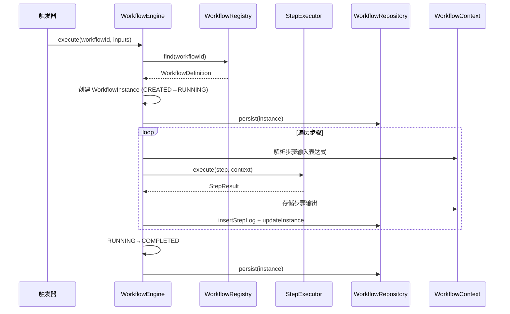
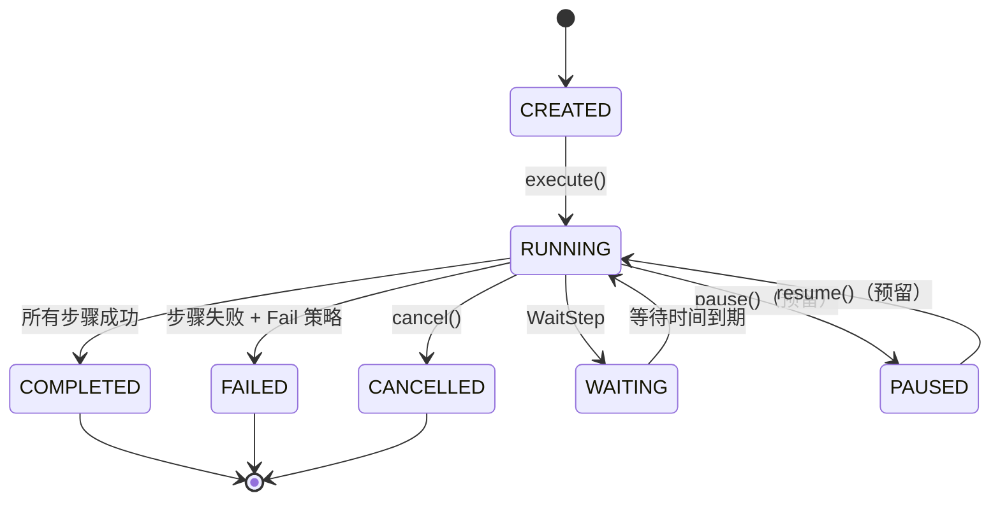

# 工作流/自动化编排引擎架构设计

> **文档性质**：深度架构设计文档（Developer-Facing）
> **目标读者**：核心开发者、架构评审者
> **模块归属**：`com.lifepilot.workflow`
> **最后更新**：2026-02
> **从属关系**：本文档从 [ARCHITECTURE.md](../ARCHITECTURE.md) 拆分而来，聚焦工作流/自动化编排引擎的完整设计。

---

## 目录

- [1. 设计哲学与原则](#1-设计哲学与原则)
- [2. 前沿研究与竞品分析](#2-前沿研究与竞品分析)
- [3. 整体架构](#3-整体架构)
- [4. WorkflowEngine — 执行引擎](#4-workflowengine--执行引擎)
- [5. StepExecutor — 步骤分发器](#5-stepexecutor--步骤分发器)
- [6. ExpressionEngine — 表达式引擎](#6-expressionengine--表达式引擎)
- [7. WorkflowRegistry — 注册中心](#7-workflowregistry--注册中心)
- [8. WorkflowRepository — 持久化层](#8-workflowrepository--持久化层)
- [9. 状态机设计](#9-状态机设计)
- [10. 错误处理与 Saga 补偿](#10-错误处理与-saga-补偿)
- [11. 崩溃恢复](#11-崩溃恢复)
- [12. 热加载机制](#12-热加载机制)
- [13. 配置参考](#13-配置参考)

---

## 1. 设计哲学与原则

### 1.1 核心命题：声明式自动化编排

传统自动化工具要求用户编写代码（Temporal、LittleHorse）或学习复杂的 BPMN XML（Flowable）。ZhiWei 的目标用户是个人效率管理者而非开发者，核心命题是：**让非程序员也能通过 YAML 声明式定义创建复杂的多步骤自动化流程**。

```
传统自动化（Code-as-Workflow）：
  开发者编写 Java/Go/Python → 编译部署 → 执行
  问题：门槛高，个人用户无法使用

ZhiWei 自动化（YAML 声明式）：
  用户编写 YAML → 引擎解析 → 状态机驱动执行
  优势：零代码，热加载，即写即用
```

但声明式也有固有局限：表达能力不如通用编程语言。ZhiWei 的设计策略是**覆盖 80% 的常见场景**（顺序、条件、循环、并行、子工作流），对于超出 YAML 表达能力的复杂逻辑，通过 LlmStep 和 SkillStep 委托给 AI 或自定义 Skill 处理。

### 1.2 五条核心设计原则

#### 原则 1：YAML 即工作流，零代码创建

工作流定义是纯数据（record），通过 SnakeYAML 解析。用户只需编写 YAML 文件放入指定目录，引擎自动检测并注册。不需要编译、部署或重启。

#### 原则 2：sealed interface 穷举，编译期安全

WorkflowStep（9 种）、WorkflowTrigger（3 种）、ErrorStrategy（4 种）均使用 sealed interface + switch 表达式。新增步骤类型时，编译器强制处理所有分支，杜绝遗漏。

#### 原则 3：不可变状态机，每次转换生成新实例

WorkflowInstance 使用 record + toBuilder 模式。状态转换不修改原对象，而是生成新实例。这确保了并发安全和可追溯性——每个状态快照都可以持久化和回溯。

#### 原则 4：快照持久化，简单可靠

借鉴 LangGraph 的 Checkpointing 思想，每次步骤执行后持久化当前快照（state + context_json + current_step_index）。相比 Temporal 的 Event Sourcing，快照模式在单机 SQLite 场景下实现更简单、恢复更快。

#### 原则 5：与现有模块深度集成

工作流引擎不重新发明轮子——SkillStep 通过 SkillActionDispatcher 执行，ToolStep 通过 DynamicToolRegistry 执行，LlmStep 通过 LlmRouter 执行。引擎只负责编排调度，具体执行委托给已有模块。

---

## 2. 前沿研究与竞品分析

### 2.1 调研的开源项目与前沿理论

| 项目/理论 | 核心理念 | 与 ZhiWei 的关系 |
|-----------|---------|-------------------|
| [Temporal](https://temporal.io) | Durable Execution — Event Sourcing 持久化，代码即工作流，自动重试和故障恢复 | 借鉴崩溃恢复思路，但不采用分布式 Event Sourcing |
| [Restate](https://restate.dev) | 轻量级 Durable Execution，Journal 持久化，单二进制部署，Java SDK | 最接近 ZhiWei 定位（轻量、嵌入式），借鉴 Journal 简化恢复设计 |
| [LittleHorse](https://littlehorse.io) | Java 原生工作流引擎，WfSpec/WfRun 分离，有向图执行模型 | 借鉴 Definition/Instance 分离模式 |
| [Flowable](https://flowable.com) | 成熟 BPMN 2.0 引擎，嵌入式 Java 库，Spring Boot 集成 | 借鉴嵌入式 Spring 集成模式，但 YAML 替代 BPMN XML |
| [n8n](https://n8n.io) | 节点式可视化工作流，事件驱动，422+ 集成，AI Agent 节点 | 借鉴 Trigger/Action 分类和 AI 步骤集成思路 |
| [LangGraph](https://langchain-ai.github.io/langgraph/) | 状态图驱动 AI Agent 编排，Checkpointing 持久化，Human-in-the-Loop | 借鉴 Checkpointing 机制，WorkflowContext 类似 State |
| [Saga Pattern](https://microservices.io/patterns/data/saga.html) | 分布式事务补偿模式 — 每步配对补偿操作，失败时反向执行 | 直接采纳为 ErrorStrategy.Compensate 策略 |
| DAG 工作流理论 | 有向无环图表示任务依赖，并行执行无依赖节点 | 当前顺序列表 + ParallelStep，未来可演进为 DAG |

Content was rephrased for compliance with licensing restrictions.

### 2.2 关键设计决策及理由

| 决策 | 选择 | 替代方案 | 理由 |
|------|------|---------|------|
| 工作流定义方式 | YAML 声明式 | Code-as-Workflow（Temporal/LittleHorse） | 目标用户非开发者，YAML 零代码门槛更低 |
| 执行模型 | 顺序列表 + ParallelStep | DAG 有向图（Airflow/Argo） | 个人自动化以线性流程为主，DAG 复杂度收益有限 |
| 表达式引擎 | 自研 `${...}` 语法 | SpEL / JUEL | SpEL 攻击面大，JUEL 需额外依赖，自研可精确控制安全边界 |
| 持久化策略 | 快照持久化 | Event Sourcing（Temporal） | 单机 SQLite 场景，快照更简单，WAL 模式写入性能足够 |
| 补偿策略 | Saga Compensate | 无补偿 / 全局回滚 | 工作流步骤可能调用外部 API，需要补偿机制 |
| 断点恢复 | Checkpointing（借鉴 LangGraph） | 重新执行 | 长时间工作流不应因崩溃而从头开始 |

### 2.3 ZhiWei 差异化优势

相比调研的开源项目，ZhiWei 工作流引擎的独特定位：

1. **嵌入式单机** — 不需要独立的工作流服务器（vs Temporal/LittleHorse），SQLite 持久化，单 JAR 运行
2. **AI 原生集成** — LlmStep 直接调用 LLM，SkillStep 调用 AI Skill，工作流天然具备 AI 能力（vs 传统工作流引擎需要额外集成）
3. **声明式 + 安全** — YAML 定义 + 自研表达式引擎，不暴露 Java 反射或任意代码执行（vs SpEL/JUEL 的安全风险）
4. **热加载** — 文件系统监控 + 自动注册，即写即用（vs Flowable 需要部署流程定义）

### 2.4 未来演进方向

1. **DAG 执行模型** — 为步骤添加 `dependsOn` 字段，引擎自动拓扑排序并并行执行
2. **Event Sourcing** — 如需更强审计和回放能力，可升级为事件日志
3. **Human-in-the-Loop** — 添加 ApprovalStep，工作流暂停等待用户确认
4. **可视化编辑器** — Web UI 阶段提供拖拽式工作流编辑器
5. **Durable Execution** — 如需跨进程持久执行保证，可引入 Journal 模式

---

## 3. 整体架构

### 3.1 分层架构图

```
┌─────────────────────────────────────────────────────────────────┐
│                    工作流引擎架构                                  │
│                                                                 │
│  ┌───────────────────────────────────────────────────────────┐  │
│  │           WorkflowAutoConfiguration                       │  │
│  │     （Spring Bean 注册 + 依赖注入 + 生命周期管理）           │  │
│  ├───────────────────────────────────────────────────────────┤  │
│  │                                                           │  │
│  │  ┌─────────────────┐  ┌─────────────────────────────┐    │  │
│  │  │ WorkflowEngine  │  │ WorkflowRegistry            │    │  │
│  │  │ 状态机驱动       │  │ 定义管理 + 热加载            │    │  │
│  │  │ 崩溃恢复         │  │ ConcurrentHashMap 缓存      │    │  │
│  │  └────────┬────────┘  └──────────┬──────────────────┘    │  │
│  │           │                      │                        │  │
│  │  ┌────────┴────────┐  ┌─────────┴──────────────────┐    │  │
│  │  │ StepExecutor    │  │ ExpressionEngine            │    │  │
│  │  │ 9 种步骤分发     │  │ ${...} 变量插值             │    │  │
│  │  │ sealed switch   │  │ 条件求值                     │    │  │
│  │  └────────┬────────┘  └────────────────────────────┘    │  │
│  │           │                                               │  │
│  │  ┌────────┴────────────────────────────────────────┐     │  │
│  │  │ WorkflowRepository    WorkflowYamlParser        │     │  │
│  │  │ SQLite 持久化          WorkflowYamlPrinter       │     │  │
│  │  │ Flyway V15 迁移        YAML ↔ Record 转换        │     │  │
│  │  └─────────────────────────────────────────────────┘     │  │
│  │                                                           │  │
│  ├───────────────────────────────────────────────────────────┤  │
│  │              外部依赖（已完成模块）                          │  │
│  │  SkillRegistry / SkillActionDispatcher                    │  │
│  │  DynamicToolRegistry / ToolContract                       │  │
│  │  LlmRouter / JdbcTemplate                                │  │
│  └───────────────────────────────────────────────────────────┘  │
└─────────────────────────────────────────────────────────────────┘
```

### 3.2 包结构

```
com.lifepilot.workflow
├── config/
│   ├── WorkflowConfigProperties.java    // @ConfigurationProperties("lifepilot.workflow")
│   └── WorkflowAutoConfiguration.java   // Spring AutoConfiguration
├── model/
│   ├── WorkflowDefinition.java          // 工作流定义 record
│   ├── WorkflowInstance.java            // 工作流实例 record
│   ├── WorkflowStep.java               // sealed interface（9 种步骤）
│   ├── WorkflowTrigger.java            // sealed interface（3 种触发器）
│   ├── WorkflowState.java              // 实例状态枚举
│   ├── StepState.java                  // 步骤状态枚举
│   ├── ErrorStrategy.java              // sealed interface（4 种策略）
│   ├── WorkflowContext.java            // 变量上下文
│   └── StepLog.java                    // 步骤执行日志 record
├── engine/
│   ├── WorkflowEngine.java             // 执行引擎
│   └── StepExecutor.java               // 步骤分发器
├── expression/
│   ├── ExpressionEngine.java           // 表达式引擎
│   ├── ExpressionToken.java            // 词法 token
│   └── ExpressionParser.java           // 条件表达式解析
├── registry/
│   └── WorkflowRegistry.java           // 注册中心
├── parser/
│   ├── WorkflowYamlParser.java         // YAML → WorkflowDefinition
│   └── WorkflowYamlPrinter.java        // WorkflowDefinition → YAML
└── repository/
    └── WorkflowRepository.java          // SQLite 持久化
```

### 3.3 执行流程



---

## 4. WorkflowEngine — 执行引擎

### 4.1 职责

WorkflowEngine 是工作流引擎的核心入口，负责：
- 创建 WorkflowInstance 并驱动状态机
- 按顺序遍历步骤，委托 StepExecutor 执行
- 处理步骤错误（按 ErrorStrategy 分发）
- 持久化每次状态变更（Checkpointing）
- 崩溃恢复（启动时扫描中断实例）

### 4.2 核心 API

```java
public class WorkflowEngine {
    /** 执行工作流（手动触发或触发器调用）。 */
    WorkflowInstance execute(String workflowId, Map<String, Object> inputs);

    /** 恢复中断的工作流实例。 */
    WorkflowInstance resume(String instanceId);

    /** 取消正在执行的工作流实例。 */
    WorkflowInstance cancel(String instanceId);

    /** 崩溃恢复：扫描 RUNNING/WAITING 实例并恢复。 */
    void recoverInterruptedInstances();
}
```

### 4.3 执行循环伪代码

```
execute(workflowId, inputs):
  1. registry.find(workflowId) → 检查存在且 enabled
  2. 创建 WorkflowInstance(state=CREATED, context=inputs)
  3. 状态转换 CREATED → RUNNING
  4. repository.saveInstance(instance)
  5. for step in definition.steps():
       a. expressionEngine.resolveMap(step.params, context) → 解析表达式
       b. stepExecutor.execute(step, context, expressionEngine) → 执行步骤
       c. context.set("steps.{stepId}.output", result) → 存储输出
       d. repository.insertStepLog(log) → 记录日志
       e. repository.updateInstance(instance) → Checkpointing
  6. 状态转换 RUNNING → COMPLETED
  7. repository.updateInstance(instance)
```

### 4.4 Virtual Thread 执行

WorkflowEngine 的 execute() 方法在 Virtual Thread 上执行，不阻塞平台线程。这对于 WaitStep（可能等待数分钟）和 LlmStep（LLM 调用可能耗时数秒）尤为重要。

---

## 5. StepExecutor — 步骤分发器

### 5.1 职责

StepExecutor 使用 switch 表达式穷举匹配 WorkflowStep 的 9 种子类型，将每种步骤分发到对应的执行逻辑。

### 5.2 分发矩阵

| 步骤类型 | 执行方式 | 依赖模块 |
|---------|---------|---------|
| SkillStep | SkillRegistry.find() → SkillActionDispatcher.dispatch() | Skill 系统 |
| ToolStep | DynamicToolRegistry.resolve() → ToolContract.execute() | 工具系统 |
| LlmStep | LlmRouter.call(scene, prompt, outputSchema) | LLM Router |
| ConditionStep | ExpressionEngine.evaluateCondition() → 执行 then/else 分支 | 表达式引擎 |
| LoopStep | 遍历集合，每次迭代绑定 loopVar 到 context | 表达式引擎 |
| ParallelStep | Virtual Thread 并发执行所有分支，等待全部完成 | — |
| SubWorkflowStep | WorkflowRegistry.find() → 递归执行嵌套工作流 | 注册中心 |
| NoopStep | 直接返回空结果 | — |
| WaitStep | Thread.sleep() on Virtual Thread，实例状态转 WAITING | — |

### 5.3 ParallelStep 并发执行

```java
// 伪代码：Virtual Thread 并发执行分支
case ParallelStep(var id, var name, var branches, var strategy) -> {
    var futures = branches.stream()
        .map(branch -> CompletableFuture.supplyAsync(
            () -> executeBranch(branch, context), virtualThreadExecutor))
        .toList();
    CompletableFuture.allOf(futures.toArray(CompletableFuture[]::new)).join();
    // 合并各分支输出到 context
}
```

最大并行分支数通过 `lifepilot.workflow.max-parallel-branches`（默认 10）配置，超出时拒绝执行。

### 5.4 SubWorkflowStep 嵌套深度控制

子工作流递归执行时，通过 `lifepilot.workflow.max-nesting-depth`（默认 3）限制嵌套深度，防止无限递归。

---

## 6. ExpressionEngine — 表达式引擎

### 6.1 设计决策

自研轻量级表达式引擎，不引入 SpEL 或 JUEL。原因：
- **安全性** — SpEL 可调用任意 Java 方法，攻击面大；自研引擎只支持变量读取和比较运算
- **零依赖** — 不引入额外 JAR
- **友好错误信息** — 可以精确报告错误位置和期望语法

### 6.2 支持的语法

```
变量插值：
  ${inputs.name}                    → 输入参数
  ${steps.step1.output.result}      → 步骤输出（嵌套路径）
  ${loopVar}                        → 循环变量
  ${loopVar_index}                  → 循环索引

比较运算（条件表达式）：
  ${steps.check.output.count} > 0
  ${inputs.mode} == 'auto'
  ${steps.a.output.score} >= 80

逻辑运算：
  ${steps.a.output.ok} == true && ${steps.b.output.ok} == true
  ${steps.check.output.count} > 0 || ${inputs.force} == true
  !${steps.validate.output.hasError}
```

### 6.3 解析流程

```
输入字符串 → 词法分析（ExpressionToken） → 语法解析（ExpressionParser） → 求值
```

词法 Token 类型：VARIABLE（`${...}`）、STRING_LITERAL（`'...'`）、NUMBER、BOOLEAN、OPERATOR（==, !=, >, <, >=, <=, &&, ||, !）。

---

## 7. WorkflowRegistry — 注册中心

### 7.1 职责

管理 WorkflowDefinition 的生命周期：注册、查询、启用/禁用、热加载。

### 7.2 存储策略

```
内存缓存（ConcurrentHashMap<String, WorkflowDefinition>）
  │
  ├── 读取：优先内存，启动时从 SQLite 加载
  ├── 写入：先写内存，同步写 SQLite
  └── 热加载：文件变更 → 解析 → 更新内存 + SQLite
```

### 7.3 核心 API

```java
boolean register(WorkflowDefinition definition);   // 注册（含验证）
boolean unregister(String workflowId);              // 注销
boolean enable(String workflowId);                  // 启用
boolean disable(String workflowId);                 // 禁用
Optional<WorkflowDefinition> find(String id);       // 查找
List<WorkflowDefinition> listAll();                 // 列出全部
List<WorkflowDefinition> listEnabled();             // 列出已启用
void scanAndRegister(Path directory);               // 扫描目录注册
```

### 7.4 验证规则

注册时执行以下验证：
- 必填字段检查（id、name、steps 不为空）
- 步骤类型合法性（必须是 9 种 sealed 子类型之一）
- 步骤 ID 唯一性（同一工作流内不重复）
- 表达式语法预检（`${...}` 格式正确）

验证失败返回 false，不注册，WARN 日志记录原因。

---

## 8. WorkflowRepository — 持久化层

### 8.1 数据库 Schema（Flyway V15）

三张表：

| 表名 | 用途 | 主键 |
|------|------|------|
| workflow_definitions | 工作流定义存储 | id (TEXT) |
| workflow_instances | 工作流实例状态 | id (TEXT) |
| workflow_step_logs | 步骤执行日志 | id (TEXT) |

关键设计：
- `workflow_definitions.definition_yaml` 存储原始 YAML 文本，启动时通过 WorkflowYamlParser 解析为 record
- `workflow_instances.context_json` 存储 WorkflowContext 的 JSON 序列化，用于崩溃恢复
- `workflow_instances.current_step_index` 记录当前执行位置，崩溃恢复时从此位置继续
- 外键约束：instances → definitions，step_logs → instances

### 8.2 索引

```sql
CREATE INDEX idx_workflow_instances_workflow_id ON workflow_instances(workflow_id);
CREATE INDEX idx_workflow_instances_state ON workflow_instances(state);
CREATE INDEX idx_workflow_step_logs_instance_id ON workflow_step_logs(instance_id);
```

`idx_workflow_instances_state` 用于崩溃恢复时快速查询 RUNNING/WAITING 状态的实例。

---

## 9. 状态机设计

### 9.1 WorkflowState 状态转换图



### 9.2 StepState 状态

| 状态 | 含义 |
|------|------|
| PENDING | 等待执行 |
| RUNNING | 正在执行 |
| COMPLETED | 执行成功 |
| FAILED | 执行失败 |
| SKIPPED | 被 Skip 策略跳过 |

### 9.3 状态转换规则

- 无效转换（如 COMPLETED → RUNNING）被拒绝，WARN 日志，返回当前状态不变
- 每次状态转换后立即持久化到 SQLite（Checkpointing）
- WorkflowInstance 使用 record + toBuilder，状态转换生成新实例，不修改原对象

---

## 10. 错误处理与 Saga 补偿

### 10.1 ErrorStrategy 四种策略

| 策略 | 行为 | 适用场景 |
|------|------|---------|
| Retry | 指数退避重试，耗尽后回退到 Fail | 网络抖动、临时不可用 |
| Skip | 标记 SKIPPED，继续下一步 | 非关键步骤（如通知发送） |
| Fail | 标记 FAILED，工作流终止 | 关键步骤失败（默认策略） |
| Compensate | 执行补偿步骤，然后标记 FAILED | 需要回滚的外部操作 |

### 10.2 Retry 指数退避

```
第 1 次重试：等待 initialDelayMs（默认 500ms）
第 2 次重试：等待 min(initialDelayMs × 2, maxDelayMs)
第 3 次重试：等待 min(initialDelayMs × 4, maxDelayMs)
...
第 N 次重试：等待 min(initialDelayMs × 2^(N-1), maxDelayMs)
超过 maxAttempts → 回退到 Fail
```

### 10.3 Compensate 补偿模式（借鉴 Saga）

```
正常流程：Step A → Step B → Step C
Step C 失败 + Compensate 策略：
  1. 执行 Step C 的补偿步骤（如撤销 API 调用）
  2. Step C 标记为 FAILED
  3. 工作流标记为 FAILED
```

当前实现是单步补偿（每个步骤独立配置补偿步骤），不实现全链路反向补偿。未来如需全链路 Saga，可扩展为补偿链。

---

## 11. 崩溃恢复

### 11.1 恢复时机

应用启动时，通过 `ApplicationReadyEvent` 监听器触发，在 Virtual Thread 上执行，不阻塞主启动序列。

### 11.2 恢复流程

```
1. 查询 workflow_instances 表，state IN ('RUNNING', 'WAITING')
2. 对每个中断实例：
   a. 解析 context_json → WorkflowContext
   b. 如果解析失败 → 标记 FAILED，记录 "崩溃恢复失败：上下文数据损坏"
   c. 如果 state=RUNNING → 从 current_step_index 继续执行
   d. 如果 state=WAITING → 检查等待时间是否已过期
      - 已过期 → 转为 RUNNING，从下一步继续
      - 未过期 → 重新调度等待
```

### 11.3 设计决策：快照恢复 vs Event Sourcing

| 维度 | 快照恢复（ZhiWei） | Event Sourcing（Temporal） |
|------|---------------------|--------------------------|
| 实现复杂度 | 低（读取最新快照） | 高（重放事件日志） |
| 存储开销 | 低（只保留最新状态） | 高（追加所有事件） |
| 恢复精度 | 步骤级（从上次完成的步骤继续） | 操作级（精确重放每个操作） |
| 适用场景 | 单机嵌入式 | 分布式集群 |

ZhiWei 选择快照恢复，因为单机 SQLite 场景下步骤级精度已足够，且实现和存储成本更低。

---

## 12. 热加载机制

### 12.1 文件监控

WorkflowRegistry 定期扫描配置目录（默认 `~/.zhiwei/workflows`），检测 YAML 文件变更：

```
每 30 秒（可配置）：
  1. 扫描目录下所有 .yml / .yaml 文件
  2. 对比文件修改时间与上次扫描记录
  3. 新文件 → 解析 + 注册
  4. 修改文件 → 解析 + 更新注册
  5. 删除文件 → 禁用对应工作流（不删除，保留实例历史）
  6. 解析失败 → WARN 日志，跳过该文件
```

### 12.2 设计决策：轮询 vs WatchService

Java NIO WatchService 在不同操作系统上行为不一致（macOS 使用轮询实现，性能差；Linux inotify 有事件丢失风险）。ZhiWei 选择简单的定时轮询，30 秒间隔对个人自动化场景完全足够。

---

## 13. 配置参考

```yaml
lifepilot:
  workflow:
    # 是否启用工作流引擎
    enabled: true
    # 工作流定义目录
    definitions-dir: "~/.zhiwei/workflows"
    # 默认步骤超时（秒）
    default-step-timeout-seconds: 300
    # 最大并行分支数
    max-parallel-branches: 10
    # 最大工作流嵌套深度
    max-nesting-depth: 3
    # 最大循环迭代次数
    max-loop-iterations: 100
    # 是否启用崩溃恢复
    crash-recovery-enabled: true
    # 热加载扫描间隔（秒）
    scan-interval-seconds: 30
    # 重试配置
    retry:
      initial-delay-ms: 500
      max-delay-ms: 5000
      max-attempts: 3
```