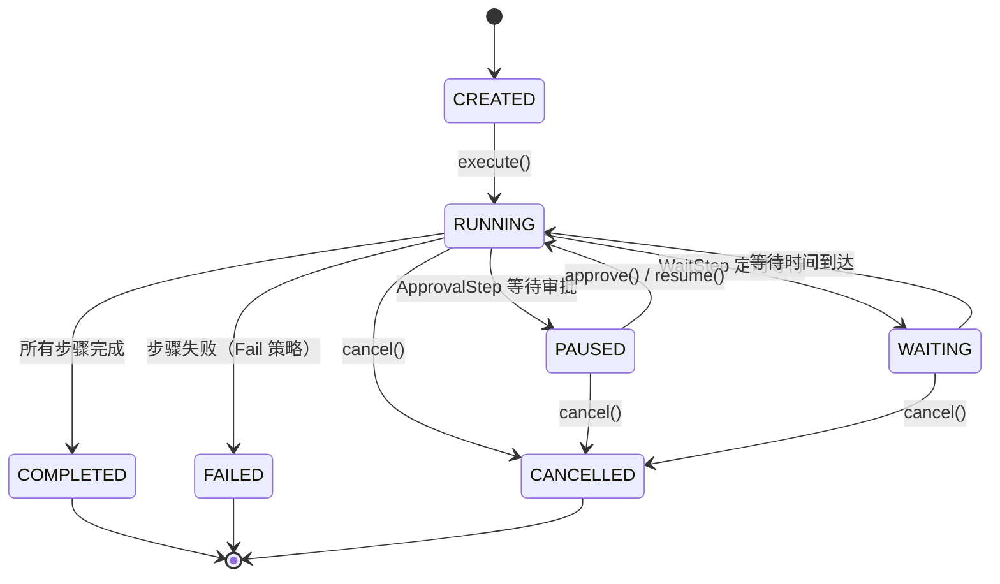

# 工作流编排引擎 — 架构设计

> **文档性质**：架构设计文档
> **模块归属**：`com.lifepilot.workflow`
> **最后更新**：2026-03

## 1. 模块概述

工作流模块为知微提供 YAML 声明式自动化编排能力。用户通过 YAML 文件定义工作流蓝图（步骤、触发器、输入参数），引擎负责解析、注册、DAG 调度、执行、状态持久化和崩溃恢复。支持十种步骤类型（Skill / Tool / LLM / 条件分支 / 循环 / 并行 / 子工作流 / 空操作 / 等待 / 人工审批），三种触发方式（Cron 定时 / Spring 事件 / 手动），四种错误处理策略（重试 / 跳过 / 失败 / 补偿）。

## 2. 架构图

```mermaid
flowchart TD
    subgraph "工作流引擎"
        YP["WorkflowYamlParser<br/>YAML 解析"]
        REG["WorkflowRegistry<br/>注册中心 + 热加载"]
        ENG["WorkflowEngine<br/>执行引擎"]
        DAG["DagScheduler<br/>Kahn 拓扑排序"]
        SE["StepExecutor<br/>步骤执行器"]
        EXP["ExpressionEngine<br/>表达式引擎"]
        TM["WorkflowTriggerManager<br/>触发器管理"]
        ER["WorkflowEventRecorder<br/>审计事件记录"]
    end

    subgraph "持久化"
        REPO["WorkflowRepository<br/>SQLite 持久化"]
    end

    subgraph "外部依赖"
        SKILL["SkillActivator"]
        TOOL["DynamicToolRegistry"]
        LLM["LlmRouter"]
        SCHED["TaskScheduler"]
    end

    YP --> REG
    REG --> REPO
    REG --> TM
    TM --> ENG
    TM --> SCHED
    ENG --> DAG
    ENG --> SE
    ENG --> ER
    SE --> EXP
    SE --> SKILL
    SE --> TOOL
    SE --> LLM
    ENG --> REPO


## 3. 核心组件

### 3.1 WorkflowDefinition

- 职责：工作流定义的不可变数据载体，从 YAML 解析而来
- 核心字段：`id`、`name`、`version`、`enabled`、`triggers`（触发器列表）、`inputs`（输入参数定义）、`steps`（步骤列表）、`metadata`
- 紧凑构造器对 id/name/steps 执行非空校验，集合字段执行 `List.copyOf()` / `Map.copyOf()` 防御性拷贝

### 3.2 WorkflowStep（sealed interface）

- 职责：定义十种步骤类型的类型层次
- 公共接口：`id()`、`name()`、`errorStrategy()`、`dependsOn()`（DAG 依赖声明）
- 步骤类型：`SkillStep`（调用 Skill）、`ToolStep`（调用 Tool）、`LlmStep`（调用 LLM）、`ConditionStep`（条件分支）、`LoopStep`（循环遍历）、`ParallelStep`（Virtual Thread 并行）、`SubWorkflowStep`（子工作流）、`NoopStep`（空操作）、`WaitStep`（定时等待）、`ApprovalStep`（人工审批）

### 3.3 WorkflowEngine

- 职责：工作流执行引擎，管理实例生命周期和状态转换
- 核心方法：`execute(workflowId, inputs)` 创建并执行实例、`resume(instanceId)` 恢复暂停实例、`approve(instanceId, stepId, decision)` 提交审批决策、`cancel(instanceId)` 取消实例、`recoverInterruptedInstances()` 崩溃恢复
- 状态机转换由 `isValidTransition()` 强制校验

### 3.4 DagScheduler

- 职责：基于 Kahn 算法的 DAG 拓扑排序与并行调度
- 无状态组件，所有状态通过参数传入
- 退化模式：当所有步骤均无 `dependsOn` 声明时，按列表原始顺序串行执行
- 环检测：拓扑排序后检查处理节点数，不等于总数则抛出异常

### 3.5 WorkflowRegistry

- 职责：工作流定义注册中心，支持 YAML 文件热加载
- 定时扫描 `~/.zhiwei/workflows` 目录，检测新增/修改/删除的 YAML 文件
- 启动时从数据库加载已注册定义，与文件系统同步
- 注册时执行校验（步骤 ID 唯一性、触发器合法性等）

### 3.6 WorkflowTriggerManager

- 职责：统一管理 Cron 定时调度和 Spring 事件监听
- 实现 `GenericApplicationListener`，监听所有 Spring ApplicationEvent 并按 eventType 名称过滤
- Cron 触发时检查同一工作流是否有 RUNNING 实例，有则跳过
- ManualTrigger 无需注册，仅通过 `WorkflowEngine.execute()` 调用

### 3.7 ExpressionEngine

- 职责：工作流表达式解析和求值
- 模板解析：`${variable.path}` 变量替换
- 条件求值：支持比较运算符（`==`/`!=`/`>`/`<`/`>=`/`<=`）、逻辑运算符（`&&`/`||`/`!`）
- 内置递归下降解析器（ConditionParser），不依赖外部表达式库

### 3.8 WorkflowEventRecorder

- 职责：审计事件记录，追踪工作流执行全过程
- 事件类型：实例创建/状态变更、步骤开始/完成/失败/跳过、审批请求/决策
- 事件记录失败仅打 WARN 日志，不中断工作流执行
- 支持过期事件自动清理（按保留天数）

## 4. 核心流程

```mermaid
sequenceDiagram
    participant C as 调用方
    participant ENG as WorkflowEngine
    participant DAG as DagScheduler
    participant SE as StepExecutor
    participant EXP as ExpressionEngine
    participant REPO as WorkflowRepository
    participant ER as EventRecorder

    C->>ENG: execute(workflowId, inputs)
    ENG->>REPO: findDefinition(workflowId)
    ENG->>REPO: saveInstance(CREATED)
    ENG->>ER: record(INSTANCE_CREATED)
    ENG->>ENG: transition(CREATED → RUNNING)
    ENG->>DAG: buildExecutionPlan(steps)
    DAG-->>ENG: ExecutionPlan（拓扑排序）

    loop DAG 调度循环
        ENG->>DAG: getReadySteps(completedIds)
        DAG-->>ENG: 就绪步骤列表
        ENG->>ER: record(STEP_STARTED)
        ENG->>SE: executeStep(step, context)
        SE->>EXP: resolve(params, context)
        SE-->>ENG: Result
        ENG->>REPO: updateInstance(completedIds)
        ENG->>ER: record(STEP_COMPLETED)
    end

    ENG->>ENG: transition(RUNNING → COMPLETED)
    ENG->>REPO: updateInstance(COMPLETED)
    ENG-->>C: WorkflowInstance
```

### 状态机



## 5. 设计决策

| 决策 | 选择 | 理由 |
|------|------|------|
| 工作流定义格式 | YAML 声明式 | 用户友好、可读性强、易于版本控制 |
| 步骤类型层次 | sealed interface + 10 个 record | 编译期穷举匹配，新增步骤类型时编译器强制处理 |
| DAG 调度算法 | Kahn 拓扑排序 | 同时完成排序和环检测，时间复杂度 O(V+E) |
| 触发器类型 | sealed interface（Cron/Event/Manual） | 三种触发方式覆盖定时、事件驱动和手动场景 |
| 错误处理 | sealed interface（Retry/Skip/Fail/Compensate） | 每步独立策略，Compensate 借鉴 Saga Pattern |
| 表达式引擎 | 自研递归下降解析器 | 轻量无依赖，满足变量替换和条件判断需求 |
| 状态持久化 | SQLite + WorkflowRepository | 崩溃恢复依赖持久化状态，启动时自动恢复中断实例 |
| 并行执行 | Virtual Thread | Java 22 特性，轻量级并发，适合 I/O 密集型步骤 |

## 6. 集成点

| 依赖方向 | 模块 | 交互方式 |
|---------|------|---------|
| workflow → skill | `com.lifepilot.skill` | SkillStep 通过 SkillActivator 激活 Skill |
| workflow → tool | `com.lifepilot.tool` | ToolStep 通过 DynamicToolRegistry 查找并执行工具 |
| workflow → llm | `com.lifepilot.llm` | LlmStep 通过 LlmRouter 调用 LLM 生成内容 |
| workflow → Spring | TaskScheduler | CronTrigger 通过 Spring TaskScheduler 注册定时任务 |
| workflow → Spring | ApplicationEvent | EventTrigger 通过 GenericApplicationListener 监听事件 |
| agent → workflow | `com.lifepilot.agent` | 主动推理引擎可触发工作流执行 |

## 7. 配置参考

| 配置键 | 默认值 | 说明 |
|--------|--------|------|
| `lifepilot.workflow.enabled` | `true` | 工作流引擎总开关 |
| `lifepilot.workflow.definitions-dir` | `~/.zhiwei/workflows` | YAML 定义文件目录 |
| `lifepilot.workflow.default-step-timeout-seconds` | `300` | 步骤默认超时时间（秒） |
| `lifepilot.workflow.max-parallel-branches` | `10` | 最大并行分支数 |
| `lifepilot.workflow.max-nesting-depth` | `3` | 最大子工作流嵌套深度 |
| `lifepilot.workflow.max-loop-iterations` | `100` | 最大循环迭代次数 |
| `lifepilot.workflow.crash-recovery-enabled` | `true` | 崩溃恢复开关 |
| `lifepilot.workflow.scan-interval-seconds` | `30` | YAML 文件扫描间隔（秒） |
| `lifepilot.workflow.seed-builtin-workflows` | `true` | 启动时释放内置工作流模板 |
| `lifepilot.workflow.retry.initial-delay-ms` | `500` | 重试初始延迟（毫秒） |
| `lifepilot.workflow.retry.max-delay-ms` | `5000` | 重试最大延迟（毫秒） |
| `lifepilot.workflow.retry.max-attempts` | `3` | 最大重试次数 |
| `lifepilot.workflow.approval.default-timeout-seconds` | `86400` | 审批默认超时（秒） |
| `lifepilot.workflow.approval.auto-approve-on-timeout` | `false` | 超时后是否自动批准 |
| `lifepilot.workflow.event-audit.enabled` | `true` | 审计事件记录开关 |
| `lifepilot.workflow.event-audit.retention-days` | `90` | 事件保留天数 |
