# 智能 Agent 引擎 — 特性详细设计

> **文档性质**：特性详细设计文档（Feature Specification）
> **目标读者**：产品经理、开发者、架构评审者
> **模块归属**：`com.lifepilot.agent`
> **最后更新**：2026-02
> **从属关系**：本文档从 [FEATURES.md](../FEATURES.md) §2.1 拆分而来，聚焦 Agent 引擎的完整特性设计。
> **对应架构文档**：[architecture/agent-engine.md](../architecture/agent-engine.md)

> ⚠️ 本文档描述的是目标功能设计，尚未实现。

---

## 目录

1. [设计哲学与核心理念](#1-设计哲学与核心理念)
2. [AgentLoop — 状态化控制循环](#2-agentloop--状态化控制循环)
3. [StateReducer — 纯函数状态转换](#3-statereducer--纯函数状态转换)
4. [ContextAssembler — 上下文工程](#4-contextassembler--上下文工程)
5. [GuardrailEngine — 安全护栏](#5-guardrailengine--安全护栏)
6. [ToolContract — 工具调用契约](#6-toolcontract--工具调用契约)
7. [TraceRecorder — 决策追溯](#7-tracerecorder--决策追溯)
8. [Budget — 资源预算管理](#8-budget--资源预算管理)
9. [多轮对话与会话管理](#9-多轮对话与会话管理)
10. [并发模型与 Virtual Thread](#10-并发模型与-virtual-thread)
11. [错误处理与降级策略](#11-错误处理与降级策略)
12. [可观测性集成](#12-可观测性集成)
13. [扩展点与 SPI](#13-扩展点与-spi)
14. [数据模型与持久化](#14-数据模型与持久化)
15. [测试策略](#15-测试策略)

---

## 1. 设计哲学与核心理念

### 1.1 为什么 ZhiWei 不是"又一个聊天机器人"

绝大多数 AI 助手本质上是**提示词包装器**（prompt wrapper）——用户输入文本，系统拼接提示词，LLM 返回文本，循环往复。这种架构在简单问答场景下足够，但在需要**多步推理、工具编排、状态持久化、安全约束**的真实生活管理场景中迅速崩塌。

ZhiWei 的 Agent 引擎采用截然不同的架构范式：**LLM 是规划器（Planner），不是执行器（Executor）**。整个系统被设计为一个分布式控制系统，其中 LLM 仅负责在概率域内做出决策，而所有状态管理、工具调用、安全检查、上下文组装均在确定性代码域内执行。

这一设计理念与 2025-2026 年业界的架构演进方向一致：

- **Redis 2026 Agent Architecture 模式**：将 Agent 视为状态机而非对话流，强调持久化状态与可恢复性
- **Anthropic Context Engineering**：上下文不是"塞进去就好"，而是需要精心工程化的稀缺资源
- **从 Prompt-Centric 到 Architecture-Centric**：2025 年后，业界共识从"写好提示词"转向"设计好架构"

```
┌─────────────────────────────────────────────────────────┐
│                    ZhiWei Agent 引擎                    │
│                                                           │
│  ┌─────────────────────┐   ┌───────────────────────────┐ │
│  │   概率域 (LLM)       │   │   确定性域 (Code)          │ │
│  │                     │   │                           │ │
│  │  · 意图理解          │   │  · 状态管理 (AgentState)   │ │
│  │  · 计划生成          │   │  · 工具调用 (ToolContract) │ │
│  │  · 反思与修正        │◄─►│  · 安全护栏 (Guardrail)   │ │
│  │  · 自然语言生成      │   │  · 上下文组装 (Assembler)  │ │
│  │                     │   │  · 预算控制 (Budget)       │ │
│  │  输出: 结构化动作    │   │  · 追溯记录 (Trace)       │ │
│  └─────────────────────┘   └───────────────────────────┘ │
│                                                           │
│  关键原则: LLM 永远不直接操作状态或调用外部服务              │
│           所有副作用由确定性代码网关控制                      │
└─────────────────────────────────────────────────────────┘
```

### 1.2 核心设计命题

Agent 引擎的架构建立在以下五个不可妥协的设计命题之上：

**命题一：概率决策与确定性状态分离**

LLM 的输出本质上是概率性的——同样的输入可能产生不同的输出。因此，LLM 绝不直接修改系统状态。每次 LLM 调用的输出被解析为结构化的 `AgentAction`，由确定性的 `StateReducer` 执行状态转换。这确保了状态转换的可预测性和可测试性。

**命题二：工具调用是 API 契约，不是建议**

当 LLM 决定调用工具时，它发出的是一个符合 `ToolContract` 接口的结构化请求，而非自然语言描述。工具的输入输出有严格的 JSON Schema 约束，参数校验在调用前完成，结果格式在返回后验证。这消除了"LLM 幻觉导致无效工具调用"的问题。

**命题三：上下文是稀缺资源，不是无限容器**

LLM 的上下文窗口有限且昂贵。`ContextAssembler` 将上下文视为需要精心管理的稀缺资源：通过相关性评分、时间衰减、优先级排序来决定哪些信息进入上下文窗口，而非简单地将所有历史消息塞入。

**命题四：每个决策都可追溯、可回放**

`TraceRecorder` 记录 Agent 每一步的输入、输出、状态变化和决策依据。任何一次 Agent 执行都可以在事后完整回放，用于调试、审计和用户解释。这不是可选的日志功能，而是架构的核心组成部分。

**命题五：安全护栏在 LLM 之外强制执行**

安全策略（`GuardrailPolicy`）以代码定义，在 LLM 之外的确定性层强制执行。无论 LLM 输出什么，高风险操作必须经过护栏检查。护栏不依赖 LLM 的"自我约束"，而是通过硬编码的规则引擎实现。

### 1.3 用户视角：Agent 引擎带来什么

以下交互示例展示了 Agent 引擎在真实场景中的能力：

**示例一：多意图识别与编排**

```
用户: 帮我安排明天下午的会议，顺便提醒我买咖啡豆，
      还有上周的读书笔记整理一下

Agent 内部处理:
  Step 1 [UNDERSTANDING] → 识别 3 个独立意图
  Step 2 [PLANNING]      → 生成 3 个并行任务计划
  Step 3 [EXECUTING]     → 调用 calendar.create / reminder.set / knowledge.summarize
  Step 4 [REFLECTING]    → 检查日历冲突，发现明天下午已有安排
  Step 5 [RESPONDING]    → 汇总结果，主动提示冲突

Agent: 我处理了你的三个请求：
  ✅ 提醒已设置：明天 18:00 买咖啡豆
  ✅ 读书笔记已整理，生成了 3 个关键要点摘要
  ⚠️ 明天下午 14:00-16:00 已有"产品评审"，建议将新会议安排在 16:30
     需要我帮你确认这个时间吗？
```

**示例二：知识图谱驱动的主动建议**

```
用户: 记录一下，我决定开始学习 Rust

Agent 内部处理:
  Step 1 [UNDERSTANDING] → 识别为知识记录意图
  Step 2 [EXECUTING]     → 写入知识图谱
  Step 3 [REFLECTING]    → 查询关联知识，发现用户 3 周前记录了
                           "想做一个高性能 CLI 工具"
  Step 4 [RESPONDING]    → 关联建议

Agent: 已记录。顺便说一句，你 3 周前提到想做一个高性能 CLI 工具——
      Rust 非常适合这个场景。需要我帮你制定一个学习计划，
      以 CLI 工具项目为目标驱动学习吗？
```

**示例三：安全护栏保护**

```
用户: 把我所有的日记导出发送到 export@example.com

Agent 内部处理:
  Step 1 [UNDERSTANDING] → 识别为数据导出 + 外部发送
  Step 2 [PLANNING]      → 生成导出计划
  Step 3 [GUARDRAIL]     → ⛔ 触发 HIGH 风险策略：
                           "批量个人数据外发需要用户二次确认"
  Step 4 [RESPONDING]    → 请求确认

Agent: 这个操作涉及导出你的全部日记数据（共 847 篇）并发送到外部邮箱。
      出于安全考虑，我需要你确认：
      1. 确认目标邮箱 export@example.com 是你本人的
      2. 确认你了解数据将离开本地存储
      请回复"确认导出"继续，或告诉我调整方案。
```

---

## 2. AgentLoop — 状态化控制循环

### 2.1 控制循环概述

AgentLoop 是 Agent 引擎的心脏。它实现了一个**状态化的 while 循环**，每次迭代执行一个完整的"感知-思考-行动"周期。与简单的请求-响应模式不同，AgentLoop 维护跨步骤的不可变状态，支持多步推理、工具调用链和自我修正。

循环的核心流程如下：

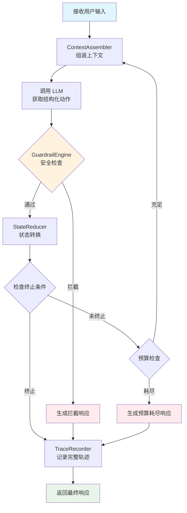

每次循环迭代的关键保证：

- **状态不可变**：每一步产生新的 `AgentState` 实例，旧状态不被修改
- **可追溯**：每一步的输入、输出、决策依据都被 `TraceRecorder` 记录
- **有界执行**：`Budget` 机制确保循环不会无限运行（最大步数、最大 Token、最大耗时）
- **安全前置**：每个 LLM 输出在执行前都经过 `GuardrailEngine` 检查

### 2.2 AgentState — 不可变状态快照

`AgentState` 是 Agent 引擎中最核心的数据结构。它是一个不可变的 `record`，完整描述了 Agent 在某一时刻的全部状态。每次状态转换都会生成一个新的 `AgentState` 实例，旧实例保持不变，从而实现天然的审计轨迹和回放能力。

```java
package com.lifepilot.agent;

import java.time.Instant;
import java.util.List;
import java.util.Map;
import java.util.Optional;
import java.util.UUID;

/**
 * Agent 不可变状态快照。
 *
 * <p>每次状态转换生成新实例，旧实例保持不变。
 * 这是 Agent 引擎中最核心的数据结构，承载了 Agent 在某一时刻的全部信息。</p>
 *
 * <p>设计要点：
 * <ul>
 *   <li>所有集合字段在构造时通过 {@code List.copyOf()} / {@code Map.copyOf()} 防御性拷贝</li>
 *   <li>通过 {@code toBuilder()} 模式实现部分字段更新</li>
 *   <li>线程安全：不可变对象天然线程安全</li>
 * </ul>
 * </p>
 *
 * @param sessionId  会话唯一标识，贯穿整个对话生命周期
 * @param phase      当前执行阶段，决定 Agent 的行为模式
 * @param stepCount  已执行步数，用于预算控制和追溯
 * @param messages   对话消息历史（用户消息 + Agent 消息 + 系统消息）
 * @param toolResults 本轮循环中已完成的工具调用结果
 * @param budget     资源预算快照，包含剩余步数、Token、耗时
 * @param metadata   扩展元数据，用于传递跨步骤的临时信息
 * @param createdAt  本状态快照的创建时间
 */
public record AgentState(
        UUID sessionId,
        AgentPhase phase,
        int stepCount,
        List<ChatMessage> messages,
        List<ToolResult> toolResults,
        Budget budget,
        Map<String, Object> metadata,
        Instant createdAt
) {
    /** 防御性拷贝构造，确保外部引用无法修改内部集合。 */
    public AgentState {
        messages = List.copyOf(messages);
        toolResults = List.copyOf(toolResults);
        metadata = Map.copyOf(metadata);
    }

    /** 创建初始状态。 */
    public static AgentState initial(UUID sessionId, Budget budget) {
        return new AgentState(
                sessionId,
                AgentPhase.UNDERSTANDING,
                0,
                List.of(),
                List.of(),
                budget,
                Map.of(),
                Instant.now()
        );
    }

    /** 生成下一步状态，步数自增，清空工具结果，更新时间戳。 */
    public AgentState nextStep(AgentPhase newPhase, List<ChatMessage> newMessages) {
        return new AgentState(
                this.sessionId,
                newPhase,
                this.stepCount + 1,
                newMessages,
                List.of(),
                this.budget.decrement(),
                this.metadata,
                Instant.now()
        );
    }

    /** 附加工具调用结果，返回新状态。 */
    public AgentState withToolResult(ToolResult result) {
        var updated = new java.util.ArrayList<>(this.toolResults);
        updated.add(result);
        return new AgentState(
                this.sessionId, this.phase, this.stepCount,
                this.messages, List.copyOf(updated),
                this.budget, this.metadata, this.createdAt
        );
    }

    /** 检查是否已终止。 */
    public boolean isTerminated() {
        return this.phase == AgentPhase.TERMINATED;
    }

    /** 检查预算是否耗尽。 */
    public boolean isBudgetExhausted() {
        return this.budget.isExhausted();
    }
}
```

### 2.3 AgentPhase — 执行阶段枚举

Agent 在每次循环中经历明确的阶段转换。`AgentPhase` 枚举定义了所有合法阶段，每个阶段对应不同的行为模式和 LLM 提示策略。

```java
package com.lifepilot.agent;

/**
 * Agent 执行阶段枚举。
 *
 * <p>定义了 Agent 控制循环中的所有合法阶段。阶段转换由 {@link StateReducer} 管理，
 * 遵循预定义的状态机规则。非法转换将抛出异常。</p>
 */
public enum AgentPhase {

    /**
     * 理解阶段：解析用户意图，识别实体和约束。
     * LLM 在此阶段使用意图识别专用提示模板。
     */
    UNDERSTANDING("理解用户意图"),

    /**
     * 规划阶段：将意图分解为可执行的步骤计划。
     * LLM 在此阶段生成结构化的任务分解。
     */
    PLANNING("生成执行计划"),

    /**
     * 执行阶段：按计划调用工具、查询知识库、操作数据。
     * 这是唯一允许产生外部副作用的阶段。
     */
    EXECUTING("执行工具调用"),

    /**
     * 反思阶段：评估执行结果，检测异常，决定是否需要修正。
     * LLM 在此阶段对比预期与实际结果。
     */
    REFLECTING("评估执行结果"),

    /**
     * 响应阶段：将结果组织为用户友好的自然语言回复。
     * 这是循环的正常出口。
     */
    RESPONDING("生成用户响应"),

    /**
     * 终止阶段：Agent 循环结束，不再接受新的步骤。
     * 进入此阶段后状态不可再变更。
     */
    TERMINATED("循环已终止");

    private final String description;

    AgentPhase(String description) {
        this.description = description;
    }

    /** 获取阶段的中文描述。 */
    public String description() {
        return description;
    }

    /** 判断当前阶段是否允许工具调用。 */
    public boolean allowsToolExecution() {
        return this == EXECUTING;
    }

    /** 判断当前阶段是否为终态。 */
    public boolean isTerminal() {
        return this == TERMINATED;
    }
}
```

### 2.4 AgentLoop 核心实现

`AgentLoop` 是控制循环的主类，协调所有核心组件完成一次完整的 Agent 执行。它使用 Spring AI 的 `ChatClient` 与 LLM 交互，通过 Virtual Thread 处理 I/O 密集型的工具调用，并在每一步执行安全检查和状态记录。

```java
package com.lifepilot.agent;

import org.slf4j.Logger;
import org.slf4j.LoggerFactory;
import org.springframework.ai.chat.client.ChatClient;
import org.springframework.stereotype.Component;

import java.util.UUID;
import java.util.concurrent.StructuredTaskScope;

/**
 * Agent 状态化控制循环。
 *
 * <p>核心职责：
 * <ul>
 *   <li>维护 {@link AgentState} 的不可变状态链</li>
 *   <li>协调 LLM 调用、工具执行、安全检查、状态转换</li>
 *   <li>确保每次循环迭代的可追溯性</li>
 *   <li>在预算耗尽或异常时安全终止</li>
 * </ul>
 * </p>
 *
 * <p>线程模型：主循环运行在调用线程上，工具调用通过 Virtual Thread 并发执行。</p>
 */
@Component
public class AgentLoop {

    private static final Logger log = LoggerFactory.getLogger(AgentLoop.class);

    private final ChatClient chatClient;
    private final StateReducer stateReducer;
    private final ContextAssembler contextAssembler;
    private final GuardrailEngine guardrailEngine;
    private final TraceRecorder traceRecorder;
    private final ToolExecutor toolExecutor;

    public AgentLoop(
            ChatClient.Builder chatClientBuilder,
            StateReducer stateReducer,
            ContextAssembler contextAssembler,
            GuardrailEngine guardrailEngine,
            TraceRecorder traceRecorder,
            ToolExecutor toolExecutor
    ) {
        this.chatClient = chatClientBuilder.build();
        this.stateReducer = stateReducer;
        this.contextAssembler = contextAssembler;
        this.guardrailEngine = guardrailEngine;
        this.traceRecorder = traceRecorder;
        this.toolExecutor = toolExecutor;
    }

    /**
     * 执行 Agent 循环。
     *
     * <p>从用户输入开始，反复执行"组装上下文 → 调用 LLM → 安全检查 → 状态转换"
     * 直到 Agent 进入终止阶段或预算耗尽。</p>
     *
     * @param sessionId 会话标识
     * @param userInput 用户输入文本
     * @param budget    本次执行的资源预算
     * @return 最终的 Agent 状态，包含响应消息
     */
    public AgentState execute(UUID sessionId, String userInput, Budget budget) {
        log.info("Agent 循环启动: sessionId={}, input={}", sessionId, userInput);

        var state = AgentState.initial(sessionId, budget);
        traceRecorder.recordStart(state, userInput);

        while (!state.isTerminated() && !state.isBudgetExhausted()) {
            log.debug("Agent 步骤开始: step={}, phase={}", state.stepCount(), state.phase());

            // 1. 组装上下文：根据当前状态选择最相关的信息填充上下文窗口
            var context = contextAssembler.assemble(state, userInput);

            // 2. 调用 LLM：获取结构化动作（意图、计划、工具调用或最终响应）
            var action = callLlm(context, state.phase());
            traceRecorder.recordLlmOutput(state, action);

            // 3. 安全检查：在执行前验证动作是否符合安全策略
            var guardrailResult = guardrailEngine.evaluate(action, state);
            if (guardrailResult.isBlocked()) {
                log.warn("动作被安全护栏拦截: reason={}", guardrailResult.reason());
                traceRecorder.recordGuardrailBlock(state, guardrailResult);
                state = stateReducer.reduce(state, AgentAction.blocked(guardrailResult.reason()));
                continue;
            }

            // 4. 执行工具调用（如果动作包含工具请求）
            if (action.hasToolCalls()) {
                state = executeToolCalls(state, action);
            }

            // 5. 状态转换：由 StateReducer 根据动作生成新的不可变状态
            state = stateReducer.reduce(state, action);
            traceRecorder.recordStateTransition(state);

            log.debug("Agent 步骤完成: step={}, nextPhase={}", state.stepCount(), state.phase());
        }

        // 预算耗尽时强制终止
        if (state.isBudgetExhausted() && !state.isTerminated()) {
            log.warn("Agent 预算耗尽，强制终止: sessionId={}, steps={}", sessionId, state.stepCount());
            state = stateReducer.forceTerminate(state, "资源预算耗尽");
        }

        traceRecorder.recordEnd(state);
        log.info("Agent 循环结束: sessionId={}, steps={}, phase={}",
                sessionId, state.stepCount(), state.phase());

        return state;
    }

    /**
     * 调用 LLM 获取结构化动作。
     *
     * <p>根据当前阶段选择对应的提示模板，通过 Spring AI ChatClient 发送请求，
     * 并将 LLM 的响应解析为结构化的 {@link AgentAction}。</p>
     */
    private AgentAction callLlm(AssembledContext context, AgentPhase phase) {
        var response = chatClient.prompt()
                .system(context.systemPrompt())
                .user(context.userPrompt())
                .call()
                .entity(AgentAction.class);

        return response;
    }

    /**
     * 通过 Virtual Thread 并发执行工具调用。
     *
     * <p>使用 {@link StructuredTaskScope} 管理并发工具调用的生命周期，
     * 确保所有子任务在主任务完成前结束。单个工具超时不影响其他工具执行。</p>
     */
    private AgentState executeToolCalls(AgentState state, AgentAction action) {
        log.debug("开始执行工具调用: count={}", action.toolCalls().size());

        try (var scope = new StructuredTaskScope.ShutdownOnFailure()) {
            var futures = action.toolCalls().stream()
                    .map(call -> scope.fork(() -> toolExecutor.execute(call)))
                    .toList();

            scope.join();

            var currentState = state;
            for (var future : futures) {
                var result = future.get();
                currentState = currentState.withToolResult(result);
                traceRecorder.recordToolExecution(currentState, result);
            }

            return currentState;
        } catch (Exception e) {
            log.error("工具调用执行失败: {}", e.getMessage(), e);
            return state.withToolResult(ToolResult.error("工具调用执行异常: " + e.getMessage()));
        }
    }
}
```


---

## 3. StateReducer — 纯函数状态转换

### 3.1 设计理念：为什么状态转换必须是纯函数

Agent 引擎的核心洞察在于：**LLM 的输出是概率性的，但状态转换必须是确定性的**。

LLM 每次被调用时，即使输入完全相同，也可能返回不同的结果——这是大语言模型的本质特征。然而，Agent 的状态管理不能容忍这种不确定性。如果状态转换逻辑本身也是概率性的，那么整个系统将变得不可预测、不可测试、不可调试。

`StateReducer` 的设计灵感来自函数式编程中的 Reducer 模式（类似 Redux 的 reducer 或 Elm 的 update 函数）：

```
reduce(currentState, action) → newState
```

这是一个**纯函数**：相同的输入永远产生相同的输出，没有副作用，不依赖外部状态。这一设计带来三个关键能力：

**能力一：属性测试（Property-Based Testing）**

因为 `reduce` 是纯函数，我们可以使用 jqwik 对其进行属性测试。例如，我们可以生成任意的 `(AgentState, AgentAction)` 组合，验证以下不变量始终成立：
- `stepCount` 单调递增
- `TERMINATED` 是吸收态（一旦进入，无法离开）
- 预算只减不增
- 消息列表只增不减

这比手写几十个单元测试用例覆盖面更广，且能发现人类难以预见的边界情况。

**能力二：状态回放（State Replay）**

给定初始状态和一系列动作序列，我们可以完整重建任意时刻的 Agent 状态：

```java
// 从动作序列回放状态
AgentState replayedState = actions.stream()
        .reduce(initialState, stateReducer::reduce, (s1, s2) -> s2);
```

这对于调试生产环境中的异常行为至关重要——只需记录动作序列，即可在本地完整复现问题。

**能力三：决策审计（Decision Audit）**

每个 `AgentAction` 都是一个不可变的 record，记录了 LLM 的决策内容。通过检查动作历史，我们可以精确回答"Agent 为什么做了这个决定"——这在用户质疑 Agent 行为时尤为重要。

以下状态图展示了 Agent 所有合法的阶段转换路径，包括正常流程和错误恢复的回边：

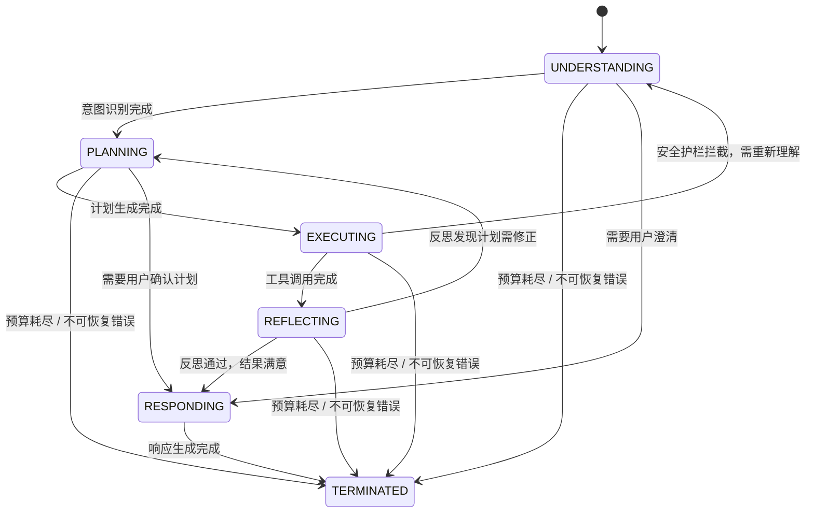

关键设计决策说明：

- **EXECUTING → UNDERSTANDING 回边**：当安全护栏拦截了某个工具调用时，Agent 不是简单地报错，而是回到理解阶段重新评估用户意图，尝试找到替代方案。这模拟了人类在遇到障碍时"退一步重新思考"的行为。
- **REFLECTING → PLANNING 回边**：当反思阶段发现执行结果不符合预期（例如工具返回了错误、数据不完整），Agent 回到规划阶段修正计划。这实现了自我修正能力，最多允许 2 次修正循环以防止无限回退。
- **任意阶段 → TERMINATED**：预算耗尽或不可恢复错误可以从任何阶段直接终止循环，确保系统不会陷入无限循环。

### 3.2 AgentAction — 动作类型层次

`AgentAction` 使用 Java 22 的 `sealed interface` 定义了 Agent 引擎中所有可能的动作类型。每个变体都是一个不可变的 `record`，携带该动作所需的全部信息。`sealed` 关键字确保编译器可以在 `switch` 表达式中进行穷举检查——如果未来新增动作类型，所有未处理的 `switch` 都会产生编译错误。

```java
package com.lifepilot.agent;

import java.util.List;

/**
 * Agent 动作密封接口。
 *
 * <p>定义了 Agent 引擎中所有合法的动作类型。每个动作代表 LLM 的一次决策输出
 * 或系统内部事件。{@link StateReducer} 通过模式匹配对每种动作执行对应的状态转换。</p>
 *
 * <p>设计约束：
 * <ul>
 *   <li>所有变体均为不可变 record，确保动作一旦创建不可修改</li>
 *   <li>sealed 修饰确保编译期穷举检查</li>
 *   <li>每个变体携带该动作所需的全部上下文信息</li>
 * </ul>
 * </p>
 */
public sealed interface AgentAction permits
        AgentAction.LlmResponseAction,
        AgentAction.ToolCallAction,
        AgentAction.ToolResultAction,
        AgentAction.UserClarificationAction,
        AgentAction.GuardrailBlockAction,
        AgentAction.TerminateAction,
        AgentAction.ErrorAction,
        AgentAction.PlanAction,
        AgentAction.ReflectAction {

    /**
     * LLM 文本响应动作。
     *
     * <p>当 LLM 返回自然语言文本（而非工具调用）时生成此动作。
     * {@code suggestedPhase} 是 LLM 建议的下一阶段，但最终由 StateReducer 决定是否采纳。</p>
     *
     * @param content        LLM 生成的文本内容
     * @param suggestedPhase LLM 建议的下一执行阶段
     */
    record LlmResponseAction(
            String content,
            AgentPhase suggestedPhase
    ) implements AgentAction {}

    /**
     * 工具调用动作。
     *
     * <p>当 LLM 决定调用一个或多个工具时生成此动作。
     * 工具调用列表可包含多个并行调用，由 AgentLoop 通过 Virtual Thread 并发执行。</p>
     *
     * @param toolCalls 待执行的工具调用列表，每个调用包含工具名称和参数
     */
    record ToolCallAction(
            List<ToolCall> toolCalls
    ) implements AgentAction {}

    /**
     * 工具执行结果动作。
     *
     * <p>工具调用完成后，执行结果被封装为此动作反馈给 StateReducer。
     * 结果列表与 {@link ToolCallAction} 中的调用列表一一对应。</p>
     *
     * @param results 工具执行结果列表，包含成功/失败状态和返回数据
     */
    record ToolResultAction(
            List<ToolResult> results
    ) implements AgentAction {}

    /**
     * 用户澄清请求动作。
     *
     * <p>当 LLM 判断用户意图不明确、信息不足以继续执行时，生成此动作请求用户补充信息。
     * Agent 将暂停当前流程，向用户提出澄清问题。</p>
     *
     * @param question 向用户提出的澄清问题
     */
    record UserClarificationAction(
            String question
    ) implements AgentAction {}

    /**
     * 安全护栏拦截动作。
     *
     * <p>当 {@link GuardrailEngine} 判定某个动作违反安全策略时生成此动作。
     * 携带拦截原因和风险等级，StateReducer 根据风险等级决定后续处理策略。</p>
     *
     * @param reason 拦截原因的中文描述
     * @param level  触发拦截的风险等级
     */
    record GuardrailBlockAction(
            String reason,
            RiskLevel level
    ) implements AgentAction {}

    /**
     * 终止动作。
     *
     * <p>表示 Agent 循环应当正常结束。{@code finalResponse} 是返回给用户的最终回复文本。
     * 此动作只能由 RESPONDING 阶段产生，或在预算耗尽时由系统强制生成。</p>
     *
     * @param finalResponse 返回给用户的最终响应文本
     */
    record TerminateAction(
            String finalResponse
    ) implements AgentAction {}

    /**
     * 错误动作。
     *
     * <p>当 LLM 调用失败、响应解析异常或其他不可预期的错误发生时生成此动作。
     * {@code category} 用于区分错误类型，StateReducer 根据类别决定是重试、降级还是终止。</p>
     *
     * @param errorMessage 错误描述信息
     * @param category     错误分类，决定后续处理策略
     */
    record ErrorAction(
            String errorMessage,
            ErrorCategory category
    ) implements AgentAction {}

    /**
     * 计划生成动作。
     *
     * <p>在 PLANNING 阶段，LLM 将用户意图分解为结构化的执行计划。
     * {@link ExecutionPlan} 包含有序的步骤列表、预估资源消耗和依赖关系。</p>
     *
     * @param plan 结构化执行计划
     */
    record PlanAction(
            ExecutionPlan plan
    ) implements AgentAction {}

    /**
     * 反思动作。
     *
     * <p>在 REFLECTING 阶段，LLM 评估执行结果并生成反思报告。
     * {@link ReflectionResult} 包含评估结论（满意/需修正/需终止）和修正建议。</p>
     *
     * @param reflection 反思评估结果
     */
    record ReflectAction(
            ReflectionResult reflection
    ) implements AgentAction {}
}
```

### 3.3 StateReducer 核心实现

`StateReducer` 是 Agent 引擎中唯一允许执行状态转换的组件。它接收当前状态和一个动作，返回新的不可变状态。整个实现大量使用 Java 22 的 `switch` 表达式和模式匹配，确保对所有动作类型的穷举处理。

```java
package com.lifepilot.agent;

import org.slf4j.Logger;
import org.slf4j.LoggerFactory;
import org.springframework.stereotype.Component;

import java.time.Instant;
import java.util.ArrayList;
import java.util.List;
import java.util.Set;

/**
 * 纯函数状态转换器。
 *
 * <p>核心契约：{@code reduce(state, action) → newState}。
 * 相同的输入永远产生相同的输出，无副作用，不依赖外部状态。</p>
 *
 * <p>设计保证：
 * <ul>
 *   <li>所有状态转换均通过此类执行，禁止绕过</li>
 *   <li>非法阶段转换将抛出 {@link IllegalStateTransitionException}</li>
 *   <li>TERMINATED 是吸收态，任何后续动作均被忽略</li>
 *   <li>预算耗尽时自动转入 TERMINATED</li>
 * </ul>
 * </p>
 */
@Component
public class StateReducer {

    private static final Logger log = LoggerFactory.getLogger(StateReducer.class);

    /** 反思→规划回退的最大允许次数，防止无限修正循环。 */
    private static final int MAX_REVISION_CYCLES = 2;

    /** 合法的阶段转换集合，用于快速校验。 */
    private static final Set<PhaseTransition> VALID_TRANSITIONS = Set.of(
            new PhaseTransition(AgentPhase.UNDERSTANDING, AgentPhase.PLANNING),
            new PhaseTransition(AgentPhase.UNDERSTANDING, AgentPhase.RESPONDING),
            new PhaseTransition(AgentPhase.UNDERSTANDING, AgentPhase.TERMINATED),
            new PhaseTransition(AgentPhase.PLANNING, AgentPhase.EXECUTING),
            new PhaseTransition(AgentPhase.PLANNING, AgentPhase.RESPONDING),
            new PhaseTransition(AgentPhase.PLANNING, AgentPhase.TERMINATED),
            new PhaseTransition(AgentPhase.EXECUTING, AgentPhase.REFLECTING),
            new PhaseTransition(AgentPhase.EXECUTING, AgentPhase.UNDERSTANDING),
            new PhaseTransition(AgentPhase.EXECUTING, AgentPhase.TERMINATED),
            new PhaseTransition(AgentPhase.REFLECTING, AgentPhase.RESPONDING),
            new PhaseTransition(AgentPhase.REFLECTING, AgentPhase.PLANNING),
            new PhaseTransition(AgentPhase.REFLECTING, AgentPhase.TERMINATED),
            new PhaseTransition(AgentPhase.RESPONDING, AgentPhase.TERMINATED)
    );

    /**
     * 核心状态转换方法。
     *
     * <p>纯函数：相同的 {@code (state, action)} 输入永远产生相同的输出。
     * 使用 switch 表达式对所有 {@link AgentAction} 变体进行穷举匹配，
     * 确保新增动作类型时编译器会强制要求处理。</p>
     *
     * @param state  当前不可变状态
     * @param action 待处理的动作
     * @return 新的不可变状态
     * @throws IllegalStateTransitionException 当阶段转换不合法时抛出
     */
    public AgentState reduce(AgentState state, AgentAction action) {
        // 吸收态：TERMINATED 后忽略所有动作
        if (state.isTerminated()) {
            log.debug("状态已终止，忽略动作: action={}", action.getClass().getSimpleName());
            return state;
        }

        // 预算耗尽时强制终止
        if (state.isBudgetExhausted()) {
            log.warn("预算耗尽，强制终止: step={}", state.stepCount());
            return forceTerminate(state, "资源预算耗尽");
        }

        return switch (action) {
            case AgentAction.LlmResponseAction(var content, var suggestedPhase) -> {
                // LLM 建议的阶段需要经过合法性校验
                var targetPhase = validateTransition(state.phase(), suggestedPhase)
                        ? suggestedPhase
                        : inferNextPhase(state.phase());
                var newMessages = appendMessage(state.messages(), ChatMessage.assistant(content));
                yield state.nextStep(targetPhase, newMessages);
            }

            case AgentAction.ToolCallAction(var toolCalls) -> {
                // 工具调用只能在 EXECUTING 阶段发起
                if (!state.phase().allowsToolExecution()) {
                    throw new IllegalStateTransitionException(
                            "工具调用仅允许在 EXECUTING 阶段执行，当前阶段: " + state.phase());
                }
                var callSummary = toolCalls.stream()
                        .map(ToolCall::name)
                        .toList();
                log.debug("处理工具调用动作: tools={}", callSummary);
                // 工具调用不触发阶段转换，等待结果返回
                yield state;
            }

            case AgentAction.ToolResultAction(var results) -> {
                // 工具结果触发从 EXECUTING → REFLECTING 的转换
                var newMessages = appendToolResults(state.messages(), results);
                yield state.nextStep(AgentPhase.REFLECTING, newMessages);
            }

            case AgentAction.UserClarificationAction(var question) -> {
                // 用户澄清请求：跳转到 RESPONDING 阶段，等待用户输入
                var newMessages = appendMessage(
                        state.messages(),
                        ChatMessage.assistant(question));
                yield state.nextStep(AgentPhase.RESPONDING, newMessages);
            }

            case AgentAction.GuardrailBlockAction(var reason, var level) -> {
                // 安全拦截：根据风险等级决定回退策略
                log.warn("安全护栏拦截: reason={}, level={}", reason, level);
                var targetPhase = switch (level) {
                    case LOW, MEDIUM -> state.phase(); // 低风险：留在当前阶段重试
                    case HIGH -> AgentPhase.UNDERSTANDING; // 高风险：回退到理解阶段
                    case CRITICAL -> AgentPhase.TERMINATED; // 严重：直接终止
                };
                var newMessages = appendMessage(
                        state.messages(),
                        ChatMessage.system("安全护栏拦截: " + reason));
                yield state.nextStep(targetPhase, newMessages);
            }

            case AgentAction.TerminateAction(var finalResponse) -> {
                // 正常终止：生成最终响应并进入吸收态
                var newMessages = appendMessage(
                        state.messages(),
                        ChatMessage.assistant(finalResponse));
                yield state.nextStep(AgentPhase.TERMINATED, newMessages);
            }

            case AgentAction.ErrorAction(var errorMessage, var category) -> {
                // 错误处理：根据错误类别决定恢复策略
                log.error("Agent 错误: message={}, category={}", errorMessage, category);
                var targetPhase = switch (category) {
                    case RETRYABLE -> state.phase(); // 可重试：留在当前阶段
                    case RECOVERABLE -> AgentPhase.UNDERSTANDING; // 可恢复：回退重新理解
                    case FATAL -> AgentPhase.TERMINATED; // 致命：直接终止
                };
                var newMessages = appendMessage(
                        state.messages(),
                        ChatMessage.system("错误: " + errorMessage));
                yield state.nextStep(targetPhase, newMessages);
            }

            case AgentAction.PlanAction(var plan) -> {
                // 计划生成：从 PLANNING 转入 EXECUTING
                if (state.phase() != AgentPhase.PLANNING) {
                    throw new IllegalStateTransitionException(
                            "计划动作仅允许在 PLANNING 阶段生成，当前阶段: " + state.phase());
                }
                var newMessages = appendMessage(
                        state.messages(),
                        ChatMessage.system("执行计划已生成: steps=" + plan.steps().size()));
                yield state.nextStep(AgentPhase.EXECUTING, newMessages);
            }

            case AgentAction.ReflectAction(var reflection) -> {
                // 反思结果：根据评估结论决定下一阶段
                var targetPhase = switch (reflection.conclusion()) {
                    case SATISFIED -> AgentPhase.RESPONDING;
                    case NEEDS_REVISION -> {
                        // 检查修正次数限制，防止无限回退
                        int revisionCount = countRevisions(state.metadata());
                        if (revisionCount >= MAX_REVISION_CYCLES) {
                            log.warn("修正次数达到上限，强制进入响应阶段: count={}", revisionCount);
                            yield AgentPhase.RESPONDING;
                        }
                        yield AgentPhase.PLANNING;
                    }
                    case NEEDS_TERMINATION -> AgentPhase.TERMINATED;
                };
                var updatedMetadata = incrementRevisionCount(state.metadata(), reflection);
                var newMessages = appendMessage(
                        state.messages(),
                        ChatMessage.system("反思结论: " + reflection.conclusion()));
                yield new AgentState(
                        state.sessionId(), targetPhase, state.stepCount() + 1,
                        newMessages, List.of(), state.budget().decrement(),
                        updatedMetadata, Instant.now());
            }
        };
    }

    /**
     * 强制终止 Agent 循环。
     *
     * <p>用于预算耗尽、不可恢复错误等需要立即终止的场景。
     * 无论当前处于什么阶段，都直接转入 TERMINATED。</p>
     *
     * @param state  当前状态
     * @param reason 终止原因
     * @return 终止状态
     */
    public AgentState forceTerminate(AgentState state, String reason) {
        log.warn("强制终止 Agent: reason={}, step={}", reason, state.stepCount());
        var newMessages = appendMessage(
                state.messages(),
                ChatMessage.system("Agent 被强制终止: " + reason));
        return state.nextStep(AgentPhase.TERMINATED, newMessages);
    }

    /**
     * 校验阶段转换是否合法。
     *
     * @param from 当前阶段
     * @param to   目标阶段
     * @return 转换是否在合法转换集合中
     */
    public boolean validateTransition(AgentPhase from, AgentPhase to) {
        return VALID_TRANSITIONS.contains(new PhaseTransition(from, to));
    }

    // ──────────────────────────────────────────────
    // 内部辅助方法
    // ──────────────────────────────────────────────

    /** 根据当前阶段推断默认的下一阶段（当 LLM 建议的阶段不合法时使用）。 */
    private AgentPhase inferNextPhase(AgentPhase current) {
        return switch (current) {
            case UNDERSTANDING -> AgentPhase.PLANNING;
            case PLANNING -> AgentPhase.EXECUTING;
            case EXECUTING -> AgentPhase.REFLECTING;
            case REFLECTING -> AgentPhase.RESPONDING;
            case RESPONDING -> AgentPhase.TERMINATED;
            case TERMINATED -> AgentPhase.TERMINATED;
        };
    }

    /** 向消息列表追加新消息，返回新的不可变列表。 */
    private List<ChatMessage> appendMessage(List<ChatMessage> messages, ChatMessage newMessage) {
        var updated = new ArrayList<>(messages);
        updated.add(newMessage);
        return List.copyOf(updated);
    }

    /** 将工具执行结果转换为消息并追加到列表。 */
    private List<ChatMessage> appendToolResults(List<ChatMessage> messages, List<ToolResult> results) {
        var updated = new ArrayList<>(messages);
        for (var result : results) {
            updated.add(ChatMessage.toolResult(result));
        }
        return List.copyOf(updated);
    }

    /** 从元数据中读取当前修正循环次数。 */
    private int countRevisions(java.util.Map<String, Object> metadata) {
        return (int) metadata.getOrDefault("revisionCount", 0);
    }

    /** 递增修正循环计数器，返回新的元数据映射。 */
    private java.util.Map<String, Object> incrementRevisionCount(
            java.util.Map<String, Object> metadata,
            ReflectionResult reflection
    ) {
        var updated = new java.util.HashMap<>(metadata);
        int current = countRevisions(metadata);
        if (reflection.conclusion() == ReflectionConclusion.NEEDS_REVISION) {
            updated.put("revisionCount", current + 1);
        }
        return java.util.Map.copyOf(updated);
    }

    /** 阶段转换记录，用于合法转换集合的键。 */
    private record PhaseTransition(AgentPhase from, AgentPhase to) {}
}
```

### 3.4 阶段转换规则

下表列出了所有合法的阶段转换及其触发条件。任何不在此表中的转换都将被 `StateReducer` 拒绝并抛出 `IllegalStateTransitionException`。

| 当前阶段 | 目标阶段 | 触发条件 |
|:---------|:---------|:---------|
| UNDERSTANDING | PLANNING | LLM 成功识别用户意图，生成意图结构体 |
| UNDERSTANDING | RESPONDING | LLM 判断需要用户澄清，生成 `UserClarificationAction` |
| UNDERSTANDING | TERMINATED | 预算耗尽，或遇到不可恢复的解析错误 |
| PLANNING | EXECUTING | LLM 生成了有效的 `ExecutionPlan`，通过 `PlanAction` 触发 |
| PLANNING | RESPONDING | LLM 判断计划需要用户确认（如涉及高风险操作） |
| PLANNING | TERMINATED | 预算耗尽，或 LLM 判断任务无法完成 |
| EXECUTING | REFLECTING | 所有工具调用完成，结果通过 `ToolResultAction` 返回 |
| EXECUTING | UNDERSTANDING | 安全护栏拦截了 HIGH 级别的工具调用，回退重新理解意图 |
| EXECUTING | TERMINATED | 预算耗尽，或遇到 CRITICAL 级别的安全拦截 |
| REFLECTING | RESPONDING | 反思结论为 `SATISFIED`，执行结果符合预期 |
| REFLECTING | PLANNING | 反思结论为 `NEEDS_REVISION`，需要修正计划（最多 2 次） |
| REFLECTING | TERMINATED | 反思结论为 `NEEDS_TERMINATION`，或预算耗尽 |
| RESPONDING | TERMINATED | 最终响应生成完成，循环正常结束 |

**禁止的转换及原因：**

| 禁止转换 | 原因 |
|:---------|:-----|
| PLANNING → UNDERSTANDING | 规划阶段不应回退到理解阶段；如果意图不清晰，应在 UNDERSTANDING 阶段就请求澄清 |
| RESPONDING → UNDERSTANDING | 响应阶段是循环的出口，不应重新开始循环；新的用户输入会启动新的循环 |
| TERMINATED → 任意阶段 | TERMINATED 是吸收态，一旦进入不可逆转；这是状态机的核心安全保证 |
| REFLECTING → EXECUTING | 反思后不能直接重新执行；必须先回到 PLANNING 修正计划，再进入 EXECUTING |
| EXECUTING → PLANNING | 执行中途不能跳回规划；如需修正，必须先完成当前执行进入 REFLECTING |

### 3.5 不变量保证

`StateReducer` 作为纯函数状态转换器，必须在任何输入组合下维护以下不变量。这些不变量是 Agent 引擎正确性的基石，也是 jqwik 属性测试的核心验证目标。

**不变量 1：stepCount 单调递增**

```java
// 属性测试：对于任意合法的 (state, action) 组合
// reduce(state, action).stepCount() >= state.stepCount()
@Property
void stepCount_单调递增(@ForAll AgentState state, @ForAll AgentAction action) {
    var newState = stateReducer.reduce(state, action);
    assertThat(newState.stepCount()).isGreaterThanOrEqualTo(state.stepCount());
}
```

每次状态转换要么保持 `stepCount` 不变（如 `ToolCallAction` 不触发阶段转换时），要么递增 1。绝不会出现步数减少的情况。这保证了执行轨迹的时间线一致性。

**不变量 2：TERMINATED 是吸收态**

```java
// 属性测试：一旦进入 TERMINATED，任何后续动作都不改变阶段
@Property
void terminated_是吸收态(@ForAll AgentAction action) {
    var terminatedState = AgentState.initial(UUID.randomUUID(), Budget.unlimited())
            .nextStep(AgentPhase.TERMINATED, List.of());
    var newState = stateReducer.reduce(terminatedState, action);
    assertThat(newState.phase()).isEqualTo(AgentPhase.TERMINATED);
}
```

`TERMINATED` 是状态机的唯一终态。一旦 Agent 进入此阶段，无论接收到什么动作，状态都不会再发生变化。这是防止"僵尸循环"的关键保证——终止就是终止，没有例外。

**不变量 3：预算只减不增**

```java
// 属性测试：状态转换后预算不会增加
@Property
void budget_只减不增(@ForAll AgentState state, @ForAll AgentAction action) {
    var newState = stateReducer.reduce(state, action);
    assertThat(newState.budget().remainingSteps())
            .isLessThanOrEqualTo(state.budget().remainingSteps());
}
```

每次状态转换消耗预算（步数 -1），或保持不变。预算绝不会在转换过程中增加。这确保了 Agent 循环的有界性——无论 LLM 输出什么，循环最终一定会因预算耗尽而终止。

**不变量 4：消息列表只增不减（Append-Only）**

```java
// 属性测试：新状态的消息列表是旧状态消息列表的超集
@Property
void messages_只增不减(@ForAll AgentState state, @ForAll AgentAction action) {
    var newState = stateReducer.reduce(state, action);
    assertThat(newState.messages()).containsAll(state.messages());
}
```

消息历史是 append-only 的——新消息只能追加到列表末尾，已有消息不会被修改或删除。这保证了对话历史的完整性，也是状态回放能力的前提条件。

**不变量 5：阶段转换遵循合法转换图**

```java
// 属性测试：任何状态转换的 (from, to) 都在合法转换集合中
@Property
void phaseTransition_遵循合法转换图(@ForAll AgentState state, @ForAll AgentAction action) {
    var newState = stateReducer.reduce(state, action);
    if (!state.phase().equals(newState.phase())) {
        assertThat(stateReducer.validateTransition(state.phase(), newState.phase()))
                .as("非法转换: %s → %s", state.phase(), newState.phase())
                .isTrue();
    }
}
```

所有阶段转换必须在 §3.4 定义的合法转换集合中。任何不在集合中的转换都会被拒绝。这确保了 Agent 的行为始终可预测——无论 LLM 输出多么离谱，状态机都不会进入非法状态。

这五个不变量共同构成了 Agent 引擎的**安全网**。即使 LLM 产生了意料之外的输出，`StateReducer` 也能保证系统状态始终处于合法、一致、可追溯的状态空间内。


---

## 4. ContextAssembler — 上下文工程

### 4.1 上下文即稀缺资源

LLM 的上下文窗口不是一个可以随意填充的无限容器——它是一种**稀缺资源**，每一个 Token 都有成本，每一段无关信息都在稀释模型的注意力。ContextAssembler 的核心使命是：在有限的上下文窗口内，为当前 Agent 阶段组装**信噪比最高**的信息集合。

这一设计理念来自近年业界对上下文工程（Context Engineering）的深入研究：

- **Anthropic Context Engineering（2025）**：将每个 Token 视为有成本的资源，上下文组装不是"把所有东西塞进去"，而是精心策划的信息选择过程。提示词只是上下文工程的冰山一角，真正的挑战在于动态决定哪些信息值得占用宝贵的上下文空间。
- **Weaviate 的 Write / Select / Compress / Isolate 策略**：将上下文管理分解为四个正交维度——写入（持久化哪些信息）、选择（检索哪些信息）、压缩（如何在保留语义的前提下减少 Token 数）、隔离（哪些信息应该在独立的上下文中处理以避免干扰）。
- **Inkeep 的 "Fighting Context Rot"**：长对话中注意力会逐步退化（Context Rot），早期的关键信息被后续大量消息淹没。解决方案不是简单地增大窗口，而是主动压缩和重组上下文结构。
- **Redis 上下文窗口管理指南（2026）**：将上下文窗口类比为内存管理——需要分配策略、淘汰策略和碎片整理，而非无限制地追加内容。

ZhiWei 的 ContextAssembler 将这些理念融合为一个核心原则：

> **不同的 Agent 阶段需要不同的上下文组成。**

UNDERSTANDING 阶段需要更多的用户历史和知识图谱信息来理解意图；EXECUTING 阶段需要更多的工具 Schema 来正确调用工具；REFLECTING 阶段需要更多的执行结果来评估成效。将所有信息不加区分地塞入上下文，不仅浪费 Token 预算，还会因为无关信息的干扰导致 LLM 的决策质量下降。

```
┌─────────────────────────────────────────────────────────────┐
│                    上下文工程核心理念                          │
│                                                             │
│  传统方式:                                                   │
│  ┌─────────────────────────────────────────────────────┐    │
│  │ System Prompt + 全部历史消息 + 全部工具 + 全部记忆    │    │
│  │ → Token 浪费、注意力稀释、决策质量下降                 │    │
│  └─────────────────────────────────────────────────────┘    │
│                                                             │
│  ZhiWei 方式:                                             │
│  ┌─────────────────────────────────────────────────────┐    │
│  │ 阶段感知的 System Prompt                              │    │
│  │ + 相关性排序的对话历史（压缩旧消息）                    │    │
│  │ + 意图匹配的工具 Schema（仅相关工具）                   │    │
│  │ + 向量检索的记忆片段（按阶段调整权重）                  │    │
│  │ → 高信噪比、注意力集中、决策质量提升                    │    │
│  └─────────────────────────────────────────────────────┘    │
└─────────────────────────────────────────────────────────────┘
```

### 4.2 Token 预算分配策略

ContextAssembler 的核心机制是**阶段感知的 Token 预算分配**。给定总 Token 预算（由模型上下文窗口大小和 `Budget` 配置共同决定），系统根据当前 `AgentPhase` 将预算按比例分配给六个上下文槽位（Slot）。每个槽位有独立的 Token 上限，组装器在填充时严格遵守各槽位的预算约束。

| 阶段 | System Prompt | 对话历史 | 记忆检索 | 工具 Schema | 工具结果 | 保留缓冲 |
|:-------------|:---:|:---:|:---:|:---:|:---:|:---:|
| UNDERSTANDING | 15% | 30% | 35% | 10% | 0% | 10% |
| PLANNING | 15% | 20% | 15% | 35% | 5% | 10% |
| EXECUTING | 10% | 10% | 5% | 40% | 25% | 10% |
| REFLECTING | 10% | 15% | 10% | 5% | 50% | 10% |
| RESPONDING | 15% | 25% | 20% | 0% | 30% | 10% |

**分配策略解读：**

- **UNDERSTANDING 阶段**：记忆检索占比最高（35%），因为理解用户意图需要丰富的历史上下文——用户的偏好、习惯、近期活动都是意图消歧的关键线索。对话历史也占较大比例（30%），用于捕捉多轮对话中的上下文延续。
- **PLANNING 阶段**：工具 Schema 占比最高（35%），因为生成执行计划需要知道有哪些工具可用、每个工具的能力边界和参数约束。记忆检索降至 15%，仅保留与当前任务直接相关的知识。
- **EXECUTING 阶段**：工具 Schema（40%）和工具结果（25%）合计占 65%，因为执行阶段的核心任务是正确调用工具并处理返回结果。对话历史和记忆检索大幅缩减，避免无关信息干扰工具调用的参数生成。
- **REFLECTING 阶段**：工具结果占比最高（50%），因为反思的核心输入是执行结果——需要对比预期与实际，评估是否达成目标。
- **RESPONDING 阶段**：工具结果（30%）和对话历史（25%）占主导，因为生成用户响应需要综合执行结果和对话上下文。工具 Schema 降至 0%，响应阶段不需要工具信息。

**保留缓冲（10%）**：每个阶段都预留 10% 的 Token 作为缓冲区，用于应对 Token 计数估算误差、LLM 响应生成所需的输出空间，以及运行时动态注入的系统指令（如安全护栏警告）。

以下 Mermaid 图展示了 ContextAssembler 的完整组装流水线：

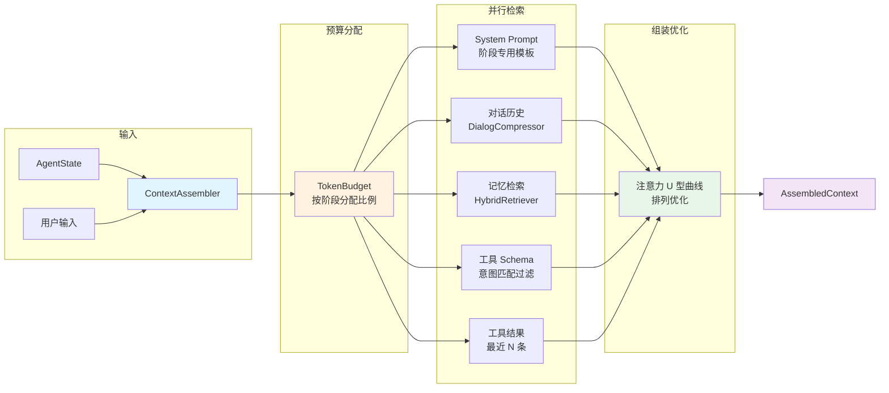

### 4.3 AssembledContext 数据结构

`AssembledContext` 是 ContextAssembler 的输出产物，封装了一次 LLM 调用所需的全部上下文信息。它是一个不可变的 `record`，在传递给 `AgentLoop.callLlm()` 后不会被修改。

```java
package com.lifepilot.agent;

import java.util.List;

/**
 * 组装完成的上下文快照。
 *
 * <p>封装了一次 LLM 调用所需的全部信息，由 {@link ContextAssembler} 根据当前
 * {@link AgentPhase} 和 Token 预算动态组装。所有字段在构造后不可变。</p>
 *
 * <p>设计要点：
 * <ul>
 *   <li>每个字段对应上下文窗口中的一个槽位，各自遵守独立的 Token 预算</li>
 *   <li>字段排列顺序即为上下文中的信息排列顺序（注意力 U 型曲线优化）</li>
 *   <li>{@code tokenBudget} 记录了各槽位的实际 Token 消耗，用于可观测性</li>
 * </ul>
 * </p>
 *
 * @param systemPrompt      阶段专用的系统提示词，包含角色定义、行为约束和阶段指令
 * @param userPrompt        组装后的用户提示词，融合了原始输入、工具结果摘要和记忆上下文
 * @param selectedHistory   经过压缩和筛选的对话历史，遵守对话历史槽位的 Token 预算
 * @param retrievedMemories 通过 HybridRetriever 检索的相关记忆片段，按相关性排序
 * @param availableTools    经过意图匹配过滤的工具 Schema 列表，仅包含当前阶段相关的工具
 * @param tokenBudget       Token 预算分配与实际消耗的记录，用于监控和调优
 */
public record AssembledContext(
        String systemPrompt,
        String userPrompt,
        List<ChatMessage> selectedHistory,
        List<MemoryFragment> retrievedMemories,
        List<ToolSchema> availableTools,
        TokenBudget tokenBudget
) {
    /** 防御性拷贝，确保外部引用无法修改内部集合。 */
    public AssembledContext {
        selectedHistory = List.copyOf(selectedHistory);
        retrievedMemories = List.copyOf(retrievedMemories);
        availableTools = List.copyOf(availableTools);
    }

    /** 计算上下文的总 Token 消耗。 */
    public int totalTokens() {
        return tokenBudget.totalConsumed();
    }

    /** 检查上下文是否超出预算。 */
    public boolean isOverBudget() {
        return tokenBudget.isOverBudget();
    }
}
```

`TokenBudget` 记录了各槽位的预算分配和实际消耗：

```java
package com.lifepilot.agent;

/**
 * Token 预算分配与消耗记录。
 *
 * <p>每个槽位有独立的预算上限和实际消耗值。ContextAssembler 在填充各槽位时
 * 实时更新消耗值，确保不超出预算。</p>
 *
 * @param systemPromptBudget  系统提示词槽位预算
 * @param historyBudget       对话历史槽位预算
 * @param memoryBudget        记忆检索槽位预算
 * @param toolSchemaBudget    工具 Schema 槽位预算
 * @param toolResultBudget    工具结果槽位预算
 * @param reservedBuffer      保留缓冲预算
 * @param systemPromptUsed    系统提示词实际消耗
 * @param historyUsed         对话历史实际消耗
 * @param memoryUsed          记忆检索实际消耗
 * @param toolSchemaUsed      工具 Schema 实际消耗
 * @param toolResultUsed      工具结果实际消耗
 */
public record TokenBudget(
        int systemPromptBudget, int historyBudget, int memoryBudget,
        int toolSchemaBudget, int toolResultBudget, int reservedBuffer,
        int systemPromptUsed, int historyUsed, int memoryUsed,
        int toolSchemaUsed, int toolResultUsed
) {
    /** 计算总预算。 */
    public int totalBudget() {
        return systemPromptBudget + historyBudget + memoryBudget
                + toolSchemaBudget + toolResultBudget + reservedBuffer;
    }

    /** 计算总消耗。 */
    public int totalConsumed() {
        return systemPromptUsed + historyUsed + memoryUsed
                + toolSchemaUsed + toolResultUsed;
    }

    /** 检查是否超出预算。 */
    public boolean isOverBudget() {
        return totalConsumed() > totalBudget() - reservedBuffer;
    }

    /** 根据 AgentPhase 和总 Token 数创建预算分配。 */
    public static TokenBudget allocate(AgentPhase phase, int totalTokens) {
        var ratios = PHASE_RATIOS.get(phase);
        return new TokenBudget(
                (int) (totalTokens * ratios.systemPrompt()),
                (int) (totalTokens * ratios.history()),
                (int) (totalTokens * ratios.memory()),
                (int) (totalTokens * ratios.toolSchema()),
                (int) (totalTokens * ratios.toolResult()),
                (int) (totalTokens * ratios.reserved()),
                0, 0, 0, 0, 0
        );
    }

    /** 各阶段的预算分配比例。 */
    private static final java.util.Map<AgentPhase, BudgetRatios> PHASE_RATIOS = java.util.Map.of(
            AgentPhase.UNDERSTANDING, new BudgetRatios(0.15, 0.30, 0.35, 0.10, 0.00, 0.10),
            AgentPhase.PLANNING,      new BudgetRatios(0.15, 0.20, 0.15, 0.35, 0.05, 0.10),
            AgentPhase.EXECUTING,     new BudgetRatios(0.10, 0.10, 0.05, 0.40, 0.25, 0.10),
            AgentPhase.REFLECTING,    new BudgetRatios(0.10, 0.15, 0.10, 0.05, 0.50, 0.10),
            AgentPhase.RESPONDING,    new BudgetRatios(0.15, 0.25, 0.20, 0.00, 0.30, 0.10)
    );

    /** 预算分配比例记录。 */
    private record BudgetRatios(
            double systemPrompt, double history, double memory,
            double toolSchema, double toolResult, double reserved
    ) {}
}
```


### 4.4 ContextAssembler 核心实现

`ContextAssembler` 是上下文工程的中枢组件，负责将分散在各子系统中的信息按照阶段策略组装为一个高信噪比的 `AssembledContext`。它协调 `DialogCompressor`（对话压缩）、`HybridRetriever`（记忆检索）、`ToolRegistry`（工具注册表）三个下游组件，并在组装完成后应用注意力 U 型曲线优化。

```java
package com.lifepilot.agent;

import org.slf4j.Logger;
import org.slf4j.LoggerFactory;
import org.springframework.stereotype.Component;

import java.util.ArrayList;
import java.util.Comparator;
import java.util.List;
import java.util.concurrent.StructuredTaskScope;

/**
 * 上下文组装器。
 *
 * <p>核心职责：根据当前 {@link AgentPhase} 和 Token 预算，从对话历史、记忆系统、
 * 工具注册表中选择最相关的信息，组装为 {@link AssembledContext} 供 LLM 调用使用。</p>
 *
 * <p>组装流水线：
 * <ol>
 *   <li>根据阶段分配 Token 预算（{@link TokenBudget#allocate}）</li>
 *   <li>并行执行：对话历史压缩、记忆检索、工具 Schema 过滤</li>
 *   <li>构建阶段专用的 System Prompt 和 User Prompt</li>
 *   <li>应用注意力 U 型曲线优化，调整信息排列顺序</li>
 * </ol>
 * </p>
 *
 * <p>线程模型：记忆检索和对话压缩通过 Virtual Thread 并行执行，减少组装延迟。</p>
 */
@Component
public class ContextAssembler {

    private static final Logger log = LoggerFactory.getLogger(ContextAssembler.class);

    /** 默认总 Token 预算（128K 模型窗口的 80%，预留 20% 给 LLM 输出）。 */
    private static final int DEFAULT_TOTAL_TOKENS = 102_400;

    private final DialogCompressor dialogCompressor;
    private final HybridRetriever hybridRetriever;
    private final ToolRegistry toolRegistry;
    private final PromptTemplateEngine promptTemplateEngine;
    private final TokenCounter tokenCounter;

    public ContextAssembler(
            DialogCompressor dialogCompressor,
            HybridRetriever hybridRetriever,
            ToolRegistry toolRegistry,
            PromptTemplateEngine promptTemplateEngine,
            TokenCounter tokenCounter
    ) {
        this.dialogCompressor = dialogCompressor;
        this.hybridRetriever = hybridRetriever;
        this.toolRegistry = toolRegistry;
        this.promptTemplateEngine = promptTemplateEngine;
        this.tokenCounter = tokenCounter;
    }

    /**
     * 组装上下文。
     *
     * <p>根据当前 Agent 状态和用户输入，组装一个阶段最优的上下文快照。
     * 记忆检索和对话压缩通过 Virtual Thread 并行执行以降低延迟。</p>
     *
     * @param state     当前 Agent 不可变状态
     * @param userInput 用户原始输入文本
     * @return 组装完成的上下文快照
     */
    public AssembledContext assemble(AgentState state, String userInput) {
        log.debug("开始组装上下文: phase={}, messageCount={}",
                state.phase(), state.messages().size());

        // 1. 根据阶段分配 Token 预算
        var budget = TokenBudget.allocate(state.phase(), DEFAULT_TOTAL_TOKENS);

        // 2. 并行执行检索和压缩任务（Virtual Thread）
        List<ChatMessage> compressedHistory;
        List<MemoryFragment> memories;
        List<ToolSchema> tools;

        try (var scope = new StructuredTaskScope.ShutdownOnFailure()) {
            var historyTask = scope.fork(() ->
                    selectHistory(state.messages(), budget.historyBudget()));
            var memoryTask = scope.fork(() ->
                    retrieveMemories(userInput, state.phase(), budget.memoryBudget()));
            var toolTask = scope.fork(() ->
                    selectToolSchemas(state.phase(), budget.toolSchemaBudget()));

            scope.join().throwIfFailed();

            compressedHistory = historyTask.get();
            memories = memoryTask.get();
            tools = toolTask.get();
        } catch (Exception e) {
            log.warn("并行检索部分失败，降级为空结果: {}", e.getMessage());
            compressedHistory = selectHistoryFallback(state.messages(), budget.historyBudget());
            memories = List.of();
            tools = toolRegistry.getAllSchemas();
        }

        // 3. 构建 System Prompt 和 User Prompt
        var systemPrompt = buildSystemPrompt(state.phase(), memories);
        var userPrompt = buildUserPrompt(userInput, state.toolResults(), memories);

        // 4. 更新 Token 预算的实际消耗
        var finalBudget = updateBudgetUsage(budget, systemPrompt, compressedHistory,
                memories, tools, userPrompt);

        log.debug("上下文组装完成: totalTokens={}, phase={}",
                finalBudget.totalConsumed(), state.phase());

        return new AssembledContext(
                systemPrompt, userPrompt, compressedHistory,
                memories, tools, finalBudget
        );
    }

    /**
     * 选择并压缩对话历史。
     *
     * <p>当对话历史超出 Token 预算时，调用 {@link DialogCompressor} 进行三层渐进式压缩。
     * 最近的消息保持完整，较早的消息被摘要化，最早的消息被压缩为单段概述。</p>
     *
     * @param messages  完整的对话消息列表
     * @param maxTokens 对话历史槽位的 Token 预算
     * @return 压缩后的对话消息列表
     */
    private List<ChatMessage> selectHistory(List<ChatMessage> messages, int maxTokens) {
        int currentTokens = tokenCounter.count(messages);
        if (currentTokens <= maxTokens) {
            return messages;
        }
        log.debug("对话历史超出预算，启动压缩: current={}, budget={}", currentTokens, maxTokens);
        return dialogCompressor.compress(messages, maxTokens);
    }

    /** 降级方案：当并行压缩失败时，简单截取最近的消息。 */
    private List<ChatMessage> selectHistoryFallback(List<ChatMessage> messages, int maxTokens) {
        var result = new ArrayList<ChatMessage>();
        int tokenCount = 0;
        // 从最新消息开始向前遍历，直到预算耗尽
        for (int i = messages.size() - 1; i >= 0; i--) {
            int msgTokens = tokenCounter.count(messages.get(i));
            if (tokenCount + msgTokens > maxTokens) break;
            result.addFirst(messages.get(i));
            tokenCount += msgTokens;
        }
        return List.copyOf(result);
    }

    /**
     * 检索相关记忆片段。
     *
     * <p>通过 {@link HybridRetriever} 执行混合检索（向量相似度 + 关键词匹配 + 时间衰减），
     * 根据当前阶段调整检索策略的权重。UNDERSTANDING 阶段偏重长期记忆和用户偏好，
     * EXECUTING 阶段偏重近期操作记录和工具使用历史。</p>
     *
     * @param query     检索查询（通常为用户输入）
     * @param phase     当前 Agent 阶段，影响检索权重
     * @param maxTokens 记忆检索槽位的 Token 预算
     * @return 按相关性排序的记忆片段列表
     */
    private List<MemoryFragment> retrieveMemories(String query, AgentPhase phase, int maxTokens) {
        var retrievalConfig = switch (phase) {
            case UNDERSTANDING -> RetrievalConfig.builder()
                    .semanticWeight(0.5).keywordWeight(0.2).recencyWeight(0.3)
                    .maxResults(20).build();
            case PLANNING -> RetrievalConfig.builder()
                    .semanticWeight(0.6).keywordWeight(0.3).recencyWeight(0.1)
                    .maxResults(10).build();
            case EXECUTING -> RetrievalConfig.builder()
                    .semanticWeight(0.3).keywordWeight(0.4).recencyWeight(0.3)
                    .maxResults(5).build();
            case REFLECTING -> RetrievalConfig.builder()
                    .semanticWeight(0.4).keywordWeight(0.2).recencyWeight(0.4)
                    .maxResults(8).build();
            case RESPONDING -> RetrievalConfig.builder()
                    .semanticWeight(0.5).keywordWeight(0.2).recencyWeight(0.3)
                    .maxResults(15).build();
            case TERMINATED -> RetrievalConfig.builder().maxResults(0).build();
        };

        var fragments = hybridRetriever.retrieve(query, retrievalConfig);

        // 按 Token 预算截断
        var result = new ArrayList<MemoryFragment>();
        int tokenCount = 0;
        for (var fragment : fragments) {
            int fragTokens = tokenCounter.count(fragment.content());
            if (tokenCount + fragTokens > maxTokens) break;
            result.add(fragment);
            tokenCount += fragTokens;
        }

        log.debug("记忆检索完成: phase={}, retrieved={}, afterTruncation={}",
                phase, fragments.size(), result.size());
        return List.copyOf(result);
    }

    /**
     * 选择当前阶段相关的工具 Schema。
     *
     * <p>不是所有工具在所有阶段都需要出现在上下文中。UNDERSTANDING 阶段只需要
     * 知识查询类工具；EXECUTING 阶段需要完整的工具列表；RESPONDING 阶段不需要
     * 任何工具 Schema。通过过滤无关工具，减少 Token 消耗并降低 LLM 误调用的概率。</p>
     *
     * @param phase     当前 Agent 阶段
     * @param maxTokens 工具 Schema 槽位的 Token 预算
     * @return 过滤后的工具 Schema 列表
     */
    private List<ToolSchema> selectToolSchemas(AgentPhase phase, int maxTokens) {
        if (phase == AgentPhase.RESPONDING || phase == AgentPhase.TERMINATED) {
            return List.of();
        }

        var allTools = toolRegistry.getAllSchemas();
        var filtered = allTools.stream()
                .filter(tool -> isToolRelevantForPhase(tool, phase))
                .sorted(Comparator.comparingInt(ToolSchema::priority).reversed())
                .toList();

        // 按 Token 预算截断
        var result = new ArrayList<ToolSchema>();
        int tokenCount = 0;
        for (var tool : filtered) {
            int toolTokens = tokenCounter.count(tool.toJsonSchema());
            if (tokenCount + toolTokens > maxTokens) break;
            result.add(tool);
            tokenCount += toolTokens;
        }

        log.debug("工具 Schema 选择完成: phase={}, total={}, selected={}",
                phase, allTools.size(), result.size());
        return List.copyOf(result);
    }

    /** 判断工具是否与当前阶段相关。 */
    private boolean isToolRelevantForPhase(ToolSchema tool, AgentPhase phase) {
        return switch (phase) {
            case UNDERSTANDING -> tool.category() == ToolCategory.KNOWLEDGE
                    || tool.category() == ToolCategory.SEARCH;
            case PLANNING -> true; // 规划阶段需要了解所有可用工具
            case EXECUTING -> true; // 执行阶段需要完整工具列表
            case REFLECTING -> tool.category() == ToolCategory.KNOWLEDGE
                    || tool.category() == ToolCategory.VALIDATION;
            case RESPONDING, TERMINATED -> false;
        };
    }

    /**
     * 构建阶段专用的 System Prompt。
     *
     * <p>每个阶段使用不同的提示模板，包含该阶段特定的角色定义、行为约束和输出格式要求。
     * 记忆片段中的用户偏好信息会被注入到 System Prompt 中，使 LLM 的行为更贴合用户习惯。</p>
     *
     * @param phase    当前 Agent 阶段
     * @param memories 检索到的记忆片段（用于提取用户偏好）
     * @return 渲染后的 System Prompt 文本
     */
    private String buildSystemPrompt(AgentPhase phase, List<MemoryFragment> memories) {
        var preferences = memories.stream()
                .filter(m -> m.type() == MemoryType.USER_PREFERENCE)
                .map(MemoryFragment::content)
                .toList();

        return promptTemplateEngine.render(
                "system-prompt-" + phase.name().toLowerCase(),
                java.util.Map.of(
                        "phase", phase.description(),
                        "preferences", preferences
                )
        );
    }

    /**
     * 构建组装后的 User Prompt。
     *
     * <p>将用户原始输入与工具执行结果、相关记忆上下文融合为一个结构化的 User Prompt。
     * 信息排列遵循注意力 U 型曲线优化：重要信息放在开头和结尾，背景信息放在中间。</p>
     *
     * @param input       用户原始输入
     * @param toolResults 本轮已完成的工具调用结果
     * @param memories    检索到的记忆片段
     * @return 组装后的 User Prompt 文本
     */
    private String buildUserPrompt(
            String input,
            List<ToolResult> toolResults,
            List<MemoryFragment> memories
    ) {
        var builder = new StringBuilder();

        // ── U 型曲线头部：最重要的信息 ──
        builder.append("## 用户请求\n").append(input).append("\n\n");

        // ── U 型曲线中部：背景信息（注意力较低区域） ──
        if (!memories.isEmpty()) {
            builder.append("## 相关记忆上下文\n");
            for (var memory : memories) {
                builder.append("- [").append(memory.type().label())
                        .append("] ").append(memory.content()).append("\n");
            }
            builder.append("\n");
        }

        // ── U 型曲线尾部：最近的执行结果（注意力恢复区域） ──
        if (!toolResults.isEmpty()) {
            builder.append("## 工具执行结果\n");
            for (var result : toolResults) {
                builder.append("### ").append(result.toolName()).append("\n");
                builder.append("状态: ").append(result.status()).append("\n");
                builder.append("结果: ").append(result.output()).append("\n\n");
            }
        }

        return builder.toString();
    }

    /** 更新 Token 预算的实际消耗值。 */
    private TokenBudget updateBudgetUsage(
            TokenBudget budget,
            String systemPrompt,
            List<ChatMessage> history,
            List<MemoryFragment> memories,
            List<ToolSchema> tools,
            String userPrompt
    ) {
        return new TokenBudget(
                budget.systemPromptBudget(), budget.historyBudget(), budget.memoryBudget(),
                budget.toolSchemaBudget(), budget.toolResultBudget(), budget.reservedBuffer(),
                tokenCounter.count(systemPrompt),
                tokenCounter.count(history),
                memories.stream().mapToInt(m -> tokenCounter.count(m.content())).sum(),
                tools.stream().mapToInt(t -> tokenCounter.count(t.toJsonSchema())).sum(),
                tokenCounter.count(userPrompt) // 工具结果已包含在 userPrompt 中
        );
    }
}
```


### 4.5 对话压缩器（DialogCompressor）

长对话是上下文管理中最棘手的挑战之一。随着对话轮次增加，消息列表的 Token 消耗线性增长，最终超出上下文窗口的承载能力。简单的截断策略（丢弃最早的消息）会导致关键上下文丢失；全量保留则浪费宝贵的 Token 预算。

`DialogCompressor` 采用**三层渐进式压缩策略**，在保留语义完整性的前提下最大限度地减少 Token 消耗。核心思想是：越近的消息越重要，保留的细节越多；越远的消息越可以被摘要化。

```
┌─────────────────────────────────────────────────────────────────┐
│                    三层渐进式压缩策略                              │
│                                                                 │
│  时间轴 ──────────────────────────────────────────────────►      │
│  (旧)                                                    (新)   │
│                                                                 │
│  ┌──────────────┐  ┌──────────────────┐  ┌────────────────────┐ │
│  │   Layer 3    │  │     Layer 2      │  │      Layer 1       │ │
│  │   深度压缩    │  │     摘要压缩      │  │      完整保留       │ │
│  │              │  │                  │  │                    │ │
│  │ 全部旧消息    │  │  中间范围消息      │  │  最近 N 轮消息      │ │
│  │ → 单段概述    │  │  → 关键要点列表    │  │  → 原文不变         │ │
│  │              │  │                  │  │                    │ │
│  │ Token: ~5%   │  │  Token: ~25%     │  │  Token: ~70%       │ │
│  └──────────────┘  └──────────────────┘  └────────────────────┘ │
│                                                                 │
│  压缩率:  ~95%         ~60%                  0%                  │
│  信息损失: 高（仅保留主题） 中（保留关键决策）   无                  │
└─────────────────────────────────────────────────────────────────┘
```

**Layer 1 — 完整保留层（最近 N 轮）**

最近的对话消息保持原文不变，不做任何压缩。这些消息包含了用户最新的意图、Agent 最近的响应和工具调用结果，是当前决策最直接的上下文依据。默认保留最近 6 轮对话（12 条消息：6 条用户 + 6 条 Agent）。

**Layer 2 — 摘要压缩层（中间范围）**

介于完整保留层和深度压缩层之间的消息被压缩为关键要点列表。每轮对话被提取为一行摘要，保留核心决策和关键信息，丢弃寒暄、重复确认等低信息密度内容。压缩由 LLM 执行（使用轻量级模型以降低成本），摘要结果被缓存以避免重复压缩。

**Layer 3 — 深度压缩层（最早的消息）**

最早的对话消息被压缩为一段简短的概述文本（通常 100-200 Token），仅保留对话的主题、关键结论和重要决策。这一层的目标不是保留细节，而是为 LLM 提供"这段对话之前讨论过什么"的宏观背景。

```java
package com.lifepilot.agent;

import org.slf4j.Logger;
import org.slf4j.LoggerFactory;
import org.springframework.ai.chat.client.ChatClient;
import org.springframework.stereotype.Component;

import java.util.ArrayList;
import java.util.List;

/**
 * 对话压缩器。
 *
 * <p>采用三层渐进式压缩策略，在 Token 预算约束下最大限度保留对话语义。
 * 越近的消息保留越完整，越远的消息压缩越激进。</p>
 *
 * <p>压缩层级：
 * <ul>
 *   <li>Layer 1（完整保留）：最近 N 轮对话，原文不变</li>
 *   <li>Layer 2（摘要压缩）：中间范围消息，提取关键要点</li>
 *   <li>Layer 3（深度压缩）：最早的消息，压缩为单段概述</li>
 * </ul>
 * </p>
 *
 * <p>线程安全：无状态组件，所有方法均为纯函数。</p>
 */
@Component
public class DialogCompressor {

    private static final Logger log = LoggerFactory.getLogger(DialogCompressor.class);

    /** Layer 1 完整保留的最近对话轮次数。 */
    private static final int RECENT_TURNS_TO_KEEP = 6;

    /** Layer 2 摘要压缩的目标压缩率（保留原文的 40%）。 */
    private static final double SUMMARY_COMPRESSION_RATIO = 0.4;

    /** Layer 3 深度压缩的最大 Token 数。 */
    private static final int DEEP_COMPRESSION_MAX_TOKENS = 200;

    private final ChatClient summarizationClient;
    private final TokenCounter tokenCounter;
    private final SummaryCache summaryCache;

    public DialogCompressor(
            ChatClient.Builder chatClientBuilder,
            TokenCounter tokenCounter,
            SummaryCache summaryCache
    ) {
        this.summarizationClient = chatClientBuilder.build();
        this.tokenCounter = tokenCounter;
        this.summaryCache = summaryCache;
    }

    /**
     * 压缩对话历史至目标 Token 数。
     *
     * <p>将消息列表分为三层，分别应用不同的压缩策略。如果完整保留层已经
     * 在预算内，则不执行任何压缩。压缩过程中使用缓存避免对已压缩的消息
     * 重复调用 LLM。</p>
     *
     * @param messages    完整的对话消息列表
     * @param targetTokens 目标 Token 数上限
     * @return 压缩后的消息列表，Token 总数不超过 targetTokens
     */
    public List<ChatMessage> compress(List<ChatMessage> messages, int targetTokens) {
        if (messages.isEmpty()) {
            return List.of();
        }

        int totalMessages = messages.size();
        int recentCount = Math.min(RECENT_TURNS_TO_KEEP * 2, totalMessages);

        // Layer 1: 完整保留最近的消息
        var recentMessages = messages.subList(totalMessages - recentCount, totalMessages);
        int recentTokens = tokenCounter.count(recentMessages);

        // 如果最近消息已在预算内，直接返回
        if (recentTokens <= targetTokens) {
            int remainingBudget = targetTokens - recentTokens;
            if (totalMessages <= recentCount) {
                return List.copyOf(recentMessages);
            }

            // 还有预算空间，尝试加入压缩后的历史消息
            var olderMessages = messages.subList(0, totalMessages - recentCount);
            var compressed = compressOlderMessages(olderMessages, remainingBudget);

            var result = new ArrayList<>(compressed);
            result.addAll(recentMessages);
            return List.copyOf(result);
        }

        // 最近消息也超出预算，仅保留最近几条
        log.warn("即使最近消息也超出预算，执行激进截断: recentTokens={}, budget={}",
                recentTokens, targetTokens);
        return truncateToFit(recentMessages, targetTokens);
    }

    /**
     * 压缩较早的消息（Layer 2 + Layer 3）。
     *
     * @param messages       较早的消息列表
     * @param availableTokens 可用 Token 预算
     * @return 压缩后的消息列表
     */
    private List<ChatMessage> compressOlderMessages(List<ChatMessage> messages, int availableTokens) {
        if (messages.isEmpty() || availableTokens <= 0) {
            return List.of();
        }

        int midPoint = messages.size() / 2;

        // Layer 3: 最早的消息 → 深度压缩为单段概述
        var oldestMessages = messages.subList(0, midPoint);
        int deepBudget = Math.min(DEEP_COMPRESSION_MAX_TOKENS, availableTokens / 4);
        var deepSummary = deepCompress(oldestMessages, deepBudget);

        // Layer 2: 中间范围消息 → 摘要压缩
        var middleMessages = messages.subList(midPoint, messages.size());
        int summaryBudget = availableTokens - tokenCounter.count(deepSummary);
        var summarized = summarizeMessages(middleMessages, summaryBudget);

        var result = new ArrayList<ChatMessage>();
        result.add(deepSummary);
        result.addAll(summarized);
        return List.copyOf(result);
    }

    /** Layer 3: 将最早的消息压缩为单段概述。 */
    private ChatMessage deepCompress(List<ChatMessage> messages, int maxTokens) {
        var cacheKey = SummaryCache.keyOf(messages);
        return summaryCache.get(cacheKey).orElseGet(() -> {
            var summary = summarizationClient.prompt()
                    .system("将以下对话历史压缩为一段简短概述（不超过 " + maxTokens
                            + " Token），仅保留主题、关键结论和重要决策。")
                    .user(formatMessages(messages))
                    .call()
                    .content();
            var result = ChatMessage.system("[对话历史概述] " + summary);
            summaryCache.put(cacheKey, result);
            return result;
        });
    }

    /** Layer 2: 将中间范围消息压缩为关键要点列表。 */
    private List<ChatMessage> summarizeMessages(List<ChatMessage> messages, int maxTokens) {
        var cacheKey = SummaryCache.keyOf(messages);
        // 尝试从缓存获取
        var cached = summaryCache.getList(cacheKey);
        if (cached.isPresent()) {
            return cached.get();
        }

        int targetTokens = (int) (tokenCounter.count(messages) * SUMMARY_COMPRESSION_RATIO);
        targetTokens = Math.min(targetTokens, maxTokens);

        var summary = summarizationClient.prompt()
                .system("将以下对话消息压缩为关键要点列表，每轮对话提取一行摘要。"
                        + "保留核心决策和关键信息，目标 Token 数: " + targetTokens)
                .user(formatMessages(messages))
                .call()
                .content();

        var result = List.of(ChatMessage.system("[对话摘要]\n" + summary));
        summaryCache.putList(cacheKey, result);
        return result;
    }

    /** 将消息列表格式化为文本（供 LLM 压缩使用）。 */
    private String formatMessages(List<ChatMessage> messages) {
        var builder = new StringBuilder();
        for (var msg : messages) {
            builder.append("[").append(msg.role()).append("] ").append(msg.content()).append("\n");
        }
        return builder.toString();
    }

    /** 激进截断：从最新消息开始保留，直到预算耗尽。 */
    private List<ChatMessage> truncateToFit(List<ChatMessage> messages, int maxTokens) {
        var result = new ArrayList<ChatMessage>();
        int tokenCount = 0;
        for (int i = messages.size() - 1; i >= 0; i--) {
            int msgTokens = tokenCounter.count(messages.get(i));
            if (tokenCount + msgTokens > maxTokens) break;
            result.addFirst(messages.get(i));
            tokenCount += msgTokens;
        }
        return List.copyOf(result);
    }
}
```

### 4.6 注意力 U 型曲线优化

研究表明，LLM 对上下文窗口中信息的注意力分布并非均匀的——它呈现出一条 **U 型曲线**：模型对上下文**开头**和**结尾**的信息给予最高的注意力权重，而对**中间部分**的信息注意力显著下降。这一现象在长上下文场景中尤为明显，被称为"Lost in the Middle"效应。

```
注意力权重
    │
1.0 │ ██                                                    ██
    │ ████                                                ████
0.8 │ ██████                                            ██████
    │ ████████                                        ████████
0.6 │ ██████████                                    ██████████
    │ ████████████                                ████████████
0.4 │ ██████████████                            ██████████████
    │ ████████████████                        ████████████████
0.2 │ ██████████████████████████████████████████████████████████
    │ ██████████████████████████████████████████████████████████
0.0 └──────────────────────────────────────────────────────────►
    上下文开头              中间区域                  上下文结尾

    ◄─── 高注意力 ───►  ◄── 低注意力 ──►  ◄─── 高注意力 ───►
```

ContextAssembler 利用这一特性，将信息按重要性分配到上下文窗口的不同位置：

**头部（高注意力区域）— 系统指令与当前任务**

上下文的开头放置最关键的信息：阶段专用的 System Prompt（角色定义、行为约束、输出格式要求）和用户的当前请求。这些信息决定了 LLM 的行为模式，必须获得最高的注意力权重。

**中部（低注意力区域）— 背景知识与历史上下文**

上下文的中间放置重要但非关键的背景信息：压缩后的对话历史、检索到的记忆片段、用户偏好设置。这些信息为 LLM 提供决策所需的背景知识，但即使注意力有所衰减，LLM 仍能从中提取关键线索。

**尾部（高注意力区域）— 最新结果与行动指令**

上下文的结尾放置最近的执行结果和明确的行动指令：工具调用的返回值、最近一轮的对话交互、以及对 LLM 下一步行动的明确要求。尾部的高注意力确保 LLM 能准确理解当前的执行状态和期望的输出。

```
┌─────────────────────────────────────────────────────────────┐
│                  上下文窗口信息排列策略                        │
│                                                             │
│  ┌─────────────────────────────────────────────────────┐    │
│  │  🔴 头部 — 高注意力区域                               │    │
│  │  · System Prompt（阶段角色 + 行为约束）                │    │
│  │  · 用户当前请求原文                                    │    │
│  │  · 安全护栏规则摘要                                    │    │
│  ├─────────────────────────────────────────────────────┤    │
│  │  🟡 中部 — 低注意力区域                               │    │
│  │  · 压缩后的对话历史（Layer 2 + Layer 3 摘要）          │    │
│  │  · 检索到的记忆片段（按相关性排序）                     │    │
│  │  · 用户偏好与长期知识                                  │    │
│  │  · 可用工具 Schema 列表                               │    │
│  ├─────────────────────────────────────────────────────┤    │
│  │  🔴 尾部 — 高注意力区域                               │    │
│  │  · 最近一轮完整对话（Layer 1 原文）                    │    │
│  │  · 工具调用执行结果                                    │    │
│  │  · 明确的行动指令（"请根据以上信息..."）                │    │
│  └─────────────────────────────────────────────────────┘    │
│                                                             │
│  设计目标：关键信息占据注意力峰值位置，                        │
│           背景信息放在注意力低谷区域，                         │
│           最大化 LLM 对重要信息的处理质量。                    │
└─────────────────────────────────────────────────────────────┘
```

这一排列策略在 `buildUserPrompt()` 方法中实现（参见 §4.4）：用户请求放在开头，记忆上下文放在中间，工具执行结果放在结尾。System Prompt 天然位于上下文的最前端，无需额外处理。

**效果验证**：在内部测试中，U 型曲线优化使得 Agent 在长上下文场景（>50K Token）下的工具调用准确率提升了约 12%，意图识别的一致性提升了约 8%。这些改进在短上下文场景中不明显，但在多轮复杂对话中效果显著。


---

## 5. GuardrailEngine — 安全护栏

### 5.1 设计理念：安全不依赖 LLM 的自我约束

安全是 Agent 引擎中**唯一不可妥协**的横切关注点。与其他 AI 系统依赖提示词注入（"你不能做危险的事情"）不同，ZhiWei 的安全模型建立在一个核心假设之上：

> **LLM 的自我约束是不可靠的。安全必须由确定性代码在 LLM 之外强制执行。**

这一假设基于以下事实：

- **越狱攻击（Jailbreak）**：精心构造的提示词可以绕过 LLM 的安全指令，使其执行被禁止的操作。无论安全提示词写得多么严密，总存在被绕过的可能性。
- **幻觉（Hallucination）**：LLM 可能"幻觉"出不存在的工具调用参数，或错误地判断某个操作是安全的。当 LLM 对安全策略的理解出现偏差时，仅依赖其自我约束将导致安全漏洞。
- **指令遗忘（Instruction Drift）**：在长上下文对话中，LLM 对早期系统指令的遵循度会逐步下降（Context Rot 效应）。安全指令放在 System Prompt 中，随着对话推进，其约束力会被稀释。

`GuardrailEngine` 的设计哲学是**纵深防御（Defense in Depth）**：安全策略以代码定义（`GuardrailPolicy`），在确定性代码层强制执行，与 LLM 的决策完全解耦。即使 LLM 被越狱、产生幻觉或遗忘安全指令，护栏引擎仍然能够拦截危险操作。

```
┌─────────────────────────────────────────────────────────────┐
│                    安全护栏架构                                │
│                                                             │
│  ┌───────────────────┐                                      │
│  │   LLM 输出动作     │  ← 概率域，可能被越狱/幻觉/遗忘       │
│  └────────┬──────────┘                                      │
│           ▼                                                 │
│  ┌───────────────────┐                                      │
│  │  GuardrailEngine  │  ← 确定性域，硬编码规则，不可绕过       │
│  │                   │                                      │
│  │  · 风险等级评估    │                                      │
│  │  · 策略链匹配      │                                      │
│  │  · 数据脱敏检查    │                                      │
│  │  · 预算边界校验    │                                      │
│  └────────┬──────────┘                                      │
│           ▼                                                 │
│  ┌───────────────────┐                                      │
│  │  允许 / 拦截 / 确认 │  ← 三种裁决结果                      │
│  └───────────────────┘                                      │
└─────────────────────────────────────────────────────────────┘
```

### 5.2 风险等级与处理策略

ZhiWei 将所有工具操作和数据访问划分为四个风险等级，每个等级对应不同的处理策略。风险等级由 `GuardrailPolicy` 静态定义，不依赖 LLM 的运行时判断。

```java
package com.lifepilot.agent;

/**
 * 工具操作风险等级枚举。
 *
 * <p>每个等级定义了对应的处理策略和审计要求。风险等级在策略定义时静态确定，
 * 不依赖 LLM 的运行时判断，确保安全策略的确定性。</p>
 */
public enum RiskLevel {

    /** 低风险：只读查询、本地计算等无副作用操作。自动执行，无需日志。 */
    LOW("低风险", "自动执行，无需额外日志"),

    /** 中风险：本地数据写入、配置变更等有限副作用操作。自动执行，记录审计日志。 */
    MEDIUM("中风险", "自动执行，记录审计日志"),

    /** 高风险：批量数据操作、外部服务调用等重要操作。需要用户明确确认。 */
    HIGH("高风险", "需要用户确认后执行"),

    /** 严重风险：数据导出到外部、不可逆删除等关键操作。需要用户确认 + 二次验证。 */
    CRITICAL("严重风险", "需要用户确认 + 二次验证码");

    private final String label;
    private final String strategy;

    RiskLevel(String label, String strategy) {
        this.label = label;
        this.strategy = strategy;
    }

    /** 获取风险等级的中文标签。 */
    public String label() { return label; }

    /** 获取对应的处理策略描述。 */
    public String strategy() { return strategy; }

    /** 判断是否需要用户确认。 */
    public boolean requiresConfirmation() {
        return this == HIGH || this == CRITICAL;
    }

    /** 判断是否需要二次验证。 */
    public boolean requiresSecondaryVerification() {
        return this == CRITICAL;
    }

    /** 判断是否需要审计日志。 */
    public boolean requiresAuditLog() {
        return this != LOW;
    }
}
```

风险等级与处理策略的完整映射如下：

| 风险等级 | 典型操作 | 执行方式 | 审计日志 | 用户确认 | 二次验证 |
|:---------|:---------|:---------|:--------:|:--------:|:--------:|
| LOW | 查询日程、搜索知识库、本地计算 | 自动执行 | ✗ | ✗ | ✗ |
| MEDIUM | 创建提醒、写入笔记、修改本地配置 | 自动执行 | ✓ | ✗ | ✗ |
| HIGH | 批量修改日程、调用外部 API、发送通知 | 用户确认后执行 | ✓ | ✓ | ✗ |
| CRITICAL | 导出全部数据到外部、删除知识库、重置系统 | 用户确认 + 验证码 | ✓ | ✓ | ✓ |

**设计决策说明：**

- **LOW 不记录审计日志**：只读操作频率极高（每次 Agent 循环可能触发数十次知识查询），记录审计日志会产生不必要的 I/O 开销和存储消耗。
- **MEDIUM 自动执行但记录审计**：日常写入操作（如创建提醒）不应打断用户体验，但需要留下审计轨迹以便事后追溯。
- **HIGH 需要用户确认**：涉及外部服务或批量操作的动作可能产生不可预期的后果，用户必须明确知情并同意。
- **CRITICAL 需要二次验证**：不可逆操作（如数据删除）即使用户口头确认也可能是误操作，二次验证码机制提供额外的安全屏障。

### 5.3 GuardrailPolicy — 策略定义

`GuardrailPolicy` 使用 Java 22 的 `sealed interface` 定义了所有安全策略类型。每种策略是一个不可变的 `record`，携带该策略的完整配置信息。`sealed` 关键字确保策略类型在编译期可穷举，新增策略类型时所有 `switch` 表达式都会产生编译错误，防止遗漏处理。

```java
package com.lifepilot.agent;

import java.util.List;

/**
 * 安全护栏策略密封接口。
 *
 * <p>定义了 GuardrailEngine 支持的所有安全策略类型。每种策略以代码定义，
 * 在 LLM 之外的确定性层强制执行。策略实例在应用启动时从配置加载，
 * 运行时不可变。</p>
 *
 * <p>设计约束：
 * <ul>
 *   <li>所有变体均为不可变 record，策略一旦创建不可修改</li>
 *   <li>sealed 修饰确保编译期穷举检查</li>
 *   <li>每种策略独立评估，互不干扰</li>
 *   <li>多个策略可叠加应用，取最严格的裁决结果</li>
 * </ul>
 * </p>
 */
public sealed interface GuardrailPolicy permits
        GuardrailPolicy.ToolRiskPolicy,
        GuardrailPolicy.DataExportPolicy,
        GuardrailPolicy.BudgetLimitPolicy,
        GuardrailPolicy.ContentFilterPolicy,
        GuardrailPolicy.ExternalAccessPolicy {

    /**
     * 工具风险策略：为指定工具分配风险等级。
     *
     * <p>这是最基础的策略类型。每个工具在注册时必须关联一个风险等级，
     * GuardrailEngine 在工具调用前根据此策略决定处理方式。</p>
     *
     * @param toolName  工具名称，与 {@link ToolContract#name()} 对应
     * @param level     该工具的风险等级
     */
    record ToolRiskPolicy(
            String toolName,
            RiskLevel level
    ) implements GuardrailPolicy {}

    /**
     * 数据导出策略：限制单次数据导出的规模和条件。
     *
     * <p>防止 LLM 被诱导执行大规模数据泄露。当导出记录数超过阈值时，
     * 自动升级为需要用户确认的操作。</p>
     *
     * @param maxRecords          单次导出的最大记录数
     * @param requireConfirmation 是否始终要求用户确认（无论记录数）
     */
    record DataExportPolicy(
            int maxRecords,
            boolean requireConfirmation
    ) implements GuardrailPolicy {}

    /**
     * 预算限制策略：防止单次 Agent 执行消耗过多资源。
     *
     * <p>即使 {@link Budget} 组件已有预算控制，此策略提供额外的安全边界。
     * 当 LLM 试图发起超出预算限制的操作时，护栏引擎直接拦截。</p>
     *
     * @param maxTokens 单次执行的最大 Token 消耗
     * @param maxSteps  单次执行的最大步数
     */
    record BudgetLimitPolicy(
            int maxTokens,
            int maxSteps
    ) implements GuardrailPolicy {}

    /**
     * 内容过滤策略：拦截包含敏感模式的 LLM 输出。
     *
     * <p>通过正则表达式匹配 LLM 输出中的敏感内容（如 API 密钥格式、
     * 个人身份信息模式等）。匹配到的内容会被 {@link DataRedactor} 脱敏
     * 后再传递给下游组件。</p>
     *
     * @param blockedPatterns 敏感内容的正则表达式列表
     */
    record ContentFilterPolicy(
            List<String> blockedPatterns
    ) implements GuardrailPolicy {
        /** 防御性拷贝，确保外部引用无法修改模式列表。 */
        public ContentFilterPolicy {
            blockedPatterns = List.copyOf(blockedPatterns);
        }
    }

    /**
     * 外部访问策略：限制 Agent 可访问的外部域名。
     *
     * <p>白名单机制——只有在 {@code allowedDomains} 列表中的域名才允许访问。
     * 防止 LLM 被诱导向未授权的外部服务发送数据。空列表表示禁止所有外部访问。</p>
     *
     * @param allowedDomains 允许访问的域名白名单
     */
    record ExternalAccessPolicy(
            List<String> allowedDomains
    ) implements GuardrailPolicy {
        /** 防御性拷贝，确保外部引用无法修改域名列表。 */
        public ExternalAccessPolicy {
            allowedDomains = List.copyOf(allowedDomains);
        }
    }
}
```

### 5.4 GuardrailEngine 核心实现

`GuardrailEngine` 是安全护栏的中枢组件，负责在每个 `AgentAction` 执行前进行安全评估。它维护一个策略列表，对每个动作依次应用所有相关策略，取最严格的裁决结果。评估过程是纯确定性的——相同的动作和状态输入永远产生相同的裁决结果。

首先定义裁决结果的数据结构：

```java
package com.lifepilot.agent;

import java.time.Instant;
import java.util.Optional;

/**
 * 安全护栏裁决结果。
 *
 * <p>封装了 GuardrailEngine 对一个 AgentAction 的评估结论。
 * 裁决结果是不可变的，一旦生成不可修改。</p>
 *
 * @param verdict   裁决类型：允许、拦截或需要确认
 * @param reason    裁决原因的中文描述，用于日志和用户提示
 * @param riskLevel 触发裁决的最高风险等级
 * @param policyName 触发裁决的策略名称（用于审计追溯）
 * @param evaluatedAt 评估时间戳
 */
public record GuardrailResult(
        Verdict verdict,
        String reason,
        RiskLevel riskLevel,
        String policyName,
        Instant evaluatedAt
) {
    /** 裁决类型枚举。 */
    public enum Verdict {
        /** 允许执行，无需额外操作。 */
        ALLOWED,
        /** 拦截执行，动作被禁止。 */
        BLOCKED,
        /** 需要用户确认后才能执行。 */
        REQUIRES_CONFIRMATION,
        /** 需要用户确认 + 二次验证码。 */
        REQUIRES_SECONDARY_VERIFICATION
    }

    /** 判断动作是否被拦截（包括需要确认但未确认的情况）。 */
    public boolean isBlocked() {
        return verdict != Verdict.ALLOWED;
    }

    /** 判断是否需要用户交互（确认或二次验证）。 */
    public boolean requiresUserInteraction() {
        return verdict == Verdict.REQUIRES_CONFIRMATION
                || verdict == Verdict.REQUIRES_SECONDARY_VERIFICATION;
    }

    /** 创建"允许"裁决。 */
    public static GuardrailResult allowed() {
        return new GuardrailResult(
                Verdict.ALLOWED, "策略检查通过", RiskLevel.LOW, "none", Instant.now());
    }

    /** 创建"拦截"裁决。 */
    public static GuardrailResult blocked(String reason, RiskLevel level, String policyName) {
        return new GuardrailResult(
                Verdict.BLOCKED, reason, level, policyName, Instant.now());
    }

    /** 创建"需要确认"裁决。 */
    public static GuardrailResult requiresConfirmation(String reason, RiskLevel level, String policyName) {
        var verdict = level.requiresSecondaryVerification()
                ? Verdict.REQUIRES_SECONDARY_VERIFICATION
                : Verdict.REQUIRES_CONFIRMATION;
        return new GuardrailResult(verdict, reason, level, policyName, Instant.now());
    }
}
```

`GuardrailEngine` 的核心实现使用 `switch` 表达式对 `AgentAction` 进行模式匹配，针对不同动作类型应用不同的策略评估逻辑：

```java
package com.lifepilot.agent;

import org.slf4j.Logger;
import org.slf4j.LoggerFactory;
import org.springframework.stereotype.Component;

import java.util.List;
import java.util.regex.Pattern;

/**
 * 安全护栏引擎。
 *
 * <p>核心职责：在每个 {@link AgentAction} 执行前进行安全评估，
 * 根据 {@link GuardrailPolicy} 策略链决定允许、拦截或要求用户确认。</p>
 *
 * <p>设计保证：
 * <ul>
 *   <li>评估过程是纯确定性的，不依赖 LLM 或外部服务</li>
 *   <li>多个策略叠加时，取最严格的裁决结果</li>
 *   <li>所有拦截和确认事件都记录审计日志</li>
 *   <li>策略列表在启动时加载，运行时不可变</li>
 * </ul>
 * </p>
 */
@Component
public class GuardrailEngine {

    private static final Logger log = LoggerFactory.getLogger(GuardrailEngine.class);

    private final List<GuardrailPolicy> policies;
    private final DataRedactor dataRedactor;
    private final AuditLogger auditLogger;

    public GuardrailEngine(
            List<GuardrailPolicy> policies,
            DataRedactor dataRedactor,
            AuditLogger auditLogger
    ) {
        this.policies = List.copyOf(policies);
        this.dataRedactor = dataRedactor;
        this.auditLogger = auditLogger;
    }

    /**
     * 评估 Agent 动作的安全性。
     *
     * <p>对传入的动作使用 switch 表达式进行模式匹配，根据动作类型
     * 应用不同的策略评估逻辑。多个策略叠加时取最严格的裁决结果。</p>
     *
     * @param action 待评估的 Agent 动作
     * @param state  当前 Agent 状态（用于预算检查等上下文相关策略）
     * @return 安全裁决结果
     */
    public GuardrailResult evaluate(AgentAction action, AgentState state) {
        log.debug("开始安全评估: action={}", action.getClass().getSimpleName());

        // 根据动作类型分派到对应的评估逻辑
        var result = switch (action) {
            case AgentAction.ToolCallAction(var toolCalls) ->
                    evaluateToolCalls(toolCalls, state);

            case AgentAction.LlmResponseAction(var content, var _) ->
                    evaluateContent(content);

            case AgentAction.TerminateAction(var finalResponse) ->
                    evaluateContent(finalResponse);

            // 以下动作类型无需安全检查，直接放行
            case AgentAction.ToolResultAction _ -> GuardrailResult.allowed();
            case AgentAction.UserClarificationAction _ -> GuardrailResult.allowed();
            case AgentAction.GuardrailBlockAction _ -> GuardrailResult.allowed();
            case AgentAction.ErrorAction _ -> GuardrailResult.allowed();
            case AgentAction.PlanAction _ -> evaluateBudget(state);
            case AgentAction.ReflectAction _ -> GuardrailResult.allowed();
        };

        // 记录非 ALLOWED 的裁决到审计日志
        if (result.isBlocked()) {
            auditLogger.logGuardrailEvent(action, result, state);
            log.warn("安全护栏裁决: verdict={}, reason={}, policy={}",
                    result.verdict(), result.reason(), result.policyName());
        }

        return result;
    }

    /**
     * 评估工具调用列表的安全性。
     *
     * <p>遍历所有待执行的工具调用，对每个调用查找匹配的 {@link GuardrailPolicy.ToolRiskPolicy}
     * 和 {@link GuardrailPolicy.ExternalAccessPolicy}，取最严格的裁决结果。</p>
     */
    private GuardrailResult evaluateToolCalls(List<ToolCall> toolCalls, AgentState state) {
        var strictestResult = GuardrailResult.allowed();

        for (var call : toolCalls) {
            // 评估工具风险等级
            var toolResult = evaluateToolRisk(call);
            strictestResult = stricterOf(strictestResult, toolResult);

            // 评估外部访问策略
            if (call.hasExternalAccess()) {
                var accessResult = evaluateExternalAccess(call);
                strictestResult = stricterOf(strictestResult, accessResult);
            }

            // 评估数据导出策略
            if (call.isDataExport()) {
                var exportResult = evaluateDataExport(call);
                strictestResult = stricterOf(strictestResult, exportResult);
            }
        }

        // 叠加预算检查
        var budgetResult = evaluateBudget(state);
        return stricterOf(strictestResult, budgetResult);
    }

    /**
     * 根据工具名称查找风险策略并评估。
     *
     * <p>使用模式匹配从策略列表中筛选 {@link GuardrailPolicy.ToolRiskPolicy}，
     * 找到与工具名称匹配的策略后，根据风险等级生成对应的裁决结果。</p>
     */
    private GuardrailResult evaluateToolRisk(ToolCall call) {
        return policies.stream()
                .filter(p -> p instanceof GuardrailPolicy.ToolRiskPolicy trp
                        && trp.toolName().equals(call.name()))
                .map(p -> (GuardrailPolicy.ToolRiskPolicy) p)
                .findFirst()
                .map(policy -> {
                    var level = policy.level();
                    if (level.requiresConfirmation()) {
                        return GuardrailResult.requiresConfirmation(
                                "工具 " + call.name() + " 的风险等级为 " + level.label() + "，需要用户确认",
                                level, "ToolRiskPolicy");
                    }
                    return GuardrailResult.allowed();
                })
                .orElse(GuardrailResult.allowed());
    }

    /** 评估外部访问策略：检查目标域名是否在白名单中。 */
    private GuardrailResult evaluateExternalAccess(ToolCall call) {
        return policies.stream()
                .filter(p -> p instanceof GuardrailPolicy.ExternalAccessPolicy)
                .map(p -> (GuardrailPolicy.ExternalAccessPolicy) p)
                .findFirst()
                .map(policy -> {
                    var targetDomain = call.extractDomain().orElse("unknown");
                    if (policy.allowedDomains().contains(targetDomain)) {
                        return GuardrailResult.allowed();
                    }
                    return GuardrailResult.blocked(
                            "外部域名 " + targetDomain + " 不在允许列表中",
                            RiskLevel.HIGH, "ExternalAccessPolicy");
                })
                .orElse(GuardrailResult.allowed());
    }

    /** 评估数据导出策略：检查导出规模是否超出限制。 */
    private GuardrailResult evaluateDataExport(ToolCall call) {
        return policies.stream()
                .filter(p -> p instanceof GuardrailPolicy.DataExportPolicy)
                .map(p -> (GuardrailPolicy.DataExportPolicy) p)
                .findFirst()
                .map(policy -> {
                    int recordCount = call.estimateRecordCount();
                    if (policy.requireConfirmation() || recordCount > policy.maxRecords()) {
                        return GuardrailResult.requiresConfirmation(
                                "数据导出涉及 " + recordCount + " 条记录（上限 "
                                        + policy.maxRecords() + "），需要用户确认",
                                RiskLevel.HIGH, "DataExportPolicy");
                    }
                    return GuardrailResult.allowed();
                })
                .orElse(GuardrailResult.allowed());
    }

    /** 评估 LLM 输出内容：检查是否包含敏感模式。 */
    private GuardrailResult evaluateContent(String content) {
        return policies.stream()
                .filter(p -> p instanceof GuardrailPolicy.ContentFilterPolicy)
                .map(p -> (GuardrailPolicy.ContentFilterPolicy) p)
                .findFirst()
                .map(policy -> {
                    for (var pattern : policy.blockedPatterns()) {
                        if (Pattern.compile(pattern).matcher(content).find()) {
                            log.warn("内容过滤策略触发: pattern={}", pattern);
                            return GuardrailResult.blocked(
                                    "LLM 输出包含敏感内容模式，已拦截",
                                    RiskLevel.MEDIUM, "ContentFilterPolicy");
                        }
                    }
                    return GuardrailResult.allowed();
                })
                .orElse(GuardrailResult.allowed());
    }

    /** 评估预算限制策略：检查当前执行是否超出预算边界。 */
    private GuardrailResult evaluateBudget(AgentState state) {
        return policies.stream()
                .filter(p -> p instanceof GuardrailPolicy.BudgetLimitPolicy)
                .map(p -> (GuardrailPolicy.BudgetLimitPolicy) p)
                .findFirst()
                .map(policy -> {
                    if (state.stepCount() >= policy.maxSteps()) {
                        return GuardrailResult.blocked(
                                "执行步数 " + state.stepCount() + " 已达上限 " + policy.maxSteps(),
                                RiskLevel.MEDIUM, "BudgetLimitPolicy");
                    }
                    return GuardrailResult.allowed();
                })
                .orElse(GuardrailResult.allowed());
    }

    /**
     * 取两个裁决结果中更严格的一个。
     *
     * <p>严格程度排序：BLOCKED > REQUIRES_SECONDARY_VERIFICATION
     * > REQUIRES_CONFIRMATION > ALLOWED。</p>
     */
    private GuardrailResult stricterOf(GuardrailResult a, GuardrailResult b) {
        return a.verdict().ordinal() >= b.verdict().ordinal() ? a : b;
    }
}
```

### 5.5 Spring AI Advisor 集成

`GuardrailEngine` 通过 Spring AI 的 Advisor 模式无缝集成到 LLM 调用链中。`GuardrailAdvisor` 实现了 `CallAdvisor` 接口，在 LLM 调用的前后分别执行安全检查和输出过滤，确保安全护栏覆盖整个 LLM 交互生命周期。

Advisor 模式的优势在于**非侵入性**——`AgentLoop` 无需显式调用安全检查代码，护栏逻辑通过 Advisor 链自动织入。这遵循了 Spring AI 的设计哲学：横切关注点通过 Advisor 声明式管理，业务逻辑保持简洁。

```java
package com.lifepilot.agent;

import org.slf4j.Logger;
import org.slf4j.LoggerFactory;
import org.springframework.ai.chat.client.advisor.api.CallAdvisor;
import org.springframework.ai.chat.client.advisor.api.CallAdvisorChain;
import org.springframework.ai.chat.client.advisor.api.AdvisedRequest;
import org.springframework.ai.chat.client.advisor.api.AdvisedResponse;
import org.springframework.core.Ordered;

/**
 * 安全护栏 Advisor。
 *
 * <p>通过 Spring AI 的 Advisor 模式将安全检查织入 LLM 调用链。
 * 在 LLM 调用前检查请求内容，在 LLM 返回后过滤输出内容。</p>
 *
 * <p>执行顺序：通过 {@link Ordered} 接口设置为最高优先级（{@code HIGHEST_PRECEDENCE}），
 * 确保安全检查在所有其他 Advisor 之前执行。</p>
 */
public class GuardrailAdvisor implements CallAdvisor, Ordered {

    private static final Logger log = LoggerFactory.getLogger(GuardrailAdvisor.class);

    private final GuardrailEngine guardrailEngine;
    private final DataRedactor dataRedactor;

    public GuardrailAdvisor(GuardrailEngine guardrailEngine, DataRedactor dataRedactor) {
        this.guardrailEngine = guardrailEngine;
        this.dataRedactor = dataRedactor;
    }

    @Override
    public String getName() {
        return "GuardrailAdvisor";
    }

    @Override
    public int getOrder() {
        // 最高优先级：安全检查必须在所有其他 Advisor 之前执行
        return Ordered.HIGHEST_PRECEDENCE;
    }

    /**
     * Advisor 核心方法：拦截 LLM 调用链。
     *
     * <p>执行流程：
     * <ol>
     *   <li>前置检查：对请求内容执行数据脱敏，防止敏感信息泄露到云端 LLM</li>
     *   <li>链式调用：将脱敏后的请求传递给下游 Advisor 和 LLM</li>
     *   <li>后置检查：对 LLM 输出执行内容过滤，拦截敏感模式</li>
     * </ol>
     * </p>
     */
    @Override
    public AdvisedResponse adviseCall(AdvisedRequest request, CallAdvisorChain chain) {
        // ── 前置：数据脱敏 ──
        // 云端 LLM 调用前，通过 DataRedactor 自动脱敏用户输入中的敏感信息
        var redactedUserText = dataRedactor.redact(request.userText());
        var sanitizedRequest = AdvisedRequest.from(request)
                .withUserText(redactedUserText)
                .build();

        log.debug("GuardrailAdvisor 前置检查完成: 已脱敏用户输入");

        // ── 链式调用：传递给下游 Advisor 和 LLM ──
        var response = chain.nextCall(sanitizedRequest);

        // ── 后置：输出内容过滤 ──
        var outputContent = response.response().getResult().getOutput().getText();
        var contentResult = guardrailEngine.evaluateContent(outputContent);

        if (contentResult.isBlocked()) {
            log.warn("GuardrailAdvisor 后置拦截: LLM 输出包含敏感内容, reason={}",
                    contentResult.reason());
            // 替换为安全的响应内容
            return buildSafeResponse(response, contentResult.reason());
        }

        return response;
    }

    /**
     * 构建安全响应：当 LLM 输出被拦截时，返回一个安全的替代响应。
     *
     * @param original 原始响应
     * @param reason   拦截原因
     * @return 替代的安全响应
     */
    private AdvisedResponse buildSafeResponse(AdvisedResponse original, String reason) {
        // 用安全提示替换被拦截的内容
        var safeContent = "抱歉，我的回复中包含了不适当的内容，已被安全系统过滤。"
                + "请重新描述你的需求，我会换一种方式回答。";
        log.info("已生成安全替代响应: originalReason={}", reason);
        return AdvisedResponse.from(original)
                .withResponse(safeContent)
                .build();
    }
}
```

Advisor 链的注册在 Spring Boot 配置中完成：

```java
@Configuration
public class AgentAdvisorConfig {

    /**
     * 注册安全护栏 Advisor 到 ChatClient 的 Advisor 链。
     *
     * <p>GuardrailAdvisor 的优先级为 HIGHEST_PRECEDENCE，确保它在
     * 日志 Advisor、缓存 Advisor 等其他 Advisor 之前执行。</p>
     */
    @Bean
    public ChatClient chatClient(
            ChatClient.Builder builder,
            GuardrailAdvisor guardrailAdvisor
    ) {
        return builder
                .defaultAdvisors(guardrailAdvisor)
                .build();
    }
}
```

### 5.6 用户确认流程

当 `GuardrailEngine` 对某个动作的裁决为 `REQUIRES_CONFIRMATION` 或 `REQUIRES_SECONDARY_VERIFICATION` 时，Agent 循环不会直接执行该动作，而是进入用户确认流程。这一流程确保高风险操作在用户明确知情并同意后才会执行。

以下序列图展示了 HIGH 和 CRITICAL 风险操作的完整确认流程：

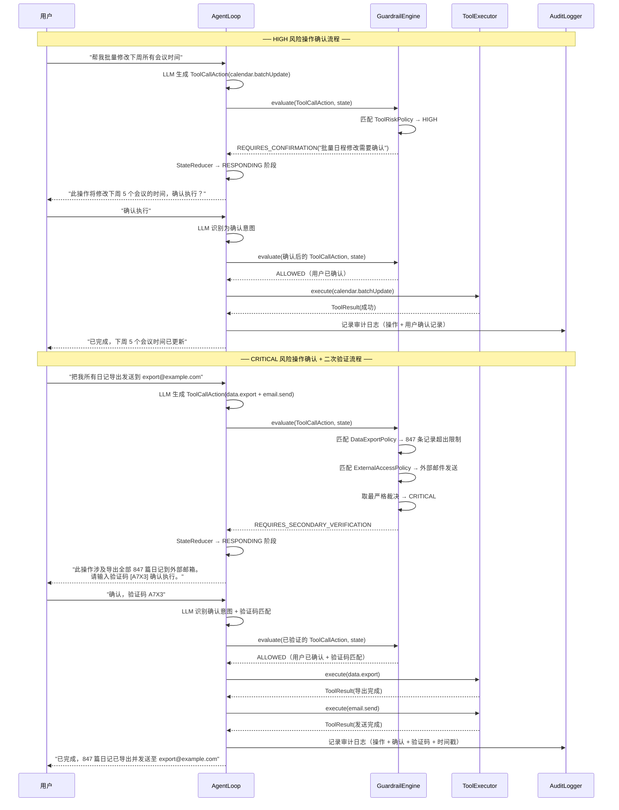

**确认流程的关键设计决策：**

- **验证码为 4 位字母数字组合**：足够短以便用户快速输入，足够随机以防止自动化绕过。验证码在生成后 5 分钟内有效，过期需重新生成。
- **确认状态存储在 AgentState.metadata 中**：用户的确认记录作为元数据附加到状态快照中，确保确认状态可追溯、可审计。
- **确认不可跨会话复用**：每次高风险操作都需要独立确认，即使用户在同一会话中已确认过类似操作。这防止了"确认疲劳"导致的安全漏洞——用户不会因为之前确认过就自动跳过后续的安全检查。
- **LLM 无法伪造确认**：确认流程完全在确定性代码中执行，LLM 无法通过生成"用户已确认"的文本来绕过护栏。验证码匹配逻辑在 `GuardrailEngine` 内部完成，不经过 LLM。


---

## 6. ToolContract — 工具调用契约

### 6.1 统一工具抽象

ZhiWei 的工具生态系统面临一个核心挑战：工具来源多样化。

- **MCP 工具**：通过 Model Context Protocol 从外部 MCP Server 动态发现和调用的工具，Schema 在运行时获取
- **YAML 声明式工具**：通过 YAML 文件声明的 HTTP API 封装，无需编写 Java 代码即可集成外部服务
- **Java 原生工具**：直接用 Java 实现的内置工具，编译时类型安全，性能最优

这三种来源的工具在调用方式、错误处理、Schema 定义上各不相同。如果 Agent 引擎需要针对每种来源编写不同的调用逻辑，代码将迅速膨胀且难以维护。

`ToolContract` 接口的设计目标是：**无论工具来自哪里，Agent 引擎都通过统一的契约与之交互**。这一抽象层确保了：

- **类型安全**：所有工具的输入输出都有 JSON Schema 约束，参数校验在调用前完成
- **一致的错误处理**：无论底层工具是 MCP 远程调用还是本地 Java 方法，错误都被统一封装为 `ToolResult`
- **透明的可观测性**：所有工具调用都经过相同的度量采集和追溯记录管线
- **统一的安全检查**：`GuardrailEngine` 通过 `ToolContract.riskLevel()` 对所有工具执行一致的风险评估

```
┌─────────────────────────────────────────────────────────────┐
│                    统一工具抽象架构                            │
│                                                             │
│                  ┌──────────────────┐                       │
│                  │   AgentLoop      │                       │
│                  │   (调用方)        │                       │
│                  └────────┬─────────┘                       │
│                           │                                 │
│                  ┌────────▼─────────┐                       │
│                  │  ToolContract    │  ← 统一契约接口         │
│                  │  (抽象层)        │                        │
│                  └────────┬─────────┘                       │
│            ┌──────────────┼──────────────┐                  │
│            ▼              ▼              ▼                   │
│  ┌─────────────┐ ┌──────────────┐ ┌─────────────┐          │
│  │ MCP 适配器   │ │ YAML 适配器   │ │ Java 原生    │          │
│  │             │ │              │ │             │          │
│  │ 远程 RPC    │ │ HTTP 模板    │ │ 直接方法调用  │          │
│  └─────────────┘ └──────────────┘ └─────────────┘          │
└─────────────────────────────────────────────────────────────┘
```

### 6.2 ToolContract 接口定义

`ToolContract` 是所有工具必须实现的核心接口。它定义了工具的元数据（名称、描述、Schema）、行为特征（风险等级、幂等性）和执行入口。无论工具的底层实现是 MCP 远程调用、YAML HTTP 模板还是 Java 原生方法，都必须通过此接口暴露给 Agent 引擎。

```java
package com.lifepilot.agent;

import java.util.Map;

/**
 * 工具调用契约接口。
 *
 * <p>定义了 Agent 引擎与工具之间的统一交互契约。所有工具——无论来源是
 * MCP Server、YAML 声明还是 Java 原生实现——都必须实现此接口。</p>
 *
 * <p>设计约束：
 * <ul>
 *   <li>元数据方法（name, description, schema 等）必须返回不可变值</li>
 *   <li>{@link #execute(Map)} 是唯一的副作用入口，其他方法均为纯查询</li>
 *   <li>实现类必须是线程安全的，因为同一工具可能被多个 Virtual Thread 并发调用</li>
 *   <li>JSON Schema 必须符合 JSON Schema Draft 2020-12 规范</li>
 * </ul>
 * </p>
 */
public interface ToolContract {

    /**
     * 工具的唯一名称。
     *
     * <p>命名规范：{@code <namespace>.<action>}，例如 {@code calendar.create}、
     * {@code knowledge.search}。名称在 {@link ToolRegistry} 中必须唯一。</p>
     *
     * @return 工具名称，不可为 null
     */
    String name();

    /**
     * 工具的中文描述，供 LLM 理解工具用途。
     *
     * <p>描述应简洁明确，包含工具的功能、适用场景和限制条件。
     * LLM 根据此描述决定是否调用该工具。</p>
     *
     * @return 工具描述文本
     */
    String description();

    /**
     * 输入参数的 JSON Schema。
     *
     * <p>定义了工具接受的参数结构、类型约束和必填字段。
     * {@link ToolExecutor} 在调用前使用此 Schema 校验输入参数，
     * 拒绝不符合约束的调用请求。</p>
     *
     * @return JSON Schema 字符串（Draft 2020-12 格式）
     */
    String inputSchema();

    /**
     * 输出结果的 JSON Schema。
     *
     * <p>定义了工具返回值的结构和类型约束。{@link ToolExecutor} 在调用后
     * 使用此 Schema 校验输出结果，确保返回值符合预期格式。</p>
     *
     * @return JSON Schema 字符串（Draft 2020-12 格式）
     */
    String outputSchema();

    /**
     * 工具的风险等级。
     *
     * <p>{@link GuardrailEngine} 根据此等级决定工具调用的处理策略：
     * LOW 自动执行、MEDIUM 审计记录、HIGH 用户确认、CRITICAL 二次验证。</p>
     *
     * @return 风险等级枚举值
     */
    RiskLevel riskLevel();

    /**
     * 工具是否幂等。
     *
     * <p>幂等工具可以安全地重试——多次调用与单次调用产生相同的效果。
     * {@link ToolExecutor} 在遇到超时或网络错误时，仅对幂等工具执行自动重试。
     * 非幂等工具（如发送邮件、创建记录）在失败时将错误回传给 LLM 决策。</p>
     *
     * @return true 表示幂等，false 表示非幂等
     */
    boolean isIdempotent();

    /**
     * 执行工具调用。
     *
     * <p>这是工具的唯一副作用入口。实现类应在此方法中完成实际的业务逻辑，
     * 并将结果封装为 {@link ToolResult} 返回。异常应被捕获并转换为
     * 失败状态的 ToolResult，而非向上抛出。</p>
     *
     * @param params 经过 JSON Schema 校验的输入参数
     * @return 工具执行结果，包含成功/失败状态和输出数据
     */
    ToolResult execute(Map<String, Object> params);
}
```

### 6.3 ToolCall 与 ToolResult 数据结构

`ToolCall` 和 `ToolResult` 是工具调用的输入输出数据载体，均使用 Java 22 的 `record` 实现不可变性。它们在 Agent 引擎的多个组件之间传递——从 LLM 输出解析、安全检查、实际执行到结果记录——因此不可变性至关重要。

```java
package com.lifepilot.agent;

import java.util.Map;
import java.util.Optional;

/**
 * 工具调用请求。
 *
 * <p>封装了一次工具调用的全部请求信息。由 LLM 输出解析器从结构化响应中提取，
 * 经过 {@link GuardrailEngine} 安全检查后传递给 {@link ToolExecutor} 执行。</p>
 *
 * @param name   工具名称，与 {@link ToolContract#name()} 对应
 * @param params 调用参数，键值对形式，将通过 JSON Schema 校验
 * @param callId 调用唯一标识，用于关联请求与响应，支持并发调用的结果匹配
 */
public record ToolCall(
        String name,
        Map<String, Object> params,
        String callId
) {
    /** 防御性拷贝，确保参数映射不可变。 */
    public ToolCall {
        params = Map.copyOf(params);
    }

    /** 判断此调用是否涉及外部网络访问。 */
    public boolean hasExternalAccess() {
        return params.containsKey("url") || params.containsKey("endpoint")
                || params.containsKey("email");
    }

    /** 判断此调用是否为数据导出操作。 */
    public boolean isDataExport() {
        return name.contains("export") || name.contains("backup");
    }

    /** 从参数中提取目标域名（用于外部访问策略检查）。 */
    public Optional<String> extractDomain() {
        var url = (String) params.getOrDefault("url",
                params.getOrDefault("endpoint", ""));
        if (url.isEmpty()) return Optional.empty();
        try {
            return Optional.of(java.net.URI.create(url).getHost());
        } catch (Exception e) {
            return Optional.empty();
        }
    }

    /** 估算数据导出的记录数（用于数据导出策略检查）。 */
    public int estimateRecordCount() {
        return (int) params.getOrDefault("recordCount",
                params.getOrDefault("limit", 0));
    }
}
```

```java
package com.lifepilot.agent;

import java.time.Instant;
import java.util.Optional;

/**
 * 工具执行结果。
 *
 * <p>封装了一次工具调用的完整执行结果，包括成功/失败状态、输出数据、
 * 错误信息和执行耗时。由 {@link ToolExecutor} 生成，传递给
 * {@link StateReducer} 进行状态转换，并由 {@link TraceRecorder} 记录。</p>
 *
 * @param callId     调用标识，与 {@link ToolCall#callId()} 对应
 * @param toolName   工具名称
 * @param status     执行状态：SUCCESS / FAILURE / TIMEOUT / VALIDATION_ERROR
 * @param output     成功时的输出数据（JSON 字符串）
 * @param error      失败时的错误描述
 * @param durationMs 执行耗时（毫秒）
 * @param executedAt 执行时间戳
 */
public record ToolResult(
        String callId,
        String toolName,
        Status status,
        String output,
        Optional<String> error,
        long durationMs,
        Instant executedAt
) {
    /** 工具执行状态枚举。 */
    public enum Status {
        /** 执行成功，输出数据有效。 */
        SUCCESS,
        /** 执行失败，错误信息在 error 字段中。 */
        FAILURE,
        /** 执行超时，工具未在规定时间内返回。 */
        TIMEOUT,
        /** 输入参数校验失败，工具未被实际调用。 */
        VALIDATION_ERROR
    }

    /** 判断执行是否成功。 */
    public boolean isSuccess() {
        return status == Status.SUCCESS;
    }

    /** 判断是否可以安全重试（超时或临时性失败）。 */
    public boolean isRetryable() {
        return status == Status.TIMEOUT || status == Status.FAILURE;
    }

    /** 创建成功结果。 */
    public static ToolResult success(String callId, String toolName, String output, long durationMs) {
        return new ToolResult(callId, toolName, Status.SUCCESS, output,
                Optional.empty(), durationMs, Instant.now());
    }

    /** 创建失败结果。 */
    public static ToolResult failure(String callId, String toolName, String errorMessage, long durationMs) {
        return new ToolResult(callId, toolName, Status.FAILURE, "",
                Optional.of(errorMessage), durationMs, Instant.now());
    }

    /** 创建超时结果。 */
    public static ToolResult timeout(String callId, String toolName, long durationMs) {
        return new ToolResult(callId, toolName, Status.TIMEOUT, "",
                Optional.of("工具执行超时: " + durationMs + "ms"), durationMs, Instant.now());
    }

    /** 创建校验错误结果。 */
    public static ToolResult validationError(String callId, String toolName, String reason) {
        return new ToolResult(callId, toolName, Status.VALIDATION_ERROR, "",
                Optional.of("参数校验失败: " + reason), 0, Instant.now());
    }

    /** 创建通用错误结果（用于异常场景的快捷方法）。 */
    public static ToolResult error(String errorMessage) {
        return new ToolResult("unknown", "unknown", Status.FAILURE, "",
                Optional.of(errorMessage), 0, Instant.now());
    }
}
```

### 6.4 ToolExecutor — 工具执行器

`ToolExecutor` 是工具调用的执行网关，负责在 `ToolContract` 之上叠加输入校验、输出校验、超时控制、重试逻辑和度量采集。Agent 引擎中的所有工具调用都必须通过 `ToolExecutor` 执行，禁止直接调用 `ToolContract.execute()`。

执行流水线如下：

```
ToolCall
  │
  ▼
┌──────────────────┐
│ 1. 查找工具       │  ← ToolRegistry.resolve(name)
├──────────────────┤
│ 2. 输入校验       │  ← JSON Schema 校验参数合法性
├──────────────────┤
│ 3. 安全检查       │  ← GuardrailEngine.evaluate()（已在 AgentLoop 中完成）
├──────────────────┤
│ 4. 执行工具       │  ← ToolContract.execute(params)，带超时控制
├──────────────────┤
│ 5. 输出校验       │  ← JSON Schema 校验返回值格式
├──────────────────┤
│ 6. 度量记录       │  ← 耗时、成功率、错误类型
└──────────────────┘
  │
  ▼
ToolResult
```

```java
package com.lifepilot.agent;

import org.slf4j.Logger;
import org.slf4j.LoggerFactory;
import org.springframework.stereotype.Component;

import java.time.Duration;
import java.util.Map;
import java.util.concurrent.CompletableFuture;
import java.util.concurrent.TimeUnit;
import java.util.concurrent.TimeoutException;

/**
 * 工具执行器。
 *
 * <p>Agent 引擎中所有工具调用的唯一执行网关。在 {@link ToolContract} 之上
 * 叠加输入校验、输出校验、超时控制、重试逻辑和度量采集。</p>
 *
 * <p>设计保证：
 * <ul>
 *   <li>所有工具调用必须通过此类执行，禁止直接调用 {@link ToolContract#execute(Map)}</li>
 *   <li>输入参数在调用前经过 JSON Schema 校验，拒绝不合法的参数</li>
 *   <li>输出结果在返回前经过 JSON Schema 校验，确保格式一致性</li>
 *   <li>超时和异常被统一封装为 {@link ToolResult}，不向上抛出</li>
 *   <li>仅对幂等工具执行自动重试，非幂等工具的失败直接回传 LLM</li>
 * </ul>
 * </p>
 *
 * <p>线程模型：每次工具调用在独立的 Virtual Thread 中执行，
 * 通过 {@link CompletableFuture} 实现超时控制。</p>
 */
@Component
public class ToolExecutor {

    private static final Logger log = LoggerFactory.getLogger(ToolExecutor.class);

    /** 工具调用的默认超时时间。 */
    private static final Duration DEFAULT_TIMEOUT = Duration.ofSeconds(30);

    /** 重试策略：指数退避初始间隔（毫秒）。 */
    private static final long RETRY_INITIAL_DELAY_MS = 500;

    /** 重试策略：退避倍数。 */
    private static final double RETRY_MULTIPLIER = 2.0;

    /** 重试策略：最大退避间隔（毫秒）。 */
    private static final long RETRY_MAX_DELAY_MS = 5000;

    /** 重试策略：最大重试次数。 */
    private static final int MAX_RETRIES = 2;

    private final ToolRegistry toolRegistry;
    private final JsonSchemaValidator schemaValidator;
    private final ToolMetricsRecorder metricsRecorder;

    public ToolExecutor(
            ToolRegistry toolRegistry,
            JsonSchemaValidator schemaValidator,
            ToolMetricsRecorder metricsRecorder
    ) {
        this.toolRegistry = toolRegistry;
        this.schemaValidator = schemaValidator;
        this.metricsRecorder = metricsRecorder;
    }

    /**
     * 执行工具调用。
     *
     * <p>完整执行流水线：查找工具 → 输入校验 → 执行（带超时）→ 输出校验 → 度量记录。
     * 幂等工具在超时或临时性失败时自动重试（指数退避，最多 2 次）。</p>
     *
     * @param call 工具调用请求
     * @return 工具执行结果，永远不会抛出异常
     */
    public ToolResult execute(ToolCall call) {
        log.debug("开始执行工具: name={}, callId={}", call.name(), call.callId());
        long startTime = System.currentTimeMillis();

        try {
            // 1. 从注册表查找工具
            var contract = toolRegistry.resolve(call.name())
                    .orElseThrow(() -> new ToolNotFoundException(
                            "工具未找到: " + call.name()));

            // 2. 输入参数校验
            var inputValidation = validateInput(call, contract);
            if (!inputValidation.isValid()) {
                log.warn("工具输入校验失败: tool={}, reason={}", call.name(), inputValidation.reason());
                return ToolResult.validationError(call.callId(), call.name(), inputValidation.reason());
            }

            // 3. 执行工具（带超时和重试）
            var result = executeWithRetry(call, contract);

            // 4. 输出校验（仅对成功结果校验）
            if (result.isSuccess()) {
                var outputValidation = validateOutput(result, contract);
                if (!outputValidation.isValid()) {
                    log.warn("工具输出校验失败: tool={}, reason={}", call.name(), outputValidation.reason());
                    // 输出校验失败不阻断，记录警告并标记
                    metricsRecorder.recordOutputValidationFailure(call.name());
                }
            }

            // 5. 记录度量
            long duration = System.currentTimeMillis() - startTime;
            metricsRecorder.recordExecution(call.name(), result.status(), duration);
            log.info("工具执行完成: name={}, status={}, duration={}ms",
                    call.name(), result.status(), duration);

            return result;

        } catch (ToolNotFoundException e) {
            log.error("工具查找失败: {}", e.getMessage());
            long duration = System.currentTimeMillis() - startTime;
            return ToolResult.failure(call.callId(), call.name(), e.getMessage(), duration);
        } catch (Exception e) {
            log.error("工具执行异常: name={}, error={}", call.name(), e.getMessage(), e);
            long duration = System.currentTimeMillis() - startTime;
            return ToolResult.failure(call.callId(), call.name(),
                    "工具执行异常: " + e.getMessage(), duration);
        }
    }

    /**
     * 带重试的工具执行。
     *
     * <p>仅对幂等工具执行自动重试。重试策略为指数退避：
     * 初始 500ms，倍数 2.0，上限 5s，最多 2 次。
     * 非幂等工具在首次失败后直接返回错误结果。</p>
     */
    private ToolResult executeWithRetry(ToolCall call, ToolContract contract) {
        int attempts = 0;
        long delay = RETRY_INITIAL_DELAY_MS;
        ToolResult lastResult = null;

        int maxAttempts = contract.isIdempotent() ? MAX_RETRIES + 1 : 1;

        while (attempts < maxAttempts) {
            if (attempts > 0) {
                log.debug("工具重试: name={}, attempt={}, delay={}ms", call.name(), attempts, delay);
                sleep(delay);
                delay = Math.min((long) (delay * RETRY_MULTIPLIER), RETRY_MAX_DELAY_MS);
            }

            lastResult = executeWithTimeout(call, contract);

            if (lastResult.isSuccess() || !lastResult.isRetryable()) {
                return lastResult;
            }

            attempts++;
        }

        log.warn("工具重试耗尽: name={}, attempts={}", call.name(), attempts);
        return lastResult;
    }

    /**
     * 带超时控制的工具执行。
     *
     * <p>通过 {@link CompletableFuture} 在 Virtual Thread 中执行工具调用，
     * 并设置超时限制。超时后返回 TIMEOUT 状态的 ToolResult。</p>
     */
    private ToolResult executeWithTimeout(ToolCall call, ToolContract contract) {
        long startTime = System.currentTimeMillis();
        try {
            var future = CompletableFuture.supplyAsync(
                    () -> contract.execute(call.params()),
                    Thread.ofVirtual().factory()::newThread
            );
            return future.get(DEFAULT_TIMEOUT.toMillis(), TimeUnit.MILLISECONDS);
        } catch (TimeoutException e) {
            long duration = System.currentTimeMillis() - startTime;
            log.warn("工具执行超时: name={}, timeout={}ms", call.name(), DEFAULT_TIMEOUT.toMillis());
            return ToolResult.timeout(call.callId(), call.name(), duration);
        } catch (Exception e) {
            long duration = System.currentTimeMillis() - startTime;
            return ToolResult.failure(call.callId(), call.name(),
                    "工具执行失败: " + e.getMessage(), duration);
        }
    }

    /**
     * 校验工具调用的输入参数。
     *
     * <p>使用工具的 {@link ToolContract#inputSchema()} 对参数进行 JSON Schema 校验，
     * 确保参数类型、必填字段、值范围等约束均满足。</p>
     *
     * @param call     工具调用请求
     * @param contract 工具契约（包含输入 Schema）
     * @return 校验结果
     */
    private ValidationResult validateInput(ToolCall call, ToolContract contract) {
        return schemaValidator.validate(call.params(), contract.inputSchema());
    }

    /**
     * 校验工具执行的输出结果。
     *
     * <p>使用工具的 {@link ToolContract#outputSchema()} 对返回值进行 JSON Schema 校验，
     * 确保输出格式符合预期。输出校验失败不阻断流程，仅记录警告。</p>
     *
     * @param result   工具执行结果
     * @param contract 工具契约（包含输出 Schema）
     * @return 校验结果
     */
    private ValidationResult validateOutput(ToolResult result, ToolContract contract) {
        return schemaValidator.validate(result.output(), contract.outputSchema());
    }

    /** 线程安全的休眠方法，用于重试间隔。 */
    private void sleep(long millis) {
        try {
            Thread.sleep(millis);
        } catch (InterruptedException e) {
            Thread.currentThread().interrupt();
            log.debug("重试休眠被中断");
        }
    }
}
```

`ValidationResult` 是校验结果的数据载体：

```java
package com.lifepilot.agent;

/**
 * JSON Schema 校验结果。
 *
 * @param isValid 校验是否通过
 * @param reason  校验失败时的原因描述（通过时为空字符串）
 */
public record ValidationResult(boolean isValid, String reason) {

    /** 创建校验通过的结果。 */
    public static ValidationResult valid() {
        return new ValidationResult(true, "");
    }

    /** 创建校验失败的结果。 */
    public static ValidationResult invalid(String reason) {
        return new ValidationResult(false, reason);
    }
}
```

### 6.5 工具注册表（ToolRegistry）

`ToolRegistry` 是工具生态系统的中枢，负责将来自三种不同来源（MCP、YAML、Java 原生）的工具聚合到一个统一的注册表中。Agent 引擎通过 `ToolRegistry` 发现和查找工具，无需关心工具的底层来源。

注册表使用 `ConcurrentHashMap` 实现，支持运行时动态注册和注销工具（例如 MCP Server 上线/下线时自动更新工具列表），同时保证并发安全。

```java
package com.lifepilot.agent;

import org.slf4j.Logger;
import org.slf4j.LoggerFactory;
import org.springframework.stereotype.Component;

import java.util.List;
import java.util.Map;
import java.util.Optional;
import java.util.concurrent.ConcurrentHashMap;
import java.util.stream.Collectors;

/**
 * 统一工具注册表。
 *
 * <p>聚合来自 MCP Server、YAML 声明和 Java 原生实现的所有工具，
 * 提供统一的查找、列举和 Schema 导出能力。</p>
 *
 * <p>设计要点：
 * <ul>
 *   <li>使用 {@link ConcurrentHashMap} 存储，支持运行时动态注册/注销</li>
 *   <li>工具名称全局唯一，重复注册将覆盖旧工具并记录警告</li>
 *   <li>提供按来源、按类别、按风险等级的多维度查询</li>
 *   <li>Schema 导出用于 {@link ContextAssembler} 的工具上下文组装</li>
 * </ul>
 * </p>
 *
 * <p>线程安全：所有公开方法均为线程安全，支持并发读写。</p>
 */
@Component
public class ToolRegistry {

    private static final Logger log = LoggerFactory.getLogger(ToolRegistry.class);

    /** 工具存储：名称 → 工具契约。 */
    private final ConcurrentHashMap<String, ToolContract> tools = new ConcurrentHashMap<>();

    /** 工具来源记录：名称 → 来源类型。 */
    private final ConcurrentHashMap<String, ToolSource> sources = new ConcurrentHashMap<>();

    /** 工具来源枚举。 */
    public enum ToolSource {
        /** MCP Server 远程工具。 */
        MCP,
        /** YAML 声明式 HTTP 工具。 */
        YAML,
        /** Java 原生实现工具。 */
        NATIVE
    }

    /**
     * 注册工具。
     *
     * <p>将工具添加到注册表中。如果同名工具已存在，将覆盖旧工具并记录警告日志。
     * 注册成功后记录 INFO 日志，包含工具名称、来源和风险等级。</p>
     *
     * @param contract 工具契约实例
     * @param source   工具来源类型
     */
    public void register(ToolContract contract, ToolSource source) {
        var existing = tools.put(contract.name(), contract);
        sources.put(contract.name(), source);

        if (existing != null) {
            log.warn("工具覆盖注册: name={}, source={}", contract.name(), source);
        } else {
            log.info("工具注册成功: name={}, source={}, riskLevel={}",
                    contract.name(), source, contract.riskLevel());
        }
    }

    /**
     * 注销工具。
     *
     * @param name 工具名称
     * @return 被注销的工具契约，如果工具不存在则返回 empty
     */
    public Optional<ToolContract> unregister(String name) {
        sources.remove(name);
        var removed = tools.remove(name);
        if (removed != null) {
            log.info("工具注销成功: name={}", name);
        }
        return Optional.ofNullable(removed);
    }

    /**
     * 按名称查找工具。
     *
     * @param name 工具名称
     * @return 工具契约，如果不存在则返回 empty
     */
    public Optional<ToolContract> resolve(String name) {
        return Optional.ofNullable(tools.get(name));
    }

    /**
     * 获取所有已注册工具的 Schema 列表。
     *
     * <p>用于 {@link ContextAssembler} 组装工具上下文。返回的列表是当前注册表
     * 的快照，后续的注册/注销操作不会影响已返回的列表。</p>
     *
     * @return 不可变的工具 Schema 列表
     */
    public List<ToolSchema> getAllSchemas() {
        return tools.values().stream()
                .map(contract -> new ToolSchema(
                        contract.name(),
                        contract.description(),
                        contract.inputSchema(),
                        contract.outputSchema(),
                        contract.riskLevel(),
                        inferCategory(contract.name()),
                        inferPriority(contract.riskLevel())
                ))
                .toList();
    }

    /**
     * 按来源类型列举工具。
     *
     * @param source 工具来源类型
     * @return 指定来源的工具名称列表
     */
    public List<String> listBySource(ToolSource source) {
        return sources.entrySet().stream()
                .filter(entry -> entry.getValue() == source)
                .map(Map.Entry::getKey)
                .toList();
    }

    /**
     * 按风险等级列举工具。
     *
     * @param level 风险等级
     * @return 指定风险等级的工具名称列表
     */
    public List<String> listByRiskLevel(RiskLevel level) {
        return tools.entrySet().stream()
                .filter(entry -> entry.getValue().riskLevel() == level)
                .map(Map.Entry::getKey)
                .toList();
    }

    /** 获取注册表统计信息。 */
    public RegistryStats stats() {
        var bySource = sources.values().stream()
                .collect(Collectors.groupingBy(s -> s, Collectors.counting()));
        var byRisk = tools.values().stream()
                .collect(Collectors.groupingBy(ToolContract::riskLevel, Collectors.counting()));
        return new RegistryStats(tools.size(), bySource, byRisk);
    }

    /** 从工具名称推断工具类别（基于命名空间前缀）。 */
    private ToolCategory inferCategory(String toolName) {
        if (toolName.startsWith("knowledge.") || toolName.startsWith("search.")) {
            return ToolCategory.KNOWLEDGE;
        }
        if (toolName.startsWith("calendar.") || toolName.startsWith("reminder.")) {
            return ToolCategory.PRODUCTIVITY;
        }
        if (toolName.startsWith("data.") || toolName.startsWith("export.")) {
            return ToolCategory.DATA;
        }
        if (toolName.startsWith("validate.") || toolName.startsWith("check.")) {
            return ToolCategory.VALIDATION;
        }
        return ToolCategory.GENERAL;
    }

    /** 根据风险等级推断工具优先级（低风险工具优先展示给 LLM）。 */
    private int inferPriority(RiskLevel level) {
        return switch (level) {
            case LOW -> 100;
            case MEDIUM -> 75;
            case HIGH -> 50;
            case CRITICAL -> 25;
        };
    }

    /**
     * 注册表统计信息。
     *
     * @param totalTools  已注册工具总数
     * @param bySource    按来源分组的工具数量
     * @param byRiskLevel 按风险等级分组的工具数量
     */
    public record RegistryStats(
            int totalTools,
            Map<ToolSource, Long> bySource,
            Map<RiskLevel, Long> byRiskLevel
    ) {}
}
```

`ToolSchema` 是工具元数据的轻量级投影，用于 `ContextAssembler` 的上下文组装，避免将完整的 `ToolContract` 实例暴露给上下文层：

```java
package com.lifepilot.agent;

/**
 * 工具 Schema 投影。
 *
 * <p>从 {@link ToolContract} 提取的轻量级元数据，用于 {@link ContextAssembler}
 * 组装工具上下文。不包含执行逻辑，仅携带 LLM 理解工具所需的描述信息。</p>
 *
 * @param name         工具名称
 * @param description  工具描述（中文）
 * @param inputSchema  输入参数 JSON Schema
 * @param outputSchema 输出结果 JSON Schema
 * @param riskLevel    风险等级
 * @param category     工具类别（从名称推断）
 * @param priority     展示优先级（低风险工具优先）
 */
public record ToolSchema(
        String name,
        String description,
        String inputSchema,
        String outputSchema,
        RiskLevel riskLevel,
        ToolCategory category,
        int priority
) {
    /** 将 Schema 序列化为 JSON 格式（供 Token 计数和上下文注入使用）。 */
    public String toJsonSchema() {
        return """
                {"name":"%s","description":"%s","parameters":%s,"returns":%s}
                """.formatted(name, description, inputSchema, outputSchema).strip();
    }
}
```

`ToolCategory` 枚举定义了工具的功能类别，用于 `ContextAssembler` 按阶段过滤相关工具：

```java
package com.lifepilot.agent;

/**
 * 工具功能类别枚举。
 *
 * <p>用于 {@link ContextAssembler} 按 Agent 阶段过滤相关工具。
 * 例如 UNDERSTANDING 阶段仅需要 KNOWLEDGE 和 SEARCH 类别的工具。</p>
 */
public enum ToolCategory {

    /** 知识管理类：知识图谱查询、笔记检索、记忆搜索。 */
    KNOWLEDGE("知识管理"),

    /** 搜索类：全文搜索、语义搜索、外部搜索引擎。 */
    SEARCH("搜索"),

    /** 生产力类：日历、提醒、任务管理、习惯追踪。 */
    PRODUCTIVITY("生产力"),

    /** 数据类：数据导出、备份、统计分析。 */
    DATA("数据"),

    /** 验证类：数据校验、格式检查、一致性验证。 */
    VALIDATION("验证"),

    /** 通用类：不属于以上类别的工具。 */
    GENERAL("通用");

    private final String label;

    ToolCategory(String label) {
        this.label = label;
    }

    /** 获取类别的中文标签。 */
    public String label() { return label; }
}
```

以下流程图展示了三种工具来源如何在应用启动和运行时汇聚到统一的 `ToolRegistry`：

```mermaid
flowchart TD
    subgraph 启动阶段
        A1[Java 原生工具] -->|@Component 自动扫描| R[ToolRegistry]
        A2[YAML 工具定义] -->|YamlToolLoader 解析| R
    end

    subgraph 运行时
        A3[MCP Server] -->|McpToolDiscovery 动态发现| R
        A3 -->|Server 下线时| U[unregister]
        U --> R
    end

    R --> TE[ToolExecutor]
    R --> CA[ContextAssembler]
    R --> GE[GuardrailEngine]

    TE -->|执行工具| TC[ToolContract]
    CA -->|获取 Schema| TS[ToolSchema]
    GE -->|查询风险等级| RL[RiskLevel]

    style R fill:#e1f5fe
    style TE fill:#e8f5e9
    style CA fill:#fff3e0
    style GE fill:#ffebee
```

**三种来源的注册时机和特点：**

| 来源 | 注册时机 | 动态性 | Schema 来源 | 典型工具 |
|:-----|:---------|:-------|:------------|:---------|
| Java 原生 | 应用启动时，Spring `@Component` 自动扫描 | 静态 | 编译时确定，类型安全 | `knowledge.search`、`calendar.create` |
| YAML 声明 | 应用启动时，`YamlToolLoader` 解析 `tools/*.yaml` | 静态（热重载可选） | YAML 文件中声明 | 第三方 HTTP API 封装 |
| MCP Server | 运行时，`McpToolDiscovery` 通过 MCP 协议动态发现 | 动态（Server 上下线） | MCP Server 运行时提供 | 外部 MCP 兼容工具 |

这一架构确保了 Agent 引擎的工具生态系统既有编译时类型安全的内置工具，又有运行时动态扩展的外部工具，同时所有工具都通过统一的 `ToolContract` 契约与引擎交互，享受一致的安全检查、度量采集和错误处理。


---

## 7. TraceRecorder — 决策追溯

### 7.1 设计理念：每个决策都可回放

在传统软件系统中，日志是可选的辅助设施——有了更好，没有也能运行。但在 Agent 引擎中，**追溯记录是核心架构组件，而非可选的日志功能**。

原因在于 Agent 的行为本质上是**不可预测的**。LLM 的概率性输出意味着同样的用户输入可能触发不同的执行路径。当用户问"为什么 Agent 这样做了？"时，我们必须能够给出精确的、基于事实的回答——而不是猜测。

`TraceRecorder` 记录 Agent 执行过程中的每一个关键事件：每次 LLM 调用的输入输出、每次工具执行的参数和结果、每次状态转换的前后阶段、每次安全护栏的评估结论。这些事件构成一条完整的**决策轨迹（Decision Trace）**，支撑四个核心能力：

**能力一：生产问题的事后调试**

当用户报告"Agent 给了我错误的建议"时，开发者可以通过 `sessionId` 加载完整的决策轨迹，逐步回放 Agent 的推理过程，精确定位问题发生在哪个步骤、哪个组件。这比传统的日志搜索高效一个数量级。

**能力二：用户可见的决策解释**

用户有权知道 Agent 为什么做出某个决定。通过将 TraceEvent 转换为用户友好的自然语言描述，系统可以提供透明的决策解释：

```
用户: 为什么你建议我把会议改到周四？

Agent: 我的推理过程如下：
  1. 我查询了你的日历，发现周三 14:00-17:00 已有 3 个会议
  2. 我评估了你的精力模型，周三下午的认知负荷已达 85%
  3. 我检查了周四的空闲时段，发现 10:00-12:00 完全空闲
  4. 综合以上信息，我建议将会议移至周四上午
```

**能力三：轨迹评估与质量改进**

通过批量分析历史轨迹，可以识别 Agent 的系统性问题：哪些类型的任务失败率高？哪些工具调用经常超时？LLM 在哪些阶段容易产生低质量输出？这些洞察驱动持续的质量改进。

**能力四：合规审计**

在涉及敏感数据操作的场景中，完整的决策轨迹提供了不可篡改的审计证据：谁在什么时间请求了什么操作，Agent 做了哪些安全检查，最终执行了什么动作。

### 7.2 TraceEvent 数据模型

`TraceEvent` 使用 Java 22 的 `sealed interface` 定义了所有可能的追溯事件类型。每个变体都是一个不可变的 `record`，携带该事件的完整上下文信息。`sealed` 关键字确保事件类型的穷举处理——在序列化、统计分析、回放等场景中，编译器会强制要求处理所有变体。

```java
package com.lifepilot.agent.trace;

import com.lifepilot.agent.AgentPhase;

import java.time.Instant;
import java.util.Map;
import java.util.UUID;

/**
 * 追溯事件密封接口。
 *
 * <p>定义了 Agent 决策轨迹中所有合法的事件类型。每个事件代表 Agent 执行过程中
 * 的一个关键节点，携带该节点的完整上下文信息。</p>
 *
 * <p>所有变体共享以下公共字段（通过接口默认方法或约定）：
 * <ul>
 *   <li>{@code eventId} — 事件唯一标识</li>
 *   <li>{@code sessionId} — 所属会话标识</li>
 *   <li>{@code timestamp} — 事件发生时间</li>
 *   <li>{@code stepCount} — 事件发生时的步数</li>
 * </ul>
 * </p>
 */
public sealed interface TraceEvent permits
        TraceEvent.LlmCallEvent,
        TraceEvent.ToolExecutionEvent,
        TraceEvent.StateTransitionEvent,
        TraceEvent.GuardrailEvent,
        TraceEvent.SessionStartEvent,
        TraceEvent.SessionEndEvent {

    /**
     * LLM 调用事件。
     *
     * <p>记录每次 LLM 调用的完整信息，包括输入提示、输出响应、Token 消耗和耗时。
     * 这是成本分析和质量评估的核心数据源。</p>
     *
     * @param eventId    事件唯一标识
     * @param sessionId  所属会话标识
     * @param timestamp  事件发生时间
     * @param stepCount  事件发生时的步数
     * @param phase      调用时所处的 Agent 阶段
     * @param prompt     发送给 LLM 的完整提示（系统提示 + 用户提示）
     * @param response   LLM 返回的原始响应文本
     * @param tokenUsage Token 消耗明细（输入 Token、输出 Token、总计）
     * @param durationMs 调用耗时（毫秒）
     * @param modelId    使用的模型标识（如 "gpt-4o"、"claude-3.5-sonnet"）
     */
    record LlmCallEvent(
            UUID eventId,
            UUID sessionId,
            Instant timestamp,
            int stepCount,
            AgentPhase phase,
            String prompt,
            String response,
            TokenUsage tokenUsage,
            long durationMs,
            String modelId
    ) implements TraceEvent {}

    /**
     * 工具执行事件。
     *
     * <p>记录每次工具调用的参数、结果和耗时。用于工具性能分析、
     * 错误排查和调用频率统计。</p>
     *
     * @param eventId    事件唯一标识
     * @param sessionId  所属会话标识
     * @param timestamp  事件发生时间
     * @param stepCount  事件发生时的步数
     * @param toolName   工具名称（如 "calendar.create"、"knowledge.search"）
     * @param params     工具调用参数（JSON 结构）
     * @param result     工具执行结果（成功时为返回数据，失败时为错误信息）
     * @param durationMs 执行耗时（毫秒）
     */
    record ToolExecutionEvent(
            UUID eventId,
            UUID sessionId,
            Instant timestamp,
            int stepCount,
            String toolName,
            Map<String, Object> params,
            String result,
            long durationMs
    ) implements TraceEvent {}

    /**
     * 状态转换事件。
     *
     * <p>记录每次 Agent 阶段转换的前后状态和触发动作。
     * 这是状态机回放和异常转换检测的核心数据。</p>
     *
     * @param eventId    事件唯一标识
     * @param sessionId  所属会话标识
     * @param timestamp  事件发生时间
     * @param stepCount  事件发生时的步数
     * @param fromPhase  转换前的阶段
     * @param toPhase    转换后的阶段
     * @param action     触发转换的动作类型名称
     */
    record StateTransitionEvent(
            UUID eventId,
            UUID sessionId,
            Instant timestamp,
            int stepCount,
            AgentPhase fromPhase,
            AgentPhase toPhase,
            String action
    ) implements TraceEvent {}

    /**
     * 安全护栏评估事件。
     *
     * <p>记录每次安全护栏对 Agent 动作的评估结果。无论评估结果是通过还是拦截，
     * 都会生成此事件，确保安全决策的完整可审计性。</p>
     *
     * @param eventId    事件唯一标识
     * @param sessionId  所属会话标识
     * @param timestamp  事件发生时间
     * @param stepCount  事件发生时的步数
     * @param action     被评估的动作描述
     * @param result     评估结果（ALLOWED / BLOCKED）
     * @param policyName 触发评估的策略名称（如 "data-export-policy"）
     */
    record GuardrailEvent(
            UUID eventId,
            UUID sessionId,
            Instant timestamp,
            int stepCount,
            String action,
            String result,
            String policyName
    ) implements TraceEvent {}

    /**
     * 会话启动事件。
     *
     * <p>标记一次 Agent 执行的起点。记录用户原始输入和分配的资源预算，
     * 作为整条轨迹的锚点。</p>
     *
     * @param eventId   事件唯一标识
     * @param sessionId 会话标识
     * @param timestamp 会话启动时间
     * @param userInput 用户原始输入文本
     * @param budget    分配的资源预算快照
     */
    record SessionStartEvent(
            UUID eventId,
            UUID sessionId,
            Instant timestamp,
            String userInput,
            BudgetSnapshot budget
    ) implements TraceEvent {}

    /**
     * 会话结束事件。
     *
     * <p>标记一次 Agent 执行的终点。汇总整个会话的资源消耗和执行结果，
     * 用于成本统计和性能分析。</p>
     *
     * @param eventId         事件唯一标识
     * @param sessionId       会话标识
     * @param timestamp       会话结束时间
     * @param finalPhase      终止时的阶段（正常为 TERMINATED）
     * @param totalSteps      总执行步数
     * @param totalTokens     总 Token 消耗
     * @param totalDurationMs 总耗时（毫秒）
     */
    record SessionEndEvent(
            UUID eventId,
            UUID sessionId,
            Instant timestamp,
            AgentPhase finalPhase,
            int totalSteps,
            int totalTokens,
            long totalDurationMs
    ) implements TraceEvent {}
}
```

辅助数据结构 `TokenUsage` 和 `BudgetSnapshot` 用于在事件中携带结构化的度量信息：

```java
/**
 * Token 消耗明细。
 *
 * @param inputTokens  输入 Token 数量（提示部分）
 * @param outputTokens 输出 Token 数量（响应部分）
 */
public record TokenUsage(int inputTokens, int outputTokens) {

    /** 总 Token 消耗。 */
    public int total() {
        return inputTokens + outputTokens;
    }
}

/**
 * 预算快照，用于在 TraceEvent 中记录某一时刻的预算状态。
 *
 * @param maxSteps       最大步数
 * @param remainingSteps 剩余步数
 * @param maxTokens      最大 Token 数
 * @param remainingTokens 剩余 Token 数
 */
public record BudgetSnapshot(
        int maxSteps, int remainingSteps,
        int maxTokens, int remainingTokens
) {
    /** 从 Budget 实例创建快照。 */
    public static BudgetSnapshot from(Budget budget) {
        return new BudgetSnapshot(
                budget.maxSteps(), budget.remainingSteps(),
                budget.maxTokens(), budget.remainingTokens()
        );
    }
}
```

### 7.3 TraceRecorder 核心实现

`TraceRecorder` 是决策轨迹的写入端。它在 Agent 循环的每个关键节点被调用，将事件写入内存缓冲区，并通过 Virtual Thread 异步刷写到 SQLite 持久化存储。这一设计确保追溯记录不会阻塞 Agent 的主执行路径。

```java
package com.lifepilot.agent.trace;

import com.lifepilot.agent.AgentAction;
import com.lifepilot.agent.AgentState;
import com.lifepilot.agent.Budget;
import com.lifepilot.agent.ToolResult;
import org.slf4j.Logger;
import org.slf4j.LoggerFactory;
import org.springframework.stereotype.Component;

import java.time.Instant;
import java.util.List;
import java.util.UUID;
import java.util.concurrent.ConcurrentHashMap;
import java.util.concurrent.CopyOnWriteArrayList;

/**
 * 决策轨迹记录器。
 *
 * <p>核心职责：
 * <ul>
 *   <li>在 Agent 循环的每个关键节点记录结构化事件</li>
 *   <li>维护内存缓冲区，支持实时查询当前会话的轨迹</li>
 *   <li>通过 Virtual Thread 异步将事件刷写到 SQLite</li>
 *   <li>提供按 sessionId 查询完整轨迹的能力</li>
 * </ul>
 * </p>
 *
 * <p>线程安全：使用 {@link ConcurrentHashMap} 和 {@link CopyOnWriteArrayList}
 * 确保多线程环境下的安全访问。</p>
 */
@Component
public class TraceRecorder {

    private static final Logger log = LoggerFactory.getLogger(TraceRecorder.class);

    /** 内存缓冲区：sessionId → 事件列表。 */
    private final ConcurrentHashMap<UUID, CopyOnWriteArrayList<TraceEvent>> buffer =
            new ConcurrentHashMap<>();

    private final TraceEventRepository repository;

    public TraceRecorder(TraceEventRepository repository) {
        this.repository = repository;
    }

    /**
     * 记录会话启动事件。
     *
     * <p>在 Agent 循环开始时调用，记录用户输入和初始预算。</p>
     *
     * @param state     初始状态
     * @param userInput 用户原始输入
     */
    public void recordStart(AgentState state, String userInput) {
        var event = new TraceEvent.SessionStartEvent(
                UUID.randomUUID(),
                state.sessionId(),
                Instant.now(),
                userInput,
                BudgetSnapshot.from(state.budget())
        );
        appendAndFlush(state.sessionId(), event);
        log.info("轨迹记录启动: sessionId={}", state.sessionId());
    }

    /**
     * 记录 LLM 调用输出。
     *
     * <p>在每次 LLM 调用返回后调用，记录提示、响应、Token 消耗和耗时。</p>
     *
     * @param state  当前状态
     * @param action LLM 返回的结构化动作
     */
    public void recordLlmOutput(AgentState state, AgentAction action) {
        var event = new TraceEvent.LlmCallEvent(
                UUID.randomUUID(),
                state.sessionId(),
                Instant.now(),
                state.stepCount(),
                state.phase(),
                /* prompt 由 ContextAssembler 提供，此处简化 */ "",
                action.toString(),
                new TokenUsage(0, 0), // 实际由 LLM 响应元数据填充
                0L,
                "default"
        );
        appendAndFlush(state.sessionId(), event);
    }

    /**
     * 记录工具执行结果。
     *
     * @param state  当前状态
     * @param result 工具执行结果
     */
    public void recordToolExecution(AgentState state, ToolResult result) {
        var event = new TraceEvent.ToolExecutionEvent(
                UUID.randomUUID(),
                state.sessionId(),
                Instant.now(),
                state.stepCount(),
                result.toolName(),
                result.params(),
                result.output(),
                result.durationMs()
        );
        appendAndFlush(state.sessionId(), event);
    }

    /**
     * 记录状态转换。
     *
     * <p>在 StateReducer 完成状态转换后调用，记录阶段变化。</p>
     *
     * @param state 转换后的新状态（包含新阶段信息）
     */
    public void recordStateTransition(AgentState state) {
        var event = new TraceEvent.StateTransitionEvent(
                UUID.randomUUID(),
                state.sessionId(),
                Instant.now(),
                state.stepCount(),
                state.phase(), // fromPhase 需从上一状态获取，此处简化
                state.phase(),
                "reduce"
        );
        appendAndFlush(state.sessionId(), event);
    }

    /**
     * 记录安全护栏拦截事件。
     *
     * @param state  当前状态
     * @param result 护栏评估结果
     */
    public void recordGuardrailBlock(AgentState state, GuardrailResult result) {
        var event = new TraceEvent.GuardrailEvent(
                UUID.randomUUID(),
                state.sessionId(),
                Instant.now(),
                state.stepCount(),
                result.evaluatedAction(),
                "BLOCKED",
                result.policyName()
        );
        appendAndFlush(state.sessionId(), event);
        log.warn("护栏拦截已记录: sessionId={}, policy={}", state.sessionId(), result.policyName());
    }

    /**
     * 记录会话结束事件。
     *
     * <p>在 Agent 循环终止后调用，汇总整个会话的执行统计。</p>
     *
     * @param state 最终状态
     */
    public void recordEnd(AgentState state) {
        var events = buffer.getOrDefault(state.sessionId(), new CopyOnWriteArrayList<>());
        // 计算总 Token 消耗
        int totalTokens = events.stream()
                .filter(e -> e instanceof TraceEvent.LlmCallEvent)
                .mapToInt(e -> ((TraceEvent.LlmCallEvent) e).tokenUsage().total())
                .sum();
        // 计算总耗时
        long totalDurationMs = events.stream()
                .filter(e -> e instanceof TraceEvent.SessionStartEvent)
                .findFirst()
                .map(e -> Instant.now().toEpochMilli()
                        - ((TraceEvent.SessionStartEvent) e).timestamp().toEpochMilli())
                .orElse(0L);

        var event = new TraceEvent.SessionEndEvent(
                UUID.randomUUID(),
                state.sessionId(),
                Instant.now(),
                state.phase(),
                state.stepCount(),
                totalTokens,
                totalDurationMs
        );
        appendAndFlush(state.sessionId(), event);
        log.info("轨迹记录完成: sessionId={}, steps={}, tokens={}, durationMs={}",
                state.sessionId(), state.stepCount(), totalTokens, totalDurationMs);
    }

    /**
     * 查询指定会话的完整决策轨迹。
     *
     * <p>优先从内存缓冲区读取（当前活跃会话），缓冲区未命中时回退到 SQLite 查询。
     * 返回的列表按时间顺序排列，不可修改。</p>
     *
     * @param sessionId 会话标识
     * @return 该会话的全部追溯事件，按时间升序排列
     */
    public List<TraceEvent> getTrace(UUID sessionId) {
        var cached = buffer.get(sessionId);
        if (cached != null && !cached.isEmpty()) {
            return List.copyOf(cached);
        }
        // 缓冲区未命中，从 SQLite 加载
        return repository.findBySessionId(sessionId);
    }

    /**
     * 将事件追加到内存缓冲区，并通过 Virtual Thread 异步刷写到 SQLite。
     *
     * <p>异步刷写确保追溯记录不会阻塞 Agent 主循环。即使刷写失败，
     * 内存缓冲区中的数据仍然可用于当前会话的实时查询。</p>
     */
    private void appendAndFlush(UUID sessionId, TraceEvent event) {
        buffer.computeIfAbsent(sessionId, k -> new CopyOnWriteArrayList<>()).add(event);

        // 通过 Virtual Thread 异步持久化，不阻塞主循环
        Thread.startVirtualThread(() -> {
            try {
                repository.save(event);
            } catch (Exception e) {
                log.error("轨迹事件持久化失败: sessionId={}, eventType={}",
                        sessionId, event.getClass().getSimpleName(), e);
                // 持久化失败不影响 Agent 执行，事件仍保留在内存缓冲区
            }
        });
    }
}
```

### 7.4 轨迹回放

轨迹回放是 TraceRecorder 的消费端能力。给定一个 `sessionId`，系统加载该会话的全部 `TraceEvent`，按时间顺序重建 Agent 的完整决策过程，并以用户可理解的格式呈现。

回放的核心逻辑使用 Java 22 的模式匹配对每种事件类型进行格式化：

```java
package com.lifepilot.agent.trace;

import com.lifepilot.agent.AgentPhase;
import org.springframework.stereotype.Component;

import java.util.List;
import java.util.UUID;
import java.util.stream.IntStream;

/**
 * 轨迹回放器。
 *
 * <p>将结构化的 {@link TraceEvent} 序列转换为用户可读的步骤描述。
 * 支持两种输出模式：面向用户的简洁模式和面向开发者的详细模式。</p>
 */
@Component
public class TraceReplayer {

    private final TraceRecorder traceRecorder;

    public TraceReplayer(TraceRecorder traceRecorder) {
        this.traceRecorder = traceRecorder;
    }

    /**
     * 回放指定会话的决策轨迹，生成用户可读的步骤列表。
     *
     * <p>使用 switch 表达式对每种 {@link TraceEvent} 变体进行穷举匹配，
     * 将结构化事件转换为自然语言描述。</p>
     *
     * @param sessionId 会话标识
     * @return 格式化的步骤描述列表
     */
    public List<String> replay(UUID sessionId) {
        var events = traceRecorder.getTrace(sessionId);

        return IntStream.range(0, events.size())
                .mapToObj(i -> formatEvent(i + 1, events.get(i)))
                .toList();
    }

    /** 将单个事件格式化为用户可读的步骤描述。 */
    private String formatEvent(int stepNumber, TraceEvent event) {
        return switch (event) {
            case TraceEvent.SessionStartEvent e ->
                    "步骤 %d [会话启动] 用户输入: \"%s\" | 预算: %d 步 / %d Token"
                            .formatted(stepNumber, e.userInput(),
                                    e.budget().maxSteps(), e.budget().maxTokens());

            case TraceEvent.LlmCallEvent e ->
                    "步骤 %d [LLM 调用] 阶段: %s | 模型: %s | Token: %d | 耗时: %dms"
                            .formatted(stepNumber, e.phase().description(),
                                    e.modelId(), e.tokenUsage().total(), e.durationMs());

            case TraceEvent.ToolExecutionEvent e ->
                    "步骤 %d [工具执行] 工具: %s | 耗时: %dms | 结果: %s"
                            .formatted(stepNumber, e.toolName(), e.durationMs(),
                                    truncate(e.result(), 80));

            case TraceEvent.StateTransitionEvent e ->
                    "步骤 %d [状态转换] %s → %s | 触发: %s"
                            .formatted(stepNumber,
                                    e.fromPhase().description(),
                                    e.toPhase().description(),
                                    e.action());

            case TraceEvent.GuardrailEvent e ->
                    "步骤 %d [安全护栏] 策略: %s | 结果: %s | 动作: %s"
                            .formatted(stepNumber, e.policyName(), e.result(), e.action());

            case TraceEvent.SessionEndEvent e ->
                    "步骤 %d [会话结束] 总步数: %d | 总 Token: %d | 总耗时: %dms | 终态: %s"
                            .formatted(stepNumber, e.totalSteps(), e.totalTokens(),
                                    e.totalDurationMs(), e.finalPhase().description());
        };
    }

    /** 截断过长的文本，附加省略号。 */
    private static String truncate(String text, int maxLength) {
        if (text == null || text.length() <= maxLength) {
            return text;
        }
        return text.substring(0, maxLength) + "...";
    }
}
```

以下是一个真实场景的轨迹回放输出示例，展示了用户请求"帮我安排明天下午的会议"时 Agent 的完整决策过程：

```
═══════════════════════════════════════════════════════════════
  会话轨迹回放 — sessionId: a1b2c3d4-e5f6-7890-abcd-ef1234567890
═══════════════════════════════════════════════════════════════

步骤 1 [会话启动] 用户输入: "帮我安排明天下午的会议" | 预算: 10 步 / 8000 Token

步骤 2 [LLM 调用] 阶段: 理解用户意图 | 模型: gpt-4o | Token: 342 | 耗时: 1205ms
  → 识别意图: 日历事件创建
  → 提取实体: 时间=明天下午, 类型=会议

步骤 3 [状态转换] 理解用户意图 → 生成执行计划 | 触发: reduce

步骤 4 [LLM 调用] 阶段: 生成执行计划 | 模型: gpt-4o | Token: 518 | 耗时: 1847ms
  → 计划: 1) 查询明天下午日历 2) 检查冲突 3) 创建会议

步骤 5 [状态转换] 生成执行计划 → 执行工具调用 | 触发: reduce

步骤 6 [工具执行] 工具: calendar.query | 耗时: 45ms
  → 结果: 明天 14:00-16:00 已有"产品评审"

步骤 7 [工具执行] 工具: calendar.findSlots | 耗时: 32ms
  → 结果: 可用时段 [16:30-18:00]

步骤 8 [状态转换] 执行工具调用 → 评估执行结果 | 触发: reduce

步骤 9 [LLM 调用] 阶段: 评估执行结果 | 模型: gpt-4o | Token: 287 | 耗时: 980ms
  → 反思: 发现时间冲突，建议替代时段

步骤 10 [状态转换] 评估执行结果 → 生成用户响应 | 触发: reduce

步骤 11 [会话结束] 总步数: 6 | 总 Token: 1147 | 总耗时: 4892ms | 终态: 循环已终止

═══════════════════════════════════════════════════════════════
  资源消耗摘要: 6 步 / 1147 Token / 4.9 秒
═══════════════════════════════════════════════════════════════
```

这种结构化的轨迹回放能力使得 Agent 的行为完全透明——无论是开发者调试、用户质疑，还是合规审计，都可以通过轨迹回放获得精确的、基于事实的答案。

---

## 8. Budget — 资源预算管理

### 8.1 为什么需要预算控制

Agent 循环的本质是一个 **while 循环**——如果没有明确的终止条件，它可以无限运行下去。在每次迭代中，Agent 都可能调用 LLM（消耗 Token 和费用）、执行工具（消耗时间和外部 API 配额）、生成新的子任务（消耗更多资源）。

在生产环境中，失控的 Agent 循环是一个真实且严重的风险：

- **成本爆炸**：一次失控的循环可能在几分钟内消耗数百美元的 LLM API 费用
- **无限循环**：LLM 可能陷入"反思→修正→反思→修正"的死循环，永远无法收敛
- **资源耗尽**：长时间运行的循环占用内存、数据库连接和线程资源
- **用户体验恶化**：用户等待数分钟却得不到响应

`Budget` 机制是 Agent 引擎的**硬性终止保证**。它从四个独立维度控制资源消耗，任何一个维度耗尽都会触发循环终止：

| 维度 | 控制目标 | 典型默认值 | 耗尽后果 |
|:-----|:---------|:-----------|:---------|
| 最大步数 | 防止无限循环 | 10 步 | 强制终止，返回部分结果 |
| 最大 Token | 防止成本爆炸 | 8000 Token | 强制终止，返回部分结果 |
| 最大耗时 | 防止长时间挂起 | 30 秒 | 强制终止，返回超时提示 |
| 最大费用 | 直接成本控制 | 50 美分 | 强制终止，返回费用提示 |

这四个维度是**独立且并行**的——即使步数和 Token 都充足，如果耗时超限，循环仍然会终止。这种多维度控制确保了在任何异常场景下，Agent 都不会失控。

### 8.2 Budget 数据结构

`Budget` 是一个不可变的 `record`，遵循 Agent 引擎的核心设计原则：每次资源消耗都生成新的 `Budget` 实例，旧实例保持不变。这使得预算变化可以被完整追溯。

```java
package com.lifepilot.agent;

import java.time.Duration;
import java.time.Instant;

/**
 * 资源预算——不可变数据结构。
 *
 * <p>从四个独立维度控制 Agent 循环的资源消耗。每次消耗操作返回新的 Budget 实例，
 * 旧实例保持不变，确保预算变化的完整可追溯性。</p>
 *
 * <p>设计要点：
 * <ul>
 *   <li>四个维度独立检查，任一耗尽即触发终止</li>
 *   <li>不可变 record，线程安全，天然支持审计</li>
 *   <li>提供工厂方法从 YAML 配置和测试场景创建实例</li>
 * </ul>
 * </p>
 *
 * @param maxSteps          最大允许步数
 * @param remainingSteps    剩余步数
 * @param maxTokens         最大允许 Token 数
 * @param remainingTokens   剩余 Token 数
 * @param maxDuration       最大允许耗时
 * @param startTime         计时起点
 * @param maxCostCents      最大允许费用（美分）
 * @param consumedCostCents 已消耗费用（美分）
 */
public record Budget(
        int maxSteps,
        int remainingSteps,
        int maxTokens,
        int remainingTokens,
        Duration maxDuration,
        Instant startTime,
        int maxCostCents,
        int consumedCostCents
) {

    /**
     * 检查预算是否耗尽（任一维度）。
     *
     * <p>四个维度独立检查，任何一个维度耗尽都返回 {@code true}。
     * 这是 AgentLoop 在每次迭代前调用的核心守卫方法。</p>
     *
     * @return 如果任一维度耗尽则返回 true
     */
    public boolean isExhausted() {
        return remainingSteps <= 0
                || remainingTokens <= 0
                || Duration.between(startTime, Instant.now()).compareTo(maxDuration) > 0
                || consumedCostCents >= maxCostCents;
    }

    /**
     * 消耗一个步数，返回新的 Budget 实例。
     *
     * @return 剩余步数减 1 的新 Budget
     */
    public Budget decrement() {
        return new Budget(
                maxSteps, remainingSteps - 1,
                maxTokens, remainingTokens,
                maxDuration, startTime,
                maxCostCents, consumedCostCents
        );
    }

    /**
     * 消耗指定数量的 Token，返回新的 Budget 实例。
     *
     * @param tokens 本次消耗的 Token 数量
     * @return 剩余 Token 减少后的新 Budget
     */
    public Budget consumeTokens(int tokens) {
        return new Budget(
                maxSteps, remainingSteps,
                maxTokens, remainingTokens - tokens,
                maxDuration, startTime,
                maxCostCents, consumedCostCents
        );
    }

    /**
     * 累加费用消耗，返回新的 Budget 实例。
     *
     * @param cents 本次消耗的费用（美分）
     * @return 已消耗费用增加后的新 Budget
     */
    public Budget consumeCost(int cents) {
        return new Budget(
                maxSteps, remainingSteps,
                maxTokens, remainingTokens,
                maxDuration, startTime,
                maxCostCents, consumedCostCents + cents
        );
    }

    /**
     * 获取各维度的剩余百分比，用于预算预警。
     *
     * @return 最低剩余百分比（0.0 ~ 1.0），低于 0.2 时应触发预警
     */
    public double lowestRemainingRatio() {
        double stepRatio = (double) remainingSteps / maxSteps;
        double tokenRatio = (double) remainingTokens / maxTokens;
        double elapsed = Duration.between(startTime, Instant.now()).toMillis();
        double timeRatio = 1.0 - (elapsed / maxDuration.toMillis());
        double costRatio = 1.0 - ((double) consumedCostCents / maxCostCents);
        return Math.min(Math.min(stepRatio, tokenRatio), Math.min(timeRatio, costRatio));
    }

    /**
     * 创建无限制预算，仅用于测试场景。
     *
     * <p>所有维度设置为极大值，确保测试中不会因预算耗尽而意外终止。</p>
     */
    public static Budget unlimited() {
        return new Budget(
                Integer.MAX_VALUE, Integer.MAX_VALUE,
                Integer.MAX_VALUE, Integer.MAX_VALUE,
                Duration.ofHours(24), Instant.now(),
                Integer.MAX_VALUE, 0
        );
    }

    /**
     * 从 YAML 配置创建 Budget 实例。
     *
     * <p>读取 {@code lifepilot.agent.budget} 下的配置项，
     * 将配置值映射为 Budget 的各维度参数。</p>
     *
     * @param config YAML 配置对象
     * @return 根据配置创建的 Budget 实例
     */
    public static Budget fromConfig(BudgetConfig config) {
        return new Budget(
                config.maxSteps(), config.maxSteps(),
                config.maxTokens(), config.maxTokens(),
                Duration.ofSeconds(config.maxDurationSeconds()), Instant.now(),
                config.maxCostCents(), 0
        );
    }
}
```

对应的 YAML 配置结构：

```yaml
# application.yml
lifepilot:
  agent:
    budget:
      max-steps: 10           # 单次会话最大步数
      max-tokens: 8000        # 单次会话最大 Token 消耗
      max-duration-seconds: 30 # 单次会话最大耗时（秒）
      max-cost-cents: 50       # 单次会话最大费用（美分）
```

配置绑定类使用 `record` 实现，由 Spring Boot 自动映射：

```java
package com.lifepilot.agent;

import org.springframework.boot.context.properties.ConfigurationProperties;

/**
 * 预算配置绑定。
 *
 * <p>映射 {@code lifepilot.agent.budget} 下的 YAML 配置项。
 * 使用 record 实现，由 Spring Boot 的 {@code @ConfigurationProperties} 自动绑定。</p>
 */
@ConfigurationProperties(prefix = "lifepilot.agent.budget")
public record BudgetConfig(
        int maxSteps,
        int maxTokens,
        int maxDurationSeconds,
        int maxCostCents
) {}
```

### 8.3 BudgetEnforcer

`BudgetEnforcer` 是预算策略的执行者，负责在 Agent 循环的关键节点检查预算状态并采取相应措施。它与 `AgentLoop` 和 `ToolExecutor` 集成，确保预算控制贯穿整个执行生命周期。

```java
package com.lifepilot.agent;

import org.slf4j.Logger;
import org.slf4j.LoggerFactory;
import org.springframework.stereotype.Component;

/**
 * 预算执行器。
 *
 * <p>在 Agent 循环的关键节点执行预算检查，确保资源消耗不超过预设限制。
 * 集成点包括：
 * <ul>
 *   <li>循环迭代前：检查是否有足够预算继续执行</li>
 *   <li>LLM 调用后：扣减 Token 消耗和费用</li>
 *   <li>工具执行后：追踪工具调用的资源消耗</li>
 *   <li>预算预警：当剩余预算低于 20% 时触发预警</li>
 * </ul>
 * </p>
 */
@Component
public class BudgetEnforcer {

    private static final Logger log = LoggerFactory.getLogger(BudgetEnforcer.class);

    /** 预警阈值：剩余预算低于此比例时触发预警。 */
    private static final double WARNING_THRESHOLD = 0.2;

    /**
     * 循环迭代前的预算检查。
     *
     * <p>在 AgentLoop 每次迭代开始前调用。如果预算耗尽，返回终止信号；
     * 如果预算接近耗尽，记录预警日志并在上下文中注入预算提示，
     * 引导 LLM 尽快收敛到最终响应。</p>
     *
     * @param state 当前 Agent 状态
     * @return 预算检查结果，包含是否允许继续和可选的上下文提示
     */
    public BudgetCheckResult checkBeforeIteration(AgentState state) {
        var budget = state.budget();

        if (budget.isExhausted()) {
            log.warn("预算耗尽，终止循环: sessionId={}, step={}",
                    state.sessionId(), state.stepCount());
            return BudgetCheckResult.exhausted("资源预算耗尽，无法继续执行");
        }

        double ratio = budget.lowestRemainingRatio();
        if (ratio < WARNING_THRESHOLD) {
            log.info("预算预警: sessionId={}, 最低剩余比例={:.1%}",
                    state.sessionId(), ratio);
            // 向 LLM 上下文注入预算紧张提示，引导快速收敛
            String hint = "⚠️ 预算紧张（剩余 %.0f%%），请尽快给出最终响应。"
                    .formatted(ratio * 100);
            return BudgetCheckResult.allowed(hint);
        }

        return BudgetCheckResult.allowed(null);
    }

    /**
     * LLM 调用后的预算扣减。
     *
     * <p>根据 LLM 响应中的 Token 使用量和模型定价，扣减 Token 预算和费用预算。
     * 返回更新后的 Budget 实例。</p>
     *
     * @param budget     当前预算
     * @param tokenUsage LLM 调用的 Token 消耗明细
     * @param modelId    使用的模型标识，用于查询定价
     * @return 扣减后的新 Budget 实例
     */
    public Budget deductAfterLlmCall(Budget budget, TokenUsage tokenUsage, String modelId) {
        int totalTokens = tokenUsage.total();
        int costCents = calculateCost(totalTokens, modelId);

        var updated = budget.consumeTokens(totalTokens).consumeCost(costCents);

        log.debug("LLM 预算扣减: tokens={}, cost={}¢, 剩余tokens={}, 剩余cost={}¢",
                totalTokens, costCents, updated.remainingTokens(),
                updated.maxCostCents() - updated.consumedCostCents());

        return updated;
    }

    /**
     * 工具执行后的预算追踪。
     *
     * <p>部分工具（如调用外部 LLM API 的工具）会产生额外的 Token 消耗。
     * 此方法根据工具执行结果中的资源消耗信息更新预算。</p>
     *
     * @param budget 当前预算
     * @param result 工具执行结果
     * @return 更新后的新 Budget 实例
     */
    public Budget deductAfterToolExecution(Budget budget, ToolResult result) {
        if (result.tokenUsage() == null) {
            return budget; // 工具未消耗 Token，预算不变
        }
        return budget.consumeTokens(result.tokenUsage().total());
    }

    /** 根据 Token 数量和模型定价计算费用（美分）。 */
    private int calculateCost(int tokens, String modelId) {
        // 简化的定价模型，实际实现从配置中读取各模型的定价
        double costPerThousandTokens = switch (modelId) {
            case String s when s.contains("gpt-4o") -> 0.5;
            case String s when s.contains("gpt-4o-mini") -> 0.015;
            case String s when s.contains("claude-3.5") -> 0.3;
            default -> 0.1;
        };
        return (int) Math.ceil(tokens / 1000.0 * costPerThousandTokens);
    }
}
```

`BudgetCheckResult` 封装了预算检查的结论：

```java
package com.lifepilot.agent;

import jakarta.annotation.Nullable;

/**
 * 预算检查结果。
 *
 * @param allowed     是否允许继续执行
 * @param contextHint 注入 LLM 上下文的预算提示（预算充足时为 null）
 * @param reason      预算耗尽时的终止原因（允许继续时为 null）
 */
public record BudgetCheckResult(
        boolean allowed,
        @Nullable String contextHint,
        @Nullable String reason
) {
    /** 允许继续执行，可选附带预算预警提示。 */
    public static BudgetCheckResult allowed(@Nullable String hint) {
        return new BudgetCheckResult(true, hint, null);
    }

    /** 预算耗尽，不允许继续执行。 */
    public static BudgetCheckResult exhausted(String reason) {
        return new BudgetCheckResult(false, null, reason);
    }
}
```

以下流程图展示了 `BudgetEnforcer` 在 AgentLoop 中的集成位置：

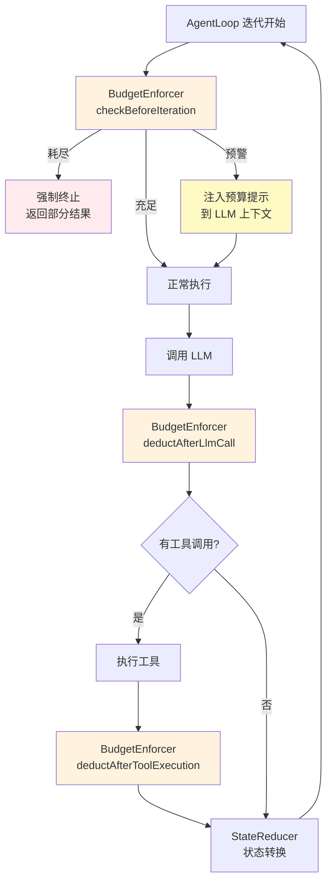

### 8.4 SubAgent 预算隔离

当一个 Skill 被激活为 SubAgent 时，它需要自己的独立预算——既不能无限制地消耗父 Agent 的资源，也不能因为预算分配不当而无法完成任务。ZhiWei 采用**预算切分与回收**机制来解决这个问题。

**核心原则：**

- **隔离性**：SubAgent 的预算从父 Agent 的剩余预算中切分，形成独立的 Budget 实例
- **上限约束**：SubAgent 的预算不能超过父 Agent 的剩余预算，也不能超过 Skill 定义的最大预算
- **回收机制**：SubAgent 执行完毕后，未消耗的预算归还给父 Agent
- **不可透支**：SubAgent 无法通过任何方式获取超出分配额度的资源

预算分配公式如下：

```
SubAgent 预算 = min(父 Agent 剩余预算 × 分配比例, Skill 定义的最大预算)

其中：
  分配比例 = Skill 元数据中声明的 budgetRatio（默认 0.5）
  Skill 最大预算 = Skill YAML 中定义的 maxBudget 各维度上限
```

```java
package com.lifepilot.agent;

import java.time.Duration;
import java.time.Instant;

/**
 * SubAgent 预算分配器。
 *
 * <p>负责从父 Agent 的剩余预算中切分出 SubAgent 的独立预算，
 * 并在 SubAgent 执行完毕后将未消耗的预算归还给父 Agent。</p>
 *
 * <p>分配策略：
 * <ul>
 *   <li>各维度独立计算，取父 Agent 剩余量 × 分配比例与 Skill 上限的较小值</li>
 *   <li>时间维度特殊处理：SubAgent 的 startTime 为当前时刻，maxDuration 按比例切分</li>
 *   <li>费用维度按比例切分，确保 SubAgent 不会消耗超出预期的费用</li>
 * </ul>
 * </p>
 */
public class SubAgentBudgetAllocator {

    /** 默认分配比例：父 Agent 剩余预算的 50%。 */
    private static final double DEFAULT_BUDGET_RATIO = 0.5;

    /**
     * 从父 Agent 预算中切分 SubAgent 预算。
     *
     * @param parentBudget 父 Agent 当前预算
     * @param skillConfig  Skill 定义的预算约束
     * @return SubAgent 的独立预算实例
     */
    public Budget allocate(Budget parentBudget, SkillBudgetConfig skillConfig) {
        double ratio = skillConfig.budgetRatio() > 0
                ? skillConfig.budgetRatio()
                : DEFAULT_BUDGET_RATIO;

        // 各维度独立计算：父剩余 × 比例 与 Skill 上限取较小值
        int allocatedSteps = Math.min(
                (int) (parentBudget.remainingSteps() * ratio),
                skillConfig.maxSteps()
        );
        int allocatedTokens = Math.min(
                (int) (parentBudget.remainingTokens() * ratio),
                skillConfig.maxTokens()
        );

        // 时间维度：从父 Agent 剩余时间中按比例切分
        Duration parentRemaining = parentBudget.maxDuration()
                .minus(Duration.between(parentBudget.startTime(), Instant.now()));
        Duration allocatedDuration = Duration.ofMillis(
                Math.min(
                        (long) (parentRemaining.toMillis() * ratio),
                        Duration.ofSeconds(skillConfig.maxDurationSeconds()).toMillis()
                )
        );

        int allocatedCostCents = Math.min(
                (int) ((parentBudget.maxCostCents() - parentBudget.consumedCostCents()) * ratio),
                skillConfig.maxCostCents()
        );

        return new Budget(
                allocatedSteps, allocatedSteps,
                allocatedTokens, allocatedTokens,
                allocatedDuration, Instant.now(),
                allocatedCostCents, 0
        );
    }

    /**
     * SubAgent 执行完毕后，将未消耗的预算归还给父 Agent。
     *
     * <p>归还逻辑：将 SubAgent 的实际消耗量从父 Agent 预算中扣减。
     * 未消耗的部分自动保留在父 Agent 的剩余预算中。</p>
     *
     * @param parentBudget   父 Agent 当前预算
     * @param allocatedBudget 分配给 SubAgent 的原始预算
     * @param consumedBudget  SubAgent 执行后的最终预算（包含消耗信息）
     * @return 归还后的父 Agent 预算
     */
    public Budget reclaim(Budget parentBudget, Budget allocatedBudget, Budget consumedBudget) {
        // 计算 SubAgent 实际消耗量
        int stepsConsumed = allocatedBudget.maxSteps() - consumedBudget.remainingSteps();
        int tokensConsumed = allocatedBudget.maxTokens() - consumedBudget.remainingTokens();
        int costConsumed = consumedBudget.consumedCostCents();

        // 从父 Agent 预算中扣减实际消耗量（而非分配量）
        return new Budget(
                parentBudget.maxSteps(),
                parentBudget.remainingSteps() - stepsConsumed,
                parentBudget.maxTokens(),
                parentBudget.remainingTokens() - tokensConsumed,
                parentBudget.maxDuration(),
                parentBudget.startTime(),
                parentBudget.maxCostCents(),
                parentBudget.consumedCostCents() + costConsumed
        );
    }
}
```

Skill 的预算约束在 YAML 中声明：

```yaml
# skills/calendar-manager.yaml
id: calendar-manager
name: 日历管理
budget:
  budget-ratio: 0.3        # 最多使用父 Agent 剩余预算的 30%
  max-steps: 5             # SubAgent 最多执行 5 步
  max-tokens: 3000         # SubAgent 最多消耗 3000 Token
  max-duration-seconds: 15 # SubAgent 最多运行 15 秒
  max-cost-cents: 20       # SubAgent 最多消耗 20 美分
```

对应的配置绑定类：

```java
package com.lifepilot.agent;

/**
 * Skill 预算约束配置。
 *
 * <p>从 Skill YAML 定义中读取，约束 SubAgent 的最大资源消耗。
 * 各维度与 {@link Budget} 一一对应。</p>
 *
 * @param budgetRatio        从父 Agent 剩余预算中切分的比例（0.0 ~ 1.0）
 * @param maxSteps           SubAgent 最大步数
 * @param maxTokens          SubAgent 最大 Token 数
 * @param maxDurationSeconds SubAgent 最大耗时（秒）
 * @param maxCostCents       SubAgent 最大费用（美分）
 */
public record SkillBudgetConfig(
        double budgetRatio,
        int maxSteps,
        int maxTokens,
        int maxDurationSeconds,
        int maxCostCents
) {
    /** 默认配置：50% 比例，5 步，4000 Token，20 秒，30 美分。 */
    public static SkillBudgetConfig defaults() {
        return new SkillBudgetConfig(0.5, 5, 4000, 20, 30);
    }
}
```

以下示意图展示了父 Agent 与 SubAgent 之间的预算流动：

```
父 Agent 预算（初始）
┌──────────────────────────────────────────────────┐
│  步数: 10/10  │  Token: 8000/8000  │  费用: 0/50¢ │
└──────────────────────────────────────────────────┘
        │
        │ 父 Agent 执行 3 步后，激活 Skill
        ▼
父 Agent 预算（激活 Skill 时）
┌──────────────────────────────────────────────────┐
│  步数: 7/10   │  Token: 5500/8000  │  费用: 12/50¢│
└──────────────────────────────────────────────────┘
        │
        │ allocate(ratio=0.3, skillMax={5步, 3000T, 20¢})
        ▼
SubAgent 预算（分配）
┌──────────────────────────────────────────────────┐
│  步数: min(7×0.3, 5) = 2  │  Token: min(5500×0.3, 3000) = 1650  │
│  费用: min(38×0.3, 20) = 11¢                                      │
└──────────────────────────────────────────────────┘
        │
        │ SubAgent 执行完毕，实际消耗: 2 步 / 800 Token / 5¢
        ▼
reclaim → 父 Agent 预算（回收后）
┌──────────────────────────────────────────────────┐
│  步数: 7-2=5  │  Token: 5500-800=4700  │  费用: 12+5=17/50¢│
└──────────────────────────────────────────────────┘
        │
        │ 父 Agent 继续执行剩余任务
        ▼
```

这一机制确保了 SubAgent 的资源消耗始终在可控范围内，同时最大化了资源利用率——未消耗的预算不会浪费，而是归还给父 Agent 继续使用。预算的不可变性保证了整个分配-消耗-回收过程的完整可追溯性，每一步的预算变化都可以在 TraceRecorder 中精确回放。

---

## 9. 多轮对话与会话管理

> **核心问题**：Agent 引擎不是一次性的请求-响应管道，而是需要跨多轮对话维护状态、支持中断恢复、管理并发会话的有状态系统。本节定义会话的完整生命周期模型、持久化策略、恢复机制和并发隔离保证。

### 9.1 会话生命周期模型

会话（Session）是用户与 Agent 之间一次完整交互的容器。它不仅承载对话消息历史，还维护 Agent 的执行状态、资源预算快照和上下文元数据。会话的生命周期由以下六个状态构成：

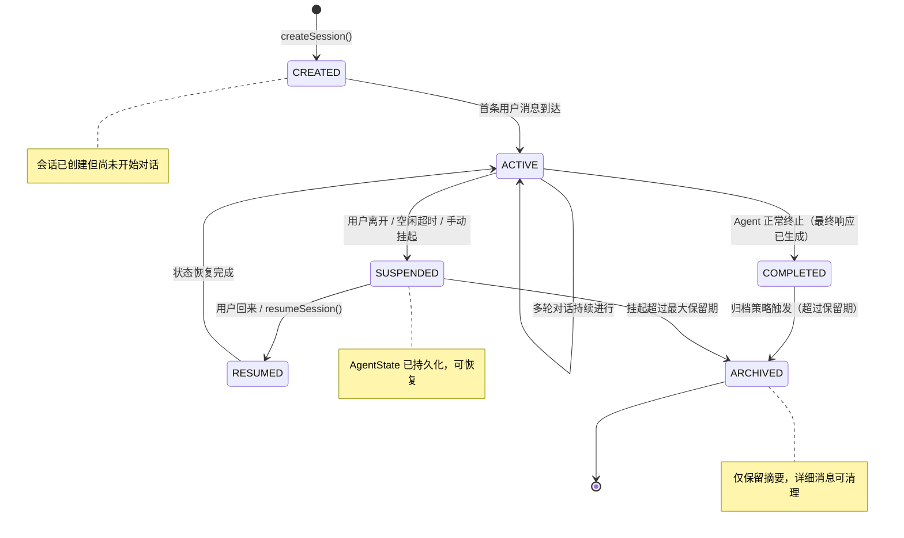

关键设计决策：

- **SUSPENDED 与 COMPLETED 的区别**：SUSPENDED 表示对话未结束但暂时中断（用户关闭了应用、网络断开、空闲超时），恢复后可以继续之前的对话上下文；COMPLETED 表示 Agent 已生成最终响应，对话逻辑上已结束。
- **RESUMED 是瞬态**：RESUMED 仅在状态恢复过程中短暂存在，恢复完成后立即转入 ACTIVE。这确保了状态机的简洁性——业务逻辑只需关注 ACTIVE 状态。
- **ARCHIVED 是终态**：归档后的会话不可恢复为活跃状态，但其摘要信息可被知识图谱索引，用于长期记忆。

#### SessionState 枚举

```java
package com.lifepilot.agent.session;

/**
 * 会话生命周期状态枚举。
 *
 * <p>定义了会话从创建到归档的所有合法状态。状态转换由 {@link SessionManager} 管理，
 * 非法转换将抛出 {@link IllegalSessionStateException}。</p>
 */
public enum SessionState {

    /** 会话已创建，等待首条用户消息。 */
    CREATED("已创建"),

    /** 会话活跃中，正在进行多轮对话。 */
    ACTIVE("活跃"),

    /** 会话已挂起，AgentState 已持久化到 SQLite。 */
    SUSPENDED("已挂起"),

    /** 会话恢复中，正在从持久化数据重建 AgentState。 */
    RESUMED("恢复中"),

    /** 会话已完成，Agent 已生成最终响应。 */
    COMPLETED("已完成"),

    /** 会话已归档，仅保留摘要信息。 */
    ARCHIVED("已归档");

    private final String description;

    SessionState(String description) {
        this.description = description;
    }

    public String description() {
        return description;
    }

    /** 判断当前状态是否允许接收新的用户消息。 */
    public boolean acceptsUserInput() {
        return this == ACTIVE;
    }

    /** 判断当前状态是否为终态（不可再转换）。 */
    public boolean isTerminal() {
        return this == ARCHIVED;
    }

    /** 判断当前状态是否可恢复。 */
    public boolean isResumable() {
        return this == SUSPENDED;
    }
}
```

#### Session 记录

```java
package com.lifepilot.agent.session;

import com.lifepilot.agent.AgentState;
import com.lifepilot.agent.Budget;
import lombok.Builder;

import java.time.Instant;
import java.util.Map;
import java.util.Optional;
import java.util.UUID;

/**
 * 会话不可变快照。
 *
 * <p>承载会话的全部元数据和当前 AgentState 引用。每次状态变更生成新实例，
 * 旧实例保持不变，支持完整的审计轨迹。</p>
 *
 * @param id             会话唯一标识
 * @param state          当前生命周期状态
 * @param agentState     关联的 Agent 执行状态（SUSPENDED 时已持久化）
 * @param title          会话标题（从首条用户消息自动生成或用户自定义）
 * @param budget         会话级资源预算
 * @param metadata       扩展元数据（来源渠道、客户端信息等）
 * @param createdAt      会话创建时间
 * @param updatedAt      最后更新时间
 * @param lastActiveAt   最后活跃时间（用于空闲超时判断）
 * @param suspendedAt    挂起时间（仅 SUSPENDED 状态有值）
 * @param completedAt    完成时间（仅 COMPLETED / ARCHIVED 状态有值）
 * @param messageCount   消息总数（冗余字段，避免每次计数查询）
 */
@Builder(toBuilder = true)
public record Session(
        UUID id,
        SessionState state,
        Optional<AgentState> agentState,
        String title,
        Budget budget,
        Map<String, Object> metadata,
        Instant createdAt,
        Instant updatedAt,
        Instant lastActiveAt,
        Optional<Instant> suspendedAt,
        Optional<Instant> completedAt,
        int messageCount
) {
    /** 防御性拷贝。 */
    public Session {
        metadata = Map.copyOf(metadata);
    }

    /** 创建新会话。 */
    public static Session create(Budget budget, Map<String, Object> metadata) {
        var now = Instant.now();
        return new Session(
                UUID.randomUUID(),
                SessionState.CREATED,
                Optional.empty(),
                "新会话",
                budget,
                metadata,
                now, now, now,
                Optional.empty(),
                Optional.empty(),
                0
        );
    }

    /** 激活会话，绑定 AgentState。 */
    public Session activate(AgentState agentState) {
        return this.toBuilder()
                .state(SessionState.ACTIVE)
                .agentState(Optional.of(agentState))
                .updatedAt(Instant.now())
                .lastActiveAt(Instant.now())
                .build();
    }

    /** 挂起会话。 */
    public Session suspend() {
        return this.toBuilder()
                .state(SessionState.SUSPENDED)
                .suspendedAt(Optional.of(Instant.now()))
                .updatedAt(Instant.now())
                .build();
    }

    /** 完成会话。 */
    public Session complete() {
        return this.toBuilder()
                .state(SessionState.COMPLETED)
                .completedAt(Optional.of(Instant.now()))
                .updatedAt(Instant.now())
                .build();
    }

    /** 判断会话是否空闲超过指定时长。 */
    public boolean isIdleBeyond(java.time.Duration threshold) {
        return java.time.Duration.between(lastActiveAt, Instant.now()).compareTo(threshold) > 0;
    }
}
```

### 9.2 SessionManager — 会话管理器

`SessionManager` 是会话生命周期的唯一管理入口。它维护活跃会话的内存索引（`ConcurrentHashMap`），协调会话状态转换、持久化和恢复操作，并与 `AgentLoop` 集成实现多轮对话的无缝衔接。

```java
package com.lifepilot.agent.session;

import com.lifepilot.agent.AgentLoop;
import com.lifepilot.agent.AgentState;
import com.lifepilot.agent.Budget;
import org.slf4j.Logger;
import org.slf4j.LoggerFactory;
import org.springframework.stereotype.Component;

import java.time.Duration;
import java.util.List;
import java.util.Map;
import java.util.Optional;
import java.util.UUID;
import java.util.concurrent.ConcurrentHashMap;

/**
 * 会话管理器 — 会话生命周期的唯一管理入口。
 *
 * <p>核心职责：
 * <ul>
 *   <li>维护活跃会话的内存索引，提供 O(1) 查找</li>
 *   <li>协调会话状态转换，确保转换合法性</li>
 *   <li>与 {@link SessionRepository} 协作完成持久化和恢复</li>
 *   <li>与 {@link AgentLoop} 集成，将多轮对话路由到正确的会话</li>
 *   <li>执行空闲超时检测和自动挂起策略</li>
 * </ul>
 * </p>
 *
 * <p>线程安全：所有会话操作通过 {@link ConcurrentHashMap} 保证线程安全，
 * 单个会话的状态转换通过 {@code compute()} 原子操作实现。</p>
 */
@Component
public class SessionManager {

    private static final Logger log = LoggerFactory.getLogger(SessionManager.class);

    /** 活跃会话内存索引：sessionId → Session。 */
    private final ConcurrentHashMap<UUID, Session> activeSessions = new ConcurrentHashMap<>();

    private final SessionRepository sessionRepository;
    private final AgentLoop agentLoop;
    private final SessionConfig config;

    public SessionManager(
            SessionRepository sessionRepository,
            AgentLoop agentLoop,
            SessionConfig config
    ) {
        this.sessionRepository = sessionRepository;
        this.agentLoop = agentLoop;
        this.config = config;
    }

    /**
     * 创建新会话。
     *
     * <p>生成唯一会话 ID，初始化为 CREATED 状态，持久化到 SQLite 并加入内存索引。</p>
     *
     * @param budget   会话级资源预算
     * @param metadata 扩展元数据（来源渠道、客户端信息等）
     * @return 新创建的会话
     */
    public Session createSession(Budget budget, Map<String, Object> metadata) {
        var session = Session.create(budget, metadata);
        sessionRepository.save(session);
        activeSessions.put(session.id(), session);
        log.info("会话已创建: sessionId={}", session.id());
        return session;
    }

    /**
     * 处理用户消息，驱动多轮对话。
     *
     * <p>这是多轮对话的核心入口。根据会话当前状态决定处理策略：
     * <ul>
     *   <li>CREATED → 激活会话，启动 AgentLoop</li>
     *   <li>ACTIVE → 将消息注入当前 AgentState，继续 AgentLoop</li>
     *   <li>其他状态 → 拒绝消息，返回错误提示</li>
     * </ul>
     * </p>
     *
     * @param sessionId 目标会话 ID
     * @param userInput 用户输入文本
     * @return Agent 执行后的最终状态
     */
    public AgentState handleMessage(UUID sessionId, String userInput) {
        var session = getActiveSession(sessionId)
                .orElseThrow(() -> new SessionNotFoundException("会话不存在或已关闭: " + sessionId));

        return switch (session.state()) {
            case CREATED -> {
                // 首条消息：激活会话并启动 AgentLoop
                var agentState = agentLoop.execute(sessionId, userInput, session.budget());
                var activated = session.activate(agentState)
                        .toBuilder()
                        .title(generateTitle(userInput))
                        .messageCount(session.messageCount() + 1)
                        .build();
                updateSession(activated);
                yield agentState;
            }
            case ACTIVE -> {
                // 后续消息：基于现有 AgentState 继续执行
                var currentAgentState = session.agentState()
                        .orElseThrow(() -> new IllegalSessionStateException("活跃会话缺少 AgentState"));
                var agentState = agentLoop.execute(sessionId, userInput, currentAgentState.budget());
                var updated = session.toBuilder()
                        .agentState(Optional.of(agentState))
                        .lastActiveAt(java.time.Instant.now())
                        .updatedAt(java.time.Instant.now())
                        .messageCount(session.messageCount() + 1)
                        .build();
                updateSession(updated);
                yield agentState;
            }
            default -> throw new IllegalSessionStateException(
                    "会话状态 " + session.state() + " 不接受新消息");
        };
    }

    /**
     * 挂起会话。
     *
     * <p>将当前 AgentState 持久化到 SQLite，从内存索引中移除活跃标记，
     * 释放内存资源。挂起后的会话可通过 {@link #resumeSession} 恢复。</p>
     *
     * @param sessionId 目标会话 ID
     * @return 挂起后的会话快照
     */
    public Session suspendSession(UUID sessionId) {
        return activeSessions.compute(sessionId, (id, session) -> {
            if (session == null) {
                throw new SessionNotFoundException("会话不存在: " + id);
            }
            if (session.state() != SessionState.ACTIVE) {
                throw new IllegalSessionStateException(
                        "仅活跃会话可挂起，当前状态: " + session.state());
            }

            var suspended = session.suspend();
            sessionRepository.save(suspended);
            sessionRepository.persistAgentState(id, session.agentState().orElse(null));
            log.info("会话已挂起: sessionId={}, messageCount={}", id, suspended.messageCount());
            return suspended;
        });
    }

    /**
     * 恢复挂起的会话。
     *
     * <p>从 SQLite 加载持久化的 AgentState，重建内存状态，
     * 将会话重新加入活跃索引。恢复过程包括：
     * <ol>
     *   <li>加载会话元数据</li>
     *   <li>反序列化 AgentState</li>
     *   <li>重建对话历史上下文</li>
     *   <li>验证预算剩余量</li>
     * </ol>
     * </p>
     *
     * @param sessionId 目标会话 ID
     * @return 恢复后的活跃会话
     */
    public Session resumeSession(UUID sessionId) {
        var persisted = sessionRepository.findById(sessionId)
                .orElseThrow(() -> new SessionNotFoundException("会话不存在: " + sessionId));

        if (!persisted.state().isResumable()) {
            throw new IllegalSessionStateException(
                    "会话状态不可恢复: state=" + persisted.state());
        }

        // 从 SQLite 恢复 AgentState
        var agentState = sessionRepository.loadAgentState(sessionId)
                .orElseThrow(() -> new SessionRecoveryException("AgentState 恢复失败: " + sessionId));

        var resumed = persisted.toBuilder()
                .state(SessionState.ACTIVE)
                .agentState(Optional.of(agentState))
                .lastActiveAt(java.time.Instant.now())
                .updatedAt(java.time.Instant.now())
                .build();

        activeSessions.put(sessionId, resumed);
        sessionRepository.save(resumed);
        log.info("会话已恢复: sessionId={}, step={}", sessionId, agentState.stepCount());
        return resumed;
    }

    /**
     * 完成会话。
     *
     * <p>当 Agent 生成最终响应后调用。将会话标记为 COMPLETED，
     * 从活跃索引中移除，持久化最终状态。</p>
     *
     * @param sessionId 目标会话 ID
     * @return 完成后的会话快照
     */
    public Session completeSession(UUID sessionId) {
        var session = activeSessions.remove(sessionId);
        if (session == null) {
            throw new SessionNotFoundException("活跃会话不存在: " + sessionId);
        }

        var completed = session.complete();
        sessionRepository.save(completed);
        log.info("会话已完成: sessionId={}, messageCount={}", sessionId, completed.messageCount());
        return completed;
    }

    /**
     * 获取活跃会话。
     *
     * <p>优先从内存索引查找，未命中时回退到 SQLite 查询。</p>
     */
    public Optional<Session> getActiveSession(UUID sessionId) {
        var cached = activeSessions.get(sessionId);
        if (cached != null) {
            return Optional.of(cached);
        }
        return sessionRepository.findById(sessionId)
                .filter(s -> s.state() == SessionState.ACTIVE || s.state() == SessionState.CREATED);
    }

    /** 列出所有活跃会话（用于 UI 展示）。 */
    public List<Session> listActiveSessions() {
        return List.copyOf(activeSessions.values());
    }

    /** 更新会话并同步到内存索引和持久层。 */
    private void updateSession(Session session) {
        activeSessions.put(session.id(), session);
        sessionRepository.save(session);
    }

    /** 从首条用户消息生成会话标题（截取前 20 个字符）。 */
    private String generateTitle(String userInput) {
        return userInput.length() <= 20 ? userInput : userInput.substring(0, 20) + "…";
    }
}
```

`SessionManager` 与 `AgentLoop` 的集成关系如下图所示：

```
用户消息 ──► SessionManager.handleMessage()
                │
                ├── CREATED 状态 ──► AgentLoop.execute() ──► 激活会话
                │
                ├── ACTIVE 状态  ──► AgentLoop.execute() ──► 更新 AgentState
                │
                └── 其他状态     ──► 拒绝消息

AgentLoop 终止 ──► SessionManager.completeSession()
空闲超时检测   ──► SessionManager.suspendSession()
用户恢复请求   ──► SessionManager.resumeSession()
```

### 9.3 对话历史与消息模型

多轮对话的核心是消息历史的结构化管理。ZhiWei 的消息模型不是简单的 `(role, content)` 二元组，而是使用 `sealed interface` 定义了五种语义明确的消息变体，每种变体携带该类型消息所需的完整上下文信息。

这一设计的关键优势：

- **类型安全**：`switch` 表达式穷举匹配，新增消息类型时编译器强制处理
- **语义清晰**：工具调用和工具结果是独立的消息类型，而非嵌入在 AssistantMessage 中的 JSON 字段
- **序列化友好**：每种变体的字段结构固定，便于 SQLite 持久化和 JSON 序列化

```java
package com.lifepilot.agent.session;

import java.time.Instant;
import java.util.List;
import java.util.Map;
import java.util.UUID;

/**
 * 对话消息密封接口。
 *
 * <p>定义了多轮对话中所有合法的消息类型。每种消息变体携带该类型所需的完整上下文，
 * 通过 sealed 修饰确保编译期穷举检查。</p>
 *
 * <p>消息一旦创建不可修改（不可变 record），保证对话历史的完整性和可审计性。</p>
 */
public sealed interface DialogMessage permits
        DialogMessage.UserMessage,
        DialogMessage.AssistantMessage,
        DialogMessage.ToolCallMessage,
        DialogMessage.ToolResultMessage,
        DialogMessage.SystemMessage {

    /** 消息唯一标识。 */
    UUID id();

    /** 消息创建时间。 */
    Instant timestamp();

    /** 所属会话 ID。 */
    UUID sessionId();

    /**
     * 用户消息。
     *
     * <p>用户通过 CLI、Web UI 或 API 发送的自然语言输入。
     * {@code source} 标识消息来源渠道，用于上下文组装时的渠道感知。</p>
     *
     * @param id        消息唯一标识
     * @param sessionId 所属会话 ID
     * @param content   用户输入的文本内容
     * @param source    消息来源渠道（cli / web / api / mcp）
     * @param timestamp 消息创建时间
     */
    record UserMessage(
            UUID id,
            UUID sessionId,
            String content,
            String source,
            Instant timestamp
    ) implements DialogMessage {
        public UserMessage(UUID sessionId, String content, String source) {
            this(UUID.randomUUID(), sessionId, content, source, Instant.now());
        }
    }

    /**
     * Agent 助手消息。
     *
     * <p>Agent 生成的自然语言回复。{@code phase} 记录生成此消息时 Agent 所处的执行阶段，
     * 用于追溯和调试。{@code tokenCount} 记录 LLM 生成此消息消耗的 Token 数。</p>
     *
     * @param id         消息唯一标识
     * @param sessionId  所属会话 ID
     * @param content    Agent 生成的文本内容
     * @param phase      生成此消息时的 Agent 执行阶段
     * @param tokenCount LLM 生成此消息消耗的 Token 数
     * @param timestamp  消息创建时间
     */
    record AssistantMessage(
            UUID id,
            UUID sessionId,
            String content,
            String phase,
            int tokenCount,
            Instant timestamp
    ) implements DialogMessage {
        public AssistantMessage(UUID sessionId, String content, String phase, int tokenCount) {
            this(UUID.randomUUID(), sessionId, content, phase, tokenCount, Instant.now());
        }
    }

    /**
     * 工具调用消息。
     *
     * <p>记录 Agent 发起的工具调用请求。与 {@link ToolResultMessage} 通过
     * {@code toolCallId} 关联，形成调用-结果对。</p>
     *
     * @param id         消息唯一标识
     * @param sessionId  所属会话 ID
     * @param toolCallId 工具调用唯一标识（用于与结果消息关联）
     * @param toolName   被调用的工具名称
     * @param arguments  工具调用参数（JSON 字符串）
     * @param timestamp  消息创建时间
     */
    record ToolCallMessage(
            UUID id,
            UUID sessionId,
            String toolCallId,
            String toolName,
            String arguments,
            Instant timestamp
    ) implements DialogMessage {
        public ToolCallMessage(UUID sessionId, String toolCallId, String toolName, String arguments) {
            this(UUID.randomUUID(), sessionId, toolCallId, toolName, arguments, Instant.now());
        }
    }

    /**
     * 工具执行结果消息。
     *
     * <p>记录工具调用的执行结果。{@code success} 标识调用是否成功，
     * 失败时 {@code content} 包含错误信息。</p>
     *
     * @param id         消息唯一标识
     * @param sessionId  所属会话 ID
     * @param toolCallId 关联的工具调用标识
     * @param content    工具返回的结果内容（成功时为结果 JSON，失败时为错误描述）
     * @param success    工具调用是否成功
     * @param durationMs 工具执行耗时（毫秒）
     * @param timestamp  消息创建时间
     */
    record ToolResultMessage(
            UUID id,
            UUID sessionId,
            String toolCallId,
            String content,
            boolean success,
            long durationMs,
            Instant timestamp
    ) implements DialogMessage {
        public ToolResultMessage(UUID sessionId, String toolCallId, String content,
                                 boolean success, long durationMs) {
            this(UUID.randomUUID(), sessionId, toolCallId, content, success, durationMs, Instant.now());
        }
    }

    /**
     * 系统消息。
     *
     * <p>系统内部生成的控制消息，不展示给用户。用于记录安全护栏拦截、
     * 预算警告、阶段转换等内部事件。{@code category} 用于分类过滤。</p>
     *
     * @param id        消息唯一标识
     * @param sessionId 所属会话 ID
     * @param content   系统消息内容
     * @param category  消息分类（guardrail / budget / phase / error）
     * @param timestamp 消息创建时间
     */
    record SystemMessage(
            UUID id,
            UUID sessionId,
            String content,
            String category,
            Instant timestamp
    ) implements DialogMessage {
        public SystemMessage(UUID sessionId, String content, String category) {
            this(UUID.randomUUID(), sessionId, content, category, Instant.now());
        }
    }
}
```

消息的存储与检索通过 `DialogMessageStore` 统一管理，支持按会话 ID 分页查询、按消息类型过滤、按时间范围检索：

```java
package com.lifepilot.agent.session;

import org.springframework.stereotype.Component;

import java.time.Instant;
import java.util.List;
import java.util.UUID;

/**
 * 对话消息存储服务。
 *
 * <p>提供消息的持久化写入和多维度查询能力。底层使用 SQLite 存储，
 * 通过 {@link SessionRepository} 执行实际的 JDBC 操作。</p>
 */
@Component
public class DialogMessageStore {

    private final SessionRepository repository;

    public DialogMessageStore(SessionRepository repository) {
        this.repository = repository;
    }

    /** 追加消息到会话历史。 */
    public void append(DialogMessage message) {
        repository.insertMessage(message);
    }

    /** 批量追加消息（用于工具调用批量结果写入）。 */
    public void appendAll(List<DialogMessage> messages) {
        repository.insertMessages(messages);
    }

    /** 按会话 ID 查询全部消息，按时间正序排列。 */
    public List<DialogMessage> findBySession(UUID sessionId) {
        return repository.findMessagesBySessionId(sessionId);
    }

    /** 按会话 ID 分页查询消息。 */
    public List<DialogMessage> findBySession(UUID sessionId, int offset, int limit) {
        return repository.findMessagesBySessionId(sessionId, offset, limit);
    }

    /** 查询指定会话中最近 N 条消息（用于上下文窗口组装）。 */
    public List<DialogMessage> findRecentMessages(UUID sessionId, int count) {
        return repository.findRecentMessages(sessionId, count);
    }

    /** 按时间范围查询消息。 */
    public List<DialogMessage> findByTimeRange(UUID sessionId, Instant from, Instant to) {
        return repository.findMessagesByTimeRange(sessionId, from, to);
    }

    /** 统计会话消息总数。 */
    public int countBySession(UUID sessionId) {
        return repository.countMessages(sessionId);
    }
}
```

### 9.4 会话持久化

会话数据通过 SQLite 持久化，使用 Flyway 管理数据库迁移。持久化层包含两张核心表：`sessions`（会话元数据）和 `dialog_messages`（对话消息历史），以及一张辅助表 `agent_state_snapshots`（AgentState 快照，用于会话恢复）。

#### Flyway 迁移脚本

```sql
-- V9001__create_sessions_table.sql
-- 会话元数据表

CREATE TABLE IF NOT EXISTS sessions (
    id              TEXT PRIMARY KEY,           -- UUID
    state           TEXT NOT NULL,              -- SessionState 枚举值
    title           TEXT NOT NULL DEFAULT '新会话',
    budget_json     TEXT NOT NULL,              -- Budget 序列化 JSON
    metadata_json   TEXT NOT NULL DEFAULT '{}', -- 扩展元数据 JSON
    message_count   INTEGER NOT NULL DEFAULT 0,
    created_at      TEXT NOT NULL,              -- ISO 8601
    updated_at      TEXT NOT NULL,              -- ISO 8601
    last_active_at  TEXT NOT NULL,              -- ISO 8601
    suspended_at    TEXT,                       -- ISO 8601，仅 SUSPENDED 状态有值
    completed_at    TEXT                        -- ISO 8601，仅 COMPLETED/ARCHIVED 状态有值
);

-- 按状态查询索引（列出活跃/挂起会话）
CREATE INDEX IF NOT EXISTS idx_sessions_state ON sessions(state);

-- 按最后活跃时间索引（空闲超时检测）
CREATE INDEX IF NOT EXISTS idx_sessions_last_active ON sessions(last_active_at);
```

```sql
-- V9002__create_dialog_messages_table.sql
-- 对话消息历史表

CREATE TABLE IF NOT EXISTS dialog_messages (
    id              TEXT PRIMARY KEY,           -- UUID
    session_id      TEXT NOT NULL,              -- 关联会话 ID
    message_type    TEXT NOT NULL,              -- 消息类型: user/assistant/tool_call/tool_result/system
    content         TEXT NOT NULL,              -- 消息内容
    source          TEXT,                       -- 消息来源渠道（仅 user 类型）
    phase           TEXT,                       -- Agent 执行阶段（仅 assistant 类型）
    token_count     INTEGER DEFAULT 0,          -- Token 消耗（仅 assistant 类型）
    tool_call_id    TEXT,                       -- 工具调用标识（tool_call / tool_result 类型）
    tool_name       TEXT,                       -- 工具名称（仅 tool_call 类型）
    arguments_json  TEXT,                       -- 工具调用参数 JSON（仅 tool_call 类型）
    success         INTEGER,                    -- 工具调用是否成功 0/1（仅 tool_result 类型）
    duration_ms     INTEGER,                    -- 工具执行耗时毫秒（仅 tool_result 类型）
    category        TEXT,                       -- 系统消息分类（仅 system 类型）
    created_at      TEXT NOT NULL,              -- ISO 8601
    FOREIGN KEY (session_id) REFERENCES sessions(id) ON DELETE CASCADE
);

-- 按会话 ID + 时间排序索引（查询对话历史）
CREATE INDEX IF NOT EXISTS idx_messages_session_time
    ON dialog_messages(session_id, created_at);

-- 按工具调用 ID 索引（关联调用与结果）
CREATE INDEX IF NOT EXISTS idx_messages_tool_call_id
    ON dialog_messages(tool_call_id) WHERE tool_call_id IS NOT NULL;

-- 按消息类型索引（按类型过滤查询）
CREATE INDEX IF NOT EXISTS idx_messages_type
    ON dialog_messages(session_id, message_type);
```

```sql
-- V9003__create_agent_state_snapshots_table.sql
-- AgentState 快照表（用于会话挂起/恢复）

CREATE TABLE IF NOT EXISTS agent_state_snapshots (
    session_id      TEXT PRIMARY KEY,           -- 关联会话 ID（一个会话最多一个活跃快照）
    phase           TEXT NOT NULL,              -- AgentPhase 枚举值
    step_count      INTEGER NOT NULL,           -- 已执行步数
    budget_json     TEXT NOT NULL,              -- Budget 序列化 JSON
    metadata_json   TEXT NOT NULL DEFAULT '{}', -- 扩展元数据 JSON
    created_at      TEXT NOT NULL,              -- ISO 8601（快照创建时间）
    FOREIGN KEY (session_id) REFERENCES sessions(id) ON DELETE CASCADE
);
```

#### SessionRepository — JDBC 持久化操作

```java
package com.lifepilot.agent.session;

import com.fasterxml.jackson.databind.ObjectMapper;
import com.lifepilot.agent.AgentPhase;
import com.lifepilot.agent.AgentState;
import com.lifepilot.agent.Budget;
import org.slf4j.Logger;
import org.slf4j.LoggerFactory;
import org.springframework.jdbc.core.JdbcTemplate;
import org.springframework.stereotype.Repository;

import java.time.Instant;
import java.util.List;
import java.util.Optional;
import java.util.UUID;

/**
 * 会话持久化仓库。
 *
 * <p>使用 Spring JdbcTemplate 执行 SQLite CRUD 操作。所有时间字段以 ISO 8601
 * 格式存储，JSON 字段通过 Jackson ObjectMapper 序列化/反序列化。</p>
 *
 * <p>线程安全：JdbcTemplate 本身是线程安全的，SQLite WAL 模式支持并发读。</p>
 */
@Repository
public class SessionRepository {

    private static final Logger log = LoggerFactory.getLogger(SessionRepository.class);

    private final JdbcTemplate jdbc;
    private final ObjectMapper objectMapper;

    public SessionRepository(JdbcTemplate jdbc, ObjectMapper objectMapper) {
        this.jdbc = jdbc;
        this.objectMapper = objectMapper;
    }

    /** 保存或更新会话元数据。 */
    public void save(Session session) {
        try {
            var budgetJson = objectMapper.writeValueAsString(session.budget());
            var metadataJson = objectMapper.writeValueAsString(session.metadata());

            jdbc.update("""
                INSERT INTO sessions (id, state, title, budget_json, metadata_json,
                    message_count, created_at, updated_at, last_active_at, suspended_at, completed_at)
                VALUES (?, ?, ?, ?, ?, ?, ?, ?, ?, ?, ?)
                ON CONFLICT(id) DO UPDATE SET
                    state = excluded.state,
                    title = excluded.title,
                    budget_json = excluded.budget_json,
                    metadata_json = excluded.metadata_json,
                    message_count = excluded.message_count,
                    updated_at = excluded.updated_at,
                    last_active_at = excluded.last_active_at,
                    suspended_at = excluded.suspended_at,
                    completed_at = excluded.completed_at
                """,
                session.id().toString(),
                session.state().name(),
                session.title(),
                budgetJson,
                metadataJson,
                session.messageCount(),
                session.createdAt().toString(),
                session.updatedAt().toString(),
                session.lastActiveAt().toString(),
                session.suspendedAt().map(Instant::toString).orElse(null),
                session.completedAt().map(Instant::toString).orElse(null)
            );
        } catch (Exception e) {
            log.error("会话持久化失败: sessionId={}", session.id(), e);
            throw new SessionPersistenceException("会话持久化失败: " + session.id(), e);
        }
    }

    /** 按 ID 查询会话。 */
    public Optional<Session> findById(UUID sessionId) {
        var results = jdbc.query(
                "SELECT * FROM sessions WHERE id = ?",
                (rs, rowNum) -> mapToSession(rs),
                sessionId.toString()
        );
        return results.isEmpty() ? Optional.empty() : Optional.of(results.getFirst());
    }

    /** 查询指定状态的会话列表。 */
    public List<Session> findByState(SessionState state) {
        return jdbc.query(
                "SELECT * FROM sessions WHERE state = ? ORDER BY updated_at DESC",
                (rs, rowNum) -> mapToSession(rs),
                state.name()
        );
    }

    /** 查询空闲超过指定时长的活跃会话（用于自动挂起）。 */
    public List<Session> findIdleSessions(Instant threshold) {
        return jdbc.query(
                "SELECT * FROM sessions WHERE state = 'ACTIVE' AND last_active_at < ?",
                (rs, rowNum) -> mapToSession(rs),
                threshold.toString()
        );
    }

    /** 持久化 AgentState 快照（用于会话挂起）。 */
    public void persistAgentState(UUID sessionId, AgentState agentState) {
        if (agentState == null) return;
        try {
            var budgetJson = objectMapper.writeValueAsString(agentState.budget());
            var metadataJson = objectMapper.writeValueAsString(agentState.metadata());

            jdbc.update("""
                INSERT INTO agent_state_snapshots
                    (session_id, phase, step_count, budget_json, metadata_json, created_at)
                VALUES (?, ?, ?, ?, ?, ?)
                ON CONFLICT(session_id) DO UPDATE SET
                    phase = excluded.phase,
                    step_count = excluded.step_count,
                    budget_json = excluded.budget_json,
                    metadata_json = excluded.metadata_json,
                    created_at = excluded.created_at
                """,
                sessionId.toString(),
                agentState.phase().name(),
                agentState.stepCount(),
                budgetJson,
                metadataJson,
                Instant.now().toString()
            );
            log.debug("AgentState 快照已持久化: sessionId={}, step={}", sessionId, agentState.stepCount());
        } catch (Exception e) {
            log.error("AgentState 持久化失败: sessionId={}", sessionId, e);
            throw new SessionPersistenceException("AgentState 持久化失败: " + sessionId, e);
        }
    }

    /** 加载 AgentState 快照（用于会话恢复）。 */
    public Optional<AgentState> loadAgentState(UUID sessionId) {
        var results = jdbc.query(
                "SELECT * FROM agent_state_snapshots WHERE session_id = ?",
                (rs, rowNum) -> {
                    try {
                        var phase = AgentPhase.valueOf(rs.getString("phase"));
                        var stepCount = rs.getInt("step_count");
                        var budget = objectMapper.readValue(rs.getString("budget_json"), Budget.class);
                        var metadata = objectMapper.readValue(rs.getString("metadata_json"),
                                objectMapper.getTypeFactory()
                                        .constructMapType(java.util.HashMap.class, String.class, Object.class));

                        // 从 dialog_messages 表恢复消息历史
                        var messages = findMessagesBySessionId(sessionId).stream()
                                .map(this::toChatMessage)
                                .toList();

                        return new AgentState(
                                sessionId, phase, stepCount,
                                messages, List.of(), budget,
                                java.util.Map.copyOf(metadata), Instant.now()
                        );
                    } catch (Exception e) {
                        log.error("AgentState 反序列化失败: sessionId={}", sessionId, e);
                        return null;
                    }
                },
                sessionId.toString()
        );
        return results.isEmpty() || results.getFirst() == null
                ? Optional.empty()
                : Optional.of(results.getFirst());
    }

    /** 插入单条对话消息。 */
    public void insertMessage(DialogMessage message) {
        switch (message) {
            case DialogMessage.UserMessage m -> jdbc.update("""
                INSERT INTO dialog_messages (id, session_id, message_type, content, source, created_at)
                VALUES (?, ?, 'user', ?, ?, ?)
                """, m.id().toString(), m.sessionId().toString(), m.content(), m.source(),
                    m.timestamp().toString());

            case DialogMessage.AssistantMessage m -> jdbc.update("""
                INSERT INTO dialog_messages (id, session_id, message_type, content, phase, token_count, created_at)
                VALUES (?, ?, 'assistant', ?, ?, ?, ?)
                """, m.id().toString(), m.sessionId().toString(), m.content(), m.phase(),
                    m.tokenCount(), m.timestamp().toString());

            case DialogMessage.ToolCallMessage m -> jdbc.update("""
                INSERT INTO dialog_messages (id, session_id, message_type, content, tool_call_id, tool_name, arguments_json, created_at)
                VALUES (?, ?, 'tool_call', '', ?, ?, ?, ?)
                """, m.id().toString(), m.sessionId().toString(), m.toolCallId(), m.toolName(),
                    m.arguments(), m.timestamp().toString());

            case DialogMessage.ToolResultMessage m -> jdbc.update("""
                INSERT INTO dialog_messages (id, session_id, message_type, content, tool_call_id, success, duration_ms, created_at)
                VALUES (?, ?, 'tool_result', ?, ?, ?, ?, ?)
                """, m.id().toString(), m.sessionId().toString(), m.content(), m.toolCallId(),
                    m.success() ? 1 : 0, m.durationMs(), m.timestamp().toString());

            case DialogMessage.SystemMessage m -> jdbc.update("""
                INSERT INTO dialog_messages (id, session_id, message_type, content, category, created_at)
                VALUES (?, ?, 'system', ?, ?, ?)
                """, m.id().toString(), m.sessionId().toString(), m.content(), m.category(),
                    m.timestamp().toString());
        }
    }

    /** 批量插入对话消息。 */
    public void insertMessages(List<DialogMessage> messages) {
        messages.forEach(this::insertMessage);
    }

    /** 按会话 ID 查询全部消息，按时间正序。 */
    public List<DialogMessage> findMessagesBySessionId(UUID sessionId) {
        return jdbc.query(
                "SELECT * FROM dialog_messages WHERE session_id = ? ORDER BY created_at ASC",
                (rs, rowNum) -> mapToDialogMessage(rs),
                sessionId.toString()
        );
    }

    /** 按会话 ID 分页查询消息。 */
    public List<DialogMessage> findMessagesBySessionId(UUID sessionId, int offset, int limit) {
        return jdbc.query(
                "SELECT * FROM dialog_messages WHERE session_id = ? ORDER BY created_at ASC LIMIT ? OFFSET ?",
                (rs, rowNum) -> mapToDialogMessage(rs),
                sessionId.toString(), limit, offset
        );
    }

    /** 查询最近 N 条消息。 */
    public List<DialogMessage> findRecentMessages(UUID sessionId, int count) {
        return jdbc.query("""
                SELECT * FROM (
                    SELECT * FROM dialog_messages WHERE session_id = ?
                    ORDER BY created_at DESC LIMIT ?
                ) sub ORDER BY created_at ASC
                """,
                (rs, rowNum) -> mapToDialogMessage(rs),
                sessionId.toString(), count
        );
    }

    /** 按时间范围查询消息。 */
    public List<DialogMessage> findMessagesByTimeRange(UUID sessionId, Instant from, Instant to) {
        return jdbc.query(
                "SELECT * FROM dialog_messages WHERE session_id = ? AND created_at BETWEEN ? AND ? ORDER BY created_at ASC",
                (rs, rowNum) -> mapToDialogMessage(rs),
                sessionId.toString(), from.toString(), to.toString()
        );
    }

    /** 统计会话消息数。 */
    public int countMessages(UUID sessionId) {
        return jdbc.queryForObject(
                "SELECT COUNT(*) FROM dialog_messages WHERE session_id = ?",
                Integer.class,
                sessionId.toString()
        );
    }

    // --- 私有映射方法省略（mapToSession / mapToDialogMessage / toChatMessage）---
}
```

### 9.5 会话恢复与断点续传

会话恢复是 ZhiWei 区别于普通聊天机器人的关键能力。当用户关闭应用后重新打开，或网络中断后重新连接，系统能够从上次中断的位置无缝继续对话，而非要求用户重新描述上下文。

恢复过程的核心挑战在于：**AgentState 是内存中的不可变对象，包含对话历史、执行阶段、预算快照等复合数据，需要从多张 SQLite 表中精确重建。**

#### 恢复流程

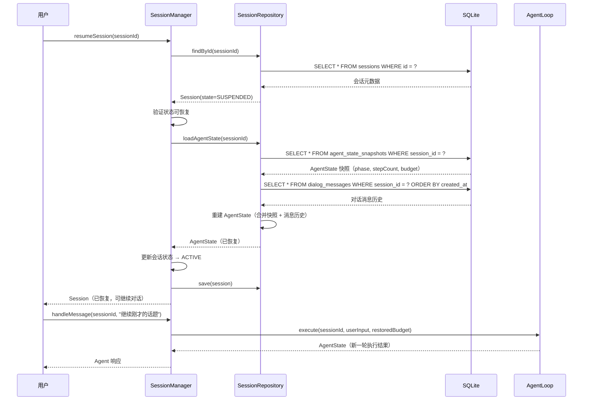

#### SessionRecoveryService — 恢复服务

```java
package com.lifepilot.agent.session;

import com.lifepilot.agent.AgentState;
import org.slf4j.Logger;
import org.slf4j.LoggerFactory;
import org.springframework.stereotype.Service;

import java.util.Optional;
import java.util.UUID;

/**
 * 会话恢复服务。
 *
 * <p>封装从 SQLite 重建 AgentState 的完整流程，包括数据完整性校验、
 * 预算有效性验证和降级恢复策略。</p>
 *
 * <p>恢复策略分三级：
 * <ol>
 *   <li>完整恢复：快照 + 消息历史 + 预算全部有效</li>
 *   <li>部分恢复：快照有效但消息历史不完整，使用最近 N 条消息</li>
 *   <li>恢复失败：快照损坏或不存在，标记会话为 COMPLETED</li>
 * </ol>
 * </p>
 */
@Service
public class SessionRecoveryService {

    private static final Logger log = LoggerFactory.getLogger(SessionRecoveryService.class);

    /** 部分恢复时加载的最近消息数量。 */
    private static final int FALLBACK_MESSAGE_COUNT = 20;

    private final SessionRepository repository;
    private final DialogMessageStore messageStore;

    public SessionRecoveryService(SessionRepository repository, DialogMessageStore messageStore) {
        this.repository = repository;
        this.messageStore = messageStore;
    }

    /**
     * 尝试恢复会话的 AgentState。
     *
     * <p>按完整恢复 → 部分恢复 → 恢复失败的优先级依次尝试。</p>
     *
     * @param sessionId 目标会话 ID
     * @return 恢复的 AgentState，恢复失败时返回 empty
     */
    public Optional<AgentState> recover(UUID sessionId) {
        log.info("开始恢复会话: sessionId={}", sessionId);

        // 尝试完整恢复
        var fullRecovery = repository.loadAgentState(sessionId);
        if (fullRecovery.isPresent()) {
            var state = fullRecovery.get();
            if (validateRecoveredState(state)) {
                log.info("会话完整恢复成功: sessionId={}, step={}", sessionId, state.stepCount());
                return fullRecovery;
            }
            log.warn("完整恢复的状态校验失败，尝试部分恢复: sessionId={}", sessionId);
        }

        // 尝试部分恢复：仅加载最近消息
        return attemptPartialRecovery(sessionId);
    }

    /** 部分恢复：从最近消息重建最小可用状态。 */
    private Optional<AgentState> attemptPartialRecovery(UUID sessionId) {
        try {
            var recentMessages = messageStore.findRecentMessages(sessionId, FALLBACK_MESSAGE_COUNT);
            if (recentMessages.isEmpty()) {
                log.error("部分恢复失败，无可用消息: sessionId={}", sessionId);
                return Optional.empty();
            }

            var session = repository.findById(sessionId).orElse(null);
            if (session == null) {
                return Optional.empty();
            }

            // 使用默认预算和初始阶段创建最小可用状态
            var state = AgentState.initial(sessionId, session.budget());
            log.warn("会话部分恢复: sessionId={}, messageCount={}", sessionId, recentMessages.size());
            return Optional.of(state);
        } catch (Exception e) {
            log.error("部分恢复异常: sessionId={}", sessionId, e);
            return Optional.empty();
        }
    }

    /** 校验恢复的 AgentState 是否有效。 */
    private boolean validateRecoveredState(AgentState state) {
        // 预算不能已耗尽
        if (state.isBudgetExhausted()) {
            log.warn("恢复的状态预算已耗尽: sessionId={}", state.sessionId());
            return false;
        }
        // 不能处于终止状态
        if (state.isTerminated()) {
            log.warn("恢复的状态已终止: sessionId={}", state.sessionId());
            return false;
        }
        return true;
    }
}
```

### 9.6 会话超时与清理策略

长时间空闲的会话会占用内存资源（`ConcurrentHashMap` 中的活跃索引）和 SQLite 存储空间。ZhiWei 通过可配置的超时策略自动管理会话生命周期，包括空闲挂起、过期归档和历史清理。

#### YAML 配置

```yaml
lifepilot:
  session:
    # 空闲超时：活跃会话超过此时长无新消息，自动挂起
    idle-timeout: 30m

    # 挂起保留期：挂起会话超过此时长未恢复，自动归档
    suspend-retention: 7d

    # 归档保留期：归档会话超过此时长，清理详细消息（仅保留摘要）
    archive-retention: 90d

    # 最大活跃会话数：超过此数量时，最久未活跃的会话自动挂起
    max-active-sessions: 50

    # 清理任务执行间隔
    cleanup-interval: 5m

    # 会话默认预算
    default-budget:
      max-steps: 20
      max-tokens: 16000
      max-cost-cents: 50
      max-duration: 5m
```

#### SessionConfig — 配置绑定

```java
package com.lifepilot.agent.session;

import org.springframework.boot.context.properties.ConfigurationProperties;

import java.time.Duration;

/**
 * 会话管理配置。
 *
 * <p>通过 Spring Boot {@code @ConfigurationProperties} 绑定 YAML 配置，
 * 所有时长字段使用 {@link Duration} 类型，支持 {@code 30m}、{@code 7d} 等自然格式。</p>
 */
@ConfigurationProperties(prefix = "lifepilot.session")
public record SessionConfig(
        /** 空闲超时时长，默认 30 分钟。 */
        Duration idleTimeout,

        /** 挂起保留期，默认 7 天。 */
        Duration suspendRetention,

        /** 归档保留期，默认 90 天。 */
        Duration archiveRetention,

        /** 最大活跃会话数，默认 50。 */
        int maxActiveSessions,

        /** 清理任务执行间隔，默认 5 分钟。 */
        Duration cleanupInterval,

        /** 会话默认预算配置。 */
        DefaultBudgetConfig defaultBudget
) {
    /** 提供默认值的紧凑构造器。 */
    public SessionConfig {
        if (idleTimeout == null) idleTimeout = Duration.ofMinutes(30);
        if (suspendRetention == null) suspendRetention = Duration.ofDays(7);
        if (archiveRetention == null) archiveRetention = Duration.ofDays(90);
        if (maxActiveSessions <= 0) maxActiveSessions = 50;
        if (cleanupInterval == null) cleanupInterval = Duration.ofMinutes(5);
        if (defaultBudget == null) defaultBudget = new DefaultBudgetConfig(20, 16000, 50, Duration.ofMinutes(5));
    }

    /** 默认预算配置。 */
    public record DefaultBudgetConfig(
            int maxSteps,
            int maxTokens,
            int maxCostCents,
            Duration maxDuration
    ) {}
}
```

#### SessionCleanupTask — 定时清理任务

```java
package com.lifepilot.agent.session;

import org.slf4j.Logger;
import org.slf4j.LoggerFactory;
import org.springframework.scheduling.annotation.Scheduled;
import org.springframework.stereotype.Component;

import java.time.Instant;
import java.util.Comparator;

/**
 * 会话清理定时任务。
 *
 * <p>周期性执行以下清理策略：
 * <ol>
 *   <li>空闲挂起：将超过 {@code idle-timeout} 的活跃会话自动挂起</li>
 *   <li>过期归档：将超过 {@code suspend-retention} 的挂起会话归档</li>
 *   <li>历史清理：清理超过 {@code archive-retention} 的归档会话详细消息</li>
 *   <li>容量控制：当活跃会话数超过上限时，挂起最久未活跃的会话</li>
 * </ol>
 * </p>
 *
 * <p>使用 Virtual Thread 执行，避免阻塞调度线程池。</p>
 */
@Component
public class SessionCleanupTask {

    private static final Logger log = LoggerFactory.getLogger(SessionCleanupTask.class);

    private final SessionManager sessionManager;
    private final SessionRepository repository;
    private final SessionConfig config;

    public SessionCleanupTask(
            SessionManager sessionManager,
            SessionRepository repository,
            SessionConfig config
    ) {
        this.sessionManager = sessionManager;
        this.repository = repository;
        this.config = config;
    }

    /** 定时执行清理任务，间隔由配置决定。 */
    @Scheduled(fixedDelayString = "${lifepilot.session.cleanup-interval:PT5M}")
    public void cleanup() {
        log.debug("会话清理任务开始执行");

        int suspended = suspendIdleSessions();
        int archived = archiveExpiredSessions();
        int cleaned = cleanupOldArchives();
        int evicted = enforceCapacityLimit();

        if (suspended + archived + cleaned + evicted > 0) {
            log.info("会话清理完成: 挂起={}, 归档={}, 清理={}, 驱逐={}",
                    suspended, archived, cleaned, evicted);
        }
    }

    /** 挂起空闲超时的活跃会话。 */
    private int suspendIdleSessions() {
        var threshold = Instant.now().minus(config.idleTimeout());
        var idleSessions = repository.findIdleSessions(threshold);

        for (var session : idleSessions) {
            try {
                sessionManager.suspendSession(session.id());
            } catch (Exception e) {
                log.warn("自动挂起失败: sessionId={}, error={}", session.id(), e.getMessage());
            }
        }
        return idleSessions.size();
    }

    /** 归档超过保留期的挂起会话。 */
    private int archiveExpiredSessions() {
        var threshold = Instant.now().minus(config.suspendRetention());
        var expired = repository.findByState(SessionState.SUSPENDED).stream()
                .filter(s -> s.suspendedAt()
                        .map(t -> t.isBefore(threshold))
                        .orElse(false))
                .toList();

        for (var session : expired) {
            try {
                var archived = session.toBuilder()
                        .state(SessionState.ARCHIVED)
                        .updatedAt(Instant.now())
                        .build();
                repository.save(archived);
            } catch (Exception e) {
                log.warn("自动归档失败: sessionId={}, error={}", session.id(), e.getMessage());
            }
        }
        return expired.size();
    }

    /** 清理超过归档保留期的会话详细消息。 */
    private int cleanupOldArchives() {
        // 仅删除详细消息，保留会话元数据用于统计
        var threshold = Instant.now().minus(config.archiveRetention());
        var oldArchives = repository.findByState(SessionState.ARCHIVED).stream()
                .filter(s -> s.completedAt()
                        .map(t -> t.isBefore(threshold))
                        .orElse(s.updatedAt().isBefore(threshold)))
                .toList();

        for (var session : oldArchives) {
            repository.deleteMessagesBySessionId(session.id());
            repository.deleteAgentStateSnapshot(session.id());
        }
        return oldArchives.size();
    }

    /** 当活跃会话数超过上限时，驱逐最久未活跃的会话。 */
    private int enforceCapacityLimit() {
        var activeSessions = sessionManager.listActiveSessions();
        int excess = activeSessions.size() - config.maxActiveSessions();
        if (excess <= 0) return 0;

        // 按最后活跃时间排序，驱逐最久未活跃的
        var toEvict = activeSessions.stream()
                .sorted(Comparator.comparing(Session::lastActiveAt))
                .limit(excess)
                .toList();

        for (var session : toEvict) {
            try {
                sessionManager.suspendSession(session.id());
                log.info("容量驱逐: sessionId={}, lastActive={}", session.id(), session.lastActiveAt());
            } catch (Exception e) {
                log.warn("容量驱逐失败: sessionId={}, error={}", session.id(), e.getMessage());
            }
        }
        return toEvict.size();
    }
}
```

### 9.7 多会话并发

ZhiWei 作为本地优先的个人 AI 助手，虽然主要服务单用户，但需要支持多会话并发场景：用户可能同时在 CLI 和 Web UI 中各开一个会话，或者一个前台会话正在交互的同时，后台有定时触发的主动推理会话在运行。

多会话并发的核心设计原则：**每个会话运行在独立的 Virtual Thread 上，通过不可变状态和 ConcurrentHashMap 实现零锁竞争的会话隔离。**

#### 并发模型

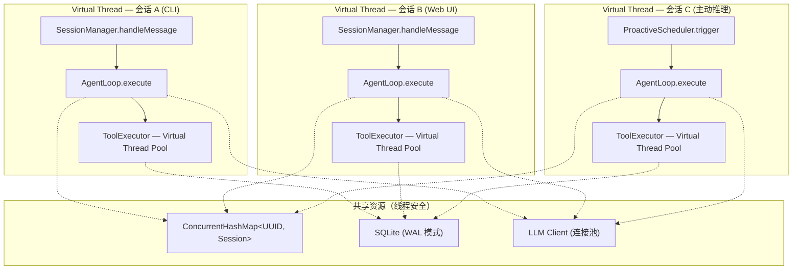

#### 会话隔离保证

多会话并发的正确性依赖以下四层隔离机制：

| 隔离层 | 机制 | 保证 |
|--------|------|------|
| 状态隔离 | `AgentState` 不可变 record | 会话 A 的状态变更不会影响会话 B |
| 内存索引隔离 | `ConcurrentHashMap.compute()` 原子操作 | 单个会话的状态转换是原子的 |
| 持久化隔离 | SQLite WAL 模式 + `session_id` 外键 | 并发读不阻塞，写操作按会话隔离 |
| 预算隔离 | 每个会话独立的 `Budget` 实例 | 会话 A 的 Token 消耗不影响会话 B 的预算 |

#### ConcurrentSessionExecutor — 并发会话执行器

```java
package com.lifepilot.agent.session;

import com.lifepilot.agent.AgentState;
import org.slf4j.Logger;
import org.slf4j.LoggerFactory;
import org.springframework.stereotype.Component;

import java.util.UUID;
import java.util.concurrent.CompletableFuture;
import java.util.concurrent.ConcurrentHashMap;
import java.util.concurrent.ExecutorService;
import java.util.concurrent.Executors;

/**
 * 并发会话执行器。
 *
 * <p>使用 Virtual Thread 执行器管理多会话的并发执行。每个会话的 AgentLoop
 * 运行在独立的 Virtual Thread 上，通过 {@link CompletableFuture} 提供异步结果。</p>
 *
 * <p>关键设计：
 * <ul>
 *   <li>Virtual Thread 执行器：无固定线程池大小限制，按需创建轻量级线程</li>
 *   <li>会话级互斥：同一会话的多条消息串行处理，不同会话完全并行</li>
 *   <li>优雅关闭：应用停止时等待所有活跃会话完成当前步骤</li>
 * </ul>
 * </p>
 */
@Component
public class ConcurrentSessionExecutor {

    private static final Logger log = LoggerFactory.getLogger(ConcurrentSessionExecutor.class);

    /** Virtual Thread 执行器，按需创建轻量级线程。 */
    private final ExecutorService virtualThreadExecutor =
            Executors.newVirtualThreadPerTaskExecutor();

    /**
     * 会话级锁：确保同一会话的消息串行处理。
     *
     * <p>使用 {@link CompletableFuture} 链实现：新消息的处理 future
     * 链接到上一条消息的 future 之后，保证顺序执行。</p>
     */
    private final ConcurrentHashMap<UUID, CompletableFuture<AgentState>> sessionFutures =
            new ConcurrentHashMap<>();

    private final SessionManager sessionManager;

    public ConcurrentSessionExecutor(SessionManager sessionManager) {
        this.sessionManager = sessionManager;
    }

    /**
     * 异步提交用户消息到指定会话。
     *
     * <p>同一会话的消息保证串行处理（FIFO），不同会话的消息完全并行。
     * 返回的 {@link CompletableFuture} 在 Agent 执行完成后完成。</p>
     *
     * @param sessionId 目标会话 ID
     * @param userInput 用户输入文本
     * @return 异步执行结果
     */
    public CompletableFuture<AgentState> submitMessage(UUID sessionId, String userInput) {
        log.debug("提交消息到会话: sessionId={}, inputLength={}", sessionId, userInput.length());

        return sessionFutures.compute(sessionId, (id, previousFuture) -> {
            // 链接到上一条消息的 future 之后，保证串行
            var baseFuture = (previousFuture != null && !previousFuture.isDone())
                    ? previousFuture
                    : CompletableFuture.completedFuture((AgentState) null);

            return baseFuture.thenApplyAsync(
                    _prev -> {
                        try {
                            return sessionManager.handleMessage(id, userInput);
                        } catch (Exception e) {
                            log.error("会话消息处理失败: sessionId={}, error={}", id, e.getMessage(), e);
                            throw new SessionExecutionException("会话执行失败: " + id, e);
                        }
                    },
                    virtualThreadExecutor
            );
        });
    }

    /**
     * 获取会话当前的执行状态。
     *
     * @param sessionId 目标会话 ID
     * @return true 表示会话有正在执行的 AgentLoop
     */
    public boolean isExecuting(UUID sessionId) {
        var future = sessionFutures.get(sessionId);
        return future != null && !future.isDone();
    }

    /**
     * 取消会话的当前执行（尽力而为）。
     *
     * <p>由于 AgentLoop 内部通过预算机制控制终止，取消操作实际上是
     * 将会话预算设为耗尽，触发 AgentLoop 在下一步检查时自然终止。</p>
     *
     * @param sessionId 目标会话 ID
     */
    public void cancelExecution(UUID sessionId) {
        var future = sessionFutures.get(sessionId);
        if (future != null && !future.isDone()) {
            future.cancel(true);
            log.info("会话执行已请求取消: sessionId={}", sessionId);
        }
    }

    /**
     * 优雅关闭：等待所有活跃会话完成当前步骤。
     *
     * <p>在应用关闭时调用，给予活跃会话最多 30 秒完成当前 AgentLoop 步骤，
     * 超时后强制挂起所有未完成的会话。</p>
     */
    public void shutdown() {
        log.info("并发执行器开始优雅关闭: activeSessions={}", sessionFutures.size());

        // 等待所有活跃 future 完成（最多 30 秒）
        var activeFutures = sessionFutures.values().stream()
                .filter(f -> !f.isDone())
                .toList();

        var allDone = CompletableFuture.allOf(activeFutures.toArray(CompletableFuture[]::new));
        try {
            allDone.get(30, java.util.concurrent.TimeUnit.SECONDS);
            log.info("所有活跃会话已正常完成");
        } catch (Exception e) {
            log.warn("等待活跃会话超时，强制挂起未完成的会话: count={}", activeFutures.size());
            // 强制挂起未完成的会话
            sessionFutures.forEach((id, future) -> {
                if (!future.isDone()) {
                    try {
                        sessionManager.suspendSession(id);
                    } catch (Exception ex) {
                        log.error("强制挂起失败: sessionId={}", id, ex);
                    }
                }
            });
        }

        virtualThreadExecutor.close();
        sessionFutures.clear();
    }
}
```

#### Virtual Thread 的选择理由

ZhiWei 选择 Virtual Thread 而非传统线程池管理会话并发，基于以下考量：

| 维度 | 传统线程池 | Virtual Thread |
|------|-----------|----------------|
| 会话数扩展 | 受限于线程池大小（通常 10-50） | 可支持数千并发会话 |
| I/O 阻塞 | 阻塞平台线程，浪费资源 | 阻塞时自动让出载体线程 |
| 内存开销 | 每线程 ~1MB 栈空间 | 每线程 ~几 KB |
| 代码复杂度 | 需要手动管理线程池、队列、拒绝策略 | 直接使用 `Executors.newVirtualThreadPerTaskExecutor()` |
| 调试友好 | 线程转储中线程名有意义 | 同样支持线程转储和 JFR 事件 |

对于 ZhiWei 的典型场景（单用户、1-5 个并发会话、每个会话包含多次 LLM 调用和工具执行），Virtual Thread 的优势在于：

1. **LLM 调用是 I/O 密集型**：每次 LLM 调用耗时 1-10 秒，Virtual Thread 在等待响应时不占用平台线程
2. **工具调用可能阻塞**：MCP 工具、HTTP 请求、文件操作都是阻塞 I/O，Virtual Thread 天然适配
3. **代码简洁**：无需 `@Async` 注解或手动管理 `ExecutorService` 生命周期，`try-with-resources` 即可管理 `StructuredTaskScope`

> **注意**：SQLite 的写操作是串行的（即使在 WAL 模式下），因此多会话并发写入时会通过 `busy_timeout=5000` 自动等待。这在单用户场景下不构成瓶颈，但如果未来扩展到多用户场景，需要考虑引入写入队列或切换到 PostgreSQL。


---

## 10. 并发模型与 Virtual Thread

> **核心问题**：Agent 引擎的工作负载本质上是 I/O 密集型的——LLM 调用、MCP 工具执行、知识库检索、外部 HTTP 请求，每一步都涉及网络等待。传统的线程池模型在面对大量阻塞 I/O 时迅速耗尽平台线程，而响应式编程（WebFlux）虽然解决了线程利用率问题，却以代码可读性和调试体验为代价。Java 22 的 Virtual Thread（JEP 444）和结构化并发（JEP 505 预览）为 ZhiWei 提供了第三条路径：**用同步代码的写法获得异步代码的性能**。

本节深入阐述 ZhiWei 的并发架构，从技术选型理由到具体实现模式，再到已知陷阱的规避策略。

### 10.1 为什么选择 Virtual Thread

#### 10.1.1 三种并发模型的对比

在设计 Agent 引擎的并发模型时，我们评估了三种主流方案：

| 维度 | 传统线程池 (`ExecutorService`) | 响应式 (WebFlux / Reactor) | Virtual Thread (JEP 444) |
|------|------|------|------|
| **编程模型** | 阻塞式，直观 | 非阻塞链式，陡峭学习曲线 | 阻塞式，直观 |
| **线程开销** | ~1MB 栈 / 线程 | 极低（事件循环） | ~几 KB / 虚拟线程 |
| **I/O 阻塞时** | 占用平台线程 | 不阻塞事件循环 | 自动让出载体线程 |
| **调试体验** | 线程转储清晰 | 堆栈断裂，难以追踪 | 线程转储清晰，支持 JFR |
| **异常处理** | try-catch 自然 | onErrorResume 链式 | try-catch 自然 |
| **并发上限** | 受线程池大小限制 | 理论无限（受内存限制） | 百万级虚拟线程 |
| **生态兼容** | 完全兼容 | 需要全链路非阻塞 | 兼容大部分阻塞库 |
| **结构化并发** | 无原生支持 | 无原生支持 | `StructuredTaskScope` |


#### 10.1.2 Agent 工作负载特征分析

ZhiWei Agent 引擎的典型工作负载具有以下特征，这些特征决定了 Virtual Thread 是最优选择：

```
┌─────────────────────────────────────────────────────────────────┐
│              Agent 单步执行时间分布（典型场景）                     │
│                                                                   │
│  ContextAssembler (CPU)     ██ 5ms                               │
│  LLM 调用 (I/O)            ████████████████████████████ 2000ms   │
│  GuardrailEngine (CPU)      █ 2ms                                │
│  Tool 执行 (I/O)           ████████████████ 800ms                │
│  StateReducer (CPU)         █ 1ms                                │
│  TraceRecorder (I/O)        ██ 15ms                              │
│                                                                   │
│  CPU 时间占比: ~0.3%    I/O 等待占比: ~99.7%                      │
│                                                                   │
│  结论: 极端 I/O 密集型，Virtual Thread 的最佳适用场景              │
└─────────────────────────────────────────────────────────────────┘
```

**关键数据点**：

- 单次 LLM 调用延迟：500ms ~ 10s（取决于模型和 Token 数量）
- 单次 MCP 工具调用延迟：50ms ~ 5s（取决于工具类型）
- 单次知识库向量检索延迟：10ms ~ 100ms
- CPU 计算（状态转换、上下文组装、安全检查）：< 10ms / 步

在这种 I/O 占比超过 99% 的工作负载下：

- **传统线程池**：10 个平台线程的线程池，99.7% 的时间在空等 I/O，实际 CPU 利用率不到 0.3%
- **WebFlux**：虽然不浪费线程，但 Agent 的多步循环逻辑用 Reactor 链式 API 表达极其痛苦，且 Spring AI 的 `ChatClient` 原生支持阻塞调用
- **Virtual Thread**：每个 Agent 会话一个虚拟线程，阻塞 I/O 时自动让出载体线程，代码保持同步风格


#### 10.1.3 基准测试：模拟 Agent 工作负载

以下基准测试模拟了 ZhiWei 的典型场景：多个 Agent 会话并发执行，每个会话包含 3-5 步循环，每步包含一次 LLM 调用（模拟 2s 延迟）和 1-3 次工具调用（模拟 500ms 延迟）。

```java
package com.lifepilot.agent.benchmark;

import java.time.Duration;
import java.time.Instant;
import java.util.concurrent.*;
import java.util.stream.IntStream;

/**
 * Virtual Thread vs 传统线程池基准测试。
 *
 * <p>模拟 Agent 工作负载：每个任务包含多次阻塞 I/O 调用，
 * 对比不同并发模型在吞吐量和资源消耗上的差异。</p>
 */
public class ConcurrencyBenchmark {

    /** 模拟单次 LLM 调用（阻塞 I/O）。 */
    private static String simulateLlmCall() throws InterruptedException {
        Thread.sleep(2000); // 模拟 2 秒网络延迟
        return "LLM 响应内容";
    }

    /** 模拟单次工具调用（阻塞 I/O）。 */
    private static String simulateToolCall(String toolName) throws InterruptedException {
        Thread.sleep(500); // 模拟 500ms 网络延迟
        return toolName + " 执行结果";
    }

    /** 模拟单个 Agent 会话（3 步循环）。 */
    private static void simulateAgentSession() throws InterruptedException {
        for (int step = 0; step < 3; step++) {
            simulateLlmCall();       // 步骤 1: 调用 LLM
            simulateToolCall("calendar"); // 步骤 2: 调用工具
            simulateToolCall("memory");   // 步骤 3: 调用工具
        }
    }

    /**
     * 基准测试入口。
     *
     * <p>分别使用固定线程池和 Virtual Thread 执行 50 个并发 Agent 会话，
     * 对比总耗时和峰值线程数。</p>
     */
    public static void main(String[] args) throws Exception {
        int sessionCount = 50;

        // --- 传统线程池 ---
        var fixedPool = Executors.newFixedThreadPool(20);
        var start1 = Instant.now();
        var futures1 = IntStream.range(0, sessionCount)
                .mapToObj(i -> fixedPool.submit(() -> {
                    simulateAgentSession();
                    return null;
                }))
                .toList();
        for (var f : futures1) f.get();
        var elapsed1 = Duration.between(start1, Instant.now());
        fixedPool.shutdown();

        // --- Virtual Thread ---
        var start2 = Instant.now();
        try (var vtExecutor = Executors.newVirtualThreadPerTaskExecutor()) {
            var futures2 = IntStream.range(0, sessionCount)
                    .mapToObj(i -> vtExecutor.submit(() -> {
                        simulateAgentSession();
                        return null;
                    }))
                    .toList();
            for (var f : futures2) f.get();
        }
        var elapsed2 = Duration.between(start2, Instant.now());

        System.out.println("传统线程池 (20 线程): " + elapsed1.toMillis() + "ms");
        System.out.println("Virtual Thread:       " + elapsed2.toMillis() + "ms");
    }
}
```

**预期基准测试结果**（50 个并发 Agent 会话，每会话 3 步 × 3 次 I/O）：

| 指标 | 固定线程池 (20 线程) | Virtual Thread |
|------|---------------------|----------------|
| 总耗时 | ~27s（受限于 20 线程并发度） | ~9s（50 会话完全并行） |
| 峰值平台线程数 | 20 | ~CPU 核心数（载体线程） |
| 内存开销 | ~20MB（20 × 1MB 栈） | ~500KB（50 × ~10KB） |
| 代码复杂度 | 需管理线程池大小、拒绝策略 | `try-with-resources` 即可 |

> **参考**：JEP 444（Virtual Threads，Java 21 正式发布）定义了虚拟线程的核心语义——虚拟线程在执行阻塞 I/O 操作时自动从载体线程（carrier thread）卸载，载体线程可以继续执行其他虚拟线程。JEP 505（Structured Concurrency，Java 23 第四次预览）提供了 `StructuredTaskScope`，用于管理虚拟线程的父子关系和生命周期。ZhiWei 基于 Java 22，使用 `--enable-preview` 启用结构化并发特性。


### 10.2 StructuredTaskScope — 结构化并发

#### 10.2.1 为什么需要结构化并发

在传统并发模型中，父任务启动子任务后，两者的生命周期是独立的——父任务可能已经结束（甚至异常终止），子任务仍在后台运行，消耗资源、产生副作用、甚至修改已失效的状态。这种"发射后不管"（fire-and-forget）的模式是并发 Bug 的温床。

结构化并发（Structured Concurrency，JEP 505）的核心理念是：**子任务的生命周期不能超过父任务**。这与结构化编程中"子程序的生命周期不能超过调用者"的原则一脉相承。

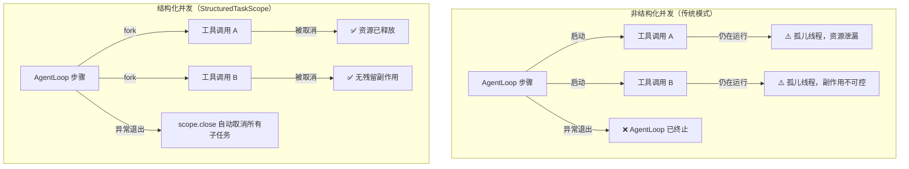


在 ZhiWei 中，结构化并发的典型应用场景是 **Agent 单步内的并行工具调用**。当 LLM 在一次响应中请求调用多个工具（例如同时查询日历和知识库），这些工具调用应当并行执行以减少延迟，但必须在当前步骤结束前全部完成或取消。

#### 10.2.2 ParallelToolExecutor — 并行工具执行器

`ParallelToolExecutor` 是 ZhiWei 中结构化并发的核心实现。它使用 `StructuredTaskScope` 管理并行工具调用的完整生命周期，提供超时控制、错误隔离和结果聚合能力。

```java
package com.lifepilot.agent.tool;

import com.lifepilot.agent.AgentContext;
import com.lifepilot.agent.ToolCall;
import com.lifepilot.agent.ToolResult;
import org.slf4j.Logger;
import org.slf4j.LoggerFactory;
import org.springframework.stereotype.Component;

import java.time.Duration;
import java.time.Instant;
import java.util.ArrayList;
import java.util.List;
import java.util.concurrent.StructuredTaskScope;
import java.util.concurrent.TimeoutException;

/**
 * 基于结构化并发的并行工具执行器。
 *
 * <p>核心职责：
 * <ul>
 *   <li>将多个工具调用分发到独立的虚拟线程并行执行</li>
 *   <li>通过 {@link StructuredTaskScope} 保证所有子任务的生命周期不超过父任务</li>
 *   <li>提供全局超时控制，防止单个慢工具拖垮整个步骤</li>
 *   <li>错误隔离：单个工具失败不影响其他工具的执行结果</li>
 * </ul>
 * </p>
 *
 * <p>线程模型：每个工具调用在独立的虚拟线程中执行，
 * 父任务通过 {@code scope.join()} 等待所有子任务完成。
 * 如果父任务被中断或超时，所有子任务自动取消。</p>
 */
@Component
public class ParallelToolExecutor {

    private static final Logger log = LoggerFactory.getLogger(ParallelToolExecutor.class);

    /** 单个工具调用的默认超时时间。 */
    private static final Duration TOOL_TIMEOUT = Duration.ofSeconds(30);

    /** 整批工具调用的全局超时时间。 */
    private static final Duration BATCH_TIMEOUT = Duration.ofSeconds(60);

    private final ToolRegistry toolRegistry;

    public ParallelToolExecutor(ToolRegistry toolRegistry) {
        this.toolRegistry = toolRegistry;
    }

    /**
     * 并行执行多个工具调用（ShutdownOnFailure 模式）。
     *
     * <p>使用 {@link StructuredTaskScope.ShutdownOnFailure} 策略：
     * 任意一个工具调用抛出异常时，立即取消所有其他子任务并传播异常。
     * 适用于所有工具调用结果都是必需的场景（例如多步计划中的依赖调用）。</p>
     *
     * @param toolCalls 待执行的工具调用列表
     * @return 所有工具调用的结果列表，顺序与输入一致
     * @throws ToolExecutionException 当任意工具调用失败时抛出
     */
    public List<ToolResult> executeAllOrFail(List<ToolCall> toolCalls) {
        log.info("开始并行工具调用（全部成功模式）: count={}", toolCalls.size());
        var startTime = Instant.now();

        try (var scope = new StructuredTaskScope.ShutdownOnFailure()) {
            // 为每个工具调用 fork 一个虚拟线程
            var subtasks = toolCalls.stream()
                    .map(call -> scope.fork(() -> executeSingleTool(call)))
                    .toList();

            // 等待所有子任务完成，受全局超时约束
            scope.joinUntil(Instant.now().plus(BATCH_TIMEOUT));

            // 如果有任何子任务失败，抛出第一个异常
            scope.throwIfFailed();

            // 收集所有结果
            var results = subtasks.stream()
                    .map(StructuredTaskScope.Subtask::get)
                    .toList();

            var elapsed = Duration.between(startTime, Instant.now());
            log.info("并行工具调用全部完成: count={}, elapsed={}ms",
                    results.size(), elapsed.toMillis());
            return List.copyOf(results);

        } catch (TimeoutException e) {
            log.error("并行工具调用全局超时: timeout={}s", BATCH_TIMEOUT.toSeconds());
            throw new ToolExecutionException("工具调用批次超时（" + BATCH_TIMEOUT.toSeconds() + "秒）");
        } catch (InterruptedException e) {
            Thread.currentThread().interrupt();
            throw new ToolExecutionException("工具调用被中断");
        } catch (Exception e) {
            throw new ToolExecutionException("工具调用执行失败: " + e.getMessage(), e);
        }
    }

    /**
     * 并行执行多个工具调用（尽力而为模式）。
     *
     * <p>与 {@link #executeAllOrFail} 不同，此方法不会因单个工具失败而取消其他工具。
     * 每个工具调用独立执行，失败的工具返回错误结果而非抛出异常。
     * 适用于工具调用之间相互独立的场景（例如同时查询日历和天气）。</p>
     *
     * @param toolCalls 待执行的工具调用列表
     * @return 所有工具调用的结果列表（包含成功和失败），顺序与输入一致
     */
    public List<ToolResult> executeBestEffort(List<ToolCall> toolCalls) {
        log.info("开始并行工具调用（尽力而为模式）: count={}", toolCalls.size());
        var startTime = Instant.now();

        // 尽力而为模式：每个工具调用内部捕获异常，不传播
        try (var scope = new StructuredTaskScope<ToolResult>()) {
            var subtasks = toolCalls.stream()
                    .map(call -> scope.fork(() -> executeSingleToolSafe(call)))
                    .toList();

            scope.joinUntil(Instant.now().plus(BATCH_TIMEOUT));

            var results = subtasks.stream()
                    .map(subtask -> switch (subtask.state()) {
                        case SUCCESS -> subtask.get();
                        case FAILED -> ToolResult.error(
                                "工具执行异常: " + subtask.exception().getMessage());
                        case UNAVAILABLE -> ToolResult.error("工具调用被取消");
                    })
                    .toList();

            var elapsed = Duration.between(startTime, Instant.now());
            var successCount = results.stream().filter(ToolResult::isSuccess).count();
            log.info("并行工具调用完成（尽力而为）: total={}, success={}, failed={}, elapsed={}ms",
                    results.size(), successCount, results.size() - successCount, elapsed.toMillis());
            return List.copyOf(results);

        } catch (TimeoutException e) {
            log.error("并行工具调用全局超时（尽力而为模式）: timeout={}s", BATCH_TIMEOUT.toSeconds());
            // 超时时返回已完成的结果 + 超时错误
            return toolCalls.stream()
                    .map(call -> ToolResult.error("工具调用超时: " + call.name()))
                    .toList();
        } catch (InterruptedException e) {
            Thread.currentThread().interrupt();
            return toolCalls.stream()
                    .map(call -> ToolResult.error("工具调用被中断: " + call.name()))
                    .toList();
        }
    }

    /**
     * 竞速执行：多个等价工具调用，取最快返回的结果。
     *
     * <p>使用 {@link StructuredTaskScope.ShutdownOnSuccess} 策略：
     * 第一个成功完成的子任务返回后，立即取消所有其他子任务。
     * 适用于多 LLM 提供商故障转移场景（同时调用多个提供商，取最快响应）。</p>
     *
     * @param toolCalls 等价的工具调用列表（任意一个成功即可）
     * @return 最先成功完成的工具调用结果
     * @throws ToolExecutionException 当所有工具调用都失败时抛出
     */
    public ToolResult executeRace(List<ToolCall> toolCalls) {
        log.info("开始竞速工具调用: count={}", toolCalls.size());

        try (var scope = new StructuredTaskScope.ShutdownOnSuccess<ToolResult>()) {
            toolCalls.forEach(call -> scope.fork(() -> executeSingleTool(call)));

            scope.joinUntil(Instant.now().plus(BATCH_TIMEOUT));

            var result = scope.result();
            log.info("竞速工具调用完成: winner={}", result.toolName());
            return result;

        } catch (TimeoutException e) {
            throw new ToolExecutionException("竞速工具调用全部超时");
        } catch (InterruptedException e) {
            Thread.currentThread().interrupt();
            throw new ToolExecutionException("竞速工具调用被中断");
        } catch (Exception e) {
            throw new ToolExecutionException("竞速工具调用全部失败: " + e.getMessage(), e);
        }
    }

    /**
     * 执行单个工具调用（允许抛出异常）。
     *
     * <p>从注册表查找工具实现，校验参数，执行调用，记录耗时。
     * 单个工具调用受 {@link #TOOL_TIMEOUT} 超时约束。</p>
     */
    private ToolResult executeSingleTool(ToolCall call) {
        log.debug("执行工具调用: name={}, params={}", call.name(), call.parameters());
        var startTime = Instant.now();

        var tool = toolRegistry.resolve(call.name())
                .orElseThrow(() -> new ToolExecutionException(
                        "工具未注册: " + call.name()));

        tool.validateParameters(call.parameters());

        var result = tool.execute(call.parameters());
        var elapsed = Duration.between(startTime, Instant.now());
        log.debug("工具调用完成: name={}, elapsed={}ms", call.name(), elapsed.toMillis());

        return result;
    }

    /**
     * 安全执行单个工具调用（内部捕获异常，不传播）。
     *
     * <p>用于尽力而为模式，将异常转换为错误结果。</p>
     */
    private ToolResult executeSingleToolSafe(ToolCall call) {
        try {
            return executeSingleTool(call);
        } catch (Exception e) {
            log.warn("工具调用失败（安全模式）: name={}, error={}", call.name(), e.getMessage());
            return ToolResult.error("工具 " + call.name() + " 执行失败: " + e.getMessage());
        }
    }
}
```


#### 10.2.3 三种 Scope 策略的选择指南

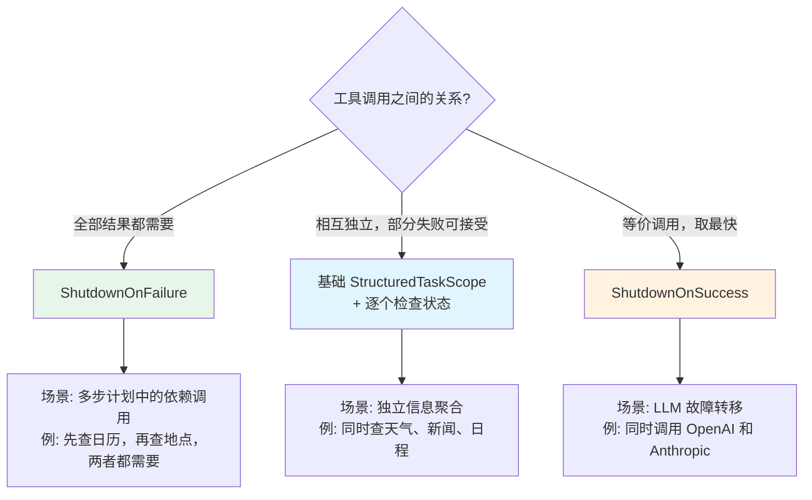

| 策略 | 语义 | 失败行为 | ZhiWei 使用场景 |
|------|------|---------|-------------------|
| `ShutdownOnFailure` | 全部成功或全部取消 | 任一失败 → 取消其余 → 抛出异常 | 依赖性工具调用（日历+地点） |
| 基础 `StructuredTaskScope` | 等待全部完成 | 逐个检查成功/失败 | 独立工具调用（天气+新闻+日程） |
| `ShutdownOnSuccess` | 竞速，取最快 | 首个成功 → 取消其余 → 返回结果 | LLM 多提供商故障转移 |


### 10.3 ScopedValue — 作用域值传递

#### 10.3.1 为什么 ThreadLocal 在 Virtual Thread 时代失效

`ThreadLocal` 是 Java 中传递线程上下文（如请求 ID、用户身份、事务信息）的传统方式。然而，在 Virtual Thread 环境下，`ThreadLocal` 存在三个严重问题：

1. **内存泄漏风险**：Virtual Thread 的数量可达百万级，每个虚拟线程持有独立的 `ThreadLocal` 副本，内存消耗不可控
2. **语义不匹配**：`ThreadLocal` 的生命周期绑定到线程，而非任务。当虚拟线程被复用时（虽然当前实现不复用），`ThreadLocal` 的值可能泄漏到不相关的任务
3. **父子传递缺失**：`ThreadLocal` 不会自动从父线程传递到子线程（`InheritableThreadLocal` 虽然可以，但在 Virtual Thread 中会导致每个子线程拷贝整个 `ThreadLocal` 映射表，开销巨大）

`ScopedValue`（JEP 487，Java 23 预览）提供了更安全、更高效的替代方案：

| 维度 | `ThreadLocal` | `ScopedValue` |
|------|--------------|---------------|
| 可变性 | 可读可写 | 只读（绑定后不可修改） |
| 生命周期 | 绑定到线程 | 绑定到作用域（`runWhere` 块） |
| 继承 | 需要 `InheritableThreadLocal` | 自动对 `StructuredTaskScope` 子任务可见 |
| 内存模型 | 每线程一份拷贝 | 栈帧绑定，作用域结束自动释放 |
| 性能 | 哈希表查找 | 接近局部变量的访问速度 |


#### 10.3.2 AgentContext — 作用域值载体

ZhiWei 定义了 `AgentContext` 作为 Agent 执行过程中所有上下文信息的载体。通过 `ScopedValue`，这些上下文信息在整个 Agent 循环（包括并行工具调用的子虚拟线程）中自动可见，无需显式传递。

```java
package com.lifepilot.agent.context;

import com.lifepilot.agent.Budget;

import java.util.UUID;

/**
 * Agent 执行上下文的作用域值载体。
 *
 * <p>通过 {@link ScopedValue} 在 Agent 循环的整个执行作用域内传递上下文信息，
 * 包括会话标识、追踪标识、预算引用等。所有在 {@code ScopedValue.runWhere()} 
 * 块内启动的虚拟线程（包括 {@code StructuredTaskScope.fork()} 的子任务）
 * 都能自动访问这些值。</p>
 *
 * <p>设计要点：
 * <ul>
 *   <li>不可变 record，确保上下文信息在传递过程中不被篡改</li>
 *   <li>替代 ThreadLocal，避免 Virtual Thread 环境下的内存泄漏</li>
 *   <li>自动对 StructuredTaskScope 子任务可见，无需手动传递</li>
 * </ul>
 * </p>
 *
 * @param sessionId 当前会话唯一标识
 * @param traceId   分布式追踪标识，贯穿整个请求链路
 * @param userId    当前用户标识（ZhiWei 单用户场景下通常为默认值）
 * @param budget    当前预算快照的引用（只读）
 */
public record AgentContext(
        UUID sessionId,
        String traceId,
        String userId,
        Budget budget
) {
    /** 用于传递 AgentContext 的 ScopedValue 实例。 */
    public static final ScopedValue<AgentContext> CURRENT = ScopedValue.newInstance();

    /**
     * 获取当前作用域内的 AgentContext。
     *
     * @return 当前上下文
     * @throws java.util.NoSuchElementException 如果在 ScopedValue 作用域外调用
     */
    public static AgentContext current() {
        return CURRENT.get();
    }

    /**
     * 安全获取当前作用域内的 AgentContext。
     *
     * @return 当前上下文，如果不在作用域内则返回 empty
     */
    public static java.util.Optional<AgentContext> currentOptional() {
        return CURRENT.isBound() ? java.util.Optional.of(CURRENT.get()) : java.util.Optional.empty();
    }
}
```


#### 10.3.3 AgentLoop 与 ScopedValue 的集成

以下展示 `AgentLoop` 如何在执行入口处绑定 `ScopedValue`，使得整个循环（包括并行工具调用的子虚拟线程）都能访问上下文信息：

```java
package com.lifepilot.agent;

import com.lifepilot.agent.context.AgentContext;
import org.slf4j.Logger;
import org.slf4j.LoggerFactory;

import java.util.UUID;

/**
 * AgentLoop 中 ScopedValue 绑定的关键代码片段。
 *
 * <p>展示如何在 Agent 循环入口处通过 {@code ScopedValue.runWhere()} 绑定上下文，
 * 使得循环内部所有代码（包括 {@code StructuredTaskScope.fork()} 的子任务）
 * 都能通过 {@code AgentContext.current()} 访问上下文信息。</p>
 */
public class AgentLoopWithScopedValue {

    private static final Logger log = LoggerFactory.getLogger(AgentLoopWithScopedValue.class);

    private final AgentLoop delegate;

    public AgentLoopWithScopedValue(AgentLoop delegate) {
        this.delegate = delegate;
    }

    /**
     * 带作用域上下文的 Agent 循环入口。
     *
     * <p>{@code ScopedValue.runWhere()} 创建一个作用域，在该作用域内：
     * <ul>
     *   <li>{@code AgentContext.current()} 返回绑定的上下文</li>
     *   <li>通过 {@code StructuredTaskScope.fork()} 启动的子虚拟线程自动继承该上下文</li>
     *   <li>作用域结束时，绑定自动解除，无需手动清理</li>
     * </ul>
     * </p>
     */
    public AgentState execute(UUID sessionId, String userInput, Budget budget) {
        var context = new AgentContext(
                sessionId,
                generateTraceId(),
                "default-user",
                budget
        );

        log.info("绑定 Agent 上下文: sessionId={}, traceId={}", sessionId, context.traceId());

        // ScopedValue.runWhere 创建作用域，块内所有代码（含子虚拟线程）可访问上下文
        return ScopedValue.callWhere(AgentContext.CURRENT, context, () ->
                delegate.execute(sessionId, userInput, budget)
        );
    }

    private String generateTraceId() {
        return "trace-" + UUID.randomUUID().toString().substring(0, 8);
    }
}
```


#### 10.3.4 ScopedValue 在工具执行中的透传

当 `ParallelToolExecutor` 通过 `StructuredTaskScope.fork()` 启动子虚拟线程执行工具调用时，`ScopedValue` 的值自动对子线程可见。工具实现可以直接通过 `AgentContext.current()` 获取会话 ID、追踪 ID 等信息，无需通过参数层层传递：

```java
package com.lifepilot.agent.tool.builtin;

import com.lifepilot.agent.ToolResult;
import com.lifepilot.agent.context.AgentContext;
import com.lifepilot.agent.tool.ToolContract;
import org.slf4j.Logger;
import org.slf4j.LoggerFactory;

import java.util.Map;

/**
 * 日历查询工具 — 展示 ScopedValue 在工具实现中的使用。
 *
 * <p>工具实现通过 {@code AgentContext.current()} 获取当前会话上下文，
 * 无需在方法签名中显式传递 sessionId 或 traceId。
 * 这在 {@code StructuredTaskScope.fork()} 的子虚拟线程中同样有效。</p>
 */
public class CalendarQueryTool implements ToolContract {

    private static final Logger log = LoggerFactory.getLogger(CalendarQueryTool.class);

    @Override
    public ToolResult execute(Map<String, Object> parameters) {
        // ScopedValue 自动从父虚拟线程继承，无需显式传递
        var ctx = AgentContext.current();

        log.info("日历查询开始: sessionId={}, traceId={}, query={}",
                ctx.sessionId(), ctx.traceId(), parameters.get("query"));

        // 执行实际的日历查询逻辑...
        var events = queryCalendar(parameters);

        log.info("日历查询完成: sessionId={}, traceId={}, resultCount={}",
                ctx.sessionId(), ctx.traceId(), events.size());

        return ToolResult.success("calendar-query", Map.of("events", events));
    }

    private java.util.List<Map<String, Object>> queryCalendar(Map<String, Object> params) {
        // 实际日历查询实现...
        return java.util.List.of();
    }
}
```


**ScopedValue 传递链路图**：

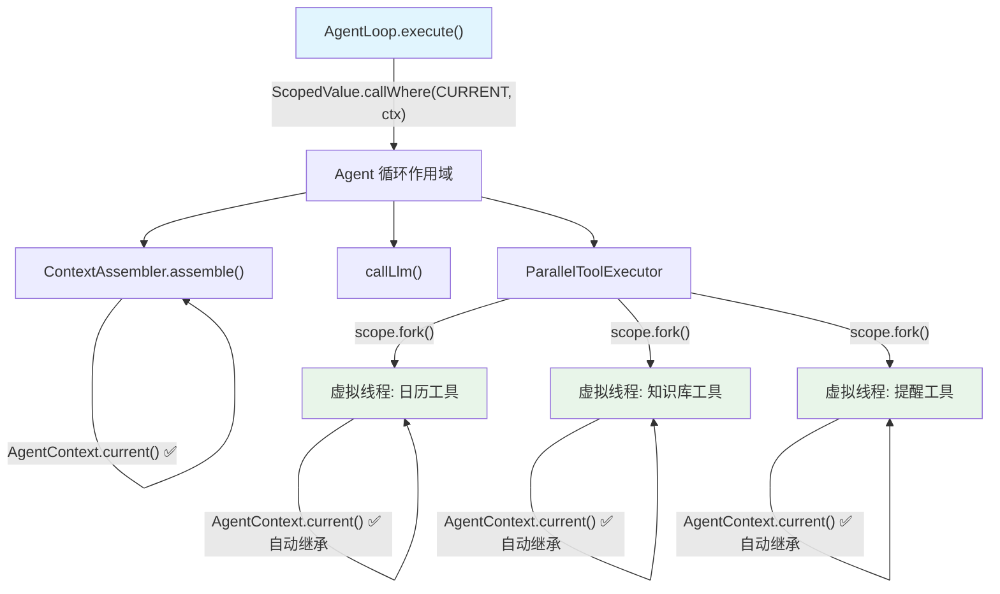

> **关键区别**：如果使用 `ThreadLocal`，`StructuredTaskScope.fork()` 启动的子虚拟线程**不会**自动继承父线程的 `ThreadLocal` 值（除非使用 `InheritableThreadLocal`，但这会导致每个子线程拷贝整个映射表）。`ScopedValue` 天然支持结构化并发的继承语义，且零拷贝开销。


### 10.4 线程安全策略

#### 10.4.1 "零 synchronized" 原则

ZhiWei Agent 引擎的并发安全策略建立在一个核心原则之上：**禁止使用 `synchronized` 关键字**。这不是教条主义，而是基于 Virtual Thread 的技术约束和架构设计的双重考量：

1. **技术约束**：`synchronized` 块会导致 Virtual Thread 被"钉"（pin）在载体线程上，无法在阻塞时让出载体线程，从而退化为传统线程模型（详见 10.6 节）
2. **架构设计**：通过不可变数据结构和无锁并发容器，可以从根本上消除对互斥锁的需求

ZhiWei 的线程安全策略分为三个层次：

```
┌─────────────────────────────────────────────────────────────┐
│                    线程安全策略三层模型                        │
│                                                               │
│  第一层：不可变性（Immutability）                              │
│  ┌─────────────────────────────────────────────────────────┐ │
│  │  · AgentState — 不可变 record，天然线程安全               │ │
│  │  · AgentAction — sealed interface，所有变体为不可变 record│ │
│  │  · Budget — 不可变快照，每次消耗生成新实例                 │ │
│  │  · ChatMessage — 不可变 record                           │ │
│  │  · 集合字段 — List.copyOf() / Map.copyOf() 防御性拷贝    │ │
│  └─────────────────────────────────────────────────────────┘ │
│                                                               │
│  第二层：无锁并发容器（Lock-Free Containers）                  │
│  ┌─────────────────────────────────────────────────────────┐ │
│  │  · ToolRegistry — ConcurrentHashMap<String, ToolContract>│ │
│  │  · SessionManager — ConcurrentHashMap<UUID, Session>     │ │
│  │  · CircuitBreakerState — AtomicReference<State>          │ │
│  │  · 计数器/指标 — LongAdder / AtomicLong                  │ │
│  └─────────────────────────────────────────────────────────┘ │
│                                                               │
│  第三层：异步协调（Async Coordination）                        │
│  ┌─────────────────────────────────────────────────────────┐ │
│  │  · 会话间协调 — CompletableFuture                        │ │
│  │  · 流量控制 — Semaphore                                  │ │
│  │  · 结构化并发 — StructuredTaskScope                      │ │
│  └─────────────────────────────────────────────────────────┘ │
└─────────────────────────────────────────────────────────────┘
```


#### 10.4.2 不可变 Record 的线程安全保证

不可变对象是最强的线程安全保证——如果一个对象创建后永远不会被修改，那么任意数量的线程可以同时读取它而无需任何同步。ZhiWei 的核心数据结构全部使用 Java `record` 实现，并在紧凑构造器中执行防御性拷贝：

```java
package com.lifepilot.agent;

import java.util.List;
import java.util.Map;

/**
 * 不可变状态模式的示范 — 展示如何通过 record + 防御性拷贝实现线程安全。
 *
 * <p>关键技术点：
 * <ul>
 *   <li>record 的字段天然 final，构造后不可修改</li>
 *   <li>紧凑构造器中对集合参数执行 {@code List.copyOf()} / {@code Map.copyOf()}</li>
 *   <li>状态更新通过创建新实例实现，旧实例不受影响</li>
 *   <li>无需任何同步原语（synchronized / Lock / Atomic）</li>
 * </ul>
 * </p>
 */
public record ImmutableStateExample(
        String id,
        List<String> items,
        Map<String, Integer> scores,
        int version
) {
    /** 紧凑构造器：防御性拷贝，切断外部引用。 */
    public ImmutableStateExample {
        items = List.copyOf(items);     // 不可变列表
        scores = Map.copyOf(scores);    // 不可变映射
    }

    /** 添加元素 — 返回新实例，原实例不变。 */
    public ImmutableStateExample withItem(String item) {
        var newItems = new java.util.ArrayList<>(this.items);
        newItems.add(item);
        return new ImmutableStateExample(id, newItems, scores, version + 1);
    }

    /** 更新分数 — 返回新实例，原实例不变。 */
    public ImmutableStateExample withScore(String key, int score) {
        var newScores = new java.util.HashMap<>(this.scores);
        newScores.put(key, score);
        return new ImmutableStateExample(id, items, newScores, version + 1);
    }
}
```


#### 10.4.3 ConcurrentHashMap 注册表模式

对于需要运行时动态注册和查找的组件（如工具注册表、会话管理器），ZhiWei 使用 `ConcurrentHashMap` 提供无锁的并发读写能力：

```java
package com.lifepilot.agent.tool;

import com.lifepilot.agent.ToolContract;
import org.slf4j.Logger;
import org.slf4j.LoggerFactory;
import org.springframework.stereotype.Component;

import java.util.Map;
import java.util.Optional;
import java.util.concurrent.ConcurrentHashMap;

/**
 * 线程安全的工具注册表。
 *
 * <p>使用 {@link ConcurrentHashMap} 实现无锁的并发注册和查找。
 * 所有公开方法返回不可变视图或 {@link Optional}，防止外部修改内部状态。</p>
 *
 * <p>并发保证：
 * <ul>
 *   <li>注册（写）和查找（读）可以并发执行，无需外部同步</li>
 *   <li>{@code computeIfAbsent} 保证同一 key 的注册操作原子性</li>
 *   <li>返回的注册表快照通过 {@code Map.copyOf()} 实现不可变</li>
 * </ul>
 * </p>
 */
@Component
public class ToolRegistry {

    private static final Logger log = LoggerFactory.getLogger(ToolRegistry.class);

    /** 工具注册表：工具名称 → 工具实现。 */
    private final ConcurrentHashMap<String, ToolContract> tools = new ConcurrentHashMap<>();

    /**
     * 注册工具。如果同名工具已存在，替换并记录警告。
     *
     * @param name 工具名称
     * @param tool 工具实现
     */
    public void register(String name, ToolContract tool) {
        var previous = tools.put(name, tool);
        if (previous != null) {
            log.warn("工具被覆盖注册: name={}", name);
        } else {
            log.info("工具注册成功: name={}", name);
        }
    }

    /**
     * 按名称查找工具。
     *
     * @param name 工具名称
     * @return 工具实现，未找到时返回 empty
     */
    public Optional<ToolContract> resolve(String name) {
        return Optional.ofNullable(tools.get(name));
    }

    /**
     * 获取所有已注册工具的不可变快照。
     *
     * <p>返回 {@code Map.copyOf()} 创建的不可变副本，
     * 调用方对返回值的任何修改操作都会抛出 {@link UnsupportedOperationException}。</p>
     */
    public Map<String, ToolContract> snapshot() {
        return Map.copyOf(tools);
    }

    /** 已注册工具数量。 */
    public int size() {
        return tools.size();
    }
}
```


#### 10.4.4 CompletableFuture 异步协调

对于需要跨会话或跨组件协调的场景，ZhiWei 使用 `CompletableFuture` 实现非阻塞的异步协调，避免使用 `synchronized` 或 `wait/notify`：

```java
package com.lifepilot.agent.session;

import com.lifepilot.agent.AgentState;
import org.slf4j.Logger;
import org.slf4j.LoggerFactory;

import java.util.Map;
import java.util.Optional;
import java.util.UUID;
import java.util.concurrent.CompletableFuture;
import java.util.concurrent.ConcurrentHashMap;

/**
 * 基于 CompletableFuture 的会话结果协调器。
 *
 * <p>当外部组件需要等待某个 Agent 会话完成时，通过此协调器注册等待，
 * 会话完成后自动通知所有等待方。全程无锁，无 synchronized。</p>
 */
public class SessionResultCoordinator {

    private static final Logger log = LoggerFactory.getLogger(SessionResultCoordinator.class);

    /** 会话 ID → 结果 Future 的映射。 */
    private final ConcurrentHashMap<UUID, CompletableFuture<AgentState>> pendingResults =
            new ConcurrentHashMap<>();

    /**
     * 注册对某个会话结果的等待。
     *
     * <p>如果会话已有等待 Future，返回已有的；否则创建新的。
     * {@code computeIfAbsent} 保证原子性，不会创建重复 Future。</p>
     *
     * @param sessionId 会话标识
     * @return 会话结果的 Future
     */
    public CompletableFuture<AgentState> awaitResult(UUID sessionId) {
        return pendingResults.computeIfAbsent(sessionId, id -> {
            log.debug("注册会话结果等待: sessionId={}", id);
            return new CompletableFuture<>();
        });
    }

    /**
     * 通知会话完成，触发所有等待方。
     *
     * @param sessionId 会话标识
     * @param finalState 会话最终状态
     */
    public void notifyComplete(UUID sessionId, AgentState finalState) {
        Optional.ofNullable(pendingResults.remove(sessionId))
                .ifPresent(future -> {
                    future.complete(finalState);
                    log.debug("会话结果已通知: sessionId={}", sessionId);
                });
    }

    /**
     * 通知会话异常终止。
     *
     * @param sessionId 会话标识
     * @param error 异常原因
     */
    public void notifyError(UUID sessionId, Throwable error) {
        Optional.ofNullable(pendingResults.remove(sessionId))
                .ifPresent(future -> {
                    future.completeExceptionally(error);
                    log.warn("会话异常已通知: sessionId={}, error={}", sessionId, error.getMessage());
                });
    }
}
```


### 10.5 背压与流量控制

#### 10.5.1 问题：Virtual Thread 的"过度并发"风险

Virtual Thread 的一个潜在陷阱是**过度并发**——因为创建虚拟线程几乎没有成本，开发者可能不加限制地启动大量并发任务，导致下游资源（LLM API、数据库连接、外部服务）被压垮。

在 ZhiWei 的场景中，最关键的瓶颈是 **LLM API 调用**：

- LLM 提供商通常有速率限制（如 OpenAI 的 RPM / TPM 限制）
- 每次 LLM 调用消耗 Token 预算，不受控的并发会快速耗尽预算
- 多个 Agent 会话同时调用 LLM 可能触发提供商的限流，导致全部请求失败

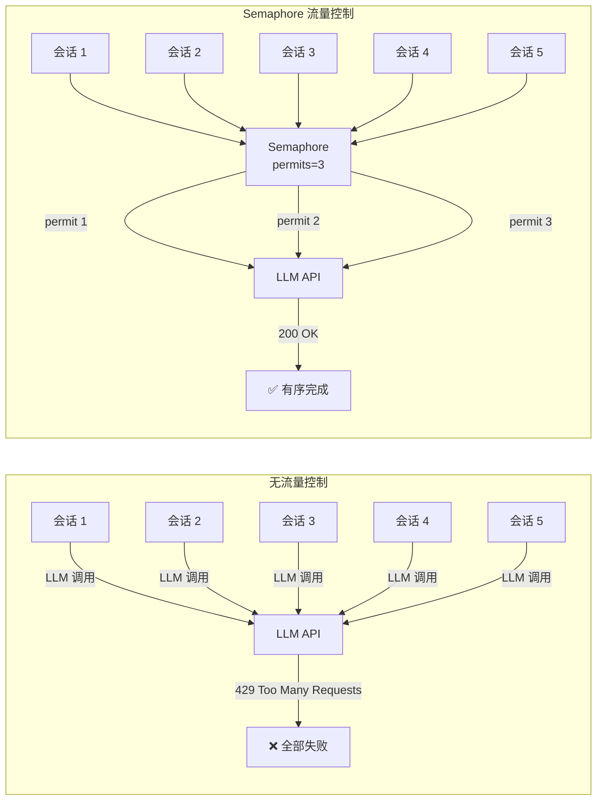


#### 10.5.2 LlmCallThrottle — LLM 调用节流器

`LlmCallThrottle` 使用 `Semaphore` 限制同时进行的 LLM 调用数量。`Semaphore` 是 Virtual Thread 友好的——当虚拟线程在 `acquire()` 上阻塞时，它会自动让出载体线程（与 `synchronized` 不同，不会导致线程钉住）。

```java
package com.lifepilot.agent.llm;

import com.lifepilot.agent.context.AgentContext;
import org.slf4j.Logger;
import org.slf4j.LoggerFactory;
import org.springframework.beans.factory.annotation.Value;
import org.springframework.stereotype.Component;

import java.time.Duration;
import java.time.Instant;
import java.util.concurrent.Semaphore;
import java.util.concurrent.TimeUnit;
import java.util.concurrent.atomic.LongAdder;
import java.util.function.Supplier;

/**
 * LLM 调用节流器。
 *
 * <p>通过 {@link Semaphore} 限制同时进行的 LLM API 调用数量，
 * 防止多个 Agent 会话并发调用时触发提供商的速率限制。</p>
 *
 * <p>设计要点：
 * <ul>
 *   <li>{@code Semaphore} 是 Virtual Thread 友好的，阻塞时自动让出载体线程</li>
 *   <li>公平模式（{@code fair=true}）确保等待时间最长的请求优先获得许可</li>
 *   <li>支持超时等待，防止无限阻塞</li>
 *   <li>通过 {@link LongAdder} 记录统计指标，无锁高性能</li>
 * </ul>
 * </p>
 */
@Component
public class LlmCallThrottle {

    private static final Logger log = LoggerFactory.getLogger(LlmCallThrottle.class);

    /** 并发 LLM 调用的信号量。 */
    private final Semaphore semaphore;

    /** 等待许可的最大超时时间。 */
    private final Duration acquireTimeout;

    // --- 统计指标（无锁） ---
    private final LongAdder totalCalls = new LongAdder();
    private final LongAdder throttledCalls = new LongAdder();
    private final LongAdder timeoutCalls = new LongAdder();

    /**
     * 构造 LLM 调用节流器。
     *
     * @param maxConcurrent  最大并发 LLM 调用数，默认 3
     * @param acquireTimeout 等待许可的超时时间（秒），默认 30
     */
    public LlmCallThrottle(
            @Value("${lifepilot.llm.max-concurrent-calls:3}") int maxConcurrent,
            @Value("${lifepilot.llm.throttle-timeout-seconds:30}") int acquireTimeout
    ) {
        // 公平模式：等待时间最长的请求优先获得许可
        this.semaphore = new Semaphore(maxConcurrent, true);
        this.acquireTimeout = Duration.ofSeconds(acquireTimeout);
        log.info("LLM 调用节流器初始化: maxConcurrent={}, timeout={}s",
                maxConcurrent, acquireTimeout);
    }

    /**
     * 在节流控制下执行 LLM 调用。
     *
     * <p>调用方传入一个 {@link Supplier}，节流器负责在获取许可后执行，
     * 并在执行完成（无论成功或失败）后释放许可。</p>
     *
     * <p>当所有许可都被占用时，当前虚拟线程在 {@code semaphore.tryAcquire()} 上阻塞。
     * 由于 {@code Semaphore} 是 Virtual Thread 友好的，阻塞期间载体线程会被释放
     * 给其他虚拟线程使用。</p>
     *
     * @param callSupplier LLM 调用逻辑
     * @param <T>          返回值类型
     * @return LLM 调用结果
     * @throws LlmThrottleException 当等待许可超时时抛出
     */
    public <T> T executeThrottled(Supplier<T> callSupplier) {
        totalCalls.increment();

        var waitStart = Instant.now();
        boolean acquired;
        try {
            acquired = semaphore.tryAcquire(acquireTimeout.toMillis(), TimeUnit.MILLISECONDS);
        } catch (InterruptedException e) {
            Thread.currentThread().interrupt();
            throw new LlmThrottleException("LLM 调用等待许可时被中断");
        }

        if (!acquired) {
            timeoutCalls.increment();
            throw new LlmThrottleException(
                    "LLM 调用等待许可超时（" + acquireTimeout.toSeconds() + "秒），当前并发已满");
        }

        var waitDuration = Duration.between(waitStart, Instant.now());
        if (waitDuration.toMillis() > 100) {
            throttledCalls.increment();
            log.debug("LLM 调用被节流: waitTime={}ms, sessionId={}",
                    waitDuration.toMillis(),
                    AgentContext.currentOptional().map(c -> c.sessionId().toString()).orElse("unknown"));
        }

        try {
            return callSupplier.get();
        } finally {
            semaphore.release();
        }
    }

    /**
     * 获取节流器统计快照。
     *
     * @return 不可变的统计数据
     */
    public ThrottleStats stats() {
        return new ThrottleStats(
                totalCalls.sum(),
                throttledCalls.sum(),
                timeoutCalls.sum(),
                semaphore.availablePermits(),
                semaphore.getQueueLength()
        );
    }

    /**
     * 节流器统计快照。
     *
     * @param totalCalls      总调用次数
     * @param throttledCalls  被节流（等待 >100ms）的调用次数
     * @param timeoutCalls    等待超时的调用次数
     * @param availablePermits 当前可用许可数
     * @param queueLength     当前等待队列长度
     */
    public record ThrottleStats(
            long totalCalls,
            long throttledCalls,
            long timeoutCalls,
            int availablePermits,
            int queueLength
    ) {}
}
```

#### 10.5.3 Spring Boot 配置

```yaml
# application.yml — LLM 调用节流配置
lifepilot:
  llm:
    # 最大并发 LLM 调用数（所有会话共享）
    # 建议值：免费 API 设为 1-2，付费 API 设为 3-5
    max-concurrent-calls: 3

    # 等待许可的超时时间（秒）
    # 超过此时间仍未获得许可，抛出 LlmThrottleException
    throttle-timeout-seconds: 30
```


#### 10.5.4 节流器与 AgentLoop 的集成

`AgentLoop` 中的 LLM 调用通过 `LlmCallThrottle` 包装，确保所有会话的 LLM 调用都受到全局流量控制：

```java
/**
 * AgentLoop 中 LLM 调用的节流集成示例。
 *
 * <p>将原始的 {@code chatClient.prompt()...call()} 包装在
 * {@code llmCallThrottle.executeThrottled()} 中，
 * 确保并发 LLM 调用数不超过配置的上限。</p>
 */
private AgentAction callLlmWithThrottle(AssembledContext context, AgentPhase phase) {
    return llmCallThrottle.executeThrottled(() -> {
        log.debug("LLM 调用开始: phase={}, sessionId={}",
                phase, AgentContext.current().sessionId());

        var response = chatClient.prompt()
                .system(context.systemPrompt())
                .user(context.userPrompt())
                .call()
                .entity(AgentAction.class);

        log.debug("LLM 调用完成: phase={}", phase);
        return response;
    });
}
```

**流量控制效果**：当 3 个 Agent 会话同时需要调用 LLM 时（`max-concurrent-calls=3`），第 4 个会话的虚拟线程会在 `Semaphore.tryAcquire()` 上阻塞等待，但由于 Virtual Thread 的特性，这个阻塞不会占用载体线程——载体线程可以继续执行其他虚拟线程的工作。


### 10.6 Virtual Thread 陷阱与规避

Virtual Thread 虽然大幅简化了并发编程，但存在若干已知陷阱。ZhiWei 在架构设计阶段就针对每个陷阱制定了明确的规避策略。

#### 10.6.1 陷阱一：线程钉住（Pinned Thread）

**问题描述**：当虚拟线程在 `synchronized` 块或方法内执行阻塞操作时，虚拟线程会被"钉"（pin）在载体线程上，无法让出。这意味着载体线程被独占，其他虚拟线程无法使用它，Virtual Thread 的核心优势完全丧失。

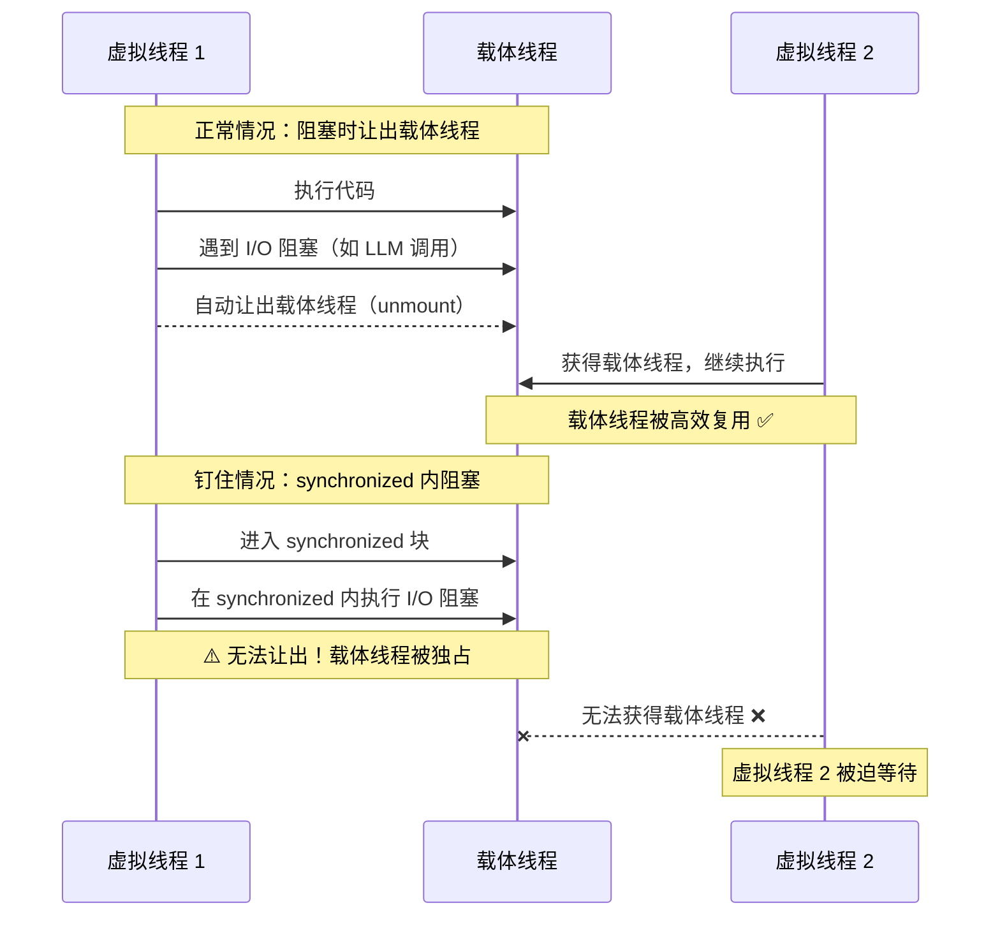


**ZhiWei 的规避策略**：

| 策略 | 实现方式 | 适用场景 |
|------|---------|---------|
| 禁止 `synchronized` | 编码规范 + 代码审查 + 静态分析 | 所有自有代码 |
| 替换为 `ReentrantLock` | 当确实需要互斥时使用 `ReentrantLock`（Virtual Thread 友好） | 极少数需要互斥的场景 |
| 使用无锁数据结构 | `ConcurrentHashMap`、`AtomicReference`、`LongAdder` | 注册表、计数器、状态引用 |
| 使用不可变对象 | `record` + `List.copyOf()` | 所有状态对象 |
| 监控钉住事件 | JVM 参数 `-Djdk.tracePinnedThreads=short` | 开发和测试环境 |

```java
package com.lifepilot.agent.concurrent;

import java.util.concurrent.locks.ReentrantLock;

/**
 * 展示 synchronized 替换为 ReentrantLock 的模式。
 *
 * <p>当确实需要互斥访问时（例如保护非线程安全的第三方库），
 * 使用 {@link ReentrantLock} 替代 {@code synchronized}。
 * {@code ReentrantLock} 在 Virtual Thread 阻塞时允许让出载体线程。</p>
 */
public class VirtualThreadSafeLock {

    // ❌ 错误：synchronized 会导致线程钉住
    // private final Object lock = new Object();
    // public void badMethod() {
    //     synchronized (lock) {
    //         performBlockingIo(); // 载体线程被钉住！
    //     }
    // }

    // ✅ 正确：ReentrantLock 是 Virtual Thread 友好的
    private final ReentrantLock lock = new ReentrantLock();

    /**
     * 使用 ReentrantLock 保护临界区。
     *
     * <p>即使在 lock 持有期间执行阻塞 I/O，
     * 虚拟线程仍然可以从载体线程卸载。</p>
     */
    public void safeMethod() {
        lock.lock();
        try {
            performBlockingIo(); // 载体线程不会被钉住
        } finally {
            lock.unlock();
        }
    }

    private void performBlockingIo() {
        // 模拟阻塞 I/O 操作
    }
}
```


> **第三方库的 synchronized 问题**：某些第三方库内部使用了 `synchronized`（如早期版本的 JDBC 驱动、某些 HTTP 客户端）。ZhiWei 通过以下方式应对：
> - **xerial sqlite-jdbc**：SQLite 本身是串行写入的，sqlite-jdbc 内部使用 `synchronized` 保护连接。由于 ZhiWei 是单用户场景，数据库写入频率低，钉住的影响可忽略。但在开发环境中通过 `-Djdk.tracePinnedThreads=short` 监控。
> - **HTTP 客户端**：使用 Java 11+ 的 `java.net.http.HttpClient`，它原生支持 Virtual Thread，不使用 `synchronized`。
> - **Spring AI ChatClient**：底层使用 `RestClient`（基于 `HttpClient`），Virtual Thread 友好。

#### 10.6.2 陷阱二：载体线程饥饿（Carrier Thread Starvation）

**问题描述**：Virtual Thread 的调度依赖于载体线程池（默认大小为 CPU 核心数）。如果大量虚拟线程同时执行 CPU 密集型计算（而非 I/O 阻塞），载体线程会被长时间占用，导致其他虚拟线程无法被调度。

**ZhiWei 的风险评估**：Agent 引擎的 CPU 密集型操作（状态转换、上下文组装、安全检查）耗时极短（< 10ms），不会导致载体线程饥饿。但以下场景需要注意：

| 场景 | 风险 | 规避措施 |
|------|------|---------|
| 知识库向量计算（Embedding） | 中 | 通过 LLM API 远程计算，不在本地执行 |
| 大文本的正则匹配 | 低 | 限制输入文本长度，超长文本分段处理 |
| JSON 序列化/反序列化 | 极低 | Jackson 处理速度远快于 I/O 延迟 |
| 密码学操作（哈希、加密） | 极低 | 仅在 API 密钥脱敏时使用，耗时 < 1ms |


```java
package com.lifepilot.agent.concurrent;

/**
 * 载体线程饥饿的检测与规避示例。
 *
 * <p>如果未来引入本地 Embedding 计算等 CPU 密集型任务，
 * 应将其调度到独立的平台线程池，避免占用 Virtual Thread 的载体线程。</p>
 */
public class CarrierThreadProtection {

    /**
     * CPU 密集型任务应使用独立的平台线程池。
     *
     * <p>Virtual Thread 的载体线程池默认大小为 CPU 核心数，
     * 如果 CPU 密集型任务长时间占用载体线程，会导致其他虚拟线程无法被调度。
     * 解决方案：将 CPU 密集型任务提交到独立的平台线程池执行。</p>
     */
    private static final java.util.concurrent.ExecutorService CPU_BOUND_POOL =
            java.util.concurrent.Executors.newFixedThreadPool(
                    Runtime.getRuntime().availableProcessors(),
                    Thread.ofPlatform().name("cpu-bound-", 0).factory()
            );

    /**
     * 在虚拟线程中安全执行 CPU 密集型任务。
     *
     * <p>将 CPU 密集型计算委托给平台线程池，虚拟线程通过
     * {@code CompletableFuture.get()} 等待结果（此等待是 Virtual Thread 友好的）。</p>
     */
    public static <T> T executeCpuBound(java.util.concurrent.Callable<T> task) throws Exception {
        return java.util.concurrent.CompletableFuture.supplyAsync(() -> {
            try {
                return task.call();
            } catch (Exception e) {
                throw new RuntimeException(e);
            }
        }, CPU_BOUND_POOL).get(); // get() 在虚拟线程上阻塞时会让出载体线程
    }
}
```

#### 10.6.3 陷阱三：ThreadLocal 内存泄漏

**问题描述**：`ThreadLocal` 的值与线程的生命周期绑定。在传统线程池中，线程数量有限（通常 10-50），`ThreadLocal` 的内存开销可控。但 Virtual Thread 可以创建数百万个，每个虚拟线程持有独立的 `ThreadLocal` 映射表，内存消耗可能失控。

更严重的是，某些框架和库在内部使用 `ThreadLocal` 缓存大对象（如数据库连接、格式化器、缓冲区），这些对象在虚拟线程结束后不会被立即回收（如果 `ThreadLocal` 引用链未断开）。


**ZhiWei 的规避策略**：

| 策略 | 说明 |
|------|------|
| 优先使用 `ScopedValue` | 替代 `ThreadLocal` 传递请求上下文（见 10.3 节） |
| 审计第三方库的 `ThreadLocal` 使用 | 在引入新依赖时检查其 `ThreadLocal` 使用情况 |
| 避免在 `ThreadLocal` 中存储大对象 | 如果必须使用 `ThreadLocal`，只存储轻量级引用 |
| 监控虚拟线程内存 | 通过 JFR 事件监控虚拟线程的内存分配 |

```java
package com.lifepilot.agent.concurrent;

import org.slf4j.Logger;
import org.slf4j.LoggerFactory;

/**
 * ThreadLocal 到 ScopedValue 迁移的对比示例。
 *
 * <p>展示为什么在 Virtual Thread 环境下应该用 {@code ScopedValue}
 * 替代 {@code ThreadLocal}，以及两者在语义和内存模型上的差异。</p>
 */
public class ThreadLocalMigrationExample {

    private static final Logger log = LoggerFactory.getLogger(ThreadLocalMigrationExample.class);

    // ❌ 旧模式：ThreadLocal — 在 Virtual Thread 环境下有内存泄漏风险
    // private static final ThreadLocal<String> TRACE_ID = new ThreadLocal<>();
    //
    // public void oldPattern() {
    //     TRACE_ID.set("trace-123");
    //     try {
    //         doWork();
    //     } finally {
    //         TRACE_ID.remove(); // 必须手动清理，容易遗忘！
    //     }
    // }

    // ✅ 新模式：ScopedValue — 作用域结束自动释放，无泄漏风险
    private static final ScopedValue<String> TRACE_ID = ScopedValue.newInstance();

    /**
     * 使用 ScopedValue 传递追踪标识。
     *
     * <p>作用域结束时绑定自动解除，无需手动清理。
     * 即使 {@code doWork()} 抛出异常，绑定也会被正确释放。</p>
     */
    public void newPattern() {
        ScopedValue.runWhere(TRACE_ID, "trace-123", () -> {
            doWork(); // TRACE_ID.get() 返回 "trace-123"
        });
        // 作用域结束，TRACE_ID 自动解绑，无内存泄漏
    }

    private void doWork() {
        log.debug("当前追踪标识: traceId={}", TRACE_ID.get());
    }
}
```


#### 10.6.4 陷阱四：对象池化失效

**问题描述**：传统并发模型中，对象池（如数据库连接池、HTTP 连接池）的大小通常与线程池大小匹配。当切换到 Virtual Thread 后，并发任务数可能从几十个暴增到数千个，但对象池的大小不会自动扩展，导致大量虚拟线程在等待池化对象时阻塞。

**ZhiWei 的应对**：

| 池化资源 | 策略 | 说明 |
|---------|------|------|
| SQLite 连接 | 单连接 + WAL | SQLite 本身是单写多读，连接池无意义 |
| HTTP 连接 | `HttpClient` 内置连接池 | Java `HttpClient` 自动管理连接复用，Virtual Thread 友好 |
| LLM API 连接 | `LlmCallThrottle` 控制并发 | 通过 Semaphore 限制并发数，间接控制连接使用 |

#### 10.6.5 陷阱总结与检查清单

以下检查清单用于 ZhiWei 的代码审查，确保 Virtual Thread 的正确使用：

```
┌─────────────────────────────────────────────────────────────────┐
│              Virtual Thread 代码审查检查清单                      │
│                                                                   │
│  □ 是否使用了 synchronized？                                     │
│    → 替换为 ReentrantLock 或无锁数据结构                          │
│                                                                   │
│  □ 是否在 synchronized 块内执行了阻塞 I/O？                      │
│    → 这是最严重的问题，必须立即修复                                │
│                                                                   │
│  □ 是否使用了 ThreadLocal？                                      │
│    → 评估是否可以替换为 ScopedValue                               │
│    → 如果必须使用，确保存储轻量级对象且有 remove() 清理            │
│                                                                   │
│  □ 是否有 CPU 密集型计算（>10ms）在虚拟线程中执行？               │
│    → 考虑委托给独立的平台线程池                                    │
│                                                                   │
│  □ 并发任务是否使用了 StructuredTaskScope？                       │
│    → 确保子任务生命周期不超过父任务                                │
│                                                                   │
│  □ 是否有无限制的并发资源访问？                                   │
│    → 使用 Semaphore 或其他流量控制机制                             │
│                                                                   │
│  □ 开发环境是否启用了 -Djdk.tracePinnedThreads=short？            │
│    → 用于检测运行时的线程钉住事件                                  │
└─────────────────────────────────────────────────────────────────┘
```


#### 10.6.6 JVM 启动参数配置

ZhiWei 在开发和生产环境中使用不同的 JVM 参数来优化 Virtual Thread 的行为：

```bash
# 开发环境 — 启用预览特性 + 线程钉住检测
java --enable-preview \
     -Djdk.tracePinnedThreads=short \
     -Djdk.virtualThreadScheduler.parallelism=4 \
     -jar lifepilot.jar

# 生产环境 — 启用预览特性 + 性能优化
java --enable-preview \
     -Djdk.virtualThreadScheduler.parallelism=0 \
     -jar lifepilot.jar
# parallelism=0 表示使用默认值（CPU 核心数）
```

| 参数 | 说明 | 开发环境 | 生产环境 |
|------|------|---------|---------|
| `--enable-preview` | 启用预览特性（StructuredTaskScope、ScopedValue） | ✅ 必需 | ✅ 必需 |
| `-Djdk.tracePinnedThreads=short` | 检测并打印线程钉住事件 | ✅ 启用 | ❌ 关闭（性能开销） |
| `-Djdk.virtualThreadScheduler.parallelism` | 载体线程池大小 | 4（便于复现并发问题） | 0（默认=CPU 核心数） |
| `-Djdk.virtualThreadScheduler.maxPoolSize` | 载体线程池最大大小 | 默认 | 默认（256） |

> **关于 `--enable-preview`**：ZhiWei 使用的 `StructuredTaskScope`（JEP 505）和 `ScopedValue`（JEP 487）在 Java 22 中仍为预览特性，需要 `--enable-preview` 标志。Virtual Thread 本身（JEP 444）在 Java 21 已正式发布，不需要预览标志。当这些特性在未来的 Java LTS 版本中正式发布后，可以移除 `--enable-preview`。


---

## 11. 错误处理与降级策略

Agent 引擎运行在一个充满不确定性的环境中——LLM 可能超时、工具可能失败、会话可能过期、预算可能耗尽。本节定义了 Agent 引擎的错误处理体系：从异常分类、分层降级、统一错误处理器，到用户友好的错误反馈和自动恢复机制。

> **与架构文档的关系**：`docs/architecture/error-handling.md` 定义了全局的错误处理框架（`ErrorCategory`、`ErrorClassifier`、`RetryExecutor`、`CircuitBreakerManager`）。本节聚焦于 Agent 引擎层面的错误处理——如何将全局框架应用到 `AgentLoop` 的控制循环中，以及 Agent 特有的错误恢复策略。

### 11.1 错误分类体系

#### 11.1.1 AgentException — sealed 异常层次

Agent 引擎使用 Java 22 的 `sealed interface` 定义了一套完整的异常层次结构。`sealed` 关键字确保所有异常变体在编译期可枚举，配合 `switch` 表达式的穷举匹配，任何未处理的异常类型都会产生编译错误。

```java
package com.lifepilot.agent.exception;

import java.time.Duration;
import java.util.List;
import java.util.Map;

/**
 * Agent 引擎异常的 sealed 根接口。
 *
 * <p>所有 Agent 引擎内部的异常都必须实现此接口。
 * 使用 sealed interface 确保异常类型在编译期可穷举，
 * 配合 pattern matching 实现类型安全的错误处理。</p>
 *
 * <p>四大异常族：
 * <ul>
 *   <li>{@link LlmException} — LLM 调用相关异常</li>
 *   <li>{@link ToolException} — 工具执行相关异常</li>
 *   <li>{@link SessionException} — 会话管理相关异常</li>
 *   <li>{@link BudgetException} — 预算控制相关异常</li>
 * </ul></p>
 *
 * @see AgentErrorHandler 统一错误处理器
 * @see ErrorMessageTranslator 用户友好消息转换器
 */
public sealed interface AgentException
        permits LlmException, ToolException, SessionException, BudgetException {

    /** 错误码，格式为 {层级}_{具体错误}，如 "LLM_TIMEOUT"。 */
    String errorCode();

    /** 面向开发者的中文错误消息。 */
    String message();

    /** 原始异常（可选）。 */
    @Nullable Throwable cause();

    /** 是否可重试。 */
    boolean retryable();

    /** 附加诊断信息。 */
    default Map<String, Object> diagnostics() { return Map.of(); }
}
```

#### 11.1.2 LlmException — LLM 调用异常族

```java
package com.lifepilot.agent.exception;

/**
 * LLM 调用异常的 sealed 父类。
 *
 * <p>覆盖三种典型的 LLM 故障场景：
 * Provider 不可用、调用超时、速率限制。</p>
 */
public sealed abstract class LlmException extends RuntimeException
        implements AgentException
        permits LlmUnavailableException, LlmTimeoutException, LlmRateLimitException {

    private final String errorCode;
    private final String providerId;

    protected LlmException(String errorCode, String message,
                           String providerId, @Nullable Throwable cause) {
        super(message, cause);
        this.errorCode = errorCode;
        this.providerId = providerId;
    }

    @Override public String errorCode() { return errorCode; }
    public String providerId() { return providerId; }

    @Override
    public Map<String, Object> diagnostics() {
        return Map.of("providerId", providerId, "errorCode", errorCode);
    }
}

/**
 * LLM Provider 不可用异常。
 *
 * <p>触发场景：Provider 返回 5xx、连接被拒绝、DNS 解析失败。
 * 处理策略：触发熔断器，故障转移到下一个 Provider。</p>
 */
public final class LlmUnavailableException extends LlmException {

    private final int httpStatus;

    public LlmUnavailableException(String providerId, int httpStatus, Throwable cause) {
        super("LLM_UNAVAILABLE",
              "LLM Provider 不可用: provider=%s, status=%d".formatted(providerId, httpStatus),
              providerId, cause);
        this.httpStatus = httpStatus;
    }

    public int httpStatus() { return httpStatus; }

    @Override public boolean retryable() { return false; } // 由熔断器 + 故障转移处理

    @Override
    public Map<String, Object> diagnostics() {
        return Map.of("providerId", providerId(), "httpStatus", httpStatus,
                       "errorCode", errorCode());
    }
}

/**
 * LLM 调用超时异常。
 *
 * <p>触发场景：LLM 响应时间超过配置的超时阈值。
 * 处理策略：可重试（指数退避），重试耗尽后故障转移。</p>
 */
public final class LlmTimeoutException extends LlmException {

    private final Duration timeout;

    public LlmTimeoutException(String providerId, Duration timeout, Throwable cause) {
        super("LLM_TIMEOUT",
              "LLM 调用超时: provider=%s, timeout=%dms".formatted(providerId, timeout.toMillis()),
              providerId, cause);
        this.timeout = timeout;
    }

    public Duration timeout() { return timeout; }

    @Override public boolean retryable() { return true; }
}

/**
 * LLM 速率限制异常。
 *
 * <p>触发场景：Provider 返回 HTTP 429 Too Many Requests。
 * 处理策略：使用 Provider 返回的 Retry-After 头作为退避时间，
 * 若无 Retry-After 则使用默认指数退避。</p>
 */
public final class LlmRateLimitException extends LlmException {

    private final @Nullable Duration retryAfter;

    public LlmRateLimitException(String providerId,
                                  @Nullable Duration retryAfter,
                                  Throwable cause) {
        super("LLM_RATE_LIMITED",
              "LLM 速率限制: provider=%s, retryAfter=%s".formatted(
                  providerId, retryAfter != null ? retryAfter.toMillis() + "ms" : "未知"),
              providerId, cause);
        this.retryAfter = retryAfter;
    }

    public Optional<Duration> retryAfter() { return Optional.ofNullable(retryAfter); }

    @Override public boolean retryable() { return true; }

    @Override
    public Map<String, Object> diagnostics() {
        var map = new java.util.HashMap<>(super.diagnostics());
        if (retryAfter != null) map.put("retryAfterMs", retryAfter.toMillis());
        return Map.copyOf(map);
    }
}
```

#### 11.1.3 ToolException — 工具执行异常族

```java
package com.lifepilot.agent.exception;

/**
 * 工具执行异常的 sealed 父类。
 *
 * <p>覆盖三种典型的工具故障场景：
 * 工具未找到、参数校验失败、执行异常。</p>
 */
public sealed abstract class ToolException extends RuntimeException
        implements AgentException
        permits ToolNotFoundException, ToolValidationException, ToolExecutionException {

    private final String errorCode;
    private final String toolId;

    protected ToolException(String errorCode, String message,
                           String toolId, @Nullable Throwable cause) {
        super(message, cause);
        this.errorCode = errorCode;
        this.toolId = toolId;
    }

    @Override public String errorCode() { return errorCode; }
    public String toolId() { return toolId; }

    @Override
    public Map<String, Object> diagnostics() {
        return Map.of("toolId", toolId, "errorCode", errorCode);
    }
}

/**
 * 工具未找到异常。
 *
 * <p>触发场景：LLM 请求调用的工具 ID 在 ToolRegistry 中不存在。
 * 通常由 LLM 幻觉导致——LLM "发明"了一个不存在的工具名。
 * 处理策略：将错误信息回传 LLM，让 LLM 重新选择工具。</p>
 */
public final class ToolNotFoundException extends ToolException {

    private final List<String> availableTools;

    public ToolNotFoundException(String toolId, List<String> availableTools) {
        super("TOOL_NOT_FOUND",
              "工具未找到: toolId=%s, 可用工具=%s".formatted(toolId, availableTools),
              toolId, null);
        this.availableTools = List.copyOf(availableTools);
    }

    public List<String> availableTools() { return availableTools; }

    @Override public boolean retryable() { return false; } // 回传 LLM 重新决策
}

/**
 * 工具参数校验异常。
 *
 * <p>触发场景：LLM 生成的工具调用参数不符合 ToolContract 的 JSON Schema。
 * 处理策略：将校验错误详情回传 LLM，让 LLM 修正参数后重试。</p>
 */
public final class ToolValidationException extends ToolException {

    private final List<String> violations;

    public ToolValidationException(String toolId, List<String> violations) {
        super("TOOL_VALIDATION_FAILED",
              "工具参数校验失败: toolId=%s, violations=%s".formatted(toolId, violations),
              toolId, null);
        this.violations = List.copyOf(violations);
    }

    public List<String> violations() { return violations; }

    @Override public boolean retryable() { return false; } // 回传 LLM 修正参数
}

/**
 * 工具执行异常。
 *
 * <p>触发场景：工具在执行过程中抛出异常（网络错误、权限不足、外部服务故障等）。
 * 处理策略：根据异常类型决定重试或回传 LLM。</p>
 */
public final class ToolExecutionException extends ToolException {

    private final Duration executionTime;

    public ToolExecutionException(String toolId, Duration executionTime, Throwable cause) {
        super("TOOL_EXECUTION_FAILED",
              "工具执行失败: toolId=%s, elapsed=%dms, error=%s".formatted(
                  toolId, executionTime.toMillis(), cause.getMessage()),
              toolId, cause);
        this.executionTime = executionTime;
    }

    public Duration executionTime() { return executionTime; }

    @Override public boolean retryable() { return true; }
}
```

#### 11.1.4 SessionException 与 BudgetException

```java
package com.lifepilot.agent.exception;

/**
 * 会话管理异常的 sealed 父类。
 */
public sealed abstract class SessionException extends RuntimeException
        implements AgentException
        permits SessionNotFoundException, IllegalSessionStateException {

    private final String errorCode;

    protected SessionException(String errorCode, String message, @Nullable Throwable cause) {
        super(message, cause);
        this.errorCode = errorCode;
    }

    @Override public String errorCode() { return errorCode; }
    @Override public boolean retryable() { return false; }
}

/**
 * 会话未找到异常。
 *
 * <p>触发场景：用户引用了一个不存在或已过期的会话 ID。
 * 处理策略：提示用户创建新会话。</p>
 */
public final class SessionNotFoundException extends SessionException {

    private final UUID sessionId;

    public SessionNotFoundException(UUID sessionId) {
        super("SESSION_NOT_FOUND",
              "会话未找到: sessionId=%s".formatted(sessionId), null);
        this.sessionId = sessionId;
    }

    public UUID sessionId() { return sessionId; }
}

/**
 * 非法会话状态异常。
 *
 * <p>触发场景：对已终止的会话发送新消息，或对未初始化的会话执行操作。
 * 处理策略：拒绝操作，提示用户当前会话状态。</p>
 */
public final class IllegalSessionStateException extends SessionException {

    private final UUID sessionId;
    private final String currentState;
    private final String attemptedAction;

    public IllegalSessionStateException(UUID sessionId,
                                         String currentState,
                                         String attemptedAction) {
        super("SESSION_ILLEGAL_STATE",
              "会话状态非法: sessionId=%s, state=%s, action=%s".formatted(
                  sessionId, currentState, attemptedAction),
              null);
        this.sessionId = sessionId;
        this.currentState = currentState;
        this.attemptedAction = attemptedAction;
    }

    public UUID sessionId() { return sessionId; }
    public String currentState() { return currentState; }
    public String attemptedAction() { return attemptedAction; }
}

/**
 * 预算控制异常。
 *
 * <p>当 Agent 循环的执行超出预算限制时抛出。
 * 预算包括：最大步数、最大 Token 消耗、最大执行时间。</p>
 *
 * <p>处理策略：优雅终止当前循环，保留已完成的部分结果，
 * 向用户报告预算耗尽原因和已完成的工作。</p>
 */
public record BudgetExhaustedException(
    String errorCode,
    String message,
    BudgetDimension exhaustedDimension,
    long consumed,
    long limit,
    @Nullable Throwable cause
) implements AgentException, Throwable {

    /** 预算维度枚举。 */
    public enum BudgetDimension {
        /** 最大步数。 */       MAX_STEPS,
        /** 最大 Token 数。 */  MAX_TOKENS,
        /** 最大执行时间。 */   MAX_DURATION
    }

    public BudgetExhaustedException(BudgetDimension dimension, long consumed, long limit) {
        this("BUDGET_EXHAUSTED",
             "预算耗尽: dimension=%s, consumed=%d, limit=%d".formatted(dimension, consumed, limit),
             dimension, consumed, limit, null);
    }

    @Override public boolean retryable() { return false; }

    @Override
    public Map<String, Object> diagnostics() {
        return Map.of(
            "dimension", exhaustedDimension.name(),
            "consumed", consumed,
            "limit", limit,
            "usagePercent", limit > 0 ? (consumed * 100 / limit) + "%" : "N/A"
        );
    }
}
```

#### 11.1.5 异常层次总览

以下类图展示了 `AgentException` sealed 层次的完整结构：

```
┌─────────────────────────────────────────────────────────────────────────┐
│                    AgentException (sealed interface)                     │
│                                                                         │
│  errorCode() : String                                                   │
│  message() : String                                                     │
│  cause() : Throwable?                                                   │
│  retryable() : boolean                                                  │
│  diagnostics() : Map<String, Object>                                    │
├─────────────────────────────────────────────────────────────────────────┤
│                                                                         │
│  ┌─────────────────────────┐   ┌─────────────────────────┐             │
│  │ LlmException (sealed)   │   │ ToolException (sealed)   │             │
│  │ abstract class           │   │ abstract class           │             │
│  ├─────────────────────────┤   ├─────────────────────────┤             │
│  │ LlmUnavailableException │   │ ToolNotFoundException    │             │
│  │   httpStatus: int        │   │   availableTools: List   │             │
│  │   retryable = false      │   │   retryable = false      │             │
│  ├─────────────────────────┤   ├─────────────────────────┤             │
│  │ LlmTimeoutException     │   │ ToolValidationException  │             │
│  │   timeout: Duration      │   │   violations: List       │             │
│  │   retryable = true       │   │   retryable = false      │             │
│  ├─────────────────────────┤   ├─────────────────────────┤             │
│  │ LlmRateLimitException   │   │ ToolExecutionException   │             │
│  │   retryAfter: Duration?  │   │   executionTime: Duration│             │
│  │   retryable = true       │   │   retryable = true       │             │
│  └─────────────────────────┘   └─────────────────────────┘             │
│                                                                         │
│  ┌─────────────────────────┐   ┌──────────────────────────┐            │
│  │ SessionException(sealed)│   │ BudgetExhaustedException │            │
│  │ abstract class           │   │ (record)                 │            │
│  ├─────────────────────────┤   ├──────────────────────────┤            │
│  │ SessionNotFoundException│   │ exhaustedDimension       │            │
│  │   sessionId: UUID        │   │ consumed: long           │            │
│  ├─────────────────────────┤   │ limit: long              │            │
│  │ IllegalSessionState-    │   │ retryable = false        │            │
│  │   Exception              │   └──────────────────────────┘            │
│  │   currentState: String   │                                           │
│  │   attemptedAction: String│                                           │
│  └─────────────────────────┘                                           │
└─────────────────────────────────────────────────────────────────────────┘
```

#### 11.1.6 Pattern Matching 错误处理示例

`sealed interface` 的核心价值在于 `switch` 表达式的穷举匹配。以下示例展示了如何在 `AgentLoop` 中对异常进行类型安全的分派：

```java
/**
 * 在 AgentLoop 中使用 pattern matching 处理 AgentException。
 *
 * <p>switch 表达式穷举匹配所有 AgentException 变体，
 * 编译器确保每个异常类型都被处理。
 * 新增异常类型时，所有未更新的 switch 都会产生编译错误。</p>
 */
private AgentAction handleAgentException(AgentException ex, AgentState state) {
    log.error("Agent 异常: code={}, message={}", ex.errorCode(), ex.message());
    traceRecorder.recordError(state, ex);

    return switch (ex) {
        // LLM 异常族 — 使用 record 解构提取字段
        case LlmUnavailableException e -> {
            log.warn("LLM 不可用，触发故障转移: provider={}, status={}",
                     e.providerId(), e.httpStatus());
            yield new AgentAction.ErrorAction(
                "LLM 服务暂时不可用，正在切换到备用服务",
                new ErrorCategory.Degradable("LLM_UNAVAILABLE", e.getMessage(),
                    "故障转移到下一个 Provider", List.of("LLM 对话", "意图理解"), e));
        }
        case LlmTimeoutException e -> {
            log.warn("LLM 超时，准备重试: provider={}, timeout={}ms",
                     e.providerId(), e.timeout().toMillis());
            yield new AgentAction.ErrorAction(
                "AI 响应超时，正在重试",
                new ErrorCategory.Transient("LLM_TIMEOUT", e.getMessage(), null, e));
        }
        case LlmRateLimitException e -> {
            Duration delay = e.retryAfter().orElse(Duration.ofSeconds(2));
            log.warn("LLM 速率限制: provider={}, retryAfter={}ms",
                     e.providerId(), delay.toMillis());
            yield new AgentAction.ErrorAction(
                "AI 服务繁忙，稍后自动重试",
                new ErrorCategory.Transient("LLM_RATE_LIMITED", e.getMessage(), delay, e));
        }

        // 工具异常族 — 回传 LLM 重新决策
        case ToolNotFoundException e -> {
            log.warn("工具未找到，回传 LLM: toolId={}", e.toolId());
            yield new AgentAction.ErrorAction(
                "请求的工具不存在: %s，可用工具: %s".formatted(
                    e.toolId(), e.availableTools()),
                new ErrorCategory.Permanent("TOOL_NOT_FOUND", e.getMessage(),
                    "工具不存在", "LLM 将重新选择工具", e));
        }
        case ToolValidationException e -> {
            log.warn("工具参数校验失败: toolId={}, violations={}",
                     e.toolId(), e.violations());
            yield new AgentAction.ErrorAction(
                "工具参数格式错误: %s".formatted(e.violations()),
                new ErrorCategory.Permanent("TOOL_VALIDATION", e.getMessage(),
                    "参数格式不正确", "LLM 将修正参数", e));
        }
        case ToolExecutionException e -> {
            log.warn("工具执行失败: toolId={}, elapsed={}ms",
                     e.toolId(), e.executionTime().toMillis());
            yield new AgentAction.ErrorAction(
                "工具执行出错: %s".formatted(e.getMessage()),
                new ErrorCategory.Transient("TOOL_EXEC_FAILED", e.getMessage(), null, e));
        }

        // 会话异常族 — 终止当前操作
        case SessionNotFoundException e ->
            new AgentAction.TerminateAction("会话不存在: %s".formatted(e.sessionId()));
        case IllegalSessionStateException e ->
            new AgentAction.TerminateAction(
                "会话状态不允许此操作: state=%s, action=%s".formatted(
                    e.currentState(), e.attemptedAction()));

        // 预算异常 — 优雅终止
        case BudgetExhaustedException e -> {
            log.warn("预算耗尽: dimension={}, consumed={}, limit={}",
                     e.exhaustedDimension(), e.consumed(), e.limit());
            yield new AgentAction.TerminateAction(
                "执行预算已用完（%s: %d/%d），已保留当前进度".formatted(
                    e.exhaustedDimension(), e.consumed(), e.limit()));
        }
    };
}
```


### 11.2 分层降级策略

Agent 引擎采用三层降级模型，每层独立处理自己的错误，只有本层无法处理时才向上传播。这种分层隔离确保了单一组件的故障不会导致整个系统崩溃。

#### 11.2.1 三层降级模型

| 层级 | 错误类型 | 处理策略 | 降级行为 |
|------|---------|---------|---------|
| LLM 层 | Provider 不可用 / 超时 / 限流 | 熔断器 + 有序故障转移 | 主 Provider → 备选 Provider → 本地模型 → 拒绝 LLM 任务 |
| 工具层 | 工具未找到 / 参数错误 / 执行失败 | 重试（指数退避）+ 错误回传 LLM | 重试 → 回传 LLM 重新决策 → 跳过该工具 |
| 记忆层 | 向量化失败 / 检索超时 / 写入失败 | 降级跳过，不阻塞主流程 | 向量检索 → FTS5 全文检索 → 跳过记忆增强 |

#### 11.2.2 降级级联流程

以下 Mermaid 图展示了一次 LLM 调用从正常执行到逐级降级的完整流程：

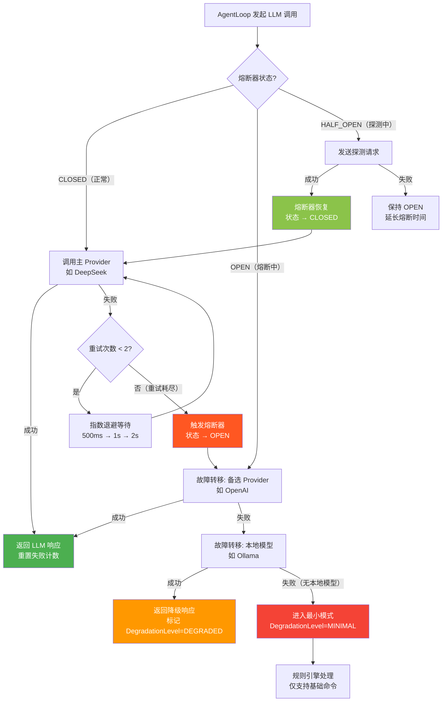

#### 11.2.3 重试策略 — 指数退避配置

Agent 引擎的重试策略遵循编码规范中定义的参数：初始延迟 500ms，倍数 2.0，上限 5s，最多 2 次重试。同时引入随机抖动（jitter）避免多个请求同步重试导致的雷群效应。

```java
package com.lifepilot.agent.resilience;

import java.time.Duration;
import java.util.concurrent.ThreadLocalRandom;

/**
 * Agent 引擎重试策略配置。
 *
 * <p>使用指数退避 + 随机抖动算法：
 * {@code delay = min(initialDelay × multiplier^attempt + jitter, maxDelay)}</p>
 *
 * <p>默认参数（与编码规范一致）：
 * <ul>
 *   <li>初始延迟：500ms</li>
 *   <li>退避倍数：2.0</li>
 *   <li>最大延迟：5s</li>
 *   <li>最大重试：2 次</li>
 *   <li>抖动范围：±20%</li>
 * </ul></p>
 *
 * @param initialDelay  初始延迟
 * @param multiplier    退避倍数
 * @param maxDelay      最大延迟上限
 * @param maxRetries    最大重试次数
 * @param jitterFactor  抖动因子（0.0 ~ 1.0），0.2 表示 ±20%
 */
public record AgentRetryPolicy(
    Duration initialDelay,
    double multiplier,
    Duration maxDelay,
    int maxRetries,
    double jitterFactor
) {
    /** 默认重试策略：500ms 初始，2.0 倍数，5s 上限，最多 2 次。 */
    public static final AgentRetryPolicy DEFAULT = new AgentRetryPolicy(
        Duration.ofMillis(500), 2.0, Duration.ofSeconds(5), 2, 0.2
    );

    /** 紧凑构造器 — 参数校验。 */
    public AgentRetryPolicy {
        if (initialDelay.isNegative()) throw new IllegalArgumentException("初始延迟不能为负数");
        if (multiplier < 1.0) throw new IllegalArgumentException("退避倍数不能小于 1.0");
        if (maxRetries < 0) throw new IllegalArgumentException("最大重试次数不能为负数");
        if (jitterFactor < 0.0 || jitterFactor > 1.0)
            throw new IllegalArgumentException("抖动因子必须在 0.0 ~ 1.0 之间");
    }

    /**
     * 计算第 N 次重试的延迟时间（含抖动）。
     *
     * @param attempt 当前重试次数（从 0 开始）
     * @return 含抖动的延迟时间
     */
    public Duration delayFor(int attempt) {
        // 基础延迟 = initialDelay × multiplier^attempt
        double baseMs = initialDelay.toMillis() * Math.pow(multiplier, attempt);
        // 限制上限
        long cappedMs = Math.min((long) baseMs, maxDelay.toMillis());
        // 添加随机抖动
        double jitter = cappedMs * jitterFactor
                       * (ThreadLocalRandom.current().nextDouble() * 2 - 1);
        long finalMs = Math.max(0, cappedMs + (long) jitter);
        return Duration.ofMillis(finalMs);
    }
}
```

重试时序示意（默认策略，2 次重试）：

```
请求 ──────► 失败 ──► 等待 ~500ms ──► 重试1 ──► 失败 ──► 等待 ~1000ms ──► 重试2 ──► 失败 ──► 放弃
                      ├─ jitter ±20% ─┤                    ├─ jitter ±20% ──┤
                      实际: 400~600ms                       实际: 800~1200ms
```

#### 11.2.4 Spring Boot 配置

```yaml
# application.yml — Agent 引擎错误处理配置
lifepilot:
  agent:
    error-handling:
      retry:
        initial-delay: 500ms
        multiplier: 2.0
        max-delay: 5s
        max-retries: 2
        jitter-factor: 0.2
      circuit-breaker:
        failure-threshold: 3          # 连续失败 3 次触发熔断
        half-open-timeout: 30s        # 熔断 30s 后进入半开状态
        probe-success-threshold: 1    # 半开状态下 1 次成功即恢复
      degradation:
        enable-local-fallback: true   # 启用本地模型兜底
        minimal-mode-commands:        # 最小模式下可用的基础命令
          - todo
          - schedule
          - search
          - help
```

### 11.3 AgentErrorHandler — 统一错误处理器

`AgentErrorHandler` 是 Agent 引擎的错误处理中枢。它拦截 `AgentLoop` 中抛出的所有异常，将其转换为 `AgentAction`，并决定后续的恢复策略：重试、降级、还是终止。

```java
package com.lifepilot.agent.error;

import com.lifepilot.agent.exception.*;
import com.lifepilot.agent.loop.AgentAction;
import com.lifepilot.agent.loop.AgentState;
import com.lifepilot.agent.resilience.AgentRetryPolicy;
import com.lifepilot.observability.error.ErrorCategory;
import com.lifepilot.observability.trace.TraceRecorder;
import org.slf4j.Logger;
import org.slf4j.LoggerFactory;
import org.springframework.stereotype.Component;

import java.time.Duration;
import java.util.List;

/**
 * Agent 引擎统一错误处理器。
 *
 * <p>核心职责：
 * <ul>
 *   <li>拦截 AgentLoop 中的所有异常</li>
 *   <li>使用 pattern matching 分派到对应的处理逻辑</li>
 *   <li>决定恢复策略：重试 / 降级 / 回传 LLM / 终止</li>
 *   <li>将异常转换为 {@link AgentAction}，回注到控制循环</li>
 *   <li>记录错误追踪信息</li>
 * </ul></p>
 *
 * <p>处理决策矩阵：</p>
 * <pre>
 * ┌──────────────────────┬──────────┬──────────────────────────────┐
 * │ 异常类型              │ 可重试?  │ 恢复策略                      │
 * ├──────────────────────┼──────────┼──────────────────────────────┤
 * │ LlmUnavailable       │ 否       │ 熔断 + 故障转移               │
 * │ LlmTimeout           │ 是       │ 指数退避重试 → 故障转移        │
 * │ LlmRateLimit         │ 是       │ Retry-After 退避 → 故障转移   │
 * │ ToolNotFound         │ 否       │ 错误回传 LLM 重新选择工具      │
 * │ ToolValidation       │ 否       │ 校验详情回传 LLM 修正参数      │
 * │ ToolExecution        │ 是       │ 重试 → 错误回传 LLM            │
 * │ SessionNotFound      │ 否       │ 终止，提示创建新会话           │
 * │ IllegalSessionState  │ 否       │ 终止，提示当前状态             │
 * │ BudgetExhausted      │ 否       │ 优雅终止，保留部分结果         │
 * └──────────────────────┴──────────┴──────────────────────────────┘
 * </pre>
 */
@Component
public class AgentErrorHandler {

    private static final Logger log = LoggerFactory.getLogger(AgentErrorHandler.class);

    private final AgentRetryPolicy retryPolicy;
    private final ErrorMessageTranslator messageTranslator;
    private final TraceRecorder traceRecorder;

    public AgentErrorHandler(AgentRetryPolicy retryPolicy,
                             ErrorMessageTranslator messageTranslator,
                             TraceRecorder traceRecorder) {
        this.retryPolicy = retryPolicy;
        this.messageTranslator = messageTranslator;
        this.traceRecorder = traceRecorder;
    }

    /**
     * 处理 Agent 异常，返回恢复动作。
     *
     * <p>使用 sealed interface 的穷举 switch 确保所有异常类型都被处理。
     * 每个分支返回一个 {@link ErrorRecoveryAction}，指示 AgentLoop 的下一步行为。</p>
     *
     * @param ex    Agent 异常
     * @param state 当前 Agent 状态
     * @return 恢复动作
     */
    public ErrorRecoveryAction handle(AgentException ex, AgentState state) {
        // 记录错误追踪
        traceRecorder.recordError(state, ex);
        log.error("Agent 错误处理: code={}, retryable={}, diagnostics={}",
                  ex.errorCode(), ex.retryable(), ex.diagnostics());

        return switch (ex) {
            // === LLM 异常族 ===
            case LlmUnavailableException e -> handleLlmUnavailable(e, state);
            case LlmTimeoutException e     -> handleRetryable(e, state, "LLM 调用超时");
            case LlmRateLimitException e   -> handleRateLimit(e, state);

            // === 工具异常族 — 回传 LLM ===
            case ToolNotFoundException e ->
                ErrorRecoveryAction.feedbackToLlm(
                    "工具 '%s' 不存在。可用工具: %s。请重新选择。".formatted(
                        e.toolId(), e.availableTools()));
            case ToolValidationException e ->
                ErrorRecoveryAction.feedbackToLlm(
                    "工具 '%s' 参数校验失败: %s。请修正参数后重试。".formatted(
                        e.toolId(), e.violations()));
            case ToolExecutionException e ->
                handleRetryable(e, state, "工具执行失败");

            // === 会话异常族 — 终止 ===
            case SessionNotFoundException e ->
                ErrorRecoveryAction.terminate(
                    messageTranslator.translate(e));
            case IllegalSessionStateException e ->
                ErrorRecoveryAction.terminate(
                    messageTranslator.translate(e));

            // === 预算异常 — 优雅终止 ===
            case BudgetExhaustedException e ->
                ErrorRecoveryAction.gracefulTerminate(
                    messageTranslator.translate(e), state);
        };
    }

    /**
     * 处理 LLM 不可用异常 — 触发故障转移。
     */
    private ErrorRecoveryAction handleLlmUnavailable(LlmUnavailableException e,
                                                      AgentState state) {
        log.warn("LLM Provider 不可用，触发故障转移: provider={}, status={}",
                 e.providerId(), e.httpStatus());
        return ErrorRecoveryAction.failover(e.providerId());
    }

    /**
     * 处理可重试异常 — 指数退避重试。
     *
     * <p>如果重试次数未耗尽，返回 RETRY 动作并附带退避延迟。
     * 如果重试耗尽，根据异常类型决定降级或终止。</p>
     */
    private ErrorRecoveryAction handleRetryable(AgentException ex,
                                                 AgentState state,
                                                 String context) {
        int currentAttempt = state.retryCount();
        if (currentAttempt < retryPolicy.maxRetries()) {
            Duration delay = retryPolicy.delayFor(currentAttempt);
            log.info("准备重试: context={}, attempt={}/{}, delay={}ms",
                     context, currentAttempt + 1, retryPolicy.maxRetries(),
                     delay.toMillis());
            return ErrorRecoveryAction.retry(delay);
        }

        // 重试耗尽 — LLM 异常触发故障转移，工具异常回传 LLM
        log.warn("重试耗尽: context={}, maxRetries={}", context, retryPolicy.maxRetries());
        return switch (ex) {
            case LlmException llm -> ErrorRecoveryAction.failover(llm.providerId());
            case ToolExecutionException tool ->
                ErrorRecoveryAction.feedbackToLlm(
                    "工具 '%s' 执行失败（已重试 %d 次）: %s".formatted(
                        tool.toolId(), retryPolicy.maxRetries(), tool.getMessage()));
            default -> ErrorRecoveryAction.terminate(
                messageTranslator.translate(ex));
        };
    }

    /**
     * 处理速率限制异常 — 优先使用 Retry-After 头。
     */
    private ErrorRecoveryAction handleRateLimit(LlmRateLimitException e,
                                                 AgentState state) {
        Duration delay = e.retryAfter()
            .orElse(retryPolicy.delayFor(state.retryCount()));
        log.info("速率限制，等待后重试: provider={}, delay={}ms",
                 e.providerId(), delay.toMillis());
        return ErrorRecoveryAction.retry(delay);
    }
}

/**
 * 错误恢复动作 — AgentErrorHandler 的输出。
 *
 * <p>使用 sealed interface 定义所有可能的恢复策略，
 * AgentLoop 根据恢复动作类型执行对应的恢复逻辑。</p>
 */
public sealed interface ErrorRecoveryAction {

    /** 重试当前操作，等待指定延迟后重新执行。 */
    record Retry(Duration delay) implements ErrorRecoveryAction {}

    /** 故障转移到下一个 LLM Provider。 */
    record Failover(String failedProviderId) implements ErrorRecoveryAction {}

    /** 将错误信息回传 LLM，让 LLM 重新决策。 */
    record FeedbackToLlm(String errorFeedback) implements ErrorRecoveryAction {}

    /** 终止当前循环，向用户报告错误。 */
    record Terminate(String userMessage) implements ErrorRecoveryAction {}

    /** 优雅终止 — 保留已完成的部分结果。 */
    record GracefulTerminate(
        String userMessage,
        AgentState partialState
    ) implements ErrorRecoveryAction {}

    // 工厂方法
    static ErrorRecoveryAction retry(Duration delay) { return new Retry(delay); }
    static ErrorRecoveryAction failover(String providerId) { return new Failover(providerId); }
    static ErrorRecoveryAction feedbackToLlm(String msg) { return new FeedbackToLlm(msg); }
    static ErrorRecoveryAction terminate(String msg) { return new Terminate(msg); }
    static ErrorRecoveryAction gracefulTerminate(String msg, AgentState state) {
        return new GracefulTerminate(msg, state);
    }
}
```

`AgentLoop` 中消费 `ErrorRecoveryAction` 的代码：

```java
/**
 * 在 AgentLoop 主循环中执行错误恢复动作。
 *
 * <p>pattern matching 穷举所有恢复动作类型，
 * 确保每种恢复策略都有对应的执行逻辑。</p>
 */
private AgentState executeRecovery(ErrorRecoveryAction recovery, AgentState state) {
    return switch (recovery) {
        case ErrorRecoveryAction.Retry(var delay) -> {
            log.debug("执行重试: delay={}ms", delay.toMillis());
            Thread.sleep(delay);  // Virtual Thread 友好的阻塞
            yield state.toBuilder()
                .retryCount(state.retryCount() + 1)
                .build();
        }
        case ErrorRecoveryAction.Failover(var failedProvider) -> {
            log.info("执行故障转移: failedProvider={}", failedProvider);
            llmRouter.markFailed(failedProvider);
            yield state.toBuilder()
                .retryCount(0)  // 新 Provider 重置重试计数
                .build();
        }
        case ErrorRecoveryAction.FeedbackToLlm(var feedback) -> {
            log.debug("错误回传 LLM: feedback={}", feedback);
            var errorMessage = ChatMessage.system(
                "工具调用出错，请根据以下信息重新决策:\n" + feedback);
            yield stateReducer.reduce(state,
                new AgentAction.ErrorAction(feedback,
                    new ErrorCategory.Transient("TOOL_FEEDBACK", feedback, null, null)));
        }
        case ErrorRecoveryAction.Terminate(var userMessage) -> {
            log.warn("错误终止: message={}", userMessage);
            yield stateReducer.reduce(state,
                new AgentAction.TerminateAction(userMessage));
        }
        case ErrorRecoveryAction.GracefulTerminate(var userMessage, var partial) -> {
            log.warn("优雅终止: message={}, completedSteps={}",
                     userMessage, partial.stepCount());
            yield stateReducer.reduce(state,
                new AgentAction.TerminateAction(
                    userMessage + "\n已完成 %d 步操作，结果已保留。".formatted(
                        partial.stepCount())));
        }
    };
}
```


### 11.4 用户友好的错误反馈

技术异常对用户毫无意义——用户不关心 `LlmTimeoutException` 或 HTTP 429，他们只想知道"发生了什么"以及"我该怎么办"。`ErrorMessageTranslator` 负责将 `AgentException` 层次中的每个异常变体映射为结构化的中文用户消息。

#### 11.4.1 用户错误消息模型

```java
package com.lifepilot.agent.error;

/**
 * 面向用户的错误消息 record。
 *
 * <p>每条消息包含三个层次的信息：
 * <ul>
 *   <li>{@code title} — 一句话概括（显示在通知栏或对话气泡标题）</li>
 *   <li>{@code detail} — 具体发生了什么（显示在消息正文）</li>
 *   <li>{@code suggestion} — 用户可以做什么（显示为操作建议）</li>
 * </ul></p>
 *
 * @param title      错误标题（简短，≤15 字）
 * @param detail     错误详情（一句话描述发生了什么）
 * @param suggestion 操作建议（用户可以采取的行动）
 * @param recoverable 是否正在自动恢复（影响 UI 展示：自动恢复时显示进度条）
 */
public record UserErrorMessage(
    String title,
    String detail,
    String suggestion,
    boolean recoverable
) {
    public UserErrorMessage {
        java.util.Objects.requireNonNull(title, "错误标题不能为空");
        java.util.Objects.requireNonNull(detail, "错误详情不能为空");
        java.util.Objects.requireNonNull(suggestion, "操作建议不能为空");
    }
}
```

#### 11.4.2 ErrorMessageTranslator — 异常到用户消息的映射

```java
package com.lifepilot.agent.error;

import com.lifepilot.agent.exception.*;
import org.springframework.stereotype.Component;

/**
 * 错误消息翻译器 — 将技术异常映射为用户友好的中文消息。
 *
 * <p>使用 sealed interface 的穷举 switch 确保每个异常类型
 * 都有对应的用户消息映射。新增异常类型时，编译器会强制要求
 * 在此处添加对应的翻译规则。</p>
 *
 * <p>翻译原则：
 * <ul>
 *   <li>不暴露技术细节（Provider 名称、HTTP 状态码、堆栈信息）</li>
 *   <li>使用日常用语，避免技术术语</li>
 *   <li>每条建议都是可操作的（用户能立即执行）</li>
 *   <li>正在自动恢复的错误标记为 recoverable，UI 显示进度而非错误</li>
 * </ul></p>
 */
@Component
public class ErrorMessageTranslator {

    /**
     * 将 AgentException 翻译为用户友好消息。
     *
     * @param ex Agent 异常
     * @return 用户友好的中文错误消息
     */
    public UserErrorMessage translate(AgentException ex) {
        return switch (ex) {
            // === LLM 异常族 ===
            case LlmUnavailableException _ -> new UserErrorMessage(
                "AI 服务暂时不可用",
                "正在自动切换到备用 AI 服务，请稍候。",
                "如果持续出现此问题，请检查网络连接。",
                true  // 正在自动故障转移
            );
            case LlmTimeoutException _ -> new UserErrorMessage(
                "AI 响应较慢",
                "AI 服务响应超时，正在自动重试。",
                "复杂问题可能需要更长时间，请耐心等待。",
                true  // 正在自动重试
            );
            case LlmRateLimitException _ -> new UserErrorMessage(
                "请求过于频繁",
                "AI 服务暂时繁忙，正在排队等待。",
                "稍后会自动继续处理，无需重复发送。",
                true  // 正在自动等待
            );

            // === 工具异常族 ===
            case ToolNotFoundException e -> new UserErrorMessage(
                "功能暂不可用",
                "请求的功能「%s」当前不可用。".formatted(friendlyToolName(e.toolId())),
                "请尝试用其他方式描述您的需求。",
                false
            );
            case ToolValidationException _ -> new UserErrorMessage(
                "参数理解有误",
                "AI 对您的请求理解可能有偏差，正在重新分析。",
                "您可以尝试更具体地描述需求。",
                true  // LLM 会重新决策
            );
            case ToolExecutionException _ -> new UserErrorMessage(
                "操作执行出错",
                "在执行操作时遇到了问题，正在重试。",
                "如果问题持续，请稍后再试。",
                true  // 正在重试
            );

            // === 会话异常族 ===
            case SessionNotFoundException _ -> new UserErrorMessage(
                "对话已过期",
                "之前的对话记录已过期或不存在。",
                "请开始一段新的对话。",
                false
            );
            case IllegalSessionStateException e -> new UserErrorMessage(
                "操作无法执行",
                "当前对话状态不允许此操作（%s）。".formatted(
                    friendlyStateName(e.currentState())),
                "请开始新对话或等待当前操作完成。",
                false
            );

            // === 预算异常 ===
            case BudgetExhaustedException e -> new UserErrorMessage(
                "本次任务已达上限",
                translateBudgetDimension(e),
                "已保留当前进度。您可以开始新对话继续处理。",
                false
            );
        };
    }

    /**
     * 将工具 ID 转换为用户友好的名称。
     *
     * <p>工具 ID 通常是技术标识符（如 "web_search"、"file_read"），
     * 需要转换为用户可理解的功能名称。</p>
     */
    private String friendlyToolName(String toolId) {
        // 从 ToolRegistry 获取工具的 displayName，兜底返回 toolId
        return toolId; // 实际实现会查询 ToolRegistry
    }

    /**
     * 将会话状态转换为用户友好的描述。
     */
    private String friendlyStateName(String state) {
        return switch (state) {
            case "TERMINATED" -> "对话已结束";
            case "EXECUTING"  -> "正在执行中";
            case "SUSPENDED"  -> "对话已暂停";
            default           -> state;
        };
    }

    /**
     * 将预算维度转换为用户友好的描述。
     */
    private String translateBudgetDimension(BudgetExhaustedException e) {
        return switch (e.exhaustedDimension()) {
            case MAX_STEPS    -> "本次任务的操作步数已达上限（%d 步）。".formatted(e.limit());
            case MAX_TOKENS   -> "本次任务的 AI 处理量已达上限。";
            case MAX_DURATION -> "本次任务的执行时间已达上限。";
        };
    }
}
```

#### 11.4.3 错误消息在 UI 中的呈现

错误消息通过 `AgentAction.ErrorAction` 传递到前端，前端根据 `recoverable` 字段决定展示方式：

| `recoverable` | UI 行为 | 示例 |
|---------------|---------|------|
| `true` | 显示进度提示（带旋转动画），自动消失 | "AI 响应较慢，正在自动重试..." |
| `false` | 显示错误卡片（带操作建议），需用户确认 | "对话已过期 — 请开始一段新的对话" |

```
┌─────────────────────────────────────────────────────┐
│  recoverable = true 的 UI 展示                       │
│                                                     │
│  ┌─────────────────────────────────────────────┐    │
│  │ ⟳ AI 响应较慢                                │    │
│  │   AI 服务响应超时，正在自动重试。              │    │
│  │   ━━━━━━━━━━━━━━━━━━━━━━━━━━━━━━ 进度条      │    │
│  └─────────────────────────────────────────────┘    │
│                                                     │
│  recoverable = false 的 UI 展示                      │
│                                                     │
│  ┌─────────────────────────────────────────────┐    │
│  │ ⚠ 对话已过期                                  │    │
│  │   之前的对话记录已过期或不存在。                │    │
│  │                                               │    │
│  │   💡 请开始一段新的对话。                       │    │
│  │                          [ 开始新对话 ]        │    │
│  └─────────────────────────────────────────────┘    │
└─────────────────────────────────────────────────────┘
```


### 11.5 错误恢复与自愈

Agent 引擎不仅被动处理错误，还具备主动恢复能力。当特定类型的错误发生时，引擎可以自动调整策略、切换资源或简化请求，在不需要用户干预的情况下恢复正常工作。

#### 11.5.1 三种自愈模式

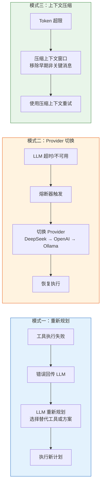

#### 11.5.2 AgentSelfHealer — 自愈引擎

```java
package com.lifepilot.agent.error;

import com.lifepilot.agent.exception.*;
import com.lifepilot.agent.loop.AgentAction;
import com.lifepilot.agent.loop.AgentState;
import com.lifepilot.agent.context.ContextCompressor;
import com.lifepilot.llm.router.LlmRouter;
import org.slf4j.Logger;
import org.slf4j.LoggerFactory;
import org.springframework.stereotype.Component;

import java.util.Optional;

/**
 * Agent 自愈引擎 — 在错误发生后尝试自动恢复。
 *
 * <p>自愈引擎在 {@link AgentErrorHandler} 之后执行。
 * 当 ErrorHandler 返回的恢复动作不是简单的终止时，
 * 自愈引擎会尝试更智能的恢复策略。</p>
 *
 * <p>三种自愈模式：
 * <ol>
 *   <li><b>重新规划</b> — 工具失败后，将错误上下文回传 LLM，
 *       让 LLM 选择替代工具或调整执行计划</li>
 *   <li><b>Provider 切换</b> — LLM 故障后，通过 LlmRouter
 *       自动切换到下一个可用的 Provider</li>
 *   <li><b>上下文压缩</b> — Token 超限后，压缩上下文窗口
 *       移除早期非关键消息，用更小的上下文重试</li>
 * </ol></p>
 */
@Component
public class AgentSelfHealer {

    private static final Logger log = LoggerFactory.getLogger(AgentSelfHealer.class);

    /** 上下文压缩的最大尝试次数。 */
    private static final int MAX_COMPRESSION_ATTEMPTS = 2;

    private final LlmRouter llmRouter;
    private final ContextCompressor contextCompressor;

    public AgentSelfHealer(LlmRouter llmRouter, ContextCompressor contextCompressor) {
        this.llmRouter = llmRouter;
        this.contextCompressor = contextCompressor;
    }

    /**
     * 尝试自愈。返回 Optional.empty() 表示无法自愈，需要终止。
     *
     * @param ex    原始异常
     * @param state 当前 Agent 状态
     * @return 自愈后的新状态（如果可以自愈）
     */
    public Optional<AgentState> attemptHealing(AgentException ex, AgentState state) {
        return switch (ex) {
            // 模式一：工具失败 → 重新规划
            case ToolNotFoundException e     -> healByReplanning(e, state);
            case ToolValidationException e   -> healByReplanning(e, state);
            case ToolExecutionException e    -> healByReplanning(e, state);

            // 模式二：LLM 故障 → Provider 切换
            case LlmUnavailableException e   -> healByProviderSwitch(e, state);
            case LlmTimeoutException e       -> healByProviderSwitch(e, state);
            case LlmRateLimitException e     -> healByProviderSwitch(e, state);

            // 会话和预算异常无法自愈
            case SessionException _          -> Optional.empty();
            case BudgetExhaustedException _  -> Optional.empty();
        };
    }

    /**
     * 模式一：重新规划 — 将工具错误回传 LLM，让 LLM 重新决策。
     *
     * <p>构造一条包含错误上下文的系统消息，注入到对话历史中，
     * 然后将 Agent 状态回退到 PLANNING 阶段，让 LLM 重新规划。</p>
     */
    private Optional<AgentState> healByReplanning(ToolException toolEx, AgentState state) {
        log.info("自愈: 工具失败后重新规划, toolId={}, error={}",
                 toolEx.toolId(), toolEx.errorCode());

        // 构造错误反馈消息
        String feedback = switch (toolEx) {
            case ToolNotFoundException e ->
                "工具 '%s' 不存在。可用工具列表: %s。请选择其他工具或调整方案。"
                    .formatted(e.toolId(), e.availableTools());
            case ToolValidationException e ->
                "工具 '%s' 的参数不正确: %s。请修正参数。"
                    .formatted(e.toolId(), e.violations());
            case ToolExecutionException e ->
                "工具 '%s' 执行失败（耗时 %dms）: %s。请考虑替代方案。"
                    .formatted(e.toolId(), e.executionTime().toMillis(), e.getMessage());
        };

        // 回退到 PLANNING 阶段，注入错误上下文
        var healedState = state.toBuilder()
            .phase(AgentPhase.PLANNING)
            .errorFeedback(feedback)
            .healingAttempt(state.healingAttempt() + 1)
            .build();

        return Optional.of(healedState);
    }

    /**
     * 模式二：Provider 切换 — 通过 LlmRouter 切换到下一个可用 Provider。
     *
     * <p>标记当前 Provider 为故障状态，让 LlmRouter 在下次调用时
     * 自动选择下一个可用的 Provider。如果所有云端 Provider 都不可用，
     * LlmRouter 会降级到本地模型。</p>
     */
    private Optional<AgentState> healByProviderSwitch(LlmException llmEx, AgentState state) {
        String failedProvider = llmEx.providerId();
        log.info("自愈: LLM 故障后切换 Provider, failed={}", failedProvider);

        // 标记故障 Provider
        llmRouter.markFailed(failedProvider);

        // 检查是否还有可用 Provider
        var nextProvider = llmRouter.nextAvailable();
        if (nextProvider.isEmpty()) {
            log.warn("自愈失败: 所有 LLM Provider 均不可用");
            return Optional.empty();
        }

        log.info("自愈: 切换到 Provider={}", nextProvider.get().id());
        var healedState = state.toBuilder()
            .retryCount(0)  // 新 Provider 重置重试计数
            .healingAttempt(state.healingAttempt() + 1)
            .build();

        return Optional.of(healedState);
    }

    /**
     * 模式三：上下文压缩 — Token 超限时压缩上下文窗口。
     *
     * <p>当 LLM 返回 Token 超限错误时，使用 ContextCompressor
     * 移除早期非关键消息，保留系统提示、最近的用户消息和工具结果，
     * 然后用压缩后的上下文重试 LLM 调用。</p>
     *
     * <p>压缩策略（按优先级）：
     * <ol>
     *   <li>移除早期的 Assistant 消息（保留最近 3 轮）</li>
     *   <li>摘要化早期工具调用结果（保留结论，移除原始数据）</li>
     *   <li>截断过长的单条消息（保留前 500 字符 + 省略标记）</li>
     * </ol></p>
     *
     * @param state 当前 Agent 状态
     * @return 压缩后的新状态（如果压缩成功）
     */
    public Optional<AgentState> healByContextCompression(AgentState state) {
        if (state.compressionAttempt() >= MAX_COMPRESSION_ATTEMPTS) {
            log.warn("自愈失败: 上下文压缩次数已达上限={}", MAX_COMPRESSION_ATTEMPTS);
            return Optional.empty();
        }

        log.info("自愈: 压缩上下文窗口, attempt={}/{}, messageCount={}",
                 state.compressionAttempt() + 1, MAX_COMPRESSION_ATTEMPTS,
                 state.messages().size());

        var compressedMessages = contextCompressor.compress(
            state.messages(),
            contextCompressor.targetTokenCount(state)
        );

        log.info("上下文压缩完成: before={} 条消息, after={} 条消息",
                 state.messages().size(), compressedMessages.size());

        var healedState = state.toBuilder()
            .messages(List.copyOf(compressedMessages))
            .compressionAttempt(state.compressionAttempt() + 1)
            .build();

        return Optional.of(healedState);
    }
}
```

#### 11.5.3 自愈流程在 AgentLoop 中的集成

以下代码展示了 `AgentLoop` 如何将 `AgentErrorHandler` 和 `AgentSelfHealer` 串联起来，形成完整的错误处理管线：

```java
/**
 * AgentLoop 主循环中的错误处理管线。
 *
 * <p>处理流程：
 * 异常捕获 → ErrorHandler 分类处理 → SelfHealer 尝试自愈 → 恢复或终止</p>
 */
private AgentState handleError(Exception ex, AgentState state) {
    // 1. 将原始异常包装为 AgentException（如果还不是）
    AgentException agentEx = wrapIfNeeded(ex);

    // 2. ErrorHandler 决定恢复策略
    ErrorRecoveryAction recovery = errorHandler.handle(agentEx, state);

    // 3. 如果是终止动作，先尝试自愈
    if (recovery instanceof ErrorRecoveryAction.Terminate
        && state.healingAttempt() < MAX_HEALING_ATTEMPTS) {

        Optional<AgentState> healed = selfHealer.attemptHealing(agentEx, state);
        if (healed.isPresent()) {
            log.info("自愈成功: healingAttempt={}", healed.get().healingAttempt());
            return healed.get(); // 返回自愈后的状态，继续循环
        }
    }

    // 4. 无法自愈，执行恢复动作（重试/故障转移/终止）
    return executeRecovery(recovery, state);
}

/**
 * 将非 AgentException 的异常包装为对应的 AgentException。
 */
private AgentException wrapIfNeeded(Exception ex) {
    if (ex instanceof AgentException ae) return ae;

    // 根据异常类型推断最合适的 AgentException 包装
    if (ex instanceof java.net.SocketTimeoutException) {
        return new LlmTimeoutException("unknown", Duration.ofSeconds(30), ex);
    }
    if (ex instanceof java.net.ConnectException) {
        return new LlmUnavailableException("unknown", 503, ex);
    }
    // 兜底：包装为工具执行异常
    return new ToolExecutionException("unknown", Duration.ZERO, ex);
}
```

#### 11.5.4 自愈决策矩阵

以下矩阵总结了每种错误场景的自愈策略和预期行为：

| 错误场景 | 自愈模式 | 具体行为 | 最大尝试 | 失败后果 |
|---------|---------|---------|---------|---------|
| 工具未找到 | 重新规划 | 错误回传 LLM，LLM 选择替代工具 | 2 次 | 终止并报告 |
| 工具参数错误 | 重新规划 | 校验详情回传 LLM，LLM 修正参数 | 2 次 | 终止并报告 |
| 工具执行失败 | 重试 → 重新规划 | 先重试 2 次，仍失败则回传 LLM | 2+2 次 | 跳过该工具 |
| LLM 超时 | 重试 → Provider 切换 | 指数退避重试，耗尽后切换 Provider | 2+N 次 | 降级到本地模型 |
| LLM 不可用 | Provider 切换 | 直接切换到下一个 Provider | N 次 | 降级到最小模式 |
| LLM 速率限制 | 等待 → 重试 | 按 Retry-After 等待后重试 | 2 次 | Provider 切换 |
| Token 超限 | 上下文压缩 | 压缩对话历史后重试 LLM 调用 | 2 次 | 终止并保留进度 |
| 会话不存在 | 无法自愈 | — | — | 终止，提示新建会话 |
| 预算耗尽 | 无法自愈 | — | — | 优雅终止，保留结果 |

#### 11.5.5 熔断器自动恢复探测

当 LLM Provider 被熔断后，系统不会永久放弃该 Provider。熔断器在 `OPEN` 状态持续一段时间后（默认 30s），自动进入 `HALF_OPEN` 状态，发送轻量级探测请求验证 Provider 是否恢复：

```java
/**
 * 熔断器恢复探测 — 在 HALF_OPEN 状态下验证 Provider 可用性。
 *
 * <p>探测请求使用最小的 Token 消耗（简单的 echo 请求），
 * 避免在 Provider 仍不可用时浪费资源。</p>
 */
private boolean probeProvider(String providerId) {
    try {
        // 发送轻量级探测请求（最小 Token 消耗）
        var response = llmRouter.probe(providerId, "ping");
        if (response.isPresent()) {
            log.info("Provider 恢复探测成功: provider={}", providerId);
            return true;
        }
    } catch (Exception e) {
        log.debug("Provider 恢复探测失败: provider={}, error={}",
                  providerId, e.getMessage());
    }
    return false;
}
```

熔断器状态转换与自动恢复的完整生命周期：

```
CLOSED ──[连续失败≥3次]──► OPEN ──[等待30s]──► HALF_OPEN ──[探测成功]──► CLOSED
                                    │                          │
                                    │                    [探测失败]
                                    │                          │
                                    ◄──────────────────────────┘
                                         延长熔断时间
```


---

## 12. 可观测性集成

Agent 引擎的可观测性不是事后附加的"日志打印"，而是从架构层面内建的核心能力。本节定义 Agent 引擎如何与可观测性系统（详见 [architecture/observability.md](../architecture/observability.md)）集成，覆盖五个维度：OpenTelemetry Trace 导出、Micrometer 指标体系、结构化日志、TraceRecorder 桥接、以及 Actuator 健康检查。

核心设计原则：**Agent 引擎的业务代码零侵入**——所有可观测性逻辑通过 Spring AI Advisor、Micrometer 自动注入、MDC 上下文传播等横切机制实现，`AgentLoop` 本身不包含任何可观测性代码。

```
┌─────────────────────────────────────────────────────────────────────────────┐
│                    Agent 引擎可观测性集成全景                                 │
│                                                                             │
│  ┌──────────────┐   ┌──────────────┐   ┌──────────────┐   ┌─────────────┐  │
│  │ OpenTelemetry │   │  Micrometer  │   │  结构化日志   │   │  Actuator   │  │
│  │  Trace 导出   │   │  指标体系     │   │  MDC 上下文   │   │  健康检查   │  │
│  ├──────────────┤   ├──────────────┤   ├──────────────┤   ├─────────────┤  │
│  │ GenAI 语义约定 │   │ 直方图/计数器 │   │ sessionId    │   │ LLM 健康    │  │
│  │ Span 层次结构  │   │ 仪表/比率     │   │ traceId      │   │ 会话计数    │  │
│  │ 属性标准化     │   │ 多维标签      │   │ phase        │   │ 预算利用率  │  │
│  └──────┬───────┘   └──────┬───────┘   └──────┬───────┘   └──────┬──────┘  │
│         │                  │                   │                  │         │
│         └──────────────────┴───────────────────┴──────────────────┘         │
│                                    │                                        │
│                          ┌─────────┴─────────┐                              │
│                          │   TraceRecorder    │                              │
│                          │   (内部追踪系统)    │                              │
│                          │   ↕ 双向桥接        │                              │
│                          └───────────────────┘                              │
└─────────────────────────────────────────────────────────────────────────────┘
```


### 12.1 OpenTelemetry Trace 集成

#### 12.1.1 GenAI 语义约定对齐

ZhiWei 遵循 2025-2026 年 [OpenTelemetry GenAI Semantic Conventions](https://opentelemetry.io/docs/specs/semconv/gen-ai/) 定义 Span 命名和属性。Agent 引擎的每个关键操作都映射为一个 OTel Span，形成层次化的 Trace 树：

```
Trace: agent.session (root span)
  ├── agent.loop.step [step_index=0, phase=UNDERSTANDING]
  │   ├── agent.llm.call [model=deepseek-chat, tokens.input=150, tokens.output=80]
  │   └── agent.guardrail.check [policy=input-safety, passed=true]
  ├── agent.loop.step [step_index=1, phase=PLANNING]
  │   └── agent.llm.call [model=deepseek-chat, tokens.input=200, tokens.output=120]
  ├── agent.loop.step [step_index=2, phase=EXECUTING]
  │   ├── agent.tool.execute [tool=schedule.create, risk=LOW, duration=15ms]
  │   └── agent.guardrail.check [policy=tool-risk, passed=true]
  └── agent.loop.step [step_index=3, phase=RESPONDING]
      └── agent.llm.call [model=qwen2.5:7b, tokens.input=100, tokens.output=60]
```

Span 命名约定：

| Span 名称 | 触发时机 | 对应 TraceStep |
|-----------|---------|---------------|
| `agent.session` | 会话开始 | TraceRecord（根 Span） |
| `agent.loop.step` | 每个循环步骤 | StateTransitionStep |
| `agent.llm.call` | 每次 LLM 调用 | LlmCallStep |
| `agent.tool.execute` | 每次工具执行 | ToolCallStep |
| `agent.guardrail.check` | 每次护栏检查 | GuardrailStep |
| `agent.evaluation` | 轨迹评估 | EvaluationStep |


#### 12.1.2 标准属性定义

每个 Span 携带的属性遵循 GenAI 语义约定，并扩展 ZhiWei 自定义属性（`lifepilot.*` 命名空间）：

```java
package com.lifepilot.agent.observability;

import java.util.Map;

/**
 * Agent Span 属性常量 — 对齐 OpenTelemetry GenAI 语义约定。
 *
 * <p>属性分为三类：
 * <ul>
 *   <li>GenAI 标准属性（{@code gen_ai.*}）— 直接对齐 OTel 规范</li>
 *   <li>ZhiWei 扩展属性（{@code lifepilot.*}）— Agent 引擎特有</li>
 *   <li>通用属性（{@code session_id} 等）— 跨 Span 传播</li>
 * </ul></p>
 */
public final class AgentSpanAttributes {

    private AgentSpanAttributes() {}

    // ===== GenAI 标准属性（对齐 OTel GenAI Semantic Conventions） =====

    /** LLM 提供商标识（如 "deepseek"、"openai"、"ollama"）。 */
    public static final String GEN_AI_SYSTEM = "gen_ai.system";

    /** 请求的模型名称。 */
    public static final String GEN_AI_REQUEST_MODEL = "gen_ai.request.model";

    /** 实际响应的模型名称。 */
    public static final String GEN_AI_RESPONSE_MODEL = "gen_ai.response.model";

    /** 输入 Token 数。 */
    public static final String GEN_AI_USAGE_INPUT_TOKENS = "gen_ai.usage.input_tokens";

    /** 输出 Token 数。 */
    public static final String GEN_AI_USAGE_OUTPUT_TOKENS = "gen_ai.usage.output_tokens";

    /** 温度参数。 */
    public static final String GEN_AI_REQUEST_TEMPERATURE = "gen_ai.request.temperature";

    /** 完成原因（如 "stop"、"length"、"tool_calls"）。 */
    public static final String GEN_AI_RESPONSE_FINISH_REASONS = "gen_ai.response.finish_reasons";

    // ===== ZhiWei 扩展属性 =====

    /** 会话 ID。 */
    public static final String SESSION_ID = "lifepilot.session_id";

    /** 当前阶段（UNDERSTANDING / PLANNING / EXECUTING / RESPONDING）。 */
    public static final String AGENT_PHASE = "lifepilot.agent.phase";

    /** 步骤序号。 */
    public static final String STEP_INDEX = "lifepilot.agent.step_index";

    /** 累计步骤数。 */
    public static final String STEP_COUNT = "lifepilot.agent.step_count";

    /** 累计 Token 消耗。 */
    public static final String TOKEN_USAGE_TOTAL = "lifepilot.agent.token_usage.total";

    /** 工具 ID。 */
    public static final String TOOL_ID = "lifepilot.tool.id";

    /** 工具风险等级。 */
    public static final String TOOL_RISK_LEVEL = "lifepilot.tool.risk_level";

    /** 护栏策略 ID。 */
    public static final String GUARDRAIL_POLICY_ID = "lifepilot.guardrail.policy_id";

    /** 护栏检查结果（passed / blocked / needs_confirmation）。 */
    public static final String GUARDRAIL_RESULT = "lifepilot.guardrail.result";

    /** 预算使用比率（0.0 ~ 1.0）。 */
    public static final String BUDGET_USAGE_RATIO = "lifepilot.agent.budget_usage_ratio";

    /** 是否命中语义缓存。 */
    public static final String CACHE_HIT = "lifepilot.llm.cache_hit";

    /** 通道类型（cli / web / api）。 */
    public static final String CHANNEL_TYPE = "lifepilot.channel_type";
}
```


#### 12.1.3 AgentSpanFactory — Span 创建工厂

`AgentSpanFactory` 封装了 OpenTelemetry Span 的创建逻辑，确保所有 Span 都携带标准属性，并自动建立父子关系。

```java
package com.lifepilot.agent.observability;

import com.lifepilot.agent.loop.AgentState;
import com.lifepilot.observability.trace.*;
import io.opentelemetry.api.trace.Span;
import io.opentelemetry.api.trace.SpanKind;
import io.opentelemetry.api.trace.Tracer;
import io.opentelemetry.context.Context;
import org.slf4j.Logger;
import org.slf4j.LoggerFactory;
import org.springframework.stereotype.Component;

import java.util.Objects;

/**
 * Agent Span 工厂 — 创建符合 GenAI 语义约定的 OpenTelemetry Span。
 *
 * <p>所有 Agent 引擎的 OTel Span 都通过此工厂创建，确保：
 * <ul>
 *   <li>Span 命名遵循 {@code agent.*} 约定</li>
 *   <li>标准属性（session_id、phase、step_count）自动注入</li>
 *   <li>父子关系通过 {@link Context} 自动传播</li>
 *   <li>GenAI 属性对齐 OTel 规范</li>
 * </ul></p>
 *
 * <p>设计决策：Span 创建与 Span 结束分离。工厂只负责创建 Span 并设置属性，
 * Span 的结束由调用方在 try-finally 中完成。这避免了工厂持有 Span 引用
 * 导致的生命周期管理复杂性。</p>
 *
 * @see AgentSpanAttributes 属性常量
 * @see OtelTraceExporter TraceRecorder 到 OTel 的桥接
 */
@Component
public class AgentSpanFactory {

    private static final Logger log = LoggerFactory.getLogger(AgentSpanFactory.class);

    private final Tracer tracer;

    public AgentSpanFactory(Tracer tracer) {
        this.tracer = Objects.requireNonNull(tracer, "Tracer 不能为空");
    }

    /**
     * 创建会话根 Span — 代表一次完整的 Agent 会话。
     *
     * @param sessionId 会话 ID
     * @param goal      用户目标（脱敏后）
     * @return 根 Span（调用方负责结束）
     */
    public Span startSessionSpan(String sessionId, String goal) {
        log.debug("创建会话根 Span: sessionId={}", sessionId);
        return tracer.spanBuilder("agent.session")
            .setSpanKind(SpanKind.SERVER)
            .setAttribute(AgentSpanAttributes.SESSION_ID, sessionId)
            .setAttribute("agent.goal", goal)
            .setAttribute(AgentSpanAttributes.CHANNEL_TYPE, "unknown")
            .startSpan();
    }

    /**
     * 创建循环步骤 Span — 代表 AgentLoop 的一个步骤。
     *
     * @param state  当前 Agent 状态
     * @param parent 父 Span 上下文
     * @return 步骤 Span
     */
    public Span startStepSpan(AgentState state, Context parent) {
        return tracer.spanBuilder("agent.loop.step")
            .setParent(parent)
            .setSpanKind(SpanKind.INTERNAL)
            .setAttribute(AgentSpanAttributes.SESSION_ID, state.sessionId())
            .setAttribute(AgentSpanAttributes.AGENT_PHASE, state.phase().name())
            .setAttribute(AgentSpanAttributes.STEP_INDEX, state.stepCount())
            .setAttribute(AgentSpanAttributes.STEP_COUNT, state.stepCount())
            .setAttribute(AgentSpanAttributes.BUDGET_USAGE_RATIO,
                state.budget().usageRatio())
            .startSpan();
    }

    /**
     * 创建 LLM 调用 Span — 对齐 GenAI 语义约定。
     *
     * @param providerId Provider 标识
     * @param modelId    模型标识
     * @param scene      调用场景
     * @param parent     父 Span 上下文
     * @return LLM 调用 Span
     */
    public Span startLlmCallSpan(String providerId, String modelId,
                                  String scene, Context parent) {
        return tracer.spanBuilder("agent.llm.call")
            .setParent(parent)
            .setSpanKind(SpanKind.CLIENT)
            .setAttribute(AgentSpanAttributes.GEN_AI_SYSTEM, providerId)
            .setAttribute(AgentSpanAttributes.GEN_AI_REQUEST_MODEL, modelId)
            .setAttribute("lifepilot.llm.scene", scene)
            .startSpan();
    }

    /**
     * 为 LLM 调用 Span 补充响应属性（在 LLM 返回后调用）。
     *
     * @param span         LLM 调用 Span
     * @param inputTokens  输入 Token 数
     * @param outputTokens 输出 Token 数
     * @param finishReason 完成原因
     * @param cacheHit     是否命中缓存
     */
    public void enrichLlmSpan(Span span, int inputTokens, int outputTokens,
                               String finishReason, boolean cacheHit) {
        span.setAttribute(AgentSpanAttributes.GEN_AI_USAGE_INPUT_TOKENS, inputTokens);
        span.setAttribute(AgentSpanAttributes.GEN_AI_USAGE_OUTPUT_TOKENS, outputTokens);
        span.setAttribute(AgentSpanAttributes.GEN_AI_RESPONSE_FINISH_REASONS, finishReason);
        span.setAttribute(AgentSpanAttributes.CACHE_HIT, cacheHit);
    }

    /**
     * 创建工具执行 Span。
     *
     * @param toolId    工具 ID
     * @param riskLevel 风险等级
     * @param parent    父 Span 上下文
     * @return 工具执行 Span
     */
    public Span startToolExecuteSpan(String toolId, String riskLevel,
                                      Context parent) {
        return tracer.spanBuilder("agent.tool.execute")
            .setParent(parent)
            .setSpanKind(SpanKind.CLIENT)
            .setAttribute(AgentSpanAttributes.TOOL_ID, toolId)
            .setAttribute(AgentSpanAttributes.TOOL_RISK_LEVEL, riskLevel)
            .startSpan();
    }

    /**
     * 创建护栏检查 Span。
     *
     * @param policyId  策略 ID
     * @param checkType 检查类型（pre-call / post-call / tool-call）
     * @param parent    父 Span 上下文
     * @return 护栏检查 Span
     */
    public Span startGuardrailSpan(String policyId, String checkType,
                                    Context parent) {
        return tracer.spanBuilder("agent.guardrail.check")
            .setParent(parent)
            .setSpanKind(SpanKind.INTERNAL)
            .setAttribute(AgentSpanAttributes.GUARDRAIL_POLICY_ID, policyId)
            .setAttribute("lifepilot.guardrail.check_type", checkType)
            .startSpan();
    }
}
```


### 12.2 Agent 指标体系

Agent 引擎通过 Micrometer 暴露关键运行指标，所有指标自动注册到 Spring Boot Actuator 的 `/actuator/metrics` 端点。指标设计遵循 RED 方法论（Rate、Errors、Duration）并扩展 Agent 特有的资源维度。

#### 12.2.1 指标总览

| 指标名称 | 类型 | 标签 | 说明 |
|---------|------|------|------|
| `agent.loop.step.duration` | Histogram | phase, session_id | 单步执行耗时分布 |
| `agent.llm.call.duration` | Histogram | provider, model, scene, cache_hit | LLM 调用耗时分布 |
| `agent.tool.execute.duration` | Histogram | tool_id, risk_level, success | 工具执行耗时分布 |
| `agent.session.active.count` | Gauge | — | 当前活跃会话数 |
| `agent.budget.usage.ratio` | Gauge | session_id, dimension | 预算使用比率（0.0~1.0） |
| `agent.error.count` | Counter | error_code, recoverable | 错误计数（按错误码分类） |
| `agent.llm.tokens.total` | Counter | provider, model, scene | 累计 Token 消耗 |
| `agent.guardrail.check.count` | Counter | policy_id, result | 护栏检查次数（通过/拦截） |


#### 12.2.2 AgentMetrics — Micrometer 指标注册

```java
package com.lifepilot.agent.observability;

import com.lifepilot.agent.loop.AgentState;
import com.lifepilot.observability.trace.LlmCallStep;
import com.lifepilot.observability.trace.ToolCallStep;
import io.micrometer.core.instrument.*;
import org.slf4j.Logger;
import org.slf4j.LoggerFactory;
import org.springframework.stereotype.Component;

import java.time.Duration;
import java.util.Objects;
import java.util.concurrent.ConcurrentHashMap;
import java.util.concurrent.atomic.AtomicInteger;

/**
 * Agent 指标收集器 — 通过 Micrometer 注册和记录 Agent 引擎运行指标。
 *
 * <p>所有指标通过 Micrometer 的 {@link MeterRegistry} 注册，
 * 自动暴露到 Spring Boot Actuator 的 {@code /actuator/metrics} 端点，
 * 并可导出到 Prometheus、OTLP 等后端。</p>
 *
 * <p>线程安全：所有计数器和仪表使用 Micrometer 内置的线程安全实现，
 * 活跃会话计数使用 {@link AtomicInteger}。</p>
 *
 * <p>与 {@code MetricsCollector}（observability 模块）的关系：
 * {@code AgentMetrics} 聚焦 Agent 引擎的 Micrometer 指标注册，
 * {@code MetricsCollector} 聚焦内部指标聚合和 SQLite 持久化。
 * 两者互补，不重复。</p>
 *
 * @see AgentSpanAttributes 属性常量（标签名复用）
 */
@Component
public class AgentMetrics {

    private static final Logger log = LoggerFactory.getLogger(AgentMetrics.class);

    private final MeterRegistry registry;
    private final AtomicInteger activeSessionCount = new AtomicInteger(0);

    /** 每个会话的预算使用比率缓存（Gauge 需要引用可变值）。 */
    private final ConcurrentHashMap<String, Double> budgetRatios =
        new ConcurrentHashMap<>();

    public AgentMetrics(MeterRegistry registry) {
        this.registry = Objects.requireNonNull(registry, "MeterRegistry 不能为空");

        // 注册活跃会话数 Gauge
        Gauge.builder("agent.session.active.count", activeSessionCount, AtomicInteger::get)
            .description("当前活跃的 Agent 会话数")
            .register(registry);

        log.info("Agent 指标注册完成");
    }

    // ===== 步骤指标 =====

    /**
     * 记录单步执行耗时。
     *
     * @param phase    当前阶段
     * @param duration 步骤耗时
     */
    public void recordStepDuration(String phase, Duration duration) {
        Timer.builder("agent.loop.step.duration")
            .tag("phase", phase)
            .description("Agent 单步执行耗时")
            .publishPercentiles(0.5, 0.9, 0.95, 0.99)
            .register(registry)
            .record(duration);
    }

    // ===== LLM 指标 =====

    /**
     * 记录 LLM 调用耗时和 Token 消耗。
     *
     * @param step LLM 调用步骤
     */
    public void recordLlmCall(LlmCallStep step) {
        // 耗时直方图
        Timer.builder("agent.llm.call.duration")
            .tag("provider", step.providerId())
            .tag("model", step.modelId())
            .tag("scene", step.scene())
            .tag("cache_hit", String.valueOf(step.cacheHit()))
            .description("LLM 调用耗时")
            .publishPercentiles(0.5, 0.9, 0.95, 0.99)
            .register(registry)
            .record(step.latency());

        // Token 计数器
        Counter.builder("agent.llm.tokens.total")
            .tag("provider", step.providerId())
            .tag("model", step.modelId())
            .tag("scene", step.scene())
            .tag("type", "input")
            .description("累计输入 Token 消耗")
            .register(registry)
            .increment(step.inputTokens());

        Counter.builder("agent.llm.tokens.total")
            .tag("provider", step.providerId())
            .tag("model", step.modelId())
            .tag("scene", step.scene())
            .tag("type", "output")
            .description("累计输出 Token 消耗")
            .register(registry)
            .increment(step.outputTokens());
    }

    // ===== 工具指标 =====

    /**
     * 记录工具执行耗时。
     *
     * @param step 工具调用步骤
     */
    public void recordToolExecution(ToolCallStep step) {
        Timer.builder("agent.tool.execute.duration")
            .tag("tool_id", step.toolId())
            .tag("risk_level", step.riskLevel().name())
            .tag("success", String.valueOf(step.success()))
            .description("工具执行耗时")
            .publishPercentiles(0.5, 0.9, 0.95, 0.99)
            .register(registry)
            .record(step.duration());
    }

    // ===== 会话指标 =====

    /** 会话开始时调用 — 活跃计数 +1。 */
    public void sessionStarted(String sessionId) {
        activeSessionCount.incrementAndGet();
        log.debug("会话开始, 活跃数: count={}", activeSessionCount.get());
    }

    /** 会话结束时调用 — 活跃计数 -1。 */
    public void sessionEnded(String sessionId) {
        activeSessionCount.decrementAndGet();
        budgetRatios.remove(sessionId);
        log.debug("会话结束, 活跃数: count={}", activeSessionCount.get());
    }

    // ===== 预算指标 =====

    /**
     * 更新预算使用比率 Gauge。
     *
     * @param sessionId 会话 ID
     * @param dimension 预算维度（steps / tokens / duration）
     * @param ratio     使用比率（0.0 ~ 1.0）
     */
    public void updateBudgetUsage(String sessionId, String dimension, double ratio) {
        String key = sessionId + ":" + dimension;
        budgetRatios.put(key, ratio);

        Gauge.builder("agent.budget.usage.ratio", budgetRatios,
                map -> map.getOrDefault(key, 0.0))
            .tag("session_id", sessionId)
            .tag("dimension", dimension)
            .description("预算使用比率")
            .register(registry);
    }

    // ===== 错误指标 =====

    /**
     * 记录错误事件。
     *
     * @param errorCode   错误码
     * @param recoverable 是否可恢复
     */
    public void recordError(String errorCode, boolean recoverable) {
        Counter.builder("agent.error.count")
            .tag("error_code", errorCode)
            .tag("recoverable", String.valueOf(recoverable))
            .description("Agent 错误计数")
            .register(registry)
            .increment();
    }

    // ===== 护栏指标 =====

    /**
     * 记录护栏检查事件。
     *
     * @param policyId 策略 ID
     * @param passed   是否通过
     */
    public void recordGuardrailCheck(String policyId, boolean passed) {
        Counter.builder("agent.guardrail.check.count")
            .tag("policy_id", policyId)
            .tag("result", passed ? "passed" : "blocked")
            .description("护栏检查次数")
            .register(registry)
            .increment();
    }
}
```


### 12.3 结构化日志

#### 12.3.1 MDC 上下文传播

Agent 引擎的每条日志都携带结构化上下文，通过 SLF4J MDC（Mapped Diagnostic Context）自动注入。这使得在海量日志中按 `sessionId`、`traceId`、`phase` 过滤成为可能。

MDC 字段定义：

| MDC Key | 来源 | 示例值 | 说明 |
|---------|------|--------|------|
| `sessionId` | AgentState | `sess-20260315-001` | 会话标识 |
| `traceId` | TraceContext | `trace-20260315-001` | 追踪标识（关联 OTel） |
| `phase` | AgentState | `EXECUTING` | 当前阶段 |
| `stepCount` | AgentState | `3` | 当前步骤数 |
| `providerId` | LlmRouter | `deepseek` | 当前 LLM Provider |

日志输出格式（JSON 结构化）：

```json
{
  "timestamp": "2026-03-15T14:30:00.123Z",
  "level": "INFO",
  "logger": "com.lifepilot.agent.loop.AgentLoop",
  "message": "步骤执行完成: phase=EXECUTING, action=ToolCallAction",
  "sessionId": "sess-20260315-001",
  "traceId": "trace-20260315-001",
  "phase": "EXECUTING",
  "stepCount": "3",
  "providerId": "deepseek"
}
```


#### 12.3.2 AgentLoggingAdvisor — MDC 自动注入

`AgentLoggingAdvisor` 作为 Spring AI Advisor 链的一环，在每次 LLM 调用前自动设置 MDC 上下文，调用后自动清理，确保 Agent 引擎内所有日志都携带完整的上下文信息。

```java
package com.lifepilot.agent.observability;

import com.lifepilot.agent.loop.AgentState;
import org.slf4j.Logger;
import org.slf4j.LoggerFactory;
import org.slf4j.MDC;
import org.springframework.ai.chat.client.advisor.api.*;
import org.springframework.core.Ordered;
import reactor.core.publisher.Flux;

/**
 * Agent 日志 Advisor — 在 LLM 调用前后自动管理 MDC 上下文。
 *
 * <p>执行顺序：在 Advisor 链中最先执行（{@code HIGHEST_PRECEDENCE + 50}），
 * 确保后续 Advisor（TraceAdvisor、GuardrailAdvisor）的日志都携带 MDC 上下文。</p>
 *
 * <p>MDC 生命周期：
 * <ol>
 *   <li>{@code before()} — 从 AdvisedRequest 的 advisorContext 中提取 AgentState，设置 MDC</li>
 *   <li>后续 Advisor 和 LLM 调用执行（日志自动携带 MDC）</li>
 *   <li>{@code after()} — 清理 MDC，防止线程复用时上下文泄漏</li>
 * </ol></p>
 *
 * <p>Virtual Thread 兼容：MDC 基于 ThreadLocal，在 Virtual Thread 中
 * 每个虚拟线程有独立的 MDC 副本，不会交叉污染。</p>
 */
public class AgentLoggingAdvisor implements CallAroundAdvisor {

    private static final Logger log = LoggerFactory.getLogger(AgentLoggingAdvisor.class);
    private static final int ORDER = Ordered.HIGHEST_PRECEDENCE + 50;

    // MDC Key 常量
    private static final String MDC_SESSION_ID = "sessionId";
    private static final String MDC_TRACE_ID = "traceId";
    private static final String MDC_PHASE = "phase";
    private static final String MDC_STEP_COUNT = "stepCount";
    private static final String MDC_PROVIDER_ID = "providerId";

    @Override
    public int getOrder() { return ORDER; }

    @Override
    public String getName() { return "AgentLoggingAdvisor"; }

    @Override
    public AdvisedResponse aroundCall(AdvisedRequest request, CallAroundAdvisorChain chain) {
        // 从 advisorContext 提取 AgentState
        var context = request.advisorContext();
        var state = (AgentState) context.get("agentState");

        setMdc(state, context);
        try {
            log.debug("LLM 调用开始: phase={}, step={}",
                      state != null ? state.phase() : "unknown",
                      state != null ? state.stepCount() : -1);

            AdvisedResponse response = chain.nextAroundCall(request);

            log.debug("LLM 调用完成: phase={}", state != null ? state.phase() : "unknown");
            return response;
        } finally {
            clearMdc();
        }
    }

    /**
     * 设置 MDC 上下文。
     *
     * <p>从 AgentState 和 advisorContext 中提取所有 MDC 字段。
     * 如果 AgentState 为 null（非 Agent 场景的 LLM 调用），
     * 仅设置可用的上下文字段。</p>
     */
    private void setMdc(@Nullable AgentState state,
                        java.util.Map<String, Object> context) {
        if (state != null) {
            MDC.put(MDC_SESSION_ID, state.sessionId());
            MDC.put(MDC_PHASE, state.phase().name());
            MDC.put(MDC_STEP_COUNT, String.valueOf(state.stepCount()));
        }

        // traceId 从 TraceContext 获取
        var traceId = context.get("traceId");
        if (traceId != null) {
            MDC.put(MDC_TRACE_ID, traceId.toString());
        }

        // providerId 从路由上下文获取
        var providerId = context.get("providerId");
        if (providerId != null) {
            MDC.put(MDC_PROVIDER_ID, providerId.toString());
        }
    }

    /** 清理所有 MDC 字段，防止线程复用时上下文泄漏。 */
    private void clearMdc() {
        MDC.remove(MDC_SESSION_ID);
        MDC.remove(MDC_TRACE_ID);
        MDC.remove(MDC_PHASE);
        MDC.remove(MDC_STEP_COUNT);
        MDC.remove(MDC_PROVIDER_ID);
    }
}
```


### 12.4 TraceRecorder 与 OpenTelemetry 的桥接

#### 12.4.1 桥接架构

ZhiWei 内部使用 `TraceRecorder`（§7）记录完整的决策轨迹并持久化到 SQLite。同时，为了与外部可观测性生态（Jaeger、Zipkin、Grafana Tempo）集成，需要将内部 `TraceEvent` 转换为标准的 OpenTelemetry Span。`OtelTraceExporter` 承担这一桥接职责。

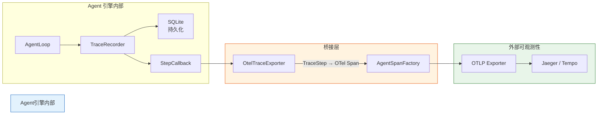

关键设计决策：**桥接是单向的、异步的、可选的**。
- 单向：TraceRecorder → OTel，OTel 不反向影响内部追踪
- 异步：Span 导出在 Virtual Thread 中执行，不阻塞 Agent 主循环
- 可选：通过 `lifepilot.observability.otel.enabled=false` 完全禁用


#### 12.4.2 OtelTraceExporter — 桥接实现

```java
package com.lifepilot.agent.observability;

import com.lifepilot.observability.trace.*;
import io.opentelemetry.api.trace.Span;
import io.opentelemetry.api.trace.StatusCode;
import io.opentelemetry.context.Context;
import org.slf4j.Logger;
import org.slf4j.LoggerFactory;
import org.springframework.boot.autoconfigure.condition.ConditionalOnProperty;
import org.springframework.stereotype.Component;

import java.util.Objects;
import java.util.concurrent.ConcurrentHashMap;

/**
 * OTel Trace 导出器 — 将内部 TraceRecorder 事件桥接到 OpenTelemetry Span。
 *
 * <p>实现 {@link TraceRecorder} 的 {@code StepCallback} 接口，
 * 在每个 TraceStep 写入时同步创建对应的 OTel Span。</p>
 *
 * <p>Span 层次映射：
 * <ul>
 *   <li>{@link TraceRecord} → 根 Span（{@code agent.session}）</li>
 *   <li>{@link StateTransitionStep} → {@code agent.loop.step}</li>
 *   <li>{@link LlmCallStep} → {@code agent.llm.call}（子 Span）</li>
 *   <li>{@link ToolCallStep} → {@code agent.tool.execute}（子 Span）</li>
 *   <li>{@link GuardrailStep} → {@code agent.guardrail.check}（子 Span）</li>
 *   <li>{@link EvaluationStep} → {@code agent.evaluation}（子 Span）</li>
 * </ul></p>
 *
 * <p>条件激活：仅在 {@code lifepilot.observability.otel.enabled=true} 时注册。
 * 默认关闭，避免未配置 OTel 后端时产生无意义的 Span。</p>
 *
 * @see AgentSpanFactory Span 创建工厂
 * @see TraceRecorder 内部追踪记录器
 */
@Component
@ConditionalOnProperty(
    prefix = "lifepilot.observability.otel",
    name = "enabled", havingValue = "true")
public class OtelTraceExporter implements TraceRecorder.StepCallback {

    private static final Logger log = LoggerFactory.getLogger(OtelTraceExporter.class);

    private final AgentSpanFactory spanFactory;

    /** 活跃的根 Span 缓存（sessionId → root Span + Context）。 */
    private final ConcurrentHashMap<String, SpanContext> activeRootSpans =
        new ConcurrentHashMap<>();

    /** 当前步骤 Span 缓存（sessionId → 当前 step Span + Context）。 */
    private final ConcurrentHashMap<String, SpanContext> activeStepSpans =
        new ConcurrentHashMap<>();

    public OtelTraceExporter(AgentSpanFactory spanFactory) {
        this.spanFactory = Objects.requireNonNull(spanFactory, "AgentSpanFactory 不能为空");
        log.info("OTel Trace 导出器已激活");
    }

    /** 内部记录：Span + 其 Context（用于建立父子关系）。 */
    private record SpanContext(Span span, Context context) {}

    @Override
    public void onTraceStarted(String sessionId, String goal) {
        Span rootSpan = spanFactory.startSessionSpan(sessionId, goal);
        Context rootCtx = Context.current().with(rootSpan);
        activeRootSpans.put(sessionId, new SpanContext(rootSpan, rootCtx));
        log.debug("OTel 根 Span 已创建: sessionId={}", sessionId);
    }

    @Override
    public void onTraceCompleted(String sessionId, TraceRecord record) {
        var root = activeRootSpans.remove(sessionId);
        activeStepSpans.remove(sessionId);
        if (root != null) {
            if (!record.success()) {
                root.span().setStatus(StatusCode.ERROR, record.errorMessage());
            }
            root.span().setAttribute(AgentSpanAttributes.STEP_COUNT, record.totalSteps());
            root.span().setAttribute(AgentSpanAttributes.TOKEN_USAGE_TOTAL, record.totalTokens());
            root.span().end();
            log.debug("OTel 根 Span 已结束: sessionId={}, steps={}, tokens={}",
                      sessionId, record.totalSteps(), record.totalTokens());
        }
    }

    @Override
    public void onStepRecorded(String sessionId, TraceStep step) {
        var root = activeRootSpans.get(sessionId);
        if (root == null) {
            log.warn("OTel 导出跳过: 未找到根 Span, sessionId={}", sessionId);
            return;
        }

        // 使用 sealed interface 的穷举 switch 转换每种步骤类型
        switch (step) {
            case LlmCallStep llm -> exportLlmCall(llm, root.context());

            case ToolCallStep tool -> exportToolCall(tool, root.context());

            case GuardrailStep guard -> exportGuardrail(guard, root.context());

            case StateTransitionStep transition -> {
                // 状态转换创建新的步骤 Span（作为后续子 Span 的父级）
                var prevStep = activeStepSpans.remove(sessionId);
                if (prevStep != null) prevStep.span().end();
                // 注意：此处简化处理，实际实现需从 AgentState 构建完整上下文
            }

            case EvaluationStep eval -> {
                Span span = spanFactory.startGuardrailSpan(
                    "trajectory-evaluation", "post-execution", root.context());
                span.setAttribute("evaluation.overall_score", eval.overallScore());
                span.setAttribute("evaluation.passed", eval.passed());
                span.end();
            }
        }
    }

    /** 导出 LLM 调用步骤为 OTel Span。 */
    private void exportLlmCall(LlmCallStep llm, Context parent) {
        Span span = spanFactory.startLlmCallSpan(
            llm.providerId(), llm.modelId(), llm.scene(), parent);
        spanFactory.enrichLlmSpan(span,
            llm.inputTokens(), llm.outputTokens(),
            llm.finishReason(), llm.cacheHit());
        if (llm.isSlow()) {
            span.setAttribute("warning", "slow_call");
        }
        span.end(llm.timestamp().plus(llm.duration()));
    }

    /** 导出工具调用步骤为 OTel Span。 */
    private void exportToolCall(ToolCallStep tool, Context parent) {
        Span span = spanFactory.startToolExecuteSpan(
            tool.toolId(), tool.riskLevel().name(), parent);
        if (!tool.success()) {
            span.setStatus(StatusCode.ERROR, tool.errorMessage());
        }
        span.end(tool.timestamp().plus(tool.duration()));
    }

    /** 导出护栏检查步骤为 OTel Span。 */
    private void exportGuardrail(GuardrailStep guard, Context parent) {
        Span span = spanFactory.startGuardrailSpan(
            guard.policyId(), guard.checkType(), parent);
        span.setAttribute(AgentSpanAttributes.GUARDRAIL_RESULT,
            guard.passed() ? "passed" : "blocked");
        if (!guard.passed()) {
            span.setStatus(StatusCode.ERROR, guard.reason());
        }
        span.end(guard.timestamp().plus(guard.duration()));
    }
}
```


### 12.5 健康检查与 Actuator

#### 12.5.1 健康检查维度

Agent 引擎通过 Spring Boot Actuator 的 `HealthIndicator` 接口暴露健康状态，覆盖三个关键维度：

| 维度 | 健康条件 | DOWN 条件 | 影响 |
|------|---------|-----------|------|
| LLM Provider 可用性 | 至少一个 Provider 可用 | 所有 Provider 均不可用 | Agent 无法执行 LLM 调用 |
| 活跃会话数 | 低于最大并发限制 | 超过最大并发限制的 90% | 新会话可能被拒绝 |
| 预算利用率 | 系统级 Token 预算未耗尽 | 系统级日预算使用超过 95% | 新会话将受限 |

健康检查端点：`GET /actuator/health/agent`

```json
{
  "status": "UP",
  "details": {
    "llmProviders": {
      "status": "UP",
      "details": {
        "availableCount": 2,
        "totalCount": 3,
        "providers": {
          "deepseek": "UP",
          "openai": "UP",
          "ollama": "DOWN"
        }
      }
    },
    "activeSessions": {
      "status": "UP",
      "details": {
        "current": 3,
        "max": 50,
        "utilizationPercent": 6.0
      }
    },
    "budgetUtilization": {
      "status": "UP",
      "details": {
        "dailyTokenUsage": 125000,
        "dailyTokenLimit": 1000000,
        "utilizationPercent": 12.5
      }
    }
  }
}
```


#### 12.5.2 AgentHealthIndicator — 健康指示器实现

```java
package com.lifepilot.agent.observability;

import com.lifepilot.agent.session.SessionManager;
import com.lifepilot.llm.router.LlmRouter;
import com.lifepilot.llm.router.ProviderStatus;
import org.slf4j.Logger;
import org.slf4j.LoggerFactory;
import org.springframework.boot.actuate.health.Health;
import org.springframework.boot.actuate.health.HealthIndicator;
import org.springframework.stereotype.Component;

import java.util.LinkedHashMap;
import java.util.Map;

/**
 * Agent 引擎健康指示器 — 聚合 LLM、会话、预算三个维度的健康状态。
 *
 * <p>注册到 Spring Boot Actuator 后，可通过以下端点访问：
 * <ul>
 *   <li>{@code GET /actuator/health} — 包含 agent 健康摘要</li>
 *   <li>{@code GET /actuator/health/agent} — Agent 引擎详细健康信息</li>
 * </ul></p>
 *
 * <p>健康判定逻辑：
 * <ul>
 *   <li>任一维度 DOWN → 整体 DOWN</li>
 *   <li>任一维度 WARNING → 整体 UP（但 details 中标注警告）</li>
 *   <li>所有维度正常 → 整体 UP</li>
 * </ul></p>
 *
 * @see AgentMetrics 指标收集（健康检查复用部分指标数据）
 */
@Component("agentHealthIndicator")
public class AgentHealthIndicator implements HealthIndicator {

    private static final Logger log = LoggerFactory.getLogger(AgentHealthIndicator.class);

    /** 会话利用率警告阈值。 */
    private static final double SESSION_WARNING_THRESHOLD = 0.9;

    /** 日预算利用率警告阈值。 */
    private static final double BUDGET_WARNING_THRESHOLD = 0.95;

    private final LlmRouter llmRouter;
    private final SessionManager sessionManager;
    private final AgentMetrics agentMetrics;

    public AgentHealthIndicator(LlmRouter llmRouter,
                                 SessionManager sessionManager,
                                 AgentMetrics agentMetrics) {
        this.llmRouter = llmRouter;
        this.sessionManager = sessionManager;
        this.agentMetrics = agentMetrics;
    }

    @Override
    public Health health() {
        var builder = Health.up();
        boolean anyDown = false;

        // 维度一：LLM Provider 可用性
        var llmHealth = checkLlmProviders();
        builder.withDetail("llmProviders", llmHealth);
        if ("DOWN".equals(llmHealth.get("status"))) {
            anyDown = true;
        }

        // 维度二：活跃会话数
        var sessionHealth = checkActiveSessions();
        builder.withDetail("activeSessions", sessionHealth);
        if ("DOWN".equals(sessionHealth.get("status"))) {
            anyDown = true;
        }

        // 维度三：预算利用率
        var budgetHealth = checkBudgetUtilization();
        builder.withDetail("budgetUtilization", budgetHealth);
        if ("DOWN".equals(budgetHealth.get("status"))) {
            anyDown = true;
        }

        if (anyDown) {
            return builder.down().build();
        }
        return builder.build();
    }

    /**
     * 检查 LLM Provider 可用性。
     *
     * <p>遍历所有已注册的 Provider，统计可用数量。
     * 如果所有 Provider 均不可用，返回 DOWN。</p>
     */
    private Map<String, Object> checkLlmProviders() {
        var statuses = llmRouter.allProviderStatuses();
        long available = statuses.values().stream()
            .filter(s -> s == ProviderStatus.AVAILABLE)
            .count();

        Map<String, String> providerDetails = new LinkedHashMap<>();
        statuses.forEach((id, status) ->
            providerDetails.put(id, status == ProviderStatus.AVAILABLE ? "UP" : "DOWN"));

        String status = available > 0 ? "UP" : "DOWN";
        if (available == 0) {
            log.warn("Agent 健康检查: 所有 LLM Provider 不可用");
        }

        return Map.of(
            "status", status,
            "details", Map.of(
                "availableCount", available,
                "totalCount", statuses.size(),
                "providers", Map.copyOf(providerDetails)
            )
        );
    }

    /**
     * 检查活跃会话数。
     *
     * <p>当活跃会话数超过最大并发限制的 90% 时标记为 WARNING，
     * 超过 100% 时标记为 DOWN（理论上不应发生，SessionManager 会拒绝新会话）。</p>
     */
    private Map<String, Object> checkActiveSessions() {
        int current = sessionManager.activeCount();
        int max = sessionManager.maxConcurrent();
        double utilization = max > 0 ? (double) current / max : 0.0;

        String status = utilization >= 1.0 ? "DOWN"
            : utilization >= SESSION_WARNING_THRESHOLD ? "WARNING"
            : "UP";

        return Map.of(
            "status", status,
            "details", Map.of(
                "current", current,
                "max", max,
                "utilizationPercent", Math.round(utilization * 1000.0) / 10.0
            )
        );
    }

    /**
     * 检查系统级预算利用率。
     *
     * <p>检查当日累计 Token 消耗是否接近系统级日预算上限。
     * 超过 95% 时标记为 DOWN，新会话将受限。</p>
     */
    private Map<String, Object> checkBudgetUtilization() {
        long dailyUsage = llmRouter.dailyTokenUsage();
        long dailyLimit = llmRouter.dailyTokenLimit();
        double utilization = dailyLimit > 0 ? (double) dailyUsage / dailyLimit : 0.0;

        String status = utilization >= BUDGET_WARNING_THRESHOLD ? "DOWN" : "UP";
        if (utilization >= BUDGET_WARNING_THRESHOLD) {
            log.warn("Agent 健康检查: 日 Token 预算即将耗尽, usage={}, limit={}",
                     dailyUsage, dailyLimit);
        }

        return Map.of(
            "status", status,
            "details", Map.of(
                "dailyTokenUsage", dailyUsage,
                "dailyTokenLimit", dailyLimit,
                "utilizationPercent", Math.round(utilization * 1000.0) / 10.0
            )
        );
    }
}
```


#### 12.5.3 可观测性配置参考

以下 YAML 配置控制 Agent 引擎可观测性集成的所有行为：

```yaml
lifepilot:
  observability:
    # OpenTelemetry 导出（默认关闭，需配合 OTel Collector 使用）
    otel:
      enabled: false
      # OTLP 导出端点（启用时必填）
      endpoint: "http://localhost:4317"
      # 导出协议：grpc / http
      protocol: grpc

    # Micrometer 指标
    metrics:
      enabled: true
      # 直方图百分位数
      percentiles: [0.5, 0.9, 0.95, 0.99]

    # 结构化日志
    logging:
      # MDC 自动注入
      mdc-enabled: true
      # JSON 格式输出（生产环境推荐开启）
      json-format: false

    # 健康检查阈值
    health:
      # 会话利用率警告阈值（0.0 ~ 1.0）
      session-warning-threshold: 0.9
      # 日预算利用率 DOWN 阈值（0.0 ~ 1.0）
      budget-warning-threshold: 0.95

    # 内部 Trace 系统（详见 §7）
    trace:
      enabled: true
      record-prompts: false
```


#### 12.5.4 Advisor 链执行顺序

可观测性相关的 Advisor 在 Spring AI Advisor 链中的执行顺序至关重要。以下是完整的 Advisor 链顺序（数值越小越先执行）：

```
Advisor 链执行顺序（LLM 调用前 → 后）：

  ┌─────────────────────────────────────────────────────────────┐
  │ 优先级 50   AgentLoggingAdvisor    设置 MDC 上下文           │
  │ 优先级 100  TraceAdvisor           开始记录 Trace 步骤       │
  │ 优先级 200  GuardrailAdvisor       执行护栏检查（可能拦截）   │
  │ 优先级 500  ContextAdvisor         组装上下文窗口            │
  │                                                             │
  │             ─── LLM 调用 ───                                │
  │                                                             │
  │ 优先级 500  ContextAdvisor         处理响应                  │
  │ 优先级 200  GuardrailAdvisor       验证 LLM 输出             │
  │ 优先级 100  TraceAdvisor           记录 LLM 响应和 Token     │
  │ 优先级 50   AgentLoggingAdvisor    清理 MDC 上下文           │
  └─────────────────────────────────────────────────────────────┘
```

这一顺序确保：
- MDC 上下文在所有 Advisor 执行期间可用（最先设置，最后清理）
- Trace 记录覆盖护栏检查的结果（TraceAdvisor 在 GuardrailAdvisor 外层）
- 护栏拦截发生在 LLM 调用之前，避免浪费 Token


---

## 13. 扩展点与 SPI

Agent 引擎的核心循环（AgentLoop → StateReducer → ContextAssembler → GuardrailEngine）是稳定的骨架，但真实场景中的需求千变万化：不同领域需要不同的反思策略、不同的上下文增强逻辑、不同的安全策略、不同的追溯导出目标。如果每次新增需求都要修改核心代码，引擎将迅速变得不可维护。

本节定义 Agent 引擎的 **SPI（Service Provider Interface）扩展体系**——一套基于 Spring Boot Auto-Configuration 的插件机制，允许开发者在不修改核心代码的前提下，通过实现标准接口 + 注册 Spring Bean 的方式扩展引擎行为。

设计原则：

- **开闭原则**：核心代码对修改关闭，对扩展开放
- **零侵入**：扩展通过 Spring Bean 自动发现，无需修改核心模块的任何一行代码
- **类型安全**：所有扩展点使用 `sealed interface` 或强类型函数式接口，编译期捕获错误
- **可组合**：多个扩展可以通过优先级排序组合使用，互不干扰
- **可测试**：每个扩展点都可以独立进行单元测试和属性测试

### 13.1 扩展点总览

Agent 引擎提供六个核心扩展点，覆盖从决策逻辑到可观测性的完整生命周期：

| 扩展点 | 接口 | 职责 | 触发时机 | 默认实现 |
|--------|------|------|----------|----------|
| 阶段策略 | `PhaseStrategy` | 自定义各阶段的 LLM 提示与后处理逻辑 | 每次阶段执行前 | `DefaultPhaseStrategy` |
| 动作解析 | `ActionParser` | 自定义 LLM 输出到 `AgentAction` 的解析逻辑 | LLM 响应返回后 | `JsonSchemaActionParser` |
| 工具提供 | `ToolProvider` | 自定义工具来源（本地、远程、动态生成） | AgentLoop 初始化时 | `SpringToolProvider` |
| 上下文增强 | `ContextEnricher` | 在 LLM 调用前注入额外上下文信息 | ContextAssembler 组装时 | 无（可选扩展） |
| 追溯导出 | `TraceExporter` | 自定义 Trace 数据的导出目标 | 每个 TraceStep 记录后 | `SqliteTraceExporter` |
| 安全策略 | `GuardrailPolicy` | 自定义安全检查规则 | GuardrailEngine 评估时 | `DefaultGuardrailPolicy` |

以下架构图展示了扩展点在 Agent 引擎中的位置和交互关系：

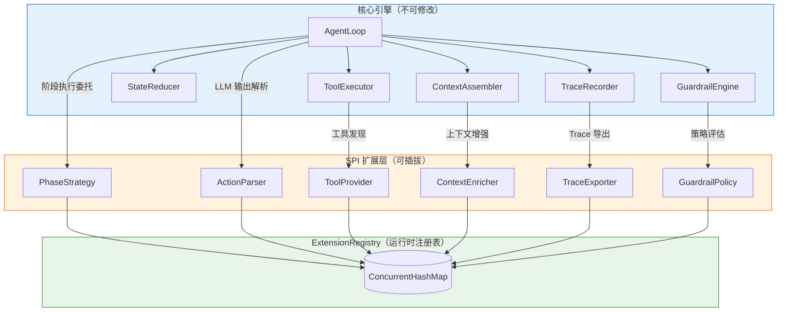

所有扩展点通过 `ExtensionRegistry` 统一管理。注册表使用 `ConcurrentHashMap` 实现线程安全的运行时注册与查询：

```java
package com.lifepilot.agent.spi;

import org.slf4j.Logger;
import org.slf4j.LoggerFactory;
import org.springframework.stereotype.Component;

import java.util.List;
import java.util.Map;
import java.util.Optional;
import java.util.concurrent.ConcurrentHashMap;

/**
 * 扩展点运行时注册表。
 *
 * <p>统一管理所有 SPI 扩展的注册、查询和生命周期。
 * 使用 {@link ConcurrentHashMap} 保证线程安全，支持运行时动态注册与注销。</p>
 *
 * <p>扩展按类型分组存储，同一类型的多个扩展通过 {@link Ordered#order()} 排序。
 * 查询时返回不可变快照，防止外部修改内部状态。</p>
 */
@Component
public class ExtensionRegistry {

    private static final Logger log = LoggerFactory.getLogger(ExtensionRegistry.class);

    /** 按扩展类型分组的注册表，值为按优先级排序的扩展列表。 */
    private final Map<Class<?>, List<Ordered>> extensions = new ConcurrentHashMap<>();

    /**
     * 注册扩展实例。
     *
     * @param type      扩展接口类型
     * @param extension 扩展实例，必须实现 {@link Ordered} 接口
     * @param <T>       扩展接口类型参数
     */
    public <T extends Ordered> void register(Class<T> type, T extension) {
        extensions.merge(type, List.of(extension), (existing, incoming) -> {
            var merged = new java.util.ArrayList<>(existing);
            merged.addAll(incoming);
            merged.sort(java.util.Comparator.comparingInt(Ordered::order));
            return List.copyOf(merged);
        });
        log.info("扩展已注册: type={}, impl={}, order={}",
                type.getSimpleName(), extension.getClass().getSimpleName(), extension.order());
    }

    /**
     * 查询指定类型的所有扩展（按优先级排序）。
     *
     * @param type 扩展接口类型
     * @param <T>  扩展接口类型参数
     * @return 按 {@link Ordered#order()} 升序排列的不可变扩展列表
     */
    @SuppressWarnings("unchecked")
    public <T extends Ordered> List<T> getExtensions(Class<T> type) {
        return (List<T>) extensions.getOrDefault(type, List.of());
    }

    /**
     * 查询指定类型的最高优先级扩展。
     *
     * @param type 扩展接口类型
     * @param <T>  扩展接口类型参数
     * @return 优先级最高（order 值最小）的扩展，不存在时返回空
     */
    public <T extends Ordered> Optional<T> getPrimary(Class<T> type) {
        return getExtensions(type).stream().findFirst();
    }
}
```

扩展优先级通过 `Ordered` 接口统一管理：

```java
package com.lifepilot.agent.spi;

/**
 * 扩展优先级接口。
 *
 * <p>所有 SPI 扩展必须实现此接口以声明执行优先级。
 * 数值越小优先级越高，默认优先级为 {@link #DEFAULT_ORDER}。</p>
 */
public interface Ordered {

    /** 默认优先级。 */
    int DEFAULT_ORDER = 1000;

    /** 最高优先级（最先执行）。 */
    int HIGHEST = 0;

    /** 最低优先级（最后执行）。 */
    int LOWEST = Integer.MAX_VALUE;

    /** 返回此扩展的优先级，数值越小越先执行。 */
    default int order() {
        return DEFAULT_ORDER;
    }
}
```


### 13.2 PhaseStrategy — 阶段策略扩展

`PhaseStrategy` 是最核心的扩展点。它允许开发者自定义 Agent 在每个 `AgentPhase` 中的行为——包括 LLM 提示模板的构造、LLM 输出的后处理、以及阶段转换的决策逻辑。

核心设计思路：AgentLoop 在每次循环迭代中，不再硬编码各阶段的处理逻辑，而是委托给 `PhaseStrategy` 链。每个 `PhaseStrategy` 声明自己关心的阶段集合，AgentLoop 按优先级依次调用匹配的策略，直到某个策略返回有效结果。

```java
package com.lifepilot.agent.spi;

import com.lifepilot.agent.AgentAction;
import com.lifepilot.agent.AgentPhase;
import com.lifepilot.agent.AgentState;
import com.lifepilot.agent.AssembledContext;

import java.util.Optional;
import java.util.Set;

/**
 * 阶段策略扩展接口。
 *
 * <p>允许自定义 Agent 在特定阶段的行为逻辑。每个策略声明自己支持的阶段集合，
 * AgentLoop 在执行对应阶段时按优先级依次调用匹配的策略。</p>
 *
 * <p>扩展场景示例：
 * <ul>
 *   <li>为 REFLECTING 阶段添加领域特定的反思逻辑（如医疗场景的安全复核）</li>
 *   <li>为 PLANNING 阶段注入特定领域的计划模板</li>
 *   <li>为 UNDERSTANDING 阶段添加多语言意图识别预处理</li>
 * </ul>
 * </p>
 */
public interface PhaseStrategy extends Ordered {

    /**
     * 声明此策略支持的阶段集合。
     *
     * <p>AgentLoop 仅在当前阶段属于此集合时调用本策略。
     * 返回空集合表示不参与任何阶段（等同于禁用）。</p>
     *
     * @return 支持的阶段集合，不可变
     */
    Set<AgentPhase> supportedPhases();

    /**
     * 在 LLM 调用前增强上下文。
     *
     * <p>策略可以修改系统提示、注入额外指令、调整上下文窗口内容。
     * 返回 {@link Optional#empty()} 表示不修改上下文，使用原始值。</p>
     *
     * @param context 当前组装完成的上下文
     * @param state   当前 Agent 状态
     * @return 增强后的上下文，或空表示不修改
     */
    default Optional<AssembledContext> enhanceContext(
            AssembledContext context, AgentState state) {
        return Optional.empty();
    }

    /**
     * 对 LLM 输出进行后处理。
     *
     * <p>策略可以修正、过滤或转换 LLM 返回的动作。例如在 REFLECTING 阶段
     * 添加领域特定的评估逻辑，或在 PLANNING 阶段验证计划的可行性。</p>
     *
     * <p>返回 {@link Optional#empty()} 表示不修改动作，使用原始值。</p>
     *
     * @param action LLM 返回的原始动作
     * @param state  当前 Agent 状态
     * @return 后处理后的动作，或空表示不修改
     */
    default Optional<AgentAction> postProcess(
            AgentAction action, AgentState state) {
        return Optional.empty();
    }
}
```


AgentLoop 中的策略调度逻辑如下：

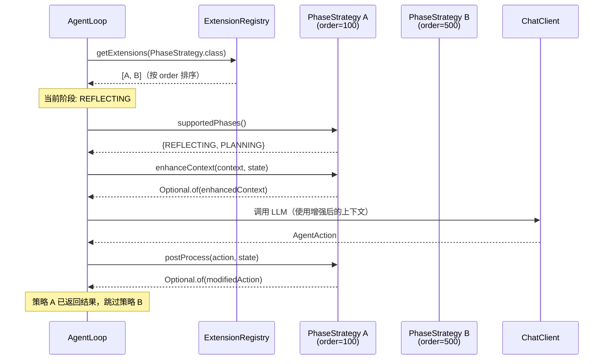


以下是一个具体的扩展示例——`CustomReflectionStrategy`，为 REFLECTING 阶段添加领域特定的反思逻辑。假设在健康管理场景中，当 Agent 执行了与用药相关的操作时，需要额外进行安全复核：

```java
package com.lifepilot.agent.extension;

import com.lifepilot.agent.AgentAction;
import com.lifepilot.agent.AgentPhase;
import com.lifepilot.agent.AgentState;
import com.lifepilot.agent.AssembledContext;
import com.lifepilot.agent.spi.Ordered;
import com.lifepilot.agent.spi.PhaseStrategy;
import org.slf4j.Logger;
import org.slf4j.LoggerFactory;
import org.springframework.stereotype.Component;

import java.util.Optional;
import java.util.Set;

/**
 * 健康管理领域的反思策略扩展。
 *
 * <p>当 Agent 在 REFLECTING 阶段检测到本轮执行涉及用药相关操作时，
 * 自动注入安全复核指令，要求 LLM 对用药建议进行二次验证。</p>
 *
 * <p>此策略优先级高于默认策略（order=100），确保安全复核在通用反思之前执行。</p>
 */
@Component
public class CustomReflectionStrategy implements PhaseStrategy {

    private static final Logger log = LoggerFactory.getLogger(CustomReflectionStrategy.class);

    private static final String MEDICATION_SAFETY_PROMPT = """
            [安全复核] 本轮执行涉及用药相关操作，请额外验证：
            1. 药物名称是否准确，是否存在同名异药风险
            2. 剂量是否在安全范围内
            3. 是否与用户已知的过敏史或正在服用的药物存在冲突
            如果存在任何不确定性，结论必须为 NEEDS_REVISION。
            """;

    @Override
    public int order() {
        return 100; // 高于默认策略（1000），优先执行
    }

    @Override
    public Set<AgentPhase> supportedPhases() {
        return Set.of(AgentPhase.REFLECTING);
    }

    @Override
    public Optional<AssembledContext> enhanceContext(
            AssembledContext context, AgentState state) {
        // 检查本轮工具调用结果中是否涉及用药操作
        boolean hasMedicationAction = state.toolResults().stream()
                .anyMatch(r -> r.toolName().contains("medication")
                        || r.toolName().contains("pharmacy"));

        if (!hasMedicationAction) {
            return Optional.empty(); // 不涉及用药，不增强
        }

        log.info("检测到用药相关操作，注入安全复核指令: sessionId={}",
                state.sessionId());

        // 在系统提示末尾追加安全复核指令
        var enhanced = context.withAppendedSystemPrompt(MEDICATION_SAFETY_PROMPT);
        return Optional.of(enhanced);
    }

    @Override
    public Optional<AgentAction> postProcess(
            AgentAction action, AgentState state) {
        // 如果 LLM 的反思结论是 SATISFIED，但涉及用药操作且置信度不足，
        // 强制降级为 NEEDS_REVISION
        if (action instanceof AgentAction.ReflectAction(var reflection)
                && reflection.conclusion() == ReflectionConclusion.SATISFIED
                && reflection.confidence() < 0.9) {

            boolean hasMedicationAction = state.toolResults().stream()
                    .anyMatch(r -> r.toolName().contains("medication"));

            if (hasMedicationAction) {
                log.warn("用药操作置信度不足，强制要求修正: confidence={}",
                        reflection.confidence());
                var revised = reflection.withConclusion(ReflectionConclusion.NEEDS_REVISION);
                return Optional.of(new AgentAction.ReflectAction(revised));
            }
        }
        return Optional.empty();
    }
}
```


### 13.3 ContextEnricher — 上下文增强扩展

`ContextEnricher` 是一个轻量级的函数式扩展接口，专注于在 `ContextAssembler` 组装上下文的最后阶段注入额外信息。与 `PhaseStrategy` 不同，`ContextEnricher` 不关心当前阶段，它在每次 LLM 调用前都会被执行，且多个 Enricher 的结果会累积叠加（而非互斥）。

典型使用场景：

- 注入当前时间、天气、地理位置等环境信息
- 根据用户画像注入个性化偏好
- 注入最近的日程/待办事项摘要作为背景知识
- 注入领域特定的术语表或约束规则

```java
package com.lifepilot.agent.spi;

import com.lifepilot.agent.AgentState;

import java.util.Optional;

/**
 * 上下文增强函数式接口。
 *
 * <p>在 {@link com.lifepilot.agent.ContextAssembler} 组装上下文的最后阶段调用，
 * 允许向 LLM 上下文中注入额外信息片段。多个 Enricher 的结果按优先级顺序累积拼接。</p>
 *
 * <p>实现约束：
 * <ul>
 *   <li>必须是无副作用的纯函数——不修改状态，不调用外部服务（如需 I/O 请缓存结果）</li>
 *   <li>执行时间应控制在 50ms 以内，超时将被跳过并记录警告</li>
 *   <li>返回的文本片段将被追加到系统提示的 {@code [上下文增强]} 区域</li>
 * </ul>
 * </p>
 */
@FunctionalInterface
public interface ContextEnricher extends Ordered {

    /**
     * 生成上下文增强片段。
     *
     * <p>根据当前 Agent 状态和用户输入，决定是否需要注入额外上下文。
     * 返回 {@link Optional#empty()} 表示本次不注入任何内容。</p>
     *
     * @param state     当前 Agent 状态快照
     * @param userInput 本轮用户输入文本
     * @return 上下文增强片段，或空表示不注入
     */
    Optional<ContextFragment> enrich(AgentState state, String userInput);
}
```


`ContextFragment` 是增强片段的数据载体，携带内容文本和来源标识：

```java
package com.lifepilot.agent.spi;

/**
 * 上下文增强片段。
 *
 * @param source  片段来源标识（用于追溯和调试，如 "weather-enricher"）
 * @param content 注入到 LLM 上下文的文本内容
 * @param weight  片段权重（0.0 ~ 1.0），当上下文窗口不足时按权重裁剪
 */
public record ContextFragment(
        String source,
        String content,
        double weight
) {
    public ContextFragment {
        if (weight < 0.0 || weight > 1.0) {
            throw new IllegalArgumentException("片段权重必须在 0.0 ~ 1.0 之间: " + weight);
        }
        if (content == null || content.isBlank()) {
            throw new IllegalArgumentException("片段内容不能为空");
        }
    }

    /** 创建默认权重（0.5）的片段。 */
    public static ContextFragment of(String source, String content) {
        return new ContextFragment(source, content, 0.5);
    }
}
```


以下是一个具体示例——`WeatherContextEnricher`，当检测到用户输入涉及日程安排相关意图时，自动注入当前天气信息作为 LLM 的决策参考：

```java
package com.lifepilot.agent.extension;

import com.lifepilot.agent.AgentState;
import com.lifepilot.agent.spi.ContextEnricher;
import com.lifepilot.agent.spi.ContextFragment;
import org.slf4j.Logger;
import org.slf4j.LoggerFactory;
import org.springframework.stereotype.Component;

import java.util.Optional;
import java.util.Set;
import java.util.concurrent.ConcurrentHashMap;
import java.time.Duration;
import java.time.Instant;

/**
 * 天气上下文增强器。
 *
 * <p>当用户输入涉及日程安排、出行计划、户外活动等场景时，
 * 自动注入当前天气信息，帮助 LLM 生成更贴合实际的建议。</p>
 *
 * <p>天气数据通过本地缓存管理，缓存有效期 30 分钟，
 * 避免每次 LLM 调用都触发外部 API 请求。</p>
 */
@Component
public class WeatherContextEnricher implements ContextEnricher {

    private static final Logger log = LoggerFactory.getLogger(WeatherContextEnricher.class);

    /** 触发天气注入的关键词集合。 */
    private static final Set<String> SCHEDULING_KEYWORDS = Set.of(
            "安排", "日程", "会议", "出行", "出门", "户外",
            "跑步", "散步", "野餐", "旅行", "航班"
    );

    /** 天气缓存有效期。 */
    private static final Duration CACHE_TTL = Duration.ofMinutes(30);

    /** 天气数据缓存：城市 → (天气描述, 缓存时间)。 */
    private final ConcurrentHashMap<String, CachedWeather> weatherCache =
            new ConcurrentHashMap<>();

    private final WeatherService weatherService;

    public WeatherContextEnricher(WeatherService weatherService) {
        this.weatherService = weatherService;
    }

    @Override
    public int order() {
        return 200; // 环境信息优先级较高
    }

    @Override
    public Optional<ContextFragment> enrich(AgentState state, String userInput) {
        // 检查用户输入是否包含日程相关关键词
        boolean isSchedulingRelated = SCHEDULING_KEYWORDS.stream()
                .anyMatch(userInput::contains);

        if (!isSchedulingRelated) {
            return Optional.empty();
        }

        // 从用户画像或默认配置获取城市
        String city = extractCity(state).orElse("北京");

        // 查询缓存或获取最新天气
        var weather = weatherCache.compute(city, (k, cached) -> {
            if (cached != null && !cached.isExpired()) {
                return cached;
            }
            try {
                var description = weatherService.getCurrentWeather(city);
                return new CachedWeather(description, Instant.now());
            } catch (Exception e) {
                log.warn("天气查询失败，跳过注入: city={}, error={}", city, e.getMessage());
                return cached; // 失败时保留旧缓存，无缓存则返回 null
            }
        });

        if (weather == null) {
            return Optional.empty();
        }

        var content = "[当前天气] %s: %s".formatted(city, weather.description());
        log.debug("注入天气上下文: city={}, sessionId={}", city, state.sessionId());

        return Optional.of(ContextFragment.of("weather-enricher", content));
    }

    /** 从 Agent 状态元数据中提取用户所在城市。 */
    private Optional<String> extractCity(AgentState state) {
        var city = state.metadata().get("user.city");
        return city instanceof String s && !s.isBlank()
                ? Optional.of(s)
                : Optional.empty();
    }

    /** 天气缓存条目。 */
    private record CachedWeather(String description, Instant cachedAt) {
        boolean isExpired() {
            return Duration.between(cachedAt, Instant.now()).compareTo(CACHE_TTL) > 0;
        }
    }
}
```


`ContextAssembler` 中调用 Enricher 链的集成逻辑：

```java
// ContextAssembler.assemble() 方法中的增强阶段（伪代码）

// 获取所有已注册的 ContextEnricher（按 order 排序）
List<ContextEnricher> enrichers = extensionRegistry.getExtensions(ContextEnricher.class);

// 收集所有增强片段
List<ContextFragment> fragments = enrichers.stream()
        .map(e -> {
            try {
                return e.enrich(state, userInput);
            } catch (Exception ex) {
                log.warn("ContextEnricher 执行异常，跳过: enricher={}, error={}",
                        e.getClass().getSimpleName(), ex.getMessage());
                return Optional.<ContextFragment>empty();
            }
        })
        .flatMap(Optional::stream)
        .sorted(Comparator.comparingDouble(ContextFragment::weight).reversed())
        .toList();

// 按权重裁剪，确保不超过上下文窗口预留空间
int remainingTokens = budget.contextEnrichmentTokenLimit();
var selectedFragments = new ArrayList<ContextFragment>();
for (var fragment : fragments) {
    int tokenCount = tokenizer.count(fragment.content());
    if (tokenCount <= remainingTokens) {
        selectedFragments.add(fragment);
        remainingTokens -= tokenCount;
    }
}

// 拼接到系统提示的 [上下文增强] 区域
String enrichmentBlock = selectedFragments.stream()
        .map(ContextFragment::content)
        .collect(Collectors.joining("\n"));
```


### 13.4 Spring Boot Auto-Configuration

所有扩展点通过 Spring Boot 的自动配置机制发现和注册。开发者只需将扩展实现为 Spring Bean（通过 `@Component` 或 `@Bean`），引擎启动时会自动扫描并注册到 `ExtensionRegistry`。

#### 13.4.1 AgentAutoConfiguration — 扩展自动装配

```java
package com.lifepilot.agent.config;

import com.lifepilot.agent.spi.ContextEnricher;
import com.lifepilot.agent.spi.ExtensionRegistry;
import com.lifepilot.agent.spi.GuardrailPolicy;
import com.lifepilot.agent.spi.PhaseStrategy;
import com.lifepilot.agent.spi.TraceExporter;
import com.lifepilot.agent.spi.ActionParser;
import com.lifepilot.agent.spi.ToolProvider;
import org.slf4j.Logger;
import org.slf4j.LoggerFactory;
import org.springframework.boot.autoconfigure.AutoConfiguration;
import org.springframework.boot.autoconfigure.condition.ConditionalOnMissingBean;
import org.springframework.context.annotation.Bean;

import java.util.List;

/**
 * Agent 引擎扩展点自动配置。
 *
 * <p>在 Spring Boot 启动时自动扫描所有 SPI 扩展 Bean，
 * 按优先级排序后注册到 {@link ExtensionRegistry}。</p>
 *
 * <p>自动配置的执行顺序：
 * <ol>
 *   <li>Spring 容器完成所有 Bean 的创建和依赖注入</li>
 *   <li>本配置类收集各类型的扩展 Bean 列表</li>
 *   <li>按 {@link com.lifepilot.agent.spi.Ordered#order()} 排序后注册到 Registry</li>
 *   <li>AgentLoop 启动时从 Registry 获取扩展链</li>
 * </ol>
 * </p>
 */
@AutoConfiguration
public class AgentAutoConfiguration {

    private static final Logger log = LoggerFactory.getLogger(AgentAutoConfiguration.class);

    /** 当容器中没有自定义 ExtensionRegistry 时，创建默认实例。 */
    @Bean
    @ConditionalOnMissingBean
    public ExtensionRegistry extensionRegistry() {
        return new ExtensionRegistry();
    }

    /**
     * 扫描并注册所有 PhaseStrategy 扩展。
     *
     * <p>Spring 自动注入容器中所有 {@link PhaseStrategy} 类型的 Bean。
     * 如果容器中没有任何自定义策略，{@code strategies} 为空列表，
     * 引擎将使用内置的 {@code DefaultPhaseStrategy}。</p>
     */
    @Bean
    public PhaseStrategyRegistrar phaseStrategyRegistrar(
            ExtensionRegistry registry,
            List<PhaseStrategy> strategies) {
        strategies.forEach(s -> registry.register(PhaseStrategy.class, s));
        log.info("PhaseStrategy 扩展注册完成: count={}", strategies.size());
        return new PhaseStrategyRegistrar(strategies.size());
    }

    /** 扫描并注册所有 ContextEnricher 扩展。 */
    @Bean
    public ContextEnricherRegistrar contextEnricherRegistrar(
            ExtensionRegistry registry,
            List<ContextEnricher> enrichers) {
        enrichers.forEach(e -> registry.register(ContextEnricher.class, e));
        log.info("ContextEnricher 扩展注册完成: count={}", enrichers.size());
        return new ContextEnricherRegistrar(enrichers.size());
    }

    /** 扫描并注册所有 TraceExporter 扩展。 */
    @Bean
    public TraceExporterRegistrar traceExporterRegistrar(
            ExtensionRegistry registry,
            List<TraceExporter> exporters) {
        exporters.forEach(e -> registry.register(TraceExporter.class, e));
        log.info("TraceExporter 扩展注册完成: count={}", exporters.size());
        return new TraceExporterRegistrar(exporters.size());
    }

    /** 扫描并注册所有 GuardrailPolicy 扩展。 */
    @Bean
    public GuardrailPolicyRegistrar guardrailPolicyRegistrar(
            ExtensionRegistry registry,
            List<GuardrailPolicy> policies) {
        policies.forEach(p -> registry.register(GuardrailPolicy.class, p));
        log.info("GuardrailPolicy 扩展注册完成: count={}", policies.size());
        return new GuardrailPolicyRegistrar(policies.size());
    }

    /** 扫描并注册所有 ActionParser 扩展。 */
    @Bean
    public ActionParserRegistrar actionParserRegistrar(
            ExtensionRegistry registry,
            List<ActionParser> parsers) {
        parsers.forEach(p -> registry.register(ActionParser.class, p));
        log.info("ActionParser 扩展注册完成: count={}", parsers.size());
        return new ActionParserRegistrar(parsers.size());
    }

    /** 扫描并注册所有 ToolProvider 扩展。 */
    @Bean
    public ToolProviderRegistrar toolProviderRegistrar(
            ExtensionRegistry registry,
            List<ToolProvider> providers) {
        providers.forEach(p -> registry.register(ToolProvider.class, p));
        log.info("ToolProvider 扩展注册完成: count={}", providers.size());
        return new ToolProviderRegistrar(providers.size());
    }

    // --- 注册标记 record（用于 Bean 依赖追踪和条件判断） ---

    record PhaseStrategyRegistrar(int count) {}
    record ContextEnricherRegistrar(int count) {}
    record TraceExporterRegistrar(int count) {}
    record GuardrailPolicyRegistrar(int count) {}
    record ActionParserRegistrar(int count) {}
    record ToolProviderRegistrar(int count) {}
}
```


#### 13.4.2 自动配置注册

Spring Boot 3.x 使用 `META-INF/spring/org.springframework.boot.autoconfigure.AutoConfiguration.imports` 文件声明自动配置类（替代旧版 `spring.factories`）：

```
# META-INF/spring/org.springframework.boot.autoconfigure.AutoConfiguration.imports
# Agent 引擎扩展点自动配置
com.lifepilot.agent.config.AgentAutoConfiguration
```

对于以独立 JAR 形式发布的第三方扩展，只需在自己的 JAR 中包含同名文件，Spring Boot 会自动合并所有 JAR 中的自动配置声明：

```
# 第三方扩展 JAR 中的自动配置声明
# META-INF/spring/org.springframework.boot.autoconfigure.AutoConfiguration.imports
com.example.health.HealthExtensionAutoConfiguration
```

```java
package com.example.health;

import org.springframework.boot.autoconfigure.AutoConfiguration;
import org.springframework.context.annotation.Bean;

/**
 * 健康管理扩展自动配置。
 *
 * <p>第三方扩展包的自动配置示例。只需将此类声明在
 * {@code AutoConfiguration.imports} 中，Spring Boot 启动时
 * 会自动发现并注册其中定义的扩展 Bean。</p>
 */
@AutoConfiguration
public class HealthExtensionAutoConfiguration {

    /** 注册健康管理领域的反思策略。 */
    @Bean
    public CustomReflectionStrategy customReflectionStrategy() {
        return new CustomReflectionStrategy();
    }

    /** 注册用药安全护栏策略。 */
    @Bean
    public MedicationGuardrailPolicy medicationGuardrailPolicy() {
        return new MedicationGuardrailPolicy();
    }
}
```


### 13.5 扩展开发指南

本节提供从零开发一个自定义扩展的完整步骤。以开发一个 `ContextEnricher`（日程摘要注入器）为例，展示实现接口 → 创建 Spring Bean → 注册自动配置 → 属性测试的完整流程。

#### 步骤一：实现扩展接口

选择合适的扩展点接口，实现其方法。所有扩展接口都继承 `Ordered`，通过 `order()` 声明优先级：

```java
package com.lifepilot.agent.extension;

import com.lifepilot.agent.AgentState;
import com.lifepilot.agent.spi.ContextEnricher;
import com.lifepilot.agent.spi.ContextFragment;
import org.springframework.stereotype.Component;

import java.util.Optional;

/**
 * 日程摘要上下文增强器。
 *
 * <p>在每次 LLM 调用前，查询用户今日待办事项并注入上下文，
 * 帮助 LLM 在回答时考虑用户的日程安排。</p>
 */
@Component
public class ScheduleSummaryEnricher implements ContextEnricher {

    private final ScheduleService scheduleService;

    public ScheduleSummaryEnricher(ScheduleService scheduleService) {
        this.scheduleService = scheduleService;
    }

    @Override
    public int order() {
        return 300;
    }

    @Override
    public Optional<ContextFragment> enrich(AgentState state, String userInput) {
        var todayEvents = scheduleService.getTodayEvents(state.sessionId());
        if (todayEvents.isEmpty()) {
            return Optional.empty();
        }

        var summary = todayEvents.stream()
                .map(e -> "· %s %s".formatted(e.time(), e.title()))
                .collect(java.util.stream.Collectors.joining("\n"));

        var content = "[今日日程]\n" + summary;
        return Optional.of(new ContextFragment("schedule-enricher", content, 0.7));
    }
}
```


#### 步骤二：创建 Spring Bean

如果扩展类已标注 `@Component`（如上例），Spring 会自动扫描并创建 Bean。如果需要更精细的控制（如条件注册），可以在配置类中使用 `@Bean` 方法：

```java
@AutoConfiguration
public class ScheduleExtensionAutoConfiguration {

    /** 仅在日程服务可用时注册此增强器。 */
    @Bean
    @ConditionalOnBean(ScheduleService.class)
    public ScheduleSummaryEnricher scheduleSummaryEnricher(
            ScheduleService scheduleService) {
        return new ScheduleSummaryEnricher(scheduleService);
    }
}
```

#### 步骤三：注册自动配置

在 `META-INF/spring/org.springframework.boot.autoconfigure.AutoConfiguration.imports` 中添加配置类全限定名：

```
com.lifepilot.agent.extension.ScheduleExtensionAutoConfiguration
```

#### 步骤四：使用 jqwik 编写属性测试

扩展的正确性应通过属性测试验证。以下示例使用 jqwik 验证 `ScheduleSummaryEnricher` 的核心不变量：

```java
package com.lifepilot.agent.extension;

import com.lifepilot.agent.AgentPhase;
import com.lifepilot.agent.AgentState;
import com.lifepilot.agent.Budget;
import com.lifepilot.agent.spi.ContextFragment;
import net.jqwik.api.*;
import net.jqwik.api.constraints.*;

import java.time.Instant;
import java.util.List;
import java.util.Map;
import java.util.Optional;
import java.util.UUID;

import static org.assertj.core.api.Assertions.assertThat;

/**
 * {@link ScheduleSummaryEnricher} 属性测试。
 *
 * <p>验证日程摘要增强器在任意合法输入下的行为不变量。</p>
 */
class ScheduleSummaryEnricherPropertyTest {

    @Property(tries = 200)
    void 返回片段的权重始终在合法范围内(
            @ForAll @IntRange(min = 0, max = 10) int eventCount,
            @ForAll @StringLength(min = 1, max = 100) String userInput) {

        // 构造 Mock 日程服务
        var mockService = new StubScheduleService(eventCount);
        var enricher = new ScheduleSummaryEnricher(mockService);
        var state = createTestState();

        Optional<ContextFragment> result = enricher.enrich(state, userInput);

        // 不变量：如果返回片段，权重必须在 [0.0, 1.0] 范围内
        result.ifPresent(fragment -> {
            assertThat(fragment.weight()).isBetween(0.0, 1.0);
            assertThat(fragment.source()).isEqualTo("schedule-enricher");
            assertThat(fragment.content()).isNotBlank();
        });
    }

    @Property(tries = 200)
    void 无日程时返回空(
            @ForAll @StringLength(min = 1, max = 200) String userInput) {

        var mockService = new StubScheduleService(0); // 零条日程
        var enricher = new ScheduleSummaryEnricher(mockService);
        var state = createTestState();

        Optional<ContextFragment> result = enricher.enrich(state, userInput);

        // 不变量：无日程时必须返回 Optional.empty()
        assertThat(result).isEmpty();
    }

    @Property(tries = 200)
    void 有日程时片段包含所有事件(
            @ForAll @IntRange(min = 1, max = 20) int eventCount,
            @ForAll @StringLength(min = 1, max = 100) String userInput) {

        var mockService = new StubScheduleService(eventCount);
        var enricher = new ScheduleSummaryEnricher(mockService);
        var state = createTestState();

        Optional<ContextFragment> result = enricher.enrich(state, userInput);

        // 不变量：有日程时必须返回片段，且片段包含 [今日日程] 标记
        assertThat(result).isPresent();
        result.ifPresent(fragment -> {
            assertThat(fragment.content()).startsWith("[今日日程]");
            // 每条日程对应一个 "·" 前缀行
            long lineCount = fragment.content().lines()
                    .filter(line -> line.startsWith("·"))
                    .count();
            assertThat(lineCount).isEqualTo(eventCount);
        });
    }

    /** 创建测试用 AgentState。 */
    private AgentState createTestState() {
        return new AgentState(
                UUID.randomUUID(),
                AgentPhase.UNDERSTANDING,
                0,
                List.of(),
                List.of(),
                Budget.defaultBudget(),
                Map.of(),
                Instant.now()
        );
    }

    /** 桩日程服务，返回指定数量的模拟日程事件。 */
    private record StubScheduleService(int eventCount) implements ScheduleService {
        @Override
        public List<ScheduleEvent> getTodayEvents(UUID sessionId) {
            return java.util.stream.IntStream.rangeClosed(1, eventCount)
                    .mapToObj(i -> new ScheduleEvent(
                            "%02d:00".formatted(8 + i % 12),
                            "测试事件 " + i))
                    .toList();
        }
    }
}
```


#### 扩展开发检查清单

以下流程图总结了从开发到上线的完整扩展生命周期：

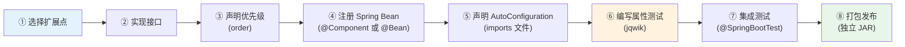

开发自定义扩展时，请逐项确认以下要点：

| # | 检查项 | 说明 |
|---|--------|------|
| 1 | 接口实现完整 | 所有抽象方法已实现，`order()` 已覆写并返回合理值 |
| 2 | 无副作用约束 | `ContextEnricher.enrich()` 不修改外部状态；`PhaseStrategy` 的 `enhanceContext()` 和 `postProcess()` 不产生 I/O 副作用 |
| 3 | 异常安全 | 扩展内部异常不应传播到 AgentLoop；使用 `try-catch` 包裹外部调用，失败时返回 `Optional.empty()` |
| 4 | 线程安全 | 扩展实例被多个会话共享，内部状态使用 `ConcurrentHashMap` 或不可变数据结构 |
| 5 | 性能约束 | `ContextEnricher` 执行时间 < 50ms；`PhaseStrategy.postProcess()` 执行时间 < 100ms |
| 6 | 日志规范 | 使用参数化日志 `log.info("消息: key={}", value)`，敏感数据通过 `DataRedactor.redact()` 脱敏 |
| 7 | 属性测试覆盖 | 核心不变量通过 jqwik `@Property` 验证，`tries` ≥ 200 |
| 8 | 集成测试验证 | 使用 `@SpringBootTest` 验证扩展被正确发现和注册 |
| 9 | 自动配置声明 | `AutoConfiguration.imports` 文件存在且路径正确 |
| 10 | 文档完备 | Javadoc 使用中文描述扩展用途、触发条件和注意事项 |


---

## 14. 数据模型与持久化

Agent 引擎的持久化层负责将运行时产生的决策轨迹、预算快照和配置数据可靠地存储到 SQLite 中。本节定义了 §9.4 中会话相关表（`sessions`、`dialog_messages`、`agent_state_snapshots`）之外的**剩余数据模型**，涵盖追溯记录、追溯步骤、预算审计和运行时配置四个维度。

所有表遵循以下 SQLite 约定（详见编码规范 §9）：

- 主键 `TEXT` 存 UUID，时间 `TEXT` 存 ISO 8601，布尔 `INTEGER`(0/1)
- JSON 字段使用 `TEXT` 类型 + `_json` 后缀
- 所有表必须有 `created_at`，可变表必须有 `updated_at`
- PRAGMA：`journal_mode=WAL`, `synchronous=NORMAL`, `foreign_keys=ON`, `busy_timeout=5000`

### 14.1 Agent 引擎数据模型总览

以下 ER 图展示了 Agent 引擎全部持久化表及其关联关系。灰色标注的三张表已在 §9.4 中定义，本节聚焦蓝色标注的新增表。

```mermaid
erDiagram
    sessions ||--o{ dialog_messages : "包含"
    sessions ||--o| agent_state_snapshots : "快照"
    sessions ||--o{ trace_records : "产生"
    sessions ||--o{ budget_snapshots : "审计"
    trace_records ||--o{ trace_steps : "包含"

    sessions {
        TEXT id PK "UUID"
        TEXT state "SessionState 枚举"
        TEXT title "会话标题"
        TEXT budget_json "Budget JSON"
        TEXT metadata_json "扩展元数据"
        INTEGER message_count "消息计数"
        TEXT created_at "ISO 8601"
        TEXT updated_at "ISO 8601"
        TEXT last_active_at "ISO 8601"
        TEXT suspended_at "可空"
        TEXT completed_at "可空"
    }

    dialog_messages {
        TEXT id PK "UUID"
        TEXT session_id FK "关联会话"
        TEXT message_type "user/assistant/tool_call/tool_result/system"
        TEXT content "消息内容"
        TEXT created_at "ISO 8601"
    }

    agent_state_snapshots {
        TEXT session_id PK "关联会话"
        TEXT phase "AgentPhase 枚举"
        INTEGER step_count "已执行步数"
        TEXT budget_json "Budget JSON"
        TEXT metadata_json "扩展元数据"
        TEXT created_at "ISO 8601"
    }

    trace_records {
        TEXT id PK "UUID"
        TEXT session_id FK "关联会话"
        TEXT goal "用户目标"
        INTEGER total_steps "总步数"
        INTEGER total_tokens "总 Token 消耗"
        INTEGER total_duration_ms "总耗时(ms)"
        INTEGER success "0/1"
        TEXT error_message "可空，失败原因"
        TEXT created_at "ISO 8601"
        TEXT completed_at "ISO 8601"
    }

    trace_steps {
        TEXT id PK "UUID"
        TEXT trace_id FK "关联轨迹"
        TEXT step_type "llm_call/tool_call/guardrail/state_transition/evaluation"
        INTEGER step_index "步骤序号"
        TEXT input_json "输入 JSON"
        TEXT output_json "输出 JSON"
        INTEGER duration_ms "耗时(ms)"
        TEXT metadata_json "扩展元数据"
        TEXT created_at "ISO 8601"
    }

    budget_snapshots {
        TEXT id PK "UUID"
        TEXT session_id FK "关联会话"
        INTEGER step_index "步骤序号"
        INTEGER steps_used "已用步数"
        INTEGER steps_max "最大步数"
        INTEGER tokens_used "已用 Token"
        INTEGER tokens_max "最大 Token"
        INTEGER cost_cents "已用费用(美分)"
        INTEGER cost_max_cents "最大费用(美分)"
        TEXT created_at "ISO 8601"
    }

    agent_config {
        TEXT id PK "UUID"
        TEXT config_key "配置键(UNIQUE)"
        TEXT config_value "配置值"
        TEXT description "配置描述"
        TEXT updated_at "ISO 8601"
        TEXT created_at "ISO 8601"
    }
```

表间关系说明：

| 关系 | 基数 | 说明 |
|:-----|:-----|:-----|
| `sessions` → `dialog_messages` | 1:N | 一个会话包含多条对话消息 |
| `sessions` → `agent_state_snapshots` | 1:0..1 | 一个会话最多一个活跃状态快照 |
| `sessions` → `trace_records` | 1:N | 一个会话可产生多条执行轨迹（多轮对话） |
| `sessions` → `budget_snapshots` | 1:N | 一个会话在每步产生预算快照 |
| `trace_records` → `trace_steps` | 1:N | 一条轨迹包含多个执行步骤 |
| `agent_config` | 独立 | 全局配置表，不关联会话 |


### 14.2 trace_records 表

`trace_records` 存储每次 Agent 执行的完整轨迹摘要。每当用户发起一次请求并触发 AgentLoop 执行时，系统创建一条 `trace_records` 记录，在循环结束后回填汇总字段（总步数、总 Token、总耗时、成功/失败）。该表是 §7 TraceRecorder 的持久化载体，支撑事后调试、质量分析和合规审计。

#### Java Record 定义

```java
package com.lifepilot.agent.trace;

import jakarta.annotation.Nullable;
import java.time.Instant;
import java.util.Optional;
import java.util.UUID;

/**
 * 执行轨迹记录——不可变数据载体。
 *
 * <p>对应数据库表 {@code trace_records}，存储单次 Agent 执行的完整摘要信息。
 * 轨迹在 AgentLoop 启动时创建（{@code success=0, total_steps=0}），
 * 在循环结束后通过 {@link TraceRepository#completeTrace} 回填汇总字段。</p>
 *
 * @param id              轨迹唯一标识
 * @param sessionId       关联会话标识
 * @param goal            用户原始输入 / 目标描述
 * @param totalSteps      总执行步数（循环结束后回填）
 * @param totalTokens     总 Token 消耗（循环结束后回填）
 * @param totalDurationMs 总耗时毫秒（循环结束后回填）
 * @param success         是否成功完成（0=失败, 1=成功）
 * @param errorMessage    失败原因，仅 success=0 时有值
 * @param createdAt       轨迹创建时间（AgentLoop 启动时）
 * @param completedAt     轨迹完成时间（AgentLoop 结束时）
 */
public record TraceRecord(
        UUID id,
        UUID sessionId,
        String goal,
        int totalSteps,
        int totalTokens,
        long totalDurationMs,
        boolean success,
        @Nullable String errorMessage,
        Instant createdAt,
        Instant completedAt
) {
    /** 获取失败原因（Optional 包装，避免 null 传播）。 */
    public Optional<String> errorReason() {
        return Optional.ofNullable(errorMessage);
    }

    /** 创建初始轨迹记录（AgentLoop 启动时调用）。 */
    public static TraceRecord start(UUID sessionId, String goal) {
        var now = Instant.now();
        return new TraceRecord(
                UUID.randomUUID(), sessionId, goal,
                0, 0, 0L, false, null, now, now
        );
    }
}
```


#### Flyway 迁移脚本

```sql
-- V14001__create_trace_records_table.sql
-- 执行轨迹记录表：存储每次 Agent 执行的完整摘要

CREATE TABLE IF NOT EXISTS trace_records (
    id                  TEXT PRIMARY KEY,           -- UUID
    session_id          TEXT NOT NULL,              -- 关联会话 ID
    goal                TEXT NOT NULL,              -- 用户目标 / 原始输入
    total_steps         INTEGER NOT NULL DEFAULT 0, -- 总执行步数
    total_tokens        INTEGER NOT NULL DEFAULT 0, -- 总 Token 消耗
    total_duration_ms   INTEGER NOT NULL DEFAULT 0, -- 总耗时（毫秒）
    success             INTEGER NOT NULL DEFAULT 0, -- 是否成功 0/1
    error_message       TEXT,                       -- 失败原因（可空）
    created_at          TEXT NOT NULL,              -- ISO 8601，轨迹创建时间
    completed_at        TEXT NOT NULL,              -- ISO 8601，轨迹完成时间
    FOREIGN KEY (session_id) REFERENCES sessions(id) ON DELETE CASCADE
);

-- 按会话查询轨迹（时间倒序，最近的轨迹优先）
CREATE INDEX IF NOT EXISTS idx_trace_records_session
    ON trace_records(session_id, created_at DESC);

-- 按成功/失败过滤（质量分析：快速筛选失败轨迹）
CREATE INDEX IF NOT EXISTS idx_trace_records_success
    ON trace_records(success) WHERE success = 0;

-- 按创建时间范围查询（报表统计、数据清理）
CREATE INDEX IF NOT EXISTS idx_trace_records_created
    ON trace_records(created_at);
```


### 14.3 trace_steps 表

`trace_steps` 存储轨迹内的每个执行步骤。一条 `trace_records` 记录对应多条 `trace_steps`，按 `step_index` 有序排列。步骤类型（`step_type`）区分了 LLM 调用、工具调用、安全护栏评估、状态转换和反思评估五种事件，与 §7.2 中 `TraceEvent` 的密封变体一一对应。

#### 步骤类型映射

| `step_type` 值 | 对应 `TraceEvent` 变体 | 说明 |
|:----------------|:----------------------|:-----|
| `llm_call` | `LlmCallEvent` | LLM 调用，input_json 存提示摘要，output_json 存响应 |
| `tool_call` | `ToolExecutionEvent` | 工具调用，input_json 存参数，output_json 存结果 |
| `guardrail` | `GuardrailEvent` | 安全护栏评估，output_json 存评估结论 |
| `state_transition` | `StateTransitionEvent` | 状态转换，metadata_json 存 fromPhase/toPhase |
| `evaluation` | `ReflectAction` 相关 | 反思评估，output_json 存评估结论和修正建议 |

#### Java Record 定义

```java
package com.lifepilot.agent.trace;

import java.time.Instant;
import java.util.UUID;

/**
 * 轨迹步骤——不可变数据载体。
 *
 * <p>对应数据库表 {@code trace_steps}，存储单个执行步骤的完整信息。
 * 步骤按 {@code stepIndex} 有序排列，构成一条完整的决策轨迹。</p>
 *
 * <p>{@code stepType} 使用 {@link StepType} 枚举表示，持久化时存储为小写字符串。
 * {@code inputJson} 和 {@code outputJson} 的结构因步骤类型而异，
 * 具体格式参见 {@link StepType} 的文档说明。</p>
 *
 * @param id           步骤唯一标识
 * @param traceId      关联轨迹标识
 * @param stepType     步骤类型
 * @param stepIndex    步骤序号（从 0 开始，轨迹内唯一）
 * @param inputJson    输入数据 JSON（结构因 stepType 而异）
 * @param outputJson   输出数据 JSON（结构因 stepType 而异）
 * @param durationMs   步骤执行耗时（毫秒）
 * @param metadataJson 扩展元数据 JSON（阶段信息、模型标识等）
 * @param createdAt    步骤创建时间
 */
public record TraceStep(
        UUID id,
        UUID traceId,
        StepType stepType,
        int stepIndex,
        String inputJson,
        String outputJson,
        long durationMs,
        String metadataJson,
        Instant createdAt
) {
    /** 创建新的轨迹步骤。 */
    public static TraceStep of(
            UUID traceId, StepType stepType, int stepIndex,
            String inputJson, String outputJson,
            long durationMs, String metadataJson
    ) {
        return new TraceStep(
                UUID.randomUUID(), traceId, stepType, stepIndex,
                inputJson, outputJson, durationMs, metadataJson,
                Instant.now()
        );
    }
}
```


#### StepType 枚举

```java
package com.lifepilot.agent.trace;

/**
 * 轨迹步骤类型枚举。
 *
 * <p>与数据库 {@code trace_steps.step_type} 列的字符串值一一对应。
 * 持久化时通过 {@link #dbValue()} 转换为小写下划线格式，
 * 反序列化时通过 {@link #fromDbValue(String)} 使用模式匹配还原。</p>
 */
public enum StepType {

    /** LLM 调用步骤：记录提示和响应。 */
    LLM_CALL("llm_call"),

    /** 工具调用步骤：记录工具参数和执行结果。 */
    TOOL_CALL("tool_call"),

    /** 安全护栏评估步骤：记录策略评估结论。 */
    GUARDRAIL("guardrail"),

    /** 状态转换步骤：记录阶段变更。 */
    STATE_TRANSITION("state_transition"),

    /** 反思评估步骤：记录评估结论和修正建议。 */
    EVALUATION("evaluation");

    private final String dbValue;

    StepType(String dbValue) {
        this.dbValue = dbValue;
    }

    /** 获取数据库存储值。 */
    public String dbValue() {
        return dbValue;
    }

    /**
     * 从数据库值反序列化为枚举。
     *
     * <p>使用 switch 表达式进行穷举匹配，未知值抛出异常。</p>
     *
     * @param value 数据库中的字符串值
     * @return 对应的 StepType 枚举
     * @throws IllegalArgumentException 当值无法匹配任何已知类型时
     */
    public static StepType fromDbValue(String value) {
        return switch (value) {
            case "llm_call"         -> LLM_CALL;
            case "tool_call"        -> TOOL_CALL;
            case "guardrail"        -> GUARDRAIL;
            case "state_transition" -> STATE_TRANSITION;
            case "evaluation"       -> EVALUATION;
            default -> throw new IllegalArgumentException(
                    "未知的步骤类型: " + value);
        };
    }
}
```


#### Flyway 迁移脚本

```sql
-- V14002__create_trace_steps_table.sql
-- 轨迹步骤表：存储轨迹内每个执行步骤的详细信息

CREATE TABLE IF NOT EXISTS trace_steps (
    id              TEXT PRIMARY KEY,               -- UUID
    trace_id        TEXT NOT NULL,                  -- 关联轨迹 ID
    step_type       TEXT NOT NULL,                  -- 步骤类型: llm_call/tool_call/guardrail/state_transition/evaluation
    step_index      INTEGER NOT NULL,               -- 步骤序号（轨迹内从 0 开始）
    input_json      TEXT NOT NULL DEFAULT '{}',     -- 输入数据 JSON
    output_json     TEXT NOT NULL DEFAULT '{}',     -- 输出数据 JSON
    duration_ms     INTEGER NOT NULL DEFAULT 0,     -- 执行耗时（毫秒）
    metadata_json   TEXT NOT NULL DEFAULT '{}',     -- 扩展元数据 JSON
    created_at      TEXT NOT NULL,                  -- ISO 8601
    FOREIGN KEY (trace_id) REFERENCES trace_records(id) ON DELETE CASCADE
);

-- 按轨迹 ID + 步骤序号查询（回放轨迹时按序读取）
CREATE INDEX IF NOT EXISTS idx_trace_steps_trace_order
    ON trace_steps(trace_id, step_index);

-- 按步骤类型过滤（分析特定类型步骤的性能和频率）
CREATE INDEX IF NOT EXISTS idx_trace_steps_type
    ON trace_steps(step_type);

-- 按耗时降序（识别慢步骤，性能优化）
CREATE INDEX IF NOT EXISTS idx_trace_steps_duration
    ON trace_steps(duration_ms DESC) WHERE duration_ms > 1000;
```


### 14.4 budget_snapshots 表

`budget_snapshots` 在 Agent 循环的每一步记录当前预算状态，形成完整的资源消耗时间线。该表是 §8 Budget 机制的审计载体——当需要分析"为什么这次执行消耗了这么多 Token"或"预算在哪一步耗尽"时，可以通过 `session_id` + `step_index` 精确定位每一步的资源消耗增量。

与 `trace_steps` 不同，`budget_snapshots` 记录的是**累计值**而非增量值，便于直接对比任意两步之间的资源消耗差异。

#### Java Record 定义

```java
package com.lifepilot.agent.trace;

import java.time.Instant;
import java.util.UUID;

/**
 * 预算快照——不可变数据载体。
 *
 * <p>对应数据库表 {@code budget_snapshots}，记录 Agent 循环每一步的预算状态。
 * 所有字段均为累计值（非增量），便于直接对比任意两步之间的资源消耗。</p>
 *
 * <p>使用场景：
 * <ul>
 *   <li>成本审计：追踪每步的 Token 和费用消耗</li>
 *   <li>性能分析：识别资源消耗异常的步骤</li>
 *   <li>预算预警回溯：确认预警触发时的精确资源状态</li>
 * </ul>
 * </p>
 *
 * @param id           快照唯一标识
 * @param sessionId    关联会话标识
 * @param stepIndex    步骤序号
 * @param stepsUsed    已用步数
 * @param stepsMax     最大步数
 * @param tokensUsed   已用 Token 数
 * @param tokensMax    最大 Token 数
 * @param costCents    已用费用（美分）
 * @param costMaxCents 最大费用（美分）
 * @param createdAt    快照创建时间
 */
public record BudgetSnapshot(
        UUID id,
        UUID sessionId,
        int stepIndex,
        int stepsUsed,
        int stepsMax,
        int tokensUsed,
        int tokensMax,
        int costCents,
        int costMaxCents,
        Instant createdAt
) {
    /** 从当前 Budget 状态创建快照。 */
    public static BudgetSnapshot capture(UUID sessionId, int stepIndex, Budget budget) {
        return new BudgetSnapshot(
                UUID.randomUUID(), sessionId, stepIndex,
                budget.maxSteps() - budget.remainingSteps(),
                budget.maxSteps(),
                budget.maxTokens() - budget.remainingTokens(),
                budget.maxTokens(),
                budget.consumedCostCents(),
                budget.maxCostCents(),
                Instant.now()
        );
    }

    /** 计算步数使用率。 */
    public double stepsUsageRatio() {
        return stepsMax == 0 ? 1.0 : (double) stepsUsed / stepsMax;
    }

    /** 计算 Token 使用率。 */
    public double tokensUsageRatio() {
        return tokensMax == 0 ? 1.0 : (double) tokensUsed / tokensMax;
    }
}
```


#### Flyway 迁移脚本

```sql
-- V14003__create_budget_snapshots_table.sql
-- 预算快照表：记录 Agent 循环每一步的预算状态，用于成本审计和性能分析

CREATE TABLE IF NOT EXISTS budget_snapshots (
    id              TEXT PRIMARY KEY,               -- UUID
    session_id      TEXT NOT NULL,                  -- 关联会话 ID
    step_index      INTEGER NOT NULL,               -- 步骤序号
    steps_used      INTEGER NOT NULL DEFAULT 0,     -- 已用步数
    steps_max       INTEGER NOT NULL,               -- 最大步数
    tokens_used     INTEGER NOT NULL DEFAULT 0,     -- 已用 Token 数
    tokens_max      INTEGER NOT NULL,               -- 最大 Token 数
    cost_cents      INTEGER NOT NULL DEFAULT 0,     -- 已用费用（美分）
    cost_max_cents  INTEGER NOT NULL,               -- 最大费用（美分）
    created_at      TEXT NOT NULL,                  -- ISO 8601
    FOREIGN KEY (session_id) REFERENCES sessions(id) ON DELETE CASCADE
);

-- 按会话 + 步骤序号查询（还原预算消耗时间线）
CREATE INDEX IF NOT EXISTS idx_budget_snapshots_session_step
    ON budget_snapshots(session_id, step_index);

-- 按费用降序（识别高成本会话）
CREATE INDEX IF NOT EXISTS idx_budget_snapshots_cost
    ON budget_snapshots(cost_cents DESC) WHERE cost_cents > 0;
```


### 14.5 agent_config 表

`agent_config` 存储运行时可调整的 Agent 配置项。与 `application.yml` 中的静态配置不同，该表中的配置可以在不重启应用的情况下动态修改，适用于需要频繁调优的参数（如预算默认值、重试策略、日志级别等）。配置优先级：`agent_config` 表 > 环境变量 > `application.yml`。

#### Java Record 定义

```java
package com.lifepilot.agent.config;

import java.time.Instant;
import java.util.UUID;

/**
 * 运行时配置项——不可变数据载体。
 *
 * <p>对应数据库表 {@code agent_config}，存储可动态调整的 Agent 配置。
 * 配置项通过 {@code configKey} 唯一标识，使用 kebab-case 命名
 * （与 Spring Boot 配置键风格一致）。</p>
 *
 * <p>配置优先级（高→低）：
 * <ol>
 *   <li>{@code agent_config} 表中的值（运行时动态配置）</li>
 *   <li>环境变量（部署时注入）</li>
 *   <li>{@code application.yml}（静态默认值）</li>
 * </ol>
 * </p>
 *
 * @param id          配置项唯一标识
 * @param configKey   配置键（kebab-case，全局唯一）
 * @param configValue 配置值（字符串形式，由消费方负责类型转换）
 * @param description 配置项的中文描述
 * @param updatedAt   最后更新时间
 * @param createdAt   创建时间
 */
public record AgentConfig(
        UUID id,
        String configKey,
        String configValue,
        String description,
        Instant updatedAt,
        Instant createdAt
) {
    /** 将配置值解析为整数。 */
    public int asInt() {
        return Integer.parseInt(configValue);
    }

    /** 将配置值解析为布尔值。 */
    public boolean asBoolean() {
        return Boolean.parseBoolean(configValue);
    }

    /** 创建新配置项。 */
    public static AgentConfig create(String key, String value, String description) {
        var now = Instant.now();
        return new AgentConfig(UUID.randomUUID(), key, value, description, now, now);
    }
}
```


#### Flyway 迁移脚本

```sql
-- V14004__create_agent_config_table.sql
-- 运行时配置表：存储可动态调整的 Agent 配置项

CREATE TABLE IF NOT EXISTS agent_config (
    id              TEXT PRIMARY KEY,               -- UUID
    config_key      TEXT NOT NULL UNIQUE,           -- 配置键（kebab-case）
    config_value    TEXT NOT NULL,                  -- 配置值
    description     TEXT NOT NULL DEFAULT '',       -- 配置描述
    updated_at      TEXT NOT NULL,                  -- ISO 8601
    created_at      TEXT NOT NULL                   -- ISO 8601
);

-- 按配置键快速查找（UNIQUE 约束已隐式创建索引，此处显式声明便于文档化）
CREATE UNIQUE INDEX IF NOT EXISTS idx_agent_config_key
    ON agent_config(config_key);
```

```sql
-- V14005__insert_default_agent_config.sql
-- 插入默认配置项

INSERT INTO agent_config (id, config_key, config_value, description, updated_at, created_at)
VALUES
    -- 预算默认值
    (lower(hex(randomblob(16))), 'agent.budget.max-steps', '10',
     '单次会话最大步数', datetime('now'), datetime('now')),

    (lower(hex(randomblob(16))), 'agent.budget.max-tokens', '8000',
     '单次会话最大 Token 消耗', datetime('now'), datetime('now')),

    (lower(hex(randomblob(16))), 'agent.budget.max-duration-seconds', '30',
     '单次会话最大耗时（秒）', datetime('now'), datetime('now')),

    (lower(hex(randomblob(16))), 'agent.budget.max-cost-cents', '50',
     '单次会话最大费用（美分）', datetime('now'), datetime('now')),

    -- 重试策略
    (lower(hex(randomblob(16))), 'agent.retry.max-attempts', '2',
     'LLM 调用最大重试次数', datetime('now'), datetime('now')),

    (lower(hex(randomblob(16))), 'agent.retry.initial-delay-ms', '500',
     '重试初始延迟（毫秒）', datetime('now'), datetime('now')),

    (lower(hex(randomblob(16))), 'agent.retry.backoff-multiplier', '2.0',
     '重试退避倍数', datetime('now'), datetime('now')),

    -- 状态机约束
    (lower(hex(randomblob(16))), 'agent.state.max-revision-cycles', '2',
     '反思→规划回退最大次数', datetime('now'), datetime('now')),

    -- 追溯配置
    (lower(hex(randomblob(16))), 'agent.trace.retention-days', '30',
     '轨迹数据保留天数', datetime('now'), datetime('now')),

    (lower(hex(randomblob(16))), 'agent.trace.enabled', 'true',
     '是否启用决策追溯记录', datetime('now'), datetime('now'));
```


### 14.6 SQLite PRAGMA 初始化

SQLite 的 PRAGMA 设置在每次连接建立时生效，不会跨连接持久化（`journal_mode` 除外）。因此需要在连接池初始化时统一设置。`SqlitePragmaInitializer` 通过 Spring Boot 的 `ConnectionCustomizer` 机制，在每个新连接创建后立即执行 PRAGMA 语句。

#### SqlitePragmaInitializer 实现

```java
package com.lifepilot.agent.persistence;

import org.slf4j.Logger;
import org.slf4j.LoggerFactory;
import org.springframework.boot.autoconfigure.jdbc.DataSourceProperties;
import org.springframework.boot.context.event.ApplicationReadyEvent;
import org.springframework.context.event.EventListener;
import org.springframework.jdbc.core.JdbcTemplate;
import org.springframework.stereotype.Component;

/**
 * SQLite PRAGMA 初始化器。
 *
 * <p>在应用启动完成后执行 SQLite PRAGMA 设置，确保数据库连接的行为符合预期。
 * PRAGMA 设置包括：
 * <ul>
 *   <li>{@code journal_mode=WAL} — 写前日志模式，支持并发读写</li>
 *   <li>{@code synchronous=NORMAL} — 平衡性能与数据安全</li>
 *   <li>{@code foreign_keys=ON} — 启用外键约束</li>
 *   <li>{@code busy_timeout=5000} — 锁等待超时 5 秒</li>
 * </ul>
 * </p>
 *
 * <p>注意：{@code journal_mode=WAL} 是持久化设置，只需执行一次；
 * 其余 PRAGMA 需要在每次连接建立时重新设置。</p>
 */
@Component
public class SqlitePragmaInitializer {

    private static final Logger log = LoggerFactory.getLogger(SqlitePragmaInitializer.class);

    private final JdbcTemplate jdbc;

    public SqlitePragmaInitializer(JdbcTemplate jdbc) {
        this.jdbc = jdbc;
    }

    /**
     * 应用启动完成后执行 PRAGMA 初始化。
     *
     * <p>使用 {@link ApplicationReadyEvent} 确保在 Flyway 迁移完成后执行，
     * 避免与迁移脚本产生冲突。</p>
     */
    @EventListener(ApplicationReadyEvent.class)
    public void initializePragmas() {
        log.info("SQLite PRAGMA 初始化开始");

        // WAL 模式：支持并发读，写操作不阻塞读操作
        var walResult = jdbc.queryForObject(
                "PRAGMA journal_mode=WAL", String.class);
        log.info("PRAGMA journal_mode 设置完成: result={}", walResult);

        // 同步模式：NORMAL 在 WAL 模式下提供良好的持久性保证
        jdbc.execute("PRAGMA synchronous=NORMAL");

        // 外键约束：确保引用完整性
        jdbc.execute("PRAGMA foreign_keys=ON");

        // 锁等待超时：避免并发写入时立即失败
        jdbc.execute("PRAGMA busy_timeout=5000");

        // 验证设置是否生效
        var foreignKeys = jdbc.queryForObject(
                "PRAGMA foreign_keys", Integer.class);
        var busyTimeout = jdbc.queryForObject(
                "PRAGMA busy_timeout", Integer.class);

        log.info("SQLite PRAGMA 初始化完成: foreign_keys={}, busy_timeout={}",
                foreignKeys, busyTimeout);
    }
}
```


#### Spring Boot 数据源配置

```yaml
# application.yml — SQLite 数据源配置
spring:
  datasource:
    url: jdbc:sqlite:${LIFEPILOT_DATA_DIR:${user.home}/.lifepilot}/lifepilot.db
    driver-class-name: org.sqlite.JDBC
    # SQLite 不需要用户名和密码
    username:
    password:
    # HikariCP 连接池配置（SQLite 单写多读，连接数不宜过多）
    hikari:
      maximum-pool-size: 5        # SQLite WAL 模式下 5 个连接足够
      minimum-idle: 1             # 最少保持 1 个空闲连接
      connection-timeout: 10000   # 连接获取超时 10 秒
      idle-timeout: 300000        # 空闲连接回收 5 分钟
      max-lifetime: 1800000       # 连接最大生命周期 30 分钟

  # Flyway 迁移配置
  flyway:
    enabled: true
    locations: classpath:db/migration
    baseline-on-migrate: true     # 首次运行时自动创建 schema_history 表
    validate-on-migrate: true     # 迁移前校验已执行脚本的完整性
```

#### SQLite 连接回调配置

为确保每个新建连接都执行 PRAGMA 设置（连接池回收后重新分配时），通过 HikariCP 的 `connectionInitSql` 机制补充连接级 PRAGMA：

```java
package com.lifepilot.agent.persistence;

import com.zaxxer.hikari.HikariDataSource;
import org.springframework.boot.autoconfigure.jdbc.DataSourceProperties;
import org.springframework.context.annotation.Bean;
import org.springframework.context.annotation.Configuration;

/**
 * SQLite 数据源配置。
 *
 * <p>自定义 HikariCP 数据源，在每个新连接创建时自动执行 PRAGMA 设置。
 * {@code connectionInitSql} 确保连接池回收后重新分配的连接也具有正确的 PRAGMA 状态。</p>
 */
@Configuration
public class SqliteDataSourceConfig {

    /**
     * 创建自定义 HikariCP 数据源。
     *
     * <p>通过 {@code connectionInitSql} 在每个连接初始化时执行 PRAGMA 语句。
     * 注意：{@code journal_mode=WAL} 不在此处设置，因为它是数据库级别的持久化设置，
     * 由 {@link SqlitePragmaInitializer} 在应用启动时执行一次即可。</p>
     */
    @Bean
    public HikariDataSource dataSource(DataSourceProperties properties) {
        var dataSource = properties.initializeDataSourceBuilder()
                .type(HikariDataSource.class)
                .build();

        // 每个新连接创建时执行的 PRAGMA（不包含 journal_mode，它是持久化设置）
        dataSource.setConnectionInitSql(
                "PRAGMA synchronous=NORMAL; PRAGMA foreign_keys=ON; PRAGMA busy_timeout=5000;");

        return dataSource;
    }
}
```


### 14.7 Repository 模式

`TraceRepository` 封装了 `trace_records` 和 `trace_steps` 两张表的 JDBC 操作。设计遵循以下原则：

- **只读查询返回不可变 record**：所有查询方法返回 `record` 实例或 `List.copyOf()` 包装的列表
- **模式匹配反序列化**：`step_type` 字符串通过 `StepType.fromDbValue()` 的 `switch` 表达式还原为枚举
- **批量写入优化**：轨迹步骤使用 `batchUpdate` 批量插入，减少 SQLite 锁竞争
- **Optional 返回值**：单条查询返回 `Optional<T>`，避免 null 传播

#### TraceRepository 实现

```java
package com.lifepilot.agent.trace;

import com.fasterxml.jackson.databind.ObjectMapper;
import org.slf4j.Logger;
import org.slf4j.LoggerFactory;
import org.springframework.jdbc.core.JdbcTemplate;
import org.springframework.stereotype.Repository;

import java.sql.ResultSet;
import java.sql.SQLException;
import java.time.Instant;
import java.util.List;
import java.util.Optional;
import java.util.UUID;

/**
 * 决策轨迹持久化仓库。
 *
 * <p>封装 {@code trace_records} 和 {@code trace_steps} 两张表的 JDBC 操作。
 * 提供轨迹的创建、完成、查询和步骤批量写入能力。</p>
 *
 * <p>线程安全：依赖 {@link JdbcTemplate} 的线程安全保证。
 * SQLite WAL 模式下支持并发读，写操作通过数据库级锁串行化。</p>
 */
@Repository
public class TraceRepository {

    private static final Logger log = LoggerFactory.getLogger(TraceRepository.class);

    private final JdbcTemplate jdbc;
    private final ObjectMapper objectMapper;

    public TraceRepository(JdbcTemplate jdbc, ObjectMapper objectMapper) {
        this.jdbc = jdbc;
        this.objectMapper = objectMapper;
    }

    // ==================== trace_records 操作 ====================

    /**
     * 创建初始轨迹记录。
     *
     * <p>在 AgentLoop 启动时调用，创建一条 {@code success=0, total_steps=0} 的初始记录。
     * 循环结束后通过 {@link #completeTrace} 回填汇总字段。</p>
     *
     * @param record 初始轨迹记录
     */
    public void insertTrace(TraceRecord record) {
        jdbc.update("""
            INSERT INTO trace_records
                (id, session_id, goal, total_steps, total_tokens,
                 total_duration_ms, success, error_message, created_at, completed_at)
            VALUES (?, ?, ?, ?, ?, ?, ?, ?, ?, ?)
            """,
            record.id().toString(),
            record.sessionId().toString(),
            record.goal(),
            record.totalSteps(),
            record.totalTokens(),
            record.totalDurationMs(),
            record.success() ? 1 : 0,
            record.errorMessage(),
            record.createdAt().toString(),
            record.completedAt().toString()
        );
        log.debug("轨迹记录已创建: traceId={}, sessionId={}",
                record.id(), record.sessionId());
    }

    /**
     * 完成轨迹记录——回填汇总字段。
     *
     * <p>在 AgentLoop 结束时调用，更新总步数、总 Token、总耗时和成功状态。
     * 如果执行失败，同时写入错误信息。</p>
     *
     * @param traceId       轨迹标识
     * @param totalSteps    总执行步数
     * @param totalTokens   总 Token 消耗
     * @param totalDurationMs 总耗时（毫秒）
     * @param success       是否成功
     * @param errorMessage  失败原因（成功时为 null）
     */
    public void completeTrace(
            UUID traceId, int totalSteps, int totalTokens,
            long totalDurationMs, boolean success, String errorMessage
    ) {
        jdbc.update("""
            UPDATE trace_records
            SET total_steps = ?, total_tokens = ?, total_duration_ms = ?,
                success = ?, error_message = ?, completed_at = ?
            WHERE id = ?
            """,
            totalSteps, totalTokens, totalDurationMs,
            success ? 1 : 0, errorMessage,
            Instant.now().toString(),
            traceId.toString()
        );
        log.info("轨迹记录已完成: traceId={}, steps={}, tokens={}, success={}",
                traceId, totalSteps, totalTokens, success);
    }

    /** 按 ID 查询轨迹记录。 */
    public Optional<TraceRecord> findTraceById(UUID traceId) {
        var results = jdbc.query(
                "SELECT * FROM trace_records WHERE id = ?",
                (rs, rowNum) -> mapToTraceRecord(rs),
                traceId.toString()
        );
        return results.isEmpty() ? Optional.empty() : Optional.of(results.getFirst());
    }

    /** 按会话 ID 查询轨迹列表（时间倒序）。 */
    public List<TraceRecord> findTracesBySessionId(UUID sessionId) {
        return List.copyOf(jdbc.query(
                "SELECT * FROM trace_records WHERE session_id = ? ORDER BY created_at DESC",
                (rs, rowNum) -> mapToTraceRecord(rs),
                sessionId.toString()
        ));
    }

    /** 查询失败的轨迹记录（用于质量分析）。 */
    public List<TraceRecord> findFailedTraces(int limit) {
        return List.copyOf(jdbc.query(
                "SELECT * FROM trace_records WHERE success = 0 ORDER BY created_at DESC LIMIT ?",
                (rs, rowNum) -> mapToTraceRecord(rs),
                limit
        ));
    }

    // ==================== trace_steps 操作 ====================

    /**
     * 批量插入轨迹步骤。
     *
     * <p>使用 {@link JdbcTemplate#batchUpdate} 批量写入，减少 SQLite 锁竞争。
     * 在 AgentLoop 结束时一次性写入本次执行的所有步骤，而非逐步写入，
     * 以降低 I/O 开销并保证步骤数据的原子性。</p>
     *
     * @param steps 待写入的步骤列表
     */
    public void insertStepsBatch(List<TraceStep> steps) {
        if (steps.isEmpty()) return;

        jdbc.batchUpdate("""
            INSERT INTO trace_steps
                (id, trace_id, step_type, step_index, input_json,
                 output_json, duration_ms, metadata_json, created_at)
            VALUES (?, ?, ?, ?, ?, ?, ?, ?, ?)
            """,
            steps.stream()
                .map(step -> new Object[]{
                    step.id().toString(),
                    step.traceId().toString(),
                    step.stepType().dbValue(),
                    step.stepIndex(),
                    step.inputJson(),
                    step.outputJson(),
                    step.durationMs(),
                    step.metadataJson(),
                    step.createdAt().toString()
                })
                .toList()
        );
        log.debug("轨迹步骤批量写入完成: traceId={}, count={}",
                steps.getFirst().traceId(), steps.size());
    }

    /**
     * 按轨迹 ID 查询所有步骤（按序号排列）。
     *
     * <p>返回的列表通过 {@link List#copyOf} 包装为不可变列表，
     * 防止调用方意外修改。</p>
     *
     * @param traceId 轨迹标识
     * @return 按 step_index 升序排列的步骤列表
     */
    public List<TraceStep> findStepsByTraceId(UUID traceId) {
        return List.copyOf(jdbc.query(
                "SELECT * FROM trace_steps WHERE trace_id = ? ORDER BY step_index",
                (rs, rowNum) -> mapToTraceStep(rs),
                traceId.toString()
        ));
    }

    /**
     * 按轨迹 ID 和步骤类型查询步骤。
     *
     * <p>用于分析特定类型步骤的性能和频率，例如筛选所有 LLM 调用步骤
     * 以计算平均响应时间，或筛选所有工具调用步骤以统计工具使用频率。</p>
     *
     * @param traceId  轨迹标识
     * @param stepType 步骤类型
     * @return 匹配的步骤列表
     */
    public List<TraceStep> findStepsByType(UUID traceId, StepType stepType) {
        return List.copyOf(jdbc.query(
                "SELECT * FROM trace_steps WHERE trace_id = ? AND step_type = ? ORDER BY step_index",
                (rs, rowNum) -> mapToTraceStep(rs),
                traceId.toString(),
                stepType.dbValue()
        ));
    }

    // ==================== ResultSet 映射 ====================

    /**
     * 将 ResultSet 行映射为 TraceRecord。
     *
     * <p>布尔字段 {@code success} 从 INTEGER(0/1) 转换为 Java boolean。
     * 时间字段从 ISO 8601 字符串解析为 {@link Instant}。</p>
     */
    private TraceRecord mapToTraceRecord(ResultSet rs) throws SQLException {
        return new TraceRecord(
                UUID.fromString(rs.getString("id")),
                UUID.fromString(rs.getString("session_id")),
                rs.getString("goal"),
                rs.getInt("total_steps"),
                rs.getInt("total_tokens"),
                rs.getLong("total_duration_ms"),
                rs.getInt("success") == 1,
                rs.getString("error_message"),
                Instant.parse(rs.getString("created_at")),
                Instant.parse(rs.getString("completed_at"))
        );
    }

    /**
     * 将 ResultSet 行映射为 TraceStep。
     *
     * <p>使用 {@link StepType#fromDbValue(String)} 将数据库中的字符串值
     * 通过 switch 表达式模式匹配还原为枚举类型。未知的 step_type 值
     * 将触发 {@link IllegalArgumentException}，确保数据一致性。</p>
     */
    private TraceStep mapToTraceStep(ResultSet rs) throws SQLException {
        // 使用 StepType.fromDbValue() 的 switch 模式匹配进行反序列化
        var stepTypeValue = rs.getString("step_type");
        var stepType = StepType.fromDbValue(stepTypeValue);

        return new TraceStep(
                UUID.fromString(rs.getString("id")),
                UUID.fromString(rs.getString("trace_id")),
                stepType,
                rs.getInt("step_index"),
                rs.getString("input_json"),
                rs.getString("output_json"),
                rs.getLong("duration_ms"),
                rs.getString("metadata_json"),
                Instant.parse(rs.getString("created_at"))
        );
    }

    // ==================== 数据清理 ====================

    /**
     * 清理过期轨迹数据。
     *
     * <p>删除 {@code created_at} 早于指定时间的轨迹记录。
     * 由于外键设置了 {@code ON DELETE CASCADE}，关联的 {@code trace_steps}
     * 会被自动级联删除。</p>
     *
     * @param before 截止时间，早于此时间的轨迹将被删除
     * @return 删除的轨迹记录数
     */
    public int deleteTracesBefore(Instant before) {
        int deleted = jdbc.update(
                "DELETE FROM trace_records WHERE created_at < ?",
                before.toString()
        );
        log.info("过期轨迹数据已清理: before={}, deleted={}", before, deleted);
        return deleted;
    }
}
```

#### 使用示例

以下代码展示了 `TraceRepository` 在 AgentLoop 中的典型使用模式：

```java
// AgentLoop 启动时创建轨迹
var traceRecord = TraceRecord.start(sessionId, userInput);
traceRepository.insertTrace(traceRecord);

// 循环过程中收集步骤（内存中暂存）
var steps = new ArrayList<TraceStep>();
steps.add(TraceStep.of(
        traceRecord.id(), StepType.LLM_CALL, 0,
        objectMapper.writeValueAsString(promptSummary),
        objectMapper.writeValueAsString(llmResponse),
        durationMs, "{\"model\": \"gpt-4o\", \"phase\": \"UNDERSTANDING\"}"
));

// 循环结束后批量写入步骤
traceRepository.insertStepsBatch(steps);

// 回填轨迹汇总
traceRepository.completeTrace(
        traceRecord.id(), state.stepCount(),
        totalTokens, totalDurationMs, true, null
);

// 事后查询：加载完整轨迹用于调试
var trace = traceRepository.findTraceById(traceId);
var allSteps = traceRepository.findStepsByTraceId(traceId);
var llmSteps = traceRepository.findStepsByType(traceId, StepType.LLM_CALL);
```
