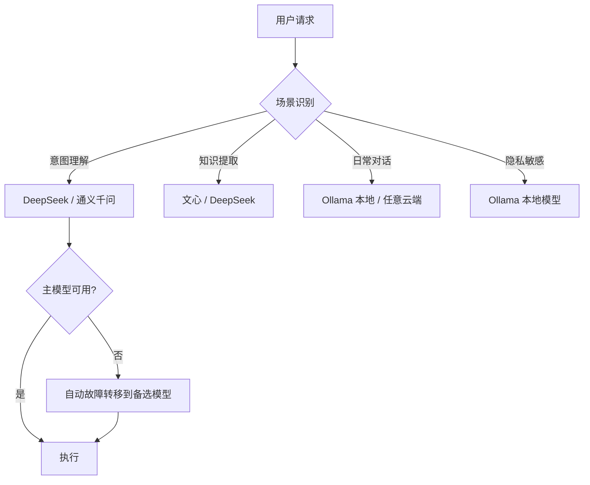

# 多 LLM 服务商支持

> 本文档从 [FEATURES.md](../FEATURES.md) 拆分而来，对应原文 §2.4 章节。

> ⚠️ 本文档描述的是目标功能设计，尚未实现。

灵活配置多个大语言模型，按场景智能选择，平衡成本、效果和隐私。

## 1. 支持的服务商

| 服务商 | 类型 | 适用场景 | 特点 |
|--------|------|----------|------|
| Ollama | 本地模型 | 隐私敏感场景、离线使用 | 数据完全不出本机 |
| DeepSeek | 云端 API | 意图理解、任务规划、复杂推理 | 性价比高，中文能力强 |
| 百度文心 | 云端 API | 中文对话、知识提取 | 国内服务，延迟低 |
| 阿里通义千问 | 云端 API | 通用对话、代码辅助 | 多模态支持好 |
| 智谱 GLM | 云端 API | 通用对话、推理任务 | 国产大模型，合规性好 |
| 更多... | 可扩展 | 按需接入 | 实现 ProviderAdapter 接口即可 |

## 2. 智能路由

LlmRouter 根据任务场景自动选择最合适的模型：

- **场景路由**：为不同场景（意图理解、任务规划、知识提取、日常对话）指定不同模型
- **优先级故障转移**：某个服务商不可用时，自动切换到备选模型
- **熔断器保护**：连续失败达到阈值后自动熔断，避免无效重试
- **降级模式**：所有服务商不可用时，基础功能仍可使用
