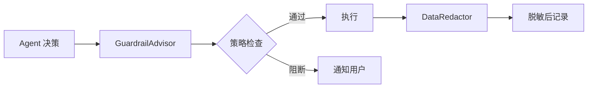

# 可观测性与数据隐私

> 本文档从 [FEATURES.md](../FEATURES.md) 拆分而来，对应原文 §2.17 / §2.18 章节。

> ⚠️ 本文档描述的是目标功能设计，尚未实现。

## 1. 可观测性与护栏

LifePilot 将提供 Trace 级的行为可观测性和多层护栏保护，确保 Agent 行为透明、安全、可审计。

### 1.1 Trace 追踪

每次 Agent 执行都会生成完整的 Trace 记录：

```
Trace #20260315-001
├── [UNDERSTANDING] 意图识别
│   ├── 输入：用户消息
│   ├── LLM 调用：DeepSeek（耗时 320ms，Token: 150/80）
│   └── 输出：schedule.create + todo.create
├── [PLANNING] 任务规划
│   ├── LLM 调用：DeepSeek（耗时 280ms，Token: 200/120）
│   └── 输出：2 步执行计划
├── [EXECUTING] 步骤 1: 创建日程
│   ├── 工具：SchedulePlugin.create
│   ├── 参数：{title: "与张总开会", ...}
│   ├── 护栏检查：✅ 通过（风险等级: LOW）
│   ├── 执行耗时：15ms
│   └── 结果：成功
├── [EXECUTING] 步骤 2: 创建待办
│   ├── 工具：TodoPlugin.create
│   ├── 参数：{title: "准备Q1报告", ...}
│   ├── 护栏检查：✅ 通过（风险等级: LOW）
│   ├── 执行耗时：12ms
│   └── 结果：成功
└── [RESPONDING] 生成响应
    ├── LLM 调用：Ollama/qwen2.5（耗时 450ms）
    └── 总耗时：1.08s，总 Token: 680
```

Trace 支持离线回放，可以在 Web UI 的轨迹回放页面逐步查看每个决策的详细信息。

### 1.2 护栏引擎（GuardrailEngine）



- **GuardrailAdvisor**：在 Agent 执行前拦截，检查操作是否符合安全策略
- **GuardrailPolicy**：策略以代码形式定义，在 LLM 之外强制执行
- **DataRedactor**：自动识别和脱敏敏感数据（手机号、身份证号、银行卡号等）

## 2. 数据隐私与本地优先

隐私保护是 LifePilot 的核心设计原则，不是事后补丁。

| 设计决策 | 说明 |
|---------|------|
| 本地存储 | 所有数据存储在本地 `~/.lifepilot/` 目录 |
| 本地模型优先 | 使用 Ollama 本地模型时，数据完全不出本机 |
| 云端透明 | 使用云端 LLM 时，发送前明确告知用户 |
| 自动脱敏 | DataRedactor 自动识别和脱敏敏感数据 |
| 数据导出 | 支持 JSON 格式完整导出所有个人数据 |
| 数据删除 | 支持数据完全删除，不留残余 |
| 隐私感知遗忘 | 遗忘策略中，隐私敏感数据优先清理 |

```
你：用 DeepSeek 帮我分析一下这份合同

LifePilot：⚠️ 提示：此操作将把合同内容发送到 DeepSeek 云端 API。
         合同中检测到以下敏感信息，已自动脱敏：
         - 甲方联系人手机号：138****5678
         - 合同金额：已保留
         
         是否继续？（输入 y 确认，或输入 "用本地模型" 切换到 Ollama）
```
