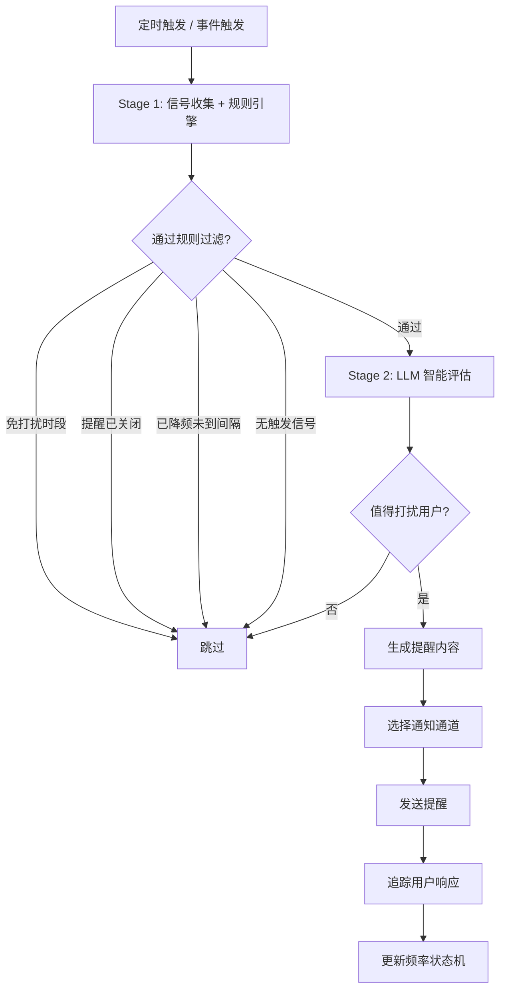

# 主动推理与认知记忆增强工作流

> 本文档从 [FEATURES.md](../FEATURES.md) 拆分而来，对应原文 §2.11 / §2.12 章节。

> ✅ 主动推理引擎已实现（Phase 3，模块 12）。详细架构设计参见 [architecture/proactive-reasoning.md](../architecture/proactive-reasoning.md)。

## 1. 主动推理与智能提醒 (ProactiveReasoner)

ZhiWei 不只是等你提问，它将在合适的时机主动帮助你。这是 ZhiWei 最核心的差异化能力之一。

### 1.1 两阶段推理



**Stage 1（规则引擎，< 10ms）**：快速收集信号并过滤，避免不必要的 LLM 调用。

信号类型：
- 时间信号：当前时间、距上次交互时长
- 任务信号：即将到期待办、即将开始日程
- 习惯信号：待打卡习惯、连续打卡即将中断
- 行为信号：用户活跃度、最近交互模式

**Stage 2（LLM 评估，~500ms）**：综合用户画像和历史反馈，判断是否值得打扰。

### 1.2 智能降频状态机

每个提醒类型独立维护频率状态：

```
NORMAL ──[连续忽略 ≥ 3]──→ REDUCED ──[连续忽略 ≥ 3]──→ MUTED
  ↑                           ↑                           │
  └──[用户确认 1 次]──────────┘──[用户确认 1 次]───────────┘
```

| 状态 | 行为 | 说明 |
|------|------|------|
| NORMAL | 按正常间隔发送 | 默认状态 |
| REDUCED | 发送间隔 ×3 | 用户可能不太关注此类提醒 |
| MUTED | 仅高紧急度时发送 | 用户明确不想被打扰 |

**关键设计**：降频是渐进的，恢复是即时的。用户只要响应一次就恢复频率，避免"沉默螺旋"。

### 1.3 触发场景示例

```
[周五 14:00]
ZhiWei：📝 检测到你通常这个时候准备周报。
         本周完成了 8 项待办，参加了 5 场会议。
         需要我帮你生成周报草稿吗？

[周二 08:45]  
ZhiWei：📅 提醒：15 分钟后有「团队周会」（会议室A）
         💡 上周会议遗留了 2 个 Action Item 待跟进：
         1. 确认 Q2 预算方案
         2. 更新项目时间线
```

## 2. 认知记忆增强工作流

超越传统的定时任务和事件触发，将构建"记忆驱动的自动化"工作流引擎。这是 ZhiWei 的原创设计。

### 2.1 传统自动化 vs 记忆驱动自动化

| 维度 | 传统自动化（如 Cron） | ZhiWei 记忆驱动自动化 |
|------|----------------------|--------------------------|
| 触发方式 | 固定时间 / 固定事件 | 记忆模式匹配 + 时间 + 事件 |
| 上下文感知 | 无 | 完整认知记忆 + 知识图谱 |
| 决策能力 | 固定规则 | ProactiveReasoner 动态推理 |
| 学习能力 | 无 | 根据执行结果优化触发策略 |

### 2.2 记忆模式触发示例

```
场景：ZhiWei 发现你最近三周每周五下午都会查看周报数据

触发条件：
  - 记忆模式：连续 3 次「周五下午 + 查看周报」行为
  - 时间条件：周五 14:00
  - 置信度：> 0.8

自动动作：
  1. 从知识图谱获取本周关键事项
  2. 调用数据查询工具汇总本周数据
  3. 生成周报草稿
  4. 推送通知：「检测到你通常这个时候准备周报，已为你生成草稿 📝」
```

### 2.3 工作流定义

```yaml
# ~/.lifepilot/workflows/weekly-report.yml
workflow:
  id: weekly-report-assist
  name: 周报辅助
  description: 基于记忆模式自动准备周报

  triggers:
    - type: memory-pattern          # 记忆模式触发
      pattern: "周五下午 + 查看周报"
      min-occurrences: 3
      confidence: 0.8
    - type: schedule                # 兜底定时触发
      cron: "0 0 14 ? * FRI"

  context:
    memory-query:
      - "本周完成的任务"
      - "本周重要会议"
      - "本周待解决问题"

  steps:
    - name: 收集数据
      action: knowledge-graph.query
      params:
        time-range: this-week
        entity-types: [事件, 待办]

    - name: 生成周报
      action: llm.generate
      params:
        prompt-template: weekly-report
        context: "${steps.收集数据.result}"

    - name: 推送通知
      action: notification.send
      params:
        title: 周报草稿已就绪
        body: "${steps.生成周报.result.summary}"
```
