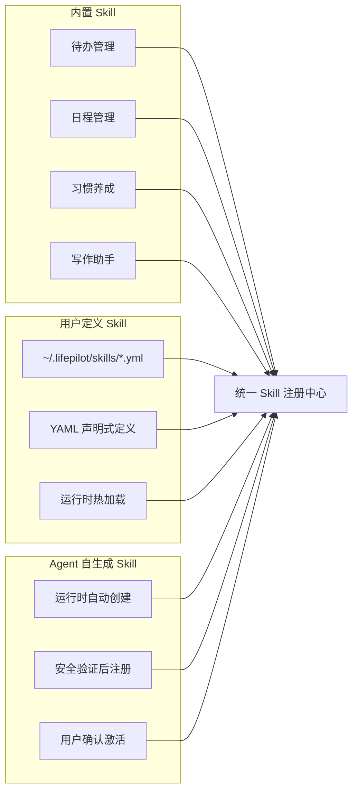

# Agent Skills 技能系统

> 本文档从 [FEATURES.md](../FEATURES.md) 拆分而来，对应原文 §2.2 章节。

> ⚠️ 本文档描述的是目标功能设计，尚未实现。

LifePilot 将采用统一的 Agent Skills 架构。一个 Skill 不是简单的工具别名，而是一个完整的**"Agent 能力单元"**——包含专业人格、工具权限、执行策略和记忆访问权限。

## 1. Skill 的本质

| 组成部分 | 说明 | 示例 |
|---------|------|------|
| System Prompt | 定义 Skill 的专业人格和行为指导 | "你是一个专业的写作助手，擅长..." |
| 工具子集 | Skill 可以使用哪些工具（最小权限原则） | `[searchMemory, createDocument]` |
| 执行策略 | 最大步骤数、超时、是否需要用户确认 | `max-steps: 10, timeout: 120s` |
| 记忆访问权限 | 可读写哪些记忆层和实体类型 | 可读 L3 语义记忆中的"人物"和"事件" |
| 预算约束 | 独立的 Token / 步骤 / 时间预算 | `max-tokens: 4000` |

## 2. 三种 Skill 来源



| 来源 | 定义方式 | 加载时机 | 适用场景 |
|------|---------|---------|---------|
| **BUILTIN** | Java 代码 | 系统启动时自动注册 | 核心能力（待办、日程、习惯等） |
| **USER_DEFINED** | YAML 文件 | 运行时热加载 | 用户自定义扩展（天气查询、API 调用等） |
| **AUTO_GENERATED** | Agent 运行时生成 | 安全验证后注册 | Agent 自动学习新能力 |

## 3. Skill 激活 = SubAgent

当主 Agent 判断需要专业能力时，会激活对应的 Skill。激活过程就是创建一个 SubAgent 实例——注入 Skill 的 System Prompt、限制为 Skill 声明的工具子集、分配独立预算，然后复用主引擎执行。

> 类比：Skill 是**类（Class）**，SubAgent 是**对象（Object）**。Skill 定义能力蓝图，SubAgent 是运行时实例。

**激活深度限制**：最多 2 层（主 Agent → SubAgent → Sub-SubAgent），防止无限递归。

**使用示例：**

```
你：帮我写一篇关于本周工作进展的周报

LifePilot：好的，我来帮你准备周报。

         📊 正在收集本周数据...
         - 本周完成 8 项待办，2 项延期
         - 参加 5 场会议（含 2 场客户会议）
         - 习惯打卡完成率 85%

         ✍️ 激活「写作助手」Skill 撰写周报...

         📝 周报草稿：
         
         【本周工作总结】
         一、重点工作完成情况
         1. XX项目Q1评审材料已提交（周二完成）
         2. 客户需求文档 v2.0 已交付（周四完成）
         ...
         
         需要我调整内容或风格吗？
```

## 4. YAML Skill 定义示例

```yaml
# ~/.lifepilot/skills/writing-assistant.yml
skill:
  id: writing-assistant
  name: 写作助手
  description: 擅长长文撰写、润色、翻译，能结合用户的知识库生成高质量内容
  version: "1.0"
  source: USER_DEFINED

  # 专业人格
  system-prompt: |
    你是一个专业的写作助手。你的写作风格简洁有力，善于用数据说话。
    在撰写内容时，优先从用户的记忆和知识库中获取素材，确保内容贴合用户实际情况。

  # 工具权限（最小权限原则）
  allowed-tools:
    - searchMemory        # 检索记忆获取素材
    - queryKnowledgeBase  # 查询知识库
    - createDocument      # 创建文档

  # 执行策略
  execution:
    max-steps: 15
    timeout-seconds: 180
    require-confirmation: false

  # 记忆访问权限
  memory-access:
    read:
      - layer: L3_SEMANTIC    # 可读语义记忆
        entity-types: [PERSON, EVENT, PROJECT]
      - layer: L2_EPISODIC    # 可读近期对话
        time-range: 7d
    write: []                 # 写作助手不写入记忆

  # 预算约束
  budget:
    max-tokens: 8000
    max-cost-cents: 50

  # LLM 偏好（可选，不指定则使用主 Agent 的路由策略）
  provider-id: null
```

## 5. Skill 自扩展能力

LifePilot 的 Agent 不仅将能使用现有 Skill，还能在运行时自动创建新的 Skill 来满足需求。

**工作原理**：当你提出一个现有 Skill 无法处理的请求时，Agent 会自动分析需求，生成一个完整的 YAML Skill 定义，经过安全验证后注册。下次遇到同类需求时，直接激活已有 Skill。

```
你：帮我查一下今天人民币对美元的汇率

LifePilot：检测到当前没有汇率查询能力，正在创建新 Skill...
         🔍 分析需求：需要调用汇率 API 获取实时数据
         📝 生成 Skill 定义：exchange-rate-query.yml
         🔒 安全验证：✅ 格式校验通过 ✅ 安全检查通过 ✅ 沙箱试运行通过
         
         💱 今日汇率：1 USD = 7.24 CNY
         数据来源：exchangerate.host
         
         [此 Skill 已保存到 ~/.lifepilot/skills/，下次可直接使用]
```

**安全保障**：
- Agent 只能生成声明式 YAML Skill 定义，不能执行任意代码
- 新 Skill 必须通过**格式校验 → 安全检查 → 沙箱试运行**三重验证
- 自生成 Skill 首次激活需要用户确认
- 所有自生成 Skill 的创建和使用记录完整可追溯
