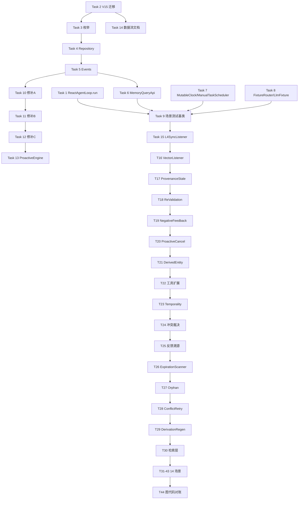

# 记忆生命周期闭环 Implementation Plan

> **For agentic workers:** REQUIRED SUB-SKILL: Use superpowers:subagent-driven-development (recommended) or superpowers:executing-plans to implement this plan task-by-task. Steps use checkbox (`- [ ]`) syntax for tracking.

**Goal:** 把知微 L3/L4 记忆的失效传播路径系统化，以 Spring ApplicationEvent 总线 + 七态生命周期状态机贯穿 14 条写入源，消除"降权不淘汰""派生实体不重算""前端编辑不闭环"等结构性缺陷，并落产 `memory-data-flow.md` 作为长期数据治理参照。

**Architecture:** 事件统一挂在 `SemanticMemory` 核心层，自动覆盖 14 个写入源；4 个事件（`EntityLifecycleChanged` / `SourceInvalidated` / `EntityWeightChanged` / `ProactiveTaskCancelled`）由 7 个监听器消费；派生实体走独立的 `REGENERATION_NEEDED` 状态 + Cron 重算；验收门槛 = 14 场景 E2E 全绿 + 图代码对账零 diff。

**Tech Stack:** Spring Boot 3 + Java 22 (record / sealed / pattern matching / virtual threads) + SQLite (WAL + FTS5 + sqlite-vec) + Flyway (V15) + JUnit 5 + jqwik + Mockito + Reka UI（前端不动）

---

## 参考文档

- **Spec**：`docs/superpowers/specs/2026-04-23-memory-lifecycle-closure-design.md`（决策、选型、权衡）
- **长期参照**：`docs/architecture/memory-data-flow.md`（**Phase 0 Task 14 产出**，后续所有实施对照）
- **编码规范**：`.claude/rules/java-conventions.md` / `database-rules.md`

---

## File Structure

### 新文件 · 生产代码

```
src/main/java/com/lifepilot/memory/lifecycle/
├── LifecycleState.java              # enum
├── ChangeSource.java                # enum
├── WeightSource.java                # enum
├── SourceType.java                  # enum
├── InvalidationKind.java            # enum
├── events/
│   ├── EntityLifecycleChanged.java  # record
│   ├── SourceInvalidated.java       # record
│   ├── EntityWeightChanged.java     # record
│   └── ProactiveTaskCancelled.java  # record
├── listeners/
│   ├── L4SyncListener.java
│   ├── VectorListener.java
│   ├── DerivedEntityListener.java
│   ├── ProvenanceStaleListener.java
│   ├── ReValidationListener.java
│   ├── NegativeFeedbackListener.java
│   └── ProactiveTaskCancelListener.java
├── scanner/
│   ├── ExpirationScanner.java
│   ├── OrphanProvenanceScanner.java
│   ├── ConflictResolutionRetry.java
│   └── DerivationRegenerator.java
├── feedback/
│   ├── FeedbackLedgerRepository.java
│   └── FeedbackThresholdConfig.java  # @ConfigurationProperties
└── query/
    └── MemoryQueryApi.java

src/main/java/com/lifepilot/memory/semantic/
├── ConflictResolutionService.java
└── ConflictResolutionRepository.java

src/main/resources/db/migration/
└── V15__memory_lifecycle_closure.sql

src/main/resources/prompts/
└── memory-conflict-resolution.st

docs/architecture/
└── memory-data-flow.md
```

### 修改文件 · 生产代码

- `src/main/java/com/lifepilot/memory/semantic/SemanticMemory.java`
  - `upsertWithConflictDetection()` / `archive()` → 发 `EntityLifecycleChanged`
  - `updateImportanceScore()` → 发 `EntityWeightChanged`
  - `updateDescription()` → 改走 `upsertWithConflictDetection`（修补 A）
- `src/main/java/com/lifepilot/memory/semantic/RealtimeExtractor.java` — 输出增 `temporality` / `expires_at`
- `src/main/java/com/lifepilot/memory/feedback/FeedbackProcessor.java` — 保留 delta 计算，事件发布由 SemanticMemory 完成（修补 B）
- `src/main/java/com/lifepilot/meta/infra/memory/MemoryToolProvider.java` — 扩 `complete` / `supersede`，`cancel` 扩所有类型
- `src/main/java/com/lifepilot/agent/task/proactive/ProactiveEngine.java` — `markGoalFulfilled` 发 `ProactiveTaskCancelled`
- `src/main/java/com/lifepilot/agent/ReactAgentLoop.java` — 抽出 `run(Session, UserMessage)` 纯函数级入口
- `src/main/java/com/lifepilot/memory/repository/MemoryEntityRepository.java` — 新字段读写
- `src/main/java/com/lifepilot/memory/repository/MemoryEntityProvenanceRepository.java` — status/invalidated_at
- `src/main/java/com/lifepilot/memory/retriever/MemoryRetriever.java` — lifecycle 过滤 + STALE 标注
- `src/main/resources/prompts/memory-extract.st` — 分类指引加 temporality
- `src/main/resources/application.yml` — 反馈阈值配置

### 新文件 · 测试代码

```
src/test/java/com/lifepilot/memory/
├── scenarios/
│   ├── 场景测试基类.java
│   ├── 取消定时任务后不再提醒_场景测试.java          # S1
│   ├── 任务完成后不再作为待办_场景测试.java          # S3
│   ├── 冲突记忆被新版替代_场景测试.java              # S4
│   ├── 临时情绪不污染长期偏好_场景测试.java          # S5
│   ├── L3归档时L4规则同步失效_场景测试.java         # S6
│   ├── 孤儿引用被标记陈旧_场景测试.java              # S7
│   ├── 垃圾经验被累计负反馈淘汰_场景测试.java        # S9
│   ├── 主动任务取消级联清理insight_场景测试.java    # S10
│   ├── 对比洞察源失效触发重算_场景测试.java         # S11
│   ├── 派生画像源失效后重算_场景测试.java           # S12
│   ├── 对话持续点踩淘汰记忆_场景测试.java           # S13
│   ├── 提醒反馈溯源到insight_场景测试.java          # S14
│   ├── 前端UI编辑触发闭环_场景测试.java             # S15
│   └── updateDescription版本化_单元测试.java        # S16
├── lifecycle/
│   ├── 状态机转换_单元测试.java
│   ├── 状态机不变量_属性测试.java                   # jqwik
│   ├── L4SyncListener_单元测试.java
│   ├── VectorListener_单元测试.java
│   ├── DerivedEntityListener_单元测试.java
│   ├── ProvenanceStaleListener_单元测试.java
│   ├── ReValidationListener_单元测试.java
│   ├── NegativeFeedbackListener_单元测试.java
│   └── ProactiveTaskCancelListener_单元测试.java
├── semantic/
│   └── ConflictResolutionService_单元测试.java
└── support/
    ├── ScenarioTestConfiguration.java
    ├── FixtureBackedGenerationRouter.java
    ├── MutableClock.java
    ├── ManualTaskScheduler.java
    ├── LlmFixture.java
    └── FeedbackGateway.java

src/test/resources/llm-fixtures/
└── S{1,3,4,5,6,7,9,10,11,12,13,14,15}_*.json     # 13 份 fixture
```

---

## Phase 分组总览

| Phase | 对应 spec step | 包含 Task | 交付物 | PR 建议 |
|---|---|---|---|---|
| **Phase 0** | step 0 + 0.5 + 1 | Task 1-14 | 测试基础设施 + 三个架构修补 + V15 迁移 + 数据流文档 | 1 个基础 PR |
| **Phase 1** | step 2 + 3 | Task 15-21 | 事件契约 + 7 监听器 | 1 个 PR |
| **Phase 2** | step 4 + 5 + 6 | Task 22-24 | memory 工具扩 + temporality + 冲突裁决 | 1-2 个 PR |
| **Phase 3** | step 7 + 8 + 9 | Task 25-27 | 反馈阈值 + 派生重算 + 4 Cron | 1-2 个 PR |
| **Phase 4** | step 10 + 11 + 12 | Task 28-42 | 检索层 + 14 场景 + 图对账 | 1-2 个 PR |

---

# Phase 0 · 基础设施 + 架构修补

---

### Task 1: 抽出 `ReactAgentLoop.run(Session, UserMessage)` 可直接调用入口

**Files:**
- Modify: `src/main/java/com/lifepilot/agent/ReactAgentLoop.java`
- Test: `src/test/java/com/lifepilot/agent/ReactAgentLoop_单轮调用入口_单元测试.java`

**背景：** 当前 `ReactAgentLoop` 由 HTTP/SSE 层驱动，测试很难直接调。抽出一个 `run(Session, UserMessage)` 纯函数级 API，返回 `TurnResult`（已产出的工具调用 + 最终文本）。生产代码改造后也走这个入口。

- [ ] **Step 1.1: 定义 `TurnResult` record**

创建 `src/main/java/com/lifepilot/agent/TurnResult.java`：

```java
package com.lifepilot.agent;

import java.util.List;

/**
 * ReactAgentLoop 单轮调用结果。
 *
 * @author zsg
 * @since 2026-04-23
 */
public record TurnResult(
    String sessionId,
    String turnId,
    List<ToolInvocation> toolInvocations,   // 按调用顺序
    String finalText,                        // 最终回复
    boolean completed                        // 是否正常结束（vs 预算耗尽/中断）
) {
    public record ToolInvocation(String tool, String argsJson, String resultJson) {}
}
```

- [ ] **Step 1.2: 写失败测试**

```java
// src/test/java/com/lifepilot/agent/ReactAgentLoop_单轮调用入口_单元测试.java
package com.lifepilot.agent;

import org.junit.jupiter.api.Test;
import static org.assertj.core.api.Assertions.assertThat;

class ReactAgentLoop_单轮调用入口_单元测试 {
    @Test
    void 单轮调用应返回TurnResult包含工具调用序列() {
        // 此测试在 Task 10（FixtureBackedGenerationRouter）完成后可在集成层跑完整版；
        // 当前仅验证 API 存在且签名正确
        var method = ReactAgentLoop.class.getDeclaredMethod("run", Session.class, UserMessage.class);
        assertThat(method.getReturnType()).isEqualTo(TurnResult.class);
    }
}
```

- [ ] **Step 1.3: 确认测试失败**

Run: `mvn test -Dtest=ReactAgentLoop_单轮调用入口_单元测试`
Expected: FAIL，编译报错 `method run(Session, UserMessage) not found`

- [ ] **Step 1.4: 实现 `run(Session, UserMessage)` 入口**

在 `ReactAgentLoop.java` 增加：

```java
/**
 * 单轮对话入口（可直接调用，用于测试和生产）。
 * 封装原有 HTTP/SSE 入口共用的 loop 逻辑。
 *
 * @param session 当前会话上下文
 * @param userMessage 用户输入
 * @return 单轮结果：工具调用序列 + 最终文本
 */
public TurnResult run(Session session, UserMessage userMessage) {
    var turnId = startTurn(session, userMessage);
    var toolInvocations = new ArrayList<TurnResult.ToolInvocation>();
    String finalText = null;
    boolean completed = false;
    try {
        while (!shouldStop(session, turnId)) {
            var step = executeStep(session, turnId);
            step.toolCalls().forEach(tc ->
                toolInvocations.add(new TurnResult.ToolInvocation(tc.tool(), tc.argsJson(), tc.resultJson())));
            if (step.isTerminal()) {
                finalText = step.finalText();
                completed = true;
                break;
            }
        }
    } finally {
        finalizeTurn(session, turnId);
    }
    return new TurnResult(session.id(), turnId, List.copyOf(toolInvocations), finalText, completed);
}
```

注：`startTurn` / `shouldStop` / `executeStep` / `finalizeTurn` 是从现有 HTTP 入口抽出来的内部方法；原 SSE 入口保留但内部改调 `run()`，两者共享同一核心循环。

- [ ] **Step 1.5: 跑测试 + 编译**

Run: `mvn test -Dtest=ReactAgentLoop_单轮调用入口_单元测试 && mvn compile`
Expected: PASS + BUILD SUCCESS

- [ ] **Step 1.6: 提交**

```bash
git add src/main/java/com/lifepilot/agent/ReactAgentLoop.java \
        src/main/java/com/lifepilot/agent/TurnResult.java \
        src/test/java/com/lifepilot/agent/ReactAgentLoop_单轮调用入口_单元测试.java
git commit -m "feat(agent): ReactAgentLoop 抽出 run(Session, UserMessage) 可直接调用入口"
```

---

### Task 2: Flyway V15 迁移脚本

**Files:**
- Create: `src/main/resources/db/migration/V15__memory_lifecycle_closure.sql`

**背景：** spec §4.1 列的全部 schema 变更一次性下到 V15。SQLite 不支持 `ALTER COLUMN`，用 `ADD COLUMN`；所有字段带默认值保证兼容。

- [ ] **Step 2.1: 写迁移文件**

创建 `src/main/resources/db/migration/V15__memory_lifecycle_closure.sql`：

```sql
-- V15：记忆生命周期闭环
-- @author zsg
-- @since 2026-04-23

-- 1. memory_entities 生命周期字段
ALTER TABLE memory_entities ADD COLUMN lifecycle_state TEXT NOT NULL DEFAULT 'ACTIVE';
ALTER TABLE memory_entities ADD COLUMN lifecycle_reason TEXT;
ALTER TABLE memory_entities ADD COLUMN expires_at TEXT;
ALTER TABLE memory_entities ADD COLUMN temporality TEXT NOT NULL DEFAULT 'PERSISTENT';
ALTER TABLE memory_entities ADD COLUMN succeeded_by TEXT;
ALTER TABLE memory_entities ADD COLUMN is_derived INTEGER NOT NULL DEFAULT 0;
ALTER TABLE memory_entities ADD COLUMN derivation_sources TEXT;
CREATE INDEX idx_memory_entities_lifecycle ON memory_entities(lifecycle_state, expires_at);
CREATE INDEX idx_memory_entities_derived ON memory_entities(is_derived, lifecycle_state);

-- 旧 ARCHIVED 数据映射
UPDATE memory_entities SET lifecycle_state = 'ARCHIVED' WHERE status = 'ARCHIVED';

-- 2. memory_entity_provenances 失效标记
ALTER TABLE memory_entity_provenances ADD COLUMN status TEXT NOT NULL DEFAULT 'VALID';
ALTER TABLE memory_entity_provenances ADD COLUMN invalidated_at TEXT;

-- 3. L4 反向连接
ALTER TABLE preference_rules ADD COLUMN source_entity_id TEXT;
ALTER TABLE preference_rules ADD COLUMN deactivated_reason TEXT;
ALTER TABLE procedure_templates ADD COLUMN source_entity_id TEXT;
ALTER TABLE procedure_templates ADD COLUMN deactivated_reason TEXT;

-- 4. 反馈累计账本
CREATE TABLE memory_feedback_ledger (
    id TEXT PRIMARY KEY,
    entity_id TEXT NOT NULL,
    source TEXT NOT NULL,
    delta REAL NOT NULL,
    cumulative_score REAL NOT NULL,
    created_at TEXT NOT NULL
);
CREATE INDEX idx_feedback_ledger_entity ON memory_feedback_ledger(entity_id, created_at);

-- 5. 再验证队列
CREATE TABLE memory_revalidation_queue (
    id TEXT PRIMARY KEY,
    entity_id TEXT NOT NULL,
    source_type TEXT NOT NULL,
    source_id TEXT NOT NULL,
    created_at TEXT NOT NULL,
    status TEXT NOT NULL DEFAULT 'PENDING'
);
CREATE INDEX idx_revalidation_pending ON memory_revalidation_queue(status, created_at);

-- 6. 冲突裁决队列
CREATE TABLE conflict_resolution_queue (
    id TEXT PRIMARY KEY,
    new_entity_id TEXT NOT NULL,
    candidate_entity_ids TEXT NOT NULL,
    status TEXT NOT NULL DEFAULT 'PENDING',
    verdict TEXT,
    rationale TEXT,
    attempt_count INTEGER NOT NULL DEFAULT 0,
    created_at TEXT NOT NULL,
    resolved_at TEXT
);
CREATE INDEX idx_conflict_queue_status ON conflict_resolution_queue(status, created_at);

-- 7. 派生实体重算队列
CREATE TABLE derivation_regeneration_queue (
    id TEXT PRIMARY KEY,
    derived_entity_id TEXT NOT NULL,
    trigger_source_entity_id TEXT NOT NULL,
    status TEXT NOT NULL DEFAULT 'PENDING',
    created_at TEXT NOT NULL,
    processed_at TEXT
);
CREATE INDEX idx_regeneration_pending ON derivation_regeneration_queue(status, created_at);
```

- [ ] **Step 2.2: 验证迁移可执行**

Run: `mvn compile && mvn spring-boot:run` （启动到 Flyway 迁移完成后 Ctrl+C）
或更快：`mvn test -Dtest=DbMigrationSmoke` 若存在该类，否则：
Run: `mvn test -Dtest=*MigrationSmoke* -DfailIfNoTests=false`

Expected: Flyway 日志出现 `Successfully applied migration to schema "main", now at version v15`

- [ ] **Step 2.3: 提交**

```bash
git add src/main/resources/db/migration/V15__memory_lifecycle_closure.sql
git commit -m "feat(db): V15 记忆生命周期闭环 schema（7 新字段 + 4 新表 + L4 反向外键）"
```

---

### Task 3: 五个枚举类

**Files:**
- Create: `src/main/java/com/lifepilot/memory/lifecycle/LifecycleState.java`
- Create: `src/main/java/com/lifepilot/memory/lifecycle/ChangeSource.java`
- Create: `src/main/java/com/lifepilot/memory/lifecycle/WeightSource.java`
- Create: `src/main/java/com/lifepilot/memory/lifecycle/SourceType.java`
- Create: `src/main/java/com/lifepilot/memory/lifecycle/InvalidationKind.java`
- Test: `src/test/java/com/lifepilot/memory/lifecycle/状态机转换_单元测试.java`

- [ ] **Step 3.1: 写 `LifecycleState` 枚举 + 转换合法性检查**

```java
// src/main/java/com/lifepilot/memory/lifecycle/LifecycleState.java
package com.lifepilot.memory.lifecycle;

import java.util.EnumSet;
import java.util.Set;

/**
 * 实体生命周期状态（7 态）。
 *
 * @author zsg
 * @since 2026-04-23
 */
public enum LifecycleState {
    ACTIVE,
    COMPLETED,
    CANCELLED,
    EXPIRED,
    SUPERSEDED,
    REGENERATION_NEEDED,
    ARCHIVED;

    /** 允许的目标状态。非法转换抛 IllegalStateException。 */
    private static final Set<LifecycleState> TERMINAL = EnumSet.of(CANCELLED, EXPIRED, SUPERSEDED, ARCHIVED);

    public boolean canTransitionTo(LifecycleState next) {
        return switch (this) {
            case ACTIVE -> next != ACTIVE;
            case COMPLETED -> next == ARCHIVED;
            case REGENERATION_NEEDED -> next == SUPERSEDED || next == ARCHIVED;
            case CANCELLED, EXPIRED, SUPERSEDED -> next == ARCHIVED;
            case ARCHIVED -> false;
        };
    }

    /** 是否仍可被默认检索召回（ACTIVE / COMPLETED / REGENERATION_NEEDED 返回 true，但 REGENERATION 带 isStale 标）。 */
    public boolean isRetrievable() {
        return this == ACTIVE || this == COMPLETED || this == REGENERATION_NEEDED;
    }
}
```

- [ ] **Step 3.2: 写其他 4 个枚举**

```java
// src/main/java/com/lifepilot/memory/lifecycle/ChangeSource.java
package com.lifepilot.memory.lifecycle;

public enum ChangeSource {
    TOOL_EXPLICIT, LLM_SEMANTIC, CRON_EXPIRE, CONFLICT_RESOLVE,
    NEGATIVE_FEEDBACK, PROACTIVE_CANCEL, UI_EDIT, DERIVATION_TRIGGER
}

// src/main/java/com/lifepilot/memory/lifecycle/WeightSource.java
package com.lifepilot.memory.lifecycle;

public enum WeightSource {
    USER_FEEDBACK, EFFECTIVENESS, QUALITY_REJECT
}

// src/main/java/com/lifepilot/memory/lifecycle/SourceType.java
package com.lifepilot.memory.lifecycle;

public enum SourceType {
    DOCUMENT, KNOWLEDGE_BASE, SESSION
}

// src/main/java/com/lifepilot/memory/lifecycle/InvalidationKind.java
package com.lifepilot.memory.lifecycle;

public enum InvalidationKind {
    DELETED, ARCHIVED, CONTENT_CHANGED
}
```

- [ ] **Step 3.3: 写状态机转换测试**

```java
// src/test/java/com/lifepilot/memory/lifecycle/状态机转换_单元测试.java
package com.lifepilot.memory.lifecycle;

import org.junit.jupiter.api.Test;
import static com.lifepilot.memory.lifecycle.LifecycleState.*;
import static org.assertj.core.api.Assertions.*;

class 状态机转换_单元测试 {
    @Test
    void ACTIVE可以转到所有非ACTIVE状态() {
        for (LifecycleState s : LifecycleState.values()) {
            if (s == ACTIVE) continue;
            assertThat(ACTIVE.canTransitionTo(s)).as("ACTIVE → %s", s).isTrue();
        }
    }

    @Test
    void ARCHIVED是终态不能再转() {
        for (LifecycleState s : LifecycleState.values()) {
            assertThat(ARCHIVED.canTransitionTo(s)).as("ARCHIVED → %s", s).isFalse();
        }
    }

    @Test
    void COMPLETED只能到ARCHIVED() {
        assertThat(COMPLETED.canTransitionTo(ARCHIVED)).isTrue();
        assertThat(COMPLETED.canTransitionTo(CANCELLED)).isFalse();
        assertThat(COMPLETED.canTransitionTo(ACTIVE)).isFalse();
    }

    @Test
    void REGENERATION_NEEDED只能到SUPERSEDED或ARCHIVED() {
        assertThat(REGENERATION_NEEDED.canTransitionTo(SUPERSEDED)).isTrue();
        assertThat(REGENERATION_NEEDED.canTransitionTo(ARCHIVED)).isTrue();
        assertThat(REGENERATION_NEEDED.canTransitionTo(ACTIVE)).isFalse();
    }

    @Test
    void 可召回集是ACTIVE_COMPLETED_REGENERATION_NEEDED() {
        assertThat(ACTIVE.isRetrievable()).isTrue();
        assertThat(COMPLETED.isRetrievable()).isTrue();
        assertThat(REGENERATION_NEEDED.isRetrievable()).isTrue();
        assertThat(CANCELLED.isRetrievable()).isFalse();
        assertThat(EXPIRED.isRetrievable()).isFalse();
        assertThat(SUPERSEDED.isRetrievable()).isFalse();
        assertThat(ARCHIVED.isRetrievable()).isFalse();
    }
}
```

- [ ] **Step 3.4: 跑测试**

Run: `mvn test -Dtest=状态机转换_单元测试`
Expected: PASS，5 个测试全绿

- [ ] **Step 3.5: 提交**

```bash
git add src/main/java/com/lifepilot/memory/lifecycle/*.java \
        src/test/java/com/lifepilot/memory/lifecycle/状态机转换_单元测试.java
git commit -m "feat(memory): 生命周期 5 个枚举 + 状态机转换校验"
```

---

### Task 4: Repository 新字段读写

**Files:**
- Modify: `src/main/java/com/lifepilot/memory/repository/MemoryEntityRepository.java`
- Modify: `src/main/java/com/lifepilot/memory/repository/MemoryEntityProvenanceRepository.java`
- Test: `src/test/java/com/lifepilot/memory/repository/MemoryEntityRepository_新字段读写_集成测试.java`

- [ ] **Step 4.1: 扩展 `MemoryEntity` record**

在 `src/main/java/com/lifepilot/memory/semantic/MemoryEntity.java` record 增加字段（若已有则合并）：

```java
public record MemoryEntity(
    String id,
    String type,
    String name,
    String description,
    double importanceScore,
    // 以下为 V15 新字段
    LifecycleState lifecycleState,
    String lifecycleReason,
    java.time.Instant expiresAt,
    Temporality temporality,
    String succeededBy,
    boolean isDerived,
    java.util.List<String> derivationSources
    // 其余原有字段省略
) {}

public enum Temporality { EPHEMERAL, SHORT_TERM, PERSISTENT }
```

- [ ] **Step 4.2: 更新 RowMapper 和 insert/update SQL**

```java
// MemoryEntityRepository.java 片段
private static final RowMapper<MemoryEntity> ROW_MAPPER = (rs, n) -> new MemoryEntity(
    rs.getString("id"),
    rs.getString("type"),
    rs.getString("name"),
    rs.getString("description"),
    rs.getDouble("importance_score"),
    LifecycleState.valueOf(rs.getString("lifecycle_state")),
    rs.getString("lifecycle_reason"),
    rs.getString("expires_at") == null ? null : Instant.parse(rs.getString("expires_at")),
    MemoryEntity.Temporality.valueOf(rs.getString("temporality")),
    rs.getString("succeeded_by"),
    rs.getInt("is_derived") == 1,
    parseJsonList(rs.getString("derivation_sources"))
);

public void save(MemoryEntity e) {
    jdbc.update("""
        INSERT INTO memory_entities
          (id, type, name, description, importance_score,
           lifecycle_state, lifecycle_reason, expires_at, temporality,
           succeeded_by, is_derived, derivation_sources, ...)
        VALUES (?,?,?,?,?,?,?,?,?,?,?,?, ...)
        ON CONFLICT(id) DO UPDATE SET
          description = excluded.description,
          importance_score = excluded.importance_score,
          lifecycle_state = excluded.lifecycle_state,
          lifecycle_reason = excluded.lifecycle_reason,
          expires_at = excluded.expires_at,
          temporality = excluded.temporality,
          succeeded_by = excluded.succeeded_by,
          derivation_sources = excluded.derivation_sources
        """,
        e.id(), e.type(), e.name(), e.description(), e.importanceScore(),
        e.lifecycleState().name(), e.lifecycleReason(),
        e.expiresAt() == null ? null : e.expiresAt().toString(),
        e.temporality().name(), e.succeededBy(),
        e.isDerived() ? 1 : 0, toJson(e.derivationSources())
    );
}

public void updateLifecycleState(String entityId, LifecycleState newState, String reason) {
    jdbc.update("""
        UPDATE memory_entities
        SET lifecycle_state = ?, lifecycle_reason = ?
        WHERE id = ?
        """, newState.name(), reason, entityId);
}
```

类似地更新 `MemoryEntityProvenanceRepository`：

```java
public void markStale(SourceType type, String sourceId, Instant when) {
    var column = switch (type) {
        case DOCUMENT -> "source_document_id";
        case KNOWLEDGE_BASE -> "source_knowledge_base_id";
        case SESSION -> "source_conversation_id";
    };
    jdbc.update("""
        UPDATE memory_entity_provenances
        SET status = 'STALE', invalidated_at = ?
        WHERE """ + column + " = ?",
        when.toString(), sourceId);
}
```

- [ ] **Step 4.3: 写集成测试**

```java
// src/test/java/com/lifepilot/memory/repository/MemoryEntityRepository_新字段读写_集成测试.java
package com.lifepilot.memory.repository;

import com.lifepilot.memory.lifecycle.LifecycleState;
import com.lifepilot.memory.semantic.MemoryEntity;
import org.junit.jupiter.api.Test;
import org.springframework.beans.factory.annotation.Autowired;
import org.springframework.boot.test.context.SpringBootTest;
import static org.assertj.core.api.Assertions.*;

@SpringBootTest
class MemoryEntityRepository_新字段读写_集成测试 {
    @Autowired MemoryEntityRepository repo;

    @Test
    void 保存并读回带新字段的实体() {
        var e = new MemoryEntity("test-1", "PREFERENCE", "test", "desc", 0.5,
            LifecycleState.ACTIVE, null, null, MemoryEntity.Temporality.PERSISTENT,
            null, false, java.util.List.of());
        repo.save(e);
        var loaded = repo.findById("test-1").orElseThrow();
        assertThat(loaded.lifecycleState()).isEqualTo(LifecycleState.ACTIVE);
        assertThat(loaded.temporality()).isEqualTo(MemoryEntity.Temporality.PERSISTENT);
        assertThat(loaded.isDerived()).isFalse();
    }

    @Test
    void updateLifecycleState_转换成功() {
        var e = new MemoryEntity("test-2", "GOAL", "g", "d", 0.5,
            LifecycleState.ACTIVE, null, null, MemoryEntity.Temporality.PERSISTENT,
            null, false, java.util.List.of());
        repo.save(e);
        repo.updateLifecycleState("test-2", LifecycleState.CANCELLED, "user-cancelled");
        assertThat(repo.findById("test-2").orElseThrow().lifecycleState()).isEqualTo(LifecycleState.CANCELLED);
    }
}
```

- [ ] **Step 4.4: 跑测试**

Run: `mvn test -Dtest=MemoryEntityRepository_新字段读写_集成测试`
Expected: PASS

- [ ] **Step 4.5: 提交**

```bash
git add src/main/java/com/lifepilot/memory/repository/*.java \
        src/main/java/com/lifepilot/memory/semantic/MemoryEntity.java \
        src/test/java/com/lifepilot/memory/repository/MemoryEntityRepository_新字段读写_集成测试.java
git commit -m "feat(memory): Repository 层支持 lifecycle/temporality/derived 新字段读写"
```

---

### Task 5: 四个 Event record

**Files:**
- Create: `src/main/java/com/lifepilot/memory/lifecycle/events/EntityLifecycleChanged.java`
- Create: `src/main/java/com/lifepilot/memory/lifecycle/events/SourceInvalidated.java`
- Create: `src/main/java/com/lifepilot/memory/lifecycle/events/EntityWeightChanged.java`
- Create: `src/main/java/com/lifepilot/memory/lifecycle/events/ProactiveTaskCancelled.java`

- [ ] **Step 5.1: 定义 4 个事件 record**

```java
// src/main/java/com/lifepilot/memory/lifecycle/events/EntityLifecycleChanged.java
package com.lifepilot.memory.lifecycle.events;

import com.lifepilot.memory.lifecycle.ChangeSource;
import com.lifepilot.memory.lifecycle.LifecycleState;

/**
 * 实体生命周期状态变化事件。
 *
 * @author zsg
 * @since 2026-04-23
 */
public record EntityLifecycleChanged(
    String entityId,
    String entityType,
    LifecycleState oldState,
    LifecycleState newState,
    String reason,
    ChangeSource source
) {}
```

```java
// src/main/java/com/lifepilot/memory/lifecycle/events/SourceInvalidated.java
package com.lifepilot.memory.lifecycle.events;

import com.lifepilot.memory.lifecycle.InvalidationKind;
import com.lifepilot.memory.lifecycle.SourceType;

public record SourceInvalidated(
    SourceType sourceType,
    String sourceId,
    InvalidationKind kind
) {}
```

```java
// src/main/java/com/lifepilot/memory/lifecycle/events/EntityWeightChanged.java
package com.lifepilot.memory.lifecycle.events;

import com.lifepilot.memory.lifecycle.WeightSource;

public record EntityWeightChanged(
    String entityId,
    double delta,
    double cumulativeScore,
    WeightSource source
) {}
```

```java
// src/main/java/com/lifepilot/memory/lifecycle/events/ProactiveTaskCancelled.java
package com.lifepilot.memory.lifecycle.events;

import java.util.List;

public record ProactiveTaskCancelled(
    String taskId,
    List<String> relatedInsightEntityIds
) {}
```

- [ ] **Step 5.2: 编译验证**

Run: `mvn compile`
Expected: BUILD SUCCESS

- [ ] **Step 5.3: 提交**

```bash
git add src/main/java/com/lifepilot/memory/lifecycle/events/
git commit -m "feat(memory): 定义 4 个生命周期事件 record"
```

---

### Task 6: `MemoryQueryApi` 测试专用只读接口

**Files:**
- Create: `src/main/java/com/lifepilot/memory/lifecycle/query/MemoryQueryApi.java`

**背景：** 测试断言需要统一只读入口，避免测试直接打 JDBC。只做读取，不提供任何 mutator。

- [ ] **Step 6.1: 定义接口**

```java
// src/main/java/com/lifepilot/memory/lifecycle/query/MemoryQueryApi.java
package com.lifepilot.memory.lifecycle.query;

import com.lifepilot.memory.semantic.MemoryEntity;
import org.springframework.stereotype.Service;

import java.util.List;
import java.util.Optional;

/**
 * 记忆只读查询接口（测试专用，不对外暴露 HTTP）。
 *
 * @author zsg
 * @since 2026-04-23
 */
@Service
public class MemoryQueryApi {

    private final com.lifepilot.memory.repository.MemoryEntityRepository entityRepo;
    private final com.lifepilot.memory.repository.MemoryEntityProvenanceRepository provenanceRepo;
    private final com.lifepilot.memory.procedural.ProceduralMemoryRepository procedureRepo;
    private final com.lifepilot.memory.procedural.PreferenceRuleRepository ruleRepo;

    public MemoryQueryApi(/* 构造注入 */) { /* ... */ }

    public Optional<MemoryEntity> findById(String id) {
        return entityRepo.findById(id);
    }

    public String findLatestGoalId() {
        return entityRepo.findLatestByType("GOAL").map(MemoryEntity::id).orElseThrow();
    }

    public com.lifepilot.memory.procedural.ProcedureTemplate findProcedureBySourceEntity(String entityId) {
        return procedureRepo.findBySourceEntityId(entityId).orElseThrow();
    }

    public com.lifepilot.memory.procedural.PreferenceRule findRuleBySourceEntity(String entityId) {
        return ruleRepo.findBySourceEntityId(entityId).orElseThrow();
    }

    public List<com.lifepilot.memory.provenance.Provenance> findProvenancesByEntityId(String entityId) {
        return provenanceRepo.findAllByEntityId(entityId);
    }

    public double findCumulativeFeedbackScore(String entityId) {
        return feedbackLedgerRepo.findLatestCumulative(entityId).orElse(0.0);
    }
}
```

- [ ] **Step 6.2: 编译**

Run: `mvn compile`
Expected: BUILD SUCCESS

- [ ] **Step 6.3: 提交**

```bash
git add src/main/java/com/lifepilot/memory/lifecycle/query/MemoryQueryApi.java
git commit -m "feat(memory): MemoryQueryApi 测试专用只读查询接口"
```

---

### Task 7: 测试替身 `MutableClock` + `ManualTaskScheduler`

**Files:**
- Create: `src/test/java/com/lifepilot/memory/support/MutableClock.java`
- Create: `src/test/java/com/lifepilot/memory/support/ManualTaskScheduler.java`

- [ ] **Step 7.1: 实现 `MutableClock`**

```java
// src/test/java/com/lifepilot/memory/support/MutableClock.java
package com.lifepilot.memory.support;

import java.time.*;

/** 测试用可推进时钟；生产代码通过 @Autowired java.time.Clock 注入，测试期覆盖为此实现。 */
public class MutableClock extends Clock {
    private Instant now;
    private final ZoneId zone;

    public MutableClock(Instant initial, ZoneId zone) { this.now = initial; this.zone = zone; }

    public synchronized void advance(Duration d) { this.now = this.now.plus(d); }
    public synchronized void setTo(Instant i) { this.now = i; }

    @Override public synchronized Instant instant() { return now; }
    @Override public ZoneId getZone() { return zone; }
    @Override public Clock withZone(ZoneId z) { return new MutableClock(now, z); }
}
```

- [ ] **Step 7.2: 实现 `ManualTaskScheduler`**

```java
// src/test/java/com/lifepilot/memory/support/ManualTaskScheduler.java
package com.lifepilot.memory.support;

import java.time.Instant;
import java.util.*;
import java.util.concurrent.ScheduledFuture;
import org.springframework.scheduling.TaskScheduler;
import org.springframework.scheduling.Trigger;

/** 测试用手动调度器：不跑真 cron，所有触发靠 triggerDueAt()。 */
public class ManualTaskScheduler implements TaskScheduler {
    private record PendingTask(Runnable task, Trigger trigger, Instant nextFireAt) {}
    private final List<PendingTask> tasks = new ArrayList<>();

    public synchronized List<Object> triggerDueAt(Instant now) {
        var results = new ArrayList<>();
        var iter = tasks.iterator();
        while (iter.hasNext()) {
            var p = iter.next();
            if (!p.nextFireAt.isAfter(now)) {
                p.task.run();
                results.add("triggered:" + p.task);
                iter.remove();
            }
        }
        return results;
    }

    @Override public ScheduledFuture<?> schedule(Runnable task, Trigger trigger) {
        // Trigger 在当前 TaskScheduler API 里返回 Instant；用它算 nextFireAt
        tasks.add(new PendingTask(task, trigger, trigger.nextExecution(new SimpleTriggerContext()).orElseThrow()));
        return new FakeFuture();
    }
    // 其他 override 同理（schedule(Runnable, Instant) / scheduleAtFixedRate / scheduleWithFixedDelay）

    private static class FakeFuture implements ScheduledFuture<Object> { /* 全空实现 */ }
    private static class SimpleTriggerContext implements org.springframework.scheduling.TriggerContext {
        public Instant lastScheduledExecution() { return null; }
        public Instant lastActualExecution() { return null; }
        public Instant lastCompletion() { return null; }
    }
}
```

- [ ] **Step 7.3: 编译**

Run: `mvn test-compile`
Expected: BUILD SUCCESS

- [ ] **Step 7.4: 提交**

```bash
git add src/test/java/com/lifepilot/memory/support/MutableClock.java \
        src/test/java/com/lifepilot/memory/support/ManualTaskScheduler.java
git commit -m "test(memory): 测试替身 MutableClock + ManualTaskScheduler"
```

---

### Task 8: 测试替身 `FixtureBackedGenerationRouter` + `LlmFixture`

**Files:**
- Create: `src/test/java/com/lifepilot/memory/support/FixtureBackedGenerationRouter.java`
- Create: `src/test/java/com/lifepilot/memory/support/LlmFixture.java`

- [ ] **Step 8.1: 实现 `LlmFixture` 加载器**

```java
// src/test/java/com/lifepilot/memory/support/LlmFixture.java
package com.lifepilot.memory.support;

import com.fasterxml.jackson.databind.JsonNode;
import com.fasterxml.jackson.databind.ObjectMapper;
import java.util.*;
import java.util.regex.Pattern;
import org.springframework.core.io.ClassPathResource;

/** 按 scenario 加载 llm-fixtures/*.json；支持 $变量 上下文注入。 */
public class LlmFixture {
    private final ObjectMapper om = new ObjectMapper();
    private List<FixtureEntry> entries = List.of();
    private final Map<String, String> capturedVars = new HashMap<>();

    public void load(String scenario) throws Exception {
        var res = new ClassPathResource("llm-fixtures/" + scenario + ".json");
        var arr = om.readTree(res.getInputStream());
        var list = new ArrayList<FixtureEntry>();
        for (JsonNode n : arr) {
            list.add(new FixtureEntry(
                n.at("/when/last_user_contains").asText(),
                n.at("/respond/tool_calls").toString(),
                n.at("/respond/final").asText()
            ));
        }
        entries = list;
    }

    public FixtureResponse matchAndRender(String lastUserMessage) {
        for (var e : entries) {
            if (Pattern.compile(e.pattern).matcher(lastUserMessage).find()) {
                return new FixtureResponse(renderVars(e.toolCallsJson), e.finalText);
            }
        }
        throw new IllegalStateException("fixture 未命中: " + lastUserMessage);
    }

    public void captureVar(String key, String value) { capturedVars.put(key, value); }

    private String renderVars(String json) {
        var result = json;
        for (var kv : capturedVars.entrySet()) {
            result = result.replace("\"$" + kv.getKey() + "\"", "\"" + kv.getValue() + "\"");
        }
        return result;
    }

    private record FixtureEntry(String pattern, String toolCallsJson, String finalText) {}
    public record FixtureResponse(String toolCallsJson, String finalText) {}
}
```

- [ ] **Step 8.2: 实现 `FixtureBackedGenerationRouter`**

```java
// src/test/java/com/lifepilot/memory/support/FixtureBackedGenerationRouter.java
package com.lifepilot.memory.support;

import com.lifepilot.generation.router.GenerationRouter;
import com.lifepilot.generation.router.GenerationRequest;
import com.lifepilot.generation.router.GenerationResponse;

/** 把 LlmFixture 的响应塞回 GenerationRouter 接口。 */
public class FixtureBackedGenerationRouter implements GenerationRouter {
    private final LlmFixture fixture;
    public FixtureBackedGenerationRouter(LlmFixture fixture) { this.fixture = fixture; }

    @Override
    public GenerationResponse generate(GenerationRequest req) {
        var lastUser = req.messages().stream()
            .filter(m -> "user".equals(m.role()))
            .reduce((a, b) -> b).map(Message::content).orElse("");
        var resp = fixture.matchAndRender(lastUser);
        return GenerationResponse.withToolCalls(resp.toolCallsJson(), resp.finalText());
    }
}
```

（实际类名以 `GenerationRouter` 当前接口为准；若签名不完全对齐，实施时按实际调整。）

- [ ] **Step 8.3: 提交**

```bash
git add src/test/java/com/lifepilot/memory/support/FixtureBackedGenerationRouter.java \
        src/test/java/com/lifepilot/memory/support/LlmFixture.java
git commit -m "test(memory): FixtureBackedGenerationRouter + LlmFixture 加载器"
```

---

### Task 9: `ScenarioTestConfiguration` + `场景测试基类` + `FeedbackGateway`

**Files:**
- Create: `src/test/java/com/lifepilot/memory/support/ScenarioTestConfiguration.java`
- Create: `src/test/java/com/lifepilot/memory/support/FeedbackGateway.java`
- Create: `src/test/java/com/lifepilot/memory/scenarios/场景测试基类.java`

- [ ] **Step 9.1: `ScenarioTestConfiguration`**

```java
// src/test/java/com/lifepilot/memory/support/ScenarioTestConfiguration.java
package com.lifepilot.memory.support;

import com.lifepilot.generation.router.GenerationRouter;
import java.time.*;
import org.springframework.boot.test.context.TestConfiguration;
import org.springframework.context.annotation.Bean;
import org.springframework.context.annotation.Primary;
import org.springframework.scheduling.TaskScheduler;

@TestConfiguration
public class ScenarioTestConfiguration {

    @Bean public LlmFixture llmFixture() { return new LlmFixture(); }

    @Bean @Primary
    public GenerationRouter generationRouter(LlmFixture fixture) {
        return new FixtureBackedGenerationRouter(fixture);
    }

    @Bean @Primary
    public Clock testClock() {
        return new MutableClock(Instant.parse("2026-04-23T10:00:00Z"), ZoneId.of("Asia/Shanghai"));
    }

    @Bean @Primary
    public TaskScheduler testScheduler() {
        return new ManualTaskScheduler();
    }
}
```

- [ ] **Step 9.2: `FeedbackGateway`**

```java
// src/test/java/com/lifepilot/memory/support/FeedbackGateway.java
package com.lifepilot.memory.support;

import com.lifepilot.memory.feedback.FeedbackProcessor;
import org.springframework.beans.factory.annotation.Autowired;
import org.springframework.stereotype.Component;

/** 测试专用：绕过 HTTP 直接提交反馈。 */
@Component
public class FeedbackGateway {
    @Autowired FeedbackProcessor feedback;

    public void dislike(String entryId) {
        feedback.processFeedbackForEntry(entryId, FeedbackType.DISLIKE);
    }
    public void like(String entryId) {
        feedback.processFeedbackForEntry(entryId, FeedbackType.LIKE);
    }
    public void notHelpful(String notificationId) {
        // 调 NotificationController 对应的 service 方法
        // 待 Phase 3 Task 25 接入后具体实现
    }
}
```

- [ ] **Step 9.3: `场景测试基类`**

```java
// src/test/java/com/lifepilot/memory/scenarios/场景测试基类.java
package com.lifepilot.memory.scenarios;

import com.lifepilot.agent.*;
import com.lifepilot.memory.lifecycle.query.MemoryQueryApi;
import com.lifepilot.memory.lifecycle.scanner.*;
import com.lifepilot.memory.semantic.MemoryEntity;
import com.lifepilot.memory.support.*;
import java.time.Duration;
import java.util.List;
import org.springframework.beans.factory.annotation.Autowired;
import org.springframework.boot.test.context.SpringBootTest;
import org.springframework.context.annotation.Import;
import org.springframework.test.context.ActiveProfiles;

@SpringBootTest
@ActiveProfiles("scenario-test")
@Import(ScenarioTestConfiguration.class)
abstract class 场景测试基类 {
    @Autowired ReactAgentLoop agentLoop;
    @Autowired MutableClock clock;        // 通过 Clock 接口注入，测试里 cast
    @Autowired LlmFixture fixture;
    @Autowired ManualTaskScheduler scheduler;
    @Autowired MemoryQueryApi queryApi;
    @Autowired ExpirationScanner expirationScanner;
    @Autowired DerivationRegenerator regenerator;
    @Autowired FeedbackGateway feedbackGateway;
    @Autowired Session testSession;       // Phase 0 配置里 provide 一个 fresh session

    protected TurnResult 模拟用户说(String text) {
        return agentLoop.run(testSession, UserMessage.of(text));
    }
    protected void 时间推进(Duration d)                 { clock.advance(d); }
    protected List<Object> 触发到期Scheduler()          { return scheduler.triggerDueAt(clock.instant()); }
    protected void 运行过期扫描Cron()                   { expirationScanner.scanNow(); }
    protected void 运行派生重算Cron()                   { regenerator.processQueueNow(); }
    protected void 提交点踩(String entryId)             { feedbackGateway.dislike(entryId); }
    protected void 提交提醒无用(String notifId)         { feedbackGateway.notHelpful(notifId); }
    protected MemoryEntity 查实体(String id)            { return queryApi.findById(id).orElseThrow(); }
}
```

- [ ] **Step 9.4: 提交**

```bash
git add src/test/java/com/lifepilot/memory/support/ScenarioTestConfiguration.java \
        src/test/java/com/lifepilot/memory/support/FeedbackGateway.java \
        src/test/java/com/lifepilot/memory/scenarios/场景测试基类.java
git commit -m "test(memory): ScenarioTestConfiguration + 场景测试基类 + FeedbackGateway"
```

---

### Task 10: 修补 A — `SemanticMemory.updateDescription` 改走版本化

**Files:**
- Modify: `src/main/java/com/lifepilot/memory/semantic/SemanticMemory.java:369` 附近的 `updateDescription` 方法
- Test: `src/test/java/com/lifepilot/memory/scenarios/updateDescription版本化_单元测试.java` (S16)

**背景：** 原 `updateDescription` 直接 SQL 改，绕过 VersionMerger，编辑历史丢失。改为构造新版 `MemoryEntity`（只改 description 字段）并调 `upsertWithConflictDetection`。

- [ ] **Step 10.1: 写失败测试（S16）**

```java
// src/test/java/com/lifepilot/memory/scenarios/updateDescription版本化_单元测试.java
package com.lifepilot.memory.scenarios;

import com.lifepilot.memory.semantic.SemanticMemory;
import org.junit.jupiter.api.Test;
import static org.assertj.core.api.Assertions.*;

class updateDescription版本化_单元测试 extends 场景测试基类 {
    @Test
    void 两次修改描述应产生两条版本记录而非覆盖() {
        var id = queryApi.findLatestGoalId(); // 前置用 fixture 创建过实体
        semanticMemory.updateDescription(id, "v1 描述");
        semanticMemory.updateDescription(id, "v2 描述");
        var versions = queryApi.findAllVersions(id);
        assertThat(versions).hasSize(2);
        assertThat(versions.get(0).description()).isEqualTo("v1 描述");
        assertThat(versions.get(1).description()).isEqualTo("v2 描述");
    }
}
```

- [ ] **Step 10.2: 确认测试失败**

Run: `mvn test -Dtest=updateDescription版本化_单元测试`
Expected: FAIL — 当前实现只改当前版本，`findAllVersions(id)` 只返回 1 条

- [ ] **Step 10.3: 改 `updateDescription`**

```java
// SemanticMemory.java, 约 L369
public void updateDescription(String entityId, String newDescription) {
    var existing = entityRepo.findById(entityId).orElseThrow();
    var updated = existing.withDescription(newDescription);   // record 的 with-like 方法
    upsertWithConflictDetection(updated, "user-edit-description");
}
```

如果 `MemoryEntity` record 没有 `withDescription`，加一个：

```java
public MemoryEntity withDescription(String newDescription) {
    return new MemoryEntity(id, type, name, newDescription, importanceScore,
        lifecycleState, lifecycleReason, expiresAt, temporality,
        succeededBy, isDerived, derivationSources);
}
```

- [ ] **Step 10.4: 跑测试**

Run: `mvn test -Dtest=updateDescription版本化_单元测试`
Expected: PASS

- [ ] **Step 10.5: 回归**

Run: `mvn test -Dtest=*SemanticMemory*`
Expected: 现有 SemanticMemory 相关测试全绿

- [ ] **Step 10.6: 提交**

```bash
git add src/main/java/com/lifepilot/memory/semantic/SemanticMemory.java \
        src/main/java/com/lifepilot/memory/semantic/MemoryEntity.java \
        src/test/java/com/lifepilot/memory/scenarios/updateDescription版本化_单元测试.java
git commit -m "fix(memory): updateDescription 改走 upsertWithConflictDetection（修补 A，解 S16）"
```

---

### Task 11: 修补 B — `SemanticMemory.updateImportanceScore` 发 `EntityWeightChanged`

**Files:**
- Modify: `src/main/java/com/lifepilot/memory/semantic/SemanticMemory.java:356` 附近
- Test: `src/test/java/com/lifepilot/memory/semantic/SemanticMemory_权重变化事件_集成测试.java`

- [ ] **Step 11.1: 写失败测试**

```java
package com.lifepilot.memory.semantic;

import com.lifepilot.memory.lifecycle.WeightSource;
import com.lifepilot.memory.lifecycle.events.EntityWeightChanged;
import org.junit.jupiter.api.Test;
import org.springframework.beans.factory.annotation.Autowired;
import org.springframework.boot.test.context.SpringBootTest;
import org.springframework.context.event.EventListener;
import org.springframework.stereotype.Component;
import java.util.ArrayList;
import java.util.List;
import static org.assertj.core.api.Assertions.*;

@SpringBootTest
class SemanticMemory_权重变化事件_集成测试 {
    @Autowired SemanticMemory memory;
    @Autowired CapturingListener listener;

    @Test
    void updateImportanceScore应发布EntityWeightChanged事件() {
        var entity = memory.create(...);
        listener.captured.clear();
        memory.updateImportanceScore(entity.id(), -0.3, WeightSource.USER_FEEDBACK);
        assertThat(listener.captured).hasSize(1);
        assertThat(listener.captured.get(0).entityId()).isEqualTo(entity.id());
        assertThat(listener.captured.get(0).delta()).isEqualTo(-0.3);
        assertThat(listener.captured.get(0).source()).isEqualTo(WeightSource.USER_FEEDBACK);
    }

    @Component
    static class CapturingListener {
        List<EntityWeightChanged> captured = new ArrayList<>();
        @EventListener void on(EntityWeightChanged e) { captured.add(e); }
    }
}
```

- [ ] **Step 11.2: 跑测试确认失败**

Run: `mvn test -Dtest=SemanticMemory_权重变化事件_集成测试`
Expected: FAIL — 事件没发

- [ ] **Step 11.3: 改签名 + 发事件**

```java
// SemanticMemory.java
private final ApplicationEventPublisher events;

public void updateImportanceScore(String entityId, double delta, WeightSource source) {
    var current = entityRepo.findById(entityId).orElseThrow();
    var newScore = current.importanceScore() + delta;
    entityRepo.updateImportanceScore(entityId, newScore);
    events.publishEvent(new EntityWeightChanged(entityId, delta, newScore, source));
}
```

原来参数只有 `(String, double)` 的调用者（FeedbackProcessor / EffectivenessTracker）也要改签名，传入 `WeightSource.USER_FEEDBACK` / `WeightSource.EFFECTIVENESS`。

- [ ] **Step 11.4: 更新 `FeedbackProcessor`**

```java
// FeedbackProcessor.java 约 L91
semanticMemory.updateImportanceScore(entityId, delta, WeightSource.USER_FEEDBACK);
```

- [ ] **Step 11.5: 更新 `EffectivenessTracker`**

```java
semanticMemory.updateImportanceScore(entityId, delta, WeightSource.EFFECTIVENESS);
```

- [ ] **Step 11.6: 跑测试 + 回归**

Run: `mvn test -Dtest=SemanticMemory_权重变化事件_集成测试,FeedbackProcessor*,EffectivenessTracker*`
Expected: PASS

- [ ] **Step 11.7: 提交**

```bash
git add src/main/java/com/lifepilot/memory/semantic/SemanticMemory.java \
        src/main/java/com/lifepilot/memory/feedback/FeedbackProcessor.java \
        src/main/java/com/lifepilot/memory/effectiveness/EffectivenessTracker.java \
        src/test/java/com/lifepilot/memory/semantic/SemanticMemory_权重变化事件_集成测试.java
git commit -m "fix(memory): updateImportanceScore 发 EntityWeightChanged（修补 B）"
```

---

### Task 12: 修补 C — `SemanticMemory.archive` / `upsertWithConflictDetection` 发 `EntityLifecycleChanged`

**Files:**
- Modify: `src/main/java/com/lifepilot/memory/semantic/SemanticMemory.java:94-150, 290-340`
- Test: `src/test/java/com/lifepilot/memory/semantic/SemanticMemory_生命周期事件_集成测试.java`

- [ ] **Step 12.1: 写失败测试**

```java
@SpringBootTest
class SemanticMemory_生命周期事件_集成测试 {
    @Autowired SemanticMemory memory;
    @Autowired CapturingListener listener;

    @Test
    void archive应发布EntityLifecycleChanged_ARCHIVED() {
        var e = memory.create(...);
        listener.captured.clear();
        memory.archive(e.id(), "user-delete");
        assertThat(listener.captured).hasSize(1);
        assertThat(listener.captured.get(0).newState()).isEqualTo(LifecycleState.ARCHIVED);
    }

    @Test
    void upsertWithConflictDetection_新实体应发_ACTIVE() {
        listener.captured.clear();
        memory.upsertWithConflictDetection(newEntity, "realtime-extraction");
        assertThat(listener.captured).extracting("newState").containsExactly(LifecycleState.ACTIVE);
    }

    @Component static class CapturingListener {
        List<EntityLifecycleChanged> captured = new ArrayList<>();
        @EventListener void on(EntityLifecycleChanged e) { captured.add(e); }
    }
}
```

- [ ] **Step 12.2: 实现发事件**

```java
// archive 方法末尾（保留现有向量清理逻辑）
public void archive(String entityId, String reason) {
    var existing = entityRepo.findById(entityId).orElseThrow();
    var oldState = existing.lifecycleState();
    entityRepo.updateLifecycleState(entityId, LifecycleState.ARCHIVED, reason);
    registerAfterCommitVectorCleanup(entityId);
    events.publishEvent(new EntityLifecycleChanged(
        entityId, existing.type(), oldState, LifecycleState.ARCHIVED, reason, ChangeSource.UI_EDIT));
}

// upsertWithConflictDetection 末尾
public MemoryEntity upsertWithConflictDetection(MemoryEntity input, String provenance) {
    // ... 原有逻辑（冲突检测、版本合并）
    var saved = /* 保存后的实体 */;
    if (isNewEntity) {
        events.publishEvent(new EntityLifecycleChanged(
            saved.id(), saved.type(), null, LifecycleState.ACTIVE,
            "created by " + provenance,
            resolveSource(provenance)));
    }
    // 若是 TIMELINE 裁决把旧实体 SUPERSEDED，由冲突裁决服务单独发（Task 24）
    return saved;
}

private ChangeSource resolveSource(String provenance) {
    return switch (provenance) {
        case "realtime-extraction", "experience-summary", "subtask-reflection",
             "contrastive-learning", "user-profile" -> ChangeSource.LLM_SEMANTIC;
        case "proactive-engine" -> ChangeSource.LLM_SEMANTIC;
        case "user-edit-description", "tool-user-edit" -> ChangeSource.UI_EDIT;
        case "tool-cancel", "tool-complete", "tool-supersede" -> ChangeSource.TOOL_EXPLICIT;
        default -> ChangeSource.LLM_SEMANTIC;
    };
}
```

- [ ] **Step 12.3: 跑测试**

Run: `mvn test -Dtest=SemanticMemory_生命周期事件_集成测试`
Expected: PASS

- [ ] **Step 12.4: 提交**

```bash
git add src/main/java/com/lifepilot/memory/semantic/SemanticMemory.java \
        src/test/java/com/lifepilot/memory/semantic/SemanticMemory_生命周期事件_集成测试.java
git commit -m "fix(memory): archive + upsert 发 EntityLifecycleChanged（修补 C，解 S15）"
```

---

### Task 13: `ProactiveEngine.markGoalFulfilled` 发 `ProactiveTaskCancelled`

**Files:**
- Modify: `src/main/java/com/lifepilot/agent/task/proactive/ProactiveEngine.java`
- Modify: `src/main/java/com/lifepilot/agent/task/proactive/ProactiveMemoryBridge.java` (查询 API)
- Test: `src/test/java/com/lifepilot/agent/task/proactive/ProactiveEngine_取消级联_集成测试.java`

- [ ] **Step 13.1: 在 `ProactiveMemoryBridge` 加查询方法**

```java
// ProactiveMemoryBridge.java
public List<String> findInsightEntityIdsByTask(String taskId) {
    return insightRecordRepo.findAllEntityIdsByProactiveTask(taskId);
}
```

`insightRecordRepo` 若没有这个方法补一个；如果当前数据模型里主动任务与 insight 没有关联字段，在 V15 的附属改动里（Task 2）再补一列（注：本 Task 补充也行，但应该先确认）。

- [ ] **Step 13.2: 在 `markGoalFulfilled` 发事件**

```java
public void markGoalFulfilled(String taskId) {
    // ... 原清理追踪表逻辑
    var relatedIds = memoryBridge.findInsightEntityIdsByTask(taskId);
    events.publishEvent(new ProactiveTaskCancelled(taskId, relatedIds));
}
```

- [ ] **Step 13.3: 测试**

```java
@SpringBootTest
class ProactiveEngine_取消级联_集成测试 {
    @Test
    void markGoalFulfilled应发布ProactiveTaskCancelled含相关insight() {
        // 前置：创建主动任务，Bridge 写入 insight
        // assertThat(listener.captured.get(0).relatedInsightEntityIds()).contains(insightId1, insightId2);
    }
}
```

- [ ] **Step 13.4: 跑测试**

Run: `mvn test -Dtest=ProactiveEngine_取消级联_集成测试`
Expected: PASS

- [ ] **Step 13.5: 提交**

```bash
git add src/main/java/com/lifepilot/agent/task/proactive/*.java \
        src/test/java/com/lifepilot/agent/task/proactive/ProactiveEngine_取消级联_集成测试.java
git commit -m "feat(proactive): markGoalFulfilled 发 ProactiveTaskCancelled"
```

---

### Task 14: 产出长期文档 `docs/architecture/memory-data-flow.md`

**Files:**
- Create: `docs/architecture/memory-data-flow.md`

**背景：** spec §1 / §10 要求：记忆模块长期参照物，step 12 对账的 source of truth。内容比 spec 更偏"是什么"，不讲设计权衡。

- [ ] **Step 14.1: 写 `memory-data-flow.md`（完整骨架）**

内容分八节（不在此处完整贴出长文；以下为必含小节 + 每节重点字段要求，实施时按此填写）：

1. **概览图**：14 写入源 → 事件总线 → 7 监听器 → 衍生层，用 Mermaid
2. **14 写入源详表**（每条必含）：
   - 源名
   - 所在类 `file:line`
   - 产物类型（L3/L4，具体 entity_type）
   - 触发时机
   - provenance.source 字段值
   - 是否经过 `SemanticMemory.upsertWithConflictDetection`
3. **4 个事件契约表**（entity_id / entityType / oldState / newState / reason / source 等完整字段）
4. **7 个监听器 × 事件订阅矩阵**（spec §8 图 4.2 搬过来）
5. **7 态状态机**（spec §8 图 4.1 搬过来）
6. **Schema 快照**：V15 后的 `memory_entities` / `memory_entity_provenances` / `memory_feedback_ledger` / `memory_revalidation_queue` / `conflict_resolution_queue` / `derivation_regeneration_queue` 字段列表
7. **对账校验清单**（约 30 条）：
   - [ ] `RealtimeExtractor` 写入后发 `EntityLifecycleChanged(source=LLM_SEMANTIC)`
   - [ ] `ExperienceSummarizer` 产出 EXPERIENCE 实体时 `temporality` 默认 PERSISTENT
   - [ ] `SubtaskReflector` 产出 EXPERIENCE 时 `temporality` 默认 PERSISTENT
   - [ ] `ContrastiveLearner` 产出 CONTRASTIVE_INSIGHT 时 `is_derived=1`，`derivation_sources` 含两个源 EXPERIENCE id
   - [ ] `UserProfileConsolidator` 产出 `__consolidated_profile` 时 `is_derived=1`
   - [ ] `EntityDeduplicator` 合并产出 MERGED 时 `is_derived=1`，`derivation_sources` 含被合并原实体 ids
   - [ ] `ProactiveMemoryBridge.syncInsightToL3` 产出 PREFERENCE 时 `provenance.source='proactive-engine'`
   - [ ] `FeedbackProcessor` 不直接 UPDATE memory_entities；只调 `SemanticMemory.updateImportanceScore`
   - [ ] `EffectivenessTracker` 同上
   - [ ] `MemoryController.PUT /entities/{id}` 经 `SemanticMemory.upsertWithConflictDetection`
   - [ ] `MemoryController.DELETE /entities/{id}` 经 `SemanticMemory.archive`
   - [ ] `SemanticMemory.updateDescription` 经 `upsertWithConflictDetection`（修补 A）
   - [ ] `SemanticMemory.archive` 发 `EntityLifecycleChanged(newState=ARCHIVED)`
   - [ ] `SemanticMemory.upsertWithConflictDetection` 新实体发 `EntityLifecycleChanged(oldState=null, newState=ACTIVE)`
   - [ ] `SemanticMemory.updateImportanceScore` 发 `EntityWeightChanged(source=USER_FEEDBACK|EFFECTIVENESS|QUALITY_REJECT)`
   - [ ] `ProactiveEngine.markGoalFulfilled` 发 `ProactiveTaskCancelled(relatedInsightEntityIds)`
   - [ ] `L4SyncListener` 订阅 `EntityLifecycleChanged`，只处理 newState ∈ {CANCELLED, EXPIRED, SUPERSEDED, ARCHIVED, REGENERATION_NEEDED}
   - [ ] `VectorListener` 订阅 `EntityLifecycleChanged`，newState ∉ {ACTIVE, COMPLETED} 时删向量
   - [ ] `DerivedEntityListener` 订阅 `EntityLifecycleChanged`，只处理 `is_derived=1` 的目标（通过 derivation_sources 反查）
   - [ ] `ProvenanceStaleListener` 订阅 `SourceInvalidated`
   - [ ] `ReValidationListener` 订阅 `SourceInvalidated`，写 `memory_revalidation_queue`
   - [ ] `NegativeFeedbackListener` 订阅 `EntityWeightChanged`，写 `memory_feedback_ledger` 并判定阈值
   - [ ] `ProactiveTaskCancelListener` 订阅 `ProactiveTaskCancelled`
   - [ ] `ExpirationScanner` 每小时运行，扫 `expires_at < now AND lifecycle_state='ACTIVE'`
   - [ ] `OrphanProvenanceScanner` 每日运行，扫 document 不存在的 provenance
   - [ ] `ConflictResolutionRetry` 每日运行，重试 `conflict_resolution_queue` 失败任务
   - [ ] `DerivationRegenerator` 每 2 小时运行，消费 `derivation_regeneration_queue`
   - [ ] `MemoryRetriever` 默认过滤 `lifecycle_state NOT IN (EXPIRED, SUPERSEDED, ARCHIVED, CANCELLED)`
   - [ ] `MemoryRetriever` 对 `REGENERATION_NEEDED` 召回带 `isStale=true`
   - [ ] `MemoryRetriever` 对 STALE provenance 命中带 `needsRevalidation=true`
8. **实施完成后的更新约定**：后续任何记忆模块改动必须先更新此文档，再改代码

**执行者：** 按 spec §1.1 / §4 / §8 拷贝图表，按上述小节补齐；不允许留 TBD / TODO。

- [ ] **Step 14.2: 编辑后 Lint（人工目视）**

确认：
- 所有对账清单条目都能机械对照代码 grep 验证
- 14 源详表每条都带 file:line（实施时用 `grep` 填真实行号）

- [ ] **Step 14.3: 提交**

```bash
git add docs/architecture/memory-data-flow.md
git commit -m "docs(memory): 产出记忆数据流长期参照物（14 源 + 4 事件 + 7 监听器 + 30 条校验清单）"
```

---

# Phase 1 · 事件契约确立后的 7 个监听器

Phase 0 修补已经把 3 个事件（`EntityLifecycleChanged` / `EntityWeightChanged` / `ProactiveTaskCancelled`）发布挂上；`SourceInvalidated` 目前无生产者（由 Phase 3 Cron 发），但 Listener 可以先建。Phase 1 填 7 个消费者。

---

### Task 15: `L4SyncListener`

**Files:**
- Create: `src/main/java/com/lifepilot/memory/lifecycle/listeners/L4SyncListener.java`
- Test: `src/test/java/com/lifepilot/memory/lifecycle/L4SyncListener_单元测试.java`

**职责：** `EntityLifecycleChanged` 到达且 `newState ∈ {CANCELLED, EXPIRED, SUPERSEDED, ARCHIVED, REGENERATION_NEEDED}` 时，把来源实体对应的 `preference_rules` / `procedure_templates` 的 `is_active` 置 false，并写 `deactivated_reason`。对 `source_entity_id` 为空的旧记录降级 no-op。

- [ ] **Step 15.1: 写失败测试**

```java
// src/test/java/com/lifepilot/memory/lifecycle/L4SyncListener_单元测试.java
package com.lifepilot.memory.lifecycle;

import com.lifepilot.memory.lifecycle.events.EntityLifecycleChanged;
import com.lifepilot.memory.lifecycle.listeners.L4SyncListener;
import com.lifepilot.memory.procedural.*;
import org.junit.jupiter.api.Test;
import org.junit.jupiter.api.extension.ExtendWith;
import org.mockito.*;
import org.mockito.junit.jupiter.MockitoExtension;
import static org.mockito.Mockito.*;

@ExtendWith(MockitoExtension.class)
class L4SyncListener_单元测试 {
    @Mock PreferenceRuleRepository ruleRepo;
    @Mock ProceduralMemoryRepository procedureRepo;
    @InjectMocks L4SyncListener listener;

    @Test
    void 源实体转CANCELLED应使对应preference_rules失活() {
        var event = new EntityLifecycleChanged("e-1", "PREFERENCE",
            LifecycleState.ACTIVE, LifecycleState.CANCELLED,
            "user-cancel", ChangeSource.TOOL_EXPLICIT);
        listener.onLifecycleChanged(event);
        verify(ruleRepo).deactivateBySourceEntity("e-1", "user-cancel");
    }

    @Test
    void 源实体转ACTIVE不触发失活() {
        var event = new EntityLifecycleChanged("e-2", "GOAL",
            null, LifecycleState.ACTIVE, "created", ChangeSource.LLM_SEMANTIC);
        listener.onLifecycleChanged(event);
        verifyNoInteractions(ruleRepo, procedureRepo);
    }
}
```

- [ ] **Step 15.2: 跑测试确认失败**

Run: `mvn test -Dtest=L4SyncListener_单元测试`
Expected: FAIL — 类不存在

- [ ] **Step 15.3: 实现 `L4SyncListener`**

```java
// src/main/java/com/lifepilot/memory/lifecycle/listeners/L4SyncListener.java
package com.lifepilot.memory.lifecycle.listeners;

import com.lifepilot.memory.lifecycle.LifecycleState;
import com.lifepilot.memory.lifecycle.events.EntityLifecycleChanged;
import com.lifepilot.memory.procedural.*;
import java.util.EnumSet;
import java.util.Set;
import org.springframework.stereotype.Component;
import org.springframework.transaction.event.TransactionPhase;
import org.springframework.transaction.event.TransactionalEventListener;

/**
 * L3 实体失活时，同步使对应 L4 preference_rules / procedure_templates 失活。
 *
 * @author zsg
 * @since 2026-04-23
 */
@Component
public class L4SyncListener {

    private static final Set<LifecycleState> INACTIVATING = EnumSet.of(
        LifecycleState.CANCELLED, LifecycleState.EXPIRED,
        LifecycleState.SUPERSEDED, LifecycleState.ARCHIVED,
        LifecycleState.REGENERATION_NEEDED
    );

    private final PreferenceRuleRepository ruleRepo;
    private final ProceduralMemoryRepository procedureRepo;

    public L4SyncListener(PreferenceRuleRepository ruleRepo,
                          ProceduralMemoryRepository procedureRepo) {
        this.ruleRepo = ruleRepo;
        this.procedureRepo = procedureRepo;
    }

    @TransactionalEventListener(phase = TransactionPhase.AFTER_COMMIT)
    public void onLifecycleChanged(EntityLifecycleChanged event) {
        if (!INACTIVATING.contains(event.newState())) return;
        var reason = event.reason() == null ? event.newState().name() : event.reason();
        ruleRepo.deactivateBySourceEntity(event.entityId(), reason);
        procedureRepo.deactivateBySourceEntity(event.entityId(), reason);
    }
}
```

补充两个 Repository 的方法（若不存在）：

```java
// PreferenceRuleRepository.java
public void deactivateBySourceEntity(String sourceEntityId, String reason) {
    jdbc.update("""
        UPDATE preference_rules
        SET is_active = 0, deactivated_reason = ?
        WHERE source_entity_id = ? AND is_active = 1
        """, reason, sourceEntityId);
}
```

```java
// ProceduralMemoryRepository.java
public void deactivateBySourceEntity(String sourceEntityId, String reason) {
    jdbc.update("""
        UPDATE procedure_templates
        SET is_active = 0, deactivated_reason = ?
        WHERE source_entity_id = ? AND is_active = 1
        """, reason, sourceEntityId);
}
```

- [ ] **Step 15.4: 跑测试**

Run: `mvn test -Dtest=L4SyncListener_单元测试`
Expected: PASS

- [ ] **Step 15.5: 提交**

```bash
git add src/main/java/com/lifepilot/memory/lifecycle/listeners/L4SyncListener.java \
        src/main/java/com/lifepilot/memory/procedural/*.java \
        src/test/java/com/lifepilot/memory/lifecycle/L4SyncListener_单元测试.java
git commit -m "feat(memory): L4SyncListener — L3 失活级联 L4 规则/模板"
```

---

### Task 16: `VectorListener`

**Files:**
- Create: `src/main/java/com/lifepilot/memory/lifecycle/listeners/VectorListener.java`
- Test: `src/test/java/com/lifepilot/memory/lifecycle/VectorListener_单元测试.java`

**职责：** `EntityLifecycleChanged` 到达且 `newState ∉ {ACTIVE, COMPLETED}` 时，从 `entity_embeddings` 删除向量。COMPLETED 保留（还能召回"已完成"）。

- [ ] **Step 16.1: 写失败测试**

```java
package com.lifepilot.memory.lifecycle;

import com.lifepilot.memory.lifecycle.events.EntityLifecycleChanged;
import com.lifepilot.memory.lifecycle.listeners.VectorListener;
import com.lifepilot.memory.retrieval.VectorSearcher;
import org.junit.jupiter.api.Test;
import org.junit.jupiter.api.extension.ExtendWith;
import org.mockito.*;
import org.mockito.junit.jupiter.MockitoExtension;
import static org.mockito.Mockito.*;

@ExtendWith(MockitoExtension.class)
class VectorListener_单元测试 {
    @Mock VectorSearcher vectorSearcher;
    @InjectMocks VectorListener listener;

    @Test
    void 转EXPIRED应删除向量() {
        var e = new EntityLifecycleChanged("e-1", "PREFERENCE",
            LifecycleState.ACTIVE, LifecycleState.EXPIRED, "ttl", ChangeSource.CRON_EXPIRE);
        listener.onLifecycleChanged(e);
        verify(vectorSearcher).deleteEntityVector("e-1");
    }

    @Test
    void 转COMPLETED保留向量() {
        var e = new EntityLifecycleChanged("e-2", "GOAL",
            LifecycleState.ACTIVE, LifecycleState.COMPLETED, "done", ChangeSource.TOOL_EXPLICIT);
        listener.onLifecycleChanged(e);
        verifyNoInteractions(vectorSearcher);
    }
}
```

- [ ] **Step 16.2: 跑测试确认失败**

Run: `mvn test -Dtest=VectorListener_单元测试`
Expected: FAIL — 类不存在

- [ ] **Step 16.3: 实现**

```java
package com.lifepilot.memory.lifecycle.listeners;

import com.lifepilot.memory.lifecycle.LifecycleState;
import com.lifepilot.memory.lifecycle.events.EntityLifecycleChanged;
import com.lifepilot.memory.retrieval.VectorSearcher;
import java.util.EnumSet;
import java.util.Set;
import org.springframework.stereotype.Component;
import org.springframework.transaction.event.TransactionPhase;
import org.springframework.transaction.event.TransactionalEventListener;

@Component
public class VectorListener {

    private static final Set<LifecycleState> KEEP_VECTOR = EnumSet.of(
        LifecycleState.ACTIVE, LifecycleState.COMPLETED);

    private final VectorSearcher vectorSearcher;

    public VectorListener(VectorSearcher vectorSearcher) { this.vectorSearcher = vectorSearcher; }

    @TransactionalEventListener(phase = TransactionPhase.AFTER_COMMIT)
    public void onLifecycleChanged(EntityLifecycleChanged event) {
        if (KEEP_VECTOR.contains(event.newState())) return;
        try {
            vectorSearcher.deleteEntityVector(event.entityId());
        } catch (Exception ex) {
            // 失败记 warn；检索层 findByIds + is_current=1 + lifecycle_state 过滤兜底
            org.slf4j.LoggerFactory.getLogger(VectorListener.class)
                .warn("向量清理失败 entity={} newState={}", event.entityId(), event.newState(), ex);
        }
    }
}
```

- [ ] **Step 16.4: 跑测试**

Run: `mvn test -Dtest=VectorListener_单元测试`
Expected: PASS

- [ ] **Step 16.5: 提交**

```bash
git add src/main/java/com/lifepilot/memory/lifecycle/listeners/VectorListener.java \
        src/test/java/com/lifepilot/memory/lifecycle/VectorListener_单元测试.java
git commit -m "feat(memory): VectorListener — 非活状态实体自动清理向量"
```

---

### Task 17: `ProvenanceStaleListener`

**Files:**
- Create: `src/main/java/com/lifepilot/memory/lifecycle/listeners/ProvenanceStaleListener.java`
- Test: `src/test/java/com/lifepilot/memory/lifecycle/ProvenanceStaleListener_单元测试.java`

**职责：** `SourceInvalidated` 到达时，将 `memory_entity_provenances` 中对应 source 的记录标 STALE。

- [ ] **Step 17.1: 写失败测试**

```java
package com.lifepilot.memory.lifecycle;

import com.lifepilot.memory.lifecycle.events.SourceInvalidated;
import com.lifepilot.memory.lifecycle.listeners.ProvenanceStaleListener;
import com.lifepilot.memory.repository.MemoryEntityProvenanceRepository;
import java.time.*;
import org.junit.jupiter.api.Test;
import org.junit.jupiter.api.extension.ExtendWith;
import org.mockito.*;
import org.mockito.junit.jupiter.MockitoExtension;
import static org.mockito.Mockito.*;

@ExtendWith(MockitoExtension.class)
class ProvenanceStaleListener_单元测试 {
    @Mock MemoryEntityProvenanceRepository repo;
    @Mock Clock clock;
    @InjectMocks ProvenanceStaleListener listener;

    @Test
    void DOCUMENT删除应将对应provenance标STALE() {
        var now = Instant.parse("2026-04-23T10:00:00Z");
        when(clock.instant()).thenReturn(now);
        var event = new SourceInvalidated(SourceType.DOCUMENT, "doc-1", InvalidationKind.DELETED);
        listener.onSourceInvalidated(event);
        verify(repo).markStale(SourceType.DOCUMENT, "doc-1", now);
    }
}
```

- [ ] **Step 17.2: 跑测试确认失败**

Run: `mvn test -Dtest=ProvenanceStaleListener_单元测试`
Expected: FAIL

- [ ] **Step 17.3: 实现**

```java
package com.lifepilot.memory.lifecycle.listeners;

import com.lifepilot.memory.lifecycle.events.SourceInvalidated;
import com.lifepilot.memory.repository.MemoryEntityProvenanceRepository;
import java.time.Clock;
import org.springframework.stereotype.Component;
import org.springframework.transaction.event.TransactionPhase;
import org.springframework.transaction.event.TransactionalEventListener;

@Component
public class ProvenanceStaleListener {
    private final MemoryEntityProvenanceRepository repo;
    private final Clock clock;

    public ProvenanceStaleListener(MemoryEntityProvenanceRepository repo, Clock clock) {
        this.repo = repo; this.clock = clock;
    }

    @TransactionalEventListener(phase = TransactionPhase.AFTER_COMMIT)
    public void onSourceInvalidated(SourceInvalidated event) {
        repo.markStale(event.sourceType(), event.sourceId(), clock.instant());
    }
}
```

- [ ] **Step 17.4: 跑测试**

Run: `mvn test -Dtest=ProvenanceStaleListener_单元测试`
Expected: PASS

- [ ] **Step 17.5: 提交**

```bash
git add src/main/java/com/lifepilot/memory/lifecycle/listeners/ProvenanceStaleListener.java \
        src/test/java/com/lifepilot/memory/lifecycle/ProvenanceStaleListener_单元测试.java
git commit -m "feat(memory): ProvenanceStaleListener — 源失效时 provenance 标 STALE"
```

---

### Task 18: `ReValidationListener`

**Files:**
- Create: `src/main/java/com/lifepilot/memory/lifecycle/listeners/ReValidationListener.java`
- Create: `src/main/java/com/lifepilot/memory/lifecycle/feedback/RevalidationQueueRepository.java`
- Test: `src/test/java/com/lifepilot/memory/lifecycle/ReValidationListener_单元测试.java`

**职责：** `SourceInvalidated` 到达时，找出所有引用该 source 的实体，为每个实体写入 `memory_revalidation_queue`（PENDING），检索层召回命中后带 `needsRevalidation=true`。

- [ ] **Step 18.1: 写 `RevalidationQueueRepository`**

```java
// src/main/java/com/lifepilot/memory/lifecycle/feedback/RevalidationQueueRepository.java
package com.lifepilot.memory.lifecycle.feedback;

import com.lifepilot.memory.lifecycle.SourceType;
import java.time.Instant;
import java.util.UUID;
import org.springframework.jdbc.core.JdbcTemplate;
import org.springframework.stereotype.Repository;

@Repository
public class RevalidationQueueRepository {
    private final JdbcTemplate jdbc;
    public RevalidationQueueRepository(JdbcTemplate jdbc) { this.jdbc = jdbc; }

    public void enqueue(String entityId, SourceType type, String sourceId, Instant when) {
        jdbc.update("""
            INSERT INTO memory_revalidation_queue (id, entity_id, source_type, source_id, created_at, status)
            VALUES (?, ?, ?, ?, ?, 'PENDING')
            """,
            UUID.randomUUID().toString(), entityId, type.name(), sourceId, when.toString());
    }
}
```

- [ ] **Step 18.2: 实现 `ReValidationListener`**

```java
package com.lifepilot.memory.lifecycle.listeners;

import com.lifepilot.memory.lifecycle.events.SourceInvalidated;
import com.lifepilot.memory.lifecycle.feedback.RevalidationQueueRepository;
import com.lifepilot.memory.repository.MemoryEntityProvenanceRepository;
import java.time.Clock;
import org.springframework.stereotype.Component;
import org.springframework.transaction.event.TransactionPhase;
import org.springframework.transaction.event.TransactionalEventListener;

@Component
public class ReValidationListener {
    private final MemoryEntityProvenanceRepository provenanceRepo;
    private final RevalidationQueueRepository queueRepo;
    private final Clock clock;

    public ReValidationListener(MemoryEntityProvenanceRepository provenanceRepo,
                                RevalidationQueueRepository queueRepo, Clock clock) {
        this.provenanceRepo = provenanceRepo; this.queueRepo = queueRepo; this.clock = clock;
    }

    @TransactionalEventListener(phase = TransactionPhase.AFTER_COMMIT)
    public void onSourceInvalidated(SourceInvalidated event) {
        var entityIds = provenanceRepo.findEntityIdsBySource(event.sourceType(), event.sourceId());
        var when = clock.instant();
        entityIds.forEach(id -> queueRepo.enqueue(id, event.sourceType(), event.sourceId(), when));
    }
}
```

需要给 `MemoryEntityProvenanceRepository` 加 `findEntityIdsBySource` 方法。

- [ ] **Step 18.3: 写集成测试**

```java
@SpringBootTest
class ReValidationListener_单元测试 {
    // 用 H2/SQLite 真跑，验证写入 memory_revalidation_queue 后行数 +N
    @Autowired ReValidationListener listener;
    @Autowired JdbcTemplate jdbc;

    @Test
    void DOCUMENT失效应为每个引用实体入队() {
        // 前置：创建 2 条 provenance 引用同一 doc-1
        var event = new SourceInvalidated(SourceType.DOCUMENT, "doc-1", InvalidationKind.DELETED);
        listener.onSourceInvalidated(event);
        var count = jdbc.queryForObject("SELECT COUNT(*) FROM memory_revalidation_queue WHERE source_id='doc-1'", Integer.class);
        assertThat(count).isEqualTo(2);
    }
}
```

- [ ] **Step 18.4: 跑测试**

Run: `mvn test -Dtest=ReValidationListener_单元测试`
Expected: PASS

- [ ] **Step 18.5: 提交**

```bash
git add src/main/java/com/lifepilot/memory/lifecycle/listeners/ReValidationListener.java \
        src/main/java/com/lifepilot/memory/lifecycle/feedback/RevalidationQueueRepository.java \
        src/main/java/com/lifepilot/memory/repository/MemoryEntityProvenanceRepository.java \
        src/test/java/com/lifepilot/memory/lifecycle/ReValidationListener_单元测试.java
git commit -m "feat(memory): ReValidationListener + RevalidationQueue 支持陈旧引用待复核"
```

---

### Task 19: `NegativeFeedbackListener` + `FeedbackLedgerRepository` + `FeedbackThresholdConfig`

**Files:**
- Create: `src/main/java/com/lifepilot/memory/lifecycle/listeners/NegativeFeedbackListener.java`
- Create: `src/main/java/com/lifepilot/memory/lifecycle/feedback/FeedbackLedgerRepository.java`
- Create: `src/main/java/com/lifepilot/memory/lifecycle/feedback/FeedbackThresholdConfig.java`
- Test: `src/test/java/com/lifepilot/memory/lifecycle/NegativeFeedbackListener_单元测试.java`

**职责：** `EntityWeightChanged` 到达时：① 写 `memory_feedback_ledger`；② 查该实体累计负反馈次数和累计分；③ 任一阈值达成（默认 3 次点踩 或 `cumulativeScore < -1.0`）→ 触发 `EntityLifecycleChanged(*, SUPERSEDED, reason=NEGATIVE_FEEDBACK_THRESHOLD)`。

- [ ] **Step 19.1: `FeedbackThresholdConfig`**

```java
// src/main/java/com/lifepilot/memory/lifecycle/feedback/FeedbackThresholdConfig.java
package com.lifepilot.memory.lifecycle.feedback;

import org.springframework.boot.context.properties.ConfigurationProperties;
import org.springframework.stereotype.Component;

@Component
@ConfigurationProperties(prefix = "memory.feedback")
public class FeedbackThresholdConfig {
    private int negativeThresholdCount = 3;
    private double negativeThresholdScore = -1.0;

    public int getNegativeThresholdCount() { return negativeThresholdCount; }
    public void setNegativeThresholdCount(int v) { this.negativeThresholdCount = v; }
    public double getNegativeThresholdScore() { return negativeThresholdScore; }
    public void setNegativeThresholdScore(double v) { this.negativeThresholdScore = v; }
}
```

在 `application.yml` 加：

```yaml
memory:
  feedback:
    negative-threshold-count: 3
    negative-threshold-score: -1.0
```

- [ ] **Step 19.2: `FeedbackLedgerRepository`**

```java
// src/main/java/com/lifepilot/memory/lifecycle/feedback/FeedbackLedgerRepository.java
package com.lifepilot.memory.lifecycle.feedback;

import com.lifepilot.memory.lifecycle.WeightSource;
import java.time.Instant;
import java.util.UUID;
import org.springframework.jdbc.core.JdbcTemplate;
import org.springframework.stereotype.Repository;

@Repository
public class FeedbackLedgerRepository {
    private final JdbcTemplate jdbc;
    public FeedbackLedgerRepository(JdbcTemplate jdbc) { this.jdbc = jdbc; }

    public void append(String entityId, double delta, double cumulativeScore, WeightSource source, Instant when) {
        jdbc.update("""
            INSERT INTO memory_feedback_ledger (id, entity_id, source, delta, cumulative_score, created_at)
            VALUES (?, ?, ?, ?, ?, ?)
            """,
            UUID.randomUUID().toString(), entityId, source.name(), delta, cumulativeScore, when.toString());
    }

    public int countNegative(String entityId) {
        return jdbc.queryForObject("""
            SELECT COUNT(*) FROM memory_feedback_ledger
            WHERE entity_id = ? AND delta < 0
            """, Integer.class, entityId);
    }
}
```

- [ ] **Step 19.3: `NegativeFeedbackListener`**

```java
// src/main/java/com/lifepilot/memory/lifecycle/listeners/NegativeFeedbackListener.java
package com.lifepilot.memory.lifecycle.listeners;

import com.lifepilot.memory.lifecycle.ChangeSource;
import com.lifepilot.memory.lifecycle.LifecycleState;
import com.lifepilot.memory.lifecycle.events.EntityLifecycleChanged;
import com.lifepilot.memory.lifecycle.events.EntityWeightChanged;
import com.lifepilot.memory.lifecycle.feedback.FeedbackLedgerRepository;
import com.lifepilot.memory.lifecycle.feedback.FeedbackThresholdConfig;
import com.lifepilot.memory.repository.MemoryEntityRepository;
import java.time.Clock;
import org.springframework.context.ApplicationEventPublisher;
import org.springframework.stereotype.Component;
import org.springframework.transaction.event.TransactionPhase;
import org.springframework.transaction.event.TransactionalEventListener;

@Component
public class NegativeFeedbackListener {

    private final FeedbackLedgerRepository ledger;
    private final MemoryEntityRepository entityRepo;
    private final FeedbackThresholdConfig cfg;
    private final ApplicationEventPublisher events;
    private final Clock clock;

    public NegativeFeedbackListener(FeedbackLedgerRepository ledger,
                                    MemoryEntityRepository entityRepo,
                                    FeedbackThresholdConfig cfg,
                                    ApplicationEventPublisher events,
                                    Clock clock) {
        this.ledger = ledger; this.entityRepo = entityRepo;
        this.cfg = cfg; this.events = events; this.clock = clock;
    }

    @TransactionalEventListener(phase = TransactionPhase.AFTER_COMMIT)
    public void onWeightChanged(EntityWeightChanged event) {
        ledger.append(event.entityId(), event.delta(), event.cumulativeScore(), event.source(), clock.instant());
        if (event.delta() >= 0) return;  // 只处理负反馈

        var negativeCount = ledger.countNegative(event.entityId());
        if (negativeCount >= cfg.getNegativeThresholdCount()
            || event.cumulativeScore() < cfg.getNegativeThresholdScore()) {
            var existing = entityRepo.findById(event.entityId()).orElseThrow();
            if (existing.lifecycleState() == LifecycleState.ACTIVE) {
                entityRepo.updateLifecycleState(event.entityId(),
                    LifecycleState.SUPERSEDED, "NEGATIVE_FEEDBACK_THRESHOLD");
                events.publishEvent(new EntityLifecycleChanged(
                    event.entityId(), existing.type(),
                    LifecycleState.ACTIVE, LifecycleState.SUPERSEDED,
                    "NEGATIVE_FEEDBACK_THRESHOLD",
                    ChangeSource.NEGATIVE_FEEDBACK));
            }
        }
    }
}
```

- [ ] **Step 19.4: 集成测试**

```java
@SpringBootTest
class NegativeFeedbackListener_单元测试 {
    @Autowired NegativeFeedbackListener listener;
    @Autowired MemoryEntityRepository entityRepo;

    @Test
    void 连续3次负反馈应触发SUPERSEDED() {
        var e = /* 构造 ACTIVE 实体 */;
        for (int i = 0; i < 3; i++) {
            listener.onWeightChanged(new EntityWeightChanged(e.id(), -0.3, -0.3 * (i+1), WeightSource.USER_FEEDBACK));
        }
        assertThat(entityRepo.findById(e.id()).orElseThrow().lifecycleState()).isEqualTo(LifecycleState.SUPERSEDED);
    }

    @Test
    void 单次累计分低于阈值也应SUPERSEDED() {
        var e = /* 构造 ACTIVE 实体 */;
        listener.onWeightChanged(new EntityWeightChanged(e.id(), -1.5, -1.5, WeightSource.QUALITY_REJECT));
        assertThat(entityRepo.findById(e.id()).orElseThrow().lifecycleState()).isEqualTo(LifecycleState.SUPERSEDED);
    }

    @Test
    void 正反馈不触发() {
        var e = /* 构造 ACTIVE 实体 */;
        listener.onWeightChanged(new EntityWeightChanged(e.id(), 0.5, 0.5, WeightSource.USER_FEEDBACK));
        assertThat(entityRepo.findById(e.id()).orElseThrow().lifecycleState()).isEqualTo(LifecycleState.ACTIVE);
    }
}
```

- [ ] **Step 19.5: 跑测试**

Run: `mvn test -Dtest=NegativeFeedbackListener_单元测试`
Expected: PASS

- [ ] **Step 19.6: 提交**

```bash
git add src/main/java/com/lifepilot/memory/lifecycle/listeners/NegativeFeedbackListener.java \
        src/main/java/com/lifepilot/memory/lifecycle/feedback/*.java \
        src/main/resources/application.yml \
        src/test/java/com/lifepilot/memory/lifecycle/NegativeFeedbackListener_单元测试.java
git commit -m "feat(memory): NegativeFeedbackListener + 阈值配置（解 S13）"
```

---

### Task 20: `ProactiveTaskCancelListener`

**Files:**
- Create: `src/main/java/com/lifepilot/memory/lifecycle/listeners/ProactiveTaskCancelListener.java`
- Test: `src/test/java/com/lifepilot/memory/lifecycle/ProactiveTaskCancelListener_单元测试.java`

**职责：** `ProactiveTaskCancelled` 到达时，对 `relatedInsightEntityIds` 每个实体发 `EntityLifecycleChanged(*, CANCELLED, source=PROACTIVE_CANCEL)`。

- [ ] **Step 20.1: 写失败测试**

```java
@ExtendWith(MockitoExtension.class)
class ProactiveTaskCancelListener_单元测试 {
    @Mock MemoryEntityRepository entityRepo;
    @Mock ApplicationEventPublisher events;
    @InjectMocks ProactiveTaskCancelListener listener;

    @Test
    void 主动任务取消应对每个相关insight发CANCELLED事件() {
        when(entityRepo.findById("ins-1")).thenReturn(Optional.of(buildEntity("ins-1", "PREFERENCE")));
        when(entityRepo.findById("ins-2")).thenReturn(Optional.of(buildEntity("ins-2", "PREFERENCE")));
        var event = new ProactiveTaskCancelled("task-1", List.of("ins-1", "ins-2"));
        listener.onCancelled(event);
        verify(events, times(2)).publishEvent(any(EntityLifecycleChanged.class));
    }
}
```

- [ ] **Step 20.2: 实现**

```java
package com.lifepilot.memory.lifecycle.listeners;

import com.lifepilot.memory.lifecycle.ChangeSource;
import com.lifepilot.memory.lifecycle.LifecycleState;
import com.lifepilot.memory.lifecycle.events.EntityLifecycleChanged;
import com.lifepilot.memory.lifecycle.events.ProactiveTaskCancelled;
import com.lifepilot.memory.repository.MemoryEntityRepository;
import org.springframework.context.ApplicationEventPublisher;
import org.springframework.stereotype.Component;
import org.springframework.transaction.event.TransactionPhase;
import org.springframework.transaction.event.TransactionalEventListener;

@Component
public class ProactiveTaskCancelListener {
    private final MemoryEntityRepository entityRepo;
    private final ApplicationEventPublisher events;

    public ProactiveTaskCancelListener(MemoryEntityRepository entityRepo, ApplicationEventPublisher events) {
        this.entityRepo = entityRepo; this.events = events;
    }

    @TransactionalEventListener(phase = TransactionPhase.AFTER_COMMIT)
    public void onCancelled(ProactiveTaskCancelled event) {
        for (String id : event.relatedInsightEntityIds()) {
            entityRepo.findById(id).ifPresent(existing -> {
                if (existing.lifecycleState() != LifecycleState.ACTIVE) return;
                entityRepo.updateLifecycleState(id, LifecycleState.CANCELLED,
                    "proactive-task-cancelled:" + event.taskId());
                events.publishEvent(new EntityLifecycleChanged(
                    id, existing.type(),
                    LifecycleState.ACTIVE, LifecycleState.CANCELLED,
                    "proactive-task-cancelled:" + event.taskId(),
                    ChangeSource.PROACTIVE_CANCEL));
            });
        }
    }
}
```

- [ ] **Step 20.3: 跑测试**

Run: `mvn test -Dtest=ProactiveTaskCancelListener_单元测试`
Expected: PASS

- [ ] **Step 20.4: 提交**

```bash
git add src/main/java/com/lifepilot/memory/lifecycle/listeners/ProactiveTaskCancelListener.java \
        src/test/java/com/lifepilot/memory/lifecycle/ProactiveTaskCancelListener_单元测试.java
git commit -m "feat(memory): ProactiveTaskCancelListener — 主动任务取消级联 L3 insight（解 S10）"
```

---

### Task 21: `DerivedEntityListener` + 派生重算队列 Repository

**Files:**
- Create: `src/main/java/com/lifepilot/memory/lifecycle/listeners/DerivedEntityListener.java`
- Create: `src/main/java/com/lifepilot/memory/lifecycle/feedback/RegenerationQueueRepository.java`
- Test: `src/test/java/com/lifepilot/memory/lifecycle/DerivedEntityListener_单元测试.java`

**职责：** `EntityLifecycleChanged` 到达且 newState 为失效状态时，查 `memory_entities WHERE is_derived=1 AND derivation_sources LIKE '%<eventEntityId>%'` 找所有派生实体。对每个派生实体：① 若派生实体本身失效了则跳过；② 将其 lifecycle_state → `REGENERATION_NEEDED` 并入队 `derivation_regeneration_queue`；③ 发新的 `EntityLifecycleChanged`，避免递归无限，由下游 Scanner 异步处理重算。画像类应用"源失效 < 20% 不触发"的规则。

- [ ] **Step 21.1: `RegenerationQueueRepository`**

```java
// src/main/java/com/lifepilot/memory/lifecycle/feedback/RegenerationQueueRepository.java
package com.lifepilot.memory.lifecycle.feedback;

import java.time.Instant;
import java.util.UUID;
import org.springframework.jdbc.core.JdbcTemplate;
import org.springframework.stereotype.Repository;

@Repository
public class RegenerationQueueRepository {
    private final JdbcTemplate jdbc;
    public RegenerationQueueRepository(JdbcTemplate jdbc) { this.jdbc = jdbc; }

    public void enqueue(String derivedEntityId, String triggerSourceId, Instant when) {
        jdbc.update("""
            INSERT INTO derivation_regeneration_queue
              (id, derived_entity_id, trigger_source_entity_id, status, created_at)
            VALUES (?, ?, ?, 'PENDING', ?)
            """,
            UUID.randomUUID().toString(), derivedEntityId, triggerSourceId, when.toString());
    }
}
```

- [ ] **Step 21.2: 在 `MemoryEntityRepository` 加查询**

```java
// MemoryEntityRepository.java
public List<MemoryEntity> findDerivedEntitiesBySourceEntity(String sourceEntityId) {
    return jdbc.query("""
        SELECT * FROM memory_entities
        WHERE is_derived = 1
          AND lifecycle_state = 'ACTIVE'
          AND derivation_sources LIKE ?
        """, ROW_MAPPER, "%\"" + sourceEntityId + "\"%");
}
```

（`derivation_sources` 存 JSON array string；LIKE 查法可行，更精确用 JSON1 函数；SQLite 支持 `json_each`，后续优化。）

- [ ] **Step 21.3: `DerivedEntityListener`**

```java
package com.lifepilot.memory.lifecycle.listeners;

import com.lifepilot.memory.lifecycle.ChangeSource;
import com.lifepilot.memory.lifecycle.LifecycleState;
import com.lifepilot.memory.lifecycle.events.EntityLifecycleChanged;
import com.lifepilot.memory.lifecycle.feedback.RegenerationQueueRepository;
import com.lifepilot.memory.repository.MemoryEntityRepository;
import com.lifepilot.memory.semantic.MemoryEntity;
import java.time.Clock;
import java.util.EnumSet;
import java.util.Set;
import org.springframework.context.ApplicationEventPublisher;
import org.springframework.stereotype.Component;
import org.springframework.transaction.event.TransactionPhase;
import org.springframework.transaction.event.TransactionalEventListener;

@Component
public class DerivedEntityListener {

    private static final Set<LifecycleState> TRIGGER_STATES = EnumSet.of(
        LifecycleState.SUPERSEDED, LifecycleState.CANCELLED, LifecycleState.EXPIRED);

    private static final String PROFILE_TYPE = "__consolidated_profile";
    private static final double PROFILE_TRIGGER_RATIO = 0.20;

    private final MemoryEntityRepository entityRepo;
    private final RegenerationQueueRepository queueRepo;
    private final ApplicationEventPublisher events;
    private final Clock clock;

    public DerivedEntityListener(MemoryEntityRepository entityRepo,
                                 RegenerationQueueRepository queueRepo,
                                 ApplicationEventPublisher events,
                                 Clock clock) {
        this.entityRepo = entityRepo; this.queueRepo = queueRepo;
        this.events = events; this.clock = clock;
    }

    @TransactionalEventListener(phase = TransactionPhase.AFTER_COMMIT)
    public void onLifecycleChanged(EntityLifecycleChanged event) {
        if (!TRIGGER_STATES.contains(event.newState())) return;
        if (event.source() == ChangeSource.DERIVATION_TRIGGER) return;  // 避免级联环

        var derived = entityRepo.findDerivedEntitiesBySourceEntity(event.entityId());
        var when = clock.instant();
        for (var d : derived) {
            if (PROFILE_TYPE.equals(d.type()) && !shouldRegenerateProfile(d, event.entityId())) continue;
            markRegenerationNeeded(d, event.entityId(), when);
        }
    }

    private boolean shouldRegenerateProfile(MemoryEntity profile, String changedSourceId) {
        var sources = profile.derivationSources();
        if (sources == null || sources.isEmpty()) return true;
        long invalidCount = sources.stream()
            .filter(id -> entityRepo.findById(id)
                .map(e -> !e.lifecycleState().isRetrievable())
                .orElse(true))
            .count();
        double ratio = (double) invalidCount / sources.size();
        return ratio >= PROFILE_TRIGGER_RATIO;
    }

    private void markRegenerationNeeded(MemoryEntity derived, String triggerId, java.time.Instant when) {
        entityRepo.updateLifecycleState(derived.id(),
            LifecycleState.REGENERATION_NEEDED,
            "source-invalidated:" + triggerId);
        queueRepo.enqueue(derived.id(), triggerId, when);
        events.publishEvent(new EntityLifecycleChanged(
            derived.id(), derived.type(),
            LifecycleState.ACTIVE, LifecycleState.REGENERATION_NEEDED,
            "source-invalidated:" + triggerId,
            ChangeSource.DERIVATION_TRIGGER));
    }
}
```

- [ ] **Step 21.4: 集成测试**

```java
@SpringBootTest
class DerivedEntityListener_单元测试 {
    @Autowired DerivedEntityListener listener;
    @Autowired MemoryEntityRepository entityRepo;

    @Test
    void 源EXPERIENCE转SUPERSEDED应使依赖的CONTRASTIVE_INSIGHT进入REGENERATION_NEEDED() {
        var sourceA = /* ACTIVE EXPERIENCE */;
        var sourceB = /* ACTIVE EXPERIENCE */;
        var insight = /* is_derived=1, derivation_sources=[sourceA.id, sourceB.id] */;
        listener.onLifecycleChanged(new EntityLifecycleChanged(
            sourceA.id(), "EXPERIENCE",
            LifecycleState.ACTIVE, LifecycleState.SUPERSEDED,
            "conflict-replace", ChangeSource.CONFLICT_RESOLVE));
        assertThat(entityRepo.findById(insight.id()).orElseThrow().lifecycleState())
            .isEqualTo(LifecycleState.REGENERATION_NEEDED);
    }

    @Test
    void 画像源失效未达20%阈值不触发重算() {
        // 构造 10 个源、1 个 profile（sources 指向 10 个）
        // 只让 1 个源 SUPERSEDED → 比例 10% < 20% → profile 仍 ACTIVE
    }
}
```

- [ ] **Step 21.5: 跑测试**

Run: `mvn test -Dtest=DerivedEntityListener_单元测试`
Expected: PASS

- [ ] **Step 21.6: 提交**

```bash
git add src/main/java/com/lifepilot/memory/lifecycle/listeners/DerivedEntityListener.java \
        src/main/java/com/lifepilot/memory/lifecycle/feedback/RegenerationQueueRepository.java \
        src/main/java/com/lifepilot/memory/repository/MemoryEntityRepository.java \
        src/test/java/com/lifepilot/memory/lifecycle/DerivedEntityListener_单元测试.java
git commit -m "feat(memory): DerivedEntityListener — 派生实体源失效触发 REGENERATION_NEEDED（解 S11/S12）"
```

---

# Phase 2 · 能力扩展（工具 action / temporality / 冲突裁决）

---

### Task 22: memory 工具 action 扩展（`complete` / `supersede` / `cancel` 扩覆盖）

**Files:**
- Modify: `src/main/java/com/lifepilot/meta/infra/memory/MemoryToolProvider.java:100-130`
- Test: `src/test/java/com/lifepilot/meta/infra/memory/MemoryToolProvider_action扩展_单元测试.java`

- [ ] **Step 22.1: 扩展 action enum + schema**

```java
// MemoryToolProvider.java
private static final Set<String> COMPLETABLE_TYPES = Set.of("GOAL", "TASK", "PROJECT");

public JsonSchema toolSchema() {
    return JsonSchema.builder()
        .property("action", "string", "操作类型", /* enum */ "create", "update", "delete",
            "cancel", "complete", "supersede")
        .property("entity_id", "string", "实体 ID")
        // ... 其他
        .build();
}

public ToolResult execute(JsonNode args) {
    var action = args.get("action").asText();
    var entityId = args.hasNonNull("entity_id") ? args.get("entity_id").asText() : null;
    return switch (action) {
        case "create"    -> handleCreate(args);
        case "update"    -> handleUpdate(args);
        case "delete"    -> handleDelete(entityId);
        case "cancel"    -> handleCancel(entityId);         // 扩到所有类型，不再限 GOAL/EXP/HABIT
        case "complete"  -> handleComplete(entityId, args); // 新
        case "supersede" -> handleSupersede(entityId, args);// 新
        default -> ToolResult.error("未知 action: " + action);
    };
}

private ToolResult handleCancel(String entityId) {
    var existing = entityRepo.findById(entityId).orElseThrow();
    if (existing.lifecycleState() != LifecycleState.ACTIVE) {
        return ToolResult.error("实体非 ACTIVE 状态，无法取消");
    }
    entityRepo.updateLifecycleState(entityId, LifecycleState.CANCELLED, "user-cancel");
    events.publishEvent(new EntityLifecycleChanged(
        entityId, existing.type(), LifecycleState.ACTIVE, LifecycleState.CANCELLED,
        "user-cancel", ChangeSource.TOOL_EXPLICIT));
    return ToolResult.ok();
}

private ToolResult handleComplete(String entityId, JsonNode args) {
    var existing = entityRepo.findById(entityId).orElseThrow();
    if (!COMPLETABLE_TYPES.contains(existing.type())) {
        return ToolResult.error("实体类型 " + existing.type() + " 不支持 complete");
    }
    if (existing.lifecycleState() != LifecycleState.ACTIVE) {
        return ToolResult.error("非 ACTIVE 状态，无法完成");
    }
    entityRepo.updateLifecycleState(entityId, LifecycleState.COMPLETED, "user-complete");
    events.publishEvent(new EntityLifecycleChanged(
        entityId, existing.type(), LifecycleState.ACTIVE, LifecycleState.COMPLETED,
        "user-complete", ChangeSource.TOOL_EXPLICIT));
    return ToolResult.ok();
}

private ToolResult handleSupersede(String entityId, JsonNode args) {
    var newEntityId = args.get("new_entity_id").asText();
    var existing = entityRepo.findById(entityId).orElseThrow();
    entityRepo.updateLifecycleState(entityId, LifecycleState.SUPERSEDED, "user-supersede-by:" + newEntityId);
    entityRepo.updateSucceededBy(entityId, newEntityId);
    events.publishEvent(new EntityLifecycleChanged(
        entityId, existing.type(), existing.lifecycleState(), LifecycleState.SUPERSEDED,
        "user-supersede-by:" + newEntityId, ChangeSource.TOOL_EXPLICIT));
    return ToolResult.ok();
}
```

- [ ] **Step 22.2: 测试**

```java
@ExtendWith(MockitoExtension.class)
class MemoryToolProvider_action扩展_单元测试 {
    @Test
    void complete对GOAL有效_对PREFERENCE拒绝() { /* ... */ }
    @Test
    void cancel对所有类型有效_不再限GOAL_EXP_HABIT() { /* ... */ }
    @Test
    void supersede应同时更新succeeded_by字段() { /* ... */ }
}
```

- [ ] **Step 22.3: 跑测试**

Run: `mvn test -Dtest=MemoryToolProvider_action扩展_单元测试`
Expected: PASS

- [ ] **Step 22.4: 提交**

```bash
git add src/main/java/com/lifepilot/meta/infra/memory/MemoryToolProvider.java \
        src/test/java/com/lifepilot/meta/infra/memory/MemoryToolProvider_action扩展_单元测试.java
git commit -m "feat(memory): memory 工具新增 complete/supersede，cancel 扩到所有类型（解 S1/S3）"
```

---

### Task 23: `RealtimeExtractor` 输出 `temporality` + Prompt 升级

**Files:**
- Modify: `src/main/java/com/lifepilot/memory/semantic/RealtimeExtractor.java:85-111`
- Modify: `src/main/resources/prompts/memory-extract.st`
- Test: `src/test/java/com/lifepilot/memory/semantic/RealtimeExtractor_temporality_集成测试.java`

- [ ] **Step 23.1: 升级 Prompt**

在 `src/main/resources/prompts/memory-extract.st` 提取格式里加 `temporality` 字段说明：

```
输出 JSON 数组，每项包含：
  - type: 实体类型（GOAL / PREFERENCE / EXPERIENCE / HABIT / ...）
  - name: 实体名
  - description: 描述
  - temporality: 记忆持久度，三选一：
      * EPHEMERAL — 临时情绪或短期吐槽（"最近不想碰 X"、"这阵子在忙 Y"），TTL 约 7 天
      * SHORT_TERM — 短期计划或状态（"下周去出差"、"这个月在学 Rust"），TTL 约 30 天
      * PERSISTENT — 长期偏好、价值观、稳定事实（"我不吃牛肉"、"我习惯早起"）
  - expires_at: （可选）ISO 8601 时间，如"下周三前"可填为具体时间；若无则系统按 temporality 自动计算
```

- [ ] **Step 23.2: 修改 `RealtimeExtractor` 产出 DTO**

```java
// RealtimeExtractor 提取 LLM 响应时多解析两个字段
record ExtractedEntity(String type, String name, String description,
                       MemoryEntity.Temporality temporality, Instant expiresAt) {}
```

转成 `MemoryEntity` 时：

```java
var expiresAt = extracted.expiresAt();
if (expiresAt == null && extracted.temporality() != MemoryEntity.Temporality.PERSISTENT) {
    expiresAt = clock.instant().plus(switch (extracted.temporality()) {
        case EPHEMERAL -> Duration.ofDays(7);
        case SHORT_TERM -> Duration.ofDays(30);
        case PERSISTENT -> Duration.ZERO;  // 未触发
    });
}
```

- [ ] **Step 23.3: 集成测试**

```java
@SpringBootTest
class RealtimeExtractor_temporality_集成测试 {
    @Test
    void 提取到EPHEMERAL应写入expires_at_约7天后() {
        // fixture：LLM 响应含 temporality=EPHEMERAL
        // assert memoryEntity.expiresAt() ≈ now+7days
    }
    @Test
    void PERSISTENT不写入expires_at() { /* ... */ }
}
```

- [ ] **Step 23.4: 跑测试**

Run: `mvn test -Dtest=RealtimeExtractor_temporality_集成测试`
Expected: PASS

- [ ] **Step 23.5: 提交**

```bash
git add src/main/java/com/lifepilot/memory/semantic/RealtimeExtractor.java \
        src/main/resources/prompts/memory-extract.st \
        src/test/java/com/lifepilot/memory/semantic/RealtimeExtractor_temporality_集成测试.java
git commit -m "feat(memory): RealtimeExtractor 输出 temporality + expires_at 自动推导（解 S5）"
```

---

### Task 24: `ConflictResolutionService` LLM 裁决

**Files:**
- Create: `src/main/java/com/lifepilot/memory/semantic/ConflictResolutionService.java`
- Create: `src/main/java/com/lifepilot/memory/semantic/ConflictResolutionRepository.java`
- Create: `src/main/resources/prompts/memory-conflict-resolution.st`
- Modify: `src/main/java/com/lifepilot/memory/semantic/SemanticMemory.java`（upsert 流程接入裁决）
- Test: `src/test/java/com/lifepilot/memory/semantic/ConflictResolutionService_单元测试.java`

- [ ] **Step 24.1: 定义裁决记录**

```java
// src/main/java/com/lifepilot/memory/semantic/ConflictResolutionService.java
package com.lifepilot.memory.semantic;

public record ConflictVerdict(
    Kind verdict,          // REPLACE / COEXIST / TIMELINE
    String targetId,       // REPLACE/TIMELINE 指向哪条老实体
    String rationale
) {
    public enum Kind { REPLACE, COEXIST, TIMELINE }
}
```

- [ ] **Step 24.2: 实现 `ConflictResolutionService`**

```java
@Service
public class ConflictResolutionService {
    private static final double SIMILARITY_THRESHOLD = 0.85;

    private final GenerationRouter generation;
    private final PromptLoader prompts;
    private final ConflictResolutionRepository queueRepo;
    private final MemoryEntityRepository entityRepo;
    private final ApplicationEventPublisher events;

    /** 主路径：相似度判定 + 异步 LLM 裁决。 */
    @Async("virtualThreadExecutor")
    public void resolveAsync(MemoryEntity newEntity, List<MemoryEntity> candidates) {
        var highSimilar = candidates.stream()
            .filter(c -> similarity(newEntity, c) >= SIMILARITY_THRESHOLD)
            .toList();
        if (highSimilar.isEmpty()) return;

        var queueId = queueRepo.enqueue(newEntity.id(),
            highSimilar.stream().map(MemoryEntity::id).toList());

        ConflictVerdict verdict;
        try {
            verdict = askLlm(newEntity, highSimilar);
            queueRepo.markResolved(queueId, verdict);
        } catch (Exception ex) {
            queueRepo.markFailed(queueId, ex.getMessage());
            return;
        }

        applyVerdict(newEntity, highSimilar, verdict);
    }

    private ConflictVerdict askLlm(MemoryEntity newE, List<MemoryEntity> candidates) {
        var prompt = prompts.render("memory-conflict-resolution", Map.of(
            "new", newE, "candidates", candidates));
        var raw = generation.generate(GenerationRequest.of(prompt)).text();
        return parseVerdict(raw);
    }

    private void applyVerdict(MemoryEntity newE, List<MemoryEntity> candidates, ConflictVerdict v) {
        switch (v.verdict()) {
            case REPLACE -> {
                // 目标老实体 → SUPERSEDED
                var target = entityRepo.findById(v.targetId()).orElseThrow();
                entityRepo.updateLifecycleState(v.targetId(), LifecycleState.SUPERSEDED,
                    "replaced-by:" + newE.id());
                events.publishEvent(new EntityLifecycleChanged(
                    v.targetId(), target.type(),
                    LifecycleState.ACTIVE, LifecycleState.SUPERSEDED,
                    "replaced-by:" + newE.id(),
                    ChangeSource.CONFLICT_RESOLVE));
            }
            case TIMELINE -> {
                var target = entityRepo.findById(v.targetId()).orElseThrow();
                entityRepo.updateLifecycleState(v.targetId(), LifecycleState.SUPERSEDED,
                    "succeeded-by:" + newE.id());
                entityRepo.updateSucceededBy(v.targetId(), newE.id());
                events.publishEvent(new EntityLifecycleChanged(
                    v.targetId(), target.type(),
                    LifecycleState.ACTIVE, LifecycleState.SUPERSEDED,
                    "succeeded-by:" + newE.id(),
                    ChangeSource.CONFLICT_RESOLVE));
            }
            case COEXIST -> { /* no-op */ }
        }
    }

    private double similarity(MemoryEntity a, MemoryEntity b) {
        // 调 embedding + cosine；实施时对齐现有 VectorSearcher 的相似度算法
        return embeddingService.cosine(a, b);
    }
}
```

- [ ] **Step 24.3: `ConflictResolutionRepository`**

```java
@Repository
public class ConflictResolutionRepository {
    private final JdbcTemplate jdbc;
    private final com.fasterxml.jackson.databind.ObjectMapper om = new com.fasterxml.jackson.databind.ObjectMapper();

    public ConflictResolutionRepository(JdbcTemplate jdbc) { this.jdbc = jdbc; }

    public String enqueue(String newEntityId, java.util.List<String> candidates) throws Exception {
        var id = java.util.UUID.randomUUID().toString();
        jdbc.update("""
            INSERT INTO conflict_resolution_queue
              (id, new_entity_id, candidate_entity_ids, status, attempt_count, created_at)
            VALUES (?, ?, ?, 'PENDING', 0, ?)
            """,
            id, newEntityId, om.writeValueAsString(candidates), java.time.Instant.now().toString());
        return id;
    }

    public void markResolved(String id, ConflictVerdict verdict) {
        jdbc.update("""
            UPDATE conflict_resolution_queue
            SET status='RESOLVED', verdict=?, rationale=?, resolved_at=?
            WHERE id=?
            """, verdict.verdict().name(), verdict.rationale(), java.time.Instant.now().toString(), id);
    }

    public void markFailed(String id, String reason) {
        jdbc.update("""
            UPDATE conflict_resolution_queue
            SET status='FAILED', rationale=?, attempt_count = attempt_count + 1
            WHERE id=?
            """, reason, id);
    }
}
```

- [ ] **Step 24.4: prompts/memory-conflict-resolution.st**

```
你是记忆冲突裁决器。输入：新记忆 + 若干候选旧记忆。请判断三种情况之一：

1. REPLACE — 新记忆否定或覆盖旧记忆（例如"我喜欢 A" vs "我更喜欢 A 了"，或事实被修正）
2. COEXIST — 两者语义并列不冲突（例如"喜欢摇滚" + "喜欢爵士"）
3. TIMELINE — 时间线上的状态演化，新替代旧但保留历史链接（例如"爱咖啡" → "戒咖啡了"）

输入：
新: {new.type} / {new.name} / {new.description}
候选：
{candidates: [{type} / {name} / {description} / id={id}]}

输出严格 JSON：
{ "verdict": "REPLACE|COEXIST|TIMELINE", "target_id": "<id>", "rationale": "<简要说明>" }
```

- [ ] **Step 24.5: 在 `SemanticMemory.upsertWithConflictDetection` 末尾触发异步裁决**

```java
public MemoryEntity upsertWithConflictDetection(MemoryEntity input, String provenance) {
    var saved = /* ... */;
    var similar = vectorSearcher.findSimilar(saved, 5);
    if (!similar.isEmpty()) {
        conflictResolutionService.resolveAsync(saved, similar);
    }
    return saved;
}
```

- [ ] **Step 24.6: 测试（mock LLM）**

```java
@ExtendWith(MockitoExtension.class)
class ConflictResolutionService_单元测试 {
    @Mock GenerationRouter generation;
    @Mock ConflictResolutionRepository queue;
    @Mock MemoryEntityRepository entityRepo;
    @Mock ApplicationEventPublisher events;
    @InjectMocks ConflictResolutionService service;

    @Test
    void REPLACE裁决应使targetSUPERSEDED并发事件() {
        when(generation.generate(any())).thenReturn(GenerationResponse.text(
            "{\"verdict\":\"REPLACE\",\"target_id\":\"old-1\",\"rationale\":\"更新偏好\"}"));
        when(entityRepo.findById("old-1")).thenReturn(Optional.of(buildEntity("old-1", "PREFERENCE")));
        service.resolveAsync(newE, List.of(old1));
        verify(entityRepo).updateLifecycleState("old-1", LifecycleState.SUPERSEDED, "replaced-by:new-1");
        verify(events).publishEvent(any(EntityLifecycleChanged.class));
    }
}
```

- [ ] **Step 24.7: 跑测试**

Run: `mvn test -Dtest=ConflictResolutionService_单元测试`
Expected: PASS

- [ ] **Step 24.8: 提交**

```bash
git add src/main/java/com/lifepilot/memory/semantic/ConflictResolutionService.java \
        src/main/java/com/lifepilot/memory/semantic/ConflictResolutionRepository.java \
        src/main/resources/prompts/memory-conflict-resolution.st \
        src/main/java/com/lifepilot/memory/semantic/SemanticMemory.java \
        src/test/java/com/lifepilot/memory/semantic/ConflictResolutionService_单元测试.java
git commit -m "feat(memory): ConflictResolutionService LLM 冲突裁决 REPLACE/COEXIST/TIMELINE（解 S4）"
```

---

# Phase 3 · 反馈溯源 + 4 个 Cron

---

### Task 25: `TrustUpgradeService` 反馈溯源到 `proactive_insight`（解 S14）

**Files:**
- Modify: `src/main/java/com/lifepilot/agent/task/proactive/TrustUpgradeService.java`
- Modify: `src/main/java/com/lifepilot/interaction/web/controller/NotificationController.java:148-207`
- Test: `src/test/java/com/lifepilot/agent/task/proactive/TrustUpgradeService_溯源_集成测试.java`

**职责：** 提醒被标"无用" → 找出生成该提醒所依据的 `proactive_insight_*` 实体 id → 调 `SemanticMemory.updateImportanceScore(id, -0.5, WeightSource.USER_FEEDBACK)`，自动走事件总线进入 `NegativeFeedbackListener`。

- [ ] **Step 25.1: 查询 `proactive_reminder_insights` 的关联**

当前提醒记录表有字段 `proactive_insight_entity_id` 吗？若无，作为 V15 漏项补一个 V16，或在 V15 里添加。实施者先确认：`grep proactive_insight_entity_id src/main/resources/db/migration/`。若不存在，在 V15 里增列并迁移。

- [ ] **Step 25.2: 在 `TrustUpgradeService` 加负反馈溯源**

```java
public void recordNegativeFeedback(String notificationId) {
    // 原有逻辑：调整信任度
    trustScoreRepo.decrease(...);

    // 新增：溯源到 proactive_insight，触发权重变化
    var insightIds = reminderRepo.findInsightEntityIdsByNotification(notificationId);
    for (var id : insightIds) {
        semanticMemory.updateImportanceScore(id, -0.5, WeightSource.USER_FEEDBACK);
    }
}
```

- [ ] **Step 25.3: 集成测试**

```java
@SpringBootTest
class TrustUpgradeService_溯源_集成测试 extends 场景测试基类 {
    @Test
    void 连续3次无用反馈应使insightSUPERSEDED() {
        // 前置：构造一条 proactive_insight + 一条对应 notification
        var insightId = /* ... */;
        var notifId = /* ... */;
        for (int i = 0; i < 3; i++) {
            trustService.recordNegativeFeedback(notifId);
        }
        assertThat(查实体(insightId).lifecycleState()).isEqualTo(LifecycleState.SUPERSEDED);
    }
}
```

- [ ] **Step 25.4: 跑测试**

Run: `mvn test -Dtest=TrustUpgradeService_溯源_集成测试`
Expected: PASS

- [ ] **Step 25.5: 提交**

```bash
git add src/main/java/com/lifepilot/agent/task/proactive/TrustUpgradeService.java \
        src/test/java/com/lifepilot/agent/task/proactive/TrustUpgradeService_溯源_集成测试.java
git commit -m "feat(proactive): 提醒负反馈溯源到 proactive_insight（解 S14）"
```

---

### Task 26: `ExpirationScanner` Cron

**Files:**
- Create: `src/main/java/com/lifepilot/memory/lifecycle/scanner/ExpirationScanner.java`
- Test: `src/test/java/com/lifepilot/memory/lifecycle/scanner/ExpirationScanner_单元测试.java`

**职责：** 每小时扫 `memory_entities WHERE expires_at < now AND lifecycle_state='ACTIVE'`，每个实体发 `EntityLifecycleChanged(*, EXPIRED, source=CRON_EXPIRE)`。

- [ ] **Step 26.1: 实现**

```java
@Component
public class ExpirationScanner {
    private final MemoryEntityRepository entityRepo;
    private final ApplicationEventPublisher events;
    private final Clock clock;

    public ExpirationScanner(MemoryEntityRepository entityRepo,
                             ApplicationEventPublisher events, Clock clock) {
        this.entityRepo = entityRepo; this.events = events; this.clock = clock;
    }

    @Scheduled(cron = "0 0 * * * *")  // 每小时
    public void scan() { scanNow(); }

    /** 测试友好入口。 */
    public void scanNow() {
        var now = clock.instant();
        var expired = entityRepo.findExpiredActive(now);
        for (var e : expired) {
            entityRepo.updateLifecycleState(e.id(), LifecycleState.EXPIRED, "ttl-reached");
            events.publishEvent(new EntityLifecycleChanged(
                e.id(), e.type(),
                LifecycleState.ACTIVE, LifecycleState.EXPIRED,
                "ttl-reached", ChangeSource.CRON_EXPIRE));
        }
    }
}
```

在 `MemoryEntityRepository` 加：

```java
public List<MemoryEntity> findExpiredActive(Instant now) {
    return jdbc.query("""
        SELECT * FROM memory_entities
        WHERE lifecycle_state = 'ACTIVE'
          AND expires_at IS NOT NULL
          AND expires_at < ?
        """, ROW_MAPPER, now.toString());
}
```

- [ ] **Step 26.2: 测试**

```java
@SpringBootTest
class ExpirationScanner_单元测试 {
    @Test
    void 过期实体应转EXPIRED_并发事件() {
        // 前置：插入 expires_at=now-1h, lifecycle=ACTIVE 的实体
        scanner.scanNow();
        assertThat(entityRepo.findById(...).lifecycleState()).isEqualTo(LifecycleState.EXPIRED);
    }
}
```

- [ ] **Step 26.3: 跑测试 + 提交**

Run: `mvn test -Dtest=ExpirationScanner_单元测试`
Expected: PASS

```bash
git add src/main/java/com/lifepilot/memory/lifecycle/scanner/ExpirationScanner.java \
        src/main/java/com/lifepilot/memory/repository/MemoryEntityRepository.java \
        src/test/java/com/lifepilot/memory/lifecycle/scanner/ExpirationScanner_单元测试.java
git commit -m "feat(memory): ExpirationScanner Cron（每小时扫 TTL 到期 → EXPIRED）"
```

---

### Task 27: `OrphanProvenanceScanner` Cron

**Files:**
- Create: `src/main/java/com/lifepilot/memory/lifecycle/scanner/OrphanProvenanceScanner.java`
- Test: `src/test/java/com/lifepilot/memory/lifecycle/scanner/OrphanProvenanceScanner_单元测试.java`

**职责：** 每日扫 `memory_entity_provenances.source_document_id` 对应的 document 不存在时，对每条孤儿 provenance 的 source 发 `SourceInvalidated(DOCUMENT, doc_id, DELETED)`。

- [ ] **Step 27.1: 实现**

```java
@Component
public class OrphanProvenanceScanner {
    private final MemoryEntityProvenanceRepository provenanceRepo;
    private final com.lifepilot.memory.document.SessionDocumentRepository docRepo;
    private final ApplicationEventPublisher events;

    public OrphanProvenanceScanner(/*...*/) { /*...*/ }

    @Scheduled(cron = "0 0 3 * * *")  // 每天凌晨 3 点
    public void scan() { scanNow(); }

    public void scanNow() {
        var referencedDocIds = provenanceRepo.listDistinctSourceDocumentIds();
        for (var docId : referencedDocIds) {
            if (!docRepo.existsById(docId)) {
                events.publishEvent(new SourceInvalidated(
                    SourceType.DOCUMENT, docId, InvalidationKind.DELETED));
            }
        }
    }
}
```

- [ ] **Step 27.2: 测试**

```java
@SpringBootTest
class OrphanProvenanceScanner_单元测试 {
    @Test
    void 缺失的source_document_id应触发SourceInvalidated() {
        // 前置：provenance 指向 doc-ghost，但 session_documents 无此行
        scanner.scanNow();
        // 断 listener 捕获 SourceInvalidated
    }
}
```

- [ ] **Step 27.3: 跑测试 + 提交**

Run: `mvn test -Dtest=OrphanProvenanceScanner_单元测试`
Expected: PASS

```bash
git add src/main/java/com/lifepilot/memory/lifecycle/scanner/OrphanProvenanceScanner.java \
        src/test/java/com/lifepilot/memory/lifecycle/scanner/OrphanProvenanceScanner_单元测试.java
git commit -m "feat(memory): OrphanProvenanceScanner Cron（每日扫 document 孤儿引用）"
```

---

### Task 28: `ConflictResolutionRetry` Cron

**Files:**
- Create: `src/main/java/com/lifepilot/memory/lifecycle/scanner/ConflictResolutionRetry.java`
- Test: `src/test/java/com/lifepilot/memory/lifecycle/scanner/ConflictResolutionRetry_单元测试.java`

**职责：** 每日重试 `conflict_resolution_queue WHERE status='FAILED' AND attempt_count<3` 里的任务，调 `ConflictResolutionService.resolveAsync` 再走一遍。

- [ ] **Step 28.1: 实现**

```java
@Component
public class ConflictResolutionRetry {
    private final ConflictResolutionRepository queue;
    private final ConflictResolutionService service;
    private final MemoryEntityRepository entityRepo;

    public ConflictResolutionRetry(/*...*/) { /*...*/ }

    @Scheduled(cron = "0 0 4 * * *")
    public void retry() { retryNow(); }

    public void retryNow() {
        var pending = queue.findFailedRetriable(3);
        for (var item : pending) {
            var newE = entityRepo.findById(item.newEntityId()).orElse(null);
            if (newE == null) continue;
            var candidates = item.candidateEntityIds().stream()
                .map(entityRepo::findById).flatMap(Optional::stream).toList();
            service.resolveAsync(newE, candidates);
        }
    }
}
```

给 `ConflictResolutionRepository` 加：

```java
public List<QueueItem> findFailedRetriable(int maxAttempts) { /* SELECT */ }
public record QueueItem(String id, String newEntityId, List<String> candidateEntityIds) {}
```

- [ ] **Step 28.2: 跑测试 + 提交**

```bash
git add src/main/java/com/lifepilot/memory/lifecycle/scanner/ConflictResolutionRetry.java \
        src/main/java/com/lifepilot/memory/semantic/ConflictResolutionRepository.java \
        src/test/java/com/lifepilot/memory/lifecycle/scanner/ConflictResolutionRetry_单元测试.java
git commit -m "feat(memory): ConflictResolutionRetry Cron（每日重试失败冲突裁决）"
```

---

### Task 29: `DerivationRegenerator` Cron（执行派生实体重算）

**Files:**
- Create: `src/main/java/com/lifepilot/memory/lifecycle/scanner/DerivationRegenerator.java`
- Test: `src/test/java/com/lifepilot/memory/lifecycle/scanner/DerivationRegenerator_单元测试.java`

**职责：** 每 2 小时消费 `derivation_regeneration_queue` 的 PENDING 项。对每个派生实体：
- 画像 `__consolidated_profile` → 调 `UserProfileConsolidator.consolidate()` 重算
- CONTRASTIVE_INSIGHT → 若两个源中至少一个仍 ACTIVE，调 `ContrastiveLearner.learn()` 重算；否则直接 SUPERSEDED
- MERGED 实体 → 调 `EntityDeduplicator.merge()` 重算

重算产出新实体 ACTIVE，旧派生实体 → SUPERSEDED。

- [ ] **Step 29.1: 实现**

```java
@Component
public class DerivationRegenerator {
    private final RegenerationQueueRepository queue;
    private final MemoryEntityRepository entityRepo;
    private final com.lifepilot.memory.consolidation.UserProfileConsolidator profileConsolidator;
    private final com.lifepilot.memory.experience.ContrastiveLearner contrastiveLearner;
    private final com.lifepilot.memory.consolidation.EntityDeduplicator deduplicator;
    private final ApplicationEventPublisher events;

    public DerivationRegenerator(/*...*/) { /*...*/ }

    @Scheduled(cron = "0 0 */2 * * *")  // 每 2 小时
    public void process() { processQueueNow(); }

    public void processQueueNow() {
        var pending = queue.findPending(50);  // 批量 50
        for (var item : pending) {
            try {
                regenerateOne(item);
                queue.markDone(item.id());
            } catch (Exception ex) {
                queue.markFailed(item.id(), ex.getMessage());
            }
        }
    }

    private void regenerateOne(RegenerationItem item) {
        var derived = entityRepo.findById(item.derivedEntityId()).orElseThrow();
        switch (derived.type()) {
            case "__consolidated_profile" -> profileConsolidator.consolidate();  // 内部会产出新 profile 并把旧 SUPERSEDED
            case "CONTRASTIVE_INSIGHT" -> regenerateContrastive(derived);
            default -> {
                if (derived.isDerived()) deduplicator.regenerate(derived);
            }
        }
        // 统一：将旧派生实体转 SUPERSEDED（若重算过程中没动）
        var reloaded = entityRepo.findById(derived.id()).orElseThrow();
        if (reloaded.lifecycleState() == LifecycleState.REGENERATION_NEEDED) {
            entityRepo.updateLifecycleState(derived.id(), LifecycleState.SUPERSEDED, "regenerated");
            events.publishEvent(new EntityLifecycleChanged(
                derived.id(), derived.type(),
                LifecycleState.REGENERATION_NEEDED, LifecycleState.SUPERSEDED,
                "regenerated", ChangeSource.DERIVATION_TRIGGER));
        }
    }

    private void regenerateContrastive(MemoryEntity insight) {
        var sources = insight.derivationSources();
        var liveSources = sources.stream()
            .map(entityRepo::findById).flatMap(Optional::stream)
            .filter(e -> e.lifecycleState() == LifecycleState.ACTIVE)
            .toList();
        if (liveSources.size() < 2) {
            // 两个源都失效 → 直接 SUPERSEDED，不重算
            entityRepo.updateLifecycleState(insight.id(), LifecycleState.SUPERSEDED,
                "sources-all-invalid");
            return;
        }
        contrastiveLearner.learnFromSources(liveSources.get(0), liveSources.get(1));
    }
}
```

给 `RegenerationQueueRepository` 加 `findPending` / `markDone` / `markFailed`。

- [ ] **Step 29.2: 测试**

```java
@SpringBootTest
class DerivationRegenerator_单元测试 {
    @Test
    void 洞察两个源都失效应直接SUPERSEDED() { /* ... */ }
    @Test
    void 画像REGENERATION_NEEDED应调UserProfileConsolidator() { /* ... */ }
}
```

- [ ] **Step 29.3: 跑测试 + 提交**

Run: `mvn test -Dtest=DerivationRegenerator_单元测试`
Expected: PASS

```bash
git add src/main/java/com/lifepilot/memory/lifecycle/scanner/DerivationRegenerator.java \
        src/main/java/com/lifepilot/memory/lifecycle/feedback/RegenerationQueueRepository.java \
        src/test/java/com/lifepilot/memory/lifecycle/scanner/DerivationRegenerator_单元测试.java
git commit -m "feat(memory): DerivationRegenerator Cron（每 2h 处理派生实体重算队列）"
```

---

# Phase 4 · 检索层 + 14 场景 E2E + 图对账

---

### Task 30: 检索层过滤

**Files:**
- Modify: `src/main/java/com/lifepilot/memory/retriever/MemoryRetriever.java`
- Test: `src/test/java/com/lifepilot/memory/retriever/MemoryRetriever_生命周期过滤_集成测试.java`

**职责：**
1. 默认 `WHERE lifecycle_state NOT IN ('EXPIRED','SUPERSEDED','ARCHIVED','CANCELLED')`
2. `COMPLETED` 召回附 `isHistorical=true`
3. `REGENERATION_NEEDED` 召回附 `isStale=true`
4. 命中 STALE provenance 的实体附 `needsRevalidation=true`

- [ ] **Step 30.1: 扩展 `RetrievalResult` record**

```java
public record RetrievalResult(
    MemoryEntity entity,
    double score,
    boolean isHistorical,       // COMPLETED
    boolean isStale,            // REGENERATION_NEEDED
    boolean needsRevalidation   // provenance 任一 STALE
) {}
```

- [ ] **Step 30.2: 改 `MemoryRetriever`**

```java
public List<RetrievalResult> search(String query, int topK) {
    var raw = vectorSearcher.search(query, topK * 2);  // 多捞一些，过滤后再截
    return raw.stream()
        .map(hit -> {
            var e = entityRepo.findById(hit.entityId()).orElse(null);
            if (e == null) return null;
            if (Set.of(LifecycleState.EXPIRED, LifecycleState.SUPERSEDED,
                       LifecycleState.ARCHIVED, LifecycleState.CANCELLED)
                   .contains(e.lifecycleState())) return null;
            var staleProv = provenanceRepo.findAllByEntityId(e.id()).stream()
                .anyMatch(p -> "STALE".equals(p.status()));
            return new RetrievalResult(e, hit.score(),
                e.lifecycleState() == LifecycleState.COMPLETED,
                e.lifecycleState() == LifecycleState.REGENERATION_NEEDED,
                staleProv);
        })
        .filter(Objects::nonNull)
        .limit(topK)
        .toList();
}
```

- [ ] **Step 30.3: 集成测试**

```java
@SpringBootTest
class MemoryRetriever_生命周期过滤_集成测试 {
    @Test
    void EXPIRED实体不应被召回() { /* ... */ }
    @Test
    void COMPLETED召回应带isHistorical_true() { /* ... */ }
    @Test
    void REGENERATION_NEEDED召回应带isStale_true() { /* ... */ }
    @Test
    void STALE_provenance命中应带needsRevalidation_true() { /* ... */ }
}
```

- [ ] **Step 30.4: 跑测试 + 提交**

Run: `mvn test -Dtest=MemoryRetriever_生命周期过滤_集成测试`
Expected: PASS

```bash
git add src/main/java/com/lifepilot/memory/retriever/MemoryRetriever.java \
        src/test/java/com/lifepilot/memory/retriever/MemoryRetriever_生命周期过滤_集成测试.java
git commit -m "feat(memory): 检索层 lifecycle 过滤 + STALE / Regeneration 标注"
```

---

### Task 31: 场景 S1 — 取消定时任务后不再提醒（完整范本）

**Files:**
- Create: `src/test/java/com/lifepilot/memory/scenarios/取消定时任务后不再提醒_场景测试.java`
- Create: `src/test/resources/llm-fixtures/S1_取消定时任务.json`

- [ ] **Step 31.1: Fixture**

```json
[
  { "when": { "last_user_contains": "每周一早上 10 点" },
    "respond": {
      "tool_calls": [
        { "tool": "memory", "args": { "action": "create", "type": "GOAL", "name": "每周一汇报" } },
        { "tool": "scheduler.schedule", "args": { "cron": "0 10 * * 1", "notification": "提醒汇报" } }
      ],
      "final": "已安排每周一 10 点提醒。"
    } },
  { "when": { "last_user_contains": "别做了|取消" },
    "respond": {
      "tool_calls": [ { "tool": "memory", "args": { "action": "cancel", "entity_id": "$last_goal_id" } } ],
      "final": "已取消。"
    } }
]
```

- [ ] **Step 31.2: 测试类**

```java
package com.lifepilot.memory.scenarios;

import com.lifepilot.memory.lifecycle.LifecycleState;
import java.time.Duration;
import org.junit.jupiter.api.Test;
import static org.assertj.core.api.Assertions.assertThat;

class 取消定时任务后不再提醒_场景测试 extends 场景测试基类 {
    @Test
    void 取消后下周一Scheduler不应产生提醒() throws Exception {
        fixture.load("S1_取消定时任务");

        模拟用户说("每周一早上 10 点提醒我做汇报");
        var goalId = queryApi.findLatestGoalId();
        fixture.captureVar("last_goal_id", goalId);
        assertThat(查实体(goalId).lifecycleState()).isEqualTo(LifecycleState.ACTIVE);
        assertThat(queryApi.findProcedureBySourceEntity(goalId).isActive()).isTrue();

        时间推进(Duration.ofDays(3));
        模拟用户说("那个定时汇报别做了");
        assertThat(查实体(goalId).lifecycleState()).isEqualTo(LifecycleState.CANCELLED);
        assertThat(queryApi.findProcedureBySourceEntity(goalId).isActive()).isFalse();

        时间推进(Duration.ofDays(4));  // 到下周一
        var 提醒列表 = 触发到期Scheduler();
        assertThat(提醒列表).isEmpty();
    }
}
```

- [ ] **Step 31.3: 跑测试 + 提交**

Run: `mvn test -Dtest=取消定时任务后不再提醒_场景测试`
Expected: PASS

```bash
git add src/test/java/com/lifepilot/memory/scenarios/取消定时任务后不再提醒_场景测试.java \
        src/test/resources/llm-fixtures/S1_取消定时任务.json
git commit -m "test(memory): 场景 S1 取消定时任务后不再提醒"
```

---

### Task 32: 场景 S3 — 任务完成后不再作为待办

- [ ] **Step 32.1: Fixture `llm-fixtures/S3_任务完成.json`**

```json
[
  { "when": { "last_user_contains": "加个任务.*重构记忆" },
    "respond": {
      "tool_calls": [ { "tool": "memory", "args": { "action": "create", "type": "TASK", "name": "重构记忆模块" } } ],
      "final": "已添加。"
    } },
  { "when": { "last_user_contains": "搞完了|做完了|完成了" },
    "respond": {
      "tool_calls": [ { "tool": "memory", "args": { "action": "complete", "entity_id": "$last_task_id" } } ],
      "final": "已标记完成。"
    } },
  { "when": { "last_user_contains": "还有哪些任务" },
    "respond": {
      "tool_calls": [],
      "final": "（根据召回结果生成文本，E2E 断言不看文本）"
    } }
]
```

- [ ] **Step 32.2: 测试类 `任务完成后不再作为待办_场景测试.java`**

```java
package com.lifepilot.memory.scenarios;

import com.lifepilot.memory.lifecycle.LifecycleState;
import org.junit.jupiter.api.Test;
import static org.assertj.core.api.Assertions.*;

class 任务完成后不再作为待办_场景测试 extends 场景测试基类 {
    @Test
    void 完成后的任务应标COMPLETED且不出现在待办列表() throws Exception {
        fixture.load("S3_任务完成");
        模拟用户说("加个任务：重构记忆");
        var taskId = queryApi.findLatestByType("TASK").orElseThrow().id();
        fixture.captureVar("last_task_id", taskId);

        模拟用户说("那个重构记忆的任务搞完了");
        assertThat(查实体(taskId).lifecycleState()).isEqualTo(LifecycleState.COMPLETED);

        // 检索待办列表：lifecycle_state=ACTIVE AND type=TASK 应不包含
        var activeTasks = queryApi.findActiveByType("TASK");
        assertThat(activeTasks).extracting("id").doesNotContain(taskId);
    }
}
```

- [ ] **Step 32.3: 跑测试 + 提交**

Run: `mvn test -Dtest=任务完成后不再作为待办_场景测试`
Expected: PASS

```bash
git add src/test/java/com/lifepilot/memory/scenarios/任务完成后不再作为待办_场景测试.java \
        src/test/resources/llm-fixtures/S3_任务完成.json
git commit -m "test(memory): 场景 S3 任务完成不作为待办"
```

---

### Task 33: 场景 S4 — 冲突记忆被新版替代

- [ ] **Step 33.1: Fixture `S4_冲突记忆.json`**

```json
[
  { "when": { "last_user_contains": "最爱.*Python" },
    "respond": {
      "tool_calls": [ { "tool": "memory", "args": { "action": "create", "type": "PREFERENCE", "name": "最爱编程语言", "value": "Python" } } ],
      "final": "好。"
    } },
  { "when": { "last_user_contains": "现在更爱.*Rust" },
    "respond": {
      "tool_calls": [ { "tool": "memory", "args": { "action": "create", "type": "PREFERENCE", "name": "最爱编程语言", "value": "Rust" } } ],
      "final": "了解。"
    } },
  { "when": { "last_user_contains": "我爱什么语言|最爱.*语言" },
    "respond": { "tool_calls": [], "final": "（LLM 从召回结果生成，断言不看）" } }
]
```

- [ ] **Step 33.2: 测试类 `冲突记忆被新版替代_场景测试.java`**

```java
class 冲突记忆被新版替代_场景测试 extends 场景测试基类 {
    @Test
    void TIMELINE裁决应使老版本SUPERSEDED且succeeded_by指向新版() throws Exception {
        fixture.load("S4_冲突记忆");
        模拟用户说("我最爱的编程语言是 Python");
        var oldId = queryApi.findLatestByType("PREFERENCE").orElseThrow().id();
        模拟用户说("现在我更爱 Rust");
        Thread.sleep(500);  // 等异步裁决
        var old = 查实体(oldId);
        assertThat(old.lifecycleState()).isEqualTo(LifecycleState.SUPERSEDED);
        assertThat(old.succeededBy()).isNotNull();
        // 召回只应返回 Rust 版本
        var results = queryApi.searchByName("最爱编程语言");
        assertThat(results).hasSize(1);
        assertThat(results.get(0).description()).contains("Rust");
    }
}
```

- [ ] **Step 33.3: 跑测试 + 提交**

Run: `mvn test -Dtest=冲突记忆被新版替代_场景测试`
Expected: PASS

```bash
git add src/test/java/com/lifepilot/memory/scenarios/冲突记忆被新版替代_场景测试.java \
        src/test/resources/llm-fixtures/S4_冲突记忆.json
git commit -m "test(memory): 场景 S4 冲突记忆被新版替代"
```

---

### Task 34: 场景 S5 — 临时情绪不污染长期偏好

- [ ] **Step 34.1: Fixture `S5_临时情绪.json`**

```json
[
  { "when": { "last_user_contains": "最近忙.*不想碰代码" },
    "respond": {
      "tool_calls": [ { "tool": "memory", "args": { "action": "create", "type": "STATE", "name": "近期情绪", "description": "最近不想写代码", "temporality": "EPHEMERAL" } } ],
      "final": "理解。"
    } },
  { "when": { "last_user_contains": "我最近想做什么" },
    "respond": { "tool_calls": [], "final": "（LLM 根据召回生成）" } }
]
```

- [ ] **Step 34.2: 测试类 `临时情绪不污染长期偏好_场景测试.java`**

```java
import java.time.Duration;

class 临时情绪不污染长期偏好_场景测试 extends 场景测试基类 {
    @Test
    void EPHEMERAL情绪应在7天后EXPIRED不再被召回() throws Exception {
        fixture.load("S5_临时情绪");
        模拟用户说("最近工作太忙，不想写代码");
        var id = queryApi.findLatestByType("STATE").orElseThrow().id();
        assertThat(查实体(id).temporality()).isEqualTo(MemoryEntity.Temporality.EPHEMERAL);
        assertThat(查实体(id).expiresAt()).isNotNull();

        时间推进(Duration.ofDays(8));
        运行过期扫描Cron();
        assertThat(查实体(id).lifecycleState()).isEqualTo(LifecycleState.EXPIRED);

        var results = queryApi.searchByQuery("我想做什么");
        assertThat(results).extracting("entity.id").doesNotContain(id);
    }
}
```

- [ ] **Step 34.3: 跑测试 + 提交**

Run: `mvn test -Dtest=临时情绪不污染长期偏好_场景测试`
Expected: PASS

```bash
git add src/test/java/com/lifepilot/memory/scenarios/临时情绪不污染长期偏好_场景测试.java \
        src/test/resources/llm-fixtures/S5_临时情绪.json
git commit -m "test(memory): 场景 S5 临时情绪 EPHEMERAL 过期"
```

---

### Task 35: 场景 S6 — L3 归档时 L4 规则同步失效

- [ ] **Step 35.1: Fixture `S6_L3归档L4同步.json`**

```json
[
  { "when": { "last_user_contains": "我是素食" },
    "respond": {
      "tool_calls": [ { "tool": "memory", "args": { "action": "create", "type": "PREFERENCE", "name": "饮食偏好", "value": "素食" } } ],
      "final": "好。"
    } },
  { "when": { "last_user_contains": "又吃肉|不是素食" },
    "respond": {
      "tool_calls": [ { "tool": "memory", "args": { "action": "supersede", "entity_id": "$last_pref_id", "new_entity_id": "auto" } } ],
      "final": "已更新。"
    } }
]
```

- [ ] **Step 35.2: 测试类 `L3归档时L4规则同步失效_场景测试.java`**

```java
class L3归档时L4规则同步失效_场景测试 extends 场景测试基类 {
    @Test
    void L3_PREFERENCE_SUPERSEDED应使L4_preference_rules_is_active_false() throws Exception {
        fixture.load("S6_L3归档L4同步");
        模拟用户说("我是素食主义者");
        var prefId = queryApi.findLatestByType("PREFERENCE").orElseThrow().id();
        fixture.captureVar("last_pref_id", prefId);

        // 触发 L3→L4 巩固（若为 Cron，则手动调）
        preferenceConsolidator.consolidateNow();
        assertThat(queryApi.findRuleBySourceEntity(prefId).isActive()).isTrue();

        模拟用户说("我现在又吃肉了，不是素食了");
        assertThat(查实体(prefId).lifecycleState()).isEqualTo(LifecycleState.SUPERSEDED);
        var rule = queryApi.findRuleBySourceEntity(prefId);
        assertThat(rule.isActive()).isFalse();
        assertThat(rule.deactivatedReason()).isNotBlank();
    }
}
```

- [ ] **Step 35.3: 跑测试 + 提交**

Run: `mvn test -Dtest=L3归档时L4规则同步失效_场景测试`
Expected: PASS

```bash
git add src/test/java/com/lifepilot/memory/scenarios/L3归档时L4规则同步失效_场景测试.java \
        src/test/resources/llm-fixtures/S6_L3归档L4同步.json
git commit -m "test(memory): 场景 S6 L3 SUPERSEDED 同步 L4 失活"
```

---

### Task 36: 场景 S7 — 孤儿引用被标记陈旧

- [ ] **Step 36.1: Fixture `S7_孤儿引用.json`**

```json
[
  { "when": { "last_user_contains": "我的工作习惯" },
    "respond": { "tool_calls": [], "final": "（LLM 根据召回生成，断言看召回结果元数据）" } }
]
```

- [ ] **Step 36.2: 测试类 `孤儿引用被标记陈旧_场景测试.java`**

```java
class 孤儿引用被标记陈旧_场景测试 extends 场景测试基类 {
    @Autowired DocumentWorkspaceService docService;
    @Autowired OrphanProvenanceScanner scanner;

    @Test
    void 文档归档后引用它的实体provenance应STALE召回带revalidation标() throws Exception {
        var doc = docService.createDocument("工作习惯.md", "我每天 9 点开工...");
        var entity = realtimeExtractor.extractFromDocument(doc); // 前置注入
        assertThat(queryApi.findProvenancesByEntityId(entity.id()))
            .anyMatch(p -> "VALID".equals(p.status()));

        docService.archive(doc.id());
        scanner.scanNow();

        assertThat(queryApi.findProvenancesByEntityId(entity.id()))
            .allMatch(p -> "STALE".equals(p.status()));

        fixture.load("S7_孤儿引用");
        模拟用户说("我的工作习惯是什么");
        var results = queryApi.searchByQuery("工作习惯");
        assertThat(results).anyMatch(r -> r.needsRevalidation());
    }
}
```

- [ ] **Step 36.3: 跑测试 + 提交**

Run: `mvn test -Dtest=孤儿引用被标记陈旧_场景测试`
Expected: PASS

```bash
git add src/test/java/com/lifepilot/memory/scenarios/孤儿引用被标记陈旧_场景测试.java \
        src/test/resources/llm-fixtures/S7_孤儿引用.json
git commit -m "test(memory): 场景 S7 孤儿引用 provenance STALE"
```

---

### Task 37: 场景 S9 — 垃圾经验被累计负反馈淘汰

- [ ] **Step 37.1: Fixture `S9_垃圾经验.json`**

（可空数组，此场景通过测试代码直接注入 EXPERIENCE + 质量否定。）

- [ ] **Step 37.2: 测试类 `垃圾经验被累计负反馈淘汰_场景测试.java`**

```java
import com.lifepilot.memory.lifecycle.WeightSource;

class 垃圾经验被累计负反馈淘汰_场景测试 extends 场景测试基类 {
    @Autowired com.lifepilot.memory.semantic.SemanticMemory semanticMemory;

    @Test
    void EXPERIENCE连续3次QUALITY_REJECT应SUPERSEDED() {
        // 手动注入一条失败工具链产出的 EXPERIENCE（绕开 SubtaskReflector）
        var e = semanticMemory.upsertWithConflictDetection(
            new MemoryEntity(/* EXPERIENCE, name=[工具]xxx, ... */),
            "subtask-reflection");
        assertThat(查实体(e.id()).lifecycleState()).isEqualTo(LifecycleState.ACTIVE);

        for (int i = 0; i < 3; i++) {
            semanticMemory.updateImportanceScore(e.id(), -0.4, WeightSource.QUALITY_REJECT);
        }
        assertThat(查实体(e.id()).lifecycleState()).isEqualTo(LifecycleState.SUPERSEDED);
        assertThat(查实体(e.id()).lifecycleReason()).isEqualTo("NEGATIVE_FEEDBACK_THRESHOLD");
    }
}
```

- [ ] **Step 37.3: 跑测试 + 提交**

Run: `mvn test -Dtest=垃圾经验被累计负反馈淘汰_场景测试`
Expected: PASS

```bash
git add src/test/java/com/lifepilot/memory/scenarios/垃圾经验被累计负反馈淘汰_场景测试.java
git commit -m "test(memory): 场景 S9 垃圾 EXPERIENCE 累计否定淘汰"
```

---

### Task 38: 场景 S10 — 主动任务取消级联清理 insight

- [ ] **Step 38.1: 测试类 `主动任务取消级联清理insight_场景测试.java`**

```java
class 主动任务取消级联清理insight_场景测试 extends 场景测试基类 {
    @Autowired com.lifepilot.agent.task.proactive.ProactiveEngine engine;
    @Autowired com.lifepilot.agent.task.proactive.ProactiveMemoryBridge bridge;

    @Test
    void markGoalFulfilled应级联取消该任务产出的insight() {
        // 前置：构造主动任务 + 2 条 insight 关联该任务
        var taskId = engine.registerTestTask("task-1");
        var insightId1 = bridge.writeInsight(taskId, "prefer_quiet_morning", 0.8);
        var insightId2 = bridge.writeInsight(taskId, "prefer_coffee_first", 0.7);
        assertThat(查实体(insightId1).lifecycleState()).isEqualTo(LifecycleState.ACTIVE);

        engine.markGoalFulfilled(taskId);

        assertThat(查实体(insightId1).lifecycleState()).isEqualTo(LifecycleState.CANCELLED);
        assertThat(查实体(insightId2).lifecycleState()).isEqualTo(LifecycleState.CANCELLED);
    }
}
```

- [ ] **Step 38.2: 跑测试 + 提交**

Run: `mvn test -Dtest=主动任务取消级联清理insight_场景测试`
Expected: PASS

```bash
git add src/test/java/com/lifepilot/memory/scenarios/主动任务取消级联清理insight_场景测试.java
git commit -m "test(memory): 场景 S10 主动任务取消级联 L3 insight"
```

---

### Task 39: 场景 S11 — 对比洞察源失效触发重算

- [ ] **Step 39.1: 测试类 `对比洞察源失效触发重算_场景测试.java`**

```java
class 对比洞察源失效触发重算_场景测试 extends 场景测试基类 {
    @Autowired com.lifepilot.memory.experience.ContrastiveLearner learner;

    @Test
    void 源EXPERIENCE_SUPERSEDED应使洞察_REGENERATION_NEEDED_之后重算后SUPERSEDED() {
        // 前置：创建两条 EXPERIENCE（成功 + 失败对比）
        var expSuccess = semanticMemory.upsertWithConflictDetection(/* ... */, "subtask-reflection");
        var expFail = semanticMemory.upsertWithConflictDetection(/* ... */, "subtask-reflection");
        // 通过 ContrastiveLearner 产出 CONTRASTIVE_INSIGHT（is_derived=1，derivation_sources=[两个 id]）
        var insight = learner.learnFromSources(expSuccess, expFail);
        assertThat(查实体(insight.id()).isDerived()).isTrue();
        assertThat(查实体(insight.id()).lifecycleState()).isEqualTo(LifecycleState.ACTIVE);

        // 使一个源 SUPERSEDED
        semanticMemory.archive(expSuccess.id(), "test-archive");

        // DerivedEntityListener 已异步触发；验证
        Thread.sleep(500);
        assertThat(查实体(insight.id()).lifecycleState()).isEqualTo(LifecycleState.REGENERATION_NEEDED);

        // 运行重算 Cron
        运行派生重算Cron();

        // 另一个源仍 ACTIVE，重算可以执行 → 旧 insight SUPERSEDED，新 insight ACTIVE
        assertThat(查实体(insight.id()).lifecycleState()).isEqualTo(LifecycleState.SUPERSEDED);
    }
}
```

- [ ] **Step 39.2: 跑测试 + 提交**

Run: `mvn test -Dtest=对比洞察源失效触发重算_场景测试`
Expected: PASS

```bash
git add src/test/java/com/lifepilot/memory/scenarios/对比洞察源失效触发重算_场景测试.java
git commit -m "test(memory): 场景 S11 对比洞察源失效触发重算"
```

---

### Task 40: 场景 S12 — 派生画像源失效后重算

- [ ] **Step 40.1: 测试类 `派生画像源失效后重算_场景测试.java`**

```java
class 派生画像源失效后重算_场景测试 extends 场景测试基类 {
    @Autowired com.lifepilot.memory.consolidation.UserProfileConsolidator profileConsolidator;

    @Test
    void 画像源失效超过20百分比应触发重算() {
        // 前置：创建 10 条 PREFERENCE，运行 UserProfileConsolidator 产出 __consolidated_profile
        var prefs = java.util.stream.IntStream.range(0, 10)
            .mapToObj(i -> semanticMemory.upsertWithConflictDetection(
                buildPreference("pref-" + i, "value-" + i), "user-edit"))
            .toList();
        profileConsolidator.consolidateNow();
        var profile = queryApi.findLatestByType("__consolidated_profile").orElseThrow();
        assertThat(profile.isDerived()).isTrue();
        assertThat(profile.derivationSources()).hasSize(10);

        // 使 3 条（30%）SUPERSEDED
        for (int i = 0; i < 3; i++) {
            semanticMemory.archive(prefs.get(i).id(), "test-archive");
        }
        Thread.sleep(500);

        // 画像应进入 REGENERATION_NEEDED
        assertThat(查实体(profile.id()).lifecycleState()).isEqualTo(LifecycleState.REGENERATION_NEEDED);

        // 运行重算
        运行派生重算Cron();

        // 旧画像 SUPERSEDED，新画像 ACTIVE
        assertThat(查实体(profile.id()).lifecycleState()).isEqualTo(LifecycleState.SUPERSEDED);
        var newProfile = queryApi.findLatestByType("__consolidated_profile").orElseThrow();
        assertThat(newProfile.id()).isNotEqualTo(profile.id());
        assertThat(newProfile.lifecycleState()).isEqualTo(LifecycleState.ACTIVE);
    }

    @Test
    void 画像源失效10百分比不触发重算() {
        // 10 条源 → 只 1 条 SUPERSEDED → 比例 10% < 20% → 画像仍 ACTIVE
    }
}
```

- [ ] **Step 40.2: 跑测试 + 提交**

Run: `mvn test -Dtest=派生画像源失效后重算_场景测试`
Expected: PASS

```bash
git add src/test/java/com/lifepilot/memory/scenarios/派生画像源失效后重算_场景测试.java
git commit -m "test(memory): 场景 S12 派生画像 20%% 阈值重算"
```

---

### Task 41: 场景 S13 — 对话持续点踩淘汰记忆

- [ ] **Step 41.1: Fixture `S13_持续点踩.json`**

```json
[
  { "when": { "last_user_contains": "记下来" },
    "respond": {
      "tool_calls": [ { "tool": "memory", "args": { "action": "create", "type": "PREFERENCE", "name": "test", "value": "x" } } ],
      "final": "已记录。"
    } }
]
```

- [ ] **Step 41.2: 测试类 `对话持续点踩淘汰记忆_场景测试.java`**

```java
class 对话持续点踩淘汰记忆_场景测试 extends 场景测试基类 {
    @Test
    void 连续3次点踩应使该轮注入的记忆SUPERSEDED() throws Exception {
        fixture.load("S13_持续点踩");
        var turnResult = 模拟用户说("这点记下来");
        var entryId = turnResult.turnId();  // 对话条目 id
        var prefId = queryApi.findLatestByType("PREFERENCE").orElseThrow().id();
        assertThat(查实体(prefId).lifecycleState()).isEqualTo(LifecycleState.ACTIVE);

        // 连续 3 次点踩同一对话条目
        for (int i = 0; i < 3; i++) 提交点踩(entryId);

        Thread.sleep(500);
        assertThat(查实体(prefId).lifecycleState()).isEqualTo(LifecycleState.SUPERSEDED);
    }
}
```

- [ ] **Step 41.3: 跑测试 + 提交**

Run: `mvn test -Dtest=对话持续点踩淘汰记忆_场景测试`
Expected: PASS

```bash
git add src/test/java/com/lifepilot/memory/scenarios/对话持续点踩淘汰记忆_场景测试.java \
        src/test/resources/llm-fixtures/S13_持续点踩.json
git commit -m "test(memory): 场景 S13 持续点踩淘汰记忆"
```

---

### Task 42: 场景 S14 — 提醒反馈溯源到 insight

- [ ] **Step 42.1: 测试类 `提醒反馈溯源到insight_场景测试.java`**

```java
class 提醒反馈溯源到insight_场景测试 extends 场景测试基类 {
    @Autowired com.lifepilot.agent.task.proactive.ProactiveMemoryBridge bridge;
    @Autowired com.lifepilot.agent.task.proactive.ReminderSender reminderSender;

    @Test
    void 同一insight生成的提醒被3次标无用应使insightSUPERSEDED() throws Exception {
        var insightId = bridge.writeInsight("task-x", "prefer_evening_walk", 0.8);
        assertThat(查实体(insightId).lifecycleState()).isEqualTo(LifecycleState.ACTIVE);

        // 发 3 条同一 insight 对应的提醒
        var notifIds = java.util.stream.IntStream.range(0, 3)
            .mapToObj(i -> reminderSender.sendByInsight(insightId))
            .toList();
        // 全部标"无用"
        notifIds.forEach(this::提交提醒无用);

        Thread.sleep(500);
        assertThat(查实体(insightId).lifecycleState()).isEqualTo(LifecycleState.SUPERSEDED);
    }
}
```

- [ ] **Step 42.2: 跑测试 + 提交**

Run: `mvn test -Dtest=提醒反馈溯源到insight_场景测试`
Expected: PASS

```bash
git add src/test/java/com/lifepilot/memory/scenarios/提醒反馈溯源到insight_场景测试.java
git commit -m "test(memory): 场景 S14 提醒负反馈溯源到 insight"
```

---

### Task 43: 场景 S15 — 前端 UI 编辑触发闭环

- [ ] **Step 43.1: 测试类 `前端UI编辑触发闭环_场景测试.java`**

```java
import org.springframework.boot.test.web.client.TestRestTemplate;
import org.springframework.beans.factory.annotation.Autowired;
import org.springframework.http.*;

class 前端UI编辑触发闭环_场景测试 extends 场景测试基类 {
    @Autowired TestRestTemplate rest;

    @Test
    void DELETE_entities_id应触发archive_事件且L4规则失活() {
        // 前置：创建 L3 PREFERENCE + 对应 L4 preference_rules
        var pref = semanticMemory.upsertWithConflictDetection(/* ... */, "user-edit");
        preferenceConsolidator.consolidateNow();
        assertThat(queryApi.findRuleBySourceEntity(pref.id()).isActive()).isTrue();

        // 前端调 DELETE /api/memories/entities/{id}
        var resp = rest.exchange("/api/memories/entities/" + pref.id(),
            HttpMethod.DELETE, null, Void.class);
        assertThat(resp.getStatusCode()).isEqualTo(HttpStatus.OK);

        assertThat(查实体(pref.id()).lifecycleState()).isEqualTo(LifecycleState.ARCHIVED);
        assertThat(queryApi.findRuleBySourceEntity(pref.id()).isActive()).isFalse();
    }
}
```

- [ ] **Step 43.2: 跑测试 + 提交**

Run: `mvn test -Dtest=前端UI编辑触发闭环_场景测试`
Expected: PASS

```bash
git add src/test/java/com/lifepilot/memory/scenarios/前端UI编辑触发闭环_场景测试.java
git commit -m "test(memory): 场景 S15 前端 UI 编辑触发闭环"
```

---

### Task 44: 图 vs 代码对账审计（最终验收）

**Files:**
- Create: `docs/superpowers/reports/2026-04-23-memory-lifecycle-audit.md`（审计 Agent 产出）

**做法：** 实施全部完成后，派一个审计 Agent 机械对照 `docs/architecture/memory-data-flow.md` 的 30 条校验清单 + 代码，产出 diff 报告。

- [ ] **Step 44.1: 准备审计 Agent 提示词**

在一个会话里用 `Agent` 工具派 Explore subagent，prompt 模板如下（按实施时代码情况填具体 commit hash 和分支）：

```
背景：知微记忆生命周期闭环实施已完成。你的任务是按 docs/architecture/memory-data-flow.md 里的 30 条对账校验清单，逐条 grep 代码验证。

对每条清单条目，输出：
- ✅ 验证通过（给出 file:line 证据）
- ❌ 不一致（说明差异：代码做了什么 vs 图上要求什么）
- ⚠️ 无法机械验证（说明理由）

额外扫描：
- 图上有 / 代码无 — 图描述的机制未落地
- 代码有 / 图上无 — 暗箱实现，图需要更新

产出 Markdown 报告到 docs/superpowers/reports/2026-04-23-memory-lifecycle-audit.md，含：
- 总结（通过 / 不通过 / 无法验证 数量）
- 每条清单的验证结果表
- 图代码不一致清单（两栏：图要求代码未做 / 代码做了图未写）
```

- [ ] **Step 44.2: 跑 E2E 全量**

Run: `mvn verify -Dsmoke.real-llm=false`
Expected: 所有 14 场景测试 + 监听器单元测试 + 集成测试全绿

- [ ] **Step 44.3: 处理审计差异**

对每条不一致：
- 优先改代码贴合图
- 必要时改图（在 commit 中明确"why the map, not the code")

- [ ] **Step 44.4: 零 diff 后打 tag**

```bash
git tag memory-lifecycle-closure-v1 -m "记忆生命周期闭环 v1：14 场景全绿 + 图代码对账零 diff"
```

- [ ] **Step 44.5: 最终提交**

```bash
git add docs/superpowers/reports/2026-04-23-memory-lifecycle-audit.md
git commit -m "docs(memory): 图代码对账审计报告（验收通过）"
```

---

## 全局验收门槛

- [ ] V15 迁移在本地 / CI 均成功运行
- [ ] 单元测试：状态机 / 7 监听器 / 冲突裁决 / 反馈阈值 全绿
- [ ] 属性测试：状态机不变量 / 检索过滤不变量 全绿
- [ ] 14 场景 E2E（S1, S3, S4, S5, S6, S7, S9, S10, S11, S12, S13, S14, S15, S16）全绿
- [ ] 图代码对账零 diff
- [ ] 回归：现有记忆相关测试全部通过
- [ ] `docs/architecture/memory-data-flow.md` 已产出且被 Task 44 审计使用
- [ ] 可选：`-Dsmoke.real-llm=true` 跑真实 LLM 冒烟一轮，无异常

---

## 执行选择

Plan complete and saved to `docs/superpowers/plans/2026-04-23-memory-lifecycle-closure.md`. Two execution options:

**1. Subagent-Driven (recommended)** — I dispatch a fresh subagent per task (44 Task 逐个派，每个 Task 派完两阶段 review)，fast iteration

**2. Inline Execution** — Execute tasks in this session using executing-plans, batch execution with checkpoints for review

Which approach?

---

## 附录：Task 依赖图



Phase 0（Task 1-14）内部：Task 2 必须先于 Task 3-4；Task 5 依赖 Task 3；其他基本并列，但 Task 9 依赖 Task 1/6/7/8；Task 10-12 依赖 Task 5；Task 13 依赖 Task 12。

Phase 1（Task 15-21）原则上监听器可并行开发，但依次完成利于审查。

Phase 2-3 存在依赖链（见图）。

Phase 4 必须最后做。


