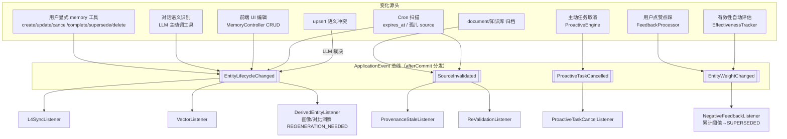
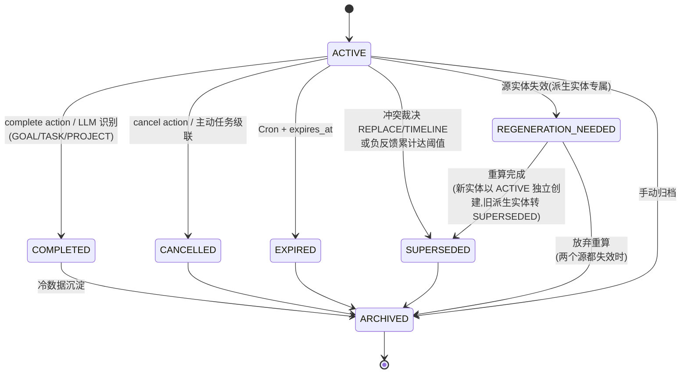

# 记忆生命周期闭环设计

- **日期**：2026-04-23
- **作者**：zsg（设计协同：微微）
- **范围**：知微 L3 语义记忆 + L4 程序性记忆的失效传播机制，覆盖全部 14 条写入/影响源
- **分支**：`feature/memory-lifecycle-closure`

---

## 1. 背景

用户反馈："取消定时任务、删除开发任务后，知微依然每天提醒我。"上次通过在 `MemoryToolProvider` 新增 `cancel` action 修掉了这一具体 bug（commit 55701063），但这是**点状修复**。四轮深度代码扫描发现整个记忆系统存在结构性缺陷：

- **写入链路极其丰富**：L3/L4 有 **14 条写入/影响源**（见 §1.1），不只对话提取一条
- **失效链路极度残缺**：14 条写入源中只有 3 条有反向级联，11 条断链
- **反馈回路已存在但未闭环**：点赞点踩、提醒评价、自动有效性评估**已经在改 `importanceScore`**，但**不触发 lifecycle 状态转换**——低分实体排序靠后但仍被召回
- **前端编辑链路未入总线**：用户在 UI 直接改/删记忆，大部分走 `SemanticMemory`，但**不发事件**，后续的 L4 同步、向量清理全部漏掉

用户感知是"AI 记忆力差"，根因是**反向失效机制缺失 + 反馈信号未转化为 lifecycle 信号 + 前端修改未入事件总线**。本 spec 目标：一次性把失效路径系统化，事件驱动 + 状态机贯穿 14 条写入源，避免未来每多一个症状修一次。

**本次工作本质是数据治理**，source of truth 是数据流拓扑而非代码规范。因此：
- 本 spec（`docs/superpowers/specs/`）只承担"为什么这么做"的设计说明，**一次性归档**
- 同时产出 `docs/architecture/memory-data-flow.md` 作为**长期数据流参照物**：现状图 + 目标图 + 14 写入源详表 + 对账校验清单，后续任何记忆模块的改动必须先更新此文档
- 实施完成后派审计 Agent 做"图 vs 代码"对账，验收门槛：14 场景测试通过 + 图代码零 diff

### 1.1 14 条写入/影响源一览

**直接写 L3（`SemanticMemory` 层）**：

| # | 源 | 产物类型 | 触发 |
|---|---|---|---|
| 1 | `RealtimeExtractor` | 各类实体 | 对话结束 Virtual Thread |
| 2 | `ExperienceSummarizer` | L3:EXPERIENCE（任务级） | 对话结束 + 质量评估通过 |
| 3 | `SubtaskReflector` | L3:EXPERIENCE（工具级） | 工具序列结束 |
| 4 | `ContrastiveLearner` | L3:CONTRASTIVE_INSIGHT | Summarizer 完成后 |
| 5 | `UserProfileConsolidator` | L3:__consolidated_profile（**派生**） | Cron ≥2h |
| 6 | `ProactiveMemoryBridge.syncInsightToL3` | L3:PREFERENCE | 主动引擎行为反馈 |

**直接写 L4**：

| # | 源 | 产物 | 触发 |
|---|---|---|---|
| 7 | `PreferenceConsolidator` | `preference_rules` | ConsolidationPipeline Cron |
| 8 | `ProceduralMemory.save` | `procedure_templates` | 巩固管线 |
| 9 | `ProactiveMemoryBridge.observePreference` | `preference_rules`（EWMA 增量） | 主动引擎信号 |

**修改现存实体**：

| # | 源 | 动作 | 触发 |
|---|---|---|---|
| 10 | `ForgettingEngine` | 衰减 / 归档 | Cron |
| 11 | `EntityDeduplicator` | 合并，产出 MERGED 实体（**派生**） | ConsolidationPipeline |
| 12 | `FeedbackProcessor` | 改 `importanceScore`（经 `InjectionRecordRepository` 溯源） | 用户点赞/点踩 |
| 13 | `TrustUpgradeService` | 改 L4 信任度 | 主动提醒反馈 |
| 14 | `EffectivenessTracker` | 改 `importanceScore` | 对话完成自动评估 |

**用户直接编辑**：`MemoryController` CRUD (`POST/PUT/DELETE /api/memories/entities/*`、`PUT /api/memories/profile`)——大部分走 `SemanticMemory`，但**全部不发事件**。存在两处绕过：`updateDescription()` 绕过 VersionMerger、`FeedbackProcessor` 直接 SQL 改 importance。两处都在 §4.11 修补。

**环境感知链**（非目标，见 §2.2）：`FocusMonitor`（30s 轮询前台窗口/空闲）/ `ClipboardMonitor`（3s 轮询剪贴板意图）→ raw events → `ClipboardBehavior` → `queued_actions` → 可能沉淀 L3 PREFERENCE。raw 数据生命周期按时序日志治理。

---

## 2. 目标与非目标

### 2.1 目标（本次交付）

覆盖 14 类用户可感症状：

| # | 症状 | 主要机制 |
|---|---|---|
| S1 | 提醒早取消的事 | `cancel` action 扩覆盖 + L4 反向同步 |
| S3 | 做完的任务当进行时 | `complete` action + COMPLETED 状态 |
| S4 | 冲突记忆并存 | LLM 语义裁决 + SUPERSEDED |
| S5 | 临时情绪变永久偏好 | `temporality` 分层 + TTL |
| S6 | L3 归档后 L4 规则仍生效 | `L4SyncListener` |
| S7 | 孤儿引用（文档/会话删除） | `SourceInvalidated` + Provenance STALE |
| **S9** | 垃圾对话产生垃圾 EXPERIENCE | `EntityWeightChanged` 支持"质量否定"子类型 → SUPERSEDED |
| **S10** | 主动任务取消 ≠ 记忆清理 | `ProactiveTaskCancelled` + `ProactiveTaskCancelListener` |
| **S11** | 对比洞察依赖链断裂 | 源 EXPERIENCE 失效时 `DerivedEntityListener` 把 INSIGHT 打 REGENERATION_NEEDED |
| **S12** | 派生画像基于过时源做决策 | REGENERATION_NEEDED + 画像重算 Cron |
| **S13** | 持续点踩仍被召回 | `EntityWeightChanged` 累计达阈值 → `NegativeFeedbackListener` → SUPERSEDED |
| **S14** | 提醒反馈不溯源到 L3 insight | 反馈溯源扩到 `proactive_insight_*` 实体 |
| **S15** | 前端 UI 编辑不触发闭环 | `SemanticMemory` 统一发事件，自动覆盖 MemoryController |
| **S16** | `updateDescription` 绕过版本化 | step 0 架构修补 A |

### 2.2 非目标（本次不处理）

- **S2 删对话 → 删记忆**：对话是原始事件流，删除是否意味着记忆作废需单独决策
- **S8 长期沉睡记忆衰减**：`ForgettingEngine` 已有时间衰减，本期只让它订阅事件、不改衰减算法
- **传感器 raw 事件治理**：`FocusMonitor` / `ClipboardMonitor` 原始事件按时序日志治理，单独话题；但传感器**沉淀出的 L3 HABIT/PREFERENCE** 纳入本 spec（通过 §4.1 状态机）
- **记忆管理 UI 扩展**：S15/S16 只补事件发布和绕过修补，不做新面板/按钮
- **L1/L2 副本同步**：对话消息编辑不同步到 transcript/snapshot
- **MCP / 工作流 / 冷启动种子 → 记忆** 的链路：目前代码证据不足，不强行纳入
- **重构现有写入链**：只扩展，不改写瀑布流

---

## 3. 架构总览

### 3.1 核心思路

把"记忆有效性"升级为一等公民：

1. **实体生命周期状态机**：`memory_entities` 从二态（ACTIVE/ARCHIVED）扩到**七态**，语义区分退出/重算原因
2. **内部事件总线**：Spring `ApplicationEvent`，事务内发送、`afterCommit` 分发，不引入 Kafka/MQ
3. **4 个核心事件 + 7 个监听器**：覆盖 14 条写入源，统一事件契约
4. **事件挂载点集中在 `SemanticMemory`**：所有写入/归档/权重变更都经由这一层发事件，自动覆盖 RealtimeExtractor / Summarizer / Reflector / Learner / ProactiveBridge / FeedbackProcessor / EffectivenessTracker / MemoryController CRUD
5. **提取时 Temporality 分层**：EPHEMERAL/SHORT_TERM/PERSISTENT，TTL 过期走 Cron
6. **冲突语义裁决**：upsert 命中相似候选 → LLM 判定 REPLACE/COEXIST/TIMELINE
7. **反馈信号入总线**：点赞点踩/有效性评估发 `EntityWeightChanged`，累计阈值触发 SUPERSEDED
8. **派生实体独立语义**：画像、对比洞察、MERGED 实体在源变化时打 `REGENERATION_NEEDED`，Cron 重算而非立即失效

### 3.2 数据流（目标态）



---

## 4. 详细设计

### 4.1 实体生命周期状态机（解 S1 / S3 / S6 / S11 / S12）

**状态定义（7 态）**：

| 状态 | 语义 | 可召回 |
|---|---|---|
| `ACTIVE` | 当前生效 | ✅ 默认 |
| `COMPLETED` | 已完成（GOAL / TASK / PROJECT 专属） | ✅ 召回时标"已完成"，不作为待办 |
| `CANCELLED` | 用户明确取消 / 主动任务级联取消 | ❌ |
| `EXPIRED` | TTL 到期（EPHEMERAL / SHORT_TERM） | ❌ |
| `SUPERSEDED` | 被新版本语义替代 / 持续负反馈淘汰 | ❌（历史可查） |
| `REGENERATION_NEEDED` | 派生实体的源已变化，等待重算 | ⚠️ 召回带"数据陈旧"标，优先级降 |
| `ARCHIVED` | 手动归档 / 冷数据沉淀 | ❌ |

**状态转换**：

- `ACTIVE → COMPLETED`：工具 action `complete` 或 LLM 语义识别（仅 GOAL/TASK/PROJECT）
- `ACTIVE → CANCELLED`：工具 action `cancel`（扩到所有类型）/ `ProactiveTaskCancelListener` 级联
- `ACTIVE → EXPIRED`：Cron 扫 `expires_at < now`
- `ACTIVE → SUPERSEDED`：upsert 冲突裁决 REPLACE/TIMELINE / `NegativeFeedbackListener` 阈值
- `ACTIVE → REGENERATION_NEEDED`：`DerivedEntityListener` 收到源实体失效（派生实体专属）
- `REGENERATION_NEEDED → ACTIVE`：Cron 重算产出新版后，新实体 ACTIVE，旧实体 SUPERSEDED
- `{ACTIVE, COMPLETED, REGENERATION_NEEDED} → ARCHIVED`：手动或冷数据策略
- 非 `ACTIVE`/`REGENERATION_NEEDED` 终态不可逆（重新激活靠新建实体）

**Schema 变更**（V15 迁移）：

```sql
-- 1. memory_entities 生命周期字段
ALTER TABLE memory_entities ADD COLUMN lifecycle_state TEXT NOT NULL DEFAULT 'ACTIVE';
ALTER TABLE memory_entities ADD COLUMN lifecycle_reason TEXT;
ALTER TABLE memory_entities ADD COLUMN expires_at TEXT;
ALTER TABLE memory_entities ADD COLUMN temporality TEXT NOT NULL DEFAULT 'PERSISTENT';
ALTER TABLE memory_entities ADD COLUMN succeeded_by TEXT;                -- TIMELINE 指向新实体
ALTER TABLE memory_entities ADD COLUMN is_derived INTEGER NOT NULL DEFAULT 0;  -- 派生实体标记
ALTER TABLE memory_entities ADD COLUMN derivation_sources TEXT;           -- JSON: 源实体 id 列表
CREATE INDEX idx_memory_entities_lifecycle ON memory_entities(lifecycle_state, expires_at);
CREATE INDEX idx_memory_entities_derived ON memory_entities(is_derived, lifecycle_state);

-- 2. provenance 失效标记
ALTER TABLE memory_entity_provenances ADD COLUMN status TEXT NOT NULL DEFAULT 'VALID';
ALTER TABLE memory_entity_provenances ADD COLUMN invalidated_at TEXT;

-- 3. L4 反向连接
ALTER TABLE preference_rules ADD COLUMN source_entity_id TEXT;
ALTER TABLE preference_rules ADD COLUMN deactivated_reason TEXT;
ALTER TABLE procedure_templates ADD COLUMN source_entity_id TEXT;
ALTER TABLE procedure_templates ADD COLUMN deactivated_reason TEXT;

-- 4. 反馈累计（用于 NegativeFeedbackListener 阈值判定）
CREATE TABLE memory_feedback_ledger (
    id TEXT PRIMARY KEY,
    entity_id TEXT NOT NULL,
    source TEXT NOT NULL,               -- USER_FEEDBACK / EFFECTIVENESS_TRACKER
    delta REAL NOT NULL,                -- 有正有负
    cumulative_score REAL NOT NULL,     -- 累计后得分，写入时计算
    created_at TEXT NOT NULL
);
CREATE INDEX idx_feedback_ledger_entity ON memory_feedback_ledger(entity_id, created_at);

-- 5. 异步队列
CREATE TABLE memory_revalidation_queue (
    id TEXT PRIMARY KEY,
    entity_id TEXT NOT NULL,
    source_type TEXT NOT NULL,
    source_id TEXT NOT NULL,
    created_at TEXT NOT NULL,
    status TEXT NOT NULL DEFAULT 'PENDING'
);
CREATE INDEX idx_revalidation_pending ON memory_revalidation_queue(status, created_at);

CREATE TABLE conflict_resolution_queue (
    id TEXT PRIMARY KEY,
    new_entity_id TEXT NOT NULL,
    candidate_entity_ids TEXT NOT NULL,
    status TEXT NOT NULL DEFAULT 'PENDING',
    verdict TEXT,
    rationale TEXT,
    attempt_count INTEGER NOT NULL DEFAULT 0,
    created_at TEXT NOT NULL,
    resolved_at TEXT
);
CREATE INDEX idx_conflict_queue_status ON conflict_resolution_queue(status, created_at);

-- 6. 派生实体重算队列
CREATE TABLE derivation_regeneration_queue (
    id TEXT PRIMARY KEY,
    derived_entity_id TEXT NOT NULL,
    trigger_source_entity_id TEXT NOT NULL,
    status TEXT NOT NULL DEFAULT 'PENDING',  -- PENDING / PROCESSING / DONE / FAILED
    created_at TEXT NOT NULL,
    processed_at TEXT
);
CREATE INDEX idx_regeneration_pending ON derivation_regeneration_queue(status, created_at);
```

**兼容性**：
- 旧 `memory_entities.status=ARCHIVED` → 迁移同步写 `lifecycle_state=ARCHIVED`；其余映射 ACTIVE
- 原 `status` 字段保留但代码不再读写
- 旧 `UserProfileConsolidator` / `EntityDeduplicator` 产出的实体在迁移脚本里回填 `is_derived=1`
- 旧 L4 表若无 `source_entity_id`，`L4SyncListener` 对无归属记录降级 no-op

---

### 4.2 事件契约

**4 个 Spring ApplicationEvent（record）**：

```java
// ① 最核心：实体生命周期变化
public record EntityLifecycleChanged(
    String entityId,
    String entityType,
    LifecycleState oldState,
    LifecycleState newState,
    String reason,
    ChangeSource source          // TOOL_EXPLICIT / LLM_SEMANTIC / CRON_EXPIRE / CONFLICT_RESOLVE
                                 // / NEGATIVE_FEEDBACK / PROACTIVE_CANCEL / UI_EDIT / DERIVATION_TRIGGER
) {}

// ② 源头对象失效（document/knowledge base/session）
public record SourceInvalidated(
    SourceType sourceType,        // DOCUMENT / KNOWLEDGE_BASE / SESSION（预留）
    String sourceId,
    InvalidationKind kind         // DELETED / ARCHIVED / CONTENT_CHANGED
) {}

// ③ 实体权重变化（反馈 / 有效性评估 / 质量否定）
public record EntityWeightChanged(
    String entityId,
    double delta,
    double cumulativeScore,
    WeightSource source           // USER_FEEDBACK / EFFECTIVENESS / QUALITY_REJECT
) {}

// ④ 主动任务取消（ProactiveEngine）
public record ProactiveTaskCancelled(
    String taskId,
    List<String> relatedInsightEntityIds   // ProactiveMemoryBridge 写入的 insight 实体 id
) {}
```

**发布时机与挂载点**：

- **统一挂载在 `SemanticMemory`**：`upsertWithConflictDetection` / `archive` / `updateImportanceScore` / `updateDescription`（§4.11 修补后）四个入口发 `EntityLifecycleChanged` 或 `EntityWeightChanged`
- **`FeedbackProcessor`**：处理完反馈后经由 `SemanticMemory.updateImportanceScore` 发 `EntityWeightChanged`（不再自己直连 SQL，见 §4.11 修补 B）
- **`ProactiveEngine.markGoalFulfilled`**：发 `ProactiveTaskCancelled`
- 所有事件标注 `@TransactionalEventListener(phase = AFTER_COMMIT)`
- 向量清理等外部副作用沿用 `TransactionSynchronization.afterCommit` 兜底

**幂等性要求**：每个监听器必须幂等，为 Cron 补偿留口子。

---

### 4.3 七个监听器

| # | 监听器 | 订阅事件 | 职责 |
|---|---|---|---|
| 1 | `L4SyncListener` | `EntityLifecycleChanged` | newState ∈ {CANCELLED, EXPIRED, SUPERSEDED, ARCHIVED, REGENERATION_NEEDED}：将对应 `preference_rules` / `procedure_templates` 的 `is_active=false`，写 `deactivated_reason` |
| 2 | `VectorListener` | `EntityLifecycleChanged` | newState ∉ {ACTIVE, COMPLETED}：删除 `entity_embeddings`；COMPLETED 保留向量（还能召回"已完成"） |
| 3 | `DerivedEntityListener` | `EntityLifecycleChanged` | 源 EXPERIENCE/PREFERENCE 变为 SUPERSEDED/CANCELLED/EXPIRED 时，通过 `derivation_sources` 反查所有派生实体（CONTRASTIVE_INSIGHT / `__consolidated_profile` / MERGED），将其打 `REGENERATION_NEEDED` 并写 `derivation_regeneration_queue` |
| 4 | `ProvenanceStaleListener` | `SourceInvalidated` | `UPDATE memory_entity_provenances SET status='STALE' WHERE source_{type}_id = ?`，不删实体 |
| 5 | `ReValidationListener` | `SourceInvalidated` | 写 `memory_revalidation_queue`，检索层命中 STALE provenance 时带提示，LLM 主动询问"这条还作数吗" |
| 6 | `NegativeFeedbackListener` | `EntityWeightChanged` | 写 `memory_feedback_ledger`（累计）；若累计负分达阈值（默认连续 3 次点踩 或 `cumulativeScore < -1.0`）→ 发 `EntityLifecycleChanged(*, SUPERSEDED, reason=NEGATIVE_FEEDBACK_THRESHOLD)` |
| 7 | `ProactiveTaskCancelListener` | `ProactiveTaskCancelled` | 对 `relatedInsightEntityIds` 每个实体发 `EntityLifecycleChanged(*, CANCELLED, source=PROACTIVE_CANCEL)` |

**L4→L3 反向连接前置**：V15 在 `preference_rules` / `procedure_templates` 补 `source_entity_id`，L4SyncListener 才能工作。旧数据无该字段的降级为 no-op。

---

### 4.4 提取时 Temporality 标签（解 S5）

**产物扩展**：`RealtimeExtractor` 输出每条实体多带两字段：

- `temporality`：`EPHEMERAL`（1 周 TTL）/ `SHORT_TERM`（1 月 TTL）/ `PERSISTENT`（不过期）
- `expires_at`：LLM 能从上下文推断（"下周三之前"）则给绝对时间；否则由 temporality 计算默认

**Prompt 升级**（`prompts/memory-extract.st`）：加分类指引，短期吐槽（"最近不想碰 X"）必须标 `EPHEMERAL`。只约束分类判断，不输出话术。

**硬控制兜底**：
- schema `temporality` NOT NULL DEFAULT 'PERSISTENT'
- `ExpirationScanner` Cron 每小时扫 `expires_at < now AND lifecycle_state='ACTIVE'`
- 无 `expires_at` 的 PERSISTENT 永不过期

---

### 4.5 语义冲突裁决（解 S4）

触发点：`SemanticMemory.upsertWithConflictDetection`（`SemanticMemory.java:94-150`）。

**升级逻辑**：向量相似度 >= 阈值（建议 0.85）命中候选 → 提交 LLM 裁决：

```
输入：新实体（type/name/content/value）+ 候选旧实体们
输出：{ verdict: REPLACE | COEXIST | TIMELINE, target_id?: string, rationale: string }
```

- `REPLACE`：旧实体 SUPERSEDED，发 `EntityLifecycleChanged`
- `COEXIST`：都保留 ACTIVE
- `TIMELINE`：旧 SUPERSEDED，`succeeded_by` 指向新实体

**成本控制**：相似度 >= 阈值才触发；裁决异步（Virtual Thread），失败入 `conflict_resolution_queue`，`ConflictResolutionRetry` Cron 重试。

---

### 4.6 memory 工具 action 扩展

| Action | 语义 | 实体范围 |
|---|---|---|
| `create` | 新建 | 所有 |
| `update` | 修改字段 | 所有 |
| `delete` | 归档 | 所有 |
| `cancel` | **扩到所有类型**（原仅 GOAL/EXP/HABIT） | 所有 |
| `complete` | **新增** | GOAL / TASK / PROJECT |
| `supersede` | **新增** LLM 主动声明新版替代 | 所有 |

Schema 硬约束：`complete` 仅对特定 type 开放（工具层校验，不靠 prompt 提醒）。

---

### 4.7 Cron 作业

| 作业 | 频率 | 职责 |
|---|---|---|
| `ExpirationScanner` | 每小时 | `expires_at < now AND lifecycle_state='ACTIVE'` → 发 `EntityLifecycleChanged(*, EXPIRED)` |
| `OrphanProvenanceScanner` | 每日 | 扫 `source_document_id` 对应 document 不存在的 → 发 `SourceInvalidated` |
| `ConflictResolutionRetry` | 每日 | 重试 `conflict_resolution_queue` 失败任务 |
| `DerivationRegenerator` | 每 2 小时 | 消费 `derivation_regeneration_queue`，针对 `__consolidated_profile` / CONTRASTIVE_INSIGHT 重算，产出新实体 ACTIVE + 旧实体 SUPERSEDED |

实现位置：沿用 `ConsolidationPipeline.@Scheduled` 范式。

---

### 4.8 检索层协作

`MemoryRetriever` 在以下几处修改：

1. **默认过滤**：`WHERE lifecycle_state NOT IN ('EXPIRED','SUPERSEDED','ARCHIVED','CANCELLED')`
2. **COMPLETED 召回**：结果附 `isHistorical=true`
3. **REGENERATION_NEEDED 召回**：结果附 `isStale=true`，可召回但降权
4. **STALE provenance**：附 `needsRevalidation=true`，LLM 引用时带"根据之前的对话（出处可能已变更），…"软确认
5. **向量库兜底**：`findByIds + is_current=1 + lifecycle_state IN (...)` 过滤，防向量清理失败残留

---

### 4.9 反馈信号与 lifecycle（解 S13 / S14）

**现状（扫描结论）**：
- `FeedbackProcessor` 走 `InjectionRecordRepository` 反查对话注入实体 → 调 `updateImportanceScore` 修改分值，但**不发事件、不改状态**
- `TrustUpgradeService` 改 L4 信任度、写 `proactive_reminder_topic_preferences` 主题禁用
- `EffectivenessTracker` 对话完成后自动评估同样只改 `importanceScore`
- 结果：低分实体仍 ACTIVE，排序靠后但被召回

**改造**：

1. `FeedbackProcessor.updateImportanceScore` / `EffectivenessTracker.adjust` 的调用改经 `SemanticMemory.updateImportanceScore`（§4.11 修补 B），后者发 `EntityWeightChanged`
2. `NegativeFeedbackListener` 累计到 `memory_feedback_ledger`
3. 阈值达成 → 发 `EntityLifecycleChanged(*, SUPERSEDED, reason='NEGATIVE_FEEDBACK_THRESHOLD')`
4. **S14 提醒反馈溯源**：`TrustUpgradeService` 在负面反馈时，根据提醒所依据的 `proactive_insight_entity_id`（`ProactiveReminderRepository` 记录），发 `EntityWeightChanged(source=USER_FEEDBACK, delta=负值)` 给该 insight。insight 累计负反馈后同样走 SUPERSEDED

**默认阈值**（配置在 `application.yml`）：
- `memory.feedback.negative-threshold-count = 3`（连续 3 次点踩）
- `memory.feedback.negative-threshold-score = -1.0`（累计负分）
- 达成任一即触发

---

### 4.10 派生实体 REGENERATION_NEEDED（解 S11 / S12）

**派生实体**：`is_derived=1`，在 `derivation_sources` JSON 记录源实体 id 集合。当前产出派生实体的路径：
- `UserProfileConsolidator` → `__consolidated_profile`（聚合大量 L3 源）
- `ContrastiveLearner` → CONTRASTIVE_INSIGHT（基于 2 条 EXPERIENCE）
- `EntityDeduplicator` → MERGED 实体（合并 N 条原实体）

**失效语义**：与 SUPERSEDED 区别——**派生实体不是被替代，是等待重算**。源失效后：

1. `DerivedEntityListener` 收到源实体 `EntityLifecycleChanged` → 反查 `derivation_sources` → 对应派生实体打 `REGENERATION_NEEDED`，写 `derivation_regeneration_queue`
2. 检索层对 REGENERATION_NEEDED 仍可召回但带 `isStale=true`（避免召回空白）
3. `DerivationRegenerator` Cron（每 2h）消费队列：
   - 画像：调 `UserProfileConsolidator.consolidate` 重算
   - 对比洞察：若两个源任一仍 ACTIVE，调 `ContrastiveLearner.learn` 重算；两个都失效则直接 SUPERSEDED 不重算
   - MERGED 实体：调 `EntityDeduplicator` 重算合并范围
4. 重算产出新实体 ACTIVE，旧派生实体 SUPERSEDED

**阈值优化**：画像类允许"源失效 20% 以内不触发重算"（避免每次单条偏好变化都重算整个画像），阈值可配置。

---

### 4.11 step 0 架构修补（解 S15 / S16）

本 spec 事件总线方案要求所有 L3/L4 写入经过 `SemanticMemory`，以下三处绕过或未发事件，必须作为 step 0 修掉：

**修补 A — `updateDescription()` 绕过版本化**（解 S16）
- 现状：`SemanticMemory.updateDescription()` (L369) 直接 SQL 改，不经 VersionMerger、不产新版本
- 改造：改走 `upsertWithConflictDetection`，走版本合并 + 发事件
- 影响：`MemoryController.PUT /profile` 和测试依赖的几处调用

**修补 B — `FeedbackProcessor` 直接 SQL**
- 现状：`FeedbackProcessor.processFeedbackForEntry` → `SemanticMemory.updateImportanceScore` (L356) 直接 UPDATE，不发事件
- 改造：`SemanticMemory.updateImportanceScore` 在原有 UPDATE 后 publishEvent `EntityWeightChanged`
- 影响：`EffectivenessTracker` 共用这个方法，自动受益；无需改 EffectivenessTracker 本身

**修补 C — `MemoryController` CRUD 事件覆盖**（解 S15）
- 现状：POST/PUT/DELETE/PUT-profile 都走 `SemanticMemory`，但后者不发事件，UI 编辑不触发闭环
- 改造：与修补 B 同源——`SemanticMemory.upsertWithConflictDetection` / `archive` 在成功后 publishEvent `EntityLifecycleChanged`（source=UI_EDIT 或 TOOL_EXPLICIT 按调用方区分）
- 影响：覆盖所有入口（工具、前端、自动提取），一处改动全链路生效

**ProactiveEngine 级联接入**（S10 前置）
- `ProactiveEngine.markGoalFulfilled` 追加 publishEvent `ProactiveTaskCancelled`，payload 里 `relatedInsightEntityIds` 从 `ProactiveMemoryBridge` 记录查询

---

## 5. 症状回归映射

| 症状 | 机制覆盖 | 验证入口 |
|---|---|---|
| S1 提醒已取消 | `cancel` 扩覆盖 + `L4SyncListener` | E2E：S1 场景测试 |
| S3 任务已完成仍提醒 | `complete` action + COMPLETED 状态 | E2E：S3 场景测试 |
| S4 冲突并存 | LLM 裁决 + SUPERSEDED | E2E：S4 场景测试 |
| S5 临时变永久 | temporality + Cron EXPIRED | E2E：S5 场景测试 |
| S6 L3 归档 L4 仍生效 | `L4SyncListener` | E2E：S6 场景测试 |
| S7 孤儿引用（document） | `SourceInvalidated` + `OrphanScanner` | E2E：S7 场景测试 |
| S9 垃圾 EXPERIENCE | `EntityWeightChanged(source=QUALITY_REJECT)` + `NegativeFeedbackListener` | 集成：写一条失败 EXPERIENCE，发 3 次 QUALITY_REJECT → SUPERSEDED |
| S10 主动任务取消不清理 | `ProactiveTaskCancelListener` | 集成：`markGoalFulfilled` → insight CANCELLED |
| S11 对比洞察依赖链 | `DerivedEntityListener` | 集成：源 EXPERIENCE SUPERSEDED → 洞察 REGENERATION_NEEDED |
| S12 派生画像过时 | REGENERATION_NEEDED + `DerivationRegenerator` | 集成：源实体批量 SUPERSEDED 达 20% → 画像重算 |
| S13 持续点踩仍召回 | `EntityWeightChanged` 累计 + 阈值 | E2E：S13 场景测试 |
| S14 提醒反馈不溯源 | `TrustUpgradeService` 发 `EntityWeightChanged` 给 insight | 集成：3 次无用反馈 → insight SUPERSEDED |
| S15 UI 编辑不触发闭环 | `SemanticMemory` 统一发事件 | E2E：S15 场景测试 |
| S16 updateDescription 绕过 | step 0 修补 A | 单元：调 updateDescription → 产生新版本 + 发事件 |

---

## 6. 实施顺序（供 plan 拆分）

0. **测试基础设施前置 + 架构修补**（基础 PR）：
   - 抽出 `ReactAgentLoop.run(Session, UserMessage)` 可直接调用入口（若现有只有 HTTP/SSE 入口，抽纯函数层）
   - 新增 `MemoryQueryApi`（测试专用只读）
   - 测试替身：`FixtureBackedGenerationRouter` / `MutableClock` / `ManualTaskScheduler`
   - 抽 `场景测试基类` + Fixture 加载器（见 §7）
   - **修补 A**：`SemanticMemory.updateDescription()` → 走 `upsertWithConflictDetection`
   - **修补 B**：`SemanticMemory.updateImportanceScore` 调用后 publishEvent `EntityWeightChanged`
   - **修补 C**：`SemanticMemory.upsertWithConflictDetection` / `archive` publishEvent `EntityLifecycleChanged`
   - **ProactiveEngine 接入**：`markGoalFulfilled` publishEvent `ProactiveTaskCancelled`

0.5. **产出数据流长期文档**（与 step 0 同 PR 或紧随其后）：
   - 新建 `docs/architecture/memory-data-flow.md`（**模块级长期文档，不放 specs 目录**）
   - 必含内容：
     - **现状图**：14 写入源 + 现有 3 条级联 + 11 个断点（对照组，让人看清改前痛点）
     - **目标图**：事件总线（4 事件）+ 7 监听器 + 状态机交互
     - **14 写入源详表**：每条附实际 `file:line` 代码锚点
     - **事件契约 & 监听器矩阵**：事件 × 监听器订阅关系
     - **7 态状态机图**
     - **对账校验清单**（约 30 条，形如"RealtimeExtractor 写入后发 `EntityLifecycleChanged(source=LLM_SEMANTIC)`"、"`DerivedEntityListener` 只处理 `is_derived=1` 的目标"……每条可机械对照代码验证）
   - 作用：
     - 实施期间的**北极星**，每步实施完对照一次
     - step 12 对账的 **source of truth**
   - 后续原则：任何对记忆模块的改动必须**先更新此文档再改代码**

1. **V15 迁移 + Repository 层**：新字段读写，兼容旧数据
2. **事件定义 + 发布点改造**（承接 step 0 的发布点，补上 reason/source 字段语义）
3. **七个 Listener**：按 §4.3 实现，每个独立可测
4. **memory 工具 action 扩展**：`complete` + `supersede` + `cancel` 扩覆盖
5. **RealtimeExtractor + prompt 升级**：temporality 字段
6. **LLM 冲突裁决**：`ConflictResolutionService` + 异步队列
7. **反馈 → lifecycle**：`NegativeFeedbackListener` + `memory_feedback_ledger` + 阈值配置
8. **派生实体重算**：`DerivedEntityListener` + `DerivationRegenerator` Cron
9. **Cron 作业**：`ExpirationScanner` / `OrphanProvenanceScanner` / `ConflictResolutionRetry`
10. **检索层过滤**：状态过滤 + STALE 标注 + REGENERATION_NEEDED 降权
11. **E2E 回归**：14 个症状场景全部通过

12. **图 vs 代码对账**（最终验收）：
   - 派审计 Agent 读 `docs/architecture/memory-data-flow.md` + 扫代码
   - 产出两栏 diff：
     - **图上有 / 代码无**（功能漏实现）
     - **代码有 / 图上无**（暗箱实现 / 文档漂移）
   - 任何不一致必须解决：要么改代码贴合图，要么改图并在 commit 中明确说明原因
   - **验收门槛**：对账零 diff + 14 场景测试全绿

每步独立可测、可回滚。建议 step 0 + 0.5 + 1 合并基础 PR，其余一步一 PR。

---

## 7. 测试策略

### 7.1 核心原则

1. **以用户可感知结果断言，不断言 LLM 内部路径**
   不写"LLM 应该调 `memory.cancel`"，写"该 GOAL 的 `lifecycle_state = CANCELLED`"。LLM 走错路径测试自然 FAIL——这就是暴露提取/决策缺陷的信号。

2. **真实性从集成层开始**
   场景 E2E 必须走真实 `ApplicationEventPublisher` + 真实 SQLite + 真实 `ReactAgentLoop` + 真实工具。禁止 mock 事件总线、监听器、数据库。**唯一替身是 LLM 本身**。

### 7.2 测试分层

| 层级 | 范围 | 真实性 | 执行时机 |
|---|---|---|---|
| 单元 | Listener 逻辑 / 状态机转换 / 冲突裁决策略 / 反馈阈值判定 | 单点 mock | 每次 `mvn test` |
| 属性（jqwik） | 状态机不变量 / 检索过滤不变量 / 幂等性 | 随机输入 | 每次 `mvn test` |
| 集成 | 事件 × 事务行为 / Listener → 真 DB 副作用 | 真 Spring + 真 SQLite | 每次 `mvn test` |
| **场景 E2E** | 14 症状的完整故事线 | 真 ReactAgentLoop + 真 SQLite + LLM fixture | 每次 `mvn test` |
| 真实 LLM 冒烟 | 同上 + 自由对话探索 | 全真 | `-Dsmoke.real-llm=true` / 发版前 |

### 7.3 基础设施（`ScenarioTestConfiguration`）

| 组件 | 测试期替换 | 理由 |
|---|---|---|
| `GenerationRouter` | `FixtureBackedGenerationRouter`：按对话上下文从 JSON 读响应 | 唯一不走真实的一环 |
| `EmbeddingRouter` | 真实（本地 Ollama）或固定向量 stub | 冲突阈值判断依赖，值不敏感 |
| `java.time.Clock` | `MutableClock`：支持 `advance(Duration)` | 控 TTL / 下周一 tick |
| `TaskScheduler` | `ManualTaskScheduler`：`triggerDueAt(Instant)` | S1 手动触发 |
| DB | `@TempDir` SQLite，Flyway 真跑 V1~V15 | 每 case 全新库 |
| `ReactAgentLoop` / `MemoryTool` / `Scheduler` 写入 / 事件总线 / 监听器 | **全部真实** | 闭环被测对象 |

### 7.4 测试基类

```java
@SpringBootTest
@ActiveProfiles("scenario-test")
@Import(ScenarioTestConfiguration.class)
abstract class 场景测试基类 {
    @Autowired ReactAgentLoop agentLoop;
    @Autowired MutableClock clock;
    @Autowired LlmFixture fixture;
    @Autowired ManualTaskScheduler scheduler;
    @Autowired MemoryQueryApi queryApi;
    @Autowired ExpirationScanner expirationScanner;
    @Autowired DerivationRegenerator regenerator;
    @Autowired FeedbackGateway feedbackGateway;    // 测试专用：直接提交反馈

    protected TurnResult 模拟用户说(String text) {
        return agentLoop.run(testSession, UserMessage.of(text));
    }
    protected void 时间推进(Duration d)                 { clock.advance(d); }
    protected List<Notification> 触发到期Scheduler()    { return scheduler.triggerDueAt(clock.instant()); }
    protected void 运行过期扫描Cron()                   { expirationScanner.scanNow(); }
    protected void 运行派生重算Cron()                   { regenerator.processQueueNow(); }
    protected void 提交点踩(String entryId)             { feedbackGateway.dislike(entryId); }
    protected void 提交提醒无用(String notificationId)  { feedbackGateway.notHelpful(notificationId); }
    protected MemoryEntity 查实体(String id)            { return queryApi.findById(id); }
}
```

### 7.5 Fixture 格式

`src/test/resources/llm-fixtures/{scenario}.json`：

```json
[
  { "when": { "last_user_contains": "每周一早上 10 点" },
    "respond": {
      "tool_calls": [
        { "tool": "memory.create",      "args": { "type": "GOAL", "name": "每周一汇报" } },
        { "tool": "scheduler.schedule", "args": { "cron": "0 10 * * 1" } }
      ],
      "final": "已安排。"
    } },
  { "when": { "last_user_contains": "别做了|取消" },
    "respond": {
      "tool_calls": [ { "tool": "memory.cancel", "args": { "entity_id": "$last_goal_id" } } ],
      "final": "已取消。"
    } }
]
```

- **匹配软**（contains / regex）—— prompt 轻微漂移不破坏测试
- **tool_calls 硬**（逐字段断言）—— LLM 行为实质变化直接 FAIL
- **`$变量`** —— 跨轮次引用上一轮产物 id，由 Fixture 加载器注入

### 7.6 场景脚本（14 条，抽 3 条详说）

每症状一个测试类，位于 `src/test/java/com/lifepilot/memory/scenarios/`，中文命名。

| ID | 对话/动作序列 | 核心断言 |
|---|---|---|
| S1 | "每周一 10 点汇报" → +3d → "别做了" → +4d → 触发 Scheduler | 实体 `CANCELLED` + procedure `is_active=false` + Scheduler 无通知 |
| S3 | "加任务：重构记忆" → "搞完了" → "还有哪些任务" | `COMPLETED` + 待办列表不含它 |
| S4 | "最爱 Python" → "现在更爱 Rust" → "我爱什么语言" | 老实体 `SUPERSEDED`、`succeeded_by` 指向新，召回只见 Rust |
| S5 | "最近忙不想碰代码" → +8d → 运行过期扫描 → "我想做什么" | `temporality=EPHEMERAL`，8d 后 `EXPIRED`，LLM 不引用 |
| S6 | "我是素食" → Cron L3→L4 → "我又吃肉了" | L3 老 `SUPERSEDED` + L4 `is_active=false` + `deactivated_reason` 写入 |
| S7 | 上传文档 → 提取偏好 → 删文档 → "我的工作习惯" | `provenance.status=STALE` + 召回 `needsRevalidation=true` |
| S9 | 失败工具链 → `SubtaskReflector` 产出 EXPERIENCE → 系统自动打 QUALITY_REJECT × 3 | EXPERIENCE `SUPERSEDED` + reason=`NEGATIVE_FEEDBACK_THRESHOLD` |
| S10 | 主动引擎产出 insight → 用户取消关联主动任务 | insight `CANCELLED` + L4 对应规则 inactive |
| S11 | 两条 EXPERIENCE + 对比洞察 → 其中一条 SUPERSEDED | 洞察 `REGENERATION_NEEDED`，`DerivationRegenerator` 运行后重算 |
| S12 | 批量 PREFERENCE 变更达 20% → 运行画像重算 | 旧画像 `SUPERSEDED`，新画像 `ACTIVE` |
| S13 | 对话提取一条偏好 → 用户点踩 3 次该条所在对话 | 偏好实体 `SUPERSEDED` + reason=`NEGATIVE_FEEDBACK_THRESHOLD` |
| S14 | 主动提醒推送 → 用户 3 次标"无用" | 相应 `proactive_insight_*` 实体 `SUPERSEDED` |
| S15 | 前端调 `PUT /api/memories/entities/{id}` 归档 → 检查 L4 | 对应 `preference_rules.is_active=false`（事件自动触发 L4SyncListener） |
| S16 | 单元：调 `updateDescription` 两次 | 产生两个版本（而非单一覆盖），且发 `EntityLifecycleChanged` |

### 7.7 S1 完整示例

```java
class 取消定时任务后不再提醒_场景测试 extends 场景测试基类 {
    @Test
    void 取消后下周一Scheduler不应产生提醒() {
        fixture.load("S1_取消定时任务");

        模拟用户说("每周一早上 10 点提醒我做汇报");
        var goalId = queryApi.findLatestGoalId();
        assertThat(查实体(goalId).lifecycleState()).isEqualTo(ACTIVE);

        时间推进(Duration.ofDays(3));
        模拟用户说("那个定时汇报别做了");
        assertThat(查实体(goalId).lifecycleState()).isEqualTo(CANCELLED);
        assertThat(queryApi.findProcedureBySourceEntity(goalId).isActive()).isFalse();

        时间推进(Duration.ofDays(4));
        var 提醒列表 = 触发到期Scheduler();
        assertThat(提醒列表).isEmpty();
    }
}
```

### 7.8 LLM 非确定性处理

- **默认 fixture**：如 §7.5
- **真实 LLM 模式**：`-Dsmoke.real-llm=true` 切真 LLM、temperature=0；跑完把实际响应写回 fixture 做 diff（看 prompt 漂移）
- **断言稳健化**：断结构化字段（entity_id / state / action_type），不断文本字面量

### 7.9 负面场景（必测）

- **LLM 调错工具**：fixture 故意写 `memory.update` 而非 `cancel` → 状态不到 CANCELLED → 测试 FAIL（信号不被吞掉）
- **Listener 抛异常**：主事务已提交不回滚，事件进补偿队列；下次 Cron 重试后一致
- **事件重放**：同一事件连续 publish 2 次，最终状态与 1 次相同（幂等）
- **派生实体源全失效**：两个源 EXPERIENCE 都 SUPERSEDED → 对比洞察直接 SUPERSEDED 不重算
- **反馈阈值边界**：点踩 2 次不触发，第 3 次触发 SUPERSEDED

### 7.10 回归

- 现有记忆相关测试必须全绿
- 若某测试因 `lifecycle_state` 默认 `ACTIVE` 兼容而误通过，补状态断言明确期望

---

## 8. 附图

### 图 4.1 实体生命周期状态机（7 态）



### 图 4.2 事件 × 监听器矩阵

| 事件 \ 监听器 | L4Sync | Vector | Derived | ProvStale | ReValid | NegFeedback | ProactiveCancel |
|---|---|---|---|---|---|---|---|
| `EntityLifecycleChanged` | ✅ | ✅ | ✅ | — | — | — | — |
| `SourceInvalidated` | — | — | — | ✅ | ✅ | — | — |
| `EntityWeightChanged` | — | — | — | — | — | ✅ | — |
| `ProactiveTaskCancelled` | — | — | — | — | — | — | ✅ |

---

## 9. 风险与权衡

| 风险 | 缓解 |
|---|---|
| 事件失败导致衍生层不一致 | 监听器幂等 + 三个 Cron 补偿（`ConflictRetry` / `OrphanScanner` / `DerivationRegenerator`） |
| SQLite 并发写入（WAL 单写入者） | 所有监听器走短事务 |
| LLM 裁决 token 成本 | 高相似度阈值（0.85）才触发 + 裁决异步去重 |
| 反馈阈值过松/过紧 | 默认 3 次点踩或累计 -1.0，配置化；真实数据跑一段后调整 |
| 派生重算雪崩 | 画像类"源失效 < 20% 不触发"；队列限流 |
| `lifecycle_state` 语义漂移 | enum + 状态机校验函数，禁止随意新增 |
| 现有缓存/检索未接状态过滤 | 检索层过滤作为统一 joinpoint；缓存失效挂事件监听器 |
| 旧数据回填错误 | V15 DEFAULT 保底；迁移脚本只做安全映射 |
| 前端改了 `updateDescription` 后旧 UI 行为变化 | 前端受影响处需回归测试（主要是 `PUT /profile` 画像编辑面板） |

---

## 10. 遗留决策 / 后续工作

- **S2 删对话 → 删记忆**：对话是原始事件流，删除是否意味着记忆作废需单独决策
- **S8 衰减机制验证**：`ForgettingEngine` 的衰减参数与真实数据匹配度需独立审计
- **传感器 raw 事件治理**：`FocusMonitor` / `ClipboardMonitor` 原始数据生命周期（TTL / 清理 / 压缩）独立话题
- **记忆管理 UI 扩展**：用户主动查看/标错面板、提供"这条记错了"按钮
- **L1 快照同步**：`chat_turn_memory_snapshots` 是即时快照，若未来出现"历史对话重放"重新评估
- **跨项目可复用**：事件 + 状态机方案可抽到 `lifepilot-common`，等第二个类似场景再提
- **MCP / 工作流 → 记忆**：目前代码无证据，有需要时新增独立 spec

---

## 11. 术语

- **Lifecycle**：实体生命周期，本 spec 核心概念（7 态）
- **Temporality**：记忆持久度分层（EPHEMERAL/SHORT_TERM/PERSISTENT）
- **Provenance**：记忆出处，引用原始 session/turn/document
- **Supersede**：新版本语义替代旧版本，旧版本 SUPERSEDED 保留历史
- **Derived Entity**：派生实体（画像 / 对比洞察 / MERGED），`is_derived=1`，源变化时 REGENERATION_NEEDED
- **Negative Feedback Threshold**：点踩累计达阈值触发 SUPERSEDED 的机制（默认 3 次或累计 -1.0）
