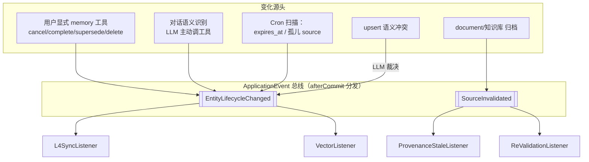
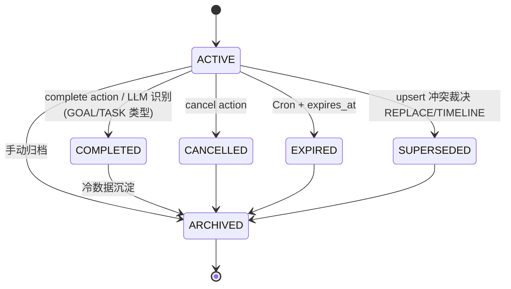

# 记忆生命周期闭环设计

- **日期**：2026-04-23
- **作者**：zsg（设计协同：微微）
- **范围**：知微 L3 语义记忆 + L4 程序性记忆的失效传播机制
- **分支**：`feature/memory-lifecycle-closure`

---

## 1. 背景

用户反馈："取消定时任务、删除开发任务后，知微依然每天提醒我。" 上次通过在 `MemoryToolProvider` 新增 `cancel` action 解决了这一具体 bug（commit 55701063），但这是**点状修复**。代码扫描发现整个记忆系统存在结构性缺陷：

- **写入链路完整**：对话 → L1 快照 / L2 转录 → L3 实体 → L4 规则，是单向瀑布，没问题。
- **失效链路残缺**：只有 3 条级联在工作（session FK CASCADE、`SemanticMemory.archive()` 清向量、`cancel` action 归档 GOAL/EXP/HABIT），**7 条关键路径缺失**，导致源头状态变化无法传播到衍生记忆。

用户感知是"AI 记忆力差"，根因是**反向失效机制缺失**。本 spec 目标是一次性把失效路径系统化，以事件驱动+状态机为核心，避免未来每多一个症状修一次。

---

## 2. 目标与非目标

### 2.1 目标（本次交付）

覆盖以下 6 类用户可感症状：

| # | 症状 | 触发机制 |
|---|---|---|
| S1 | 提醒早取消/早完成的事 | 用户显式/隐式状态变化 |
| S3 | 把做完的任务当进行时 | 同 S1 |
| S4 | 冲突记忆并存 | 新记忆写入时语义裁决 |
| S5 | 临时情绪变永久偏好 | 提取时持久度分层 |
| S6 | L3 归档后 L4 规则仍生效 | L3→L4 反向同步 |
| S7 | 孤儿引用（知识库删除后仍被引用） | 源失效事件 |

### 2.2 非目标（本次不处理）

- **S2 删除对话 → 删除记忆**：用户判断"是否应该删"存在争议，单独决策后再做。
- **S8 长期沉睡记忆衰减**：现有衰减字段存在但未验证，本 spec 不改动衰减逻辑。
- **L1/L2 副本同步**：对话消息编辑不同步到 transcript / snapshot，本 spec 不处理。
- **记忆管理 UI**：面板类功能不在本 spec 范围。
- **重构现有写入链**：只扩展，不改写瀑布流。

---

## 3. 架构总览

### 3.1 核心思路

把"记忆有效性"升级为一等公民：

1. **实体生命周期状态机**：`memory_entities` 从二态（ACTIVE/ARCHIVED）拆成六态，语义区分退出原因。
2. **内部事件总线**：Spring `ApplicationEvent`，事务内发送、`afterCommit` 分发。不引入 Kafka / MQ。
3. **两个核心事件 + 四个监听器**：所有失效路径归并到统一事件契约。
4. **提取时 Temporality 标签**：区分临时/短期/长期记忆，TTL 过期走 Cron。
5. **冲突语义裁决**：upsert 发现相似候选 → LLM 判定"替代 / 共存 / 时间演化"。

### 3.2 数据流（目标态）



---

## 4. 详细设计

### 4.1 实体生命周期状态机（解 S1 / S3 / S6）

**状态定义**：

| 状态 | 语义 | 可召回 |
|---|---|---|
| `ACTIVE` | 当前生效 | ✅ 默认 |
| `COMPLETED` | 已完成（GOAL / TASK 专属） | ✅ 召回时 LLM 标记"已完成"，不作为待办提醒 |
| `CANCELLED` | 用户明确取消 | ❌ |
| `EXPIRED` | TTL 到期（EPHEMERAL / SHORT_TERM） | ❌ |
| `SUPERSEDED` | 被新版本语义替代 | ❌（历史可查） |
| `ARCHIVED` | 手动归档 / 冷数据沉淀 | ❌ |

**状态转换**（见图 4，第 8 节 附图）：

- `ACTIVE → COMPLETED`：工具 action `complete` 或 LLM 语义识别（仅 GOAL/TASK 类型）
- `ACTIVE → CANCELLED`：工具 action `cancel`（扩到所有类型，不再限 GOAL/EXP/HABIT）
- `ACTIVE → EXPIRED`：Cron 扫 `expires_at < now`
- `ACTIVE → SUPERSEDED`：upsert 冲突裁决判定为 REPLACE
- `{ACTIVE, COMPLETED} → ARCHIVED`：手动或冷数据策略
- 非 `ACTIVE` 终态不可逆（重新激活靠创建新实体，避免状态史乱）

**Schema 变更**（V15 迁移，完整清单）：

```sql
-- 1. memory_entities 生命周期字段
ALTER TABLE memory_entities ADD COLUMN lifecycle_state TEXT NOT NULL DEFAULT 'ACTIVE';
ALTER TABLE memory_entities ADD COLUMN lifecycle_reason TEXT;      -- 退出原因
ALTER TABLE memory_entities ADD COLUMN expires_at TEXT;             -- ISO 8601，NULL=不过期
ALTER TABLE memory_entities ADD COLUMN temporality TEXT NOT NULL DEFAULT 'PERSISTENT';
ALTER TABLE memory_entities ADD COLUMN succeeded_by TEXT;           -- TIMELINE 裁决指向新实体
CREATE INDEX idx_memory_entities_lifecycle ON memory_entities(lifecycle_state, expires_at);

-- 2. provenance 失效标记
ALTER TABLE memory_entity_provenances ADD COLUMN status TEXT NOT NULL DEFAULT 'VALID';  -- VALID / STALE
ALTER TABLE memory_entity_provenances ADD COLUMN invalidated_at TEXT;

-- 3. L4 反向连接（若现有表无 source_entity_id 则补）
ALTER TABLE preference_rules ADD COLUMN source_entity_id TEXT;
ALTER TABLE preference_rules ADD COLUMN deactivated_reason TEXT;
ALTER TABLE procedure_templates ADD COLUMN source_entity_id TEXT;
ALTER TABLE procedure_templates ADD COLUMN deactivated_reason TEXT;

-- 4. 异步队列表
CREATE TABLE memory_revalidation_queue (
    id TEXT PRIMARY KEY,
    entity_id TEXT NOT NULL,
    source_type TEXT NOT NULL,
    source_id TEXT NOT NULL,
    created_at TEXT NOT NULL,
    status TEXT NOT NULL DEFAULT 'PENDING'           -- PENDING / PROMPTED / RESOLVED
);
CREATE INDEX idx_revalidation_pending ON memory_revalidation_queue(status, created_at);

CREATE TABLE conflict_resolution_queue (
    id TEXT PRIMARY KEY,
    new_entity_id TEXT NOT NULL,
    candidate_entity_ids TEXT NOT NULL,               -- JSON array
    status TEXT NOT NULL DEFAULT 'PENDING',           -- PENDING / RESOLVED / FAILED
    verdict TEXT,                                      -- REPLACE / COEXIST / TIMELINE
    rationale TEXT,
    attempt_count INTEGER NOT NULL DEFAULT 0,
    created_at TEXT NOT NULL,
    resolved_at TEXT
);
CREATE INDEX idx_conflict_queue_status ON conflict_resolution_queue(status, created_at);
```

**兼容性**：
- 旧 `memory_entities.status=ARCHIVED` → 迁移同步写入 `lifecycle_state=ARCHIVED`；其余旧 ACTIVE 全映射 ACTIVE
- 原 `status` 字段保留但代码不再读写（避免双写不一致）
- 旧数据 `temporality` 全部默认 PERSISTENT，`expires_at` 为 NULL（不受影响）
- 旧 `preference_rules` / `procedure_templates` 无 `source_entity_id` 时，`L4SyncListener` 对这类无归属记录降级为 no-op（不会误删）

---

### 4.2 事件契约

**两个 Spring ApplicationEvent（record）**：

```java
public record EntityLifecycleChanged(
    String entityId,
    String entityType,
    LifecycleState oldState,
    LifecycleState newState,
    String reason,            // 人类可读原因
    ChangeSource source       // TOOL_EXPLICIT / LLM_SEMANTIC / CRON_EXPIRE / CONFLICT_RESOLVE
) {}

public record SourceInvalidated(
    SourceType sourceType,    // DOCUMENT / KNOWLEDGE_BASE（预留 SESSION，但本期不处理）
    String sourceId,
    InvalidationKind kind     // DELETED / ARCHIVED / CONTENT_CHANGED
) {}
```

**发布时机**：

- 事件在**事务内**构造并 `publishEvent`，Spring 默认同步分发；所有监听器标注 `@TransactionalEventListener(phase = AFTER_COMMIT)` 以保证只在主事务成功后触发衍生变更。
- 向量清理等外部副作用沿用现有 `TransactionSynchronization.afterCommit` 兜底（`SemanticMemory.java:313-340` 已有范式）。

**幂等性要求**：每个监听器必须幂等（事件重放不改变最终状态），为后续 Cron 补偿留口子。

---

### 4.3 四个监听器

| 监听器 | 触发事件 | 职责 |
|---|---|---|
| `L4SyncListener` | `EntityLifecycleChanged` | 若 newState ∈ {CANCELLED, EXPIRED, SUPERSEDED, ARCHIVED}：把源实体对应的 `preference_rules` / `procedure_templates` 的 `is_active=false`，并写审计字段 `deactivated_reason` |
| `VectorListener` | `EntityLifecycleChanged` | 若 newState ∉ {ACTIVE, COMPLETED}：从 `entity_embeddings` 删除向量（COMPLETED 保留，因为还能召回） |
| `ProvenanceStaleListener` | `SourceInvalidated` | `UPDATE memory_entity_provenances SET status='STALE' WHERE source_{type}_id = ?`；不删实体，只标记 |
| `ReValidationListener` | `SourceInvalidated` | 写入 `memory_revalidation_queue`（新表），检索层在召回命中 STALE provenance 的实体时附加提示，LLM 在下一次相关对话主动询问用户"这条还作数吗" |

**L4→L3 反向连接**：需要在 `preference_rules` / `procedure_templates` 补 `source_entity_id` 外键（引用 `memory_entities.id`），这是 L3→L4 同步能做的前提。Schema 侧若已有字段则复用；若无则 V15 一并补上。

---

### 4.4 提取时 Temporality 标签（解 S5）

**产物扩展**：`RealtimeExtractor` 输出每条实体时多带两个字段：

- `temporality`：`EPHEMERAL`（一周内 TTL）/ `SHORT_TERM`（一个月 TTL）/ `PERSISTENT`（不过期）
- `expires_at`：如果 LLM 能从上下文推断（"下周三之前"），直接给绝对时间；否则由 `temporality` 计算默认值

**提取时 Prompt 升级**（`prompts/memory-extract.st` 等）：

- 增加分类指引，强调"最近不想碰 X"、"这阵子在忙 Y" 等短期吐槽必须标 `EPHEMERAL`，不是 `PERSISTENT`。
- 指引只约束**分类判断**，不输出话术（遵循老板反馈：skill 不塞 UI 文字）。

**硬控制兜底**：

- schema 层 `temporality` NOT NULL DEFAULT 'PERSISTENT'，旧数据不变
- Cron 每小时扫一次 `expires_at < now AND lifecycle_state = 'ACTIVE'` → 发 `EntityLifecycleChanged(*, EXPIRED)`
- 防呆：Cron 只扫带 `expires_at` 的，无 expires_at 的 PERSISTENT 永不过期

---

### 4.5 语义冲突裁决（解 S4）

**触发点**：`SemanticMemory.upsertWithConflictDetection`（当前在 `SemanticMemory.java:94-150`）。

**当前逻辑**：向量相似度 >= 阈值 → 版本覆盖。

**升级逻辑**：相似度命中候选后，提交给 LLM 裁决：

```
输入：新实体（type/name/content/value）+ 候选旧实体们
输出：{ verdict: REPLACE | COEXIST | TIMELINE, target_id?: string, rationale: string }
```

- `REPLACE`：新实体取代旧实体 → 旧实体 `lifecycle_state=SUPERSEDED`，发 `EntityLifecycleChanged`
- `COEXIST`：两者不冲突（如"喜欢摇滚" + "喜欢爵士"），都保留 ACTIVE
- `TIMELINE`：时间线演化（如"爱咖啡" → "戒咖啡了"），旧的 SUPERSEDED 但保留 `succeeded_by` 指向新实体

**成本控制**：

- 只在向量相似度 >= 高阈值（建议 0.85+）时触发 LLM 裁决，避免每次 upsert 都掏 LLM
- 裁决异步（Virtual Thread），不阻塞主事务；裁决结果通过事件应用

---

### 4.6 memory 工具 action 扩展

现有：`create / update / delete / cancel`
扩展后：

| Action | 语义 | 实体范围 |
|---|---|---|
| `create` | 新建 | 所有 |
| `update` | 修改字段 | 所有 |
| `delete` | 归档（不物理删除） | 所有 |
| `cancel` | **扩到所有类型**（当前仅 GOAL/EXP/HABIT） | 所有 |
| `complete` | **新增** 标记完成 | GOAL / TASK / PROJECT 等有完成语义的类型 |
| `supersede` | **新增** LLM 主动声明新版替代 | 所有 |

**Schema 硬约束**（在工具 schema 层）：`complete` 仅对特定 type 开放，避免 LLM 对 PREFERENCE 误调 complete。

**老板反馈对齐**：`cancel` 当前代码里硬写"GOAL/EXPERIENCE/HABIT"（`MemoryToolProvider.java:113-117`），这是"硬控制"——扩覆盖面时保持代码校验，不靠 prompt 提醒 LLM。

---

### 4.7 Cron 作业

| 作业 | 频率 | 职责 |
|---|---|---|
| `ExpirationScanner` | 每小时 | 扫 `expires_at < now AND lifecycle_state='ACTIVE'` → 发 `EntityLifecycleChanged(*, EXPIRED)` |
| `OrphanProvenanceScanner` | 每日一次 | 扫 `memory_entity_provenances` 里 `source_document_id` 对应 document 不存在的 → 发 `SourceInvalidated` |
| `ConflictResolutionRetry` | 每日一次 | 重试失败的 LLM 裁决任务（从 `conflict_resolution_queue`） |

**实现位置**：沿用 `ConsolidationPipeline` 的 `@Scheduled` 范式（`ConsolidationPipeline.java:89`）。

---

### 4.8 检索层协作

检索（`MemoryRetriever` 等）在以下几处修改：

1. **默认过滤**：`WHERE lifecycle_state NOT IN ('EXPIRED','SUPERSEDED','ARCHIVED','CANCELLED')`
2. **COMPLETED 召回特殊处理**：返回结果里加 `isHistorical=true` 标签，供 LLM 在回复中表述为"已完成"
3. **STALE provenance 命中**：附加 `needsRevalidation=true`，LLM 在引用时要带"根据之前的对话（出处可能已变更），...您是否确认？"的软处理
4. **向量库兜底继续保留**：`findByIds + is_current=1 + lifecycle_state IN (...)` 过滤，防止向量清理失败残留

---

## 5. 症状回归映射

| 症状 | 机制覆盖 | 验证入口 |
|---|---|---|
| S1 提醒已取消 | `cancel` 扩覆盖 + L4SyncListener | E2E：用户说"取消每周一汇报" → 下次 Cron 提醒不出 |
| S3 任务已完成仍提醒 | `complete` action + LLM 语义识别 | E2E：用户说"那个任务做完了" → LLM 调 complete → 下次不再提 |
| S4 冲突并存 | upsert LLM 裁决 | 单元：相似度 0.9 候选触发裁决，REPLACE 后旧实体 SUPERSEDED |
| S5 临时变永久 | temporality 分层 + Cron 过期 | 单元：EPHEMERAL 条目过 7 天 → EXPIRED，不再召回 |
| S6 L3 归档 L4 仍生效 | L4SyncListener | 集成：归档 L3 PREFERENCE → preference_rules.is_active 转 false |
| S7 孤儿引用 | SourceInvalidated + OrphanScanner | 集成：删 document → provenance.status=STALE → 召回带警示 |

---

## 6. 实施顺序（供 plan 拆分）

0. **测试基础设施前置**（与 step 1 同一个 PR 完成）：
   - 确认/抽出 `ReactAgentLoop.run(Session, UserMessage)` 可直接调用的入口；现有若只有 HTTP/SSE 入口，抽一层纯函数级 API（测试和生产都用）
   - 新增 `MemoryQueryApi`：测试专用只读接口（不对外暴露 HTTP），统一断言入口
   - 实现测试替身：`FixtureBackedGenerationRouter` / `MutableClock` / `ManualTaskScheduler`
   - 抽 `场景测试基类` + Fixture 加载器（见 §7.4 / §7.5）
1. **V15 迁移 + Repository 层**：新字段读写，默认值兼容
2. **事件定义 + 发布点改造**：`SemanticMemory.archive()` / `cancel` / `upsert` 发事件
3. **四个 Listener**：按 §4.3 实现，每个独立可测
4. **memory 工具 action 扩展**：`complete` + `supersede` + `cancel` 扩覆盖
5. **RealtimeExtractor + prompt 升级**：temporality 字段
6. **LLM 冲突裁决**：`ConflictResolutionService` + 异步队列
7. **Cron 作业**：三个 scanner
8. **检索层过滤**：状态过滤 + STALE 标注
9. **E2E 回归**：6 个症状场景全部通过

每步独立可测、可回滚。建议 step 0+1 合并基础 PR，其余一步一 PR。

---

## 7. 测试策略

### 7.1 核心原则

1. **以用户可感知结果断言，不断言 LLM 内部路径**
   测试不写"LLM 应该调 `memory.cancel`"，写"经过这轮对话，该 GOAL 的 `lifecycle_state = CANCELLED`"。LLM 若走错路径（调 update、漏调、调成 delete），状态达不到预期 → 测试 FAIL。这本身就是暴露 LLM 提取/决策缺陷的信号。

2. **真实性从集成层开始**
   单元测试可以 mock，但场景 E2E 必须走**真实** `ApplicationEventPublisher` + **真实** SQLite + **真实** `ReactAgentLoop` + **真实**工具实现。端到端禁止 mock 事件总线、监听器或数据库。**唯一的替身是 LLM 本身**。

### 7.2 测试分层

| 层级 | 范围 | 真实性 | 执行时机 |
|---|---|---|---|
| 单元 | Listener 逻辑 / 状态机转换 / 冲突裁决策略 | 单点 mock | 每次 `mvn test` |
| 属性（jqwik） | 状态机不变量、检索过滤不变量 | 随机输入 | 每次 `mvn test` |
| 集成 | 事件 × 事务行为 / Listener → 真 DB 副作用 | 真 Spring + 真 SQLite | 每次 `mvn test` |
| **场景 E2E** | 6 个症状的完整对话故事线 | 真 ReactAgentLoop + 真 SQLite + LLM fixture | 每次 `mvn test` |
| 真实 LLM 冒烟 | 同上 + 自由对话探索 | 全真 | `-Dsmoke.real-llm=true` / 发版前 |

### 7.3 基础设施（`ScenarioTestConfiguration`）

| 组件 | 测试期替换 | 理由 |
|---|---|---|
| `GenerationRouter` | `FixtureBackedGenerationRouter`：按对话上下文从 JSON fixture 读响应 | 唯一不走真实的一环 |
| `EmbeddingRouter` | 保留真实（本地 Ollama）或返回固定向量的 stub | 冲突裁决阈值判断依赖，值不敏感 |
| `java.time.Clock` | `MutableClock`：支持 `advance(Duration)` | 控 TTL 过期、下周一 tick |
| `TaskScheduler` | `ManualTaskScheduler`：不跑真 cron，暴露 `triggerDueAt(Instant)` | 场景 S1 要手动触发"下周一早上 10 点" |
| DB | `@TempDir` 下临时 SQLite，Flyway 真跑 V1~V15 | 每个 case 全新库 |
| `ReactAgentLoop` / `MemoryTool` / `Scheduler` 写入 / 事件总线 / 监听器 | **全部真实** | 这就是"闭环"的被测对象 |

### 7.4 测试基类

```java
@SpringBootTest
@ActiveProfiles("scenario-test")
@Import(ScenarioTestConfiguration.class)
abstract class 场景测试基类 {
    @Autowired ReactAgentLoop agentLoop;
    @Autowired MutableClock clock;
    @Autowired LlmFixture fixture;
    @Autowired ManualTaskScheduler scheduler;
    @Autowired MemoryQueryApi queryApi;
    @Autowired ExpirationScanner expirationScanner;

    protected TurnResult 模拟用户说(String text) {
        return agentLoop.run(testSession, UserMessage.of(text));
    }
    protected void 时间推进(Duration d)               { clock.advance(d); }
    protected List<Notification> 触发到期Scheduler()  { return scheduler.triggerDueAt(clock.instant()); }
    protected void 运行过期扫描Cron()                 { expirationScanner.scanNow(); }
    protected MemoryEntity 查实体(String id)          { return queryApi.findById(id); }
}
```

### 7.5 Fixture 格式

`src/test/resources/llm-fixtures/{scenario}.json`：

```json
[
  { "when": { "last_user_contains": "每周一早上 10 点" },
    "respond": {
      "tool_calls": [
        { "tool": "memory.create",        "args": { "type": "GOAL", "name": "每周一汇报" } },
        { "tool": "scheduler.schedule",   "args": { "cron": "0 10 * * 1" } }
      ],
      "final": "已安排。"
    } },
  { "when": { "last_user_contains": "别做了|取消" },
    "respond": {
      "tool_calls": [ { "tool": "memory.cancel", "args": { "entity_id": "$last_goal_id" } } ],
      "final": "已取消。"
    } }
]
```

- **匹配软**（contains / regex）—— prompt 轻微漂移不破坏测试
- **tool_calls 硬**（逐字段断言）—— LLM 行为实质变化（调错工具、漏调）直接 FAIL
- **`$变量`** —— 跨轮次引用上一轮的产物 id，由 Fixture 加载器捕获注入

### 7.6 6 个场景脚本

每个症状一个测试类，位于 `src/test/java/com/lifepilot/memory/scenarios/`，中文命名。

| ID | 对话序列 | 核心断言 |
|---|---|---|
| S1 | "每周一 10 点汇报" → +3 天 → "别做了" → +4 天（下周一） → 触发 Scheduler | 实体 `CANCELLED` + procedure `is_active=false` + Scheduler 无通知产出 |
| S3 | "加个任务：重构记忆" → "搞完了" → "还有哪些任务" | 实体 `COMPLETED` + 待办列表不含它 |
| S4 | "最爱 Python" → "现在更爱 Rust" → "我爱什么语言" | 老实体 `SUPERSEDED`、`succeeded_by` 指向新实体，召回只见 Rust |
| S5 | "最近忙不想碰代码" → +8 天 → 运行过期扫描 → "我想做什么" | `temporality=EPHEMERAL`，8 天后 `EXPIRED`，LLM 不引用 |
| S6 | "我是素食" → Cron L3→L4 → "我又吃肉了" | L3 老实体 `SUPERSEDED` + L4 `preference_rules.is_active=false` + `deactivated_reason` 写入 |
| S7 | 上传文档 → 提取偏好 → 删文档 → "我的工作习惯" | `provenance.status=STALE` + 召回结果带 `needsRevalidation=true` |

### 7.7 S1 完整示例

```java
class 取消定时任务后不再提醒_场景测试 extends 场景测试基类 {
    @Test
    void 取消后下周一Scheduler不应产生提醒() {
        fixture.load("S1_取消定时任务");

        模拟用户说("每周一早上 10 点提醒我做汇报");
        var goalId = queryApi.findLatestGoalId();
        assertThat(查实体(goalId).lifecycleState()).isEqualTo(ACTIVE);

        时间推进(Duration.ofDays(3));
        模拟用户说("那个定时汇报别做了");
        assertThat(查实体(goalId).lifecycleState()).isEqualTo(CANCELLED);
        assertThat(queryApi.findProcedureBySourceEntity(goalId).isActive()).isFalse();

        时间推进(Duration.ofDays(4));
        var 提醒列表 = 触发到期Scheduler();
        assertThat(提醒列表).isEmpty();
    }
}
```

### 7.8 LLM 非确定性处理

- **默认 fixture**：如 §7.5
- **真实 LLM 模式**：`-Dsmoke.real-llm=true` 切真 LLM、temperature=0；跑完把实际响应写回 fixture 做 diff（可看出 prompt 漂移）
- **断言稳健化**：断结构化字段（entity_id / state / action_type），不断文本字面量

### 7.9 负面场景（必测）

- **LLM 调错工具**：fixture 里故意写成 `memory.update` 而非 `cancel` → 状态不到 CANCELLED → 测试 FAIL（验证信号不被吞掉）
- **Listener 抛异常**：主事务已提交不回滚，事件进补偿队列；下次 Cron 重试后一致
- **事件重放**：同一事件连续 publish 2 次，最终状态与 1 次相同（幂等）

### 7.10 回归

- 现有记忆相关测试必须全绿
- 若某测试因 `lifecycle_state` 默认 `ACTIVE` 兼容而误通过，补一条状态断言明确期望

---

## 8. 附图

### 图 4.1 实体生命周期状态机



### 图 4.2 事件 × 监听器矩阵

| 事件 \ 监听器 | L4Sync | Vector | ProvenanceStale | ReValidation |
|---|---|---|---|---|
| EntityLifecycleChanged | ✅ | ✅ | — | — |
| SourceInvalidated | — | — | ✅ | ✅ |

---

## 9. 风险与权衡

| 风险 | 缓解 |
|---|---|
| 事件失败导致衍生层不一致 | 监听器幂等 + `ConflictResolutionRetry` / `OrphanProvenanceScanner` Cron 补偿 |
| SQLite 并发写入（WAL 单写入者） | 所有监听器走短事务，避免跨多表长事务 |
| LLM 裁决 token 成本 | 高相似度阈值（0.85+）才触发 + 裁决异步去重 |
| `lifecycle_state` 语义漂移（未来新增状态） | 用 enum + 状态机校验函数，禁止随意新增 |
| 现有缓存/检索未接状态过滤 | 检索层过滤作为统一 joinpoint；缓存失效时机：事件监听器主动 invalidate |
| 旧数据回填错误 | V15 DEFAULT 值保底；迁移脚本只做安全映射（ARCHIVED→ARCHIVED，其余→ACTIVE） |

---

## 10. 遗留决策 / 后续工作

- **S2 删除对话 → 删除记忆**：需要单独和用户确认策略（"对话是原始事件流，删除是否意味着记忆作废？"），本 spec 外决策。
- **S8 衰减机制验证**：现有 `importance_score` 衰减字段是否真的在用？接下来开个独立小任务审计。
- **记忆管理 UI**：用户端查看/编辑/删除单条记忆的界面，产品层优先级定下来后再做。
- **L1 快照同步**：当前 `chat_turn_memory_snapshots` 是"那一刻的作用域快照"，理论上不需要回溯更新，但若未来出现"历史对话重放"功能，这里要重新评估。
- **跨项目可复用**：事件 + 状态机方案可抽到 `lifepilot-common`，但本期不先抽，等第二个类似场景出现再提。

---

## 11. 术语

- **Lifecycle**：实体生命周期，本 spec 核心概念
- **Temporality**：记忆持久度分层（EPHEMERAL/SHORT_TERM/PERSISTENT）
- **Provenance**：记忆出处，引用原始 session/turn/document
- **Supersede**：新版本实体语义替代旧版本，旧版本进入 SUPERSEDED 状态但保留历史
